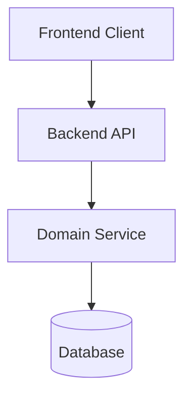

# Architecture Review

Perform an architectural review of proposed features, structural changes, or ticket designs before implementation begins.

## Inputs

- **Target**: A GitHub issue number, proposed feature design, or set of modified files/branches.

## Workflow

### 1. Gather System Context
- Read repository architecture documentation in `openwiki/architecture.md` and related docs in `openwiki/`.
- Inspect data models in `src/` (e.g. Alembic migrations, database models, schemas).
- Inspect API definitions and frontend state structures in `frontend/`.
- Check `AGENTS.md` for architectural rules and conventions.

### 2. Evaluate Architecture Criteria
Analyze the proposal across six core dimensions:

1. **Domain Boundaries & Coupling**: Are backend services, data access layers, background jobs, and frontend components cleanly decoupled?
2. **Data & Schema Evolution**: Are database migrations (Alembic) required? Is backward compatibility preserved?
3. **API Contracts & Event Schemas**: Are API payloads, WebSocket protocols, or internal interfaces properly typed and backwards compatible?
4. **Scalability & Performance**: Are there potential bottlenecks ($O(N^2)$ loops, N+1 queries, blocking calls on event loops)?
5. **Security & Data Integrity**: Are authentication, authorization, and input validation properly enforced?
6. **OpenWiki & Doc Drift**: Will this change alter architecture or workflows in ways that require OpenWiki updates?

### 3. Generate Architecture Review Artifact
Save a Markdown review document to `.opencode/reviews/arch-review-issue-<number>.md` (or artifact directory):

```markdown
# Architecture Assessment: <Feature/Issue Name>

## Executive Summary
- **Verdict**: 🟢 APPROVED | 🟡 APPROVED WITH MITIGATIONS | 🔴 RE-DESIGN REQUIRED
- **Risk Score**: Low | Medium | High

## System Component Diagram


## Detailed Findings
### 1. Structural Design & Boundaries
- Observation & recommendations

### 2. Data & Schema Compatibility
- Observation & recommendations

### 3. Identified Risks & Mitigation Plan
- Risk 1 & mitigation strategy
- Risk 2 & mitigation strategy

## Decision & Action Items
- [ ] Action item 1 for implementation team
- [ ] Action item 2 for implementation team
```

### 4. Output Summary
Return the final verdict, key findings, and link to the generated Architecture Review document.
