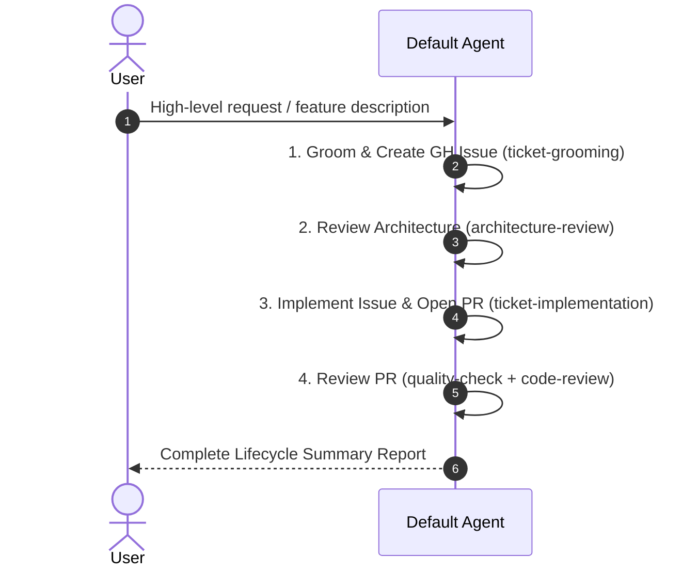

# Autonomous Orchestration

Autonomously execute the complete software development lifecycle: grooming tickets, conducting architecture reviews, implementing changes, and reviewing pull requests. Do this sequentially within the current default agent.

## Workflow Pipeline

## Step-by-Step Execution Protocol

### Step 1: Execute Ticket Grooming
- Instruction: Parse user request, explore repository context, execute `ticket-grooming` skill, and create/groom GitHub Issue.

### Step 2: Execute Architecture Review
- Instruction: Inspect created GitHub Issue, evaluate system boundaries using `architecture-review` skill, and generate assessment.
- Verify verdict: If 🟢 Approved, proceed. If 🔴 Needs Re-design, request clarification or re-grooming from the user.

### Step 3: Execute Ticket Implementation
- Instruction: Implement the approved GitHub Issue using `ticket-implementation` skill (calling `gh-issue-planner` & `gh-issue-executor`), run tests, and open Pull Request.

### Step 4: Execute PR Review
- Instruction: Execute `pr-review` skill on the newly opened PR (combining `quality-check` and `code-review`), verify tests/linters, and post review comments via `gh pr review`.

### Step 5: Present Final Summary Report
Produce a final summary report containing:
- Links to GitHub Issue, Architecture Review artifact, Pull Request, and PR Review.
- Status of all verification test suites.
- Next steps for human merger or deployment.
