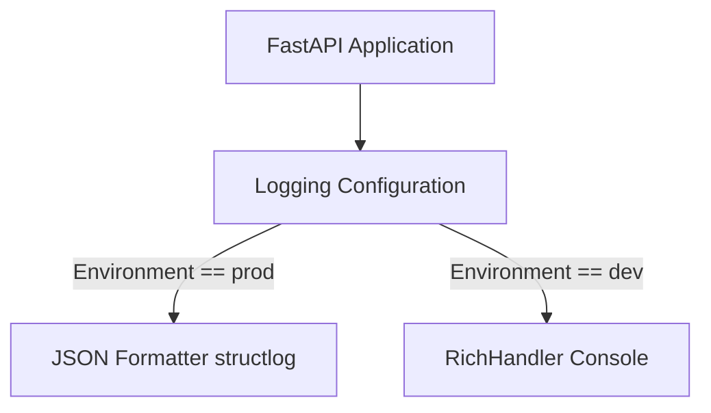

# Architecture Assessment: Add structured JSON logging for production

## Executive Summary
- **Verdict**: 🟢 APPROVED
- **Risk Score**: Low

## System Component Diagram

## Detailed Findings
### 1. Structural Design & Boundaries
- Structlog integration provides robust JSON logging required by observability stacks (Datadog/ELK) without disrupting developer workflows in development.
- The separation using environment variables (`settings.environment`) ensures clean boundaries.

### 2. Data & Schema Compatibility
- Standard library logger will remain compatible; integrating `structlog` will wrap loggers without breaking existing API payloads or schemas.

### 3. Identified Risks & Mitigation Plan
- Risk: Missing request-specific context like `request_id` or `user_id`.
- Mitigation: Use structlog contextvars or middleware to bind standard structured metadata at the beginning of each request.

## Decision & Action Items
- [x] Approved for implementation.
- [ ] Add `structlog` to dependencies.
- [ ] Implement Fastapi middleware or rely on structlog's native contextvars to attach `request_id` and `user_id` context.
- [ ] Maintain `RichHandler` for `dev` environments in `init_logging()`.
