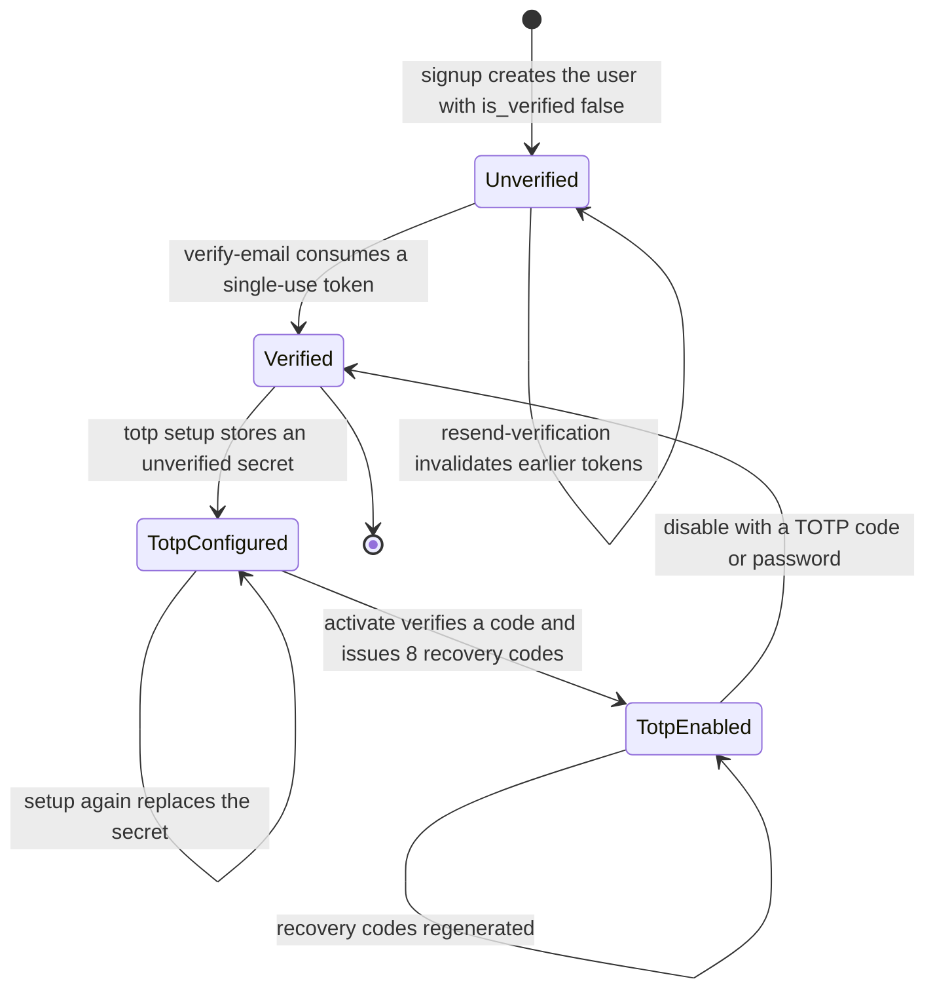
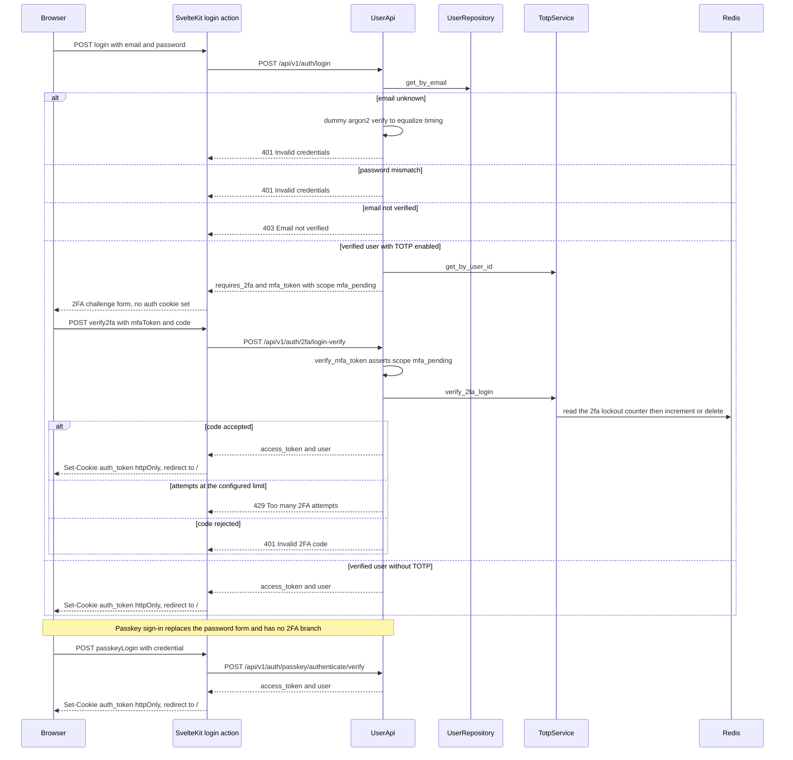

# Authentication & Authorization

Identity is owned by the backend `src/auth` domain and consumed by the SvelteKit frontend, which independently re-verifies the same HS256 secret so it can protect routes before any API call. Three credential types authenticate a user — password (argon2), TOTP with recovery codes, and WebAuthn passkeys — and all three converge on one artifact: a short-lived, scope-tagged JWT that the backend sets as the `httponly` `auth_token` cookie and the SSR layer validates per request.

Two properties shape almost every design decision here:

- **One signing key, many token purposes.** `settings.secret_key` signs the access JWT, the `mfa_pending` JWT, the itsdangerous email-verification token, and the itsdangerous WebSocket ticket. `docker-compose.yml` passes the same value to the frontend service as `JWT_SECRET`.
- **State that must not be lost lives in Redis or PostgreSQL, never in memory.** WebAuthn challenges, the 2FA attempt counter, and the revoked-token denylist are Redis keys; users, verification tokens, TOTP secrets, recovery codes, and passkeys are tables.

## Responsibility map

| Concern | Owner |
|---------|-------|
| Password hashing (argon2) | `UserModel` / `UserSchema` password property (`src/auth/model.py`, `src/auth/schema.py`) |
| Signup, login, JWT mint/decode/revoke, current-user extraction | `UserApi` (`src/auth/api.py`) |
| Ownership checks | `AuthorizationApi` (`src/auth/api.py`) |
| Email verification tokens and resend | `EmailVerificationService` (`src/auth/service.py`) |
| TOTP setup/activate/disable, recovery codes, login-time 2FA + lockout | `TotpService` (`src/auth/service.py`) |
| Passkey registration/authentication ceremonies | `PasskeyService` (`src/auth/service.py`) |
| HTTP surface, rate limits, cookie issuance, audit logs | `auth_router` (`src/auth/router.py`), mounted at `/api/v1` in `src/main.py` |
| Service wiring | `register_auth_services` (`src/auth/__init__.py`) |
| SSR route guard, cookie helpers | `frontend/src/hooks.server.ts`, `frontend/src/lib/server/auth-cookie.ts` |
| Login/2FA/passkey form flows | `frontend/src/routes/auth/login/+page.server.ts`, `frontend/src/lib/components/auth/login-form.svelte` |
| Security settings UI (TOTP, passkeys) | `frontend/src/routes/settings/security/+page.server.ts`, `frontend/src/lib/components/security/securityService.svelte.ts` |

The domain follows the standard backend layering: routers delegate to services and `UserApi`, repositories return Pydantic schemas only, and every component is registered through `svcs` factories — nothing is constructed by hand inside a handler.

## Credential and token inventory

| Credential | Format | Lifetime | Verification and storage |
|-----------|--------|----------|--------------------------|
| Access token | HS256 JWT, `sub` = email, `user_id`, `exp`, `scope="access"`, `jti` | 24 h | `_decode_token`; `jti` checked against the Redis denylist |
| MFA token | HS256 JWT, `sub`/`user_id`/`exp`, `scope="mfa_pending"`, no `jti` | 5 min | `verify_mfa_token` asserts the scope; never accepted as a session |
| Email verification token | `itsdangerous` `URLSafeTimedSerializer`, salt `email-verification`, payload `{email, nonce}` | `settings.email_verification_token_expiry_hours` (default 24 h) | Row in `auth_verification_tokens` plus signature and `max_age` check |
| WebSocket ticket | `itsdangerous` signed JSON `{user_id, jti}`, salt `ws-ticket` | verified with `max_age=30` | Query parameter; single-use Redis key |
| WebAuthn challenge | base64url challenge | `settings.webauthn_challenge_ttl_seconds` (default 300 s) | Redis keys `webauthn:challenge:reg:{user_id}` / `webauthn:challenge:auth:{challenge}` |
| TOTP secret / recovery codes | base32 secret; `xxxxxxxx-xxxxxxxx` codes | persistent | `auth_totp.secret` (plaintext), `auth_recovery_codes.code_hash` (argon2) |

Persistent state lives in five tables (`src/auth/model.py`): `auth_users` (`is_active`, `is_verified`, `last_login_at`, `preferences`), `auth_verification_tokens` (unique `token`, `expires_at`, `is_used`), `auth_totp` (unique per `user_id`), `auth_recovery_codes` (per-user argon2 hashes with `is_used`/`used_at`), and `auth_passkeys` (unique `credential_id`, `public_key`, `sign_count`, `transports`). The TOTP, recovery-code, and passkey tables cascade on user deletion.

## Signup and the verification/2FA lifecycle

`POST /api/v1/auth/signup` (rate-limited `5/minute`) rejects an existing email with **409** — deliberately explicit, unlike resend-verification — then creates the user and sends a verification email. If SMTP fails the account still exists and the endpoint answers **502** telling the client to use resend-verification.

Verification tokens are generated as `URLSafeTimedSerializer(settings.secret_key).dumps({"email": ..., "nonce": uuid4()}, salt="email-verification")`; the nonce keeps successive tokens for the same address distinct. `generate_and_send_verification` first calls `invalidate_tokens_for_user` (marking every earlier token `is_used=True`), then persists a row whose `expires_at` comes from `email_verification_token_expiry_hours`, then hands the token to `EmailService`. `verify_token` requires the row to exist, to be unused, to be unexpired, to pass the serializer's `max_age` check, and to belong to the user whose email is inside the payload; only then does it mark the user verified **and** the token used. A verification link is therefore single-use and superseded by any later resend.

`resend_verification` returns silently for unknown or already-verified addresses (anti-enumeration), and the endpoint answers 502 if the email cannot be sent.

Caption: persisted account states across email verification and TOTP; the login-time 2FA attempt counter is separate transient Redis state, not a state of the account.

Email delivery goes through `EmailService.send_email`, which renders a Jinja HTML and text template from `src/templates/email/`, sends over `aiosmtplib` using the `smtp_*` settings, and raises `EmailSendError` on any failure. The verification link is `{settings.frontend_url}/auth/verify-email?token=...`, so the frontend `/auth/verify-email` load performs the `POST /auth/verify-email` call and renders success or the error message.

## Login and session establishment

`UserApi.login` decides in a fixed order, and the order matters:

1. Look up the user by email. If absent, run a dummy argon2 verification against a pre-computed hash to equalize timing, then raise `AuthInvalidCredentialsError` → **401** `Invalid credentials` (same response as a wrong password).
2. Verify the password with argon2. Failure → 401.
3. If `user.is_verified` is false → `AuthUserUnverifiedError` → **403** `Email not verified`. This is an intentional product decision documented in the router: folding it into the generic 401 would leave users unable to discover why they cannot log in.
4. If a verified TOTP record exists, return `LoginChallengeResponse(requires_2fa=True, mfa_token=...)` with a 5-minute `mfa_pending` token and **no cookie**.
5. Otherwise return an access token and the user.

The router then sets the session cookie and records `last_login_at`; both failed paths emit a warning with `event=auth.login_failure`, and success emits `auth.login_success`. Rate limits: login `10/minute`, 2FA verify `10/minute`, passkey authenticate options and verify `10/minute`, resend `3/minute`. The limiter (`src/config/limiter.py`) keys on the verified `user_id` from the token when it can decode one, otherwise on the remote address.

The `auth_token` cookie written by the backend uses `httponly` and `secure` **only when `settings.environment == "prod"`**, `samesite="lax"`, and `max_age` of 7 days. The frontend SSR actions set the cookie themselves with `httpOnly: true` and `secure: !dev`; because it is `httponly` in both paths, JavaScript never reads the token — SSR code reads it from `cookies.get('auth_token')` and passes it as a Bearer override where needed.

Caption: login through the SvelteKit form action, covering the invalid, unverified, 2FA-challenge, and single-factor branches plus the passkey path, ending in cookie issuance on the response the browser receives.

## Two-factor authentication (TOTP)

All `/auth/2fa/*` routes except `login-verify` require `current_user`; the flow is a strict two-step activation.

- **Setup** (`POST /2fa/totp/setup`) generates `pyotp.random_base32()`, upserts it via `create_or_update` (which resets `is_verified` to `False` on a repeat call), and returns the secret plus an `otpauth://` provisioning URI with issuer `Retail Portfolio`.
- **Activate** (`POST /2fa/totp/activate`) requires an existing secret, verifies the submitted code with `valid_window=1`, marks the record verified, and issues **8** recovery codes of the form `{token_hex(4)}-{token_hex(4)}`. Only argon2 hashes are stored, and any previous codes are deleted first.
- **Status** (`GET /2fa/status`) reports `totp_enabled` plus the count of unused recovery codes.
- **Regenerate** (`POST /2fa/totp/recovery-codes/regenerate`) requires TOTP to be verified and replaces all codes; the plaintext values are returned exactly once.
- **Disable** (`POST /2fa/totp/disable`) accepts **either** a valid TOTP code **or** the account password (`TotpDisableRequest.code` / `.password`), deletes the TOTP record and all recovery codes, and logs `auth.totp_disabled`.

Login-time verification (`TotpService.verify_2fa_login`) is where the lockout lives:

1. Read `2fa:lockout:{user_id}` from Redis. If the counter is at or above `settings.totp_max_attempts` (default 5), raise **429** `Too many 2FA attempts. Try again later.` — before any code is checked.
2. Load the verified TOTP record; a missing or unverified record simply fails the verification.
3. A 6-digit numeric code is checked against `pyotp` with `valid_window=1`. Anything else is treated as a recovery code: every active hash is verified with argon2, and a match marks that code used so it can never be replayed.
4. On success the Redis counter is deleted; on failure it is incremented and given `settings.totp_lockout_seconds` (default 900 s) as TTL.

`POST /2fa/login-verify` additionally re-loads the user from the `mfa_pending` token's `user_id` and requires `is_active`, then mints the access token, sets the same 7-day cookie, and updates `last_login_at`. Expired, forged, or `access`-scope tokens presented as an `mfa_token` are rejected — the scope assertion is bidirectional: an `mfa_pending` token is equally rejected by every authenticated endpoint.

## Passkeys (WebAuthn)

`PasskeyService` wraps the `webauthn` library with a Redis-backed, single-use challenge protocol.

- **Registration** (`POST /passkey/register/options` → `verify`): options are generated with `webauthn_rp_id` / `webauthn_rp_name`, the user's UUID bytes, and `exclude_credentials` built from the user's existing passkeys; `resident_key` and `user_verification` are both `PREFERRED`. The challenge is stored at `webauthn:challenge:reg:{user_id}` with `webauthn_challenge_ttl_seconds`. Verification consumes the challenge atomically with `getdel`, so a replayed registration fails with 400, and calls `webauthn.verify_registration_response` against `webauthn_rp_id` and `webauthn_origin` with `require_user_verification=False` (a deliberate consumer-passkey policy choice documented as ARCH-T08 in the source comments).
- **Authentication** (`POST /passkey/authenticate/options` → `verify`): the options call is unauthenticated and rate-limited; when an email is supplied it looks up that user's passkeys for `allow_credentials` (an empty or unknown email still returns usable options). The challenge is stored at `webauthn:challenge:auth:{challenge}`. Verification parses the credential, resolves the passkey by credential id (**401** if unknown), requires the owning user to be active and **403** if the user's email is unverified, consumes the challenge with `getdel` (**400** if expired), verifies the assertion, and then persists the new `sign_count` and `last_used_at`.
- **Management** (`GET /passkeys`, `PATCH /passkeys/{id}`, `DELETE /passkeys/{id}`) always scopes by the authenticated user; a passkey belonging to someone else is reported as **404** `Passkey not found`.

Successful passkey authentication returns `AuthResponse` and the router sets the same cookie and updates `last_login_at` — passkey login is a first-class session path, not an add-on to the password flow.

## Logout, revocation, and the denylist

`POST /api/v1/auth/logout` is idempotent: it reads the token from the `auth_token` cookie or the Bearer header, calls `UserApi.revoke_token`, and always deletes the cookie. `revoke_token` decodes the token, ignores invalid or already-expired tokens silently, and otherwise writes `token:deny:{jti}` to Redis with `setex` for the token's *remaining* lifetime — so the denylist self-cleans and can never outlive the token it blocks. `get_current_user_from_token` checks that key before loading the user and answers **401** `Token revoked`; revocation failures during logout are logged but never block the response.

The SvelteKit logout action (`frontend/src/routes/auth/logout/+page.server.ts`) is deliberately aggressive about the local cookie — `deleteAuthCookie` plus an empty value with `expires: new Date(0)` — but it does **not** call the backend. `AuthService.logout()` exists and would hit `POST /auth/logout`, yet no caller in the app invokes it, so today's UI logout drops the session cookie while leaving the JWT valid until expiry. Treat backend-side revocation as an explicit integration step, not something the logout route performs for you.

## Frontend session handling

### SSR guard

`frontend/src/hooks.server.ts` runs on every request:

- With no `auth_token` cookie, unauthenticated requests to any path outside `/auth*` are redirected (303) to `/auth/login`.
- With a cookie, `jose.jwtVerify(token, secret, { algorithms: ['HS256'] })` verifies the signature and expiry using `JWT_SECRET` from `$env/static/private` — the same value the backend signs with.
- A verified token whose `scope` is not `access` (for example `mfa_pending`) has its cookie deleted and is treated as unauthenticated; this mirrors the backend's scope check on purpose.
- Any verification failure deletes the cookie through `deleteAuthCookie`.
- Authenticated users hitting `/auth/login` or `/auth/signup` are redirected to `/`; a `clear_session=true` query parameter on those two pages forces the cookie away and renders the login page, breaking the redirect loop that a stale cookie used to cause.

`frontend/src/lib/server/auth-cookie.ts` holds `AUTH_COOKIE_OPTS` (`path: '/'`, `httpOnly: true`, `sameSite: 'lax'`, `secure: !dev`). Browsers only honor a delete when the attributes match the stored cookie, so this object must stay in sync with the `cookies.set('auth_token', ...)` calls in the login actions.

### Per-load 401 recovery

Server loads pass `cookies.get('auth_token')` to the API clients as a Bearer override (`ApiClient` also sends `credentials: 'include'`, so both transports work). When a load catches an `ApiError` with status `401`, it deletes the cookie and throws `redirect(303, '/auth/login?clear_session=true')`; other statuses become `error(status, message)`. This pattern is repeated in `/`, `/accounts/[id]`, `/brokers`, `/security/[security_id]`, and `/settings/security`, and `settings/security` additionally redirects up front when no token is present. The login form surfaces the backend's 403 with the "Email not verified. Please check your inbox for a verification link." message.

### Login UI

`frontend/src/lib/components/auth/login-form.svelte` owns the three login presentations: the credential form, the 2FA challenge (6-digit code by default, with a toggle for 8-character recovery codes), and a "Sign in with a Passkey" button that calls `authService.getPasskeyAuthOptions`, runs `startAuthentication`, and posts the serialized credential to the `passkeyLogin` action. The `verify2fa` action keeps `requires2fa`/`mfaToken` in the failure payload so a wrong code returns the user to the challenge rather than to the password form.

### Security settings

`/settings/security` loads `get2FaStatus` and `getPasskeys` in parallel and hands them to `SecuritySettings`, which binds `SecurityService` (`$state` based, provided through Svelte context) to `SecurityClient`: `/auth/2fa/status`, `/auth/2fa/totp/{setup,activate,disable}`, `/auth/2fa/totp/recovery-codes/regenerate`, `/auth/passkey/register/{options,verify}`, and `/auth/passkeys`. `SecurityService.registerPasskey` drives `startRegistration` in the browser and translates `NotAllowedError`/`InvalidStateError` into user-facing errors, then appends the returned passkey to local state.

## WebSocket ticket

The browser cannot send the `httponly` cookie in a way the WebSocket handshake handler trusts alone, so the client first exchanges its session for a short-lived signed ticket:

- `POST /api/v1/auth/ws-ticket` requires the `auth_token` cookie (it is not a Bearer-authenticated route), validates it via `UserApi.get_current_user_from_token`, and returns `{"ticket": URLSafeTimedSerializer(settings.secret_key).dumps(json.dumps({"user_id": ..., "jti": uuid4()}), salt="ws-ticket")}`.
- `GET`-upgraded `/api/ws` (`src/ws/router.py`) prefers the `ticket` query parameter: it first marks `ws-ticket-used:{sha256(ticket)}` in Redis with `SET NX EX 30` (a replay, or a Redis error — the check fails open — is handled separately), then `serializer.loads(ticket, max_age=30, salt="ws-ticket")`. Without a ticket it falls back to the `auth_token` cookie or `sec-websocket-protocol` header verified through `UserApi`. Any failure closes the socket with code **1008**.
- `frontend/src/lib/components/accounts/accounts-list.svelte.ts` fetches a ticket through `authService.getWsTicket()` and connects to `/api/ws?ticket=...`, reconnecting every 5 seconds on close. The worker dashboard WebSocket (`src/worker_dashboard/router.py`) reuses the same `ws-ticket` and replay helper, while its REST task routes are gated by `Depends(current_user)`.

## Ownership authorization

`AuthorizationApi.check_entity_owned_by_user(user, entity, field="user_id")` raises **404** `Entity does not exist` whenever the entity is `None` **or** owned by another user — the two cases are indistinguishable from outside, which is the point: a 403 would confirm that the resource exists. `check_entity_owned_by_user_from_token` resolves the user from a token first, and `src/main.py` maps `AuthorizationError` to 404 as well, so the convention holds for service-raised errors too. Account, portfolio, and integration routers call this helper instead of comparing `user_id` inline.

## Security invariants

These are contracts a change must not silently break. Each is enforced in code today and has a test or a comment pinning the intent.

1. **Token scope check, both sides.** `get_current_user_from_token` rejects anything whose `scope` is not `access` with 401; `verify_mfa_token` asserts `scope == "mfa_pending"`; the SSR guard rejects non-`access` scopes. A new token type must be an explicit new scope, and no code path may treat an `mfa_pending` token as a session.
2. **The HS256 secret is shared with the frontend SSR guard.** `SECRET_KEY` in the backend and `JWT_SECRET` in the frontend are the same value (wired by `docker-compose.yml`), and that key also signs verification tokens and WS tickets. Changing the algorithm, rotating the key, or splitting deployments requires changing both sides and all four token purposes together; the guard comment points at ARCH-T09 for the migration path (RS256 or backend introspection).
3. **Email verification is required before login.** `UserApi.login` raises the 403 unverified branch before any token is minted; `is_verified` defaults to `False` on the model and schema.
4. **Verification tokens are single-use and superseded.** Any new token invalidates all previous ones for the user, and a successful verification marks the row used. Removing either the `invalidate_tokens_for_user` call or the `mark_as_used` call reopens replay of old links.
5. **Authorization returns 404, not 403.** `check_entity_owned_by_user` and the `AuthorizationError` handler both use 404 so existence is not leaked.
6. **Redis-backed challenge, lockout, and denylist state is authoritative.** WebAuthn challenges are consumed with `getdel` (single use), the 2FA counter gates verification before any code comparison and carries a TTL, and revoked tokens are denied for their remaining lifetime. Any code path that bypasses these (for example a Redis-less fallback that accepts a challenge) breaks the guarantee.
7. **The cookie contract is symmetric.** `AUTH_COOKIE_OPTS` must match the `cookies.set('auth_token', ...)` calls, or deletes silently no-op and users stay "logged in" with a dead session.
8. **The `auth_token` cookie is `httponly`.** Both the backend (in prod) and the SSR actions set it that way, and all browser-side access goes through SSR loads rather than JavaScript. The token is additionally returned in the JSON body for Bearer clients — that is a deliberate convenience with an extra exposure surface.
9. **Auth tests must mock every outbound dependency.** Backend tests must not touch Redis, SMTP, or any HTTP API; the autouse `fake_redis_manager` fixture swaps the shared Redis client, email sending is patched, and EODHD/broker gateways are stubbed. Frontend tests must mock every API client and SvelteKit module they touch. See `src/AGENTS.md` and `frontend/AGENTS.md` — a test that dials a real service is broken by definition, not a service-availability problem.
10. **Rate limits stay on the sensitive routes.** Signup, login, 2FA verify, resend, and both passkey authenticate routes are decorated with `@limiter.limit`, keyed by verified identity or IP.

## Configuration and operations

- `secret_key`: validated at startup to be present and at least 32 characters outside `dev`/`test` (`src/config/settings.py`); `.env.example` ships a throwaway dev key and documents `openssl rand -hex 32`. In production the frontend service receives the same value as `JWT_SECRET`.
- 2FA: `totp_max_attempts` (default 5) and `totp_lockout_seconds` (default 900).
- WebAuthn: `webauthn_rp_id`, `webauthn_rp_name`, `webauthn_origin`, and `webauthn_challenge_ttl_seconds` (default 300). A wrong `webauthn_origin` fails every ceremony, so it must match the browser's origin.
- Email: `smtp_host`, `smtp_port`, `smtp_use_tls`, `smtp_user`, `smtp_password`, `smtp_sender_email`, and `email_verification_token_expiry_hours` (default 24). Dev compose points SMTP at `mailcrab`.
- Dev tooling: `src/auth/commands/create_test_token.py` interactively mints an HS256 access token valid for **365 days** from the same secret, and `src/auth/commands/create_test_user.py` inserts a user without marking it verified. Both are operator conveniences that bypass login and email verification — never expose them.
- Audit trail: successful logins, 2FA verification, TOTP enable/disable, passkey register/delete, and passkey login all emit structured `event` logs with `user_id`; failed logins emit `auth.login_failure` with the attempted email.

## Extension points

- **A new login factor** slots in as a service under `src/auth/service.py`, a route group on `auth_router`, and a branch in `UserApi.login` (or a standalone endpoint like the passkey verify route) — but it must end by minting tokens through `UserApi.create_access_token` and set the cookie the same way, so the SSR guard and `/2fa/*` routes keep working.
- **A new token purpose** means a new `scope` value plus a matching assertion on both the backend and the SSR guard; reuse the `jti` + `token:deny:` mechanism if the token should be revocable.
- **Resource authorization for a new domain** should call `AuthorizationApi.check_entity_owned_by_user` rather than comparing ids, to keep the 404 semantics uniform.
- **Frontend auth UI** belongs in `frontend/src/lib/components/security/` (state in `securityService.svelte.ts`, calls in `securityClient.ts`); components should not call `fetch` directly.

## Focused tests

- `tests/routers/test_auth.py` is the reference suite: signup/login/unverified paths, verification-token success and rejection, 2FA challenge without a cookie, TOTP and recovery-code verification, reused recovery code, lockout (429) and counter reset, expired and forged MFA tokens, rejection of `mfa_pending` tokens on authenticated endpoints, passkey register/authenticate incl. challenge expiry and replay, logout denylist, `last_login_at`, and audit logging.
- `tests/services/test_auth_api.py` covers `UserApi` decisions directly (challenge vs. session, unknown-email error parity, revoked-token rejection) and `tests/services/test_auth_services.py` covers the TOTP, recovery-code, email-verification, and passkey services including lockout and replay.
- `tests/ws/test_router.py` covers ticket replay (`_check_ticket_not_replayed`), invalid signatures, valid tickets, and cookie/header token fallbacks, all against the in-memory Redis fake.
- Frontend: `frontend/src/hooks.server.test.ts` signs tokens with `jose` in-test (mocking `$env/static/private` to supply `JWT_SECRET`) and asserts the scope/expiry/redirect/`clear_session` behaviors; `frontend/src/routes/auth/login/page.server.test.ts` asserts cookie setting and the 2FA/passkey/403 branches for the form actions.
- Never let these tests reach SMTP, Redis, or the network. The backend fixtures patch email sending and swap the Redis client (`tests/fixtures/auth.py`, `tests/fixtures/redis.py`); frontend tests mock the API clients and SvelteKit runtime modules.
