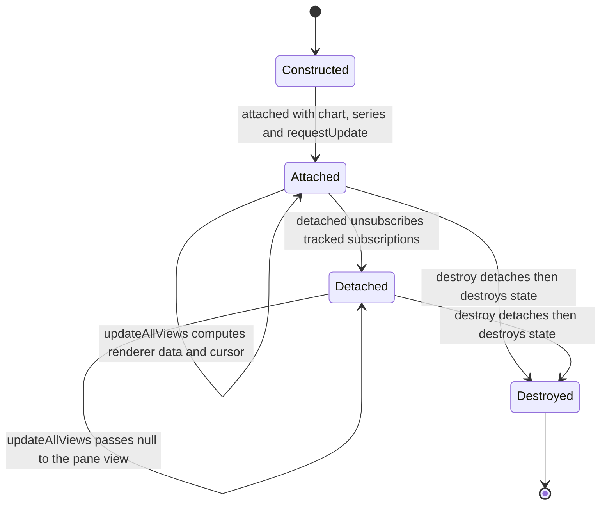
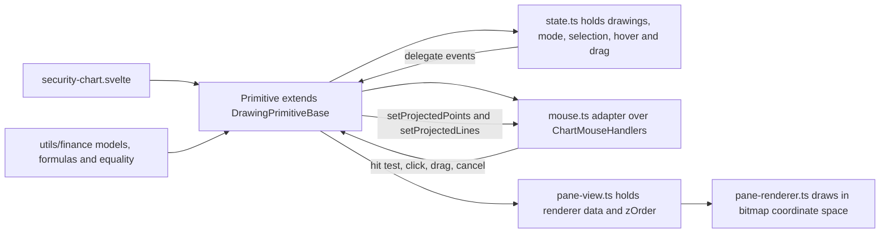
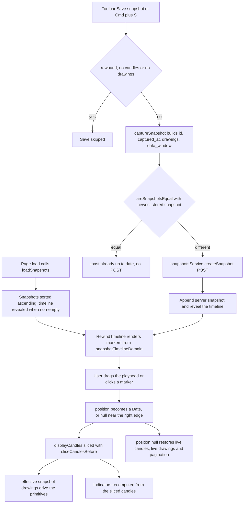

The chart drawing system has three layers that must stay separate: **primitives** (lightweight-charts series primitives that own interaction and canvas rendering), **helpers** (shared plumbing under `plugins/helpers/`), and **pure finance math** (`$lib/utils/finance/`). Above them sits one page-owned orchestrator, `ChartDrawingsService`, which is the only thing that persists drawings, keeps undo/redo history, and saves/loads rewind snapshots. This page documents the contracts inside each layer, the per-plugin directory rules, and the snapshot → rewind data path.

| Layer | Location | Owns |
|---|---|---|
| Primitives | `frontend/src/lib/components/charts/plugins/<plugin>/` | state, mouse adapters, pane views, canvas renderers |
| Shared helpers | `frontend/src/lib/components/charts/plugins/helpers/` | delegate, time projection, mouse engine, bitmap geometry, primitive bases, renderer utilities |
| Finance math | `frontend/src/lib/utils/finance/` | drawing/fib/wave models, formulas, equality, snapshots, history, timeline-free pure helpers |
| Orchestration | `frontend/src/lib/services/ChartDrawingsService.svelte.ts` | active tool/selection state, preference persistence, undo/redo, snapshot save/dedupe, rewind mode |
| Persistence | `src/market/*` + `frontend/src/lib/api/snapshotsService.ts` | `market_chart_snapshots` table, user-scoped CRUD, HTTP surface |
| Timeline UI | `rewind-timeline.svelte` + `rewind-timeline.ts` | track geometry, markers, playhead, scrubbing |

## The per-plugin directory contract

Each drawing tool lives in `frontend/src/lib/components/charts/plugins/<plugin-name>/` with the same responsibility split (the rule is written down in `frontend/AGENTS.md`):

| File | Responsibility |
|---|---|
| `state.ts` | Tool state, drawing collections, active mode, selection, hover/drag targets; fires `Delegate` events. Domain data only — never DOM or chart coordinates. |
| `mouse.ts` | Thin adapter over `ChartMouseHandlers`; supplies `hitTestRadius`, `toTarget`, optional `adjustPosition` snapping and `hitTestLine`. |
| `pane-renderer.ts` | Implements `IPrimitivePaneRenderer`; draws shapes, handles, previews and labels inside `useBitmapCoordinateSpace`. |
| `pane-view.ts` | Implements `IUpdatablePaneView<TRendererData>`; holds renderer data and returns the renderer with a `zOrder`. |
| `constants.ts` | Visual constants: hit-test radii, line widths/dashes, colors, opacities, label metrics, per-degree configuration. |
| `index.ts` | Barrel exporting the primitive, state, renderer, view, mouse adapter and public types/constants. |

The primitive itself is not named consistently: `elliott-wave/elliott-wave.ts`, `fibonacci/fibonacci-primitive.ts`, and `<tool>-primitive.ts` for `measure`, `horizontal-line` and `free-form-line`. `user-price-alerts/` additionally carries `irenderer-data.ts`, `renderer-base.ts` and `price-scale-pane-renderer.ts`, and has **no** `index.ts` barrel.

Two rules hold the structure together:

- **No cross-plugin imports.** A plugin must never import from a sibling plugin directory (`fibonacci` never imports `elliott-wave`). Anything shared moves to `plugins/helpers/` or `$lib/utils/finance/`. The elliott-wave barrel demonstrates the pattern: it re-exports `TimeProjector`, the time helpers and the snap helpers from `../helpers/...`, never from a peer plugin.
- **No finance formulas in plugins.** Ratios, wave validation, measurement math and equality rules live in `$lib/utils/finance/`; renderers, views and mouse adapters only project and draw.

## `DrawingPrimitiveBase`: the primitive lifecycle

`DrawingPrimitiveBase<TRendererData, TPaneView, TState, TMouseHandlers, THoverTarget, TDragTarget>` is the abstract base implementing `ISeriesPrimitive<Time>`. It declares three contract interfaces plugins satisfy — `IDrawingToolState`, `IUpdatablePaneView`, `IDrawingMouseHandlers` — and centralizes lifecycle, subscription tracking, cursor resolution and pane-view updates. Subclasses implement `_calculateRendererData()` and may extend `_setupSubscriptions()`.

Primitive lifecycle: `attached` binds the projector and mouse handlers and tracks every subscription; `detached` releases them; `destroy` runs `detached()` then destroys the state delegates. `updateAllViews` is safe in any state.

`attached({ chart, series, requestUpdate })` stores the references, calls `timeProjector.attach(chart)`, calls `mouseHandlers.attached(chart, series, timeProjector)`, pushes the current drawing mode into the mouse handlers, then wires the standard delegates:

| Delegate | Reaction |
|---|---|
| `state.drawingModeChanged()` | push mode into mouse handlers + request update |
| `mouseHandlers.mouseMoved()` | request update while in drawing mode (drives previews) |
| `mouseHandlers.pointHovered()` | `state.setHoveredPoint(target)` + update when hover state actually changed |
| `mouseHandlers.dragStarted()` / `dragEnded()` | set/clear `state.setDraggingPoint(...)` + update |
| `mouseHandlers.chartClicked()` | in drawing mode, `state.addPoint({ time, price })` + update |
| `mouseHandlers.cancelRequested()` | `cancelDrawing()` (state hook when present, otherwise clear the mode) |

Every subscription goes through `_subscribe()` / `_subscribeToUpdate()` and lands in `_trackedSubscriptions`. `detached()` iterates that set calling `sub.unsubscribeAll(this)`, clears it, calls `mouseHandlers.detached()` and unsets `_chart` / `_series` / `_requestUpdate`. `destroy()` calls `detached()` then `state.destroy()`. `setCandles(candles)` forwards to the `TimeProjector` and requests an update; the elliott-wave and fibonacci primitives override it to also push candles into their mouse adapter (used for wick snapping).

`updateAllViews()` early-returns into `paneView.update(null)` when the chart or series reference is missing, otherwise it computes renderer data, resolves the cursor and pushes data into the pane view. Cursor precedence in `_updateCursor()` is: dragging → `'default'`, drawing mode → `'crosshair'`, hovering a point → `'default'`, otherwise `null`. `hitTest()` returns `null` for a `null` cursor, otherwise `{ cursorStyle, externalId, zOrder: 'top' }`; the `externalId` (for example `'elliott-waves-primitive'`, `'fibonacci-primitive'`, `'measure-primitive'`, `'horizontal-line-primitive'`, `'free-form-line-primitive'`) is what lightweight-charts reports back to the page's own hit testing.

## `BaseCollectionToolState`: shared collection state

The newer tools (`measure`, `horizontal-line`, `free-form-line`) share `BaseCollectionToolState<TDrawing, TTarget>` from `helpers/primitive/base-collection-state.ts`, which implements `IDrawingToolState`. It owns:

- the drawing array, pending (in-progress) points, `_selectedId`, hovered point, hovered line and dragging target;
- six delegates: `drawingsChanged`, `drawingModeChanged`, `selectionChanged`, `hoverChanged`, `hoveredLineChanged`, `dragChanged`;
- an injectable `idFactory` (default `generateUUID` from `$lib/utils/finance/rewind`).

Two behaviors are load-bearing:

- **Anchor normalization on ingestion.** `_normalizePoint` runs `normalizeDrawingTime`, and `setDrawings` normalizes every drawing (assigning ids where missing) before comparing against the existing collection with `areDrawingCollectionsEqual`. Equal input is a no-op — that equality guard is what prevents the reactive feedback loop between a primitive and the chart's `$effect` sync.
- **Consistent selection lifecycle.** `setDrawings` and `removeDrawing` drop a selection that no longer exists and fire `selectionChanged`; `setDrawingMode(true)` clears the selection, and leaving drawing mode (or `cancelDrawing()`) discards pending points and fires `drawingsChanged` only when there were any.

`_addTwoPointDrawing(point)` pushes the anchor, and on the second point commits `{ id, p1, p2, visible: true }`, clears pending points and exits drawing mode. `_updateTwoPointDrawing(id, pointIndex, update)` rewrites just that anchor (normalizing the time) and returns `false` for an unknown id. The three plugins specialize on top of that:

| Plugin | `addPoint` | Drag semantics |
|---|---|---|
| `measure` | delegates to `_addTwoPointDrawing`, but the primitive first snaps the second click to horizontal/vertical via `snapMeasureAngle` (15° threshold) | either endpoint moves freely, with the same angle snap applied while dragging |
| `horizontal-line` | commits immediately on a single click (`{ id, p1, visible: true }`) and exits drawing mode | price only — the anchor time is never mutated, so the line stays horizontal |
| `free-form-line` | delegates to `_addTwoPointDrawing` | both endpoints move freely in time and price |

The three newer plugins also use `DelegatingPaneView` (renderer + `zOrder`, forwarding `update(data)`) instead of hand-written pane views; `fibonacci` and `elliott-wave` keep their own `pane-view.ts` implementations that do the same thing inline.

Plugin layer split: the primitive owns state, a mouse adapter, a pane view and a renderer; shared plumbing comes from `helpers/` and all math from `utils/finance`.

## Plugin specifics

### Elliott Wave

`ElliottWaveState` holds degree (`cycle` | `primary` | `intermediate`), wave type (`impulse` | `corrective`), the `DegreeWaveCount[]` collection, the in-progress wave id, selection (`selectedDegree` + `selectedWaveId`) and hover/drag targets. `addPoint` creates a new wave with a `generateUUID()` id when needed, assigns the next label (`0..5` for impulse, `[0, 'A', 'B', 'C']` for corrective), records `wave3Target` / `wave5Target` as points 3 and 5 are placed, and exits drawing mode once `MAX_IMPULSE_POINTS` (6) or `MAX_CORRECTIVE_POINTS` (4) is reached. `updatePoint` locates the wave by id → selected wave → degree and keeps the targets in sync when point 3 or 5 moves. `clearWave(waveIdOrDegree?)` removes the selected wave, the wave with that id, the latest wave of a degree, or the last wave overall, and `removeWave` clears any hover/drag/selection referencing it. All anchors are normalized to epoch seconds on ingestion via `normalizeDrawingTime`.

`elliott-wave/constants.ts` defines the per-degree visual configuration (`CYCLE_STYLE`, `PRIMARY_STYLE`, `INTERMEDIATE_STYLE`, `DEGREE_STYLES`) including the Roman-numeral / circled-number / parenthesised label conventions. The mouse adapter snaps through `adjustPosition`: a candle-wick candidate (only when `snapToWicks` is on) and a Fibonacci-level candidate (only when the nearest active level is within the pixel tolerance, independent of `snapToWicks`), returning the closer one with pixel-space ties going to the wick. Fibonacci levels are *pushed in* from the page (`setFibLevelPrices`) because the elliott plugin may not import the fibonacci plugin.

### Fibonacci

`FibonacciToolState` manages a `retracement` (2 anchors) and an `extension` (3 anchors) drawing plus `_pendingPoints`. `addPoint(point, tool?)` implements the click progression: two clicks complete a retracement, three complete an extension; on completion it stores the drawing, clears pending points and exits drawing mode. `updatePoint(tool, pointIndex, update)` supports per-index drag updates, `clear(tool?)` clears one or both tools (also clearing hover/drag/selection referencing them), and every mutation fires `drawingsChanged` with a defensively copied `SecurityFibonacciTools`. `setDrawings`/`setRetracement`/`setExtension` normalize anchors through the finance-layer normalizers and drop a selection whose drawing disappeared.

The plugin's mouse adapter supplies `hitTestRadius: HIT_TEST_RADIUS` (14 px), maps hits to `{ tool, pointIndex }`, adds line hit-testing against projected level lines (distance to the clamped x-range), and snaps placed points to candle wicks via `adjustPosition`. `FibonacciPrimitive` wires the shared delegates in `_setupSubscriptions`, computes projected points/levels in `_calculateRendererData` using `TimeProjector` + `series.priceToCoordinate`, and exposes `doubleClicked()` which the page turns into the fib width modal.

### Measure, Horizontal Line, Free-Form Line

- `MeasurePrimitive` snaps the second click and each drag to horizontal/vertical using `snapMeasureAngle` against the opposite endpoint, and builds its label from the pure `computeMeasure` + `formatMeasureLabel(delta, percent, { bars, elapsedSeconds })` helpers (bar count from logical indices, elapsed from the epoch anchors).
- `HorizontalLinePrimitive` commits on one click, drags price only, and formats the price label with the series price formatter; `setHideLabels(bool)` toggles the label (wired to the chart's hide-labels preference).
- `FreeFormLinePrimitive` places a two-point segment whose endpoints drag freely in time and price.
- All three mouse adapters are thin `ChartMouseHandlers` subclasses that key targets by `{ id, pointIndex }` (or `{ id }` for the horizontal line) and hit-test the connecting segment with `pointToSegmentDistance`.

### `user-price-alerts`: the deliberate exception

`frontend/src/lib/components/charts/plugins/user-price-alerts/` renders price alerts as a series primitive but is **not** built on `DrawingPrimitiveBase`. It has its own `MouseHandlers` (it needs pointer positions over the price scale, which the shared handler clips away) and exposes both pane views and **price-axis pane views**:

- `UserPriceAlerts.attached` creates one `UserAlertPricePaneView(false)` and one `UserAlertPricePaneView(true)`, attaches the mouse handlers and subscribes `alertsChanged`, `mouseMoved` and `clicked` to `requestUpdate`. A click inside the price-scale button column (`xPositionRelativeToPriceScale` within the button width) adds an alert at `series.coordinateToPrice(y)`; a click on a hovered alert's remove button removes it.
- `updateAllViews` computes renderer data **once** for both renderers, finds the alert closest to the pointer within `showCentreLabelDistance`, and sets `_hoveringID` / `_currentCursor = 'pointer'` when the pointer is over the add button or a remove button. `hitTest()` reports `externalId: 'user-alerts-primitive'`.
- `UserAlertsState` stores alerts in a `Map`, exposes `alertAdded` / `alertRemoved` / `alertChanged` / `alertsChanged` delegates, keeps a price-descending array view (`_updateAlertsArray`), and generates random 6-digit ids, regenerating on collision.
- Its renderers extend `PaneRendererBase` and use `positionsLine` for the alert line, the centre label, its divider and the price-scale label.

## Shared plumbing in `plugins/helpers/`

### `helpers/delegate.ts`

`Delegate<T1>` + `ISubscription<T1>` implement the publisher/subscriber surface used by every state class and mouse adapter: `subscribe(callback, linkedObject?, singleshot?)`, `unsubscribe(callback)`, `unsubscribeAll(linkedObject)`, `fire(param)`, `hasListeners()` and `destroy()`. Two semantics matter:

- `linkedObject` is the ownership handle: primitives pass `this` and later call `unsubscribeAll(this)`, which makes cleanup exhaustive instead of best-effort.
- Single-shot listeners are removed **before** the callback runs, and `fire` iterates a snapshot of the listener list, so a callback that subscribes or unsubscribes during dispatch cannot corrupt the loop.

### `helpers/time/`

- `time.ts`: `DEFAULT_FUTURE_BARS = 100`, `timeToEpochSeconds` / `epochSecondsToTime` (shape-preserving round trip across `UTCTimestamp` / date string / `BusinessDay`), `addIntervalToTime`, `barsBetweenTimes`, `computeIntervalSeconds` (median spacing of the last candles), `resolveAnchorEpoch`, `generateFutureWhitespace`.
- `time-projector.ts`: `TimeProjector` binds to the chart (`attach`) and to the data (`updateCandles`), then projects coordinates ↔ time. Inside the historical range it delegates to `timeScale().timeToCoordinate` / `coordinateToTime`; beyond the last candle it extrapolates from the last time plus whole bar intervals and maps them through logical bar indices. `epochToCoordinate(epoch)` is the drawing-anchor entry point: it snaps the epoch to the candle **at or before** it (`resolveAnchorEpoch`, clamped to the first candle) and reuses the future-projection path for anchors past the last candle. This is what lets a drawing created on one timeframe land on the containing bar of every other, and what lets wave points and fib anchors live in the future whitespace.

### `helpers/mouse/`

`ChartMouseHandlers<TPoint, TTarget, TOriginal>` is the shared interaction engine:

- **Config**: `hitTestRadius`, `toTarget(point)`, optional `adjustPosition(pos, series)` and `hitTestLine(x, y)`.
- **DOM lifecycle**: mousemove/mousedown/mouseup/click/dblclick/mouseleave/contextmenu on the chart element, plus window-level `mouseup` and `keydown`, all removed in `detached()` along with every delegate.
- **Plot-area clipping**: `_determineMousePosition` subtracts the price-scale width and time-scale height, so points outside the plot area carry `time: null` / `price: null` and are never turned into placements.
- **Hit-testing contract**: distance ≤ `hitTestRadius` is a hit (boundary inclusive) and exact-distance ties resolve first-wins by array order, so overlapping anchors are deterministic.
- **Drag lifecycle**: mousedown on a hit starts a drag, disables `pressedMouseMove` scroll and fires `dragStarted`; moves fire `pointDragged` with the (optionally snapped) position; any drag move sets `_dragHappened`, which suppresses the trailing `click` and `dblclick` so a drag never also places or selects a point; mouseup (chart **or** window) restores scroll and fires `dragEnded`.
- **Drawing mode**: `setDrawingMode(true)` disables pressed-move scroll and hides the horizontal crosshair line; clicks inside the plot area fire `chartClicked` with the (optionally snapped) time/price/x/y.
- **Cancellation**: right-click (`contextmenu`) and `Escape` fire `cancelRequested` while in drawing mode.

`helpers/mouse/snap.ts` provides the pure snapping helpers: `snapPriceToWick(price, candle)` (ties resolve to `high`), `findNearestLevel(price, levelPrices)` (finite-value filtering; pixel tolerance stays the caller's job), `buildCandleLookup(candles)` and `findCandleByTime(lookup, time)` (O(1) lookup keyed by normalized epoch seconds). `helpers/mouse/geometry.ts` provides `pointToSegmentDistance`, used by the measure and free-form-line line hit tests.

### `helpers/dimensions/` and `helpers/renderer/`

`positionsLine(positionMedia, pixelRatio, desiredWidthMedia, widthIsBitmap?)` returns `{ position, length }` in bitmap pixels, rounding the scaled position and centring the line width on it. `positionsBox(position1Media, position2Media, pixelRatio)` returns the box start and a length of `abs(delta) + 1` (the +1 keeps a 1 px box visible). `BitmapPositionLength` comes from `dimensions/common.ts`.

`helpers/renderer/` layers two reusable drawing routines on top of that math: `drawAnchorHandle(ctx, point, hpr, vpr, options?)` draws the anchor dot with optional hover/drag rings (and is what `fibonacci`, `measure`, `horizontal-line` and `free-form-line` use for handles), and `drawChartLabel(ctx, config, hpr, vpr)` draws a pixel-aligned text box with an optional accent bar (`measure` and `horizontal-line` use it for price/measure labels). Both are exported from the `helpers/renderer` barrel together with the shared handle and label constants.

**Rule for new canvas code**: never draw with raw media coordinates — work inside `target.useBitmapCoordinateSpace(...)` and derive pixel-snapped geometry with `positionsLine`/`positionsBox` so 1 px lines and handles stay crisp on high-DPI displays.

## The finance-math boundary

All formulas, models, equality rules and snapshot algebra live in `frontend/src/lib/utils/finance/` with colocated unit tests. Plugins consume them and never re-implement them.

| Module | Contents relevant here |
|---|---|
| `drawing-time.ts` | `normalizeDrawingTime` — the canonical epoch-seconds conversion for every drawing anchor |
| `drawings.ts` | `DrawingPoint`, `MeasureDrawing`, `HorizontalLineDrawing`, `LineDrawing`, `SecurityDrawings`/`SecurityDrawingsMap`, `updateSecurityDrawings`, `addOrReplaceDrawing`, `removeSecurityDrawings`, `isSecurityDrawingsEmpty`, `normalizeSecurityDrawings`, structural equality helpers |
| `measure.ts` | `MeasureDirection`, `snapMeasureAngle`, `computeMeasure`, `formatMeasureLabel`, `formatElapsedTime`, `formatBarsCount` |
| `fibonacci.ts` | fib types, level calculation, `getActiveFibLevelPrices`, per-security updates, normalization + equality |
| `elliott-wave.ts` | wave types, `getWaveIdentity` / `normalizeWaveIds`, `selectDegreeWave`, `getLatestWaveCount`, `updateSecurityElliottWaves`, equality helpers |
| `drawing-history.ts` | `SecurityDrawingState`, `areDrawingStatesEqual`, `DrawingHistoryManager` |
| `rewind.ts` | snapshot model, `generateUUID`, `captureSnapshot`, `findSnapshotAtOrBefore`, `areSnapshotsEqual` |
| `wave-alerts.ts` | `computeWaveAlertLevels`, `reconcileWaveAlerts` (consumed by the page, not the plugins) |

Key properties of this layer:

- **One-way dependency.** `$lib/utils/finance/` is the lowest layer and must **not** import from `plugins/helpers/`. `drawing-time.ts` documents this explicitly: it implements the same epoch conversion the plugins' `helpers/time/time.ts` exposes, and the duplication is deliberate — do not "fix" it by adding the import. Plugin code calls `helpers/time/timeToEpochSeconds`; finance code and the primitives' state normalization call `normalizeDrawingTime`.
- **Anchors are canonical epoch seconds.** `normalizeDrawingTime` accepts a `Time` (epoch number, ISO date string, `BusinessDay`) or `null`/`undefined` and returns `UTCTimestamp`; invalid or missing values fall back to `0`. Every state class, every per-security normalizer and every equality helper uses it, so a legacy date-string anchor equals its epoch form and drawings stay put across timeframe switches.
- **Equality drives everything.** `areDrawingCollectionsEqual` compares order-sensitively with `null`/`undefined` treated as empty; `areSecurityDrawingsEqual` treats missing/empty collections as equal; `areSecurityElliottWavesEqual` id-normalizes both sides first (via `getWaveIdentity`, a deterministic hash-based id) so a wave without a persisted id compares equal to its id-bearing counterpart. These functions are the guard that stops the chart's `$effect` sync from re-setting a primitive and causing a preference write-back.
- **`generateUUID()`** (wave ids, drawing ids, client-side snapshot ids) lives in `finance/rewind.ts` and falls back `crypto.randomUUID` → `crypto.getRandomValues` → `Math.random`, because non-secure HTTP contexts lack `randomUUID`.

## `ChartDrawingsService`: the page-owned orchestrator

`frontend/src/lib/services/ChartDrawingsService.svelte.ts` is a Svelte-runes class that owns all drawing state for one security page and is the **only** writer of drawing preferences and snapshots. The security page constructs one instance per page (SSR "no global instances" rule), registers it with `setChartDrawingsService(...)`, and exposes it to descendants through `getChartDrawingsService()`; `DrawingToolbar` accepts either a `service` prop or falls back to the context instance.

Constructor dependencies are injectable for tests: `securityId`, `userPreferences`, `displayCandles`, `getChartRef`, the callbacks `onWaveAlertsReconcile` / `onPreferencesChanged` / `onChartSettingsOpen`, plus `userPreferencesService`, `snapshotsService` and `toast` (all defaulting to the real singletons).

### State it owns

- **Active tool**: `activeWaveDegree`, `activeWaveType`, `activeFibTool`, and the five drawing-mode flags (`isDrawingWave`, `isDrawingFib`, `isDrawingMeasure`, `isDrawingHorizontalLine`, `isDrawingLine`). Tool activation is mutually exclusive: `selectWaveDegree`, `toggleFib`, `toggleMeasure`, `toggleHorizontalLine` and `toggleLine` clear the other flags (and, for the newer tools, the other selections).
- **Selections**: `selectedWaveDegree`, `selectedFibTool`, `selectedMeasureId`, `selectedHorizontalLineId`, `selectedLineId`; each `selectX` clears the other four.
- **Context**: `securityId`, `userPreferences`, `displayCandles`.
- **Snapshots and rewind**: `snapshots`, `isTimelineVisible`, `timelinePosition`, `saveFeedback`.
- **Derived views**: `isRewound` (`timelinePosition !== null`), `securityElliottWaves` / `securityFibonacciTools` / `securityDrawings` (live, per security), `activeSnapshot`, `effectiveElliottWaves` / `effectiveFibonacciTools` / `effectiveSecurityDrawings` (snapshot-backed while rewound), `canUndo` / `canRedo`, and the five `isDrawing*Effective` flags.

### Preference persistence and the legacy-anchor seam

Every mutation handler rebuilds the relevant per-security slice with a finance-layer helper and patches the backend:

| Handler | Persists |
|---|---|
| `handleWaveChange` | `elliott_waves` (via `updateSecurityElliottWaves`) |
| `handleFibChange` / `handleFibLevelsChange` / `handleFibWidthSave` | `fibonacci_tools` (via `updateSecurityFibonacciTools`) |
| `handleDrawingChange(toolKey, items)` (+ `handleMeasureChange`, `handleHorizontalLineChange`, `handleLineChange`) | `drawings` (via `updateSecurityDrawings`) |
| `handleRemoveDrawing(toolKey, id)` (+ the three `handleRemove*` wrappers) | `drawings` (via `removeSecurityDrawings`) |

All of them call `this._userPreferencesService.patchPreferences({...})` (a partial PATCH to `/accounts/me/preferences`), and most notify the page through `onPreferencesChanged`. Wave changes additionally trigger `onWaveAlertsReconcile` so wave-target price alerts stay in sync.

`normalizeDrawingsPreferences` runs at the preference-loading seam (`constructor`, `setPreferences`) and normalizes **every** security's drawings to epoch anchors. Without it, the restored date-string anchors would differ from what the primitives derive on feed-in, the chart's `$effect` equality guard would see a difference, and the app would write one extra preference patch per tool on first load.

`setSecurity(id)` resets tool state and re-initializes (or clears) the history manager; `setPreferences(prefs)` re-normalizes and lazily initializes history when the manager has no current state yet. `getCurrentDrawingState()` returns the three per-security slices (or all-`null` when there is no security).

### Undo/redo and drag coalescing

`DrawingHistoryManager` (`finance/drawing-history.ts`) keeps an undo stack and a redo stack of `SecurityDrawingState` snapshots (deep-cloned via JSON), `maxHistory` 100 by default, and notifies subscribers so the service can recompute `canUndo`/`canRedo`.

- `push(state, {coalesce})` coalesces by **storing** the state in `_pendingCoalescedState` instead of pushing; a later non-coalesced push, `startCoalescing()`/`stopCoalescing()`, `undo`, `redo` or `getCurrentState()` flushes it. Flushing skips the push when `areDrawingStatesEqual` says nothing changed.
- A non-coalesced push is a no-op when the state equals the current top of the stack, and any real push clears the redo stack.
- `canUndo()` is true with more than one stack entry **or** a pending coalesced state; `undo()`/`redo()` flush first, move the entry across stacks, and return a clone of the newly current state.
- `init(state)` seeds the base entry; `clear()` empties both stacks.

The service drives it like this:

- `recordDrawingStateChange({coalesce})` is the single push entry point. It refuses to record while `_isApplyingHistory` is set, while rewound, or without a security id — which is what keeps an undo from being recorded as a new edit.
- `handleDrawingDragStart()` sets `isDraggingDrawing = true`, clears `_pendingDrawingPreferences` and calls `startCoalescing()`. The chart's primitives forward their `dragStarted` delegate here.
- While dragging, `handleWaveChange` / `handleFibChange` / `handleDrawingChange` record with `coalesce: true` and stash the new slice into `_pendingDrawingPreferences` **instead of** patching — so a drag produces no network traffic.
- `handleDrawingDragEnd()` stops coalescing and, if a pending patch exists, issues exactly **one** `patchPreferences` call and (when `elliott_waves` was involved) runs `onWaveAlertsReconcile`. A drag with no moves therefore patches nothing.
- `handleUndo()` / `handleRedo()` return immediately when rewound or without a security id, then apply the restored state.
- `applyRestoredDrawingState(restored)` sets `_isApplyingHistory`, rebuilds the three per-security maps (deleting a security key when the restored slice is `null`), clears selections, patches preferences with all three maps at once, calls `onPreferencesChanged`, reconciles wave alerts, and always resets `_isApplyingHistory` in a `finally`.

### Keyboard surface

The page forwards window `keydown` into `handleKeyDown(event, chartRef)`, which ignores events originating from inputs, textareas or content-editable elements and then:

| Keys | Effect |
|---|---|
| `Delete` / `Backspace` | deletes the selected wave, fib tool, measure, horizontal line or free-form line (no-op while rewound) |
| `Escape` | `cancelActiveDrawing()` — clears selections and every drawing flag |
| `Cmd/Ctrl+Z` | undo; with `Shift`, redo (no-op while rewound) |
| `Cmd/Ctrl+Y` | redo (no-op while rewound) |
| `Cmd/Ctrl+S` | save snapshot (no-op while rewound) |
| `Cmd/Ctrl+,` | opens chart settings through `onChartSettingsOpen` |

### Rewind is a strictly read-only mode

`isRewound` (`timelinePosition !== null`) is the single switch:

- Every mutation handler early-returns: `recordDrawingStateChange`, `handleUndo`, `handleRedo`, `handleWaveChange`, `handleClearWave`, `handleFibChange`, `handleClearFib`, `handleFibLevelsChange`, `handleFibWidthSave`, `handleDrawingChange`, `handleRemoveDrawing`, `handleSaveSnapshot`, all five `setDrawing*Mode` setters, and the `Delete`/`Backspace`/undo/redo/save branches of `handleKeyDown`.
- `canUndo` and `canRedo` are forced `false`, and every `isDrawing*Effective` getter is forced `false`, so the chart receives drawing modes of `false` and the toolbar shows no active tool.
- `activeSnapshot` resolves via `findSnapshotAtOrBefore(this.snapshots, this.timelinePosition)`; the `effective*` getters read the snapshot's drawings (`?? { waves: [] }`, `?? {}`) instead of live preferences.
- Selecting any tool while rewound exits rewind first (`this.timelinePosition = null`) so the user's click is not swallowed.
- On the page side, rewind also stops history fetching (`hasMoreData={!isRewound && hasMoreData}`), disables the wave-alert reconcile, and recomputes indicators from the sliced candles.

`handleKeyDown` is also where the page and the service meet for selection state: it prefers the service's selection and falls back to the chart instance getters (`getSelectedWaveId`, `getSelectedWaveDegree`, `getSelectedFibTool`, `getSelectedMeasureId`, `getSelectedHorizontalLineId`, `getSelectedLineId`).

## Snapshot persistence contract

### Table and model

`ChartSnapshotModel` (`src/market/model.py`) maps to `market_chart_snapshots`, created by migration `bea77d72aaf1_add_market_chart_snapshots`:

| Column | Type | Notes |
|---|---|---|
| `id` | `UUID` PK | server-generated (`uuid4`) |
| `security_id` | `UUID` FK → `market_securities.id` | `ON DELETE CASCADE` |
| `user_id` | `UUID` | ownership scope for every query |
| `drawings` | `JSON` | the `RewindDrawings` payload: elliott waves, fibonacci tools, new-tool drawings |
| `data_window` | `JSON` | `{ first, last }` displayed candle times |
| `captured_at` | `DateTime(timezone=True)` | client-supplied or `now(UTC)` |
| `created_at` | `DateTime(timezone=True)` | server default |

A composite index `ix_market_chart_snapshots_security_user_captured` on `(security_id, user_id, captured_at)` backs the read path.

### Repository and routes

`ChartSnapshotRepository` (abstract, `src/market/repository.py`) declares `get_by_security_and_user`, `create` and `delete`; `SqlAlchemyChartSnapshotRepository` implements them and is registered as a `svcs` factory in `src/market/__init__.py`:

- **Read**: `SELECT … WHERE security_id = ? AND user_id = ? ORDER BY captured_at ASC` → `list[ChartSnapshotRead]`. **Ascending order is part of the contract** — the frontend timeline treats `snapshots[0]` as the oldest.
- **Create**: normalizes `captured_at` to UTC (attaching UTC when naive), inserts, commits, refreshes and returns `ChartSnapshotRead`.
- **Delete**: `DELETE … WHERE id = ? AND user_id = ?` — a snapshot can only be deleted by its owner. A non-owner delete is a silent no-op that still returns 204, which the router tests assert.

The router surface (`src/market/router.py`, prefix `/market`, mounted under `/api/v1`) is:

| Method | Path | Response |
|---|---|---|
| `GET` | `/market/securities/{security_id}/snapshots` | `list[ChartSnapshotRead]` for the current user |
| `POST` | `/market/securities/{security_id}/snapshots` | `201` + created `ChartSnapshotRead` |
| `DELETE` | `/market/securities/{security_id}/snapshots/{snapshot_id}` | `204` |

`ChartSnapshotCreate` accepts `drawings`, `data_window` and an optional `captured_at`; `ChartSnapshotRead` adds `id`, `security_id`, `user_id`, `captured_at` and `created_at`. All three routes depend on `current_user`, and the `user_id` scope is applied in the repository rather than the handler.

### Frontend client and pure snapshot algebra

`frontend/src/lib/api/snapshotsService.ts` is a thin `ApiClient` subclass: `getSnapshots(securityId, token?)`, `createSnapshot(securityId, { drawings, data_window, captured_at? }, token?)` and `deleteSnapshot(securityId, snapshotId, token?)`, plus the conventional factory (`getSnapshotsService(customFetch?)`) and singleton (`snapshotsService`). Requests hit `/api/v1/market/securities/{id}/snapshots` with `credentials: 'include'` and throw `ApiError` on non-OK responses.

`deleteSnapshot` and the backend `DELETE` route are implemented and unit-tested, but the security page never calls them — deleting snapshots is an existing extension point, not a missing endpoint.

`frontend/src/lib/utils/finance/rewind.ts` defines the wire model and the pure snapshot algebra:

- `RewindSnapshot` = `{ id, captured_at, drawings, data_window, security_id?, user_id?, created_at? }`; `RewindDrawings` = `{ elliott_waves?, fibonacci_tools?, drawings? }`; `RewindDataWindow` = `{ first, last }` holding normalized candle times.
- `captureSnapshot(drawings, dataWindow, now = new Date())` builds a client-side id (`generateUUID()`) and an ISO-8601 UTC `captured_at`.
- `getSnapshots(store, securityId)` returns an ascending-by-`captured_at` copy; `appendSnapshot` immutably appends to a per-security map (the service keeps a flat per-security array and spreads instead).
- `findSnapshotAtOrBefore(snapshots, time)` returns the latest snapshot at or before `time`, `null` when `time` precedes the first snapshot, and the last snapshot when `time` is after it; it is overloaded for a flat array (2-arg) and for a map + security id (3-arg). The service uses the 2-arg array form.
- `areSnapshotsEqual(a, b)` compares `data_window` plus drawings structurally and **intentionally ignores `id`, `captured_at` and the backend metadata fields** — that is what gives save-dedupe semantics. Normalization treats "no fibonacci tools" and "empty fibonacci tools" as equal.

### Saving a snapshot

`handleSaveSnapshot(candles?)` (toolbar "Save snapshot" button, `Cmd/Ctrl+S`, or the service's own call site):

1. Bail out when rewound, without a security id, or without displayed candles.
2. Build `drawings` from the live `securityElliottWaves` + `securityFibonacciTools` + `securityDrawings`, and skip the save **silently** unless there is at least one wave point, one fib tool, or one new-tool drawing.
3. Build `data_window` from the first/last displayed candle times (`normalizeCandleTime` renders a `BusinessDay` as `YYYY-MM-DD`).
4. `captureSnapshot(...)`, then compare with the newest stored snapshot via `areSnapshotsEqual` — if equal, show "Chart snapshot already up to date" (`toast.info`) and do not POST. `showSaveFeedback()` flips the toolbar icon to a check mark for 1.5 s.
5. Otherwise `snapshotsService.createSnapshot(securityId, { drawings, data_window, captured_at })`, append the **server-returned** snapshot, reveal the timeline and show "Chart snapshot saved". Failures log and show an error toast without touching the timeline.

`loadSnapshots()` runs on page load alongside alerts and holdings; it sorts by `Date.parse(captured_at)` ascending (defensively re-establishing the backend's ordering) and sets `isTimelineVisible = true` when the security already has snapshots.

## The rewind timeline

### Component-local geometry helpers

`frontend/src/lib/components/charts/rewind-timeline.ts` (next to the component — **not** `$lib/utils/finance/rewind.ts`) holds the timeline geometry:

- `sliceCandlesBefore(candles, cutoff)` filters candles to `time <= cutoff` using `parseCandleTime`, and **returns the original array** when the cutoff is `null` or invalid, so "not rewound" is a no-op.
- `snapshotTimelineDomain(snapshots, now)` returns `{ first, last }` in epoch ms: `first` = `Date.parse(snapshots[0].captured_at)` (falling back to `now`), `last` = `now`, with `last = first + 1` when `last <= first` or `now` is invalid — so a single snapshot (or "now" at the same instant) still yields a non-degenerate domain.
- `timeToFraction(t, first, last)` and `fractionToTime(f, first, last)` map between time and a clamped `[0, 1]` fraction; a degenerate domain yields fraction `0`.

### Component behaviour

`rewind-timeline.svelte` renders the track, one marker button per snapshot (positioned by `timeToFraction(Date.parse(snapshot.captured_at), …)`, keyed by `snapshot.id`), the playhead (`timeToFraction(position ?? now)`), a "Back to now" button while rewound, and the "Now" label, or a "No rewind snapshots yet" empty state. Scrubbing uses pointer events with `setPointerCapture`; `updatePositionFromPointer` computes a clamped fraction from the track rect and **sets `position = null` when the fraction is ≥ 0.995**, which is how dragging to the right edge returns to live data. A window-level `pointerup`/`pointercancel` handler ends a drag that finishes outside the track. `position` is `$bindable`, `onScrub` is an optional callback, and clicking a marker snaps `position` to that snapshot's `captured_at`.

### Page orchestration

The page derives everything from the service's `timelinePosition`:

- `displayCandles` = `sliceCandlesBefore(allDisplayCandles, timelinePosition)` while rewound, otherwise all candles; it is fed back into the service via `setDisplayCandles` and passed to the chart.
- `timelineNow` is the timestamp of the last **displayed** candle, not wall-clock time, so the "Now" end of the track lines up with the newest bar.
- An `$effect` watching `timelinePosition` calls `refreshActiveIndicators()`, and `getRewoundCandlesPayload()` builds an `IndicatorCandle[]` from `sliceCandlesBefore(rawCandles, timelinePosition)` so an oscillator shows the values it *would have had* at that instant (caller-supplied candles bypass the indicator cache).
- `RewindTimeline` is rendered only while `isTimelineVisible`, bound two-way to `drawingsService.timelinePosition`.

Snapshot → rewind flow: saving persists drawings plus the data window, and scrubbing the timeline re-derives candles, drawings and indicators from the snapshot at or before the playhead. A `position` of `null` means live data.

## How the page and chart wire it together

`security-chart.svelte` constructs one primitive per tool and attaches each to the price series: `UserPriceAlerts`, `ElliottWavesPrimitive`, `FibonacciPrimitive`, `MeasurePrimitive`, `HorizontalLinePrimitive` and `FreeFormLinePrimitive`. For every drawing primitive it:

- subscribes `drawingsChanged` → the matching page handler (`onWaveChange`, `onFibChange`, `onMeasureChange`, `onHorizontalLineChange`, `onLineChange`), which the page routes into the service;
- subscribes `drawingModeChanged` and restores `handleScroll.pressedMouseMove` once no drawing tool is active;
- subscribes `selectionChanged` to mirror the selection into the bound `selected*` props;
- subscribes `dragStarted` / `dragEnded` to `onDrawingDragStart` / `onDrawingDragEnd`, i.e. the service's history coalescing hooks;
- feeds state back through `$effect` sync blocks that compare current primitive state with the incoming props using the finance-layer equality helpers before calling the setter (the loop-prevention pattern);
- pushes candle data via `setCandles(...)` (or `setCandles([])` when there is none) so the `TimeProjector` can resolve anchors;
- is destroyed in the teardown return: every primitive's `destroy()` runs before `chart.remove()`.

Cross-plugin snapping is resolved by the page, not by an import: `fibSnapPrices = getActiveFibLevelPrices(fibonacciTools)` is pushed into the elliott primitive with a content-signature guard (`${length}:${values}`) because the derived array is fresh on every tools change.

## Testing conventions

Tests are colocated per plugin and per helper and follow `frontend/AGENTS.md`:

- **Suites**: `elliott-wave/elliott-wave.test.ts`, `fibonacci/fibonacci.test.ts`, `measure/measure.test.ts`, `horizontal-line/horizontal-line.test.ts`, `free-form-line/free-form-line.test.ts`, `user-price-alerts/user-price-alerts.test.ts`, `plugins/bands-indicator.test.ts`; helpers have their own (`helpers/mouse/chart-mouse-handlers.test.ts`, `helpers/mouse/geometry.test.ts`, `helpers/mouse/snap.test.ts`, `helpers/time/time.test.ts`, `helpers/time/time-projector.test.ts`, `helpers/primitive/drawing-primitive-base.test.ts`, `helpers/primitive/base-collection-state.test.ts`, `helpers/primitive/delegating-pane-view.test.ts`, `helpers/renderer/handle-renderer.test.ts`, `helpers/renderer/label-renderer.test.ts`). The finance layer is covered by `finance/drawings.test.ts`, `finance/drawing-time.test.ts`, `finance/drawing-history.test.ts`, `finance/rewind.test.ts`, `finance/measure.test.ts`, and the fib/wave suites.
- **Mocking is mandatory — no test may touch a real backend or a real chart.** `lightweight-charts` is replaced with a `vi.mock` factory exposing `createChart`, `CrosshairMode`, the series classes and chainable `timeScale`/`priceScale`/`addSeries`/`attachPrimitive` mocks; canvas targets are faked (`useBitmapCoordinateSpace` invoking the callback with a fake `BitmapCoordinatesRenderingScope`, and a recording 2D context double for `moveTo`/`lineTo`/`arc`/`fill`/`stroke`/`fillText`/`setLineDash`); every API client a subject calls is mocked.
- **`ChartDrawingsService.test.ts`** injects `UserPreferencesServiceLike`, `SnapshotsServiceLike` and `ToastLike` doubles plus the callbacks, and covers tool mutual exclusion, Delete/Backspace deletion, Escape cancellation, undo/redo orchestration and keyboard shortcuts, drag coalescing (deferred patch, single commit, no patch without moves), legacy-anchor normalization without a write-back, and snapshot save / empty-drawings skip / dedupe / effective-drawings-while-rewound.
- **Rewind coverage spans three levels**: pure helpers (`finance/rewind.test.ts` for `captureSnapshot`, `generateUUID`, `appendSnapshot`, `getSnapshots`, `findSnapshotAtOrBefore`, `areSnapshotsEqual`, including the `drawings` key round-trip; `rewind-timeline.test.ts` for `snapshotTimelineDomain`, `timeToFraction`, `fractionToTime`, `sliceCandlesBefore`), the component (scrub, markers, "Back to now", empty state) and the page (`Rewind Save Snapshot`, `Rewind Scrub and Drawing Restore`).
- **Backend**: `tests/routers/test_chart_snapshots.py` asserts 201 create, ascending `captured_at` on read, 204 delete, per-user isolation (a non-owner GET returns `[]` and a non-owner DELETE leaves the row intact), 401 for all three routes unauthenticated, and `ON DELETE CASCADE` when the security is removed.

Run the frontend suites with `./scripts/agent-test frontend/src/lib/components/charts/...` (and `./scripts/agent-test frontend/src/lib/services/ChartDrawingsService.test.ts`) while iterating, and `./scripts/agent-test frontend` before finishing.

## Invariants and safe-change notes

- **Plugins are peers, not dependencies.** Sharing goes to `plugins/helpers/` or `$lib/utils/finance/` — never to a sibling plugin directory. The Fibonacci → Elliott snap feature is the reference example of doing it correctly (via `getActiveFibLevelPrices` pushed in from the page).
- **The finance layer must not import plugin helpers.** `drawing-time.ts` deliberately duplicates the epoch conversion; adding a `plugins/helpers/time` import there would invert the dependency direction.
- **Every subscription is tracked and released.** Primitives register delegates through `_subscribe`/`_subscribeToUpdate` and mouse handlers detach in `detached()`; the chart's teardown destroys primitives before `chart.remove()`. Forgetting either leaks listeners that keep firing after the primitive is gone.
- **`updateAllViews()` must tolerate detachment** (it is called on viewport changes), which is why the base class passes `null` renderer data when chart/series references are missing.
- **Canvas geometry is bitmap space.** Draw inside `useBitmapCoordinateSpace` and derive pixel-aligned geometry from `positionsLine`/`positionsBox`; raw media coordinates produce blurry 1 px lines on high-DPI displays.
- **New tools must reuse `BaseCollectionToolState` when they own a collection.** It already implements anchor normalization, id assignment, selection cleanup, the reactive-loop equality guard and the six delegates; the only per-plugin decisions are `addPoint` and the drag semantics (see horizontal-line's price-only drag).
- **A new tool must extend `ChartDrawingsService` symmetrically**: a drawing-mode flag, a selection field, a `toggle*`/`select*`/`setDrawing*Mode` triple that mutually excludes the others, a `handle*Change` / `handleRemove*` pair that patches `drawings` with the right `DrawingToolType` key, an `isDrawing*Effective` getter that returns `false` while rewound, an `isRewound` guard on every mutation, and a `Delete`/`Backspace` branch in `handleKeyDown`. It also has to be added to `SecurityDrawings`, `DrawingToolType` and the snapshot gate in `handleSaveSnapshot`, or its drawings will never be saved or replayed.
- **Snapshot equality ignores identity.** `areSnapshotsEqual` compares drawings + data window only; comparing `id`/`captured_at` would break save-dedupe. The server's ascending `captured_at` ordering and the page's append-only array keep `snapshots[0]` the oldest, which `snapshotTimelineDomain` depends on.
- **Rewind is read-only.** Any new chart mutation (a new tool, a new preference write, a new fetch) must add its own `isRewound` guard, or it will write live state while the user is looking at a past snapshot.
