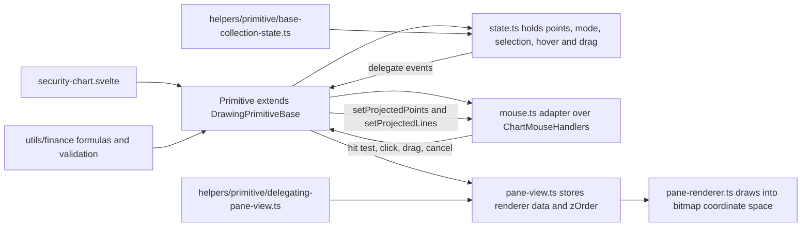
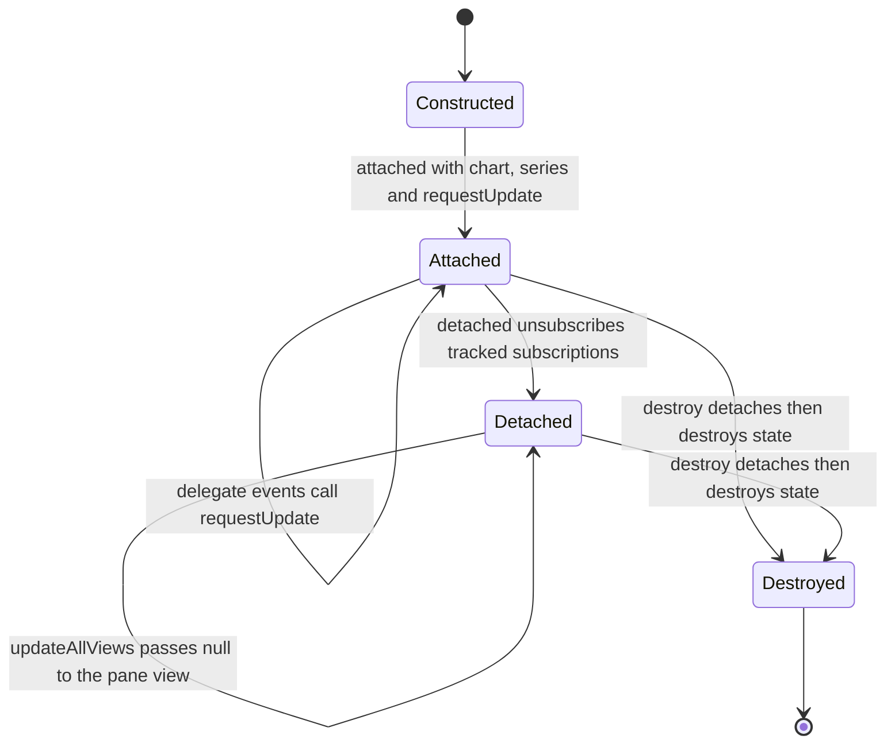
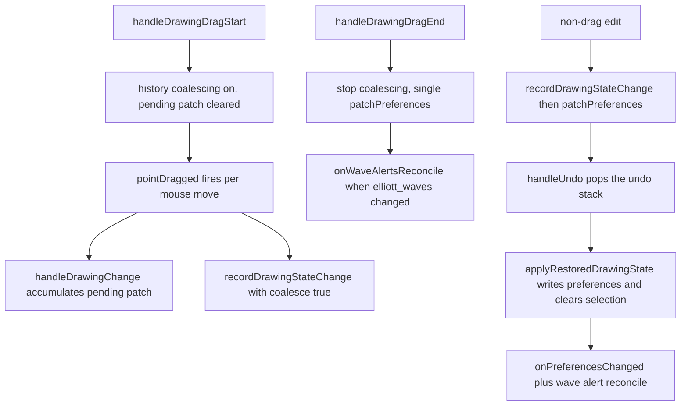
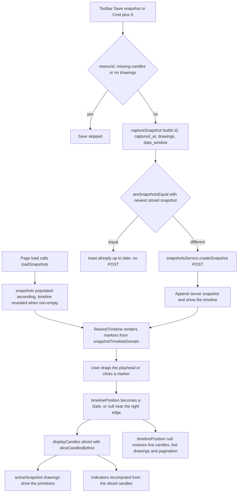

# Charting, Drawing Tools & Rewind

Charting is the largest frontend subsystem. It is built on `lightweight-charts` and split into layers that must not bleed into each other:

1. **Rendering & interaction** — `security-chart.svelte` owns the chart instance, series, price-scale panes and the six attached series primitives.
2. **Drawing tools** — self-contained plugins under `frontend/src/lib/components/charts/plugins/<plugin>/`, each a series primitive with its own state, mouse adapter, pane view and canvas renderer.
3. **Drawing orchestration** — `frontend/src/lib/services/ChartDrawingsService.svelte.ts` owns tool/selection/snapshot/rewind state and the persistence, undo/redo and keyboard behaviour around the drawings.
4. **Financial math** — pure, unit-tested formulas in `frontend/src/lib/utils/finance/`.

Chart snapshots and the rewind timeline sit on top: they persist drawings + the displayed data window to the backend and let the user replay the chart as it looked at a past moment.

See [Frontend Architecture](./frontend.md) for the app-wide layering and [Testing](../operations/testing.md) for the repository-wide test policy.

## Entry points

| Concern | Location |
|---|---|
| Chart component (renders the chart, owns primitives and pane layout) | `frontend/src/lib/components/charts/security-chart.svelte` |
| Security page (data loading, preferences, indicator requests, wave-alert reconcile) | `frontend/src/routes/security/[security_id]/+page.svelte` (+ `+page.server.ts`, `page-data.svelte.ts`) |
| Drawing/tool/snapshot/rewind state service | `frontend/src/lib/services/ChartDrawingsService.svelte.ts` |
| Drawing toolbar (wave/fib/measure/line tools, undo/redo, Save snapshot, timeline toggle) | `frontend/src/lib/components/charts/drawing-toolbar.svelte` |
| Chart settings modal (fib levels/width, wave settings, hide labels) | `frontend/src/lib/components/charts/chart-settings-modal.svelte` |
| Drawing-tool plugins | `frontend/src/lib/components/charts/plugins/` |
| Shared plugin plumbing | `frontend/src/lib/components/charts/plugins/helpers/` |
| Pane-height layout math | `frontend/src/lib/chart/indicator-pane-layout.ts` |
| Finance math | `frontend/src/lib/utils/finance/` |
| Indicator defaults | `frontend/src/lib/chart/indicator-defaults.ts` |
| Preference helpers | `frontend/src/lib/chart-preferences.ts` |
| Snapshot API client | `frontend/src/lib/api/snapshotsService.ts` |

`+page.server.ts` only returns the route identity (`{ security_id }`); it fetches nothing. The security identity and its default **1d** price series are loaded after navigation by `SecurityPageDataService` (`page-data.svelte.ts`), which fetches both in parallel (`Promise.all([getSecurity, getPrices(from, to, '1d')])`) behind a `loadSeq` guard so a superseded soft navigation cannot clobber a newer load. The page then reconciles the displayed timeframe with the user's saved preference and force-refetches when they differ. The chart component is dynamically imported inside the page's load effect (`await import('$lib/components/charts/security-chart.svelte')`), so the chart bundle is only ever fetched in the browser rather than during SSR.

## security-chart.svelte data flow

### Props and ownership

The component receives candles, drawing model state and tool modes as props and reports user intent back through callbacks:

- Core: `candles`, `containerId`, `hasMoreData`, `isLoadingMore` (bindable), `onLoadMoreData`, `hideLabels`, `averagePrice`/`showAveragePrice`, `futureBars`, `onPaneHeightsChange`.
- Alerts: `alerts`, `onAddAlert(price, condition)`, `onRemoveAlert(id)`.
- Elliott Wave: `elliottWaves`, `activeDegree`, `activeWaveType`, `isDrawingWave`, `selectedWaveDegree` (bindable), `snapToWicks`, `onWaveChange`, `onDrawingModeChange`, `onDegreeChange`, `onWaveTypeChange`, `onWaveSelect`.
- Fibonacci: `fibonacciTools`, `activeFibTool`, `isDrawingFib`, `selectedFibTool` (bindable), `onFibChange`, `onFibDrawingModeChange`, `onFibToolChange`, `onFibSelect`, `onFibDoubleClick`.
- New drawing tools: `securityDrawings` plus `isDrawingMeasure`/`selectedMeasureId` (bindable)/`onMeasureChange`/`onMeasureDrawingModeChange`/`onMeasureSelect`, the `…HorizontalLine…` group and the `…Line…` group, and `onDrawingDragStart`/`onDrawingDragEnd` shared by every tool.

The component owns none of this persistently: it converts props into primitive calls and emits changes upward. Prop→primitive syncing happens in **guarded `$effect`s** that first compare the primitive's current value (`areSecurityElliottWavesEqual`, `areFibonacciToolsEqual`, `areDrawingCollectionsEqual`) so no update loop forms between prop and primitive.

### Mount, series and primitive wiring

`onMount` creates the chart with `CrosshairMode.Normal`, transparent layout, `formatLocalTime` as the time formatter, `formatLocalTickMark` as the tick-mark formatter, `ignoreWhitespaceIndices: false`, a hidden left price scale and a right price scale with `minimumWidth: 75` (`DEFAULT_PRICE_SCALE_MIN_WIDTH`). It then:

1. Adds the main `CandlestickSeries` and calls `updatePanes()`.
2. Subscribes `timeScale().subscribeVisibleLogicalRangeChange` for two duties: pagination (`range.from <= 10 && hasMoreData && !isLoadingMore` → `isLoadingMore = true` + `onLoadMoreData()`) and future-whitespace expansion.
3. Attaches six primitives to the candlestick series: `UserPriceAlerts`, `ElliottWavesPrimitive`, `FibonacciPrimitive`, `MeasurePrimitive`, `HorizontalLinePrimitive`, `FreeFormLinePrimitive`.
4. Subscribes each drawing primitive's delegates and re-emits them as page callbacks (`wavePointsChanged`, `drawingModeChanged`, `degreeChanged`, `waveTypeChanged`, `selectionChanged`, `drawingsChanged`, `toolChanged`, `doubleClicked`, `dragStarted`, `dragEnded`, plus the per-tool `drawingsChanged`/`drawingModeChanged`/`selectionChanged` triples).
5. Installs a capture-phase `wheel` listener that zooms the **price scale** (not the time scale) by 1.025/0.975 around its mid-point when the pointer is over the price-scale strip, and a `ResizeObserver` that resizes the chart to the container and re-runs the whitespace check.

The `onMount` teardown destroys every primitive and removes the chart:

```ts
return () => {
    container.removeEventListener('wheel', handleWheel, { capture: true });
    resizeObserver.disconnect();
    userAlertsPrimitive?.destroy();
    elliottWavesPrimitive?.destroy();
    fibonacciPrimitive?.destroy();
    measurePrimitive?.destroy();
    horizontalLinePrimitive?.destroy();
    freeFormLinePrimitive?.destroy();
    chartInstance?.remove();
};
```

Drawing mode disables chart panning globally: an `$effect` sets `handleScroll.pressedMouseMove = false` while **any** of `isDrawingWave`, `isDrawingFib`, `isDrawingMeasure`, `isDrawingHorizontalLine` or `isDrawingLine` is true, and each primitive's `drawingModeChanged` subscription restores `pressedMouseMove = true` once every other drawing mode is off. This is the component-level counterpart of the scroll lock that `ChartMouseHandlers` applies during point drags.

### Candle updates, prepending and future whitespace

The candles `$effect` is the single writer for series data:

- Same array reference → no-op (the page replaces the array when data changes, which is the change signal).
- Empty candles → clear the series and every primitive's candles (`setCandles([])`), reset the whitespace count to `futureBars`, reset `isLoadingMore`.
- **Prepending** (first candle older than the previously-seen first candle, e.g. infinite-scroll history) → set data, then shift the visible logical range by the number of prepended candles so the viewport does not jump.
- **First load** → size `currentWhitespaceCount` from `futureBars` and the container width, then show the last 250 bars.

Future whitespace is what makes it possible to draw *ahead* of the last candle. `generateFutureWhitespace(candles, count)` derives the bar interval from the median spacing of the most recent candles (`computeIntervalSeconds`) and appends `count` whitespace points one interval apart, preserving the reference candle's `Time` shape (epoch seconds vs. `YYYY-MM-DD` vs. `BusinessDay`). `checkAndExpandWhitespace` grows the count when the visible logical range approaches the right edge, or when the container is wide enough to need more bars than currently allocated, and re-applies the saved logical range so the expansion is invisible to the user.

### Pane layout: one pane, several price scales

Oscillators do not get separate lightweight-charts panes; they get separate **price scale ids** on the same pane, and the vertical space is carved out with `scaleMargins`. `frontend/src/lib/chart/indicator-pane-layout.ts` owns that math as pure functions:

- `OSCILLATOR_PANE_IDS = ['rsi', 'macd', 'obv']` (with `MAIN_PANE_ID = 'main'`, `VOLUME_PANE_ID = 'volume'`) fixes the stacking order.
- `computeDefaultPaneScaleMargins(paneIds)` is a faithful port of the legacy hard-coded `updatePanes()` numbers: per-oscillator band heights of `0.25`/`0.18`/`0.14` by active count, a `0.02` gap (`PANE_GAP`), a `0.3` floor for the main area, and the bottom 25% of the main area reserved for volume when it is enabled.
- `computePaneBandHeights`/`distributePaneHeights`/`allocatePaneHeights` re-distribute the available height across panes proportionally to their weights with a water-filling clamp: a pane is never shorter than `MIN_PANE_FRACTION` (`0.08`) nor taller than `MAX_PANE_FRACTION` (`0.8`), and the space left over by a pinned pane is redistributed among the free ones.
- `computePaneScaleMargins(paneIds, customHeights)` returns the exact legacy margins whenever no custom height applies, and otherwise lays the clamped bands out top-to-bottom starting at `TOP_MARGIN` (`0.05`) with fixed gaps, so the result is always non-overlapping and inside `[0, 1]`.

The component keeps `customPaneHeights` in `$state` (plus `orderedPaneIds`, kept in explicit state so imperative add/remove through the exported API updates it reliably), derives `paneLayout` from `computePaneScaleMargins`, and derives `paneBoundaries` — one `{ upperId, lowerId, fraction }` per adjacent pair. Each boundary renders a `cursor-row-resize` button (`data-testid="pane-resize-handle-<upper>-<lower>"`); dragging it moves the shared edge by clamping the upper band and giving the remainder to the lower band, live-applying margins through `updatePanes()`. `pointermove`/`pointerup`/`pointercancel` are handled on `<svelte:window>`, and the drag end fires `onPaneHeightsChange({ ...customPaneHeights })` so the owner can persist it. A `Reset pane sizes` button (`data-testid="reset-pane-heights"`) appears only while a custom layout is active.

`bb` (Bollinger Bands) is an *overlay*, not an oscillator: it is drawn on the main price scale and never calls `updatePanes()`.

### Imperative surface

The component exports functions consumed through `bind:this` from the page:

| Export | Purpose |
|---|---|
| `updateData(candles)` | Replace series data and reset the visible window |
| `addIndicator` / `updateIndicatorData` / `removeIndicator` | Add, refresh or drop an indicator series group |
| `clearWave`, `getSelectedWaveDegree`, `setSelectedWaveDegree`, `getSelectedWaveId`, `setSelectedWaveId`, `getAllWaves`, `getElliottWavesPrimitive` | Elliott Wave proxy API |
| `clearFibonacci`, `getSelectedFibTool`, `setSelectedFibTool`, `getFibonacciPrimitive` | Fibonacci proxy API |
| `getMeasurePrimitive`, `getSelectedMeasureId`, `setSelectedMeasureId` | Measure proxy API |
| `getHorizontalLinePrimitive`, `getSelectedHorizontalLineId`, `setSelectedHorizontalLineId` | Horizontal-line proxy API |
| `getLinePrimitive`, `getSelectedLineId`, `setSelectedLineId` | Free-form line proxy API |
| `getPaneHeights`, `setPaneHeights`, `resetPaneHeights` | Pane-height layout (restore is silent, reset notifies the owner) |

## Chart preferences and interval handling

`frontend/src/lib/chart-preferences.ts` holds the pure helpers the security page uses; they are unit-tested by the page's own test suite:

- `mergeChartPreferences(prefs, partial)` — read-merge-write that **preserves the `indicators` key** so a chart-style or timeframe patch cannot clobber indicator settings.
- `displayCandlesFor(style, raw, ha)` — `heikin_ashi` → Heikin-Ashi candles, otherwise raw candles.
- `shouldForceRefetch(selectedInterval, interval, force)` — `true` when `force` is set or the interval differs.
- `parseCandleTime(time)` — normalizes number (epoch seconds), `YYYY-MM-DD`, ISO string and `BusinessDay` to a `Date`.
- `mergeCandles(existing, incoming)` — dedupes by `String(time)` and prepends the new candles so the array stays oldest→newest.
- `shouldFetchMoreData(isLoadingMore, hasMoreData, securityId, candleCount)` — pagination guard.

Intervals supported by the toolbar are `1h`, `4h`, `1d`, `1w`, `1m`. `getChartDateWindow(endDate, interval)` returns a 30-day window for intraday intervals and a 2-year window otherwise; intraday points are mapped to `UTCTimestamp` epoch seconds and daily/weekly/monthly points keep their date string. `changeTimeframe(interval, { persist, force })` fetches through `MarketService.getPrices`, maps/sorts candles, recomputes Heikin-Ashi candles and refreshes indicators; the preference patch is deliberately performed **outside** the fetch `try/catch` (and only when the fetch succeeded) so a failed preference save cannot mask a fetch error.

Preferences are stored via `UserPreferencesService` (`timeframe`, `chart_style`, `indicators`, `chart_hide_labels`, `wave_settings`, `elliott_waves`, `fibonacci_tools`, `drawings`, `indicator_pane_heights`) and applied on load by `onPreferencesLoaded`, which applies saved pane heights, hands the preferences to the drawings service, sets the chart style, applies the saved timeframe without re-persisting it, and re-enables indicators via `setTimeout(…, 100)` so the chart ref is bound first.

## Indicators and overlays

`frontend/src/lib/chart/indicator-defaults.ts` is the single source of truth for indicator defaults (`INDICATOR_DEFAULTS`, key order = sidebar render order), deep-frozen so accidental mutation throws. `createIndicatorConfigs()` returns a fully independent copy (including nested `settings`) for the page to mutate.

`addIndicator(indicator)` switches on `indicator.type` and builds the right series shape:

| Type | Series composition | Price scale |
|---|---|---|
| `volume` | one `HistogramSeries`, `priceFormat: { type: 'volume' }` | `volume` |
| `rsi` | one `LineSeries` | `rsi` |
| `macd` | `HistogramSeries` + MACD `LineSeries` + signal `LineSeries`, histogram colored per sign | `macd` |
| `obv` | one `LineSeries` with a custom `M/1M` price formatter | `obv` |
| `bb` | three `LineSeries` (upper/middle/lower) + a `BandsIndicator` primitive attached to `middle` | main |
| everything else (`ma50`, `ma200`, `ma50w`, `ma200w`, …) | one `LineSeries` overlay | main |

`removeIndicator` removes all series of the group and, for `bb`, detaches the bands primitive first; it also drops any custom pane height for that indicator and re-runs `updatePanes()`. `updateIndicatorData` either updates `setData` for the affected series or falls back to `addIndicator` when the group does not exist yet.

Actual indicator values are computed server-side by `IndicatorsService.computeIndicators` (`{ interval, chart_style, indicators: IndicatorSpec[], candles? }`). The page keeps a monotonic `sequenceCounter` plus a per-indicator `indicatorSeq` map and discards responses whose sequence is stale — the standard guard against out-of-order responses when the user toggles indicators quickly or changes timeframe mid-flight. `volume` is the exception: it is rendered locally from the displayed candles. `avgPrice` is not an indicator series at all — it is a dashed price line created/removed from `averagePrice` + `showAveragePrice`, fed by `blendedAverageCost(holdings)`.

`hideLabels` is a display mode that drives `lastValueVisible`/`priceLineVisible`/`title` across every series group (including the three MACD series and the three BB series) through a single `$effect`; the horizontal-line primitive also receives it through `setHideLabels`.

## The drawing-tool plugin architecture

### Per-plugin layout

Each drawing tool lives in `frontend/src/lib/components/charts/plugins/<plugin-name>/` with a fixed responsibility split:

| File | Responsibility |
|---|---|
| `state.ts` | Tool state, point arrays, active mode, selection, hover/drag targets; fires `Delegate` events. Pure domain data — never touches DOM or chart coordinates. |
| `mouse.ts` | Thin adapter extending `ChartMouseHandlers`; supplies `hitTestRadius`, `toTarget`, optional `adjustPosition` snapping and `hitTestLine`. |
| `pane-renderer.ts` | Implements `IPrimitivePaneRenderer`; draws shapes, handles, dashed previews and labels into bitmap coordinate space. |
| `pane-view.ts` | Implements `IUpdatablePaneView<TRendererData>`; stores renderer data and returns the renderer with a `zOrder`. |
| `constants.ts` | Visual constants: radii, hit-test radii, line widths/dashes, colors, opacity, degree configuration. |
| `index.ts` | Barrel exporting the primitive, state, renderer, view, mouse adapter and public types/constants. |

Two rules make the structure hold:

- **No cross-plugin imports.** `fibonacci` must never import from `elliott-wave` or vice versa. Anything shared moves to `plugins/helpers/` or `$lib/utils/finance/`. The elliott-wave barrel, for example, re-exports `TimeProjector`, the time helpers and the snap helpers from `../helpers/...` — never from a sibling plugin — and the fibonacci barrel re-exports the shared handle constants from `../helpers/renderer`.
- **Finance math and pattern validation live in `$lib/utils/finance/`.** Plugins import formulas (`calculateRetracementLevels`, `selectDegreeWave`, `snapPriceToWick` call sites, `computeMeasure`, …) but never embed them in renderers, views or mouse adapters.



The plugin layer split: a primitive owns state, a mouse adapter, a pane view and a renderer; shared plumbing comes from `helpers/` and all math from `utils/finance`.

### Two state shapes

There are two state conventions in the plugin family:

- **Fibonacci and Elliott Wave** own bespoke state classes (`FibonacciToolState`, `ElliottWaveState`) with tool- or degree-keyed targets, because their domain models (retracement/extension drawings, degree + wave-id wave counts) do not fit a flat collection.
- **Measure, Horizontal Line and Free-form Line** share `BaseCollectionToolState<TDrawing, TTarget>` (`plugins/helpers/primitive/base-collection-state.ts`), which implements `IDrawingToolState` over an array of id-keyed drawings: it assigns ids via an injectable `idFactory` (default `generateUUID`), normalizes every anchor time on ingestion (`normalizeDrawingTime`), replaces collections with `setDrawings` while skipping equal input (reactive-loop prevention), clears a selection whose drawing disappeared, manages the drawing-mode lifecycle (entering drawing mode clears the selection; leaving it drops pending points), and exposes `drawingsChanged`/`drawingModeChanged`/`selectionChanged`/`hoverChanged`/`hoveredLineChanged`/`dragChanged`. It provides `_addTwoPointDrawing` and `_updateTwoPointDrawing` templates that the concrete states wrap.

The three collection plugins differ only in their concrete state:

| Plugin | State class | Drawing shape | Interaction |
|---|---|---|---|
| `measure/` | `MeasureToolState` | two anchors | two clicks; the primitive snaps the second click and drags to horizontal/vertical when within 15° of an axis (`snapMeasureAngle`) and renders a direction-coloured line, fill and `delta (percent) · bars, elapsed` label (`computeMeasure`, `formatMeasureLabel`) |
| `horizontal-line/` | `HorizontalLineToolState` | one anchor | a single click commits the line and exits drawing mode; dragging only changes the price, so the line stays horizontal and anchored at its original time |
| `free-form-line/` | `LineToolState` | two anchors | two clicks; both endpoints are freely draggable in time and price |

All three reuse `DelegatingPaneView` (`plugins/helpers/primitive/delegating-pane-view.ts`) instead of hand-written pane views: it holds an `IUpdatablePaneRenderer`, forwards `update(data | null)` to it and returns a `zOrder`. Their renderers draw shared geometry through `plugins/helpers/renderer/` (`drawAnchorHandle`, `drawChartLabel`) and hit-test segments with `pointToSegmentDistance` from `plugins/helpers/mouse/geometry.ts`.

### Fibonacci

`FibonacciToolState` manages a `retracement` (2 anchors) and an `extension` (3 anchors) drawing plus `_pendingPoints`. `addPoint` implements the click progression: two clicks complete a retracement, three complete an extension; on completion it stores the drawing (preserving existing levels/`extendLines`/`visible`), clears pending points and exits drawing mode, and it canonicalizes each anchor to epoch seconds on ingestion. `updatePoint` supports per-index drag updates (0/1 for retracement, 0/1/2 for extension), `clear(tool?)` clears one or both tools and drops any hover/drag/selection state pointing at them, and every mutation fires `drawingsChanged` with a defensively copied `SecurityFibonacciTools`. Selection (`setSelectedTool`) is cleared automatically when the selected tool's drawing is removed or hidden (via `setRetracement`/`setExtension`/`setDrawings`).

The plugin's `MouseHandlers` extends `ChartMouseHandlers` with `hitTestRadius: HIT_TEST_RADIUS` (14 px), maps hits to `{ tool, pointIndex }`, adds line hit-testing against projected level lines (distance to the clamped x-range), and snaps placed points to candle wicks via `adjustPosition` when a candle lookup exists. `FibonacciPrimitive` wires the shared and plugin delegates in `_setupSubscriptions` (drawingsChanged, toolChanged, selectionChanged, hoverChanged, hoveredLineChanged, dragChanged plus pointClicked, lineClicked, lineHovered, doubleClicked, emptyAreaClicked, pointDragged), computes projected points/levels in `_calculateRendererData` using `TimeProjector` + `series.priceToCoordinate`, and exposes its own `doubleClicked()` delegate (destroyed in `destroy()` before delegating to the base) which the page turns into the fib width modal. Line bounds come from pure functions (`calculateRetracementLineBounds`, `calculateExtensionLineBounds`) with a minimum width delta so short drawings stay clickable. `setCandles` is overridden to forward candles to the mouse adapter as well.

### Elliott Wave

`ElliottWaveState` holds degree (`cycle` | `primary` | `intermediate`), wave type (`impulse` | `corrective`), the `DegreeWaveCount[]` collection, the in-progress wave id, selection and hover/drag targets. Highlights:

- `addPoint` reuses the in-progress wave when it matches the target degree and type, otherwise creates a new wave with a `generateUUID()` id, assigns the next wave label (`0..5` for impulse, `[0, 'A', 'B', 'C']` for corrective), canonicalizes the anchor to epoch seconds, records `wave3Target`/`wave5Target` when points 3 and 5 are placed, and exits drawing mode once `MAX_IMPULSE_POINTS` (6) or `MAX_CORRECTIVE_POINTS` (4) is reached.
- `updatePoint` locates the wave by id → selected wave → degree, mutates an immutable copy, and keeps `wave3Target`/`wave5Target` in sync when point 3 or 5 moves.
- `clearWave(waveIdOrDegree?)` resolves what to remove in the order: the selected wave, the wave with that id, the selected wave of that degree, the latest wave of a degree, then the last wave overall.
- Changes fire `wavePointsChanged`, which the chart re-emits so the drawings service persists `elliott_waves[securityId]` and reconciles wave target alerts.

The plugin's `constants.ts` defines per-degree visual configuration (`CYCLE_STYLE`, `PRIMARY_STYLE`, `INTERMEDIATE_STYLE`, `DEGREE_STYLES`) including the Roman-numeral / circled-number / parenthesised label conventions, node radii and ring colors. The mouse adapter snaps through `resolveAdjustedPosition`: it builds a candle-wick candidate (only when `snapToWicks` is on) and a Fibonacci-level candidate (only when the nearest active level is within `FIB_SNAP_TOLERANCE_PX` = 8 px, independent of `snapToWicks`), then returns the closer one with pixel-space ties going to the wick. `ElliottWavesPrimitive.setFibLevelPrices` stores the prices and forwards them to the mouse adapter.

### Cross-plugin coupling goes through the finance layer

Elliott wave points snap to active Fibonacci levels, but the elliott plugin cannot import the fibonacci plugin. The chart component computes the level prices from the pure finance helper and pushes them in:

```ts
const fibSnapPrices = $derived(getActiveFibLevelPrices(fibonacciTools));
// …in a content-signature-guarded $effect:
elliottWavesPrimitive.setFibLevelPrices(fibSnapPrices);
```

`getActiveFibLevelPrices` returns the deduplicated prices of every enabled level of the currently drawn, visible retracement and extension tools. The signature guard (`"${length}:${values}"`, held in `appliedFibSnapPricesSignature`) exists because the derived array is fresh on every tools change.

## Shared plumbing in `plugins/helpers/`

### `helpers/delegate.ts`

`Delegate<T1>` + `ISubscription<T1>` implement a type-safe publisher/subscriber surface used by every state class and the mouse handlers: `subscribe(callback, linkedObject?, singleshot?)`, `unsubscribe(callback)`, `unsubscribeAll(linkedObject)`, `fire(param)`, `hasListeners()` and `destroy()`. Two semantics matter:

- `linkedObject` is the ownership handle: primitives pass `this` and later call `unsubscribeAll(this)`, which is what makes cleanup exhaustive instead of best-effort.
- `single-shot` listeners are removed before the callback runs, and `fire` iterates a snapshot of the listener list so a callback that subscribes or unsubscribes during dispatch cannot corrupt the loop.

### `helpers/dimensions/` and `helpers/renderer/`

`positionsLine(positionMedia, pixelRatio, desiredWidthMedia, widthIsBitmap?)` returns `{ position, length }` in bitmap pixels, rounding the scaled position and centering the line width on it. `positionsBox(position1Media, position2Media, pixelRatio)` returns the box start and a length of `abs(delta) + 1` (the +1 keeps a 1 px box visible). These are the shared primitives for crisp, pixel-aligned drawing; the `user-price-alerts` renderers use `positionsLine` for alert lines, the centre label, its divider and the price-scale label. `fibonacci` and `elliott-wave` renderers also draw inside the bitmap scope and scale media coordinates by the scope's `horizontalPixelRatio`/`verticalPixelRatio` themselves.

`helpers/renderer/` adds the shared drawing helpers: `drawAnchorHandle` (handle ring with hover/drag/selected ring colours and `HANDLE_RADIUS`) and `drawChartLabel` (a background box, optional accent bar, high-DPI text scaling and pixel-aligned geometry via `positionsBox`/`positionsLine`), with the default colours, label metrics and char-width estimate in `helpers/renderer/constants.ts`. `BitmapPositionLength` comes from `dimensions/common.ts`.

**Rule for new canvas code**: never draw with raw media coordinates — work inside `target.useBitmapCoordinateSpace(...)` and derive pixel-snapped geometry with `positionsLine`/`positionsBox` so 1 px lines and handles stay crisp on high-DPI displays.

### `helpers/time/`

- `time.ts`: `DEFAULT_FUTURE_BARS = 100`, `timeToEpochSeconds` / `epochSecondsToTime` (shape-preserving round trip), `addIntervalToTime`, `barsBetweenTimes`, `computeIntervalSeconds`, `generateFutureWhitespace`, and `resolveAnchorEpoch` — a binary search that snaps a canonical epoch anchor to the candle at or immediately before it (clamped to the first candle, `null` past the last one), which keeps a drawing created on the daily chart on the containing bar of every other timeframe.
- `time-projector.ts`: `TimeProjector` binds to the chart (`attach`) and to the data (`updateCandles`), then projects coordinates ↔ time. Inside the historical range it delegates to `timeScale().timeToCoordinate` / `coordinateToTime`; beyond the last candle it extrapolates from the last time plus whole bar intervals and maps them via logical bar indices. It also exposes epoch-based resolution (`coordinateToEpoch`, `epochToCoordinate`) that snaps the anchor to the active timeframe's candle first. This is what lets wave points, fib anchors and the new-tool drawings live in the future whitespace.

### `helpers/mouse/`

`ChartMouseHandlers<TPoint, TTarget, TOriginal>` is the shared interaction engine:

- **Config**: `hitTestRadius`, `toTarget(point)`, optional `adjustPosition(pos, series)` and `hitTestLine(x, y)`.
- **DOM lifecycle**: mousemove/mousedown/mouseup/click/dblclick/mouseleave/contextmenu on the chart element, plus window-level `mouseup` and `keydown`, all unsubscribed in `detached()`.
- **Plot-area clipping**: `_determineMousePosition` subtracts the price-scale width and time-scale height, so points outside the plot area carry `time: null` / `price: null` and are never turned into placements.
- **Hit-testing contract**: distance ≤ `hitTestRadius` is a hit (boundary inclusive) and exact-distance ties resolve first-wins by array order, so overlapping anchors are deterministic.
- **Hover routing**: when not drawing or dragging, a point hit fires `pointHovered` (and clears `lineHovered`), otherwise `hitTestLine` decides `lineHovered`.
- **Drag lifecycle**: mousedown on a hit starts a drag, disables `pressedMouseMove` scroll and fires `dragStarted`; moves fire `pointDragged` with the adjusted position; any drag move sets `_dragHappened`, which suppresses the trailing `click` and `dblclick` so a drag never also places or selects a point; mouseup (chart **or** window) restores scroll and fires `dragEnded`.
- **Drawing mode**: `setDrawingMode(true)` disables pressed-move scroll and hides the horizontal crosshair line; clicks inside the plot area fire `chartClicked` with the (optionally snapped) time/price/x/y.
- **Cancellation**: right-click (`contextmenu`) and `Escape` fire `cancelRequested` while in drawing mode.

`helpers/mouse/snap.ts` provides the pure snapping helpers: `snapPriceToWick(price, candle)` (ties resolve to `high`), `findNearestLevel(price, levelPrices)` (finite-value filtering; pixel tolerance stays the caller's job), `buildCandleLookup(candles)` and `findCandleByTime(lookup, time)` (O(1) lookup keyed by normalized epoch seconds). `helpers/mouse/geometry.ts` provides `pointToSegmentDistance`, the segment hit-test used by the measure and free-form-line adapters.

### `helpers/primitive/drawing-primitive-base.ts`

`DrawingPrimitiveBase<TRendererData, TPaneView, TState, TMouseHandlers, THoverTarget, TDragTarget>` is the abstract base that implements `ISeriesPrimitive<Time>`. It defines three contract interfaces plugins must satisfy (`IDrawingToolState`, `IUpdatablePaneView`, `IDrawingMouseHandlers`) and centralizes lifecycle, subscription tracking, cursor resolution and pane-view updates. Subclasses supply `_calculateRendererData()` and optionally extend `_setupSubscriptions()`.

Cursor resolution precedence in `_updateCursor()`: dragging → `'default'`, drawing mode → `'crosshair'`, hovering a point → `'default'`, otherwise `null`. `hitTest()` returns `null` for a `null` cursor, otherwise `{ cursorStyle, externalId, zOrder: 'top' }` — the `externalId` (`fibonacci-primitive`, `elliott-waves-primitive`, `measure-primitive`, `horizontal-line-primitive`, `free-form-line-primitive`) is what lightweight-charts reports back to the page's own hit testing.



Drawing primitive lifecycle: `attached` binds the projector and mouse handlers and tracks subscriptions; `detached` releases everything; `destroy` runs `detached()` and then destroys the state delegates. `updateAllViews` is safe to call in any state.

`attached({ chart, series, requestUpdate })` stores the references, attaches the `TimeProjector` and `ChartMouseHandlers`, pushes the current drawing mode into the mouse handlers, then wires the standard delegates:

| Delegate | Reaction |
|---|---|
| `state.drawingModeChanged()` | push mode into mouse handlers + request update |
| `mouseHandlers.mouseMoved()` | request update while in drawing mode (drives previews) |
| `mouseHandlers.pointHovered()` | `state.setHoveredPoint(...)` + update |
| `mouseHandlers.dragStarted()` / `dragEnded()` | set/clear `state.setDraggingPoint(...)` + update |
| `mouseHandlers.chartClicked()` | in drawing mode, `state.addPoint({ time, price })` + update |
| `mouseHandlers.cancelRequested()` | `cancelDrawing()` (state hook, or clear the mode) |

Every subscription goes through `_subscribe()` / `_subscribeToUpdate()` and is recorded in `_trackedSubscriptions`; `detached()` iterates that set calling `sub.unsubscribeAll(this)`, then calls `mouseHandlers.detached()` and clears `_chart` / `_series` / `_requestUpdate`. `updateAllViews()` early-returns into `paneView.update(null)` when the primitive is detached or references are missing, otherwise it computes renderer data, updates the cursor and pushes data into the pane view. `setCandles(candles)` updates the `TimeProjector` and requests an update; primitives that also snap (`FibonacciPrimitive`, `ElliottWavesPrimitive`) override it to forward candles to their mouse adapter too.

## Drawing orchestration: `ChartDrawingsService`

`frontend/src/lib/services/ChartDrawingsService.svelte.ts` is the state owner for everything the user does *to* drawings. The security page constructs one instance per page (`setChartDrawingsService(new ChartDrawingsService({ … }))`) and publishes it through Svelte context, so `drawing-toolbar.svelte` can read it with `getChartDrawingsService()` or accept it as a `service` prop; the page also feeds it through `setSecurity`, `setPreferences` and `setDisplayCandles` effects and destroys it in `onDestroy`.

**State it owns** — active tool/mode flags (`activeWaveDegree`, `activeWaveType`, `isDrawingWave`, `activeFibTool`, `isDrawingFib`, `isDrawingMeasure`, `isDrawingHorizontalLine`, `isDrawingLine`), the five selections, the per-security `snapshots`, `isTimelineVisible`, `timelinePosition`, `saveFeedback`, `isDraggingDrawing` and `_canUndo`/`_canRedo`.

**Derived getters** — `isRewound` (`timelinePosition !== null`), `securityElliottWaves`/`securityFibonacciTools`/`securityDrawings` from preferences, `activeSnapshot` (`findSnapshotAtOrBefore`), the `effective*` variants that swap in the snapshot's drawings while rewound, `canUndo`/`canRedo` (forced `false` while rewound) and `isDrawing*Effective` (forced `false` while rewound).

**Mutual exclusion and rewind exit** — every tool toggle (`selectWaveDegree`, `toggleFib`, `toggleMeasure`, `toggleHorizontalLine`, `toggleLine`) clears the other modes, and the four new-tool toggles plus `selectWaveDegree`/`toggleFib` first reset `timelinePosition = null`, so picking a tool while scrubbed returns the user to live data instead of silently editing a past snapshot.

**Persistence** — `handleWaveChange`, `handleFibChange`, `handleFibLevelsChange`, `handleFibWidthSave`, `handleDrawingChange(toolKey, items)` and `handleRemoveDrawing(toolKey, id)` each merge into `userPreferences` immutably through the finance helpers (`updateSecurityElliottWaves`, `updateSecurityFibonacciTools`, `updateSecurityDrawings`, `removeSecurityDrawings`), record a history entry, and `patchPreferences`. Every one of them early-returns while `isRewound`.

**Drag coalescing** — `handleDrawingDragStart` sets `isDraggingDrawing` and starts history coalescing; during a drag the preference patches accumulate in `_pendingDrawingPreferences` instead of hitting the network on every mouse move; `handleDrawingDragEnd` stops coalescing and flushes a single `patchPreferences`, then triggers `onWaveAlertsReconcile` when the flushed patch contained `elliott_waves`.

**Legacy anchor normalization** — `normalizeDrawingsPreferences` upgrades every security's stored drawings to canonical epoch anchors at the preference-loading seam, so restored drawings already equal what the primitives derive on feed-in and the guarded sync effects do not write an extra preference patch per tool on first load.



Drawing mutations funnel through history and one preference patch: drags accumulate and flush once on drag end, and undo/redo restores a whole per-security drawing state.

**Undo/redo** — `DrawingHistoryManager` (`utils/finance/drawing-history.ts`) keeps an undo and redo stack of `SecurityDrawingState` snapshots (`elliott_waves`, `fibonacci_tools`, `drawings`), capped at `maxHistory` (default 100), comparing pushes with `areDrawingStatesEqual` so an equal state is not recorded, and notifying subscribers so the service can recompute `canUndo`/`canRedo`. Coalescing (`startCoalescing`/`stopCoalescing`, or a per-push `coalesce` flag) defers a drag's intermediate states into a single `_pendingCoalescedState` that is flushed on stop. `handleUndo`/`handleRedo` early-return while rewound, pop the manager, and `applyRestoredDrawingState` rewrites the per-security `elliott_waves`/`fibonacci_tools`/`drawings` maps (deleting the key when the restored state is empty), clears the selection, patches preferences, notifies `onPreferencesChanged` and schedules a wave-alert reconcile. The `_isApplyingHistory` flag stops the restore from recording itself as a new history entry.

**Keyboard** — `handleKeyDown(event, chartRef?)` ignores events originating in inputs, textareas or contenteditable elements, then: `Delete`/`Backspace` removes the selected drawing using the service's own selection first and the chart ref's getters as fallback, in the precedence wave → fib → measure → horizontal line → free-form line (each branch clears its selection and calls the matching handler); `Escape` calls `cancelActiveDrawing()`; `Cmd/Ctrl+Z` undoes, `Cmd/Ctrl+Shift+Z` and `Cmd/Ctrl+Y` redo; `Cmd/Ctrl+S` saves a snapshot; `Cmd/Ctrl+,` opens the chart settings modal through `onChartSettingsOpen`. Every mutation branch early-returns while rewound. `destroy()` clears the save-feedback timer and the history subscription.

## The finance-math boundary

All formulas and pattern validation live in `frontend/src/lib/utils/finance/` with colocated unit tests. Plugins consume them; they never re-implement them.

| Module | Contents |
|---|---|
| `fibonacci.ts` | `FibToolType`/`FibPoint`/`FibRetracementDrawing`/`FibExtensionDrawing`/`SecurityFibonacciTools` types, `DEFAULT_FIB_RETRACEMENT_LEVELS` / `DEFAULT_FIB_EXTENSION_LEVELS`, `FIB_WIDTH_STOPS`, `getClosestFibWidthIndex`, `formatFibLevelLabel`, `calculateRetracementLevels`, `calculateExtensionLevels`, `getActiveFibLevelPrices`, `updateSecurityFibonacciTools`, `getSecurityFibonacciTools`, anchor normalization and structural-equality helpers |
| `elliott-wave.ts` | `WaveDegree`, `WaveType`, `WavePointId`, `WavePoint`, `DegreeWaveCount`, `SecurityElliottWaves`, `WaveSettings`/`WaveAlertPercents`, `DEFAULT_WAVE_SETTINGS`, `getWaveTargetPrice`, `calculateUpsidePercentage`, `selectDegreeWave`, `getSecurityDegreeWaveCount`, `getLatestWaveCount`, `updateSecurityElliottWaves`, `normalizeWaveIds`, `getWaveAlertPercent`, equality helpers |
| `drawings.ts` | The new-tool domain model — `DrawingToolType` (`measures` \| `horizontalLines` \| `lines`), `DrawingPoint`, `MeasureDrawing`, `HorizontalLineDrawing`, `LineDrawing`, `SecurityDrawings`/`SecurityDrawingsMap` — plus the immutable per-security map algebra (`getSecurityDrawings`, `updateSecurityDrawings`, `addOrReplaceDrawing`, `removeSecurityDrawings`), `isSecurityDrawingsEmpty`, `normalizeSecurityDrawings` and the structural equality helpers (`areDrawingPointsEqual`, `areDrawingsEqual`, `areDrawingCollectionsEqual`, `areSecurityDrawingsEqual`) |
| `drawing-time.ts` | `normalizeDrawingTime` — canonicalizes any `Time` (epoch number, ISO/date string, `BusinessDay`) to epoch seconds, falling back to `0` for invalid input |
| `drawing-history.ts` | `SecurityDrawingState`, `areDrawingStatesEqual` and `DrawingHistoryManager` (undo/redo stacks, coalescing, `maxHistory`) |
| `measure.ts` | `MeasureDirection`/`MeasureSnapAngle`, `snapMeasureAngle` (15° default axis threshold), `computeMeasure`, `formatElapsedTime`, `formatBarsCount`, `formatMeasureLabel`, `formatMeasureLabelForPoints` |
| `wave-alerts.ts` | `roundTo8dp`, `computeWaveAlertLevels`, `reconcileWaveAlerts` |
| `bollinger-bands.ts`, `moving-average.ts`, `rsi.ts`, `macd.ts`, `obv.ts` | Indicator config types + defaults (`defaultBBConfig` 20/2, `defaultRSIConfig` 14, `defaultMACDConfig` 12/26/9, `defaultOBVConfig`) and value/series types |
| `holdings-metrics.ts` | `parseCandleTimeToDate`, `getPeriodCutoffDate`, `getBenchmarkPrice`, `calculateHoldingGain`, `filterCandlesForPeriod` |
| `average-cost.ts` | `blendedAverageCost` (quantity-weighted, 0 for empty/zero-quantity holdings) |
| `candle.ts` | `Candle` type + `convertToHeikinAshi` |
| `rewind.ts` | Snapshot model + persistence helpers (see below) |

Wave alert math is a good illustration of why this boundary exists: `computeWaveAlertLevels` iterates degree × target wave deterministically, skips a degree whose percent is `null`, rounds to 8 decimals to match the backend `DECIMAL(16,8)` column so create→read-back comparisons are exact, and skips levels equal to the current price. `reconcileWaveAlerts` then diffs desired levels against existing alerts by `(condition, level)` and returns exactly which alerts to create and which wave-source alerts to delete — manual alerts (`source !== 'wave'`) are never returned for deletion, and a second run over fully-applied state returns empty sets.

Three practical notes for this boundary:

- **Anchors are canonical epoch seconds.** `normalizeDrawingTime` is the single conversion point, and every layer that ingests an anchor calls it (the collection states, `FibonacciToolState`, `ElliottWaveState`, `normalizeSecurityDrawings`, `normalizeWaveIds`). Storing anchors in time rather than timeframe-local bar indices is what lets a drawing created on one timeframe keep its dates and labels on every other. It lives in `finance/` precisely because `$lib/utils/finance/` is the lowest layer and **must not import from `plugins/helpers/`** — the same reason the plugin-side `timeToEpochSeconds` is not reused here. Do not "fix" that duplication by adding the import.
- `generateUUID()` (used for wave ids, drawing ids and client-side snapshot ids) also lives in `finance/rewind.ts` and is imported by the plugins. It falls back from `crypto.randomUUID` to `crypto.getRandomValues` to `Math.random`, because non-secure HTTP contexts lack `randomUUID`.
- The page reconciles wave alerts through a **serialized promise chain** (`waveAlertsReconcileSeq`), because `onWaveChange` fires once per placed point and concurrent reconciles reading stale `alerts` state would double-create. A failed reconcile only logs — the next reconcile self-heals.

## Chart snapshots and the rewind timeline

A chart snapshot captures the drawings plus the data window at a moment in time; the rewind timeline lets the user scrub back to that moment and see the chart as it was. The pipeline spans backend storage, a finance helper module, an API client, a timeline helper module, the timeline component, `ChartDrawingsService` and the security page.

### Backend persistence

`ChartSnapshotModel` (`src/market/model.py`) maps to `market_chart_snapshots`:

| Column | Type | Notes |
|---|---|---|
| `id` | `UUID` PK | server-generated (`uuid4`) |
| `security_id` | `UUID` FK → `market_securities.id` | `ON DELETE CASCADE` |
| `user_id` | `UUID` | ownership scope for every query |
| `drawings` | `JSON` | elliott waves + fibonacci tools + new-tool drawings payload |
| `data_window` | `JSON` | `{ first, last }` displayed candle times |
| `captured_at` | `DateTime(timezone=True)` | client-supplied or `now(UTC)` |
| `created_at` | `DateTime(timezone=True)` | server default |

A composite index `ix_market_chart_snapshots_security_user_captured` on `(security_id, user_id, captured_at)` backs the read path. The table is created by migration `bea77d72aaf1_add_market_chart_snapshots`.

`ChartSnapshotRepository` (abstract, `src/market/repository.py`) exposes `get_by_security_and_user`, `create` and `delete`; `SqlAlchemyChartSnapshotRepository` implements them:

- Read: `SELECT … WHERE security_id = ? AND user_id = ? ORDER BY captured_at ASC` → `list[ChartSnapshotRead]`. **Ascending order is part of the contract** — the frontend timeline treats `snapshots[0]` as the oldest.
- Create: normalizes `captured_at` to UTC (attaching UTC when naive), inserts, refreshes and returns `ChartSnapshotRead`.
- Delete: `DELETE … WHERE id = ? AND user_id = ?` — a snapshot can only be deleted by its owner.

The repository is registered as a `svcs` factory (`ChartSnapshotRepository` → `sqlalchemy_chart_snapshot_repository_factory` in `src/market/__init__.py`) and exposed by `src/market/router.py`:

| Method | Path (router prefix `/market`, mounted under `/api/v1`) | Response |
|---|---|---|
| `GET` | `/market/securities/{security_id}/snapshots` | `list[ChartSnapshotRead]` for the current user |
| `POST` | `/market/securities/{security_id}/snapshots` | `201` + created `ChartSnapshotRead` |
| `DELETE` | `/market/securities/{security_id}/snapshots/{snapshot_id}` | `204` |

`ChartSnapshotCreate` accepts `drawings`, `data_window` and optional `captured_at`; `ChartSnapshotRead` adds `id`, `security_id`, `user_id`, `captured_at` and `created_at`. All three routes depend on `current_user`, and the `user_id` scope is applied in the repository rather than in the handler.

### Frontend snapshot helpers and API client

`frontend/src/lib/utils/finance/rewind.ts` defines the wire model and the pure snapshot algebra:

- `RewindSnapshot` = `{ id, captured_at, drawings, data_window, security_id?, user_id?, created_at? }`; `RewindDrawings` = `{ elliott_waves?, fibonacci_tools?, drawings? }` — the third key carries the `SecurityDrawings` collections for measure/horizontal-line/free-form-line; `RewindDataWindow` = `{ first, last }` holding `getTimeValue`-normalized candle times.
- `captureSnapshot(drawings, dataWindow, now = new Date())` builds a client-side id (`generateUUID()`) and an ISO-8601 UTC `captured_at`.
- `appendSnapshot(store, securityId, snapshot)` immutably appends to a per-security map (returns a new record, tolerates `null`/missing keys). Kept for map-shaped stores; `ChartDrawingsService` holds a flat per-security array and spreads instead.
- `getSnapshots(store, securityId)` returns an ascending-by-`captured_at` copy.
- `findSnapshotAtOrBefore(snapshots | store, time)` returns the latest snapshot at or before `time`, or `null` when `time` precedes the first snapshot; it is overloaded for a flat array (2-arg) and for the map + security id (3-arg) forms. The service uses the 2-arg array form.
- `areSnapshotsEqual(a, b)` compares the `data_window` plus all three drawing groups structurally (elliott waves, fibonacci tools with absent/empty normalized as equal, and the `SecurityDrawings` collections) and **intentionally ignores `id` and `captured_at`** — that is what gives save-dedupe semantics.

`frontend/src/lib/api/snapshotsService.ts` is a thin `ApiClient` subclass with `getSnapshots(securityId, token?)`, `createSnapshot(securityId, { drawings, data_window, captured_at? }, token?)` and `deleteSnapshot(securityId, snapshotId, token?)`, plus the conventional factory (`getSnapshotsService(customFetch?)`) and singleton (`snapshotsService`). Requests hit `/api/v1/market/securities/{id}/snapshots` with `credentials: 'include'` and throw `ApiError` on non-OK responses.

`deleteSnapshot` and the backend `DELETE` route are implemented and unit-tested, but neither the page nor `ChartDrawingsService` calls them yet — deleting snapshots is an existing extension point, not a missing endpoint.

### Timeline helpers and component

`frontend/src/lib/components/charts/rewind-timeline.ts` (the pure module next to the component, not `$lib/utils/finance/rewind.ts`) holds the timeline geometry:

- `sliceCandlesBefore(candles, cutoff)` filters candles to `time <= cutoff` using `parseCandleTime`, and **returns the original array** when the cutoff is `null` or invalid (so "not rewound" is a no-op).
- `snapshotTimelineDomain(snapshots, now)` returns `{ first, last }` in epoch ms: `first` = `Date.parse(snapshots[0].captured_at)` (falling back to `now`), `last` = `now`, with `last = first + 1` when `last <= first` or `now` is invalid — so a single snapshot (or "now" at the same instant) still yields a non-degenerate domain.
- `timeToFraction(t, first, last)` and `fractionToTime(f, first, last)` map between time and a clamped `[0, 1]` fraction; a degenerate domain yields fraction `0`.

`rewind-timeline.svelte` renders the track, one marker button per snapshot (positioned by `timeToFraction(Date.parse(snapshot.captured_at), …)`), the playhead (`timeToFraction(position ?? now)`) and the "Back to now" / "Now" affordances, or a "No rewind snapshots yet" empty state. Scrubbing uses pointer events with `setPointerCapture`; `updatePositionFromPointer` computes a clamped fraction from the track rect and **sets `position = null` when the fraction is ≥ 0.995**, which is how dragging to the right edge returns to live data. A window-level `pointerup`/`pointercancel` handler ends a drag that finishes outside the track. `position` is `$bindable`, and `onScrub` is an optional callback the security page does not currently use (it binds `position` to `drawingsService.timelinePosition`).

### Page orchestration and rewind semantics

The page keeps only the presentation-level derivations and delegates the state to the service:

```ts
const drawingsService = setChartDrawingsService(new ChartDrawingsService({ … }));

let isRewound = $derived(drawingsService.isRewound);
let displayCandles = $derived(
    isRewound
        ? sliceCandlesBefore(allDisplayCandles, drawingsService.timelinePosition)
        : allDisplayCandles
);
let timelineNow = $derived(
    allDisplayCandles.length > 0
        ? parseCandleTime(allDisplayCandles[allDisplayCandles.length - 1].time)
        : new Date()
);
```

`drawingsService.activeSnapshot` resolves `findSnapshotAtOrBefore(snapshots, timelinePosition)`, and `effectiveElliottWaves` / `effectiveFibonacciTools` / `effectiveSecurityDrawings` return the snapshot's drawings while rewound, the live preferences otherwise. Those `effective*` values are what the page passes to the chart, so the primitives render the past state rather than the current one.

Rewind is a strictly read-only mode. While `isRewound`:

- The `isDrawing*Effective` getters report `false`, so every drawing mode is off, and `canUndo`/`canRedo` are `false`.
- Every mutation path early-returns: the service's `handleWaveChange`, `handleClearWave`, `handleFibChange`, `handleClearFib`, `handleFibLevelsChange`, `handleFibWidthSave`, `handleDrawingChange`, `handleRemoveDrawing`, `handleSaveSnapshot`, `handleUndo`, `handleRedo` and the `Delete`/`Backspace` branch, plus the page's `handleLoadMoreData` and `scheduleWaveAlertsReconcile`.
- The chart gets `hasMoreData={!isRewound && hasMoreData}` so no history is fetched.
- Indicators are recomputed against the sliced candles: `getRewoundCandlesPayload()` builds an `IndicatorCandle[]` from `sliceCandlesBefore(rawCandles, timelinePosition)` and passes it to `IndicatorsService.computeIndicators`, so an oscillator shows the values it would have had at that instant. A `$effect` on `drawingsService.timelinePosition` re-runs `refreshActiveIndicators()` on every scrub.

`timelineNow` is the timestamp of the last **displayed** candle, not wall-clock time, so the "Now" end of the track lines up with the newest bar. The timeline is rendered only while `isTimelineVisible` (toolbar toggle) and is revealed automatically when snapshots exist or a new one is saved.

### Saving a snapshot

`ChartDrawingsService.handleSaveSnapshot(candles?)` (toolbar "Save snapshot" button, or Cmd/Ctrl+S):

1. Bail out when rewound, without a security id, or without displayed candles.
2. Build `drawings` from the live `securityElliottWaves` + `securityFibonacciTools` + `securityDrawings`, and skip the save silently unless there is at least one wave point, one fib tool, or a non-empty new-tool drawing collection.
3. Build `data_window` from the first/last displayed candle times (`normalizeCandleTime` converts a `Time` to a string/number).
4. `captureSnapshot(...)`, then compare with the newest stored snapshot via `areSnapshotsEqual` — if equal, show "Chart snapshot already up to date" (`toast.info`) and do not POST. `showSaveFeedback()` flips the toolbar icon to a check mark for 1.5 s.
5. Otherwise `snapshotsService.createSnapshot(security.id, { drawings, data_window, captured_at })`, append the **server-returned** snapshot to `snapshots`, reveal the timeline and show "Chart snapshot saved". Failures log and show an error toast without touching the timeline.

`loadSnapshots()` runs on page load alongside alerts and holdings (through `Promise.all`), sorts the response ascending by `captured_at`, and sets `isTimelineVisible = true` when the security already has snapshots.



Snapshot → rewind flow: saving persists drawings plus the data window, and scrubbing the timeline re-derives candles, drawings and indicators from the snapshot at or before the playhead. A `timelinePosition` of `null` means live data.

## Price alerts on the chart

### Chart primitives

`frontend/src/lib/components/charts/plugins/user-price-alerts/` renders price alerts as a series primitive. It is deliberately **not** built on `DrawingPrimitiveBase`: it has its own `MouseHandlers` (it needs pointer positions over the price scale, which the shared handler clips away) and both pane views and **price-axis pane views**.

- `UserPriceAlerts.attached` creates one pane view and one price-axis pane view, attaches the mouse handlers and subscribes `alertsChanged` / `mouseMoved` / `clicked` to request updates. A click above the price scale (`xPositionRelativeToPriceScale` within the button width) adds an alert at `series.coordinateToPrice(y)`; a click on a hovered alert's remove button removes it.
- `updateAllViews` computes renderer data once for both renderers, finds the alert closest to the pointer within `showCentreLabelDistance`, and sets `_hoveringID` / `_currentCursor = 'pointer'` when the pointer is over the add button or a remove button. `hitTest()` reports `externalId: 'user-alerts-primitive'`.
- `UserAlertsState` stores alerts in a `Map`, exposes `alertAdded` / `alertRemoved` / `alertChanged` / `alertsChanged` delegates, and keeps a price-descending array view (`_updateAlertsArray`). New alert ids are random 6-digit strings, regenerated on collision.
- Rendering uses `positionsLine` for the alert line, the centre label, its divider and the price-scale label.

The chart component bridges the primitive to the backend: an `$effect` pushes `alerts` into `setAlerts([{ id: String(a.id), price: a.target_price }])`; `alertAdded` derives the condition from the last candle close (`price > close ? 'above' : 'below'`) and calls `onAddAlert`; `alertRemoved` parses the id back to a number and calls `onRemoveAlert`. The page then creates/deletes through `AlertsService` and reloads the alert list.

### Wave-derived alerts

Wave targets produce real price alerts with `source: 'wave'`. `handleWaveChange` (in the service) and `handleWaveSettingsChange` (in the page) call `scheduleWaveAlertsReconcile`, which chains `reconcileWaveAlertsForSecurity` onto a single promise; that function reads `wave_settings` (defaulting to `DEFAULT_WAVE_SETTINGS`), computes desired levels with `computeWaveAlertLevels(settings, securityElliottWaves, lastClose)`, diffs them with `reconcileWaveAlerts(alerts, desired)` and applies the deletes/creates in parallel. The initial page load also reconciles, but only after preferences have loaded — a failed preference fetch must never mass-delete wave alerts. On success with any change, `loadAlerts()` refreshes the primitive.

## Testing conventions

Charting tests follow the repository rules in `frontend/AGENTS.md` and [Testing](../operations/testing.md), plus chart-specific requirements:

- **Colocation**: every plugin has a colocated suite (`fibonacci/fibonacci.test.ts`, `elliott-wave/elliott-wave.test.ts`, `measure/measure.test.ts`, `horizontal-line/horizontal-line.test.ts`, `free-form-line/free-form-line.test.ts`, `user-price-alerts/user-price-alerts.test.ts`, `plugins/bands-indicator.test.ts`), and every shared helper has its own (`helpers/mouse/chart-mouse-handlers.test.ts`, `helpers/mouse/snap.test.ts`, `helpers/mouse/geometry.test.ts`, `helpers/primitive/drawing-primitive-base.test.ts`, `helpers/primitive/base-collection-state.test.ts`, `helpers/primitive/delegating-pane-view.test.ts`, `helpers/renderer/handle-renderer.test.ts`, `helpers/renderer/label-renderer.test.ts`, `helpers/time/time.test.ts`). Components and pure modules for the chart live together too (`security-chart.test.ts`, `rewind-timeline.test.ts`, `drawing-toolbar.test.ts`, `chart-settings-modal.test.ts`, `fib-width-modal.test.ts`), as do `indicator-pane-layout.test.ts`, `indicator-defaults.test.ts`, the service suite (`services/ChartDrawingsService.test.ts`) and the page suite (`routes/security/[security_id]/page.svelte.test.ts`).
- **Mocking is mandatory** — no test may touch a real network or a real chart:
  - `lightweight-charts` is replaced with a `vi.mock` factory exposing `createChart`, `CrosshairMode`, `CandlestickSeries`, `LineSeries`, `HistogramSeries` and chainable `timeScale`/`priceScale`/`addSeries`/`attachPrimitive` mocks; the `attachPrimitive` mock immediately calls `primitive.attached({ chart, series, requestUpdate })` with fake chart/series handles so the primitive lifecycle runs under test. `security-chart.test.ts` also stubs `Path2D` and `ResizeObserver` before importing.
  - Canvas targets are faked: `useBitmapCoordinateSpace` invokes the callback with a fake `BitmapCoordinatesRenderingScope` (context, media/bitmap sizes, `horizontalPixelRatio`/`verticalPixelRatio`), and the 2D context is a recording double of `moveTo`/`lineTo`/`arc`/`fill`/`stroke`/`fillText`/`setLineDash`.
  - API services (`userPreferencesService`, `snapshotsService`, `alertsService`, `indicatorsService`, `marketService`, `accountService`, …) are mocked with every method the subject calls.
- **Required depth per plugin** (the four layers are all exercised):
  1. **State**: transitions, point add/update/clear, active tool/degree selection, delegate firing.
  2. **Mouse adapter**: coordinate→target mapping, hit-test radius (including the inclusive boundary), snapping hooks, drag lifecycle, click-vs-drag disambiguation.
  3. **Renderer / canvas**: geometry calculations (e.g. retracement/extension line bounds), pixel-ratio scaling, and the actual draw calls.
  4. **Primitive integration**: `attached` / `detached` / `destroy`, delegate-to-state reactions, `updateAllViews` renderer data, cursor resolution through `hitTest()`, and future-point projection via `TimeProjector`.
- **Rewind and drawing-state coverage** spans several levels: pure helpers (`finance/rewind.test.ts` for `captureSnapshot`/`generateUUID`/`appendSnapshot`/`getSnapshots`/`findSnapshotAtOrBefore`/`areSnapshotsEqual`; `finance/drawing-history.test.ts`, `finance/drawings.test.ts` and `finance/drawing-time.test.ts` for the drawing model and history; `rewind-timeline.test.ts` for `snapshotTimelineDomain`/`timeToFraction`/`fractionToTime`/`sliceCandlesBefore`), the component (scrub, markers, "Back to now", empty state), the service (`ChartDrawingsService.test.ts` covers tool activation and mutual exclusion, Delete/Backspace deletion, Escape cancellation, undo/redo orchestration, drag preference coalescing, legacy anchor normalization, and snapshots/rewind), and the page (its "Rewind Save Snapshot", "Rewind Scrub and Drawing Restore", per-tool integration suites for Measure/Horizontal Line/Free-form Line, "Session Drawing Undo/Redo", "Drawing Dragging Deferral & Network Throttling", "Indicator Pane Heights" and "Instant Shell with Async Chart Data" suites).

Run the frontend suites with `./scripts/agent-test frontend/src/lib/components/charts/...` while iterating and `./scripts/agent-test frontend` before finishing.

## Invariants and safe-change notes

- **Plugins are peers, not dependencies.** Sharing goes to `plugins/helpers/` or `$lib/utils/finance/` — never to a sibling plugin directory. The Fibonacci→Elliott snap feature is the reference example of doing this correctly (via `getActiveFibLevelPrices`, pushed in by the chart component).
- **Every subscription is tracked and released.** Primitives must register delegates through `_subscribe`/`_subscribeToUpdate` and mouse handlers must be detached in `detached()`; the chart's teardown destroys all six primitives before `chart.remove()`. Forgetting either leaks listeners that keep firing after the primitive is gone.
- **`updateAllViews()` must tolerate detachment** (it is called on viewport changes), which is why the base class passes `null` renderer data when chart/series references are missing.
- **Canvas geometry is bitmap space.** Draw inside `useBitmapCoordinateSpace` and derive pixel-aligned geometry from `positionsLine`/`positionsBox` (or the shared `drawAnchorHandle`/`drawChartLabel` helpers); raw media coordinates produce blurry 1 px lines on high-DPI displays.
- **Anchors are canonical epoch seconds.** New drawing state must normalize anchors on ingestion (`normalizeDrawingTime`) and compare them through the finance equality helpers, or the guarded prop→primitive sync effects will fire an extra preference patch per load and drawings will drift across timeframes.
- **Snapshot equality ignores identity.** `areSnapshotsEqual` compares the data window and all drawing groups only; changing it to compare `id`/`captured_at` would break save-dedupe. The server's ascending `captured_at` ordering and the append-only array keep `snapshots[0]` the oldest, which `snapshotTimelineDomain` depends on.
- **Rewind is read-only.** Any new chart mutation (a new tool, a new preference write, a new fetch) must add its own `isRewound` guard — in `ChartDrawingsService` for drawing/tool work, in the page for data work — or it will write live state while the user is looking at a past snapshot. Add the new tool's mode to the `isDrawing*Effective` getters and to the chart's scroll-lock effect too.
- **Stale-response guards are per indicator.** New indicator work must thread the page's `sequenceCounter` / `indicatorSeq` so a slow response cannot overwrite newer data or re-enable a disabled indicator, and must pass `getRewoundCandlesPayload()` so a rewound chart shows the historical values.
