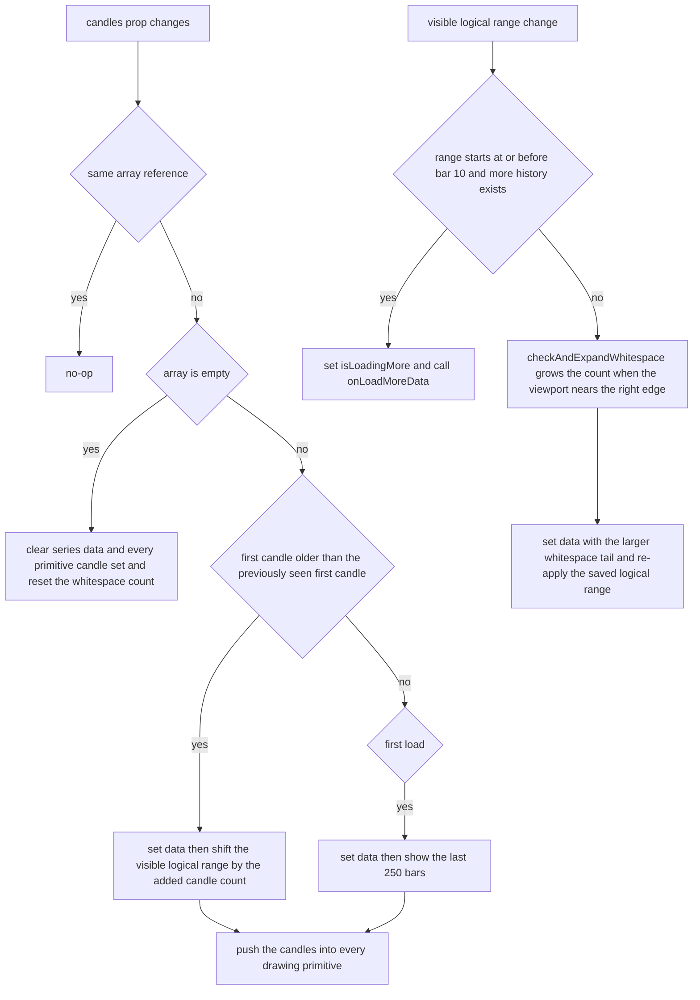
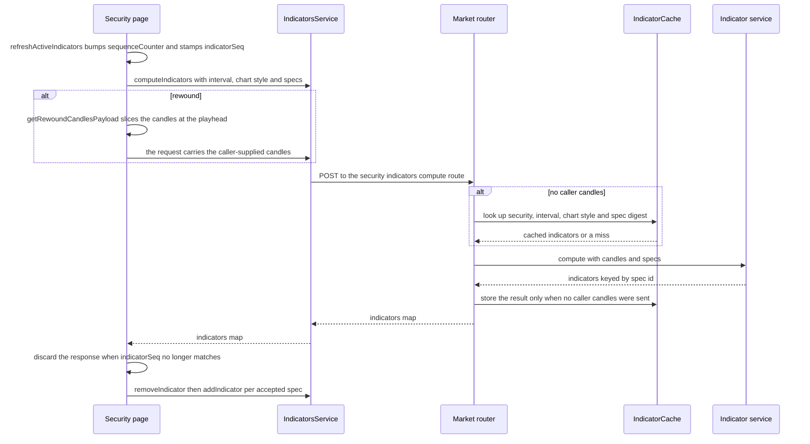

This page covers the chart *surface*: the `lightweight-charts` wrapper, its data and pane lifecycle, chart preferences, the indicator pipeline and the price-alert primitive. Drawing tools, their series-primitive plugins, drawing persistence and the snapshot/rewind pipeline are documented on [Chart Drawings, Plugins & Rewind](./chart-drawings-and-rewind.md) — this page only points at them.

| Layer | Location | Owns |
|---|---|---|
| Chart surface | `frontend/src/lib/components/charts/security-chart.svelte` | chart instance, candlestick series, price-scale panes, primitives, indicator series, whitespace |
| Route orchestration | `frontend/src/routes/security/[security_id]/+page.svelte` + `page-data.svelte.ts` | data loading, timeframe/style preferences, indicator requests, pane-height persistence |
| Pane math | `frontend/src/lib/chart/indicator-pane-layout.ts` | pure pane-height distribution and `scaleMargins` computation |
| Indicator defaults | `frontend/src/lib/chart/indicator-defaults.ts` | the frozen default table and per-page copies |
| Indicator API | `frontend/src/lib/api/indicatorsService.ts` → `src/market/router.py` → indicator service | compute request/response contract, backend cache |
| Chart settings | `frontend/src/lib/components/charts/chart-settings-modal.svelte` | hide-labels, wave settings, fib level/width editing |
| Price alerts | `frontend/src/lib/components/charts/plugins/user-price-alerts/` | alert lines, add/remove buttons, price-axis labels |
| Drawings & rewind | `frontend/src/lib/components/charts/plugins/*`, `$lib/utils/finance/*`, `$lib/services/ChartDrawingsService.svelte.ts` | see [Chart Drawings, Plugins & Rewind](./chart-drawings-and-rewind.md) |

## Entry points

| Concern | Location |
|---|---|
| Chart component | `frontend/src/lib/components/charts/security-chart.svelte` |
| Security page | `frontend/src/routes/security/[security_id]/+page.svelte` |
| Route load (identity only) | `frontend/src/routes/security/[security_id]/+page.server.ts` |
| Post-navigation data wave | `frontend/src/routes/security/[security_id]/page-data.svelte.ts` |
| Pane layout math | `frontend/src/lib/chart/indicator-pane-layout.ts` |
| Indicator defaults | `frontend/src/lib/chart/indicator-defaults.ts` |
| Chart preference helpers | `frontend/src/lib/chart-preferences.ts` |
| Time helpers | `frontend/src/lib/utils/date.ts`, `frontend/src/lib/utils/finance/candle.ts` |
| Indicator API client | `frontend/src/lib/api/indicatorsService.ts` |
| Chart settings modal | `frontend/src/lib/components/charts/chart-settings-modal.svelte` |
| Price-alert primitive | `frontend/src/lib/components/charts/plugins/user-price-alerts/` |
| Bands overlay primitive | `frontend/src/lib/components/charts/plugins/bands-indicator.ts` |
| SVG sparkline (no chart library) | `frontend/src/lib/components/charts/sparkline.svelte` |

The chart bundle is loaded lazily: the page `await import('$lib/components/charts/security-chart.svelte')`s only after the security and its `1d` series resolve, so chart code never runs during SSR.

## Route data: identity first, series after navigation

`+page.server.ts` deliberately does almost nothing — it validates the `security_id` param (400 `Security ID is required` when absent) and returns `{ security_id }`. It never fetches the security or its prices.

`SecurityPageDataService` (`page-data.svelte.ts`) owns the post-navigation data wave. `load(securityId)`:

- increments a private `loadSeq` and discards its own result when a newer soft navigation has superseded it;
- fetches `getSecurity(securityId)` and `getPrices(securityId, from, to, '1d')` in parallel, using `getChartDateWindow(new SvelteDate(), '1d')`;
- treats a missing or empty `items` array as a *successful* load whose message lands in `error` (`No price data available for this security`);
- never throws — it returns the caught error so the page can route a 401 through `redirectOn401`.

Because identity and prices resolve after navigation, the page can render its shell immediately: `instantSecurity` is looked up in the already-loaded default watchlist so the titlebar shows the symbol before the fetch lands, and the chart region shows `Loading chart data...` until the dynamic import resolves. A per-security `$effect` resets tool state, `timeframeError`, `hasMoreData`, `isLoadingMore` and `securityChart` on every route transition, then runs the async init chain (preferences → candle mapping → alerts/holdings/snapshots → chart import). The async load always fetches the `1d` series, so on soft navigation the page force-refetches the active timeframe (`changeTimeframe(selectedInterval, { persist: false, force: true })`) unless a timeframe change is already in flight.

## The chart surface (`security-chart.svelte`)

### Props and ownership

The component receives data and drawing-model state as props and reports intent back through callbacks; it persists nothing itself:

- Core: `candles`, `containerId`, `hasMoreData`, `isLoadingMore` (bindable), `onLoadMoreData`, `hideLabels`, `averagePrice`/`showAveragePrice`, `futureBars` (default `DEFAULT_FUTURE_BARS` = 100), `onPaneHeightsChange`.
- Alerts: `alerts`, `onAddAlert(price, condition)`, `onRemoveAlert(id)`.
- Drawings: the Elliott-wave and Fibonacci prop/callback pairs, `securityDrawings` plus the measure / horizontal-line / free-form-line drawing flags, selections and change callbacks, and `onDrawingDragStart` / `onDrawingDragEnd`.
- Pane heights: `onPaneHeightsChange(heights | null)`.

Prop→primitive syncing happens in guarded `$effect`s that compare the primitive's current value against the incoming prop (using the finance-layer equality helpers) before calling a setter, so no update loop forms between prop and primitive.

### Mount, series and primitive wiring

`onMount` creates the chart with `CrosshairMode.Normal`, a transparent background, `formatLocalTime` as the time formatter, `formatLocalTickMark` as the tick-mark formatter, `ignoreWhitespaceIndices: false`, a hidden left price scale and a right price scale with `minimumWidth` 75 (`DEFAULT_PRICE_SCALE_MIN_WIDTH`). It then:

1. Subscribes `timeScale().subscribeVisibleLogicalRangeChange` for two duties: pagination and future-whitespace expansion.
2. Adds the main `CandlestickSeries` (`#26a69a` up / `#ef5350` down, borders off) and calls `updatePanes()`.
3. Attaches six primitives to that series: `UserPriceAlerts` (with `setSymbolName('Price')`), `ElliottWavesPrimitive`, `FibonacciPrimitive`, `MeasurePrimitive`, `HorizontalLinePrimitive`, `FreeFormLinePrimitive`.
4. Subscribes each primitive's delegates and re-emits them as page callbacks — `alertAdded`/`alertRemoved`, `wavePointsChanged`, `drawingModeChanged`, `degreeChanged`, `waveTypeChanged`, `selectionChanged`, `doubleClicked`, `toolChanged`, `drawingsChanged`, `dragStarted`/`dragEnded`.
5. Installs a capture-phase, non-passive `wheel` listener that zooms the **price scale** (not the time scale) by `1.025`/`0.975` around the mid-point of its visible range when the pointer sits over the price-scale strip, and a `ResizeObserver` that resizes the chart to the container and re-runs `checkAndExpandWhitespace`.
6. Returns a teardown that removes the wheel listener, disconnects the observer, destroys all six primitives and only then calls `chartInstance.remove()`.

Separate `$effect`s keep the chart in sync with props: container size, the average-price dashed `IPriceLine`, and `hideLabels`, which drives `lastValueVisible` / `priceLineVisible` / `title` across every indicator series group (including the three MACD series and the three BB series).

### Drawing mode locks panning

One `$effect` ORs all five drawing flags and applies `handleScroll: { pressedMouseMove: !isDrawing }`. Each primitive's `drawingModeChanged` subscription restores `pressedMouseMove: true` only once *every* other drawing flag is off, so finishing one tool does not unlock panning while another is still active.

### Candle updates, pagination and future whitespace

The `candles` `$effect` is the single writer of series data:

- Same array reference → no-op (the page replaces the array when data changes, which is the change signal).
- Empty array → clear series data and every primitive's candle set, reset `currentWhitespaceCount` to `futureBars`, clear `previousFirstCandleTime` and `isLoadingMore`.
- **Prepending** (the first candle is older than the previously-seen first candle) → set data, then shift the visible logical range by the number of prepended candles so the viewport does not jump.
- **First load** → size `currentWhitespaceCount` from `futureBars` and the container width, then show the last 250 bars.
- Every non-empty update writes `seriesInstance.setData([...candles, ...generateFutureWhitespace(candles, currentWhitespaceCount)])` and pushes the raw candles into all five drawing primitives.



The candle `$effect` is the only writer of series data; the visible-range subscription drives pagination and whitespace expansion from the same prop.

Pagination lives on the same subscription: when `range.from <= 10 && !isLoadingMore && hasMoreData`, the component sets `isLoadingMore = true` and calls `onLoadMoreData()`. The page's `handleLoadMoreData` guards with `shouldFetchMoreData(...)`, fetches the older window for the active interval, maps/sorts candles, merges with `mergeCandles` (dedupe by `String(time)`, prepend), recomputes Heikin-Ashi candles and refreshes indicators — setting `hasMoreData = false` when the fetch is empty or adds nothing. An `$effect` also forces `isLoadingMore = false` whenever `hasMoreData` goes false.

Future whitespace is what makes drawing *ahead* of the last candle possible. `generateFutureWhitespace(candles, count)` returns `[]` for fewer than two candles or a non-positive count, derives the bar interval from the median spacing of the most recent candles (`computeIntervalSeconds`, last 8 spacings) and appends `count` whitespace points one interval apart via `addIntervalToTime`, preserving the reference candle's `Time` shape (epoch seconds vs. `YYYY-MM-DD` vs. `BusinessDay`). `checkAndExpandWhitespace(range)` re-enters only when it is not already updating, grows the count when the visible range approaches the right edge (threshold `max(lastCandleIndex + 1, currentEndIndex - 30)`, target `ceil(range.to - lastCandleIndex) + 100`) or when the container is wide enough to need more bars (`ceil(clientWidth / 4) + 100`), and re-applies the previously saved visible logical range so the expansion is invisible to the user.

### Imperative surface

Exports consumed through `bind:this` from the page:

| Export | Purpose |
|---|---|
| `updateData(candles)` | Replace series data (plus whitespace) and show the last 250 bars; sets `lastCandlesRef` so the candle effect does not re-apply, and does **not** push candles into the drawing primitives |
| `addIndicator` / `updateIndicatorData` / `removeIndicator` | Add, refresh or drop an indicator series group |
| `getPaneHeights` / `setPaneHeights` / `resetPaneHeights` | Read, restore (no change callback) or clear the custom pane layout |
| `clearWave`, `getAllWaves`, `getSelectedWaveDegree` / `setSelectedWaveDegree`, `getSelectedWaveId` / `setSelectedWaveId`, `getElliottWavesPrimitive` | Elliott-wave proxy API |
| `clearFibonacci`, `getSelectedFibTool` / `setSelectedFibTool`, `getFibonacciPrimitive` | Fibonacci proxy API |
| `getMeasurePrimitive`, `getSelectedMeasureId` / `setSelectedMeasureId`, `getHorizontalLinePrimitive`, `getSelectedHorizontalLineId` / `setSelectedHorizontalLineId`, `getLinePrimitive`, `getSelectedLineId` / `setSelectedLineId` | New-tool proxy API |

## Panes: price scales carved out with `scaleMargins`

`lightweight-charts` has no native panes here. Every "pane" is a **price-scale id** whose visible band is expressed with `scaleMargins` (`top`/`bottom` fractions of the chart height):

- `MAIN_PANE_ID` = `'main'` is the candlestick series' own scale (the right price scale); `VOLUME_PANE_ID` = `'volume'`; `OSCILLATOR_PANE_IDS` = `['rsi', 'macd', 'obv']` fixes the stacking order.
- The component keeps `orderedPaneIds` in explicit state (not derived from `indicatorSeries`) so it updates reliably when indicators are added or removed imperatively. `getOrderedPaneIds()` builds `main`, then `volume` when present, then the oscillators in order.
- `applyPaneMargins()` refreshes the ids, calls `computePaneScaleMargins(paneIds, customPaneHeights)` and applies the result — `seriesInstance.priceScale().applyOptions({ scaleMargins })` for `main`, `chartInstance.priceScale(id).applyOptions({ scaleMargins })` for the others. `updatePanes()` is that same call, invoked after every add/remove, on restore and on every pane-drag move.

`bb` (Bollinger Bands) is an *overlay*, not an oscillator: it is drawn on the main price scale and never triggers a pane re-layout.

### Default layout math (`indicator-pane-layout.ts`)

The pure module is the single owner of the arithmetic; the chart only applies the result. With no applicable custom height it returns the exact margins the chart used before resizing existed (`computeDefaultPaneScaleMargins`):

- No oscillators, no volume → `main { top: 0.1, bottom: 0.1 }`.
- Volume only → `volume { top: 0.7, bottom: 0 }`, `main { top: 0.1, bottom: 0.35 }`.
- Oscillators present → per-oscillator height `0.25` (one), `0.18` (two), `0.14` (three), a `0.02` gap between panes, `mainAreaHeight = max(0.3, 1 - count * (paneHeight + gap))`; volume (when enabled) takes the bottom 25% of the main area and the candlestick scale is squeezed accordingly; oscillators are stacked below the main area in `OSCILLATOR_PANE_IDS` order.

With custom heights, `distributePaneHeights` allocates `1 - TOP_MARGIN (0.05) - BOTTOM_MARGIN (0) - (n - 1) * PANE_GAP (0.02)` across the ordered panes proportionally to their weights — the custom height when valid, otherwise the derived default band height, otherwise the `DEFAULT_PANE_HEIGHTS` fallback (`main 0.5`, `volume 0.15`, `rsi 0.25`, `macd 0.18`, `obv 0.14`) — clamped to `[MIN_PANE_FRACTION (0.08), MAX_PANE_FRACTION (0.8)]`. `allocatePaneHeights` is a water-filling allocator: panes whose proportional share falls outside the bounds are pinned to the bound and the remainder is redistributed among the rest, so the result is always non-overlapping and inside `[0, 1]`. `computePaneBandHeights` converts the margins back into visible band heights for the drag logic.

### Custom pane heights

The component renders one absolutely-positioned resize handle per *adjacent* pane pair (`data-testid="pane-resize-handle-<upper>-<lower>"`, positioned at the mid-point between the upper pane's bottom edge and the lower pane's top edge):

- `pointerdown` captures the pointer (best-effort, jsdom-safe) and records `startY` plus `computePaneBandHeights(getOrderedPaneIds(), customPaneHeights)`.
- `pointermove` converts `(clientY - startY) / containerHeight` into a fraction delta, moves it between the two panes while preserving their sum and clamping both to `[MIN_PANE_FRACTION, MAX_PANE_FRACTION]`, updates `customPaneHeights` and re-applies the margins immediately — the chart re-renders on every move, not only on release.
- `pointerup` / `pointercancel` (window-level) end the drag and fire `onPaneHeightsChange({ ...customPaneHeights })` exactly once.
- A `Reset pane sizes` button (`data-testid="reset-pane-heights"`) is rendered only while a custom height applies to a present pane; it clears the custom layout, re-applies the defaults and reports `onPaneHeightsChange(null)`.
- `removeIndicator(type)` also deletes that indicator's entry from `customPaneHeights` (collapsing to `null` when it becomes empty), so re-adding an oscillator starts from the default height rather than a stale fraction.

### Persistence: the `indicator_pane_heights` preference

The page owns persistence:

- `handlePaneHeightsChange(heights)` updates local `userPreferences` and PATCHes `{ indicator_pane_heights: heights }` — the whole key every time, because PATCH replaces it; a reset sends `null`.
- `applySavedPaneHeights(prefs)` calls `chartRef?.setPaneHeights?.(heights)` behind a `setTimeout(..., 100)` so the chart ref is bound first, and does nothing when the stored map is absent or empty. It runs both from the init chain and from `onPreferencesLoaded`.
- `ChartInstance` (the interface `ChartDrawingsService` and the page use) exposes `setPaneHeights` as optional, which is why the call is guarded.

## Timeframe and chart-style preferences

The toolbar offers five intervals — `1h`, `4h`, `1d`, `1w`, `1m` — and two chart styles, `candlestick` and `heikin_ashi`.

`changeTimeframe(interval, { persist, force })` bails out without a security id, while `isChangingTimeframe`, or when `shouldForceRefetch(selectedInterval, interval, force)` is false (it is true when `force` is set or the interval differs). It then resets pagination state, computes the window with `getChartDateWindow(new Date(), interval)` (a 30-day window for intraday intervals, a 2-year window otherwise), fetches through `MarketService.getPrices`, maps intraday rows to `UTCTimestamp` epoch seconds and daily-or-coarser rows to their date string, sorts oldest→newest, sets `rawCandles`, recomputes `haCandles = convertToHeikinAshi(rawCandles)` and calls `refreshActiveIndicators()`. An empty response sets `timeframeError` (`No price data available for this timeframe`). The preference patch is issued **after** the fetch `try/catch` and only when `persist && fetchOk`, so a failed preference write can neither mask a fetch error nor hold `isChangingTimeframe` open.

`displayCandles = displayCandlesFor(chartStyle, rawCandles, haCandles)` feeds the chart; the two style buttons set `chartStyle`, call `refreshActiveIndicators()` and PATCH `chart_style`. `chart-preferences.ts` holds the pure helpers the page relies on: `mergeChartPreferences` (preserves the `indicators` key across partial writes), `displayCandlesFor`, `shouldForceRefetch`, `parseCandleTime` (number / `YYYY-MM-DD` / ISO string / `BusinessDay` → `Date`), `mergeCandles` and `shouldFetchMoreData`.

`onPreferencesLoaded(prefs)` applies the persisted state in order: chart style (falling back to `heikin_ashi`), the saved timeframe via `changeTimeframe(prefs.timeframe, { persist: false })`, the saved pane heights, the preferences object into `ChartDrawingsService`, and finally the saved indicator toggles — each `onIndicatorToggle(id, true)` deferred through `setTimeout(..., 100)` so the chart ref is bound.

## Indicators

### Defaults

`INDICATOR_DEFAULTS` is the single source of truth: ids `volume`, `avgPrice`, `ma50`, `ma200`, `ma50w`, `ma200w`, `bb`, `macd`, `rsi`, `obv`, in sidebar render order (do not reorder), deep-frozen so accidental mutation throws. Only `avgPrice` is enabled by default. `createIndicatorConfigs()` returns a fully independent copy (including nested `settings`) for the page to mutate; the page keeps it in `indicatorConfigs` state.

### Series composition

`addIndicator(indicator)` switches on `indicator.type`:

| Type | Series composition | Price scale |
|---|---|---|
| `volume` | one `HistogramSeries`, `priceFormat: { type: 'volume' }` | `volume` |
| `rsi` | one `LineSeries` | `rsi` |
| `macd` | `HistogramSeries` + MACD `LineSeries` + signal `LineSeries`, histogram colored per sign (`#26a69a80` / `#ef535080`) | `macd` |
| `obv` | one `LineSeries` with a custom `M/1M` price formatter | `obv` |
| `bb` | three `LineSeries` (upper/middle/lower, `hexToRgba` alpha 0.5/1/0.5) + a `BandsIndicator` primitive attached to `middle` | main |
| everything else (`ma50`, `ma200`, …) | one `LineSeries` overlay | main |

Each branch records the group in `indicatorSeries` and appends to `activeIndicators`, then calls `updatePanes()` (except `bb`, which is an overlay). `removeIndicator(type)` detaches the bands primitive before removing the three BB series, removes all three MACD series, or removes the single series, then drops the group and any stale custom pane height and re-applies the margins. `updateIndicatorData(indicator)` refreshes `setData` per series shape and falls back to `addIndicator` when the group does not exist yet.

### The compute request/response contract

`IndicatorsService.computeIndicators(securityId, request)` POSTs to `/api/v1/market/securities/{security_id}/indicators/compute`:

```ts
interface IndicatorComputeRequest {
    interval: string;
    chart_style?: 'candlestick' | 'heikin_ashi';
    indicators: IndicatorSpec[];   // { id?, type, period?, fast?, slow?, signal?, stdDev?, settings? }
    candles?: IndicatorCandle[];   // caller-supplied series
    from_date?: string;
    to_date?: string;
}
interface IndicatorComputeResponse {
    indicators: Record<string, unknown[]>;
}
```

The backend `IndicatorSpecSchema` mirrors the spec (`stdDev` is aliased to `std_dev`), and the response map is keyed by spec id/type — the page reads `res.indicators[id] ?? res.indicators[spec.type] ?? []`. `buildIndicatorSpec` copies only the positive numeric fields (`period`, `fast`, `slow`, `signal`, `stdDev`) plus `settings` from the indicator config.

The route validates the window (`from_date <= to_date`, otherwise 422), then:

- builds candles from the daily price repository (aggregating to weekly or monthly when asked) or from the intraday repository (aggregating to 4h), or uses `request.candles` verbatim;
- converts to Heikin-Ashi server-side when `chart_style === 'heikin_ashi'`;
- calls the external indicator service through `IndicatorServiceClient.compute` (timeouts become 504, connection errors and 5xx become 503);
- **consults and populates `IndicatorCache` only when `request.candles` is absent**. That is the point of the caller-supplied path: the rewind payload (`getRewoundCandlesPayload()`, which slices `rawCandles` at the timeline position) must never be served from, or written to, the cache, because the cache key describes security + interval + chart style + a digest of the canonical indicator specs and the date window — not the caller's candle set.

### Round trip and the out-of-order guard



Indicator compute round trip: the page stamps a monotonic sequence per request, the backend caches only cache-eligible requests, and a response whose sequence is stale is discarded.

Two request paths share one guard:

- `refreshActiveIndicators()` (bulk: timeframe change, chart-style change, rewind scrub, load-more) increments `sequenceCounter`, records it in `activeRefreshSeq`, and writes that sequence into `indicatorSeq[id]` for **every enabled indicator**. When the response lands it is accepted per indicator only if `indicatorConfigs[id]?.enabled && indicatorSeq[id] === seq`.
- `onIndicatorToggle(id, enabled)` (single) bumps `sequenceCounter` into `indicatorSeq[id]`, sends one spec, and accepts the response only if the stored sequence still matches, the indicator is still enabled and the chart ref exists. Disabling removes the series immediately and bumps `indicatorSeq[id]` so an in-flight response cannot resurrect a disabled indicator.

This is the standard defence against out-of-order responses when the user toggles indicators quickly or changes timeframe mid-flight; `isLoadingIndicators` drives the toolbar spinner and is only cleared by the newest request.

Two "indicators" never reach the backend:

- `volume` is rendered locally from `displayCandles` (`removeIndicator('volume')` then `addIndicator` with `close >= open ? '#26a69a80' : '#ef535080'`).
- `avgPrice` is not a series at all: it is a dashed `IPriceLine` created/removed by an `$effect` from `averagePrice` + `showAveragePrice`, fed by `blendedAverageCost(holdings)`, and it is skipped when building specs.

## Chart settings

`chart-settings-modal.svelte` has three sections, each with local draft state that is re-synced from props (via serialized `JSON.stringify` keys, to avoid spurious resyncs from `$state` proxies) and a save/cancel pair:

- **General** — the hide-labels toggle; saving calls `onSaveChartHideLabels`, which the page persists as `chart_hide_labels`.
- **Waves** — `snap_to_wicks` plus per-degree wave-3/wave-5 alert percentages. Percentages are parsed and validated (non-numeric, non-finite or negative input blocks the save), and saving calls `onSaveWaveSettings`, which the page persists as `wave_settings` and follows with a wave-alert reconcile.
- **Fibonacci** — level toggles, enable-all/disable-all/reset and width-stop/`extendLines` editing for the retracement/extension tabs. The whole section is disabled when the page reports no active drawing (`hasActiveDrawing`).

The modal is opened from the toolbar settings button or with `Cmd/Ctrl+,`, which `ChartDrawingsService.handleKeyDown` routes to `onChartSettingsOpen` — the page flips `isChartSettingsOpen`.

## Price alerts on the chart

### The alert primitive

`frontend/src/lib/components/charts/plugins/user-price-alerts/` renders price alerts as a series primitive and is deliberately **not** built on the shared drawing-primitive base: it needs pointer positions over the price scale (which the shared mouse engine clips away), so it ships its own `MouseHandlers`, and it exposes both pane views and **price-axis pane views**.

- `UserPriceAlerts.attached` creates one `UserAlertPricePaneView(false)` and one `UserAlertPricePaneView(true)`, attaches the mouse handlers and subscribes `alertsChanged` / `mouseMoved` / `clicked` to `requestUpdate`. A click inside the price-scale button column adds an alert at `series.coordinateToPrice(y)`; a click on a hovered alert's remove button removes it.
- `updateAllViews` computes renderer data once for both renderers, finds the alert closest to the pointer within `showCentreLabelDistance`, and sets `_hoveringID` / `_currentCursor = 'pointer'` when the pointer is over the add button or a remove button. `hitTest()` reports `externalId: 'user-alerts-primitive'`.
- `UserAlertsState` stores alerts in a `Map`, exposes `alertAdded` / `alertRemoved` / `alertChanged` / `alertsChanged` delegates, keeps a price-descending array view, and generates random 6-digit ids, regenerating on collision.
- Rendering uses `positionsLine` for the alert line, the centre label, its divider and the price-scale label.

The chart component bridges the primitive to the backend: an `$effect` pushes `alerts` into `setAlerts([{ id: String(a.id), price: a.target_price }])`; `alertAdded` derives the condition from the last candle close (`price > close ? 'above' : 'below'`) and calls `onAddAlert`; `alertRemoved` parses the string id back to a number and calls `onRemoveAlert`. The page then creates/deletes through `AlertsService` and reloads the alert list, so the primitive always renders server state.

### Wave-derived alerts

Wave targets produce real price alerts with `source: 'wave'`. `handleWaveSettingsChange` (and the drawings service's wave-change path) call `scheduleWaveAlertsReconcile`, which chains `reconcileWaveAlertsForSecurity` onto a single promise — `onWaveChange` fires once per placed point, and concurrent reconciles reading stale `alerts` state would double-create. The reconcile reads `wave_settings` (defaulting to `DEFAULT_WAVE_SETTINGS`), computes desired levels with `computeWaveAlertLevels(settings, securityElliottWaves, lastClose)`, diffs them with `reconcileWaveAlerts(alerts, desired)`, applies the deletes and creates in parallel and calls `loadAlerts()` when anything changed. The initial page load also reconciles, but only after preferences have loaded, so a failed preference fetch can never mass-delete wave alerts. A reconcile failure only logs — the next run self-heals.

## Related rendering surfaces

- `utils/date.ts` supplies the chart's time formatting: `formatLocalTime` renders epoch seconds as `YYYY-MM-DD HH:mm` and passes date strings through unchanged (and formats a `BusinessDay` object itself), while `formatLocalTickMark` returns `null` for non-numeric times and otherwise formats by `TickMarkType` (year / month / day / time / time-with-seconds). `getChartDateWindow` is the shared window helper for both the initial load and every timeframe change.
- `sparkline.svelte` is a chart-library-free SVG sparkline: it derives values from numbers or `Candle.close`, builds a Catmull-Rom smoothed line plus an area path in a fixed `0 0 100 height` view box, colors by first-vs-last trend (or an explicit `isPositive`/`color`), and is used by the holdings views — it never touches `lightweight-charts`.

## Testing conventions

Chart tests are colocated with their subject and follow the repository rules in `frontend/AGENTS.md` and [Testing](../operations/testing.md). The binding constraint for this subsystem: **no test may perform a real network call or render a real chart.**

- `lightweight-charts` is replaced with a `vi.mock` factory exposing `createChart`, `CrosshairMode`, `CandlestickSeries`, `LineSeries`, `HistogramSeries` and chainable `timeScale` / `priceScale` / `addSeries` / `attachPrimitive` mocks; `security-chart.test.ts` also stubs `Path2D` and `ResizeObserver` before importing the component.
- Canvas targets are faked: `useBitmapCoordinateSpace` invokes its callback with a fake `BitmapCoordinatesRenderingScope` (recording 2D context, media/bitmap sizes, `horizontalPixelRatio` / `verticalPixelRatio`), so renderer draw calls can be asserted.
- Every API client a subject calls is mocked (`indicatorsService`, `marketService`, `userPreferencesService`, `alertsService`, `accountService`, `snapshotsService`, …).
- `security-chart.test.ts` covers the surface directly: infinite scroll / logical-range behaviour, oscillator panes and custom price scales, `hideLabels`, the price-scale wheel zoom, the drawing pan-lock and its restore rules, future whitespace, and resizable indicator panes (legacy default margins, handle rendering per adjacent pair, drag bounds, restore via `setPaneHeights`, dropping a removed oscillator's height, and the reset affordance).
- `indicator-pane-layout.test.ts` pins the pure math: the legacy margins for 0/1/2/3 oscillators and the volume variants, custom-height normalization, min/max clamping, and the water-filling allocator. `indicator-defaults.test.ts` pins the frozen table, key order and copy independence.
- Page-level suites live in `routes/security/[security_id]/page.svelte.test.ts` (`Security Page - Asynchronous Indicator Integration`, `Security Page - Indicator Pane Heights`, `Security Page - Instant Shell with Async Chart Data`, `Security Page - Top Toolbar`, `Security Page - Viewport Containment & Scrolling Layout`, …), and `page.server.test.ts` asserts the load returns only `security_id` and never calls the market service.

Run the chart suites with `./scripts/agent-test frontend/src/lib/components/charts/...` while iterating and `./scripts/agent-test frontend` before finishing.

## Invariants and safe-change notes

- **One writer for series data.** The `candles` `$effect` is the only place that calls `setData` on the candlestick series outside `updateData`; it no-ops on the same array reference, so the page must always replace the array (never mutate it) to signal a change.
- **Panes are price scales.** A new oscillator needs a price-scale id registered in `OSCILLATOR_PANE_IDS` (or an explicit entry in `orderedPaneIds`) *before* margins are applied, or its `scaleMargins` are silently skipped. Never let two panes claim overlapping bands — the default path and the custom path must both stay inside `[0, 1]`.
- **The default pane layout is legacy-exact by construction.** `computePaneScaleMargins` must keep delegating to `computeDefaultPaneScaleMargins` when no custom height applies, otherwise the default chart look changes for every user.
- **Custom pane heights are a whole-key preference.** PATCH replaces `indicator_pane_heights`, so always send the complete map (or `null`); restoring a stored layout must go through `setPaneHeights` (no callback) to avoid an echo write-back.
- **Stale-response guards are per indicator.** New indicator work must thread `sequenceCounter` / `indicatorSeq` (bulk) or the per-id sequence (single toggle), or a slow response can overwrite newer data or re-enable a disabled indicator.
- **Caller-supplied candles bypass the backend cache.** The cache key cannot describe a client-side candle set, so any new caller-candle path must keep the `if not request.candles` guard on both the read and the write.
- **Chart code is browser-only.** The component is dynamically imported after navigation; anything that assumes `window`, `ResizeObserver` or a DOM container must stay inside that import (and inside `onMount`) so SSR never executes it.
- **Preferences are additive.** New chart preferences belong in `UserPreferences` and must be persisted with a partial `patchPreferences` call; `mergeChartPreferences` exists specifically so a chart-style or timeframe patch cannot clobber the `indicators` key.
- **Drawings and rewind have their own page.** Anything about the series-primitive plugin contract, drawing persistence, `ChartDrawingsService`, snapshots or the rewind timeline belongs in [Chart Drawings, Plugins & Rewind](./chart-drawings-and-rewind.md) — do not duplicate it here.
