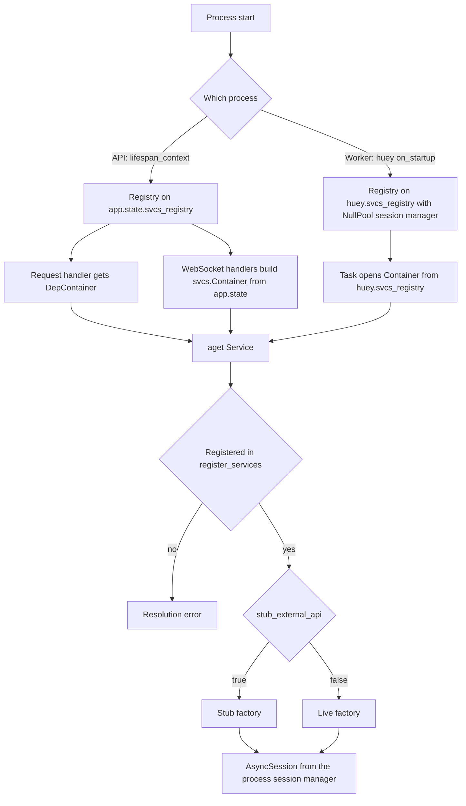

# Configuration, Dependency Injection & Cross-Cutting Runtime

Everything documented here is infrastructure that nearly every feature touches: the `Settings` model, the `svcs` registry that resolves services, the database and Redis session managers, the slowapi limiter, and the request-ID/logging middleware. Per-request control flow itself is owned by the [Architecture Overview](./overview.md); this page covers the seams a change must hook into.

## One `.env`, four consumers

The tracked `.env.example` at the repository root is the single source of configuration. It is copied to a gitignored `.env`, and that one file feeds four consumers:

| Consumer | How it reads the file |
|----------|----------------------|
| Backend (`src/main.py`) | `env_file=(".env",)` is resolved from the process working directory; `docker-compose.yml` also passes the file via `env_file: [./.env]` |
| Worker (`src/worker.py`) | Same process environment; the `worker` service in `docker-compose.yml` uses `env_file: [./.env]` |
| Docker Compose | Compose interpolates `${ENVIRONMENT}`, `${BACKEND_PORT}`, `${FRONTEND_PORT}`, `${DOCKER_GID}`, the debug ports and the `VITE_*` values from the same file |
| Frontend service | Compose forwards `VITE_API_BASE_URL`, `VITE_INTERNAL_API_URL` and `VITE_ALLOWED_HOSTS` to the `frontend` container, and maps `SECRET_KEY` → `JWT_SECRET` |

The `SECRET_KEY` → `JWT_SECRET` mapping is the load-bearing one: `docker-compose.yml` declares `JWT_SECRET: "${SECRET_KEY:?SECRET_KEY must be set in the root .env}"`, so the SvelteKit SSR route guard in `frontend/src/hooks.server.ts` verifies `auth_token` with exactly the HS256 key the backend signs with (`UserApi.create_access_token`). Compose fails fast if `SECRET_KEY` is missing, and no second secret exists to drift. See [Authentication](./authentication.md) for the token lifecycle.

`Settings.model_config` deliberately pins `env_file=(".env",)` and `extra="ignore"`: stray files such as `src/.env` are ignored, unknown keys are tolerated, and process environment variables win over file values. `tests/test_settings.py` locks in all four behaviors (root-file loading, `src/.env` being ignored, defaults when no file exists, env-var override).

## The `Settings` model

`src/config/settings.py` holds the whole contract. Defaults mirror the Compose dev stack, so a missing variable degrades to a working dev value rather than a crash. Notable groups and how each is consumed:

- **Runtime mode.** `environment` defaults to `"prod"` and is branched on across the codebase: migrations are skipped in `test`, `debugpy.listen(("0.0.0.0", 5678))` runs only in `dev`, cookie `httponly`/`secure` flags and error-detail redaction are enabled in `prod`, and the worker swaps `RedisHuey` for `MemoryHuey` in `test`.
- **`secret_key`.** Validated by a `model_validator(mode="after")`: outside `dev`/`test` it must be non-empty and at least `MIN_SECRET_KEY_LENGTH = 32` characters, otherwise `Settings()` raises. It signs JWTs (`src/auth/api.py`), email-verification tokens (`URLSafeTimedSerializer` in `src/auth/service.py`), WebSocket tickets (`src/ws/router.py`, `src/worker_dashboard/router.py`) and is the slowapi key-function decode key.
- **`log_level`.** Optional override; `init_logging()` falls back to `WARNING` in `test` and `DEBUG` otherwise.
- **`database_url` / `echo_sql`.** Consumed when constructing the process-wide `DatabaseSessionManager` and passed to the Huey dashboard.
- **CORS.** `cors_allow_origins`, `cors_allow_methods` and `cors_allow_headers` are comma-split at app construction; outside `prod` the app additionally permits `allow_origin_regex=r"https?://.*"`.
- **`stub_external_api`.** The stub/live switch described below. It is absent from `.env.example`, so the dev Compose stack runs wire-based adapters with the placeholder `EODHD_API_KEY="demo"`; the details of each outbound boundary live in [External Services](../integrations/external-services.md).
- **`upload_path`.** Root directory for security-document uploads; the router creates it with `mkdir(parents=True, exist_ok=True)` and writes files under generated UUID names.
- **Market / indicator / AI.** `eodhd_api_key`, `indicator_service_url`, `ai_api_endpoint`, `ai_api_key`, `ai_api_model` are read inside the corresponding factories rather than at construction.
- **Redis.** `redis_url`, plus `sync_ttl_seconds` used as the TTL for the account-sync status key set.
- **TOTP.** `totp_max_attempts` and `totp_lockout_seconds` drive the 2FA attempt counter and Redis lockout.
- **WebAuthn.** `webauthn_rp_id`, `webauthn_rp_name`, `webauthn_origin`, `webauthn_challenge_ttl_seconds` configure passkey registration/assertion and the stored challenge lifetime.
- **Email.** `smtp_host`, `smtp_port`, `smtp_use_tls`, `smtp_user`, `smtp_password`, `smtp_sender_email`, `email_verification_token_expiry_hours`. A `field_validator(mode="before")` on `smtp_sender_email` substitutes `noreply@retail-portfolio.local` when the value is blank.
- **`frontend_url`.** Used to build absolute links in outgoing email (verification links, price-alert deeplinks, external-account error deeplinks).

`Settings()` is instantiated once at import time as the module-level `settings` singleton; every consumer imports that object. Tests monkeypatch attributes on the singleton (`monkeypatch.setattr(settings, "environment", "dev")`), so code that branches on settings at call time is testable, while code that captured a value at import time is not.

## Dependency injection: the `svcs` registry

Services are resolved through the `svcs` library. `src/config/services.py::register_services(registry, sessionmanager)` is the one registration entry point, shared by the API process and the worker, and it always:

1. registers the session factory — `registry.register_factory(AsyncSession, sessionmanager.session)` — which is how the database session reaches every repository factory;
2. calls `register_core_services`, which registers the `EmailService` value (`registry.register_value(EmailService, EmailService())`, the one eager registration);
3. calls `register_account_services` and `register_auth_services` unconditionally;
4. picks stub or live registrations for the market and integration domains based on `settings.stub_external_api`.

Each domain exports its own `register_*_services(registry)` from a `registry.py` module or package `__init__` (`src/account/registry.py`, `src/auth/__init__.py`, `src/integration/registry.py`, `src/market/__init__.py`, `src/core/registry.py`). **This is the extension point: a new repository, service or domain API must be added to its domain's `register_*_services` function to be resolvable.** Services not registered there cannot be `aget`-ed and will fail at resolution time.

### Stub vs. live selection

`register_services` short-circuits to `register_integration_stub_services` and `register_market_stub_services` when `settings.stub_external_api` is true, otherwise to `register_integration_services` and `register_market_services`. The two paths register the *same abstract keys* with different factories, so callers are unaffected:

| Key | Live factory | Stub factory |
|-----|--------------|--------------|
| `WealthsimpleApiGateway` | `wealthsimple_api_wrapper_factory` | `StubWealthsimpleApiGateway` |
| `AIService` | `ai_service_factory` | `StubAIService` |

The market stub path additionally registers the concrete stub module symbols lazily inside the function body (`from src.stubs.ai import StubAIService`, `from src.stubs.eodhd import ...`) to avoid importing stub or live vendor SDKs on the wrong path.

The rule holds globally: **every outbound client is stubbed under `STUB_EXTERNAL_API` and in tests.** `STUB_EXTERNAL_API=true` is set in `tests/conftest.py` before the app is imported, so the entire suite runs without EODHD, Wealthsimple, or AI credentials, and the autouse `fake_redis_manager` fixture removes the Redis dependency on top of it. There is a second, independent guard: `src/market/eodhd.py::eodhd_gateway_factory` itself re-checks `settings.stub_external_api` and returns `StubEodhdGateway` instead of `EodhdGateway`, so the live-registration path still yields a stub gateway when the flag is set. The two mechanisms must stay consistent — flipping one without the other changes which `MarketGateway` implementation callers receive.

### Consumption: HTTP vs. worker

The API process creates the registry in `lifespan_context`, stores it on `app.state.svcs_registry`, enters it with `async with registry:` for the application lifetime, and route handlers receive a request-scoped `svcs.fastapi.DepContainer` and call `await services.aget(SomeService)`. WebSocket handlers that never pass through a FastAPI dependency use the `app.state` registry directly, opening their own container (`async with svcs.Container(registry) as services:` in `src/ws/router.py`).

The Huey worker builds its **own** registry in the `on_startup` handler and hangs it off the `HueyWithRegistry` mixin as `huey.svcs_registry`.

This second registry differs in one consequential way: it is constructed with a fresh `DatabaseSessionManager(settings.database_url, {"echo": ..., "poolclass": NullPool})`. `NullPool` is required because tasks call `asyncio.run()` per invocation, and a pooled async engine reused across those short-lived event loops produces "operation in progress" errors. Anything resolved inside a Huey task therefore gets a connection with no pooling — cheap for one-shot tasks, but a task that resolves many services will open and close connections repeatedly. `setup_worker_services` also calls `init_logging()` and `init_worker_signals(...)`, and `on_shutdown` closes the registry.

Because `huey.svcs_registry` only exists inside a running worker, task bodies guard on it:

- `src/market/task.py` and `src/account/task.py` raise `RuntimeError("Worker registry not initialized")` for critical periodic work (`_daily_price_update`, `_hourly_intraday_price_update`, `_recalculate_all_account_totals`);
- best-effort tasks (`_generate_note_title`, `_check_and_dispatch_price_alerts`) return early instead;
- every task then opens `async with Container(huey.svcs_registry) as svcs_container:` and resolves its services by `aget`.

Task modules must also be imported by `src/worker.py` for Huey to know their tasks. Tests exercise this boundary by patching `huey.svcs_registry` with `MagicMock()` or `None` (`tests/tasks/test_account.py`, `tests/market/test_alert_email_dispatch_task.py`) and by asserting that task modules register themselves on import (`"src.account.task.recalculate_all_account_totals_task" in huey._registry._registry`).

### Resolution flow

Caption: how a process, then a request or task, reaches a service instance through the registry, and where the stub/live switch applies. Only the market and integration domains branch on `stub_external_api`; core, account and auth services are registered the same way in every mode.

## Database, migrations and Redis

`src/config/database.py` defines `DatabaseSessionManager`, which owns one `AsyncEngine` plus an `async_sessionmaker(autocommit=False, bind=..., expire_on_commit=False)`. Two entry points exist: `session()` yields an `AsyncSession`, rolls back on exception and always closes; `connect()` yields an `AsyncConnection` from `engine.begin()`. Both raise `SystemError` if the manager was never initialized or was already closed, and `close()` disposes the engine and nulls both attributes — so a closed manager cannot be silently reused.

A module-level `sessionmanager` is created from `settings.database_url` and `settings.echo_sql`. The API imports that singleton directly; the worker builds its own `NullPool` instance. Test fixtures rebind `sessionmanager._engine` and `_sessionmaker` to a per-test engine and create the schema with `BaseModel.metadata.create_all`, bypassing migrations.

Migrations run automatically: `lifespan_context` calls `run_migrations()` through `asyncio.to_thread` unless `environment == "test"`, and `run_migrations()` runs `alembic.command.upgrade(Config("alembic.ini"), "head")`. `migrations/env.py` imports every domain `model` module for its side effect of registering tables on `BaseModel.metadata`, then overrides `sqlalchemy.url` from the `DATABASE_URL` environment variable, rewriting `postgresql+asyncpg://` to synchronous `postgresql://` because Alembic runs a sync engine with `poolclass=NullPool`. Adding a model class to an already-imported domain module needs no change in `env.py`; adding a whole new domain model module does.

`src/core/redis.py` exposes the `redis_manager = RedisManager(settings.redis_url)` singleton. `RedisManager` keeps **one client per running event loop** in a dict guarded by a `threading.Lock`; `client()` prunes and asynchronously closes entries whose loop has already closed, then lazily creates a `decode_responses=True` client for the current loop. That loop-keyed design is what makes the same singleton usable from the request loop, the WebSocket listener and `asyncio.run()` task loops. Consumers are the auth token denylist and 2FA/passkey state, the market indicator and search caches, account sync status, and the WebSocket fan-out. Two hedge against a different Redis URL: `indicator_cache_factory` builds its own client from `settings.redis_url` with `decode_responses=False` (binary-safe indicator payloads), and `security_search_cache_factory` passes the shared manager. Tests replace the singleton's `client` attribute with an in-memory fake (`tests/fixtures/redis.py`), so no test needs a Redis server.

### Redis at the realtime boundary

The WebSocket path deserves its own note, because it does **not** go through `redis_manager`:

- `src/ws/manager.py::ConnectionManager` (`ws_manager`) keeps its own `_clients: dict[event_loop, redis.asyncio.Redis]` dict under the same loop-keyed, lock-guarded pattern as `RedisManager`. `src/main.py` initializes it in `lifespan_context` with `await ws_manager.init_redis(settings.redis_url)`, which also starts the Pub/Sub listener subscribed to the `ws_messages` channel. `send_personal_message` publishes `{"user_id": ..., "message": ...}` to that channel, lazily initializing a per-loop client when the calling loop has none (which is how worker `asyncio.run()` loops publish into the API process), and falls back to `_send_to_local_connections` when Redis is unreachable.
- `src/ws/router.py::_check_ticket_not_replayed` opens a short-lived client per ticket check (`aioredis.from_url(settings.redis_url)` → `SET NX EX 30` → `aclose`) rather than using either shared manager.
- `src/integration/sync_status.py` writes the account-sync status keys through `redis_manager.client()`: the set `account_syncs:active:{user_id}`, where `mark_sync_started` does `SADD` plus `EXPIRE settings.sync_ttl_seconds`, `mark_sync_finished` does `SREM`, and `get_active_syncs` returns the members parsed back into `AccountId` UUIDs. `GET /api/v1/accounts/sync-status` and the broker-sync task are the two consumers. The state machine, the worker-interruption path and the "display state, not a lock" caveat belong to [Realtime Sync & Notifications](../workflows/broker-sync.md); the queue side of Redis (Huey transport) comes from `redis_url` in `src/worker.py`.

`/health/ready` in `src/main.py` is the runtime probe for both Postgres and Redis: it executes `select(1)` through the container-resolved `AsyncSession`, pings Redis via `redis_manager.client()`, and returns `503` with `{"status": "degraded", ...}` unless both report `ok`. It is the readiness signal of the `backend` service's Compose healthcheck, which itself probes `/health/live`.

## Rate limiting

`src/config/limiter.py` builds a module-level slowapi `Limiter` with `headers_enabled=True`, attached as `app.state.limiter` with `SlowAPIMiddleware` and the `_rate_limit_exceeded_handler` in `src/main.py`. Two behaviors are worth knowing before adding a limited route:

- **Storage is per process and environment-sensitive.** `is_test` is computed from both the `ENVIRONMENT` environment variable and `settings.environment`; in test the storage URI is `memory://`, otherwise it is `settings.redis_url`. In-memory storage is not shared across workers, and slowapi's limiter is constructed at import time, before any test monkeypatching of settings.
- **The key function is `user_or_ip_key_func`.** It prefers the `auth_token` cookie or `Authorization` header, strips a `Bearer ` prefix, and decodes the token with `settings.secret_key` to derive `user:{user_id}` from `user_id` or `sub`; on any failure it falls back to `get_remote_address(request)`. So the limit is per authenticated user when a valid token is present and per source IP otherwise.

Decorators are applied per route — for example `@limiter.limit("5/minute")` on auth endpoints, `@limiter.limit("3/minute")` on account import and integration connect, and `@limiter.limit("5/minute")` on the AI endpoints. `src/main.py` also registers a small `reset_rate_limit_state_middleware` that deletes `request.state._rate_limiting_complete` so slowapi state does not leak between calls.

## Request IDs, logging and context

`src/core/context.py` is a two-function module over a `ContextVar`: `set_request_id` returns the reset token and `get_request_id` reads it. It is the only correlation primitive in the codebase, and it is shared beyond HTTP: Huey tasks accept a `request_id` argument, call `set_request_id` and reset the token in a `finally` block, so a task's logs inherit the originating request.

`src/core/middleware.py::RequestIdMiddleware` is added first in `src/main.py`. It reuses an inbound `X-Request-ID` header or generates a UUID, stores it on `request.state.request_id`, binds it in the contextvar, logs one line per request at INFO (WARNING for 4xx) including `duration_ms`, echoes the ID back as the `X-Request-ID` response header, logs a 500 line and re-raises on exception, and always resets the contextvar in `finally`. Because it disables nothing, `init_logging()` explicitly disables `uvicorn.access` to avoid double access logs (`src/config/logging.py`).

`init_logging()` chooses one of two shapes:

- **`environment == "prod"`:** a plain `StreamHandler` with `JsonFormatter` and a `RequestIdFilter`. The JSON payload always carries `timestamp`, `level`, `logger`, `message` and `request_id` (defaulting to `"-"`), plus `user_id`, `domain` and `duration_ms` when present on the record, and `exc_info`/`stack_info` when set.
- **anything else:** a `Console` with `force_terminal=True` and a width from the terminal or `COLUMNS`, rich traceback installation with `show_locals=True`, and a `FallbackRichHandler` that falls back to a stderr `StreamHandler` formatted as `[FALLBACK] %(levelname)s: %(message)s` if rich rendering throws.

Both shapes call `logging.basicConfig(..., force=True)`, clear handlers on every existing logger and set `propagate = True` so third-party loggers route through the root handler, and quiet `urllib3`, `httpx`, `watchfiles`, `faker`, `svcs` and `redis` to INFO. `init_logging()` is invoked twice in a normal dev run — at import time in `src/main.py` and again in the worker's `on_startup` — and `tests/test_logging.py` plus `tests/test_request_id.py` cover the formatter, the fallback handler, the generated/preserved request ID and the 4xx warning path.

## Where the environment variables are consumed

`ENVIRONMENT` drives debug flags, migration skipping, CORS regex, error-detail redaction, Huey backend choice and the log format. `SECRET_KEY` and `SMTP_*` / `FRONTEND_URL` are read by `src/auth` and `src/core/email.py`. `EODHD_API_KEY`, `INDICATOR_SERVICE_URL`, `AI_API_*` are read inside the market factories, so a bad value surfaces as a failed resolution or a stubbed response rather than at startup. `UPLOAD_PATH` is read per upload request. `WEBAUTHN_*`, `TOTP_*` and `SYNC_TTL_SECONDS` are read at call time in `src/auth/service.py` and `src/integration/sync_status.py`.

Operationally, changing `.env` requires restarting the containers: the backend and worker load it at process start, and Compose interpolation is resolved at `docker compose up` time, so port and frontend URL changes need a recreate, not just a restart. Environments configured outside Compose (CI, tests) must set `SECRET_KEY` before importing `src.main` or `Settings()` validation fails, as `tests/conftest.py` does explicitly.

## Related pages

- [Architecture Overview](./overview.md) — entry points and per-request flow.
- [Authentication](./authentication.md) — JWT/`SECRET_KEY` lifecycle, TOTP and WebAuthn settings.
- [Backend Domains](./domains.md) — what each domain's services and repositories do.
- [Realtime Sync & Notifications](../workflows/broker-sync.md) — the account-sync set, the sync-status endpoint and the `ws_messages` fan-out these Redis settings feed.
- [External Services](../integrations/external-services.md) — EODHD, Wealthsimple and AI boundary details, and the stub switch.
- [Testing](../operations/testing.md) — how `test` environment variables and fixtures isolate the suite.
- [Operations & Workflows](../operations/workflows.md) — running the stack and the worker.
