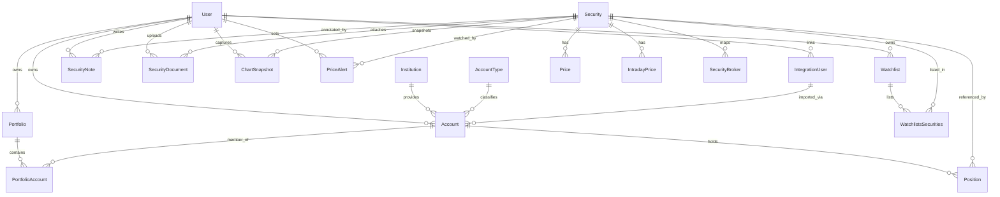
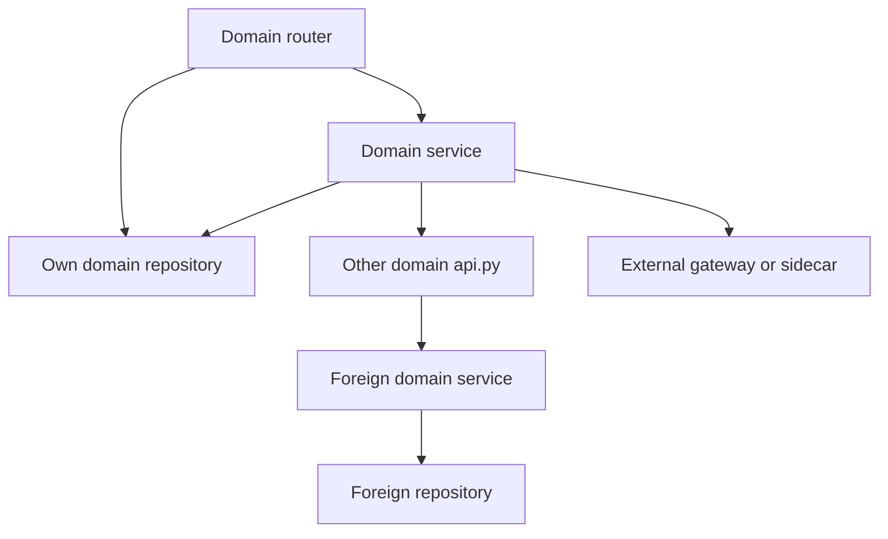

# Backend Domains

The backend under `src/` is organized by business domain. Each domain is self-contained and communicates with other domains only through public APIs; the layered structure itself is described in [Architecture Overview](./overview.md), the identity stack in [Authentication & Authorization](./authentication.md), and settings/DI wiring in [Configuration](./configuration.md). This page is the per-domain catalog.

Routers are mounted in `src/main.py` under a single `APIRouter(prefix="/api/v1")`, so every domain path below is relative to `/api/v1` (the WebSocket and worker-dashboard routers are mounted outside that prefix). The frontend `apiClient` hard-codes the same `/api/v1` base.

## Shared conventions

- **Models** live in `model.py` and inherit from `BaseModel` (`src/config/database.py`); they generate Alembic migrations and are never returned to clients. A route returns a `*Read` schema, never an ORM model.
- **Schemas** live in `schema.py`. Repositories and services exchange schemas, never ORM models.
- **Public API types** live in `api_types.py` and are the only types that may cross a domain boundary. A service that needs another domain's data imports that domain's API type, not its `schema.py`.
- **Repositories** define abstract interfaces in `repository.py` and SQLAlchemy implementations in `repository_sqlalchemy.py`. Alternative implementations use `repository_<impl>.py` (for example `repository_eodhd.py`).
- **Services** hold orchestration and calculations; routers delegate to them and must never reach into a *foreign* domain's repositories. Using the router's own domain repositories directly is allowed and is what the market watchlist, alert, note, document, and snapshot routes do — there is no service layer between them and their repository.
- **Exceptions** inherit from `src.core.exception.EntityNotFoundError` or `AuthorizationError` so `src/main.py` can map them to a consistent HTTP status. Domain errors that are not entity/authorization errors are handled explicitly in the router.
- **MANDATORY:** editing a backend model requires a matching Alembic revision shipped in the same change, and every migration file MUST follow the `<hash>_<description>.py` naming convention under `migrations/versions/` (`alembic.ini` sets `script_location = migrations`; autogenerate with `uv run alembic revision --autogenerate -m "message"`; for manual SQL, create a standard revision and use `op.execute()` inside it). `src/main.py` upgrades to `head` at startup except when `settings.environment == "test"`.

## Entity model

The core entities across domains, and how they reference each other:

*Cross-domain entity relationships: user-owned aggregates fan out from `User`, while every market table except account positions holds a real foreign key to `Security`.*

`SecurityBroker` stores the broker symbol/exchange mapping plus the raw EODHD search results used to resolve it. Every market-owned table references `market_securities.id` with a real foreign key; the one cross-domain exception is `account_positions.security_id` in the account domain, which is a plain UUID column so positions can point at a security without a database-level constraint across domains.

## account

`src/account` manages accounts, positions, portfolios, institutions, account types, and the templated CSV import path. The user-facing CSV walkthrough lives in [CSV import](../workflows/csv-import.md).

### Models (source: `src/account/model.py`)

| Entity | Table | Key fields | Notes |
|--------|-------|------------|-------|
| `AccountModel` | `accounts` | `id: UUID`, `external_id`, `integration_user_id` (FK `integration_users.id`, nullable), `name`, `user_id`, `account_type_id`, `institution_id`, `currency`, `broker_display_name`, `net_deposits`, `is_active`, `api_sync_enabled`, `last_sync_at`, `deleted_at` | Unique on `(user_id, institution_id, external_id)` |
| `AccountTypeModel` | `account_types` | `id`, `name`, `country`, `tax_advantaged`, `is_active` | Unique on `(name, country)`; reference data seeded by `src/commands/seed.py` |
| `InstitutionModel` | `account_institutions` | `id`, `name`, `country`, `website`, `is_active`, `integration_enabled`, `csv_import_enabled`, `csv_format` | Unique on `(name, country)`; `csv_format` is the positional column template (see below) |
| `PositionModel` | `account_positions` | `id: int`, `account_id`, `security_id: UUID`, `quantity: DECIMAL(16,8)`, `average_cost`, `currency(3)`, `updated_at` | Unique on `(account_id, security_id)` |
| `PortfolioModel` | `portfolios` | `id: UUID`, `user_id`, `name`, `deleted_at` | Unique on `(user_id, name)` |
| `PortfolioAccountModel` | `portfolio_accounts` | `portfolio_id`, `account_id` (composite PK) | Many-to-many association |

`AccountModel` cascades `all, delete-orphan` to both `positions` and `portfolio_accounts`.

### The `csv_format` template contract

`InstitutionModel.csv_format` is a comma-separated, positional template string that maps each column of a broker's CSV export to a standardized placeholder. The documented vocabulary is `{account_name}`, `{account_type}`, `{account_classification}`, `{account_number}`, `{symbol}`, `{exchange}`, `{mic}`, `{name}`, `{security_type}`, `{quantity}`, `{position_direction}`, `{market_price}`, `{market_price_currency}`, `{book_value_cad}`, `{book_value_currency_cad}`, `{book_value}`, `{currency}`, `{market_value}`, `{market_value_currency}`, `{market_unrealized_returns}`, `{market_unrealized_returns_currency}`. `GenericCsvParser` normalizes both the template and the file header to lowercase snake_case, validates the header count and each position against alias sets, and raises a specific `CsvParserError` subclass on mismatch. Cash rows (`sec-c-*`, blank/`cash` symbol, `security_type == "cash"`) and option rows (OCC-style symbols, `option`/`derivative` security types) are dropped; `average_cost` is derived as `book_value / quantity` quantized to 4 decimals.

### Public APIs (source: `src/account/api/`)

- `AccountApi` (`account.py`): `get_all`, `get_by_id`, `get_broker_id_by_id`, `rename`, `update_net_deposits`, `update_last_sync_at`, `import_from_broker`. `import_from_broker` skips accounts that already exist for `(user_id, broker_id)` and maps `BrokerAccount` through `AccountSchema.from_broker`.
- `PositionApi` (`position.py`): `create(positions)` groups by `account_id` and delegates to `PositionRepository.sync_by_account`.
- `InstitutionApi` (`institution.py`): `get_all_enabled_integrations` returns integration-enabled institutions as `Institution` API types.

### Services (source: `src/account/service/`)

- `AccountService` (`account.py`): get, ownership/`check_accounts_belong_to_user`, delete.
- `PositionService` (`position.py`): `sync_account_positions`, `get_total_for_account`, `get_account_holdings`, `get_holdings_by_security`, plus the `_calculate_holding`/`_currency_convert` helpers. It depends on `MarketPricesApi` and `SecurityApi` (market), `IntegrationAccountApi`/`IntegrationUserApi` (integration), and a bare `CurrencyConverter()` for FX.
- `PortfolioService` (`portfolio.py`): CRUD and account-membership sync with ownership validation.
- `CsvAccountService` (`csv_account.py`): `inspect_csv`, `import_accounts`, `sync_account_from_csv`, `sync_account_csv_positions`. It resolves every position through `SecurityApi.get_or_create_from_broker`, wraps failures in `SecurityResolutionError`, and stamps `update_last_sync_at`.

### Background task (source: `src/account/task.py`)

`recalculate_all_account_totals_task` iterates active accounts, recomputes totals through `PositionService`, and emits an `AccountTotalsUpdatedMessage` over the WebSocket manager. It is enqueued at the end of the hourly market job.

### Router (source: `src/account/router.py`)

`portfolio_router` (prefix `/portfolios`):

- `GET /` — portfolios for the current user
- `POST /` — create
- `PUT /{portfolio_id}/accounts` — sync portfolio account membership (validates every account belongs to the user)
- `DELETE /{portfolio_id}` — delete (204)

`account_router` (prefix `/accounts`):

- `GET /` — accounts for the current user
- `GET /sync-status` — IDs with an active sync job, read from Redis; returns 503 on `redis.RedisError`
- `GET|PUT|PATCH /me/preferences` — permissive user chart preferences stored on `auth_users.preferences` via `UserApi` (`exclude_none=True` drops explicit nulls)
- `POST /csv/inspect` — multipart upload, returns `CsvDiscoveredAccount` previews with `exists`/`currency` filled for accounts the user already has
- `POST /csv/import` — multipart upload of selected `account_numbers` with optional `currencies` JSON map
- `POST /{account_id}/csv-sync` — re-import one existing account from a CSV export
- `PATCH /{account_id}/rename`, `DELETE /{account_id}`
- `GET /{account_id}/totals`, `GET /{account_id}/holdings`, `GET /holdings/{security_id}`
- `POST /{account_id}/sync` — rate-limited `3/minute`; enqueues broker position sync

The CSV endpoints accept `institution_id`/`account_numbers`/`currencies` either as multipart `Form` fields or as query parameters with the same alias; `institution_id` and `account_numbers` are required (422 otherwise). Account numbers accept a JSON list string, a comma-separated string, or repeated values, deduplicated in order.

### Business rules

- Account identity is `(user_id, institution_id, external_id)`.
- `api_sync_enabled=False` accounts (CSV-imported ones) refuse `POST /{account_id}/sync` with 400 and `PositionService.sync_account_positions` raises `ApiSyncDisabledError`; accounts with `integration_user_id IS NULL` are a silent no-op.
- Position sync is a full replace: `sync_by_account` deletes all rows for the account then re-inserts, so partial syncs cannot leave stale holdings.
- Holdings and totals are computed in the security's currency and then converted to the account currency with `CurrencyConverter`; values round-trip through `stockholm.Money`. Money semantics are covered in [Money and currency](../concepts/money-and-currency.md).
- `total_profit_loss` becomes `total_value - net_deposits`, and `total_profit_loss_percent` is only reported when `net_deposits` is set and non-zero.

## auth

`src/auth` owns users, credentials, sessions, and resource authorization. The deep dive — token inventory, TOTP/passkey ceremonies, Redis challenge state, SSR guard — lives in [Authentication & Authorization](./authentication.md); this section only records the domain surface.

### Models (source: `src/auth/model.py`)

| Entity | Table | Notes |
|--------|-------|-------|
| `UserModel` | `auth_users` | `id: UUID`, unique indexed `email`, `_password_hash` (argon2 via the `password` property), `is_active`, `is_verified`, `last_login_at`, `preferences` (JSON), `created_at` |
| `VerificationTokenModel` | `auth_verification_tokens` | `id: str`, indexed `user_id`, unique `token`, `expires_at`, `is_used` |
| `TotpModel` | `auth_totp` | Unique per `user_id`, `secret`, `is_verified`, `ondelete="CASCADE"` |
| `RecoveryCodeModel` | `auth_recovery_codes` | `code_hash` (argon2), `is_used`, `used_at`, cascade on user delete |
| `PasskeyModel` | `auth_passkeys` | Unique indexed `credential_id`/`public_key` (LargeBinary), `sign_count`, `name`, `transports` (JSON), cascade on user delete |

### APIs and services (source: `src/auth/api.py`, `src/auth/service.py`)

- `UserApi`: `signup`, `login` (returns either `AuthResponse` or `LoginChallengeResponse`), `create_access_token`, `create_mfa_token`/`verify_mfa_token`, `get_current_user_from_token`, `verify_email`/`resend_verification`, `revoke_token`, `update_last_login`, plus preference `get_/save_/patch_preferences` and `get_email_for_user`.
- `AuthorizationApi.check_entity_owned_by_user(user, entity, field="user_id")`: raises HTTP 404 (not 403) when the entity is missing or not owned, deliberately hiding existence.
- `EmailVerificationService`, `TotpService`, `PasskeyService` hold the verification, TOTP, and WebAuthn logic.
- FastAPI dependencies: `get_token` (cookie `auth_token` or OAuth2 bearer header) and `current_user`.

### Router (source: `src/auth/router.py`, prefix `/auth`)

- `POST /signup` (`5/minute`), `POST /login` (`10/minute`), `POST /logout`
- `POST /2fa/login-verify` (`10/minute`) — exchanges a `mfa_pending` JWT plus a TOTP code for an access token
- `POST /verify-email`, `POST /resend-verification` (`3/minute`)
- `POST /ws-ticket` — signed 30-second, single-use WebSocket ticket
- `GET /2fa/status`, `POST /2fa/totp/setup|activate|disable`, `POST /2fa/totp/recovery-codes/regenerate`
- `POST /passkey/register/options|verify`, `GET /passkeys`, `DELETE|PATCH /passkeys/{passkey_id}`, `POST /passkey/authenticate/options|verify`

Login and 2FA verification set the `httponly`/`secure` `auth_token` cookie (7-day `max_age`) in production; the passkey authentication endpoint does the same and updates `last_login_at`.

## market

`src/market` manages securities, daily and intraday prices, watchlists, price alerts, security notes, documents, chart snapshots, technical indicators, and AI analysis. The data-flow walkthrough lives in [Market data and indicators](../workflows/market-data-and-indicators.md).

### Models (source: `src/market/model.py`)

| Entity | Table | Key fields | Notes |
|--------|-------|------------|-------|
| `SecurityModel` | `market_securities` | `id: UUID`, `symbol`, `exchange`, `currency`, `name`, `isin`, `is_active`, `updated_at` | Unique `(symbol, exchange)` as `symbol_exchange_unique` |
| `SecurityBrokerModel` | `market_securities_broker` | `institution_id`, `broker_symbol`, `broker_exchange`, `broker_name`, `mapped_symbol`, `mapped_exchange`, `security_id` (FK), `search_results` (JSON) | Indexed on `(institution_id, broker_symbol, broker_exchange)` |
| `PriceModel` | `market_prices` | `security_id` (FK), `date`, OHLC + `adjusted_close` as `DECIMAL(16,8)`, `volume` | Unique `(security_id, date)` |
| `IntradayPriceModel` | `market_intraday_prices` | `security_id` (FK), `timestamp: timestamptz`, OHLCV | Unique `(security_id, timestamp)`; 1-hour candles |
| `WatchlistModel` | `market_watchlists` | `id: UUID`, `user_id`, `name`; `securities` relationship via `lazy="selectin"` | Unique `(user_id, name)`; the user's default list is the one literally named `"Default"` |
| `WatchlistsSecuritiesModel` | `market_watchlists_securities` | composite PK, `ondelete="CASCADE"` both sides | Many-to-many |
| `PriceAlertModel` | `market_price_alerts` | `security_id`, `user_id`, `target_price`, `condition`, `source` (default `manual`), `triggered_at` | Null `triggered_at` = active |
| `SecurityNoteModel` | `market_security_notes` | `security_id`, `user_id`, nullable `title`, `content`, timestamps | Title filled asynchronously by AI |
| `SecurityDocumentModel` | `market_security_documents` | `security_id`, `user_id`, `filename`, `file_path`, `file_size`, `file_type` | File bytes under `settings.upload_path` |
| `ChartSnapshotModel` | `market_chart_snapshots` | `id: UUID`, `security_id`, `user_id`, `drawings` (JSON), `data_window` (JSON), `captured_at`, `created_at` | Indexed `(security_id, user_id, captured_at)` |

### Public APIs (source: `src/market/api.py`)

- `MarketPricesApi`: `get_latest_close` (returns `Money | None`) and `get_latest_price` (returns `PriceSchema | None`).
- `SecurityApi`: `get_by_id`, `get_or_create_from_broker`, `create_or_get_from_search`.
  - `get_or_create_from_broker` checks `SecurityBrokerRepository` for an existing mapping, otherwise maps the broker symbol (`.` → `-`) and exchange (`CSE→CA`, `TSX→TO`, `NYSE→US`, `NASDAQ→US`), searches EODHD through `SecuritySearchCache`, takes the first result, upserts the security, warms prices via `MarketPricesApi.get_latest_close`, and persists the mapping with the raw search results. Zero search results raise `ValueError`.
  - `create_or_get_from_search` returns `has_price_data` for existing securities and calls `MarketService.fetch_and_save_price_history` for new ones.

### Services (source: `src/market/service.py`, `ai_service.py`, `alert_service.py`, `indicators.py`, `cache.py`)

- `MarketService`: `update_daily_prices_for_all_securities` (one-year window, `asyncio.gather`, returns success/failure counts), `update_intraday_prices_for_all_securities` (7-day window), `fetch_and_save_intraday_prices`, `fetch_and_save_price_history` (2000-01-03 → today). Gateway calls are pushed through `asyncio.to_thread` and per-security failures are swallowed so one bad symbol cannot abort a batch.
- Module-level aggregation helpers, also exposed as `PriceAggregationService` static methods: `aggregate_weekly_prices` (ISO week buckets), `aggregate_monthly_prices`, `aggregate_4h_candles` (4-hour buckets of 1h candles), and `convert_to_heikin_ashi`.
- `IndicatorServiceClient`: HTTP client for the external Go indicator sidecar at `settings.indicator_service_url`, posting `{interval, candles, indicators}` to `/compute`. It maps timeouts to 504, connect/network errors to 503, upstream 400s to 400, upstream 5xx to 503, and unwraps an `indicators` envelope. Registered as a request-scoped async-generator factory so it owns and closes its own `httpx.AsyncClient`.
- `AIService`: wraps `AsyncOpenAI` against `ai_api_endpoint`/`ai_api_key`/`ai_api_model`; `_gather_context` collects the security, latest price, the user's notes, and ~90 days of closes. Public methods: `analyze_fundamentals`, `summarize_notes`, `generate_note_title`, `analyze_portfolio_fit`.
- `AlertEvaluationService`: pure `evaluate(active_alerts, latest_prices)` plus `dispatch_alert_email` used by the staged alert pipeline.
- `IndicatorCache` (Redis, 1 h TTL) and `SecuritySearchCache` back indicator computation and EODHD search respectively; the indicator cache key includes a canonical digest of the indicator specs and normalized date bounds.
- `indicators.py`: SMA/EMA style 50/200 day and 50/200 week MAs, MACD, RSI.

### Read-through price repository (source: `src/market/repository_eodhd.py`)

`EodhdPriceRepository` wraps the SQLAlchemy `PriceRepository` and the `MarketGateway`. `get_prices` merges DB rows with fresh EODHD rows (EODHD wins per date) and persists the union; `get_latest_price` only refetches when the stored close predates the last NYSE trading day (computed with `holidays.NYSE()`); `get_price_on_date` falls back to EODHD and saves the result. `save_price`/`save_prices` deliberately raise `NotImplementedError` — writes must go through the inner DB repository or `MarketService`. It is the registered `PriceRepository` in both stub and live service registration.

### Router (source: `src/market/router.py`, prefix `/market`)

Requires `current_user` on every route. Endpoint surface:

- `GET /prices/{security_id}/last-close`
- `GET /prices/{security_id}` — `interval` ∈ `1d|1w|1m|1h|4h`. Daily/weekly/monthly require `from_date` and `to_date` (422 otherwise) and aggregate in-process; intraday reads `market_intraday_prices` and lazily backfills via `MarketService.fetch_and_save_intraday_prices` when the window is stale.
- `GET /search` and `GET /securities/search` — EODHD search, cached
- `GET /securities/{security_id}`, `POST /security` (create-or-get)
- Watchlists: `GET /watchlists` (each item embeds its securities), `POST /watchlists` (201), `PATCH /watchlists/{watchlist_id}`, `DELETE /watchlists/{watchlist_id}` (204), `GET /watchlists/{watchlist_id}/securities` (paginated), `POST|DELETE /watchlists/{watchlist_id}/securities/{security_id}`, and the default-watchlist shortcuts `POST|DELETE /watchlists/securities/{security_id}`
- `GET|POST /securities/{security_id}/alerts`, `DELETE /securities/{security_id}/alerts/{alert_id}`
- `GET|POST /securities/{security_id}/notes`, `PUT|DELETE /securities/{security_id}/notes/{note_id}`
- `GET|POST /securities/{security_id}/documents`, `DELETE /securities/{security_id}/documents/{doc_id}`
- `GET|POST /securities/{security_id}/snapshots` (POST returns 201), `DELETE /securities/{security_id}/snapshots/{snapshot_id}` (204)
- `GET /securities/{security_id}/indicators` — in-process indicator calculation, Redis-cached
- `POST /securities/{security_id}/indicators/compute` — candle-series computation delegated to the Go sidecar; accepts caller-supplied `candles` (which bypasses and skips the cache)
- `POST /securities/{security_id}/ai/fundamentals`, `/ai/summarize-notes`, `/ai/portfolio-debate` — each rate-limited `5/minute`, mapping `TimeoutError` → 504 and `RuntimeError` → 503

### Watchlists

Watchlists are the one market feature with a full CRUD surface rather than per-security sub-resources. `WatchlistRepository` (`src/market/repository.py`) is the contract the router talks to directly — there is no watchlist service — and `SqlAlchemyWatchlistRepository` implements it:

| Method | Behaviour |
|--------|-----------|
| `get_by_user(user_id)` | All watchlists for the user with their securities eagerly loaded (`selectinload`) and each security price-enriched |
| `create(user_id, name)` | Insert; an `IntegrityError` from the `(user_id, name)` unique constraint becomes `WatchlistDuplicateNameError` (rolled back, session still usable) |
| `rename(watchlist_id, user_id, name)` | Ownership check, then rename; duplicate names raise the same error |
| `delete(watchlist_id, user_id)` | Ownership check, then delete; membership rows disappear through `ondelete="CASCADE"` |
| `create_default(user_id)` | Creates the literal `"Default"` watchlist; part of the repository contract but not currently invoked by any router |
| `add_security` / `remove_security` | Default-watchlist shortcuts: they resolve the user's `"Default"` watchlist (creating it on first add, tolerating a concurrent-create `IntegrityError` by re-reading) and then delegate to the per-watchlist methods; `remove_security` with no default watchlist raises `WatchlistNotFoundError` for the nil UUID |
| `add_security_to_watchlist` / `remove_security_from_watchlist` | Idempotent membership edits on one watchlist; unknown `security_id` raises `SecurityNotFoundError`, and removing a non-member is a successful no-op |
| `get_securities(watchlist_id, user_id, offset, limit)` | Ownership check, then a `symbol`-ordered page plus total, price-enriched |

Two invariants matter when changing this code. First, **every operation is scoped to the owning `user_id`, and a watchlist that does not exist *or* is owned by another user is reported as `WatchlistNotFoundError`** — deliberately indistinguishable, so a caller cannot probe for other users' watchlist IDs; the global `EntityNotFoundError` handler turns that into a 404. `WatchlistDuplicateNameError`, by contrast, is a plain `Exception` (not an `EntityNotFoundError`) precisely so the router can translate it to 409 instead of letting the global handler emit 404. Second, `WatchlistRead` responses embed securities already enriched with `current_price`, `daily_price_change`, and `daily_price_change_percent`, computed in one batched window query over the latest two closes per security — so a watchlist read is not a bare join, and adding a field to the enrichment means touching `_fetch_price_metrics` rather than the router.

### Business rules

- Securities are unique by `(symbol, exchange)`, allowing the same ticker on different venues. New searches accept the first EODHD hit.
- Price reads are read-through EODHD by default, so a missing daily bar is transparently fetched and persisted.
- Note create and update both enqueue `generate_note_title_task(note_id, request_id=...)`, which regenerates the title with AI in the worker.
- Documents are written to `settings.upload_path` under a random `uuid4` filename with the original extension; only metadata goes to the database.
- Price alerts are evaluated only when `triggered_at IS NULL`.
- AI endpoints surface upstream failures as 503/504 rather than 500.

## integration

`src/integration` connects to broker APIs. Wealthsimple is the only implemented broker. The end-to-end broker flow is described in [Broker sync](../workflows/broker-sync.md).

### Model and types

- `IntegrationUserModel` (`src/integration/model.py`, table `integration_users`): `id: UUID`, `user_id`, `institution_id`, `external_user_id`, `display_name`, `last_used_at`; unique on `(user_id, institution_id, external_user_id)`.
- `IntegrationUser` public API type and `IntegrationUserId` live in `src/integration/api_types.py`; `BrokerAccount`/`BrokerPosition`/`BrokerAccountId` in `src/integration/brokers/api_types.py`.

### Broker gateway (source: `src/integration/brokers/__init__.py`, `wealthsimple.py`)

- `BrokerApiGateway` ABC declares `login(username, password, otp)`, `get_accounts(integration_user)`, and `get_positions_by_account(integration_user, broker_account_id)` plus `_keyring_prefix`/`_institution` class attributes.
- The ABC constructor forces `keyring.set_keyring(PlaintextKeyring())`, flagged with a `TODO secure this before staging deployment` — sessions are stored in plaintext on disk.
- `WealthsimpleApiGateway` wraps `ws_api`, maps Wealthsimple account types to `AccountTypeEnum`, and skips the `sec-c-cad` cash position.
- `get_broker_gateway_class(institution_id)` (`src/integration/api.py`) is the single registry mapping `InstitutionEnum.WEALTHSIMPLE` to the gateway class; adding a broker means adding a branch there.

### APIs (source: `src/integration/api.py`)

- `IntegrationUserApi`: `get_by_id` (raises `IntegrationUserNotFoundError`), `get_by_user_and_institution`.
- `IntegrationAccountApi.sync_account_positions`: enqueues `sync_account_positions_task` with the gateway class resolved from the account's institution.

### Background task (source: `src/integration/task.py`)

`_sync_account_positions_task` runs inside the Huey worker with its own `svcs` container. Ordering and failure semantics:

1. `mark_sync_started(user_id, account_id)` — a Redis set member with `settings.sync_ttl_seconds`, best-effort.
2. Emit `ACCOUNT_SYNC_STARTED` over the WebSocket manager.
3. `_do_sync_positions`: resolve the `IntegrationUser`, fetch broker positions, resolve each security via `SecurityApi.get_or_create_from_broker`, replace positions via `PositionApi.create`, then refresh `net_deposits` and `last_sync_at` from the broker account.
4. Emit `ACCOUNT_SYNC_FINISHED`; on any exception, send a mapped plain-language error email and emit `ACCOUNT_SYNC_FAILED`, then re-raise.
5. `finally`: `mark_sync_finished` always clears the Redis marker, and an `@huey.signal(SIGNAL_INTERRUPTED)` handler clears it for interrupted tasks.

### Router (source: `src/integration/router.py`)

`institutions_router` (prefix `/integration`):

- `GET /institutions` — institutions with `integration_enabled`

`integration_router` (prefix `/external`):

- `GET /users`, `PATCH /users/{external_user_id}/display_name`
- `POST /{institution}/login` — accepts `otp`; maps `OTPRequiredError` to 400 `OTP_REQUIRED` and `LoginFailedError` to 401 `INVALID_CREDENTIALS`
- `GET /users/{external_user_id}/accounts`
- `POST /accounts/import` (`3/minute`) — filters broker accounts by the requested IDs, imports through `AccountApi.import_from_broker`, and enqueues one sync task per newly created account
- `POST /positions/import` (`3/minute`) — synchronous import for a single account

Every `/external` route that touches an `IntegrationUser` calls `AuthorizationApi.check_entity_owned_by_user` before doing anything else.

### Business rules

- Passwords are never persisted: only an `IntegrationUser` row and keyring session tokens survive a login.
- Account import deduplicates on `(user_id, external_id)` via `AccountApi.import_from_broker`; existing accounts are skipped (with a TODO to refresh `net_deposits` instead).
- `/accounts/import` returns 202-style semantics via an `imported_count` response while position fetching continues asynchronously in the worker.

## ws

`src/ws` provides user-scoped WebSocket fan-out across backend and worker processes.

- `ConnectionManager` (`src/ws/manager.py`) keeps `active_connections: dict[UserId, list[WebSocket]]`, maintains one Redis client per running event loop, and subscribes to Pub/Sub channel `ws_messages`. `send_personal_message` publishes `{"user_id", "message"}` to Redis, lazily initializing Redis when needed and falling back to `_send_to_local_connections` if publishing fails. `send_personal_message_sync` bridges the non-async Huey context.
- The module exposes a process-wide `ws_manager` singleton, initialized in the FastAPI lifespan and closed on shutdown.
- `ws_router` (`src/ws/router.py`) serves `/api/ws` (outside the `/api/v1` prefix). It authenticates by signed ticket query param (verified with `max_age=30`, salt `ws-ticket`, and single-use guarded by the Redis key `ws-ticket-used:<sha256>` with a 30 s expiry) or by the `auth_token` cookie / `sec-websocket-protocol` header; failures close with code 1008.
- Event types are declared in `src/ws/api_types.py`: `ACCOUNT_SYNC_STARTED`, `ACCOUNT_SYNC_FINISHED`, `ACCOUNT_SYNC_FAILED`, `ACCOUNT_TOTALS_UPDATED`, carried by `AccountSyncMessage` and `AccountTotalsUpdatedMessage`.

## core

Shared building blocks.

- `src/core/exception.py`: `EntityNotFoundError` (abstract, `entity_id`/`entity_name`, rendered as "Entity X with ID Y not found.") and `AuthorizationError` (abstract, requires `log_message()`). `src/main.py` maps the former to 404 with `{"error": ...}` and the latter to 404 as well.
- `src/core/email.py`: `EmailService` with Jinja2 templates under `src/templates/email/`, including `ExternalAccountErrorEmailData` for broker sync failures; `EmailSendError` is caught by the auth router and returned as 502.
- `src/core/redis.py`: the `redis_manager` singleton used by token denylisting, sync status, WebSocket tickets, and caches.
- `src/core/pagination.py`: `PaginationParams` (`offset ≥ 0`, `1 ≤ limit ≤ 100`, default 50) and generic `PaginatedResponse[T]`, the shape used by alerts, notes, watchlist securities, and account holdings.
- `src/core/context.py`: request-ID context var helpers (`get_request_id`, `set_request_id`, `request_id_ctx_var`).
- `src/core/middleware.py` / `src/core/logging.py`: `RequestIdMiddleware` and logging initialization.
- `src/core/enum.py`: `InstitutionEnum` (`WEALTHSIMPLE = 1`) and `AccountTypeEnum` (`TFSA`, `RRSP`, `FHSA`, `NON_REGISTERED`).
- `src/core/registry.py`: `register_core_services` registers `EmailService` as a value.

## config

`src/config` holds settings, the database session manager, the DI registry, the rate limiter, and logging. Full detail is in [Configuration](./configuration.md).

- `src/config/services.py`: `register_services(registry, sessionmanager)` binds `AsyncSession` to the session manager factory, registers core/account/auth services, then branches on `settings.stub_external_api` to register either live or stub integration and market services.
- `src/config/database.py`: `DatabaseSessionManager` (async engine + `async_sessionmaker`, `expire_on_commit=False`) plus the declarative `BaseModel`.
- `src/config/limiter.py`: the `slowapi` limiter used by per-route decorators and the `SlowAPIMiddleware` in `src/main.py`.
- `settings.upload_path` (documents), `settings.indicator_service_url` (indicator sidecar), `settings.redis_url`, `settings.secret_key`, and the EODHD/AI credentials all flow in from here.

## Cross-domain dependencies

Dependencies are one-directional in practice; the table lists who calls whom.

| Consumer | Uses | Purpose |
|----------|------|---------|
| `account.PositionService` | `MarketPricesApi`, `SecurityApi` | Pricing and security resolution for totals/holdings |
| `account.PositionService` | `IntegrationAccountApi`, `IntegrationUserApi` | Enqueue broker position sync |
| `account.CsvAccountService` | `SecurityApi`, `PositionApi` | Resolve securities and persist CSV positions |
| `account.service.AccountService` | `auth.AuthorizationApi` (via routers) | Ownership checks |
| `integration.router` | `AccountApi`, `PositionApi`, `SecurityApi` | Account/position import |
| `integration.task` | `SecurityApi`, `PositionApi`, `AccountApi`, `IntegrationUserRepository`, `EmailService`, `ws_manager` | Background broker sync, error email, progress events |
| `market.SecurityApi` | `MarketGateway`, `MarketPricesApi`, `MarketService` | Broker security resolution and price backfill |
| `market.AIService` | `SecurityRepository`, `PriceRepository`, `SecurityNoteRepository` | AI context gathering |
| `market.task` | `MarketService`, `AlertEvaluationService`, `account.task` | Scheduled price update, alert pipeline, totals refresh |
| `account.task`, `integration.task` | `ws_manager` | Push sync/totals events to subscribed clients |

*A router may call its own domain's repository directly for thin CRUD routes, but any cross-domain reach goes through the other domain's `api.py`; external providers sit behind gateway clients.*

## Extension points

- **Adding a new domain.** Create a folder under `src/` following `model.py` / `schema.py` / `api_types.py` / `repository.py` / `repository_sqlalchemy.py` / `api.py` / `service.py` / `router.py` / `enum.py` / `exception.py`; export a `register_<domain>_services(registry)` function; call it from `register_services` in `src/config/services.py`; and include the router in the `/api/v1` router in `src/main.py`. Generate the Alembic migration for every new model (`<hash>_<description>.py`).
- **Adding a new broker integration.** Add the `InstitutionEnum` value, seed the institution in `src/commands/seed.py`, implement `BrokerApiGateway`, add it to `get_broker_gateway_class` in `src/integration/api.py`, and (for tests) provide a stub under `src/stubs/`.
- **Adding a new market gateway.** Implement `MarketGateway` (`search`, `get_price_on_date`, `get_prices`, `get_intraday_prices`) and point the `MarketGateway` registration in `src/config/services.py` and `src/market/__init__.py` at the new factory.
- **Adding CSV support for a new institution.** Set `csv_format` to the positional template matching the broker export and set `csv_import_enabled = True`; the seed command's `WEALTHSIMPLE_CSV_FORMAT` is the worked example. No parser code changes are needed unless new placeholder vocabulary is required.
- **Adding a background job.** Define it in the owning domain's `task.py` with `@huey.task()` or `@huey.periodic_task(...)`, import the module in `src/worker.py` so it registers, and resolve services through `huey.svcs_registry` inside the task.

## Focused tests

Tests are grouped by concern rather than strictly by domain: router-level tests in `tests/routers/` (`test_auth.py` for 2FA and passkey flows, `test_accounts.py`, `test_csv_account_endpoints.py`, `test_csv_inspect.py`, `test_portfolios.py`, `test_market.py` for prices and the full watchlist surface, `test_chart_snapshots.py`, `test_notes.py`, `test_documents.py`, `test_sync_status.py`, `test_rate_limit.py`), service-level tests in `tests/services/` (`test_auth_services.py`, `test_position_api.py`, `test_csv_account_service.py`, `test_market_service.py`), repository tests in `tests/repositories/` (`test_repository_sqlalchemy.py` covers watchlist create/rename/delete, cross-user `WatchlistNotFoundError`, and price enrichment), domain unit tests in `tests/account/` and `tests/market/` (`test_models_and_sync.py`, `tests/account/csv/test_parser.py`, `test_security_api.py`, `test_indicator_compute_api.py`, `test_indicator_cache.py`, `test_alert_evaluation_service.py`), broker tests in `tests/integration/brokers/`, and WebSocket tests in `tests/ws/`. Tests must not depend on external services — see [Testing](../operations/testing.md).
