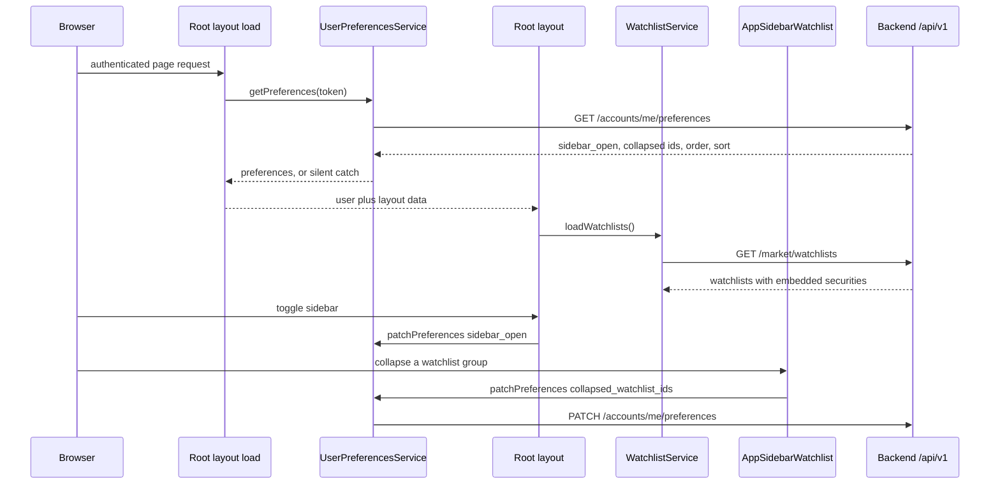
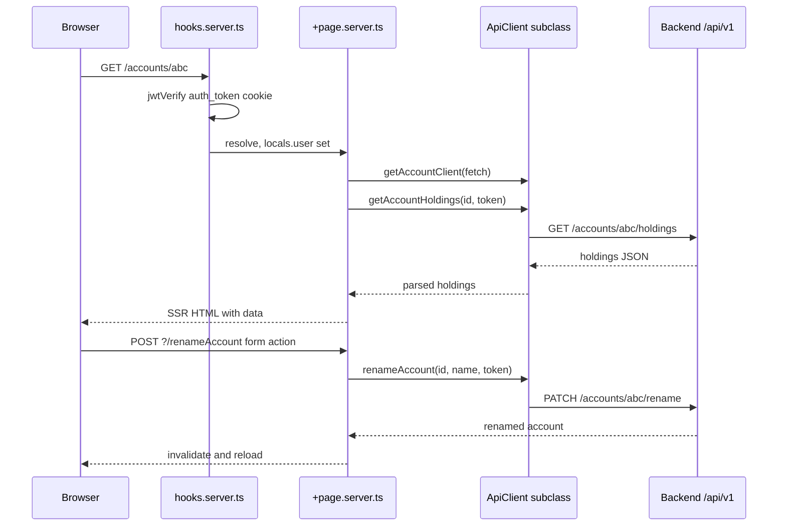

# Frontend Architecture

The frontend is a SvelteKit 2 / Svelte 5 application rendered with SSR (`@sveltejs/adapter-node`), built by Vite 7, styled with Tailwind 4 and shadcn-svelte/bits-ui primitives, and charted with `lightweight-charts`. It talks to the FastAPI backend exclusively through a typed client layer over `/api/v1`.

The whole design follows three separations that shape every file:

1. **Server-side loads produce data, form actions produce mutations.** Pages read `data` from `+page.server.ts` and delegate to a domain component; `/watchlists` is the one page that renders its own sections inline instead of extracting a component, and it too only mutates through the shared `WatchlistService`.
2. **Reactive state lives in class instances in `*.svelte.ts`,** not in components, and is never exported as a module-level instance (SSR bleed).
3. **HTTP lives in pure `.ts` clients** that subclass `ApiClient` and never touch Svelte reactivity.

The auth axis — hooks, cookie handling, login/2FA/passkey flows — is documented in [Authentication & Authorization](/openwiki/architecture/authentication.md); chart internals are in [Charting](/openwiki/architecture/charting.md).

## Project structure

| Path | Purpose |
|------|---------|
| `frontend/src/routes/` | SvelteKit route pages, `+page.server.ts` loads/actions, `+layout.svelte` |
| `frontend/src/lib/api/` | Stateless HTTP clients (one per backend area) plus `apiClient.ts` base |
| `frontend/src/lib/components/` | Domain components (`accounts/`, `brokers/`, `charts/`, `security/`, `watchlist/`, `actions-sidebar/`, `layout/`) and `ui/` primitives |
| `frontend/src/lib/types/` | Shared domain types (`account.ts`, `money.ts`, `websocket.ts`, `portfolio.ts`, `user.ts`, `broker/`) |
| `frontend/src/lib/utils/` | Date/window helpers, `modal-state.svelte.ts`, `finance/` domain math |
| `frontend/src/lib/server/auth-cookie.ts` | Server-only `auth_token` cookie options and deletion helper |
| `frontend/src/hooks.server.ts` | Per-request JWT verification and auth redirects |
| `frontend/src/setupTest.ts` | Vitest global setup (jsdom, jest-dom, `location` stub) |

Two path aliases coexist and are used interchangeably in imports: SvelteKit's `$lib/*` and the shadcn-style `@/*`, mapped to `./src/lib/*` in `svelte.config.js` (with a `$lib` alias also declared in `vite.config.ts`).

## Route map

Routes are file-based. Authenticated pages are thin shells: `+page.server.ts` fetches through a client constructed with the SvelteKit `fetch`, and `+page.svelte` renders a domain component.

| Route | Server responsibilities | Rendered feature |
|-------|-------------------------|------------------|
| `/` | `load` → `getAccountClient(fetch).getAccounts(token)`; action `renameAccount` (requires `id` + `name` in the form body) | `AccountsList` — portfolio dashboard |
| `/accounts/[id]` | `load` → `getAccountHoldings(params.id, token)`; action `renameAccount` bound to the path param | `HoldingsTable`, `EditableTitle`, totals header |
| `/brokers` | `load` → `getBrokerService(fetch).getBrokerUsers(token)` | `BrokersList` (connected broker users, CSV import) |
| `/watchlists` | `load` → `getMarketService(fetch).getWatchlists(token)`; 401 → `deleteAuthCookie` + `redirect(303, '/auth/login?clear_session=true')`, other `ApiError` → `error(status, message)`, otherwise `error(500, …)` | `Watchlists` page — per-watchlist sections with price/change pills, create/rename/delete, drag-and-drop reorder, per-list security sorting |
| `/security/[security_id]` | `load` → parallel `Promise.all` of `getSecurity` and `getPrices(..., '1d')` inside the 1-day chart window; 404 when no prices | security chart plus the actions sidebar groups |
| `/settings/security` | `load` → parallel `get2FaStatus` + `getPasskeys` via `getSecurityClient(fetch)`; redirects to login when the cookie is absent | `SecuritySettings` (TOTP setup, passkeys) |
| `/auth/login` | actions `login`, `verify2fa`, `passkeyLogin` — each sets the `auth_token` cookie then redirects to `/` | `LoginForm` |
| `/auth/signup` | action validates and calls `authService.signup`, then redirects to `/auth/signup/confirmation` | `SignupForm` |
| `/auth/logout` | default action deletes/expires the cookie and redirects to `/auth/login` | tiny page |
| `/auth/verify-email` | `load` reads the `token` query param and calls `verifyEmail`, returning a `success`/`error` status | status display |
| `/` error | `+error.svelte` | fallback error shell |

`+layout.server.ts` runs for every route and returns `{ user, sidebar_open, collapsed_watchlist_ids, watchlist_order, watchlist_sort }`. When `locals.user` is set it calls `getUserPreferencesService(fetch).getPreferences(token)` once and copies each field across, validating the shape (`typeof prefs.sidebar_open === 'boolean'`, `Array.isArray` for the two list fields, `typeof … === 'object'` for `watchlist_sort`). The whole call sits in a `try`/`catch` that swallows the failure, so an unreachable preferences endpoint degrades to the defaults — `sidebar_open: true`, an empty collapsed-id list, and `null` order/sort — instead of breaking every page render. `+layout.svelte` then either wraps children in `Sidebar.Provider` + `AppSidebar` (authenticated) or renders bare children (login/signup).

### Preference-driven layout data

Layout-level state is server-loaded and client-persisted in one round trip: the root load hydrates the shell, and every later change is a `PATCH /accounts/me/preferences` from the component that owns the interaction. The `UserPreferences` interface in `lib/api/userPreferencesService.ts` is the single shape all of this shares — `sidebar_open`, `sidebar_watchlists`, `collapsed_watchlist_ids`, `watchlist_order`, `watchlist_sort` sit alongside the chart preferences (`timeframe`, `chart_style`, `indicators`, `elliott_waves`, `fibonacci_tools`, `wave_settings`, `chart_hide_labels`).

| Preference | Read by | Written by |
|------------|---------|------------|
| `sidebar_open` | `+layout.server.ts` → `sidebarOpen` seed | `+layout.svelte` `handleSidebarOpenChange` |
| `collapsed_watchlist_ids` | `+layout.server.ts` → `AppSidebarWatchlist` | `AppSidebarWatchlist.toggleCollapsed` |
| `watchlist_order` | `+layout.server.ts` → `AppSidebarWatchlist` and `/watchlists` | `/watchlists` drag-and-drop drop handler |
| `watchlist_sort` | `+layout.server.ts` → `/watchlists` | `/watchlists` sort dropdown (`name_asc`, `price_change_desc`, `price_change_asc`) |
| `sidebar_watchlists` | — (declared, not consumed by any component) | — |

All of these writes are fire-and-forget: `userPreferencesService.patchPreferences({ … }).catch(console.error)`, so a failed persistence never blocks the UI interaction that triggered it. Because the load also feeds `$page.data`, a component may read a preference either from its own `data` prop or from `$page.data` — `AppSidebarWatchlist` prefers a `setContext` value injected by test harnesses, then `$page.data.watchlist_order` / `$page.data.collapsed_watchlist_ids`, and only then falls back to a null order and an empty collapse set.



The root load hydrates layout state, the layout then loads watchlists once, and later interactions persist preferences back to the same endpoint.

## SSR load plus form-action round trip



One SSR load followed by one `use:enhance` form-action mutation; `use:enhance` re-runs the load when the action returns.

## Server patterns

### Request guard

`frontend/src/hooks.server.ts` resets `event.locals.user = null`, then verifies the `auth_token` cookie with `jose`'s `jwtVerify` against `JWT_SECRET` (`$env/static/private`, algorithm HS256). Only tokens whose `payload.scope === 'access'` populate `locals.user` (`{ id: payload.user_id, email: payload.sub }`); anything else — including `mfa_pending` tokens — is treated as dead and the cookie is deleted. Requests without a user are redirected `303` to `/auth/login` unless the path starts with `/auth`. A `?clear_session=true` visit to `/auth/login` or `/auth/signup` drops any surviving cookie and renders the page instead of bouncing back to `/`, which prevents a redirect loop with a stale cookie.

### Load pattern

```ts
export const load: PageServerLoad = async ({ params, fetch, cookies }) => {
    const token = cookies.get('auth_token');
    const client = getAccountClient(fetch);           // SSR-aware fetch, no cookie jar
    const holdings = await client.getAccountHoldings(params.id, token);
    return { holdings };
};
```

The custom `fetch` from SvelteKit's load context is always passed to the client factory; the raw `auth_token` is passed alongside as an explicit `Authorization: Bearer` override, because a server-to-server `fetch` does not automatically forward the browser's cookie. `ApiError` handling is uniform: `401` deletes the cookie and redirects to `/auth/login?clear_session=true`, any other status is re-thrown as a SvelteKit `error(status, message)`, and unknown failures become `error(500, 'Internal Server Error')`. `security/[security_id]` additionally re-throws an already-SvelteKit error (e.g. its own 404 for empty price data) rather than wrapping it.

### Form actions

Mutations are SvelteKit actions that validate `request.formData()`, call the same client factory, and return `fail(status, { message })` on `ApiError`:

```ts
export const actions: Actions = {
    renameAccount: async ({ request, fetch, cookies }) => {
        const data = await request.formData();
        const name = data.get('name');
        if (typeof name !== 'string' || !name) return fail(400, { message: 'Name is required' });
        await getAccountClient(fetch).renameAccount(id, name, cookies.get('auth_token'));
        return { success: true };
    }
};
```

`EditableTitle` is the shared inline-edit component that drives this: it either posts to a form action (`action="?/renameAccount"`) or calls an `onSave` callback. Login is the exception that writes cookies directly — each of its three actions (`login`, `verify2fa`, `passkeyLogin`) sets `auth_token` with `path: '/'`, `httpOnly`, `sameSite: 'lax'`, `secure: !dev`, and a one-week `maxAge`, keeping the attributes in sync with `AUTH_COOKIE_OPTS` in `$lib/server/auth-cookie`.

## API client layer

`frontend/src/lib/api/apiClient.ts` defines `ApiError` (carrying `status`, `message`, and the raw `Response`) and an abstract `ApiClient` base. Every client extends it and uses protected helpers — `get`, `post`, `patch`, `put`, `delete`, `postFormData`, `getBlob` — so HTTP concerns stay in one place.

| Client | File | Backend area |
|--------|------|--------------|
| `AccountClient` | `accountClient.ts` | `/accounts/` (list, rename, totals, holdings, delete, sync, sync-status), CSV inspect/import |
| `AccountService` | `accountService.ts` | `/accounts/holdings/{securityId}` cross-account holdings |
| `AuthService` | `authService.ts` | `/auth/` login, 2FA verify, passkey auth, signup, verify-email, logout, WS ticket |
| `SecurityClient` | `securityClient.ts` | `/auth/2fa/*` and `/auth/passkeys/*` (TOTP status/setup/activate/disable/recovery codes, passkey register/rename/delete) |
| `BrokerClient` | `brokerClient.ts` | `/integration/institutions`, `/external/users`, broker login, account import |
| `MarketService` | `marketService.ts` | `/market/` search, prices (history + last-close), securities, watchlists (list, create, rename, delete) and both membership styles: `/market/watchlists/securities/{id}` for the default list and `/market/watchlists/{watchlistId}/securities/{id}` per list, plus the paginated `GET /market/watchlists/{id}/securities` |
| `PortfolioClient` | `portfolioClient.ts` | `POST /portfolios/` |
| `UserPreferencesService` | `userPreferencesService.ts` | `/accounts/me/preferences` (get, put, patch) |
| `IndicatorsService` | `indicatorsService.ts` | `/market/securities/{id}/indicators` and `/compute` |
| `AlertsService` | `alertsService.ts` | `/market/securities/{id}/alerts` |
| `NotesService` | `notesService.ts` | `/market/securities/{id}/notes` |
| `DocumentsService` | `documentsService.ts` | `/market/securities/{id}/documents` (upload/download/delete) |
| `SnapshotsService` | `snapshotsService.ts` | `/market/securities/{id}/snapshots` (chart rewind) |
| `AIService` | `aiService.ts` | `/market/securities/{id}/ai/fundamentals`, `summarize-notes`, `portfolio-debate` |

Each module exports a factory (`getXxxService(customFetch?)`) plus a default instance. **The factory is what SSR uses** — passing the load `fetch` — while the default instance serves browser-side calls where the cookie is sent automatically.

### Base URL and credentials

The constructor resolves the origin in one place:

- **Browser:** `import.meta.env.VITE_API_BASE_URL || ''` (empty means same-origin, so a reverse proxy serves the API).
- **Server:** `VITE_INTERNAL_API_URL ?? VITE_API_BASE_URL ?? ''`.

A trailing slash is stripped and `/api/v1` is appended, so every client endpoint string is relative to the versioned API root. Every request sets `credentials: 'include'`, and an optional `tokenOverride` adds `Authorization: Bearer …` — the SSR mechanism described above. `postFormData` deliberately omits `Content-Type` so the browser sets the multipart boundary, and `delete` returns `undefined` for a `204` instead of trying to parse a body.

### Error extraction

`handleResponse` throws `ApiError` for any non-`ok` response, using `extractErrorMessage` which prefers the JSON `detail` field (FastAPI's shape), then `message`, then falls back to `Request failed with status <status>`. Because the message survives as a string, components can show backend text directly.

## State and service layer (`*.svelte.ts`)

Complex state, orchestration, and business logic live in ES6 classes in `.svelte.ts` files using runes — not in `.svelte` components and not as legacy `svelte/store`:

```ts
export class DataService {
    items = $state<Item[]>([]);
    isLoading = $state(false);
    errorMessage = $state<string | null>(null);
    hasItems = $derived(this.items.length > 0);

    async fetchItems() {
        this.isLoading = true;
        this.errorMessage = null;
        try { this.items = await apiClient.getItems(); }
        catch (e) { this.errorMessage = e instanceof Error ? e.message : 'Unknown error'; }
        finally { this.isLoading = false; }
    }
}
```

Representative instances:

- **`AccountsListState`** (`components/accounts/accounts-list.svelte.ts`) — owns the account list, selection mode, `groupBy`, a `SvelteSet` of syncing account ids, and a `Record<string, string \| null>` of per-account sync errors. Its constructor seeds from the SSR-provided accounts, and when `browser` is true it opens the sync WebSocket.
- **`AccountsListItemState`** — a per-row totals cache keyed by account id, invalidated by bumping a `version` rune that a `$derived.by` dependency reads.
- **`BrokerService`**, **`WatchlistService`**, **`SecurityService`** — domain facades over the corresponding client, exposing `isLoading`, `error`, and typed data attributes. `WatchlistService` is the most stateful of the three: it owns the `watchlists` array, derives `defaultWatchlistSecurities` and `activeWatchlist`, and exposes create/rename/delete plus both membership styles; `SecurityService` additionally holds TOTP/passkey state and drives the WebAuthn registration call.
- **`ModalState<T>`** (`lib/utils/modal-state.svelte.ts`) — a reusable `isOpen` / `data` / `open()` / `close()` / `reset()` rune class shared by every create/view/delete modal.
- **`BrokersListState`**, `connect-broker-modal.svelte.ts`, `sync-accounts-modal.svelte.ts`, `broker-login-modal.svelte.ts` — broker list and modal state.

### Context-provided services

`+layout.svelte` instantiates the layout-scoped services at component init — `setBrokerService()`, `setSecurityService()`, `setWatchlistService()` — which `setContext` them under symbol keys. Consumers call the matching `getXxxService()`, which returns the context instance, or a fresh instance when handed a `customFetch` (the SSR path) or when called outside a component tree.

| Service | Context key | Fallback behavior |
|---------|-------------|-------------------|
| `BrokerService` | `Symbol('broker-service')` | `?? new BrokerService()` when no context is present, so server loads like `/brokers` can call the getter directly |
| `WatchlistService` | `Symbol('watchlist-service')` | none — the symbol lookup is returned as-is, so the layout must have provided the instance |
| `SecurityService` | `Symbol('security-service')` | keeps a module-level `defaultService`, created lazily and reused when `setContext`/`getContext` throw outside a component hierarchy |

### Layer rules the codebase enforces

- **Never destructure reactive primitives.** `let { isLoading } = service` severs the proxy and silently kills reactivity; always read `service.isLoading`. Components consume `state.wsConnected`, `state.selectionMode`, `state.syncingAccountIds.has(id)` directly.
- **`$effect` is for side effects only** (DOM listeners, syncing to storage, starting a load) — never for computing state or fetching data; use `$derived`/`$derived.by` or do it in the event handler. A `$effect` in `+layout.svelte` calls `watchlistService.loadWatchlists()` once a user is present; a keydown `$effect`-free `<svelte:document onkeydown>` in the same layout toggles global search.
- **Reassign vs. mutate.** Because Svelte 5 deep-proxies `$state`, `this.items.push(x)` works, but a whole-reference reassignment (`this.items = newArray`) only stays reactive if the property itself is declared with `$state`.
- **No global instances, no raw exported `$state`.** Exporting an instantiated class or a bare `$state` from a `.svelte.ts` module leaks one user's data into another user's SSR request; instantiate in a component/layout and pass down via context. `SecurityService`'s module-level `defaultService` is the narrow, guarded exception, reachable only when context is unavailable.
- **Orchestrate multi-step fetches in the service, not the component.** If step B needs step A, that belongs in one async method. `AccountsListState.syncAccount` posts the sync and then polls `getSyncStatus` until the account leaves the in-flight list; `WatchlistService.addSecurity` resolves-or-creates the security with `createOrUpdateSecurity`, short-circuits when the list already holds it (the backend does not dedupe membership), and only then posts the membership request.
- **Error state is a message, not a boolean.** Services store real strings (`error`, `syncErrors[id]`) so the UI can render actionable text and a retry affordance.

### Real-time sync

`AccountsListState` builds a `/api/ws` URL (derived from `VITE_API_BASE_URL` when it is an absolute http(s) origin, otherwise from `window.location`), obtains a short-lived signed ticket from `authService.getWsTicket()`, and connects as `?ticket=…`. It listens for `sync_started` / `sync_finished` / `sync_failed` messages (`WsEventType` in `types/websocket.ts`) to maintain `syncingAccountIds` and `syncErrors`, hydrates in-flight syncs from `GET /accounts/sync-status` on open, and reconnects on a 5-second timer after close. Because a pub/sub message can be lost, `waitForSyncFinish` independently polls the status endpoint with a 60 s deadline, a 5 s grace period, and a timeout error string. `destroy()` closes the socket and is wired to `onMount`'s cleanup.

## Layout, sidebar, and navigation

`+layout.svelte` composes the authenticated shell: `Sidebar.Provider` (bound to `sidebarOpen`, seeded from `data.sidebar_open` inside `untrack`) → `AppSidebar` plus `Sidebar.Inset` for page content. Toggling the sidebar fires `userPreferencesService.patchPreferences({ sidebar_open: open })`, so the open/collapsed state is a persisted user preference rather than local storage. The layout also renders `ModeWatcher` (dark/light) and the global `Toaster`.

The layout is also the owner of two pieces of app-wide client state and the place where layout-scoped services are born:

- `setBrokerService()`, `setSecurityService()`, and `setWatchlistService()` run at component init, and the returned `watchlistService` is kept in scope.
- A single `$effect` calls `watchlistService.loadWatchlists()` whenever `data.user` is set — the sidebar watchlist and the `/watchlists` page both read from that one instance.
- `globalSearchOpen` and `globalSearchTargetWatchlist` are `$state` here, published to descendants through `setContext('toggleGlobalSearch', …)` and `setContext('openGlobalSearch', (watchlist?) => …)`.
- `GlobalSearch` is rendered at layout level with `bind:open` and `bind:targetWatchlist`, so any page can open search pre-targeted at a watchlist.

`AppSidebar` is `collapsible="icon"` and stacks four pieces:

- `AppSidebarHeader` — brand link to `/` plus the sidebar trigger.
- `AppSidebarActions` — a **Search** entry that calls the `toggleGlobalSearch` context callback (with a ⌘P hint) and a **Watchlists** link to `/watchlists`.
- `AppSidebarWatchlist` — renders every watchlist from `getWatchlistService().watchlists`, not just the default one.
- `AppSidebarProfile` — footer dropdown with the user email and links to `/brokers`, `/settings/security`, and a native `POST` form to `/auth/logout`.

### Watchlist state, ordering, and the sidebar

`WatchlistService` (in `components/watchlist/watchlistService.svelte.ts`) is the one client-side owner of watchlist data. Its constructor does nothing but wire a `MarketService` through `getMarketService(customFetch)`; there is no resolve-then-fetch step, because `GET /market/watchlists` already returns each watchlist with its securities embedded. `loadWatchlists(token)` stores that array directly. `defaultWatchlistSecurities` is a `$derived` lookup — `this.watchlists.find((w) => w.name === 'Default')?.securities ?? []` — and `hasSecurity` / `toggleSecurity` are built on it, which is why the default-list shortcut endpoints (`addToWatchlist` / `removeFromWatchlist`) work without a watchlist id. Every write that returns a `WatchlistRead` funnels through `replaceWatchlist(updated)`, which swaps a single element of the array by id, so adding a security to one list never disturbs the others; only `createWatchlist` (append) and `deleteWatchlist` (filter) touch the array as a whole. `removeSecurityFromWatchlist` and `toggleSecurity` re-run `loadWatchlists` in their `catch` to resynchronise after a failed write, while `removeSecurity` merely records the error message.

Ordering and collapse state are presentation concerns layered on top:

- `sortWatchlistsByOrder(watchlists, order)` in `watchlist-utils.ts` sorts by index in the persisted id array and appends any watchlist absent from it in its original relative order, so a newly created list never disappears. `AppSidebarWatchlist` and the `/watchlists` page both apply it to the same service data.
- `AppSidebarWatchlist` reads `watchlist_order` and `collapsed_watchlist_ids` from `setContext` first (a seam used by `app-sidebar.test-harness.svelte`), then from `$page.data`, and keeps collapse state in a `SvelteSet`. Toggling a group persists the whole set via `patchPreferences({ collapsed_watchlist_ids })`.
- `/watchlists` keeps its own `watchlistOrder` / `watchlistSort` `$state` seeded from `data`, sorts each list's securities with `sortSecurities`, and persists reorders and sort choices through the same service. The page seeds `watchlistService.watchlists` from its SSR data only when the service is still empty, so the layout's `loadWatchlists` remains authoritative once it has run.

`GlobalSearch` is a `Command.Dialog` bound to `open` from the layout and to a `$bindable` `targetWatchlist`. It debounces (300 ms) `marketService.search(query)`, groups results by `security_type`, and on select calls `createOrUpdateSecurity` then `goto('/security/{id}')`. The star button is target-aware: it resolves the bound target against the service's current watchlists (`activeTargetWatchlist`), matches the result against that list's securities by symbol + exchange, and then

- with a target — removes the existing membership via `removeSecurityFromWatchlist`, or creates the security and calls `addSecurityToWatchlist` for the target id;
- without a target — falls back to `watchlistService.defaultWatchlistSecurities` and delegates to `toggleSecurity`, so an existing security is simply toggled rather than re-created.

Closing the dialog resets the query, the results, and the bound `targetWatchlist`. `Cmd/Ctrl+P` is bound at the document level in `+layout.svelte` and toggles the same `globalSearchOpen`.

## Type and money conventions

- Backend payloads are mirrored as snake_case field names (`account_id`, `security_symbol`, `average_cost`, `totals`/`cost`); the frontend does not camel-case them.
- `lib/types/account.ts` holds `Account`, `Holding`, `AccountHoldings`, `AccountTotals`, plus the `AccountType` and `Institution` enums and their `getAccountTypeLabel` / `getInstitutionLabel` helpers (each accepting an optional `translate` callback for future i18n).
- List endpoints return `PaginatedResponse<T>` (`lib/types/pagination.ts`); clients expose `.items`.
- `Money` is `{ value?: string; units?: number; nanos?: number; currencyCode?: string }`. `moneyToNumber` prefers integer `units` plus `nanos / 1e9` and falls back to parsing the string `value`; `money(m)` renders `$<localized number>`. Account totals arrive as nested `{ cost: Money, value: Money }`. See [Money and Currency](/openwiki/concepts/money-and-currency.md) for the backend contract behind these fields.
- Chart and domain math types live under `lib/utils/finance/` (Elliott waves, Fibonacci, rewind, holdings metrics) and are re-exported by `userPreferencesService.ts` for the persistence shapes.

## UI stack

- Tailwind 4 tokens and theme variables in `frontend/src/app.css`.
- shadcn-svelte / bits-ui primitives in `lib/components/ui/` (`sidebar`, `dialog`, `dropdown-menu`, `command`, `toast`, `kbd`, …), composed with `tailwind-variants` and `cn()`.
- Icons from `@lucide/svelte`; dark/light via `mode-watcher`.
- `browser` from `$app/environment` is checked before touching `WebSocket`, `window`, or browser-only APIs.

## Testing

Vitest with `jsdom`, `@testing-library/svelte`, and `@testing-library/user-event`. `vite.config.ts` sets `environment: 'jsdom'`, `url: 'http://localhost/'`, `setupFiles: ['./src/setupTest.ts']`, and includes `src/**/*.{test,spec}.{js,ts}`; `setupTest.ts` registers jest-dom, stubs `window.location`, no-ops `Element.prototype.scrollIntoView` (bits-ui's `Command` calls it on the active item and group heading), suppresses the DEV-only `derived_inert` console warning that bits-ui's dismissible-layer emits, and defers teardown ~50 ms so bits-ui body-scroll-lock timers do not throw after jsdom is destroyed.

**All API calls must be mocked.** CI runs without a backend, so any unmocked `fetch` fails with `ECONNREFUSED` and makes the suite flaky. Tests `vi.mock` every client module the component depends on and stub every method it calls, and they mock framework/third-party modules that reach the network or the DOM (`$app/forms`, `$app/paths`, `$app/navigation`, `$app/stores`, `lightweight-charts`). Websocket tests replace `global.WebSocket` with a mock class. `hooks.server.test.ts` runs under `// @vitest-environment node` with `$env/static/private` mocked and signs real JWTs with `jose`. Coverage is 60+ suites colocated with their sources (`lib/api`, `lib/components/**`, `lib/utils/finance`, `routes/**`); see [Testing](/openwiki/operations/testing.md).

Component-level route tests exercise the shell directly rather than through a running server: `routes/layout.test.ts` renders `+layout.svelte` with a `createRawSnippet` child and asserts the unauthenticated bare-children path versus the `Sidebar.Provider` path, and calls the `+layout.server.ts` `load` with a fake event to check that `collapsed_watchlist_ids`, `watchlist_order`, and `watchlist_sort` default correctly when preferences omit them. `routes/watchlists/page.svelte.test.ts` mocks the market client and the preferences service but keeps a real `WatchlistService` instance (mocking only `getWatchlistService`), so the page's `$derived` ordering and sorting run against real rune state.

```bash
npm run test:run   # vitest run
npm run check      # svelte-kit sync && svelte-check
npm run lint       # prettier --check . && eslint .
npm run format     # prettier --write .
```

Per `frontend/AGENTS.md`, frontend commands run inside the `frontend` docker-compose service and lint/type-check/test/format are mandatory before submission.

## Extension points

- **New backend area** → add a class extending `ApiClient` in `lib/api/`, export both `getXClient(customFetch?)` and a default instance, and use the factory in `+page.server.ts` so SSR keeps the request `fetch`.
- **New page** → `+page.server.ts` with a `load` (and `actions` for mutations) using the same `401 → deleteAuthCookie + redirect` / `ApiError → error(status, message)` shape; keep `+page.svelte` a shell over a domain component.
- **New stateful feature** → a `Foo.svelte.ts` rune class with `isLoading`/message-valued error fields and orchestration methods; instantiate it in the component or provide it from `+layout.svelte` via `setContext`, never as a module-level instance.
- **New preference** → add the field to `UserPreferences` in `userPreferencesService.ts` and patch it from the component with `userPreferencesService.patchPreferences({ … })`. Layout-level preferences (like `sidebar_open`, `collapsed_watchlist_ids`, `watchlist_order`, `watchlist_sort`) additionally belong in `+layout.server.ts`'s load so the first render already reflects them; add a shape check there and keep the surrounding `try`/`catch` so a preferences outage still renders.
