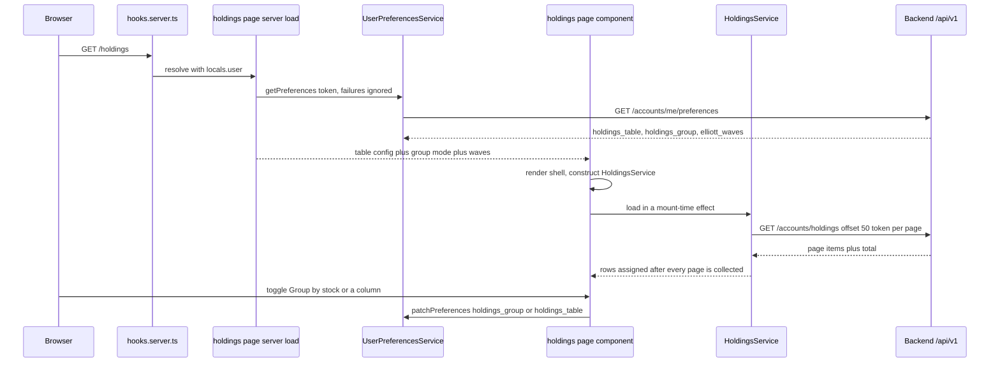
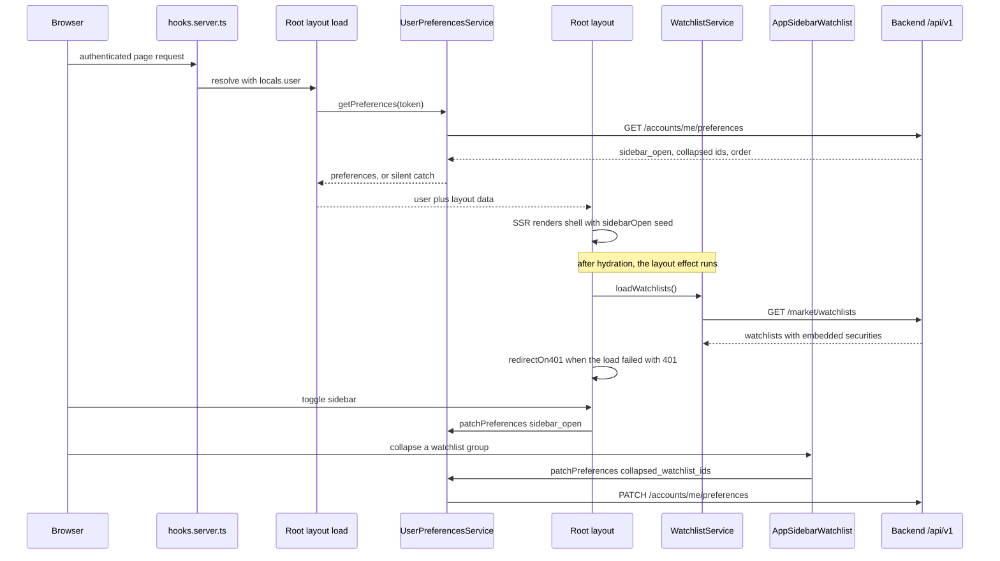
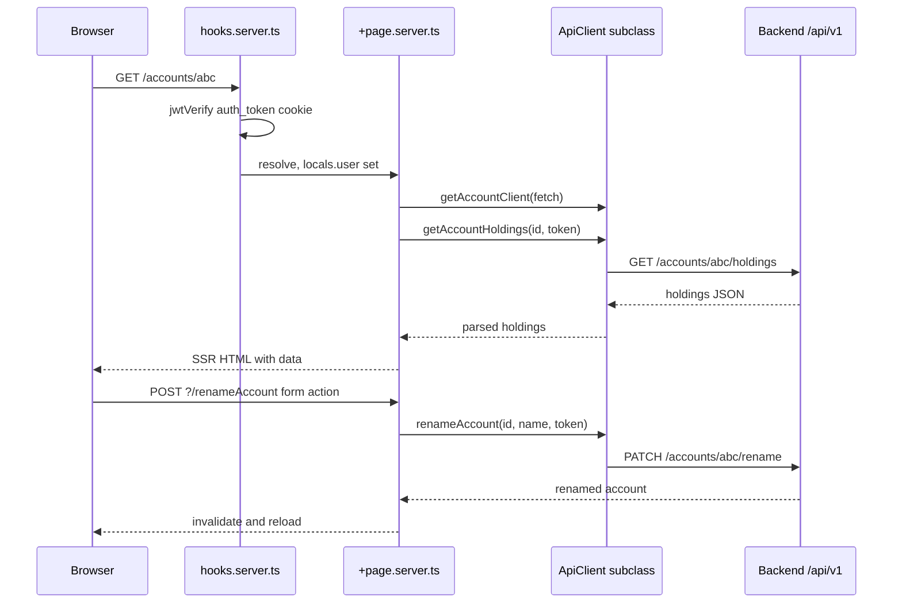

# Frontend Architecture

The frontend is a SvelteKit 2 / Svelte 5 application rendered with SSR (`@sveltejs/adapter-node`), built by Vite 7, styled with Tailwind 4 and shadcn-svelte/bits-ui primitives, and charted with `lightweight-charts`. It talks to the FastAPI backend exclusively through a typed client layer over `/api/v1`.

The whole design follows three separations that shape every file:

1. **Server-side loads produce cheap data, pages produce the rest.** Every `+page.server.ts` returns only what the first paint needs — a route identity, a preferences-derived config, or the cheap list a page's shell depends on — and the expensive reads (holdings pages, watchlist contents, security identity and price series) run **after navigation** from the page's own service. Form actions still own mutations.
2. **Reactive state lives in class instances in `*.svelte.ts`,** not in components, and is never exported as a module-level instance (SSR bleed).
3. **HTTP lives in pure `.ts` clients** that subclass `ApiClient` and never touch Svelte reactivity.

The auth axis — hooks, cookie handling, login/2FA/passkey flows — is documented in [Authentication & Authorization](/openwiki/architecture/authentication.md); chart internals are in [Charting](/openwiki/architecture/charting.md).

## Project structure

| Path | Purpose |
|------|---------|
| `frontend/src/routes/` | SvelteKit route pages, `+page.server.ts` loads/actions, `+layout.svelte`, plus per-route `page-data.svelte.ts` services |
| `frontend/src/lib/api/` | Stateless HTTP clients (one per backend area) plus `apiClient.ts` base and the `async-data.ts` post-navigation error seam |
| `frontend/src/lib/components/` | Domain components (`accounts/`, `brokers/`, `charts/`, `holdings/`, `security/`, `watchlist/`, `actions-sidebar/`, `layout/`) and `ui/` primitives |
| `frontend/src/lib/types/` | Shared domain types (`account.ts`, `money.ts`, `websocket.ts`, `portfolio.ts`, `user.ts`, `broker/`) |
| `frontend/src/lib/utils/` | Date/window helpers, `modal-state.svelte.ts`, `finance/` domain math |
| `frontend/src/lib/server/auth-cookie.ts` | Server-only `auth_token` cookie options and deletion helper |
| `frontend/src/hooks.server.ts` | Per-request JWT verification and auth redirects |
| `frontend/src/setupTest.ts` | Vitest global setup (jsdom, jest-dom, `location` stub) |

Two path aliases coexist and are used interchangeably in imports: SvelteKit's `$lib/*` and the shadcn-style `@/*`, mapped to `./src/lib/*` in `svelte.config.js` (with a `$lib` alias also declared in `vite.config.ts`).

## Route map

Routes are file-based. Authenticated pages are thin shells: `+page.server.ts` returns the cheap slice it owns, and `+page.svelte` renders a domain component that triggers the real read after navigation.

| Route | Server responsibilities | Rendered feature |
|-------|-------------------------|------------------|
| `/` | `load` → `getAccountClient(fetch).getAccounts(token)`; action `renameAccount` (requires `id` + `name` in the form body) | `AccountsList` — portfolio dashboard |
| `/accounts/[id]` | `load` → `getAccountHoldings(params.id, token)`; action `renameAccount` bound to the path param | `HoldingsTable` (`components/accounts/holdings-table.svelte`), `EditableTitle`, totals header |
| `/holdings` | `load` → **preferences only**: a nested, non-fatal `getUserPreferencesService(fetch).getPreferences(token)` call that normalizes `holdings_table` / `holdings_group` and forwards `elliott_waves`, returning `{ holdings_table_config, group_mode, elliott_waves }`. Holdings rows are **not** awaited — the page fetches them after navigation. No form actions. | `HoldingsTable` (`components/holdings/holdings-table.svelte`) behind a per-currency totals header with a display-settings dropdown |
| `/brokers` | `load` → `getBrokerService(fetch).getBrokerUsers(token)` | `BrokersList` (connected broker users, CSV import) |
| `/watchlists` | `load` → returns `{ watchlists: [] }` and never fetches; a short comment records that the layout-owned `WatchlistService.loadWatchlists()` is the single owner of the initial fetch | `Watchlists` page — per-watchlist sections with price/change pills, create/rename/delete, drag-and-drop reorder, per-list security sorting and reorder |
| `/security/[security_id]` | `load` → returns `{ security_id }` (400 when the param is missing); the security identity and its `1d` price series are fetched after navigation by `page-data.svelte.ts` | security chart plus the actions sidebar groups |
| `/settings/security` | `load` → parallel `get2FaStatus` + `getPasskeys` via `getSecurityClient(fetch)`; redirects to login when the cookie is absent | `SecuritySettings` (TOTP setup, passkeys) |
| `/auth/login` | actions `login`, `verify2fa`, `passkeyLogin` — each sets the `auth_token` cookie then redirects to `/` | `LoginForm` |
| `/auth/signup` | action validates and calls `authService.signup`, then redirects to `/auth/signup/confirmation` | `SignupForm` |
| `/auth/logout` | default action deletes/expires the cookie and redirects to `/auth/login` | tiny page |
| `/auth/verify-email` | `load` reads the `token` query param and calls `verifyEmail`, returning a `success`/`error` status | status display |
| `/` error | `+error.svelte` | fallback error shell |

The **shell-first split** is the rule that shapes this table: only aggregate reads that a page's own header needs still block the SSR response (`/`, `/accounts/[id]`, `/brokers`, `/settings/security`). `/holdings`, `/watchlists`, and `/security/[security_id]` return immediately and hydrate from the client.

`+layout.server.ts` runs for every route and returns `{ user, sidebar_open, collapsed_watchlist_ids, watchlist_order }`. When `locals.user` is set it calls `getUserPreferencesService(fetch).getPreferences(token)` once and copies each field across, validating the shape (`typeof prefs.sidebar_open === 'boolean'`, `Array.isArray` for the two list fields). The whole call sits in a `try`/`catch` that swallows the failure, so an unreachable preferences endpoint degrades to the defaults — `sidebar_open: true`, an empty collapsed-id list, and `null` order — instead of breaking every page render. `+layout.svelte` then either wraps children in `Sidebar.Provider` + `AppSidebar` (authenticated) or renders bare children (login/signup).

### Holdings surfaces

Holdings are rendered by two independent tables, one per scope:

| Route | Data source | Table component |
|-------|-------------|-----------------|
| `/accounts/[id]` | SSR `AccountClient.getAccountHoldings(id, token)` → `AccountHoldings` (account totals plus paginated `Holding` items) | `components/accounts/holdings-table.svelte` |
| `/holdings` | client-side paginated `AccountService.getUserHoldings(offset, 50, token)` → `UserHolding[]` across every account | `components/holdings/holdings-table.svelte` |

`/holdings` is the user-wide view: it is the only surface that combines grouping across accounts with column visibility, column resizing, and per-currency header totals. It reads its own persisted preferences in its own `load` (`holdings_table`, `holdings_group`, `elliott_waves`) rather than in the root layout load, inside a nested `try`/`catch` so a preferences outage still renders holdings with defaults, and it fetches the rows themselves from the page. The endpoint contract, the pagination loop, the grouping math, and the column/group preference helpers are documented in [Accounts and Holdings views](/openwiki/workflows/accounts-and-holdings-views.md); this page covers only how the shell supplies them.



The `/holdings` request flow: the SSR load returns only preferences, the shell paints, and the page's own `HoldingsService` then pages through the whole portfolio in one service method.

### Preference-driven layout data

Layout-level state is server-loaded and client-persisted in one round trip: the root load hydrates the shell, and every later change is a `PATCH /accounts/me/preferences` from the component that owns the interaction. The `UserPreferences` interface in `lib/api/userPreferencesService.ts` is the single shape all of this shares — `sidebar_open`, `sidebar_watchlists`, `collapsed_watchlist_ids`, `watchlist_order`, `holdings_table`, `holdings_group`, `holdings_period`, and `indicator_pane_heights` sit alongside the chart preferences (`timeframe`, `chart_style`, `indicators`, `elliott_waves`, `fibonacci_tools`, `drawings`, `wave_settings`, `chart_hide_labels`); the module also re-exports the Elliott-wave, Fibonacci and drawing persistence shapes declared under `lib/utils/finance/` so consumers can type a preference payload without importing the math modules directly.

| Preference | Read by | Written by |
|------------|---------|------------|
| `sidebar_open` | `+layout.server.ts` → `sidebarOpen` seed | `+layout.svelte` `handleSidebarOpenChange` |
| `collapsed_watchlist_ids` | `+layout.server.ts` → `AppSidebarWatchlist` | `AppSidebarWatchlist.toggleCollapsed` |
| `watchlist_order` | `+layout.server.ts` → `AppSidebarWatchlist` and `/watchlists` | `/watchlists` reorder handler (`moveWatchlist`, used by both drag-and-drop and keyboard) |
| `holdings_table` | `/holdings` `+page.server.ts` → `holdings_table_config` → `tableConfig` | `/holdings` column visibility and column-width handlers via `saveHoldingsTableConfig` |
| `holdings_group` | `/holdings` `+page.server.ts` → `group_mode` → `HoldingsService.setGroupBy` | `/holdings` "Group by stock" toggle via `saveHoldingsGroupMode` |
| `sidebar_watchlists` | — (declared, not consumed by any component) | — |

There is **no `watchlist_sort` preference.** A security sort mode is a property of the watchlist itself (`WatchlistRead.sort`), persisted through `PATCH /market/watchlists/{id}` by `WatchlistService.setSort` — not through the preferences endpoint.

Writes from the layout and the sidebar are fire-and-forget — `userPreferencesService.patchPreferences({ … }).catch(console.error)` — so a failed persistence never blocks the UI interaction that triggered it. The `/holdings` page differs in how it reports a failure rather than in how it writes: its `persist()` helper still patches through the same service, but captures the rejection into a page-level `persistError` that the page renders in a destructive alert above the table instead of only logging it. `/watchlists` takes a third path for watchlist reorder: `moveWatchlist` applies the new order optimistically, and on failure restores both the service array and the local `watchlistOrder` snapshot and writes the message into `watchlistService.error`. Because the loads also feed `$page.data`, a component may read a preference either from its own `data` prop or from `$page.data` — `AppSidebarWatchlist` prefers a `setContext` value injected by test harnesses (`initialWatchlistOrder` / `initialCollapsedWatchlistIds`), then `$page.data`, and only then falls back to a null order and an empty collapse set. Preferences that only one page renders (`holdings_table`, `holdings_group`) stay out of the root load entirely and are read by that page's own `load`.



The root load hydrates layout state during SSR, the hydrated layout then loads watchlists once, and later interactions persist preferences back to the same endpoint.

## SSR load plus form-action round trip



One SSR load followed by one `use:enhance` form-action mutation; `use:enhance` re-runs the load when the action returns.

## Server patterns

### Request guard

`frontend/src/hooks.server.ts` resets `event.locals.user = null`, then verifies the `auth_token` cookie with `jose`'s `jwtVerify` against `JWT_SECRET` (`$env/static/private`, algorithm HS256). Only tokens whose `payload.scope === 'access'` populate `locals.user` (`{ id: payload.user_id, email: payload.sub }`); anything else — including `mfa_pending` tokens — is treated as dead and the cookie is deleted. Requests without a user are redirected `303` to `/auth/login` unless the path starts with `/auth`. A `?clear_session=true` visit to `/auth/login` or `/auth/signup` drops any surviving cookie and renders the page instead of bouncing back to `/`, which prevents a redirect loop with a stale cookie.

### Load pattern

```ts
export const load: PageServerLoad = async ({ params, fetch, cookies }) => {
    const token = cookies.get('auth_token');
    const client = getAccountClient(fetch);           // SSR-aware fetch, no cookie jar
    const holdings = await client.getAccountHoldings(params.id, token);
    return { holdings };
};
```

The custom `fetch` from SvelteKit's load context is always passed to the client factory; the raw `auth_token` is passed alongside as an explicit `Authorization: Bearer` override, because a server-to-server `fetch` does not automatically forward the browser's cookie. `ApiError` handling is uniform where the load performs the read: `401` deletes the cookie and redirects to `/auth/login?clear_session=true`, any other status is re-thrown as a SvelteKit `error(status, message)`, and unknown failures become `error(500, 'Internal Server Error')`.

Loads that deliberately do **not** fetch still validate their inputs: `/security/[security_id]` throws `error(400, 'Security ID is required')` when the param is missing, and `/watchlists` returns `{ watchlists: [] }` without touching the cookie at all.

### The post-navigation error seam

Because the shell-first routes fetch after the response has been sent, they cannot use the SSR `throw redirect` idiom. `frontend/src/lib/api/async-data.ts` owns that case in one function:

```ts
export async function redirectOn401(err: unknown): Promise<boolean> {
    if (err instanceof ApiError && err.status === 401) {
        await goto(resolve('/auth/login?clear_session=true'));
        return true;
    }
    return false;
}
```

The convention that makes this work is that every post-navigation service method **returns the caught error instead of throwing** — `WatchlistService.loadWatchlists`, `HoldingsService.load`, and `SecurityPageDataService.load` all resolve to `null` on success and to the error on failure. The caller (`+layout.svelte`, `/holdings`, `/security/[security_id]`) passes that value to `redirectOn401`; a `true` result means the navigation was handled and the caller must not also render its own error state. The client side never deletes the httpOnly `auth_token` cookie — it routes through `?clear_session=true` so `hooks.server.ts` clears it server-side.

### Form actions

Mutations are SvelteKit actions that validate `request.formData()`, call the same client factory, and return `fail(status, { message })` on `ApiError`:

```ts
export const actions: Actions = {
    renameAccount: async ({ request, fetch, cookies }) => {
        const data = await request.formData();
        const name = data.get('name');
        if (typeof name !== 'string' || !name) return fail(400, { message: 'Name is required' });
        await getAccountClient(fetch).renameAccount(id, name, cookies.get('auth_token'));
        return { success: true };
    }
};
```

`EditableTitle` is the shared inline-edit component that drives this: it either posts to a form action (`action="?/renameAccount"`) or calls an `onSave` callback. Login is the exception that writes cookies directly — each of its three actions (`login`, `verify2fa`, `passkeyLogin`) sets `auth_token` with `path: '/'`, `httpOnly`, `sameSite: 'lax'`, `secure: !dev`, and a one-week `maxAge`, keeping the attributes in sync with `AUTH_COOKIE_OPTS` in `$lib/server/auth-cookie`.

## API client layer

`frontend/src/lib/api/apiClient.ts` defines `ApiError` (carrying `status`, `message`, and the raw `Response`) and an abstract `ApiClient` base. Every client extends it and uses protected helpers — `get`, `post`, `patch`, `put`, `delete`, `postFormData`, `getBlob` — so HTTP concerns stay in one place.

| Client | File | Backend area |
|--------|------|--------------|
| `AccountClient` | `accountClient.ts` | `/accounts/` (list, rename, totals, holdings, delete, sync, sync-status), CSV inspect/import |
| `AccountService` | `accountService.ts` | `/accounts/holdings/{securityId}` (per-security account breakdown) and the user-wide paginated `GET /accounts/holdings?offset=&limit=` |
| `AuthService` | `authService.ts` | `/auth/` login, 2FA verify, passkey auth, signup, verify-email, logout, WS ticket |
| `SecurityClient` | `securityClient.ts` | `/auth/2fa/*` and `/auth/passkeys/*` (TOTP status/setup/activate/disable/recovery codes, passkey register/rename/delete) |
| `BrokerClient` | `brokerClient.ts` | `/integration/institutions`, `/external/users`, broker login, account import |
| `MarketService` | `marketService.ts` | `/market/` search, prices (history + last-close), securities, and watchlists: list/create/rename/delete, both membership styles, the paginated per-list read, per-list sort, and per-list security reorder |
| `PortfolioClient` | `portfolioClient.ts` | `POST /portfolios/` |
| `UserPreferencesService` | `userPreferencesService.ts` | `/accounts/me/preferences` (get, put, patch) |
| `IndicatorsService` | `indicatorsService.ts` | `/market/securities/{id}/indicators` and `/compute` |
| `AlertsService` | `alertsService.ts` | `/market/securities/{id}/alerts` |
| `NotesService` | `notesService.ts` | `/market/securities/{id}/notes` |
| `DocumentsService` | `documentsService.ts` | `/market/securities/{id}/documents` (upload/download/delete) |
| `SnapshotsService` | `snapshotsService.ts` | `/market/securities/{id}/snapshots` (chart rewind) |
| `AIService` | `aiService.ts` | `/market/securities/{id}/ai/fundamentals`, `summarize-notes`, `portfolio-debate` |

Each module exports a factory (`getXxxService(customFetch?)`) plus a default instance. **The factory is what SSR uses** — passing the load `fetch` — while the default instance serves browser-side calls where the cookie is sent automatically.

### Base URL and credentials

The constructor resolves the origin in one place:

- **Browser:** `import.meta.env.VITE_API_BASE_URL || ''` (empty means same-origin, so a reverse proxy serves the API).
- **Server:** `VITE_INTERNAL_API_URL ?? VITE_API_BASE_URL ?? ''`.

A trailing slash is stripped and `/api/v1` is appended, so every client endpoint string is relative to the versioned API root. Every request sets `credentials: 'include'`, and an optional `tokenOverride` adds `Authorization: Bearer …` — the SSR mechanism described above. `postFormData` deliberately omits `Content-Type` so the browser sets the multipart boundary, and `delete` returns `undefined` for a `204` instead of trying to parse a body.

### Error extraction

`handleResponse` throws `ApiError` for any non-`ok` response, using `extractErrorMessage` which prefers the JSON `detail` field (FastAPI's shape), then `message`, then falls back to `Request failed with status <status>`. Because the message survives as a string, components can show backend text directly.

## State and service layer (`*.svelte.ts`)

Complex state, orchestration, and business logic live in ES6 classes in `.svelte.ts` files using runes — not in `.svelte` components and not as legacy `svelte/store`:

```ts
export class DataService {
    items = $state<Item[]>([]);
    isLoading = $state(false);
    errorMessage = $state<string | null>(null);
    hasItems = $derived(this.items.length > 0);

    async fetchItems() {
        this.isLoading = true;
        this.errorMessage = null;
        try { this.items = await apiClient.getItems(); }
        catch (e) { this.errorMessage = e instanceof Error ? e.message : 'Unknown error'; }
        finally { this.isLoading = false; }
    }
}
```

Representative instances:

- **`AccountsListState`** (`components/accounts/accounts-list.svelte.ts`) — owns the account list, selection mode, `groupBy`, a `SvelteSet` of syncing account ids, and a `Record<string, string \| null>` of per-account sync errors. Its constructor seeds from the SSR-provided accounts, and when `browser` is true it opens the sync WebSocket.
- **`AccountsListItemState`** — a per-row totals cache keyed by account id, invalidated by bumping a `version` rune that a `$derived.by` dependency reads.
- **`BrokerService`**, **`WatchlistService`**, **`SecurityService`** — domain facades over the corresponding client, exposing `isLoading`, `error`, and typed data attributes. `WatchlistService` is the most stateful of the three: it owns the `watchlists` array, derives `defaultWatchlistSecurities` and `activeWatchlist`, and exposes create/rename/delete, both membership styles, per-list sort, and per-list reorder; `SecurityService` additionally holds TOTP/passkey state and drives the WebAuthn registration call.
- **`HoldingsService`** (`components/holdings/holdingsService.svelte.ts`) — the `/holdings` page instantiates its own instance at component init, seeds `groupBy` from the SSR `group_mode`, and triggers `load()` from a mount-time `$effect`, so toggling grouping never triggers a refetch; `groupBy` plus the `$derived.by` `groupedHoldings` delegate to `groupHoldings(rows, mode)` in `lib/utils/finance/holdings-group.ts`. Its `load(token)` pages `getUserHoldings` with `PAGE_SIZE = 50` and `MAX_PAGES = 100`, collects every page into one array before assigning `rows`, keeps the previous rows when a page rejects, stores the thrown message, and returns the caught error for the 401 seam. The module additionally exports a `setHoldingsService()` / `getHoldingsService(customFetch?)` context pair under `Symbol('holdings-service')`, where the `customFetch` call returns an isolated instance; that context is not consumed by any production component.
- **`SecurityPageDataService`** (`routes/security/[security_id]/page-data.svelte.ts`) — the security route's post-navigation wave: `load(securityId)` fetches the identity and the `1d` series together with `Promise.all` inside `getChartDateWindow(new SvelteDate(), '1d')`, never throws, and writes an empty price series into the same `error` field as a fetch failure. It carries a `loadSeq` guard so a stale in-flight load cannot clobber a newer soft navigation, and only the newest sequence clears `isLoading`.
- **`ModalState<T>`** (`lib/utils/modal-state.svelte.ts`) — a reusable `isOpen` / `data` / `open()` / `close()` / `reset()` rune class shared by every create/view/delete modal.
- **`BrokersListState`**, `connect-broker-modal.svelte.ts`, `sync-accounts-modal.svelte.ts`, `broker-login-modal.svelte.ts` — broker list and modal state.

### Context-provided services

`+layout.svelte` instantiates the layout-scoped services at component init — `setBrokerService()`, `setSecurityService()`, `setWatchlistService()` — which `setContext` them under symbol keys. Consumers call the matching `getXxxService()`, which returns the context instance, or a fresh instance when handed a `customFetch` (the SSR path).

| Service | Context key | Fallback behavior |
|---------|-------------|-------------------|
| `BrokerService` | `Symbol('broker-service')` | `?? new BrokerService()` when no context is present, so server loads like `/brokers` can call the getter directly |
| `WatchlistService` | `Symbol('watchlist-service')` | none — the symbol lookup is returned as-is, so the layout must have provided the instance |
| `SecurityService` | `Symbol('security-service')` | keeps a module-level `defaultService`, created lazily and reused when `setContext`/`getContext` throw outside a component hierarchy |

Those three are the services the root layout provides. `HoldingsService` follows the same rune-class contract and exports a matching `setHoldingsService()` / `getHoldingsService()` pair, but the `/holdings` page deliberately constructs its own instance instead of reading that context, because the page — not the layout — owns the rows.

### Layer rules the codebase enforces

- **Never destructure reactive primitives.** `let { isLoading } = service` severs the proxy and silently kills reactivity; always read `service.isLoading`. Components consume `state.wsConnected`, `state.selectionMode`, `state.syncingAccountIds.has(id)` directly.
- **`$effect` is for side effects only** (DOM listeners, syncing to storage, starting a load) — never for computing state or fetching data; use `$derived`/`$derived.by` or do it in the event handler. `$effect` never runs during SSR, which is exactly why the post-navigation loads live in it: `+layout.svelte` starts `watchlistService.loadWatchlists()` there, `/holdings` starts `service.load()`, and `/security/[security_id]` starts `pageData.load(securityId)`. Keyboard input uses `<svelte:document onkeydown>` rather than an `$effect`-installed listener.
- **Reassign vs. mutate.** Because Svelte 5 deep-proxies `$state`, `this.items.push(x)` works, but a whole-reference reassignment (`this.items = newArray`) only stays reactive if the property itself is declared with `$state`.
- **No global instances, no raw exported `$state`.** Exporting an instantiated class or a bare `$state` from a `.svelte.ts` module leaks one user's data into another user's SSR request; instantiate in a component/layout and pass down via context. `SecurityService`'s module-level `defaultService` is the narrow, guarded exception, reachable only when context is unavailable. The prefetch bookkeeping in `+layout.svelte` is an explicit in-file illustration of the rule — `prefetchedUrls` is a per-component-instance `SvelteSet`, commented as never module scope.
- **Orchestrate multi-step fetches in the service, not the component.** If step B needs step A, that belongs in one async method. `AccountsListState.syncAccount` posts the sync and then polls `getSyncStatus` until the account leaves the in-flight list; `WatchlistService.addSecurity` short-circuits when the target list already holds the symbol/exchange, reuses a security id already present in **any** loaded watchlist, only calls `createOrUpdateSecurity` when no id is found anywhere, and only then posts the membership request; `HoldingsService.load` collects every page of `getUserHoldings` into one array before assigning `rows`, so a component never sees a half-paginated portfolio.
- **Error state is a message, not a boolean.** Services store real strings (`error`, `syncErrors[id]`) so the UI can render actionable text and a retry affordance.

### Real-time sync

`AccountsListState` builds a `/api/ws` URL (derived from `VITE_API_BASE_URL` when it is an absolute http(s) origin, otherwise from `window.location`), obtains a short-lived signed ticket from `authService.getWsTicket()`, and connects as `?ticket=…`. It listens for `sync_started` / `sync_finished` / `sync_failed` messages (`WsEventType` in `types/websocket.ts`) to maintain `syncingAccountIds` and `syncErrors`, hydrates in-flight syncs from `GET /accounts/sync-status` on open, and reconnects on a 5-second timer after close. Because a pub/sub message can be lost, `waitForSyncFinish` independently polls the status endpoint with a 60 s deadline, a 5 s grace period, and a timeout error string. `destroy()` closes the socket and is wired to `onMount`'s cleanup. The WebSocket manager on the backend side is described in [Architecture Overview](/openwiki/architecture/overview.md).

## Layout, sidebar, and navigation

`+layout.svelte` composes the authenticated shell: `Sidebar.Provider` (bound to `sidebarOpen`, seeded from `data.sidebar_open` inside `untrack`, with `onOpenChange={handleSidebarOpenChange}`) → `AppSidebar` plus `Sidebar.Inset` for page content. Toggling the sidebar fires `userPreferencesService.patchPreferences({ sidebar_open: open })`, so the open/collapsed state is a persisted user preference rather than local storage. The layout also renders `ModeWatcher` (dark/light) and the global `Toaster`.

The layout is also the owner of app-wide client state and the place where layout-scoped services are born:

- `setBrokerService()`, `setSecurityService()`, and `setWatchlistService()` run at component init, and the returned `watchlistService` is kept in scope.
- A single `$effect` awaits `watchlistService.loadWatchlists()` whenever `data.user` is set, and passes the returned error to `redirectOn401`. On success it warms the shortcut targets with `preloadData(resolve(url))` — `/watchlists`, `/holdings`, then the first ten default-watchlist securities — through `prefetchUrl`, which records each URL in a per-instance `SvelteSet` so a target is prefetched at most once and a rejected prefetch is swallowed (the real navigation load still runs).
- `globalSearchOpen` and `globalSearchTargetWatchlist` are `$state` here, published to descendants through `setContext('toggleGlobalSearch', …)` and `setContext('openGlobalSearch', (watchlist?) => …)`.
- `GlobalSearch` is rendered at layout level with `bind:open` and `bind:targetWatchlist`, so any page can open search pre-targeted at a watchlist.
- A `<svelte:document onkeydown>` handler implements modifier-free shortcuts: `/` toggles global search, `w` goes to `/watchlists`, `h` goes to `/holdings`, and `1`–`9`/`0` navigate to the first ten default-watchlist securities. Combos and keystrokes inside inputs, textareas, selects, or contenteditable elements are ignored, and every shortcut prefetches its target before navigating.

`AppSidebar` is `collapsible="icon"` and stacks four pieces:

- `AppSidebarHeader` — brand link to `/` plus the sidebar trigger.
- `AppSidebarActions` — a **Search** entry that calls the `toggleGlobalSearch` context callback (with a `/` hint), a **Watchlists** link to `/watchlists` (`w` hint), and a **Holdings** link to `/holdings` (`h` hint); the two links are built with `resolve()` from `$app/paths`.
- `AppSidebarWatchlist` — renders every watchlist from `getWatchlistService().watchlists`, not just the default one, and shows the `1`–`0` shortcut hint on the default list's rows.
- `AppSidebarProfile` — footer dropdown reading the email from `$page.data.user`, with items for `/brokers` and `/settings/security` plus a native `POST` form to `/auth/logout`.

### Watchlist state, ordering, and the sidebar

`WatchlistService` (in `components/watchlist/watchlistService.svelte.ts`) is the one client-side owner of watchlist data. Its constructor does nothing but wire a `MarketService` through `getMarketService(customFetch)`; there is no resolve-then-fetch step, because `GET /market/watchlists` already returns each watchlist with its securities embedded. `loadWatchlists(token)` stores that array directly and resolves to `null` on success or the caught error on failure. `defaultWatchlistSecurities` is a `$derived` lookup — `this.defaultWatchlist?.securities ?? []` — and `hasSecurity` / `toggleSecurity` are built on it, which is why the default-list shortcut endpoints (`addToWatchlist` / `removeFromWatchlist`) work without a watchlist id. Every write that returns a `WatchlistRead` funnels through `replaceWatchlist(updated)`, which swaps a single element of the array by id, so adding a security to one list never disturbs the others; only `createWatchlist` (append) and `deleteWatchlist` (filter) touch the array as a whole.

Failure handling differs per method, and the difference is deliberate:

- `removeSecurityFromWatchlist`, `reorderSecurities`, and `toggleSecurity` re-run `loadWatchlists` in their `catch` to resynchronise, and only **then** record the error — the resync clears `error` at its start, so recording first would wipe the message.
- `removeSecurity`, `createWatchlist`, `renameWatchlist`, `setSort`, `addSecurityToWatchlist`, and `addSecurity` only record the message and leave the local array alone.
- `reorderSecurities` is optimistic: it rebuilds the array in the given id order with each `position` rewritten to its index before the `PUT` resolves, then replaces the list with the server payload so positions stay consistent.
- `setSort` is the opposite — no optimistic update, because the response already carries the new `sort` and the securities ordered by the backend.

Ordering and collapse state are presentation concerns layered on top:

- `sortWatchlistsByOrder(watchlists, order)` in `watchlist-utils.ts` sorts by index in the persisted id array and appends any watchlist absent from it in its original relative order, so a newly created list never disappears. `AppSidebarWatchlist` and the `/watchlists` page both apply it to the same service data.
- `sortSecurities(securities, sortKey)` implements the membership ordering keys — `custom` (ascending `position`), `name_asc`/`name_desc`, `price_change_desc`/`price_change_asc`, and `date_added`/`date_added_asc`. `normalizeWatchlistSort` narrows any persisted or absent key to a known `WatchlistSort`, falling back to `custom`, and `moveItem` plus `handleReorderKeydown` provide the shared list-reordering primitives used by both the watchlist and security drag/keyboard paths.
- `AppSidebarWatchlist` reads `watchlist_order` and `collapsed_watchlist_ids` from `setContext` first (via the `initialWatchlistOrder` / `initialCollapsedWatchlistIds` keys used by `app-sidebar.test-harness.svelte`), then from `$page.data`, and keeps collapse state in a `SvelteSet`. Toggling a group persists the whole set via `patchPreferences({ collapsed_watchlist_ids })`.
- `/watchlists` derives its ordered list from the shared service through `sortWatchlistsByOrder`, sorts each list's securities with `sortSecurities(securities, normalizeWatchlistSort(watchlist.sort))`, and keeps per-list UI state (rename target, drag indices, security-reorder target, focus-driven row selection). Its own `load` no longer supplies watchlists: the page seeds `watchlistService.watchlists` from `data.watchlists` only when the service is still empty, which is inert now that the load returns `[]` and is kept as a safety net for direct/programmatic renders. Reorder and sort persist through different endpoints — `watchlist_order` via `patchPreferences` in `moveWatchlist`, and the sort mode via `WatchlistService.setSort` → `PATCH /market/watchlists/{id}`.

`GlobalSearch` is a `Command.Dialog` bound to `open` from the layout and to a `$bindable` `targetWatchlist`. It debounces (300 ms) `marketService.search(query)`, groups results by `security_type`, and on select calls `createOrUpdateSecurity` then closes and `goto('/security/{id}')`. The star button is target-aware: it resolves the bound target against the service's current watchlists (`activeTargetWatchlist`) and matches the result against that list's securities by symbol + exchange, then

- with a target — removes the existing membership via `removeSecurityFromWatchlist`, or creates the security and calls `addSecurityToWatchlist` for the target id;
- without a target — looks the security up in `watchlistService.defaultWatchlistSecurities` and delegates to `toggleSecurity`, so an existing security is simply toggled rather than re-created.

Closing the dialog resets the query, the results, and the bound `targetWatchlist`. The `/watchlists` page's per-section `+` button calls the layout's `openGlobalSearch` context callback with that watchlist, so the dialog opens pre-targeted.

## Type and money conventions

- Backend payloads are mirrored as snake_case field names (`account_id`, `security_symbol`, `average_cost`, `totals`/`cost`); the frontend does not camel-case them.
- `lib/types/account.ts` holds `Account`, `Holding`, `UserHolding`, `AccountHoldings`, `AccountTotals`, plus the `AccountType` and `Institution` enums and their `getAccountTypeLabel` / `getInstitutionLabel` helpers (each accepting an optional `translate` callback for future i18n).
- `UserHolding` is `Holding` plus `account_id` / `account_name`, mirroring the backend `UserHoldingRead` returned by the user-wide `GET /accounts/holdings`, which is why the `/holdings` table can render an Account column and group one stock across accounts. `AccountHoldings` extends `PaginatedResponse<Holding>` with the account-level totals (`account_id`, `account_name`, `total_value`, `total_profit_loss`, `total_profit_loss_percent`, `net_deposits`, `currency`) that `/accounts/[id]` renders in its header.
- List endpoints return `PaginatedResponse<T>` (`lib/types/pagination.ts`); clients expose `.items`.
- `Money` is `{ value?: string; units?: number; nanos?: number; currencyCode?: string }`. `moneyToNumber` prefers integer `units` plus `nanos / 1e9` and falls back to parsing the string `value`; `money(m)` renders `$<localized number>`. Account totals arrive as nested `{ cost: Money, value: Money }`. See [Money and Currency](/openwiki/concepts/money-and-currency.md) for the backend contract behind these fields.
- Chart and domain math types live under `lib/utils/finance/` (Elliott waves, Fibonacci, drawings, rewind, holdings metrics) and are re-exported by `userPreferencesService.ts` for the persistence shapes.

## UI stack

- Tailwind 4 tokens and theme variables in `frontend/src/app.css`.
- shadcn-svelte / bits-ui primitives in `lib/components/ui/` (`sidebar`, `dialog`, `dropdown-menu`, `command`, `toast`, `kbd`, …), composed with `tailwind-variants` and `cn()`.
- Icons from `@lucide/svelte`; dark/light via `mode-watcher`.
- `browser` from `$app/environment` is checked before touching `WebSocket`, `window`, or browser-only APIs.

## Testing

Vitest with `jsdom`, `@testing-library/svelte`, and `@testing-library/user-event`. `vite.config.ts` sets `environment: 'jsdom'`, `url: 'http://localhost/'`, `setupFiles: ['./src/setupTest.ts']`, and includes `src/**/*.{test,spec}.{js,ts}`; `setupTest.ts` registers jest-dom, stubs `window.location`, no-ops `Element.prototype.scrollIntoView` (bits-ui's `Command` calls it on the active item and group heading), suppresses the DEV-only `derived_inert` console warning that bits-ui's dismissible-layer emits, and defers teardown ~50 ms so bits-ui body-scroll-lock timers do not throw after jsdom is destroyed.

**All API calls must be mocked.** CI runs without a backend, so any unmocked `fetch` fails with `ECONNREFUSED` and makes the suite flaky. Tests `vi.mock` every client module the component depends on and stub every method it calls, and they mock framework/third-party modules that reach the network or the DOM (`$app/forms`, `$app/paths`, `$app/navigation`, `$app/stores`, `lightweight-charts`). Websocket tests replace `global.WebSocket` with a mock class. `hooks.server.test.ts` runs under `// @vitest-environment node` with `$env/static/private` mocked and signs real JWTs with `jose`. Coverage is 60+ suites colocated with their sources (`lib/api`, `lib/components/**`, `lib/utils/finance`, `routes/**`); see [Testing](/openwiki/operations/testing.md).

Component-level route tests exercise the shell directly rather than through a running server, and they follow the shell-first split: a server-load suite asserts the load fetches **only** what it should. `routes/layout.test.ts` renders `+layout.svelte` with a `createRawSnippet` child — capturing the context `WatchlistService` from the snippet's `setup` so tests can seed `defaultWatchlistSecurities` — and asserts the unauthenticated bare-children path versus the `Sidebar.Provider` path, the `/`, `w`, `h` and numeric shortcuts, the prefetch order (`/watchlists`, `/holdings`, then the top ten securities, each at most once, failures swallowed), the 401 path through `goto('/auth/login?clear_session=true')`, and the `+layout.server.ts` load defaults for `collapsed_watchlist_ids` and `watchlist_order`. `routes/watchlists/page.svelte.test.ts` mocks the market client and the preferences service but keeps a real `WatchlistService` instance (mocking only `getWatchlistService`) and injects `openGlobalSearch` through render context, so the page's `$derived` ordering and sorting run against real rune state.

The shell-first routes each carry two colocated suites: `routes/holdings/page.server.test.ts` `vi.mock`s `$lib/api/accountService` and `$lib/api/userPreferencesService`, asserts `getPreferences('test-token')` is called and that the result keys are exactly `elliott_waves`, `group_mode`, `holdings_table_config`, and explicitly asserts `getUserHoldings` was **never** called, plus the preference-failure fallback to `HOLDINGS_TABLE_DEFAULT_CONFIG` / `'none'` / `null`; `routes/holdings/page.svelte.test.ts` mocks the same two modules plus `$app/paths` and `$app/navigation` and renders the page with a `data` prop to drive grouping, column visibility, and per-currency totals. `routes/security/[security_id]/page.server.test.ts` asserts the load returns only `security_id`, never calls `getSecurity` or `getPrices`, and throws 400 without the param. `routes/watchlists/page.server.test.ts` asserts the load returns `{ watchlists: [] }`, never fetches, and neither reads nor deletes the cookie. `lib/components/holdings/` carries the pure helpers and presentational table (`holdings-table-columns`, `holdings-table-prefs`, `holdings-group-prefs`, `holdings-table`, and a `holdingsService` suite that injects a mocked `getAccountService`). The presentational table only needs `$app/paths` mocked, which is the rule working as intended: no network work, no network mock.

```bash
npm run test:run   # vitest run
npm run check      # svelte-kit sync && svelte-check
npm run lint       # prettier --check . && eslint .
npm run format     # prettier --write .
```

Per `frontend/AGENTS.md`, frontend commands run inside the `frontend` docker-compose service and lint/type-check/test/format are mandatory before submission.

## Extension points

- **New backend area** → add a class extending `ApiClient` in `lib/api/`, export both `getXClient(customFetch?)` and a default instance, and use the factory in `+page.server.ts` so SSR keeps the request `fetch`.
- **New page** → a `+page.server.ts` that returns only what the first paint needs, plus `actions` for mutations using the same `401 → deleteAuthCookie + redirect` / `ApiError → error(status, message)` shape. If the page's real data is expensive, do **not** await it in the load: return the cheap slice, then instantiate a page-owned rune service (or a `page-data.svelte.ts` service) and start its `load()` in a mount-time `$effect`, routing the returned error through `redirectOn401`. Keep `+page.svelte` a shell over a domain component.
- **New stateful feature** → a `Foo.svelte.ts` rune class with `isLoading`/message-valued error fields and orchestration methods; have its async methods **return** the caught error rather than throw when a post-navigation caller needs to distinguish a 401; instantiate it in the component that owns the state (as `/holdings` does with `HoldingsService`) or provide it from `+layout.svelte` via `setContext` for genuinely app-wide state, and never as a module-level instance.
- **New preference** → add the field to `UserPreferences` in `userPreferencesService.ts` and patch it from the component with `userPreferencesService.patchPreferences({ … })`. A preference that drives the shell (`sidebar_open`, `collapsed_watchlist_ids`, `watchlist_order`) additionally belongs in `+layout.server.ts`'s load so the first render already reflects it; a page-scoped preference (`holdings_table`, `holdings_group`) belongs in that page's own `+page.server.ts` load instead. Either way add a shape check and keep the surrounding `try`/`catch` so a preferences outage still renders — `/holdings` falls back to the default table config, flat rows, and `null` Elliott waves. A per-watchlist setting such as the security sort mode is **not** a preference: put it on the watchlist record and persist it through the matching `MarketService` method.
