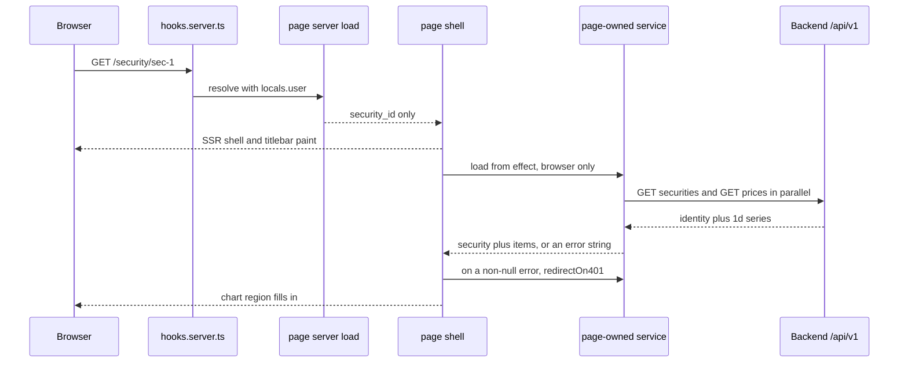
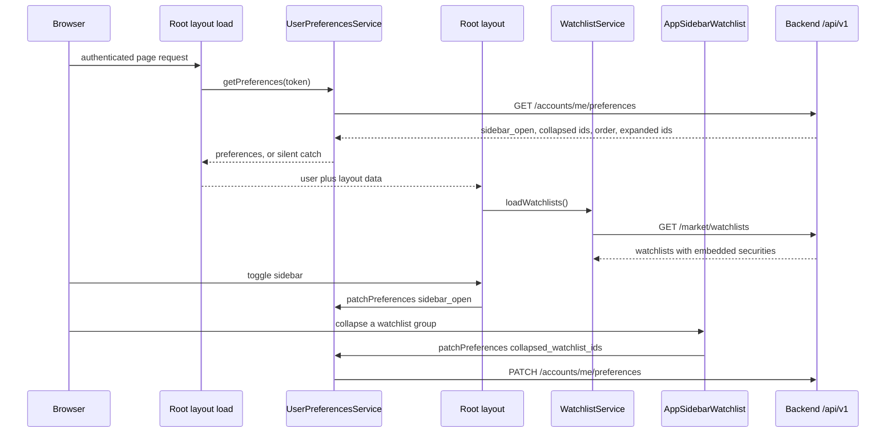
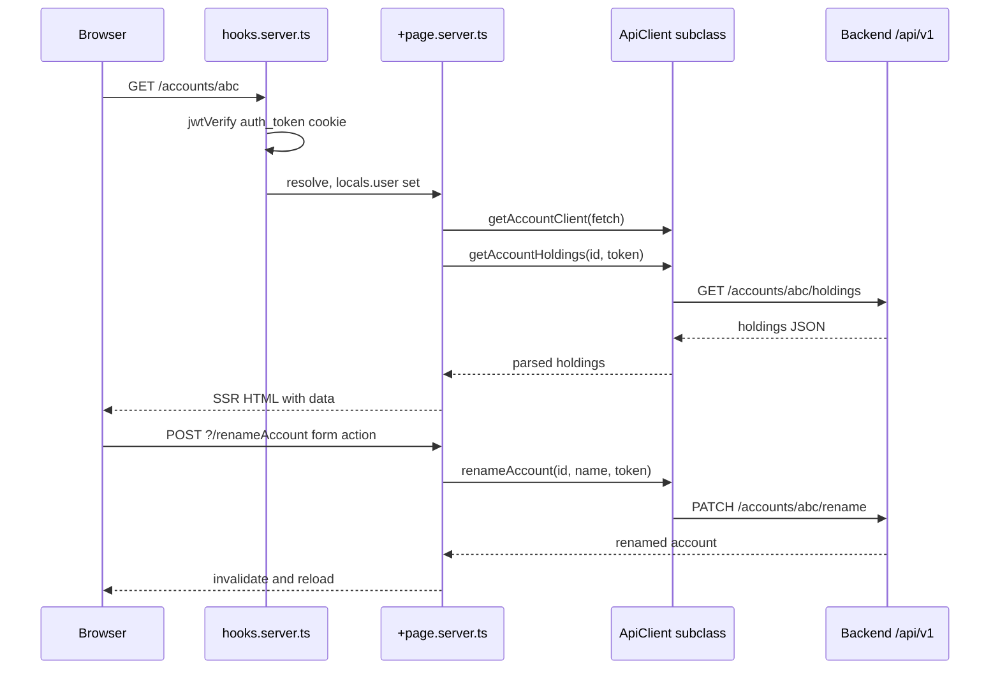

# Frontend Architecture

The frontend is a SvelteKit 2 / Svelte 5 application rendered with SSR (`@sveltejs/adapter-node`), built by Vite 7, styled with Tailwind 4 and shadcn-svelte/bits-ui primitives, and charted with `lightweight-charts`. It talks to the FastAPI backend exclusively through a typed client layer over `/api/v1`.

Three separations shape every file:

1. **Server loads and form actions produce data and mutations** — but only for data a page must have before its first paint. Shell-first routes return cheap identity or preference-derived keys from `+page.server.ts` and fetch the rest after navigation (see [The post-navigation data wave](#the-post-navigation-data-wave)).
2. **Reactive state lives in class instances in `*.svelte.ts`,** not in components, and is never exported as a module-level instance (SSR bleed).
3. **HTTP lives in pure `.ts` clients** that subclass `ApiClient` and never touch Svelte reactivity.

The auth axis — hooks, cookie handling, login/2FA/passkey flows — is documented in [Authentication & Authorization](./authentication.md); chart internals in [Charting](./charting.md) (render surface, indicators, panes) and [Chart Drawings & Rewind](./chart-drawings-and-rewind.md) (drawing plugins, drawing persistence, snapshots).

## Project structure

| Path | Purpose |
|------|---------|
| `frontend/src/routes/` | SvelteKit route pages, `+page.server.ts` loads/actions, `+layout.svelte`, and page-owned `*.svelte.ts` data services |
| `frontend/src/lib/api/` | Stateless HTTP clients (one per backend area) plus `apiClient.ts` base and the `async-data.ts` redirect seam |
| `frontend/src/lib/components/` | Domain components (`accounts/`, `brokers/`, `charts/`, `holdings/`, `security/`, `watchlist/`, `actions-sidebar/`, `layout/`) and `ui/` primitives |
| `frontend/src/lib/services/` | Cross-cutting rune services (`ChartDrawingsService.svelte.ts`) |
| `frontend/src/lib/types/` | Shared domain types (`account.ts`, `money.ts`, `websocket.ts`, `portfolio.ts`, `user.ts`, `broker/`) |
| `frontend/src/lib/utils/` | Date/window helpers, `modal-state.svelte.ts`, `finance/` domain math |
| `frontend/src/lib/server/auth-cookie.ts` | Server-only `auth_token` cookie options and deletion helper |
| `frontend/src/hooks.server.ts` | Per-request JWT verification and auth redirects |
| `frontend/src/setupTest.ts` | Vitest global setup (jsdom, jest-dom, `location` stub) |

Two path aliases coexist and are used interchangeably in imports: SvelteKit's `$lib/*` and the shadcn-style `@/*`, mapped to `./src/lib/*` in `svelte.config.js` (with a `$lib` alias also declared in `vite.config.ts`).

## Route map

Routes are file-based. The "server load" column states what the load actually awaits before the first render; everything marked *post-navigation* is fetched after the shell has painted.

| Route | Server load | Rendered feature |
|-------|-------------|------------------|
| `/` | `getAccountClient(fetch).getAccounts(token)`; action `renameAccount` (requires `id` + `name` in the form body) | `AccountsList` — portfolio dashboard |
| `/accounts/[id]` | `getAccountHoldings(params.id, token)`; action `renameAccount` bound to the path param | `HoldingsTable` (`components/accounts/holdings-table.svelte`), `EditableTitle`, totals header |
| `/portfolios` | `getPortfolioClient(fetch).getPortfolios(token)` | one `PortfolioListItem` per portfolio — inline rename and delete through `EditableTitle` + confirmation modal, each linking to `/holdings?portfolio_id=…` |
| `/holdings` | cheap keys only — one `Promise.allSettled([getPreferences, getPortfolios, getAccounts])` pass normalized into `holdings_table_config`, `group_mode`, `elliott_waves`, `portfolios`, `accounts`, plus the `portfolio_id` / `account_id` query params. Rows are *post-navigation* | `HoldingsTable` (`components/holdings/holdings-table.svelte`) behind a per-currency totals header with a filter and a display-settings dropdown |
| `/brokers` | `getBrokerService(fetch).getBrokerUsers(token)` | `BrokersList` (connected broker users, CSV import) |
| `/watchlists` | nothing — returns `{ watchlists: [] }`. Watchlists are *post-navigation*, owned by the layout | per-watchlist sections with price/change pills, create/rename/delete, watchlist and per-list security reordering, per-list security sorting |
| `/security/[security_id]` | route identity only — `{ security_id }`, `error(400, …)` when the param is absent. Identity and the `1d` series are *post-navigation* | security chart plus the [actions sidebar groups](#the-security-routes-actions-sidebar) |
| `/settings/security` | parallel `get2FaStatus` + `getPasskeys` via `getSecurityClient(fetch)`; redirects to login when the cookie is absent | `SecuritySettings` (TOTP setup, passkeys) |
| `/auth/login` | actions `login`, `verify2fa`, `passkeyLogin` — each sets the `auth_token` cookie then redirects to `/` | `LoginForm` |
| `/auth/signup` | action validates and calls `authService.signup`, then redirects to `/auth/signup/confirmation` | `SignupForm` |
| `/auth/logout` | default action deletes/expires the cookie and redirects to `/auth/login` | tiny page |
| `/auth/verify-email` | `load` reads the `token` query param and calls `verifyEmail`, returning a `success`/`error` status | status display |
| any | `+error.svelte` | fallback error shell |

`+layout.server.ts` runs for every route and returns `{ user, sidebar_open, collapsed_watchlist_ids, watchlist_order, expanded_account_ids }`. When `locals.user` is set it calls `getUserPreferencesService(fetch).getPreferences(token)` once and copies each field across only after a shape check (`typeof prefs.sidebar_open === 'boolean'`, `Array.isArray` for `collapsed_watchlist_ids`, `watchlist_order` and `expanded_account_ids`). The whole call sits in a `try`/`catch` that swallows the failure, so an unreachable preferences endpoint degrades to the defaults — `sidebar_open: true`, empty collapsed-id and expanded-id lists, and `null` order — instead of breaking every page render. `+layout.svelte` then either wraps children in `Sidebar.Provider` + `AppSidebar` (authenticated) or renders bare children (login/signup).

### The `/portfolios` route

`/portfolios` is the opposite shape from the shell-first trio: it awaits its payload in the load (`getPortfolioClient(fetch).getPortfolios(token)` under the standard `401 → deleteAuthCookie + redirect` / `ApiError → error(status, message)` guards), so the list is already in the SSR HTML. Everything after that is browser-side and deliberately stays out of SvelteKit's form-action machinery — there are no `actions` here. The page keeps a `localPortfolios` `$state` overlay with `portfolios = $derived(localPortfolios ?? data.portfolios ?? [])`, and `PortfolioListItem` drives rename and delete through `onRename` / `onDelete` callbacks that call the `portfolioClient` **default instance** (`updatePortfolio` / `deletePortfolio`) and then rewrite the overlay. Because that instance sends the httpOnly cookie automatically, no token plumbing is needed, and because the overlay is local, no `invalidate` round trip is required. A failed rename or delete is logged and the overlay is left untouched, so the server-provided list stays the source of truth. The portfolio model itself (a `Portfolio` with its embedded `accounts`) and the `?portfolio_id=` hand-off into `/holdings` are covered in [Portfolios](../workflows/portfolios.md).

### Holdings surfaces

Holdings are rendered by two independent tables, one per scope:

| Route | Data source | Table component |
|-------|-------------|-----------------|
| `/accounts/[id]` | `AccountClient.getAccountHoldings(id, token)` → `AccountHoldings` (account totals plus paginated `Holding` items), awaited in the load | `components/accounts/holdings-table.svelte` |
| `/holdings` | `AccountService.getUserHoldings(offset, limit, token)` → `UserHolding[]` across every account, paged after navigation | `components/holdings/holdings-table.svelte` |

`/holdings` is the user-wide view: it is the only surface that combines grouping across accounts with column visibility, column resizing, and per-currency header totals, and its own `load` — not the root layout load — is where it reads its persisted preferences (`holdings_table`, `holdings_group`, `elliott_waves`) together with the `portfolios` and `accounts` lists that back its filter dropdown. The endpoint contract, the pagination loop, the grouping math, and the column/group preference helpers are documented in [Accounts and Holdings views](../workflows/accounts-and-holdings-views.md); this page covers only how the shell supplies them.

## The post-navigation data wave

Three routes deliberately render a complete shell before their row data exists. Their `+page.server.ts` returns only what is cheap and stable — route identity, preference-derived keys, or a filter's option lists — and a page-owned rune service performs the real fetch from an `$effect`, which never runs during SSR.

| Route | Server load returns | Post-navigation fetch | Owner |
|-------|---------------------|-----------------------|-------|
| `/security/[security_id]` | `{ security_id }` | security identity + `1d` price series in parallel | `SecurityPageDataService` (`routes/security/[security_id]/page-data.svelte.ts`) |
| `/holdings` | `{ holdings_table_config, group_mode, elliott_waves, portfolios, accounts, portfolio_id, account_id }` | every page of `getUserHoldings` (plus a batch valuation read) | `HoldingsService` (`lib/components/holdings/holdingsService.svelte.ts`) |
| `/watchlists` | `{ watchlists: [] }` | `GET /market/watchlists` | `WatchlistService`, owned by `+layout.svelte` and read from context |

`/holdings` is the odd one out among the three: its `Promise.allSettled([getPreferences, getPortfolios, getAccounts])` pass is both the whole load (the holdings rows are *not* awaited here, so the table arrives in its own wave below) and the only place the shell-first shape still honours a 401 — a rejection from *any* of the three settled results deletes the cookie and throws `redirect(303, '/auth/login?clear_session=true')`, so a shell-first load is not a silent one. Every other outcome falls back per result instead of failing the render (`normalizeHoldingsTableConfig(null)`, `'none'`, `null` waves, `[]` for portfolios and accounts).

The services follow one contract so the shell never has to special-case them: each `load()` **never throws**. It stores the message in its own error state (`error` / `errorMessage`) and returns the caught error, or `null` on success. The calling `$effect` passes a non-null result to `redirectOn401` from `$lib/api/async-data.ts`:

```ts
const err = await watchlistService.loadWatchlists();
if (err !== null) {
    await redirectOn401(err);
    return;
}
```

`redirectOn401(err)` returns `true` only for an `ApiError` with `status === 401`, in which case it navigates to `/auth/login?clear_session=true` and the caller stops. The httpOnly `auth_token` cookie is **not** deleted client-side — `hooks.server.ts` clears it when the login page is resolved. Any other error returns `false`, and the caller surfaces `err.message` in its own in-page alert. The same seam is used by the layout (watchlists), `/holdings`, and `/security/[security_id]`.

`SecurityPageDataService` also illustrates the stale-load guard the convention implies: `load()` bumps a private `loadSeq` and discards its own result when a newer soft navigation has started, so a slow response cannot clobber the current security. It fetches identity and prices with `Promise.all` inside `getChartDateWindow(new SvelteDate(), '1d')`, and treats an empty series as a *successful* load whose message (`No price data available for this security`) lands in `error` rather than being thrown.


```mermaid
sequenceDiagram
    participant Browser
    participant Hook as hooks.server.ts
    participant Load as page server load
    participant Shell as page shell
    participant Svc as page-owned service
    participant API as Backend /api/v1

    Browser->>Hook: GET /security/sec-1
    Hook->>Load: resolve with locals.user
    Load-->>Shell: security_id only
    Shell-->>Browser: SSR shell and titlebar paint
    Shell->>Svc: load from effect, browser only
    Svc->>API: GET securities and GET prices in parallel
    API-->>Svc: identity plus 1d series
    Svc-->>Shell: security plus items, or an error string
    Shell->>Svc: on a non-null error, redirectOn401
    Shell-->>Browser: chart region fills in
```

The shell-first wave: the load returns only route identity, the page-owned service fetches the rest after navigation, and a 401 exits through the shared `redirectOn401` seam.

### Preference-driven layout data

Layout-level state is server-loaded and client-persisted in one round trip: the root load hydrates the shell, and every later change is a `PATCH /accounts/me/preferences` from the component that owns the interaction. The `UserPreferences` interface in `lib/api/userPreferencesService.ts` is the single shape all of this shares, and it also re-exports the Elliott-wave, Fibonacci and drawing persistence shapes declared under `lib/utils/finance/`. [User Preferences](../concepts/user-preferences.md) owns the full key-by-key read/write matrix; the layout-relevant subset is:

| Preference | Read by | Written by |
|------------|---------|------------|
| `sidebar_open` | `+layout.server.ts` → `sidebarOpen` seed | `+layout.svelte` `handleSidebarOpenChange` |
| `collapsed_watchlist_ids` | `+layout.server.ts` → `$page.data` → `AppSidebarWatchlist` | `AppSidebarWatchlist.toggleCollapsed` |
| `watchlist_order` | `+layout.server.ts` → `$page.data` → `AppSidebarWatchlist` and `/watchlists` | `/watchlists` reorder (drag-and-drop or keyboard) |
| `expanded_account_ids` | `+layout.server.ts` → `$page.data` → `AccountsList` / `AccountsListItem` | `AccountsListItem.toggleExpanded` |
| `holdings_table` | `/holdings` `+page.server.ts` → `holdings_table_config` → `tableConfig` | `/holdings` column visibility and column-width handlers via `saveHoldingsTableConfig` |
| `holdings_group` | `/holdings` `+page.server.ts` → `group_mode` → `HoldingsService.setGroupBy` | `/holdings` "Group by stock" toggle via `saveHoldingsGroupMode` |
| `show_valuation_band` | security page `onPreferencesLoaded` (and the init-chain fetch) → `showValuationOverlay` → chart `showValuationBand` | `FundamentalsGroup` overlay checkbox → `patchPreferences({ show_valuation_band })` |
| `indicator_pane_heights` | security page `applySavedPaneHeights` → `chartRef.setPaneHeights` | security page `handlePaneHeightsChange` (whole map or `null`) |
| `sidebar_watchlists` | — (declared, not consumed by any component) | — |

Writes from the layout and the sidebar are fire-and-forget — `userPreferencesService.patchPreferences({ … }).catch(console.error)` — so a failed persistence never blocks the UI interaction that triggered it. The `/holdings` page differs in how it reports a failure rather than in how it writes: its `persist()` helper still patches through the same service, but captures the rejection into a page-level `persistError` that the page renders in a destructive alert above the table instead of only logging it. The security page's chart and valuation writes are logged only, because the chart's local state is optimistic and self-healing.

### The `$page.data` preference seam

Because the root load's return value is merged into every route's `data`, a descendant component can read a layout-level preference without a prop or a context value. This is the mechanism three surfaces rely on:

| Consumer | Reads | Fallback chain |
|----------|-------|----------------|
| `AppSidebarWatchlist` | `watchlist_order`, `collapsed_watchlist_ids` | `setContext('initialWatchlistOrder' / 'initialCollapsedWatchlistIds')` (used by `app-sidebar.test-harness.svelte`) → `$page.data` → `null` order / empty collapse set |
| `AccountsList` / `AccountsListItem` | `expanded_account_ids` | `setContext('initialExpandedAccountIds')` or `setContext('expandedAccountIds')` → `$page.data` → empty set |
| `/watchlists` page | `watchlist_order` | the route's own `data` prop → `$page.data` → `null` |

All three read those keys off `$app/stores`' `page` store (`$page?.data?.…`) rather than a prop, so a suite that wants to drive the fallback chain must mock `$app/stores` with a `readable` page value (`routes/layout.test.ts` and `app-sidebar.test.ts` both do, alongside the API clients); a suite that only exercises the context seam or leaves the store empty does not need it. `/holdings` does **not** use this seam: its filter state (`portfolio_id`, `account_id`) arrives as route data because the load reads `url.searchParams` itself.

Two preferences are deliberately *outside* this seam. `show_valuation_band` and `indicator_pane_heights` are security-page concerns that the root load never touches, so the page reads them from its own `userPreferencesService.getPreferences()` call after navigation (`onPreferencesLoaded` on the indicators group, and an init-chain fetch that only runs when `userPreferences` is still null) and writes them straight back with `patchPreferences`. Routing them through `$page.data` would make the security route's first render wait on a preferences request that only one screen needs.

Note that per-watchlist *security sort* is no longer a preference: it is a column on the watchlist itself (`WatchlistRead.sort`), persisted by `WatchlistService.setSort` through `PATCH /market/watchlists/{id}`.


```mermaid
sequenceDiagram
    participant Browser
    participant Load as Root layout load
    participant Prefs as UserPreferencesService
    participant Layout as Root layout
    participant WL as WatchlistService
    participant Sidebar as AppSidebarWatchlist
    participant API as Backend /api/v1

    Browser->>Load: authenticated page request
    Load->>Prefs: getPreferences(token)
    Prefs->>API: GET /accounts/me/preferences
    API-->>Prefs: sidebar_open, collapsed ids, order, expanded ids
    Prefs-->>Load: preferences, or silent catch
    Load-->>Layout: user plus layout data
    Layout->>WL: loadWatchlists()
    WL->>API: GET /market/watchlists
    API-->>WL: watchlists with embedded securities
    Browser->>Layout: toggle sidebar
    Layout->>Prefs: patchPreferences sidebar_open
    Browser->>Sidebar: collapse a watchlist group
    Sidebar->>Prefs: patchPreferences collapsed_watchlist_ids
    Prefs->>API: PATCH /accounts/me/preferences
```

The root load hydrates layout state, the layout then loads watchlists once (which also feeds the sidebar and the ticker shortcuts), and later interactions persist preferences back to the same endpoint.

## SSR load plus form-action round trip


```mermaid
sequenceDiagram
    participant Browser
    participant Hook as hooks.server.ts
    participant Load as +page.server.ts
    participant Client as ApiClient subclass
    participant API as Backend /api/v1

    Browser->>Hook: GET /accounts/abc
    Hook->>Hook: jwtVerify auth_token cookie
    Hook->>Load: resolve, locals.user set
    Load->>Client: getAccountClient(fetch)
    Load->>Client: getAccountHoldings(id, token)
    Client->>API: GET /accounts/abc/holdings
    API-->>Client: holdings JSON
    Client-->>Load: parsed holdings
    Load-->>Browser: SSR HTML with data
    Browser->>Load: POST ?/renameAccount form action
    Load->>Client: renameAccount(id, name, token)
    Client->>API: PATCH /accounts/abc/rename
    API-->>Load: renamed account
    Load-->>Browser: invalidate and reload
```

One SSR load followed by one `use:enhance` form-action mutation; `use:enhance` re-runs the load when the action returns.

## Server patterns

### Request guard

`frontend/src/hooks.server.ts` resets `event.locals.user = null`, then verifies the `auth_token` cookie with `jose`'s `jwtVerify` against `JWT_SECRET` (`$env/static/private`, algorithm HS256). Only tokens whose `payload.scope === 'access'` populate `locals.user` (`{ id: payload.user_id, email: payload.sub }`); anything else — including `mfa_pending` tokens — is treated as dead and the cookie is deleted. Requests without a user are redirected `303` to `/auth/login` unless the path starts with `/auth`. A `?clear_session=true` visit to `/auth/login` or `/auth/signup` drops any surviving cookie and renders the page instead of bouncing back to `/`, which prevents a redirect loop with a stale cookie.

### Load pattern

```ts
export const load: PageServerLoad = async ({ params, fetch, cookies }) => {
    const token = cookies.get('auth_token');
    const client = getAccountClient(fetch);           // SSR-aware fetch, no cookie jar
    const holdings = await client.getAccountHoldings(params.id, token);
    return { holdings };
};
```

The custom `fetch` from SvelteKit's load context is always passed to the client factory; the raw `auth_token` is passed alongside as an explicit `Authorization: Bearer` override, because a server-to-server `fetch` does not automatically forward the browser's cookie. `ApiError` handling is uniform: `401` deletes the cookie and redirects to `/auth/login?clear_session=true`, any other status is re-thrown as a SvelteKit `error(status, message)`, and unknown failures become `error(500, 'Internal Server Error')`. `/watchlists` and `/security/[security_id]` are the loads that skip this shape entirely, because they issue no authenticated request at all. `/holdings` keeps the auth half but skips the error half: it does call three authenticated endpoints, yet it awaits them with `Promise.allSettled` so a single failing call cannot blank the shell — a 401 from any settled result still deletes the cookie and throws `redirect(303, …)`, every other rejection is swallowed per result, and the redirect simply passes through the load's outer `catch` unchanged. `/portfolios` is the strict awaited shape: one `getPortfolioClient(fetch).getPortfolios(token)` call inside exactly the two `ApiError` branches.

### Form actions

Mutations are SvelteKit actions that validate `request.formData()`, call the same client factory, and return `fail(status, { message })` on `ApiError`:

```ts
export const actions: Actions = {
    renameAccount: async ({ request, fetch, cookies }) => {
        const data = await request.formData();
        const name = data.get('name');
        if (typeof name !== 'string' || !name) return fail(400, { message: 'Name is required' });
        await getAccountClient(fetch).renameAccount(id, name, cookies.get('auth_token'));
        return { success: true };
    }
};
```

`EditableTitle` is the shared inline-edit component that drives this: it either posts to a form action (`action="?/renameAccount"`) or calls an `onSave` callback. Login is the exception that writes cookies directly — each of its three actions (`login`, `verify2fa`, `passkeyLogin`) sets `auth_token` with `path: '/'`, `httpOnly`, `sameSite: 'lax'`, `secure: !dev`, and a one-week `maxAge`, keeping the attributes in sync with `AUTH_COOKIE_OPTS` in `$lib/server/auth-cookie`.

## API client layer

`frontend/src/lib/api/apiClient.ts` defines `ApiError` (carrying `status`, `message`, and the raw `Response`) and an abstract `ApiClient` base. Every client extends it and uses protected helpers — `get`, `post`, `patch`, `put`, `delete`, `postFormData`, `getBlob` — so HTTP concerns stay in one place.

| Client | File | Backend area |
|--------|------|--------------|
| `AccountClient` | `accountClient.ts` | `/accounts/` (list, rename, totals, holdings, delete, sync, sync-status), CSV inspect/import |
| `AccountService` | `accountService.ts` | `/accounts/holdings/{securityId}` (per-security account breakdown) and the user-wide paginated `GET /accounts/holdings?offset=&limit=` |
| `AuthService` | `authService.ts` | `/auth/` login, 2FA verify, passkey auth, signup, verify-email, logout, WS ticket |
| `SecurityClient` | `securityClient.ts` | `/auth/2fa/status` plus `/auth/2fa/totp/*` (setup, activate, disable, recovery-codes/regenerate), `/auth/passkey/register/*` (options, verify), and `/auth/passkeys` (list, rename, delete) |
| `BrokerClient` | `brokerClient.ts` | `/integration/institutions`, `/external/users`, broker login, account import |
| `MarketService` | `marketService.ts` | `/market/` search, prices (history + last-close), securities, watchlists (list, create, rename/sort, delete, membership, reorder), batch valuations (`POST /market/securities/valuation/batch`) |
| `PortfolioClient` | `portfolioClient.ts` | `/portfolios/` list, create, `PATCH /portfolios/{id}` update, `DELETE /portfolios/{id}` |
| `ValuationClient` | `valuationClient.ts` | `/market/securities/{id}/valuation` (get/put) and `POST /market/securities/valuation/batch` |
| `UserPreferencesService` | `userPreferencesService.ts` | `/accounts/me/preferences` (get, put, patch) |
| `IndicatorsService` | `indicatorsService.ts` | `/market/securities/{id}/indicators` and `/market/securities/{id}/indicators/compute` |
| `AlertsService` | `alertsService.ts` | `/market/securities/{id}/alerts` |
| `NotesService` | `notesService.ts` | `/market/securities/{id}/notes` |
| `DocumentsService` | `documentsService.ts` | `/market/securities/{id}/documents` (upload/download/delete) |
| `SnapshotsService` | `snapshotsService.ts` | `/market/securities/{id}/snapshots` (chart rewind) |
| `AIService` | `aiService.ts` | `/market/securities/{id}/ai/fundamentals`, `summarize-notes`, `portfolio-debate` |

Clients that a server load must construct with SvelteKit's `fetch` export a factory (`getXxxService(customFetch?)` / `getXxxClient(customFetch?)`) plus a default instance: `AccountClient`, `AccountService`, `BrokerClient`, `MarketService`, `PortfolioClient`, `ValuationClient`, `UserPreferencesService`, `IndicatorsService`, `SnapshotsService` and `SecurityClient`. **The factory is what SSR uses** — passing the load `fetch` — while the default instance serves browser-side calls where the cookie is sent automatically. `AuthService`, `AlertsService`, `NotesService`, `DocumentsService` and `AIService` export only a default instance, because they are reached from the browser (or, for `AuthService`, built directly as `new AuthService(fetch)` inside an auth `+page.server.ts`).

`MarketService` covers both watchlist membership styles plus the paginated per-list read: the id-less default-list shortcuts `POST`/`DELETE /market/watchlists/securities/{securityId}` (backed by `addToWatchlist`/`removeFromWatchlist`), the per-list `POST`/`DELETE /market/watchlists/{watchlistId}/securities/{securityId}` (`addSecurityToWatchlist`/`removeSecurityFromWatchlist`), `GET /market/watchlists/{watchlistId}/securities` returning a `PaginatedResponse<SecuritySchema>`, and `PUT /market/watchlists/{watchlistId}/securities/order` with `{ security_ids }` (`reorderWatchlistSecurities`, whose contract requires an exact permutation of the current membership). `updateWatchlistSort` is the same `PATCH /market/watchlists/{id}` as rename, carrying `{ sort }`.

### 404-as-null in `ValuationClient`

`ValuationClient` is the one client that deliberately breaks the "any non-`ok` response throws" rule: `getValuation(securityId)` returns `SecurityValuation | null` and catches a 404 — by `status` on an `ApiError` **or** by a message containing `404` — mapping it to `null`, because "this security has no fair-value range yet" is an ordinary state, not a failure. Every other error still rethrows. Callers depend on the distinction: `HoldingsService.load` wraps its `getValuationsBatch` call in a nested `try`/`catch` that degrades to an empty `valuations` map, and the security page's `loadValuation` and `FundamentalsGroup.fetchValuation` treat `null` as "no band yet" and only surface a message on a genuine error. `saveValuation` / `setValuation` (`PUT`, carrying `lower_bound` + `upper_bound`) and `getBatchValuations` (which short-circuits an empty id list to `[]` before posting) are ordinary throwing calls.

The two surfaces do not share a type. `MarketService` declares `SecurityValuationRead` with `lower_bound`/`upper_bound` as `number | string` (the raw wire shape) and a second numeric `SecurityValuation` interface for the holdings table, while `ValuationClient` declares bounds as plain `number`. That is why `HoldingsService.load` coerces every batch entry with `Number(...)` while building its `valuations` map, and why the `/watchlists` page can hand `SecurityValuationRead` straight to `formatValuationRange`.

The same concept is reachable through `MarketService.getValuationsBatch`, which is what the `/holdings` table and the `/watchlists` page use to fill the Valuation Range column; `ValuationClient` is the single-security surface used by the security detail page and its fundamentals group. The full valuation model and its routes are documented in [Security Valuations](../concepts/security-valuation.md).

### Base URL and credentials

The constructor resolves the origin in one place:

- **Browser:** `import.meta.env.VITE_API_BASE_URL || ''` (empty means same-origin, so a reverse proxy serves the API).
- **Server:** `VITE_INTERNAL_API_URL ?? VITE_API_BASE_URL ?? ''`.

A trailing slash is stripped and `/api/v1` is appended, so every client endpoint string is relative to the versioned API root. Every request sets `credentials: 'include'`, and an optional `tokenOverride` adds `Authorization: Bearer …` — the SSR mechanism described above. `postFormData` deliberately omits `Content-Type` so the browser sets the multipart boundary, and `delete` returns `undefined` for a `204` instead of trying to parse a body.

### Error extraction

`handleResponse` throws `ApiError` for any non-`ok` response, using `extractErrorMessage` which prefers the JSON `detail` field (FastAPI's shape), then `message`, then falls back to `Request failed with status <status>`. Because the message survives as a string, components can show backend text directly.

## State and service layer (`*.svelte.ts`)

Complex state, orchestration, and business logic live in ES6 classes in `.svelte.ts` files using runes — not in `.svelte` components and not as legacy `svelte/store`:

```ts
export class DataService {
    items = $state<Item[]>([]);
    isLoading = $state(false);
    errorMessage = $state<string | null>(null);
    hasItems = $derived(this.items.length > 0);

    async fetchItems() {
        this.isLoading = true;
        this.errorMessage = null;
        try { this.items = await apiClient.getItems(); }
        catch (e) { this.errorMessage = e instanceof Error ? e.message : 'Unknown error'; }
        finally { this.isLoading = false; }
    }
}
```

Representative instances:

- **`AccountsListState`** (`components/accounts/accounts-list.svelte.ts`) — owns the account list, selection mode, `groupBy`, a `SvelteSet` of syncing account ids, and a `Record<string, string \| null>` of per-account sync errors. Its constructor seeds from the SSR-provided accounts, and when `browser` is true it opens the sync WebSocket.
- **`AccountsListItemState`** — a per-row totals cache keyed by account id, invalidated by bumping a `version` rune that a `$derived.by` dependency reads.
- **`BrokerService`**, **`WatchlistService`**, **`SecurityService`** — domain facades over the corresponding client, exposing `isLoading`, `error`, and typed data attributes. `WatchlistService` is the most stateful of the three: it owns the `watchlists` array, derives `defaultWatchlistSecurities` and `activeWatchlist`, and exposes create/rename/delete, both membership styles, sort, and reorder; `SecurityService` additionally holds TOTP/passkey state and drives the WebAuthn registration call.
- **`HoldingsService`** (`components/holdings/holdingsService.svelte.ts`) — the `/holdings` page instantiates its own instance at component init and seeds the group mode from the server load, so toggling grouping never triggers a refetch; `groupBy` plus the `$derived.by` `groupedHoldings` delegate to `groupHoldings(rows, mode)` in `lib/utils/finance/holdings-group.ts`. Its `load(token)` pages `getUserHoldings` with `PAGE_SIZE = 50` and a `MAX_PAGES = 100` stale-`total` valve, keeps the previous rows when a page fails, stores the thrown message, and returns the caught error for the caller to route. The module also exports a `setHoldingsService()` / `getHoldingsService(customFetch?)` context pair under `Symbol('holdings-service')`, where the `customFetch` call returns an isolated instance; that context is not consumed by any production component.
- **`SecurityPageDataService`** (`routes/security/[security_id]/page-data.svelte.ts`) — the security route's layer-2 state, owning the post-navigation wave described above.
- **`ModalState<T>`** (`lib/utils/modal-state.svelte.ts`) — a reusable `isOpen` / `data` / `open()` / `close()` / `reset()` rune class shared by every create/view/delete modal.
- **`BrokersListState`**, `connect-broker-modal.svelte.ts`, `sync-accounts-modal.svelte.ts`, `broker-login-modal.svelte.ts` — broker list and modal state.

### Context-provided services

`+layout.svelte` instantiates the layout-scoped services at component init — `setBrokerService()`, `setSecurityService()`, `setWatchlistService()` — which `setContext` them under symbol keys. Consumers call the matching `getXxxService()`, which returns the context instance, or a fresh instance when handed a `customFetch` (the SSR path) or when called outside a component tree.

| Service | Context key | Fallback behavior |
|---------|-------------|-------------------|
| `BrokerService` | `Symbol('broker-service')` | `?? new BrokerService()` when no context is present, so server loads like `/brokers` can call the getter directly |
| `WatchlistService` | `Symbol('watchlist-service')` | none — the symbol lookup is returned as-is, so the layout must have provided the instance |
| `SecurityService` | `Symbol('security-service')` | keeps a module-level `defaultService`, created lazily and reused when `setContext`/`getContext` throw outside a component hierarchy |

Those three are the services the root layout provides. `HoldingsService` follows the same rune-class contract and exports a matching `setHoldingsService()` / `getHoldingsService()` pair, but the `/holdings` page deliberately constructs its own instance instead of reading that context, because the page — not the layout — owns the rows.

### Layer rules the codebase enforces

- **Never destructure reactive primitives.** `let { isLoading } = service` severs the proxy and silently kills reactivity; always read `service.isLoading`. Components consume `state.wsConnected`, `state.selectionMode`, `state.syncingAccountIds.has(id)` directly.
- **`$effect` is for side effects only** (DOM listeners, syncing to storage, starting a load) — never for computing state or fetching data; use `$derived`/`$derived.by` or do it in the event handler. A `$effect` in `+layout.svelte` starts the watchlists load once a user is present; the same layout's keyboard handling uses a `<svelte:document onkeydown>` handler rather than an effect.
- **Reassign vs. mutate.** Because Svelte 5 deep-proxies `$state`, `this.items.push(x)` works, but a whole-reference reassignment (`this.items = newArray`) only stays reactive if the property itself is declared with `$state`.
- **No global instances, no raw exported `$state`.** Exporting an instantiated class or a bare `$state` from a `.svelte.ts` module leaks one user's data into another user's SSR request; instantiate in a component/layout and pass down via context. `SecurityService`'s module-level `defaultService` is the narrow, guarded exception, reachable only when context is unavailable.
- **Orchestrate multi-step fetches in the service, not the component.** If step B needs step A, that belongs in one async method. `AccountsListState.syncAccount` posts the sync and then polls `getSyncStatus` until the account leaves the in-flight list; `WatchlistService.addSecurity` resolves-or-creates the security and only then posts the membership request; `HoldingsService.load` collects every page of `getUserHoldings` into one array before assigning `rows`, so a component never sees a half-paginated portfolio.
- **Error state is a message, not a boolean.** Services store real strings (`error`, `errorMessage`, `syncErrors[id]`) so the UI can render actionable text and a retry affordance.
- **Loads return the error, they do not throw it.** Post-navigation loads hand the caught value back so the caller can decide between `redirectOn401` and an in-page alert.

### Real-time sync

`AccountsListState` builds a `/api/ws` URL (derived from `VITE_API_BASE_URL` when it is an absolute http(s) origin, otherwise from `window.location`), obtains a short-lived signed ticket from `authService.getWsTicket()`, and connects as `?ticket=…`. It listens for `sync_started` / `sync_finished` / `sync_failed` messages (`WsEventType` in `types/websocket.ts`) to maintain `syncingAccountIds` and `syncErrors`, hydrates in-flight syncs from `GET /accounts/sync-status` on open, and reconnects on a 5-second timer after close. Because a pub/sub message can be lost, `waitForSyncFinish` independently polls the status endpoint with a 60 s deadline, a 5 s grace period, and a timeout error string. `destroy()` closes the socket and is wired to `onMount`'s cleanup.

## Layout, sidebar, and navigation

`+layout.svelte` composes the authenticated shell: `Sidebar.Provider` (bound to `sidebarOpen`, seeded from `data.sidebar_open` inside `untrack`) → `AppSidebar` plus `Sidebar.Inset` for page content. Toggling the sidebar fires `userPreferencesService.patchPreferences({ sidebar_open: open })`, so the open/collapsed state is a persisted user preference rather than local storage. The layout also renders `ModeWatcher` (dark/light) and the global `Toaster`.

The layout is also the owner of app-wide client state and the place where layout-scoped services are born:

- `setBrokerService()`, `setSecurityService()`, and `setWatchlistService()` run at component init, and the returned `watchlistService` is kept in scope.
- A single `$effect` runs once `data.user` is set: it awaits `watchlistService.loadWatchlists()`, routes a non-null error through `redirectOn401`, and then warms the shortcut targets. That one instance is what the sidebar, the `/watchlists` page, and the numeric ticker shortcuts read.
- The same effect prefetches `/portfolios`, `/watchlists`, `/holdings`, and up to ten default-watchlist securities with `preloadData(resolve(url))`, in that order. Prefetches are fire-and-forget, each URL is warmed at most once via a per-instance `SvelteSet` (never module scope), and a rejected prefetch is swallowed because the real navigation load still runs.
- `globalSearchOpen` and `globalSearchTargetWatchlist` are `$state` here, published to descendants through `setContext('toggleGlobalSearch', …)` and `setContext('openGlobalSearch', (watchlist?) => …)`.
- `GlobalSearch` is rendered at layout level with `bind:open` and `bind:targetWatchlist`, so any page can open search pre-targeted at a watchlist.

A document-level `handleKeydown` on `<svelte:document>` provides modifier-free shortcuts: `/` toggles global search, `p` goes to `/portfolios`, `w` goes to `/watchlists`, `h` goes to `/holdings`, and `1`–`9`/`0` open the first nine/tenth security of the default watchlist. The handler returns early when a modifier is held or the event target is an `INPUT`, `TEXTAREA`, `SELECT`, or `contenteditable` element, so shortcuts never steal keystrokes from a form. Each navigation branch calls `prefetchUrl(target)` before `goto(resolve(target))`, so the same one-shot warm-up covers both the post-load pass and an eager press.

`AppSidebar` is `collapsible="icon"` and stacks four pieces:

- `AppSidebarHeader` — brand link to `/` plus the sidebar trigger.
- `AppSidebarActions` — a **Search** entry that calls the `toggleGlobalSearch` context callback (hinted `/`), plus three `resolve()`-built links: **Portfolios** → `/portfolios` (`p`), **Watchlists** → `/watchlists` (`w`), and **Holdings** → `/holdings` (`h`).
- `AppSidebarWatchlist` — renders every watchlist from `getWatchlistService().watchlists` as a collapsible group, not just the default one.
- `AppSidebarProfile` — footer dropdown with the user email and navigation to `/brokers`, `/settings/security`, and a native `POST` form to `/auth/logout`.

### Watchlist state, ordering, and the sidebar

`WatchlistService` (in `components/watchlist/watchlistService.svelte.ts`) is the one client-side owner of watchlist data. Its constructor does nothing but wire a `MarketService` through `getMarketService(customFetch)`; there is no resolve-then-fetch step, because `GET /market/watchlists` already returns each watchlist with its securities embedded. `loadWatchlists(token)` stores that array directly. `defaultWatchlistSecurities` is a `$derived` lookup — `this.watchlists.find((w) => w.name === 'Default')?.securities ?? []` — and `hasSecurity` / `toggleSecurity` are built on it, which is why the default-list shortcut endpoints (`addToWatchlist` / `removeFromWatchlist`) work without a watchlist id.

Every write that returns a `WatchlistRead` funnels through `replaceWatchlist(updated)`, which swaps a single element of the array by id, so changing one list never disturbs the others; only `createWatchlist` (append) and `deleteWatchlist` (filter) touch the array as a whole. Two writes are optimistic:

- `reorderSecurities` rebuilds the target list in the given id order with each `position` rewritten to its index before the `PUT` resolves, then replaces it with the server payload.
- `setSort` applies no optimistic update at all, because the response already carries the new `sort` and the securities ordered by the backend.

`removeSecurityFromWatchlist`, `reorderSecurities`, and `toggleSecurity` re-run `loadWatchlists` in their `catch` to resynchronise after a failed write (the resync clears the shared error at its start, so the original error is recorded afterwards); `removeSecurity`, `addSecurity`, `setSort`, and the rest only record the error message. `addSecurity` short-circuits when the target list already holds the same symbol + exchange (the backend does not dedupe membership), and otherwise reuses a security id already present in *any* watchlist before falling back to `createOrUpdateSecurity`.

Ordering and collapse state are presentation concerns layered on top:

- `sortWatchlistsByOrder(watchlists, order)` in `watchlist-utils.ts` sorts by index in the persisted id array and appends any watchlist absent from it in its original relative order, so a newly created list never disappears. `AppSidebarWatchlist` and the `/watchlists` page both apply it to the same service data.
- `sortSecurities(securities, sortKey)` implements `custom` (ascending `position`), `name_asc`, `name_desc`, `price_change_desc`, `price_change_asc`, `date_added`, and `date_added_asc`, and falls back to custom order for anything unrecognised; `normalizeWatchlistSort` narrows a persisted or absent key to the same union.
- `AppSidebarWatchlist` reads `watchlist_order` and `collapsed_watchlist_ids` from `setContext` first (a seam used by `app-sidebar.test-harness.svelte`), then from `$page.data`, and keeps collapse state in a `SvelteSet`. Toggling a group persists the whole set via `patchPreferences({ collapsed_watchlist_ids })`. Only the default watchlist's group stays visible when the sidebar is collapsed to icon size, and only its securities get `1`–`9`/`0` shortcut hints.
- `/watchlists` keeps its own `watchlistOrder` `$state` seeded from `data` or `$page.data`, renders each list's securities through `sortSecurities`, and persists reorders with `patchPreferences({ watchlist_order })` — optimistically, restoring both the order snapshot and the service array if the patch rejects, and surfacing the message through `watchlistService.error`. It seeds `watchlistService.watchlists` from its SSR data only when the service is still empty, so the layout's `loadWatchlists` remains authoritative once it has run.
- `/watchlists` also owns per-list security reordering, offered one list at a time and only while that list's persisted sort is `custom`; moves go through `WatchlistService.reorderSecurities` (drag-and-drop or arrow keys) and re-focus the grab handle after the keyed re-render.

`GlobalSearch` is a `Command.Dialog` bound to `open` from the layout and to a `$bindable` `targetWatchlist`. It debounces (300 ms) `marketService.search(query)`, groups results by `security_type`, and on select calls `createOrUpdateSecurity` then `goto('/security/{id}')`. The star button is target-aware: it resolves the bound target against the service's current watchlists (`activeTargetWatchlist`), matches the result against that list's securities by symbol + exchange, and then

- with a target — removes the existing membership via `removeSecurityFromWatchlist`, or creates the security and calls `addSecurityToWatchlist` for the target id;
- without a target — falls back to `watchlistService.defaultWatchlistSecurities` and delegates to `toggleSecurity`, so an existing security is simply toggled rather than re-created.

Closing the dialog resets the query, the results, and the bound `targetWatchlist`.

## The security route's actions sidebar

The `/security/[security_id]` page is the one screen whose right-hand column is its own composition rather than a navigation surface. `+page.svelte` renders a fixed-width `<div class="… w-64 …">` wrapping `Sidebar.Content`, and stacks seven collapsible groups from `lib/components/actions-sidebar/` in a deliberate order. Each group is self-contained: it owns its own client calls, its own loading/error state, and a `GroupTitle` header whose action affordance changes with whether data already exists.

| Group | Component | Client | What it owns |
|-------|-----------|--------|--------------|
| Holdings | `holding-group/holding-group.svelte` | `accountService.getHoldings(securityId)` plus `accountClient.getAccounts()` / `getAccountTotals(id)` | the user's position in this security across accounts (a `PaginatedResponse<AccountHoldingRead>`); binds `showAveragePrice` back to the page's `indicatorConfigs.avgPrice.enabled`, since the average-cost line is a chart indicator rather than a group-local toggle, and persists that toggle itself by reading the current preferences and writing back the merged `indicators` object |
| Fundamentals | `fundamentals/fundamentals-group.svelte` | `valuationClient` | the fair-value range — fetches on `$effect` when expanded and `securityId` is set, maps 404 to `null`, edits through `ValuationModal`, and binds `valuation` + `showOverlay` two-way with the page so the chart band follows |
| Indicators | `indicator/indicator-group.svelte` | `userPreferencesService` (via `buildIndicatorEntry` / `buildToggleEntry`) | the per-indicator enabled/color/settings map; each write sends the whole `indicators` object, and the group reports preferences upward through `onPreferencesLoaded` / `onIndicatorConfigChange` |
| Price alerts | `price-alert/price-alert-group.svelte` | `alertsService` | manual alert lines and their add/remove callbacks, shared with the chart's alert primitive |
| Notes | `note/note-group.svelte` | `notesService` | per-security notes; the list preview falls back from `note.title` to a truncated `content` |
| Documents | `document/document-group.svelte` | `documentsService` | upload / download / delete of attachments |
| AI analysis | `ai/ai-analysis-group.svelte` | `aiService` | the fundamentals / summarize-notes / portfolio-debate actions and their response dialog |

Two invariants follow from this layout. First, **the page owns the cross-group state** — `valuation`, `showValuationOverlay`, `alerts`, `indicatorConfigs`, `averageBuyingPrice` and `userPreferences` are page-level `$state`/`$derived` values passed down with `bind:`, which is why the chart, the fundamentals toggle and the indicators group stay in agreement. Second, **every group is per-security and per-user**: the security id comes from `data.security_id` (or the resolved `pageData.security.id`), and all of these endpoints are scoped to the authenticated user by the backend. The chart surface itself, along with the valuation band's rendering and the `show_valuation_band` gate, is documented in [Charting](./charting.md); annotations and the valuation model in [Security Detail Page & Actions Sidebar](../workflows/security-detail-page.md) and [Security Valuations](../concepts/security-valuation.md).

## Type and money conventions

- Backend payloads are mirrored as snake_case field names (`account_id`, `security_symbol`, `average_cost`, `totals`/`cost`); the frontend does not camel-case them.
- `lib/types/account.ts` holds `Account`, `Holding`, `UserHolding`, `AccountHoldings`, `AccountTotals`, plus the `AccountType` and `Institution` enums and their `getAccountTypeLabel` / `getInstitutionLabel` helpers (each accepting an optional `translate` callback for future i18n).
- `UserHolding` is `Holding` plus `account_id` / `account_name`, mirroring the backend `UserHoldingRead` returned by the user-wide `GET /accounts/holdings`, which is why the `/holdings` table can render an Account column and group one stock across accounts. `AccountHoldings` extends `PaginatedResponse<Holding>` with the account-level totals (`total_value`, `total_profit_loss`, `total_profit_loss_percent`, `net_deposits`, `currency`) that `/accounts/[id]` renders in its header.
- List endpoints return `PaginatedResponse<T>` (`lib/types/pagination.ts`); clients expose `.items`.
- `Money` is `{ value?: string; units?: number; nanos?: number; currencyCode?: string }`. `moneyToNumber` prefers integer `units` plus `nanos / 1e9` and falls back to parsing the string `value`; `money(m)` renders `$<localized number>`. Account totals arrive as nested `{ cost: Money, value: Money }`. See [Money and Currency](../concepts/money-and-currency.md) for the backend contract behind these fields.
- Chart and domain math types live under `lib/utils/finance/` (Elliott waves, Fibonacci, drawings, rewind, holdings metrics) and are re-exported by `userPreferencesService.ts` for the persistence shapes.

## UI stack

- Tailwind 4 tokens and theme variables in `frontend/src/app.css`.
- shadcn-svelte / bits-ui primitives in `lib/components/ui/` (`sidebar`, `dialog`, `dropdown-menu`, `command`, `toast`, `kbd`, …), composed with `tailwind-variants` and `cn()`.
- Icons from `@lucide/svelte`; dark/light via `mode-watcher`.
- `browser` from `$app/environment` is checked before touching `WebSocket`, `window`, or browser-only APIs.

## Testing

Vitest with `jsdom`, `@testing-library/svelte`, and `@testing-library/user-event`. `vite.config.ts` sets `environment: 'jsdom'`, `url: 'http://localhost/'`, `setupFiles: ['./src/setupTest.ts']`, and includes `src/**/*.{test,spec}.{js,ts}`; `setupTest.ts` registers jest-dom, stubs `window.location`, no-ops `Element.prototype.scrollIntoView` (bits-ui's `Command` calls it on the active item and group heading), suppresses the DEV-only `derived_inert` console warning that bits-ui's dismissible-layer emits, and defers teardown ~50 ms so bits-ui body-scroll-lock timers do not throw after jsdom is destroyed.

**All API calls must be mocked.** CI runs without a backend, so any unmocked `fetch` fails with `ECONNREFUSED` and makes the suite flaky. Tests `vi.mock` every client module the component depends on and stub every method it calls, and they mock framework/third-party modules that reach the network or the DOM (`$app/forms`, `$app/paths`, `$app/navigation`, `$app/stores`, `lightweight-charts`). Websocket tests replace `global.WebSocket` with a mock class. `hooks.server.test.ts` runs under `// @vitest-environment node` with `$env/static/private` mocked and signs real JWTs with `jose`. Coverage is 60+ suites colocated with their sources (`lib/api`, `lib/components/**`, `lib/utils/finance`, `routes/**`); see [Testing](../operations/testing.md).

Route-level tests exercise the shell and page components directly rather than through a running server:

- `routes/layout.test.ts` renders `+layout.svelte` with a `createRawSnippet` child to assert the unauthenticated bare-children path versus the `Sidebar.Provider` path, drives the keyboard shortcuts (`/`, `p`, `w`, `h`, digits) and their typing/modifier guards, asserts the prefetch order (`/portfolios`, `/watchlists`, `/holdings`, then the first ten default-watchlist securities, each at most once, with failures swallowed) and that prefetching precedes the `goto`, drives the async watchlists load's 401 branch through `redirectOn401`, and calls the `+layout.server.ts` load with a fake event to check that `collapsed_watchlist_ids`, `watchlist_order` and `expanded_account_ids` default correctly when preferences omit them or return a non-array.
- `routes/watchlists/page.svelte.test.ts` mocks the market client and the preferences service while keeping a real `WatchlistService` instance (mocking only `getWatchlistService`) so the page's `$derived` ordering and sorting run against real rune state.
- The colocated `/holdings` suites split the mocking by half: `page.server.test.ts` mocks `$lib/api/accountService`, `$lib/api/userPreferencesService`, `$lib/api/portfolioClient`, `$lib/api/accountClient` and `$lib/server/auth-cookie` to drive the `Promise.allSettled` load and its 401 branch, while `page.svelte.test.ts` adds `$app/paths` and `$app/navigation` plus `$lib/api/marketService` to drive the post-navigation `HoldingsService.load()` paging and the page's grouping, column visibility, filtering and per-currency totals without any backend.
- `routes/portfolios/` carries both halves of the surface: `page.server.test.ts` mocks `$lib/api/portfolioClient` and `$lib/server/auth-cookie` and exercises the load's success / 401 / non-401 `ApiError` branches, while `page.svelte.test.ts` mocks the `portfolioClient` singleton (plus `$app/paths`) to drive inline rename and the delete confirmation.
- `routes/security/[security_id]/page.server.test.ts` asserts the load returns *only* `security_id` and never touches the security or price endpoints, which is how the shell-first contract is kept honest.

`lib/components/holdings/` carries the pure helpers and presentational table (`holdings-table-columns`, `holdings-table-prefs`, `holdings-group-prefs`, `holdings-table`, and a `holdingsService` suite that mocks both `getAccountService` and `getMarketService` to stub `getUserHoldings` and `getValuationsBatch`). The presentational table only needs `$app/paths` mocked, which is the rule working as intended: no network work, no network mock.

```bash
npm run test:run   # vitest run
npm run check      # svelte-kit sync && svelte-check
npm run lint       # prettier --check . && eslint .
npm run format     # prettier --write .
```

Per `frontend/AGENTS.md`, frontend commands run inside the `frontend` docker-compose service (`docker compose exec frontend npm run test:run`, …) and lint, type-check, tests and format are mandatory before submission; the agent harness wraps all four with `./scripts/agent-test frontend/src/...` for a targeted, fail-fast run.

## Extension points

- **New backend area** → add a class extending `ApiClient` in `lib/api/`. If a server load needs it, also export a `getXClient(customFetch?)` factory so SSR can inject the request `fetch`, plus a default instance for browser callers; a browser-only client (alerts, notes, documents, AI) exports the default instance alone. If an endpoint uses an absent resource as an ordinary state (as `ValuationClient.getValuation` does with 404), map it to a sentinel in the client rather than pushing that decision into every caller.
- **New page** → decide which side of the data wave it belongs on. If the shell can render without the data, return only cheap keys from `+page.server.ts` and give the page a `*.svelte.ts` service whose `load()` returns the caught error for `redirectOn401`. Otherwise use the standard `load` (and `actions` for mutations) with the `401 → deleteAuthCookie + redirect` / `ApiError → error(status, message)` shape, and keep `+page.svelte` a shell over a domain component. `/portfolios` is the smallest instance of the awaited shape: one client factory call plus the two `ApiError` branches.
- **New stateful feature** → a `Foo.svelte.ts` rune class with `isLoading`/message-valued error fields and orchestration methods; instantiate it in the component that owns the state (as `/holdings` does with `HoldingsService` and the security route does with `SecurityPageDataService`) or provide it from `+layout.svelte` via `setContext` for genuinely app-wide state, and never as a module-level instance.
- **New preference** → add the field to `UserPreferences` in `userPreferencesService.ts` and patch it from the component with `userPreferencesService.patchPreferences({ … })`. A preference that drives the shell (`sidebar_open`, `collapsed_watchlist_ids`, `watchlist_order`, `expanded_account_ids`) additionally belongs in `+layout.server.ts`'s load so the first render already reflects it and so descendants can read it from `$page.data`; a page-scoped preference (`holdings_table`, `holdings_group`) belongs in that page's own `+page.server.ts` load instead. Either way add a shape check and keep the surrounding `try`/`catch` so a preferences outage still renders — `/holdings` falls back to the default table config, flat rows, and `null` Elliott waves. Per-watchlist sort is the counter-example: it is stored on the watchlist row, not in preferences.
