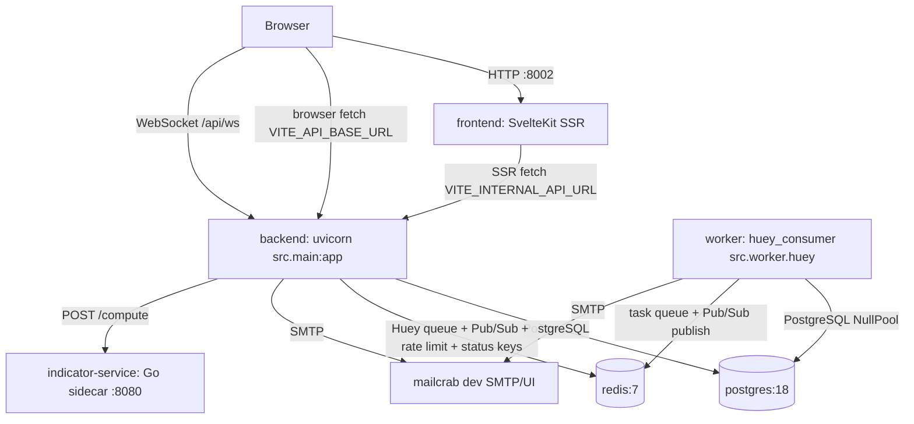
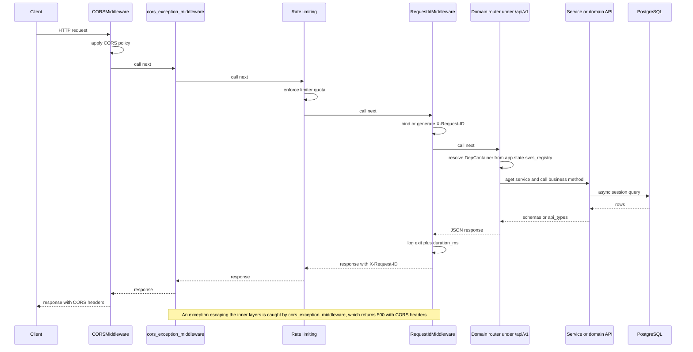

# Architecture Overview

`retail-portfolio` is a portfolio tracker for the retail investor. It runs as a small
set of cooperating containers: a FastAPI backend, a Huey worker process, a SvelteKit SSR
frontend, a stateless Go indicator sidecar, plus PostgreSQL, Redis and — in dev only —
mailcrab.

This page is the system-level map: which process owns what, how the app starts, how a
request flows, which layer rules hold the backend together, and which commands verify a
change. Per-domain detail lives in [Backend Domains](./domains.md); configuration and DI
seams in [Configuration](./configuration.md); the UI shell in
[Frontend Architecture](./frontend.md); the chart surface in [Charting](./charting.md)
and drawing/snapshot internals in
[Chart Drawings, Plugins & Rewind](./chart-drawings-and-rewind.md); the asynchronous
runtime in [Realtime, Background Jobs & the Worker](../workflows/realtime-and-background-jobs.md);
the per-user preference contract in [User Preferences](../concepts/user-preferences.md);
authentication in [Authentication & Authorization](./authentication.md); developer/CI
workflows in [Development, CI & Change Workflows](../operations/workflows.md) and
[Testing & Verification](../operations/testing.md).

## Processes and containers

`docker-compose.yml` is the supported way to run the stack (`docker compose up -d`, or
`just up` to inject the host Docker group id): the backend is then on
`http://localhost:8001` (interactive API docs at `/redoc`, ping at `/api/ping`) and the
frontend on `http://localhost:8002`. Every port is Compose-interpolated from the single
root `.env`, so ports are changed there rather than in the Compose file.



Container topology: the browser reaches the SvelteKit SSR app, which server-side-fetches
the backend over the Compose network; backend and worker share PostgreSQL and Redis; and
the backend is the only caller of the Go indicator sidecar. The sidecar publishes host
port `${INDICATOR_SERVICE_PORT:-8085}` for manual inspection, but no frontend code holds
its URL.

| Service | Role |
|---------|------|
| `backend` | FastAPI app served by `uvicorn src.main:app`; owns HTTP, WebSocket, migrations, rate limiting and error handling |
| `worker` | Huey consumer; dev command is `uv run -m watchfiles "huey_consumer src.worker.huey -w 2 --worker-type thread --periodic" src/` |
| `frontend` | SvelteKit dev server (`npm run dev`, container port 8100) in dev; the Node adapter build in prod |
| `indicator-service` | Stateless Go calculator exposed at `POST /compute` and `GET /health`; no auth, internal network only |
| `postgres` | Primary datastore (PostgreSQL 18) |
| `redis` | Huey task queue, WebSocket Pub/Sub fan-out, slowapi rate-limit storage, sync/2FA/denylist keys |
| `mailcrab` | Dev SMTP sink + web UI for outgoing email |

`docker-compose.prod.yml` keeps the same shape but is not a drop-in copy: it builds the
images (`build: .` for backend and worker, `build: ./frontend`), pins ports
(`8000:8000`, `80:3000`, `8085:8080`), drops the debug ports and **has no `mailcrab`
service**, and its worker command is `huey_consumer src.worker.huey -w 2 --worker-type
thread` — without `--periodic`, so Huey's periodic schedules only fire under the dev
Compose file. The root `Dockerfile` builds a `python:3.14-slim` image whose `CMD` runs
`uvicorn src.main:app --host 0.0.0.0 --port 8000 --workers 4
--timeout-graceful-shutdown 30` and whose `HEALTHCHECK` probes `/health/live`; each of
those four worker processes executes the lifespan, and therefore `alembic upgrade head`,
at startup.

The indicator sidecar is deliberately public-network-free: it exposes no authentication
and no rate limiting, so it must stay on the internal Docker network.

## Backend startup (lifespan)

`src/main.py` builds the `FastAPI` app with `lifespan=lifespan_context`. The lifespan is
the single place where process-scoped resources are created and torn down:

1. **Migrations.** Outside `test`, Alembic runs `command.upgrade(cfg, "head")` in a
   worker thread via `asyncio.to_thread(run_migrations)`, so schema upgrades happen
   before the first request is served. In `test`, tables come from
   `BaseModel.metadata.create_all` instead.
2. **Dependency registry.** A fresh `svcs.Registry()` is created, stored on
   `app.state.svcs_registry`, and populated by
   `register_services(registry, sessionmanager)` from `src/config/services.py`.
3. **WebSocket manager.** `ws_manager.init_redis(settings.redis_url)` opens the Redis
   client for the running event loop and starts the Pub/Sub listener task.
4. **Huey dashboard.** `init_worker_dashboard(...)` binds the Huey instance, a task
   database over `database_url` (creating its table), a Redis-backed
   `WebSocketManager` and signal handlers, all stored under `app.state.huey_dashboard`.

Inside the `async with registry:` block the lifespan yields
`{"svcs_registry": registry}`; teardown then calls `close_worker_dashboard`,
`ws_manager.close()` and `redis_manager.close()`. The lifespan body wraps its yield in a
`try/except` so a failure during yield is logged instead of silently killing shutdown.

In `dev`, the module also calls `debugpy.listen(("0.0.0.0", 5678))` at import time, which
is why Compose publishes a backend debug port. `app` is constructed with
`debug=settings.environment != "prod"`, and the module calls `init_logging()` (Rich
handlers in dev, JSON lines with `request_id` in prod) before the first request.

## Route mounting and entrypoints

**HTTP API routes live under `/api/v1`.** `src/main.py` builds one
`APIRouter(prefix="/api/v1")` and includes the domain routers into it:

```python
v1 = APIRouter(prefix="/api/v1")
v1.include_router(account_router)
v1.include_router(portfolio_router)
v1.include_router(auth_router)
v1.include_router(institutions_router)
v1.include_router(integration_router)
v1.include_router(market_router)

app.include_router(v1)
app.include_router(ws_router)
app.include_router(worker_dashboard_router)
```

Only the two extra routers and the ad-hoc endpoints sit outside that prefix. The full
top-level surface is:

| Path | Owner | Notes |
|------|-------|-------|
| `/api/v1/...` | `v1` router aggregating every domain router | e.g. `/api/v1/auth/*`, `/api/v1/accounts/*`, `/api/v1/market/*`, `/api/v1/integration/*`, `/api/v1/external/*` |
| `/api/ws` | `src/ws/router.py` | WebSocket endpoint, not under `/api/v1` |
| `/api/ping` | `src/main.py` | Simple DB-backed healthcheck |
| `/health/live` | `src/main.py` | Liveness probe used by the Compose and image healthchecks |
| `/health/ready` | `src/main.py` | Readiness probe: DB + Redis |
| `/worker/api/...` | `src/worker_dashboard/router.py` | Huey dashboard: `/worker/api/tasks` plus `/worker/api/updates` WebSocket |

Older documentation that describes routes as bare `/api` without the `/v1` segment is
wrong: domain routers themselves are prefix-less relative to that (for example
`auth_router` is `APIRouter(prefix="/auth")`, `account_router` is `/accounts`,
`market_router` is `/market`) and get their `/api/v1` prefix only here. The frontend
`apiClient` hard-codes the same `/api/v1` base.

Other process entrypoints: `src/worker.py` is the Huey consumer module, and
`src/commands/seed.py` / `src/commands/flush_market_data.py` are standalone CLI commands
for reference data and market-data maintenance.

## Request lifecycle

Every HTTP request passes through the middleware stack installed in `src/main.py`. The
registration order in source is `RequestIdMiddleware`, then `app.state.limiter` plus the
`RateLimitExceeded` handler, then `SlowAPIMiddleware`, then the two function middlewares
`reset_rate_limit_state_middleware` and `cors_exception_middleware`, and finally
`CORSMiddleware`. Starlette prepends each `add_middleware` call to the front of its user
middleware list and builds the stack so that the first entry is outermost — the
reverse-order rule, where the middleware registered last is the outermost — so the
effective inbound order is the reverse of registration: `CORSMiddleware`,
`cors_exception_middleware`, `reset_rate_limit_state_middleware`, `SlowAPIMiddleware`,
`RequestIdMiddleware`, then the router.

- `CORSMiddleware` — configured from comma-separated `cors_allow_origins`,
  `cors_allow_methods` and `cors_allow_headers`; outside `prod` it additionally allows
  `allow_origin_regex=r"https?://.*"`, with `allow_credentials=True`. Being outermost, it
  also short-circuits preflight requests before they reach the inner middleware.
- `cors_exception_middleware` — safety net that converts an escaping exception into a
  `500` JSON response and re-injects CORS headers manually. Sitting inside the CORS layer
  but outside the rate-limit and request-ID middleware, it is normally what turns an
  unmapped route exception into a `500` before the exception can reach the app-level
  `Exception` handler registered on the outermost Starlette error middleware.
- `reset_rate_limit_state_middleware` plus `SlowAPIMiddleware` — rate limiting backed by
  `src/config/limiter.py`, keyed by `user_or_ip_key_func` (the user id decoded from the
  `auth_token` cookie or `authorization` header, falling back to the remote address) with
  Redis storage outside `test` and `memory://` in tests; the shim deletes
  `request.state._rate_limiting_complete` so slowapi state does not leak between calls.
- `RequestIdMiddleware` (`src/core/middleware.py`) — reads or generates `X-Request-ID`,
  stores it on `request.state`, binds it into a contextvar for log correlation, echoes it
  back on the response, and logs one entry/exit line per request (4xx at `warning`,
  everything else at `info`) with `duration_ms`.



Request lifecycle from the CORS layers down through rate limiting and `X-Request-ID`
binding, then router resolution, service/repository work and the response back out — with
the CORS safety net catching anything that escapes.

### Handlers and responses

Route handlers receive the `svcs` container as a FastAPI dependency (`DepContainer`) and
resolve collaborators by interface:

```python
async def get_accounts(services: DepContainer) -> list[AccountRead]:
    api = await services.aget(AccountApi)
    ...
```

They declare Pydantic request/response models, enforce auth through the `current_user`
dependency, and delegate business logic to services or domain APIs. They never touch
another domain's repositories.

## Health and readiness

| Endpoint | Behavior |
|----------|----------|
| `/health/live` | Always `200 {"status": "alive"}`; used by the Compose and image healthchecks |
| `/health/ready` | Executes `select(1)` on a resolved `AsyncSession` **and** `PING`s Redis via `redis_manager.client()`; returns `200 {"status": "ready", ...}` when every check is `ok`, otherwise `503 {"status": "degraded", ...}` |
| `/api/ping` | Resolves a session and runs `select(1)`, returning `{"ping": "pong", "database": "ok" \| "error"}` — it reports DB failure in the body rather than failing the request |

The two kinds are deliberately distinct: liveness must not depend on downstream
services, readiness must. `tests/test_main.py` asserts both shapes, and `/api/ping`
returning `"pong"` is the smoke test the README points at.

## Dependencies and cross-domain calls

Dependency injection is centralized in `src/config/services.py`. Each domain exports a
`register_*_services(registry)` function (`src/core/registry.py`,
`src/account/registry.py`, `src/auth/__init__.py`, `src/integration/registry.py`,
`src/market/__init__.py`), and `register_services` always:

1. registers `AsyncSession` as a factory over `sessionmanager.session`;
2. registers core services (`EmailService`);
3. registers account and auth services unconditionally;
4. picks the stub or live registration set for the market and integration domains based
   on `settings.stub_external_api` (`register_integration_stub_services` /
   `register_market_stub_services` versus `register_integration_services` /
   `register_market_services`).

The same function is what the worker calls, so the API and the worker resolve the same
interfaces — only the session manager differs (see the realtime page). A new repository,
service or domain API becomes resolvable only once it is registered in its domain's
`register_*_services`.

Cross-domain access always goes through public domain APIs, never foreign repositories.
`PositionService` is the canonical orchestrator: it depends on its own
`PositionRepository` and on the market domain's `MarketPricesApi` / `SecurityApi` and
the integration domain's `IntegrationAccountApi`; the types crossing those boundaries
come from `api_types.py`.

## Backend layer rules

Each backend domain under `src/` follows the same shape (`model.py`, `schema.py`,
`api_types.py`, `repository.py`, `repository_sqlalchemy.py`, `repository_<other>.py`,
`api.py`, `service.py`, `router.py`, `enum.py`, `exception.py`). The rules that a change
must not break, from `src/AGENTS.md`:

- **Repositories always return schemas, never ORM models.** Models exist to generate
  migrations and are never returned to clients.
- **Cross-domain calls happen only through the other domain's `api.py` APIs and
  `api_types.py`.** A service must not import another domain's repository or schema.
  A router *may* use its own domain's repositories directly — the market watchlist,
  alert, note, document and snapshot routes do exactly that — but never a foreign
  domain's.
- **Routers own HTTP concerns; services do not raise `HTTPException`** (the
  authorization service is the documented exception). Domain errors inherit from
  `EntityNotFoundError` / `AuthorizationError` in `src/core/exception.py`, or are mapped
  explicitly in the router.
- **Services are registered as factories and resolved from the registry** — never
  instantiated by hand inside a request.
- **Editing a model requires an Alembic migration** following the
  `<hash>_<description>.py` naming convention, shipped in the same change.

Domains documented from this base: `account`, `auth`, `market`, `integration`, `ws`,
`core`, `config` — see [Backend Domains](./domains.md) for models, public APIs, services
and extension recipes.

## Realtime and background work (orientation)

Two cross-process mechanisms matter at the system level; both are documented in full on
[Realtime, Background Jobs & the Worker](../workflows/realtime-and-background-jobs.md).

- **The worker.** `src/worker.py` defines the Huey instance (`RedisHuey` everywhere
  except `test`, where it is `MemoryHuey`), builds its own `svcs` registry in
  `@huey.on_startup()` with a `NullPool` session manager, and imports the task modules
  (`src/account/task.py`, `src/integration/task.py`, `src/market/task.py`) at module
  bottom so their decorators register. Task bodies are synchronous Huey functions that
  bridge into async logic with `asyncio.run(...)` and re-bind the originating
  `request_id` into the log contextvar; their triggers, retries and cascade live on the
  realtime page.
- **The WebSocket fan-out.** `src/ws/manager.py` holds a process-global
  `ConnectionManager` with a per-`UserId` connection registry and one Redis client per
  event loop; publishers write to the `ws_messages` Pub/Sub channel and the main-loop
  listener delivers to local connections, so a Huey worker thread can push into the API
  process, with a local-broadcast fallback if Redis is unavailable. `/api/ws` accepts
  either a short-lived signed ticket (`POST /api/v1/auth/ws-ticket`, `salt="ws-ticket"`,
  `max_age=30`) or the `auth_token` cookie / `sec-websocket-protocol` token, and closes
  with code `1008` on failure or on a replayed ticket (`ws-ticket-used:<sha256>` Redis
  key with `nx=True, ex=30`). The worker dashboard mirrors the pattern at
  `/worker/api/updates`.

The Huey dashboard mounted at `/worker/api` is the operational window into task history:
its task routes carry `Depends(current_user)`, and its WebSocket reuses the ticket
helper.

## Error handling

`src/main.py` registers the global exception handlers that give the API one error
shape:

| Handler | Status | Body |
|---------|--------|------|
| `EntityNotFoundError` | `404` | `{"error": str(error)}` |
| `AuthorizationError` | `404` | `{"error": str(error)}` — existence is hidden from unauthorized callers |
| `RateLimitExceeded` | slowapi handler | slowapi's `_rate_limit_exceeded_handler` |
| `Exception` (catch-all) | `500` | `{"detail": "Internal Server Error", "error": ...}`, where `error` is the exception string outside `prod` and the literal `"Internal Error"` in `prod` |

Both `cors_exception_middleware` and the catch-all handler apply the same `prod`
redaction rule, and both log via `logger.exception`. Focused tests for this behavior are
`tests/test_main.py` (health, ping, handler logging and redaction) and
`tests/test_request_id.py` (header generation, preservation, log context, 4xx warning).

## Frontend

The frontend is a SvelteKit 2 / Svelte 5 Node SSR application
(`@sveltejs/adapter-node`) that talks to the backend exclusively through a typed client
layer over `/api/v1`.

| Concern | Location |
|---------|----------|
| Routes | `frontend/src/routes/` — `+page.server.ts` loads and form actions |
| API clients | `frontend/src/lib/api/` — one client per backend area over `apiClient` |
| Components | `frontend/src/lib/components/` — domain-grouped |
| Types | `frontend/src/lib/types/`, `frontend/src/lib/api/types/` |
| State | `*.svelte.ts` class modules using runes (`$state`/`$derived`/`$effect`) |
| SSR auth guard | `frontend/src/hooks.server.ts` — verifies the `auth_token` cookie and redirects |

Two base URLs matter: `VITE_INTERNAL_API_URL` (`http://backend:8000` in Compose) is used
for server-side loads, while `VITE_API_BASE_URL` is the browser-visible backend. The SSR
guard verifies JWTs with `JWT_SECRET`, which Compose derives from the backend's
`SECRET_KEY` so the two can never drift, and rejects any token whose `scope` is not
`access`.

See [Frontend Architecture](./frontend.md) for route, state and charting detail, and
[Authentication & Authorization](./authentication.md) for the token and 2FA flows.

## Verifying a change

The global constraints below apply to every change, not just backend ones:

- **Docker-only commands.** Run development commands inside the containers —
  `docker compose exec <backend|frontend> <command>`; the host is never the reference
  environment, and CI runs the same checks.
- **Use the agent harness.** `./scripts/agent-test` (shorthand `just test`) is the
  primary test entrypoint: Gate 0 (lint + type checker, halting before tests), Gate 1
  (a path argument, targeted and fail-fast) and Gate 2 (no argument, full regression
  with an Index/Traces summary). Raw `docker compose exec … pytest`/`vitest` is the
  fallback.
- **Model edits require a migration.** Editing a backend model means generating the
  Alembic revision named `<hash>_<description>.py` in the same change.
- **Tests never depend on external services.** No test may dial Redis, HTTP APIs
  (EODHD, broker APIs), SMTP or DNS; the ephemeral testcontainers PostgreSQL is the only
  allowed infrastructure dependency, and frontend tests mock every API client. A test
  that makes a real network call is broken by definition.

CI (`.github/workflows/ci.yml`) mirrors this in three jobs: backend
(`uv run ty check`, `uv run ruff check` + `uv run ruff format --check`, `uv run pytest`),
frontend (`npm run check`, `npm run lint`, `npm run test:run` with the `VITE_*` and
`JWT_SECRET` variables set but no backend running) and indicator-service
(`go vet ./...`, `go build ./...`, `go test ./...`).

## Relationship to the other pages

- [Configuration](./configuration.md) — the single root `.env`, `Settings`, registry
  seams, database/Redis managers, logging and rate limiting.
- [Backend Domains](./domains.md) — per-domain models, APIs, services, routers.
- [Frontend Architecture](./frontend.md) — shell, routes, clients and SSR rules.
- [Charting](./charting.md) — chart surface, panes, indicators, price alerts.
- [Chart Drawings, Plugins & Rewind](./chart-drawings-and-rewind.md) — drawing plugins,
  drawing persistence and the snapshot/rewind pipeline.
- [Realtime, Background Jobs & the Worker](../workflows/realtime-and-background-jobs.md)
  — task semantics, the price-update cascade, Pub/Sub fan-out, sync-status keys.
- [User Preferences](../concepts/user-preferences.md) — the per-user preferences column
  and its read/write matrix.
- [Authentication & Authorization](./authentication.md) — token, 2FA and passkey flows.
- [External Services & Adapters](../integrations/external-services.md) — EODHD,
  Wealthsimple, the AI endpoint, SMTP, Redis and the indicator sidecar.
- [Development, CI & Change Workflows](../operations/workflows.md) and
  [Testing & Verification](../operations/testing.md).
- [Quickstart](../quickstart.md) — the short onboarding path through these pages.
