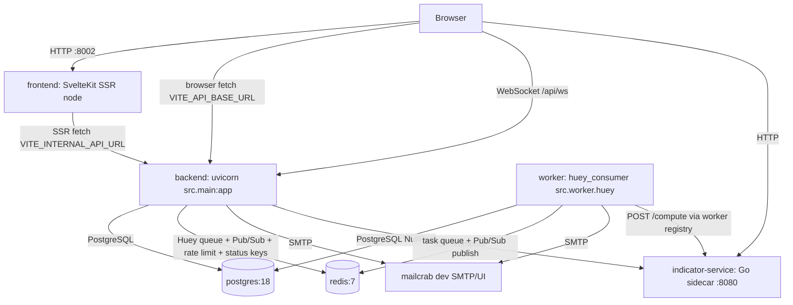
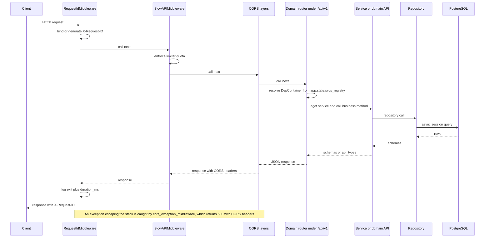

# Architecture Overview

`retail-portfolio` is a portfolio tracker for the retail investor. It runs as a small
set of cooperating containers: a FastAPI backend, a Huey worker process, a SvelteKit SSR
frontend, a stateless Go indicator sidecar, plus PostgreSQL, Redis and mailcrab.

This page is the system-level map: which process owns what, how the app starts, how a
request flows, and which layer rules hold the backend together. Per-domain detail lives
in [Backend Domains](./domains.md); configuration and DI seams in
[Configuration](./configuration.md); the UI in [Frontend Architecture](./frontend.md)
and [Charting](./charting.md); authentication in
[Authentication & Authorization](./authentication.md); developer/CI workflows in
[Workflows](../operations/workflows.md) and [Testing](../operations/testing.md).

## Processes and containers

`docker-compose.yml` is the supported way to run the stack (`docker compose up -d`);
the backend and frontend are then available on `http://localhost:8001` and
`http://localhost:8002`, with interactive API docs at
`http://localhost:8001/redoc`. A production compose file swaps the dev commands for
built images and fixed ports, but keeps the same service topology.



Container topology: the browser reaches the SvelteKit SSR app, which server-side-fetches
the backend over the Compose network; backend and worker share PostgreSQL and Redis, and
both can call the Go indicator sidecar.

| Service | Role |
|---------|------|
| `backend` | FastAPI app served by `uvicorn src.main:app`; owns HTTP, WebSocket, migrations, rate limiting and error handling |
| `worker` | `huey_consumer src.worker.huey -w 2 --worker-type thread --periodic`; runs background and periodic tasks |
| `frontend` | SvelteKit SSR dev server / Node adapter build; talks to the backend over `/api/v1` |
| `indicator-service` | Stateless Go calculator exposed at `POST /compute` and `GET /health`; no auth, internal network only |
| `postgres` | Primary datastore (PostgreSQL 18) |
| `redis` | Huey task queue, WebSocket Pub/Sub fan-out, slowapi rate-limit storage, sync/2FA/denylist keys |
| `mailcrab` | Dev SMTP sink + web UI for outgoing email |

The indicator sidecar is deliberately public-network-free: it exposes no authentication
and no rate limiting, so it must stay on the internal Docker network.

## Backend startup (lifespan)

`src/main.py` builds the `FastAPI` app with `lifespan=lifespan_context`. The lifespan is
the single place where process-scoped resources are created and torn down:

1. **Migrations.** Outside `test`, Alembic runs `command.upgrade(cfg, "head")` in a
   worker thread via `asyncio.to_thread(run_migrations)`, so schema upgrades happen
   before the first request is served. In `test`, tables come from
   `BaseModel.metadata.create_all` instead.
2. **Dependency registry.** A fresh `svcs.Registry()` is created, stored on
   `app.state.svcs_registry`, and populated by
   `register_services(registry, sessionmanager)` from `src/config/services.py`.
3. **WebSocket manager.** `ws_manager.init_redis(settings.redis_url)` opens the Redis
   client for the running event loop and starts the Pub/Sub listener task.
4. **Huey dashboard.** `init_worker_dashboard(...)` binds the Huey instance, a task
   database over `database_url` (creating its table), a Redis-backed
   `WebSocketManager` and signal handlers, all stored under `app.state.huey_dashboard`.

Inside the `async with registry:` block the lifespan yields
`{"svcs_registry": registry}`; teardown then calls `close_worker_dashboard`,
`ws_manager.close()` and `redis_manager.close()`. In `dev`, the module also calls
`debugpy.listen(("0.0.0.0", 5678))` at import time, which is why Compose publishes a
backend debug port.

`app` is constructed with `debug=settings.environment != "prod"` and the module calls
`init_logging()` (Rich handlers in dev, JSON lines with `request_id` in prod) before the
first request.

## Route mounting and entrypoints

**HTTP API routes live under `/api/v1`.** `src/main.py` builds one
`APIRouter(prefix="/api/v1")` and includes the domain routers into it:

```python
v1 = APIRouter(prefix="/api/v1")
v1.include_router(account_router)
v1.include_router(portfolio_router)
v1.include_router(auth_router)
v1.include_router(institutions_router)
v1.include_router(integration_router)
v1.include_router(market_router)

app.include_router(v1)
app.include_router(ws_router)
app.include_router(worker_dashboard_router)
```

Only the two extra routers and the ad-hoc endpoints sit outside that prefix. The full
top-level surface is:

| Path | Owner | Notes |
|------|-------|-------|
| `/api/v1/...` | `v1` router aggregating every domain router | e.g. `/api/v1/auth/*`, `/api/v1/accounts/*`, `/api/v1/securities/*` |
| `/api/ws` | `src/ws/router.py` | WebSocket endpoint, not under `/api/v1` |
| `/api/ping` | `src/main.py` | Simple DB-backed healthcheck |
| `/health/live` | `src/main.py` | Liveness probe used by the Compose healthcheck |
| `/health/ready` | `src/main.py` | Readiness probe: DB + Redis |
| `/worker/api/...` | `src/worker_dashboard/router.py` | Huey dashboard: `/worker/api/tasks` plus `/worker/api/updates` WebSocket |

Older documentation that describes routes as bare `/api` without the `/v1` segment is
wrong: domain routers themselves are prefix-less (e.g. `auth_router` is
`APIRouter(prefix="/auth")`) and get their `/api/v1` prefix only here. The frontend
`apiClient` hard-codes the same `/api/v1` base.

Other process entrypoints: `src/worker.py` is the Huey consumer module, and
`src/commands/seed.py` is a standalone CLI seed command for reference data and dev
fixtures.

## Request lifecycle

Every HTTP request passes through the middleware stack installed in `src/main.py`
(Starlette applies middleware in reverse order of `add_middleware`, so
`RequestIdMiddleware` is outermost and wraps the CORS layers):

- `RequestIdMiddleware` (`src/core/middleware.py`) — reads or generates `X-Request-ID`,
  stores it on `request.state`, binds it into a contextvar for log correlation, echoes
  it back on the response, and logs one entry/exit line per request (4xx at `warning`,
  everything else at `info`) with `duration_ms`.
- `SlowAPIMiddleware` plus the `reset_rate_limit_state_middleware` shim — rate limiting
  backed by `src/config/limiter.py`, keyed by user id decoded from the `auth_token`
  cookie (or `authorization` header) with an IP fallback, using Redis storage outside
  `test` (`memory://` in tests).
- `cors_exception_middleware` — safety net that converts an escaping exception into a
  `500` JSON response and re-injects CORS headers manually.
- `CORSMiddleware` — configured from comma-separated `cors_allow_origins`,
  `cors_allow_methods` and `cors_allow_headers`; outside `prod` it additionally allows
  `allow_origin_regex=r"https?://.*"`, with `allow_credentials=True`.



Request lifecycle from `X-Request-ID` binding through rate limiting, router resolution,
service/repository work and the response back out — with the CORS safety net catching
anything that escapes.

### Handlers and responses

Route handlers receive the `svcs` container as a FastAPI dependency (`DepContainer`) and
resolve collaborators by interface:

```python
async def get_accounts(services: DepContainer) -> list[AccountRead]:
    api = await services.aget(AccountApi)
    ...
```

They declare Pydantic request/response models, enforce auth through the `current_user`
dependency, and delegate business logic to services or domain APIs. They never touch
another domain's repositories.

## Health and readiness

| Endpoint | Behavior |
|----------|----------|
| `/health/live` | Always `200 {"status": "alive"}`; used by the Compose healthcheck |
| `/health/ready` | Executes `select(1)` on a resolved `AsyncSession` **and** `PING`s Redis via `redis_manager.client()`; returns `200 {"status": "ready", ...}` when every check is `ok`, otherwise `503 {"status": "degraded", ...}` |
| `/api/ping` | Resolves a session and runs `select(1)`, returning `{"ping": "pong", "database": "ok" \| "error"}` — it reports DB failure in the body rather than failing the request |

The two kinds are deliberately distinct: liveness must not depend on downstream
services, readiness must. `tests/test_main.py` asserts both shapes, and
`/api/ping` returning `"pong"` is the smoke test the README points at.

## Dependencies and cross-domain calls

Dependency injection is centralized in `src/config/services.py`. Each domain exports a
`register_*_services(registry)` function (`src/core/registry.py`,
`src/account/registry.py`, `src/auth/__init__.py`, `src/integration/registry.py`,
`src/market/__init__.py`), and `register_services` always:

1. registers `AsyncSession` as a factory over `sessionmanager.session`;
2. registers core services (`EmailService`);
3. registers account and auth services unconditionally;
4. picks the stub or live registration set for the market and integration domains based
   on `settings.stub_external_api` (`register_integration_stub_services` /
   `register_market_stub_services` versus `register_integration_services` /
   `register_market_services`).

The worker follows the same wiring but builds its own registry in
`setup_worker_services` (`@huey.on_startup()`), with a `DatabaseSessionManager`
constructed with `poolclass=NullPool` to avoid "operation in progress" errors across
`asyncio.run()` task cycles, and stores it on `huey.svcs_registry`. Tasks resolve
services through `svcs.Container(huey.svcs_registry)`.

Cross-domain access always goes through public domain APIs, never foreign repositories.
`PositionService` is the canonical orchestrator: it depends on its own
`PositionRepository` and on the market domain's `MarketPricesApi` / `SecurityApi` and
the integration domain's `IntegrationAccountApi`; the types crossing those boundaries
come from `api_types.py`.

## Backend layer rules

Each backend domain under `src/` follows the same shape (`model.py`, `schema.py`,
`api_types.py`, `repository.py`, `repository_sqlalchemy.py`, `repository_<other>.py`,
`api.py`, `service.py`, `router.py`, `enum.py`, `exception.py`). The rules that a change
must not break, from `src/AGENTS.md`:

- **Repositories always return schemas, never ORM models.** Models exist to generate
  migrations and are never returned to clients.
- **Cross-domain calls happen only through the other domain's `api.py` APIs and
  `api_types.py`.** A service must not import another domain's repository or schema.
- **Routers own HTTP concerns; services do not raise `HTTPException`** (the
  authorization service is the documented exception). Domain errors inherit from
  `EntityNotFoundError` / `AuthorizationError` in `src/core/exception.py`, or are mapped
  explicitly in the router.
- **Services are registered as factories and resolved from the registry** — never
  instantiated by hand inside a request.
- **Editing a model requires an Alembic migration** following the
  `<hash>_<description>.py` naming convention.

Domains documented from this base: `account`, `auth`, `market`, `integration`, `ws`,
`core`, `config` — see [Backend Domains](./domains.md) for models, public APIs, services
and extension recipes.

## WebSockets

`src/ws/manager.py` holds a process-global `ConnectionManager` singleton with
`active_connections: dict[UserId, list[WebSocket]]` keyed per user. Messages are
published to the Redis Pub/Sub channel `ws_messages`; the main-loop listener task
(`_listen_for_messages`) receives them and delivers to local connections. A publishing
call from a worker thread lazily initializes a Redis client for *that* event loop
(`_clients: dict[AbstractEventLoop, Redis]`), which is what lets Huey worker threads
broadcast into the API process. If Redis is unavailable, `send_personal_message` falls
back to local broadcast instead of raising, and the listener restarts itself after a
delay if it dies.

`/api/ws` (`src/ws/router.py`) accepts either a short-lived signed ticket (query param
`ticket`, produced by `POST /api/v1/auth/ws-ticket`, a `URLSafeTimedSerializer` payload
with `max_age=30` and `salt="ws-ticket"`) or a session token from the `auth_token`
cookie / `sec-websocket-protocol` header resolved through `UserApi`. Tickets are
single-use: `_check_ticket_not_replayed` sets a `ws-ticket-used:<sha256>` Redis key with
`nx=True, ex=30` and closes with code `1008` on replay. Event payload schemas and the
`WsEventType` enum live in `src/ws/api_types.py`.

The worker dashboard mirrors this pattern at `/worker/api/updates`, reusing the same
ticket helper and the dashboard package's own `WebSocketManager`.

## Background work

The Huey consumer (`src/worker.py`) uses `RedisHuey` in every environment except `test`,
where it uses `MemoryHuey` — task modules can therefore be imported without a broker in
tests. Task modules are imported at the bottom of `src/worker.py` precisely so their
decorators register: `src/account/task.py`, `src/integration/task.py`,
`src/market/task.py`.

- `src/integration/task.py` syncs broker positions and emits WebSocket sync-progress
  events.
- `src/market/task.py` owns `generate_note_title_task` and the periodic
  `daily_price_update` (`crontab(hour="0", minute="0")`).
- `src/account/task.py` exposes `recalculate_all_account_totals_task`, which recalculates
  account totals and pushes `AccountTotalsUpdatedMessage` per user.

Tasks bridge sync Huey and async business logic with `asyncio.run(...)`, re-bind the
originating `request_id` into the contextvar so worker logs stay correlatable with the
request that enqueued them, and tolerate missing services (`if huey.svcs_registry is
None: return`). The dashboard mounted at `/worker/api` (Huey task list authenticated by
`current_user`) is how task history is inspected.

## Error handling

`src/main.py` registers the global exception handlers that give the API one error
shape:

| Handler | Status | Body |
|---------|--------|------|
| `EntityNotFoundError` | `404` | `{"error": str(error)}` |
| `AuthorizationError` | `404` | `{"error": str(error)}` — existence is hidden from unauthorized callers |
| `RateLimitExceeded` | slowapi handler | slowapi's `_rate_limit_exceeded_handler` |
| `Exception` (catch-all) | `500` | `{"detail": "Internal Server Error", "error": ...}`, where `error` is the exception string outside `prod` and the literal `"Internal Error"` in `prod` |

Both `cors_exception_middleware` and the catch-all handler apply the same
`prod` redaction rule, and both log via `logger.exception`. `src/main.py` also wraps the
lifespan body in `try/except` so a failure during yield is logged rather than silently
killing shutdown.

Focused tests for this behavior are `tests/test_main.py` (health, ping, handler logging
and redaction) and `tests/test_request_id.py` (header generation, preservation, log
context, 4xx warning).

## Frontend

The frontend is a SvelteKit 2 / Svelte 5 Node SSR application
(`@sveltejs/adapter-node`) that talks to the backend exclusively through a typed client
layer over `/api/v1`.

| Concern | Location |
|---------|----------|
| Routes | `frontend/src/routes/` — `+page.server.ts` loads and form actions |
| API clients | `frontend/src/lib/api/` — one client per backend area over `apiClient` |
| Components | `frontend/src/lib/components/` — domain-grouped |
| Types | `frontend/src/lib/types/`, `frontend/src/lib/api/types/` |
| State | `*.svelte.ts` class modules using runes (`$state`/`$derived`/`$effect`) |
| SSR auth guard | `frontend/src/hooks.server.ts` — verifies the `auth_token` cookie and redirects |

Two base URLs matter: `VITE_INTERNAL_API_URL` (`http://backend:8000` in Compose) is used
for server-side loads, while `VITE_API_BASE_URL` is the browser-visible backend. The SSR
guard verifies JWTs with `JWT_SECRET`, which Compose derives from the backend's
`SECRET_KEY` so the two can never drift.

See [Frontend Architecture](./frontend.md) for route, state and charting detail, and
[Authentication & Authorization](./authentication.md) for the token and 2FA flows.

## Relationship to the other pages

- [Configuration](./configuration.md) — the single root `.env`, `Settings`, registry
  seams, database/Redis managers, logging and rate limiting.
- [Backend Domains](./domains.md) — per-domain models, APIs, services, routers.
- [Frontend Architecture](./frontend.md) and [Charting](./charting.md).
- [Authentication & Authorization](./authentication.md) — token, 2FA and passkey flows.
- [Workflows](../operations/workflows.md) and [Testing](../operations/testing.md).
- [Quickstart](../quickstart.md) — the short onboarding path through these pages.
