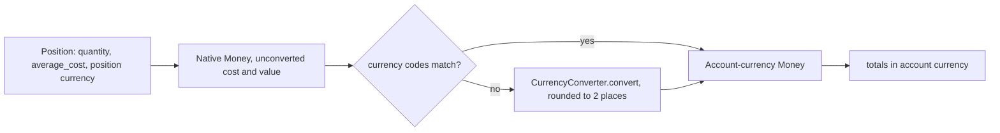
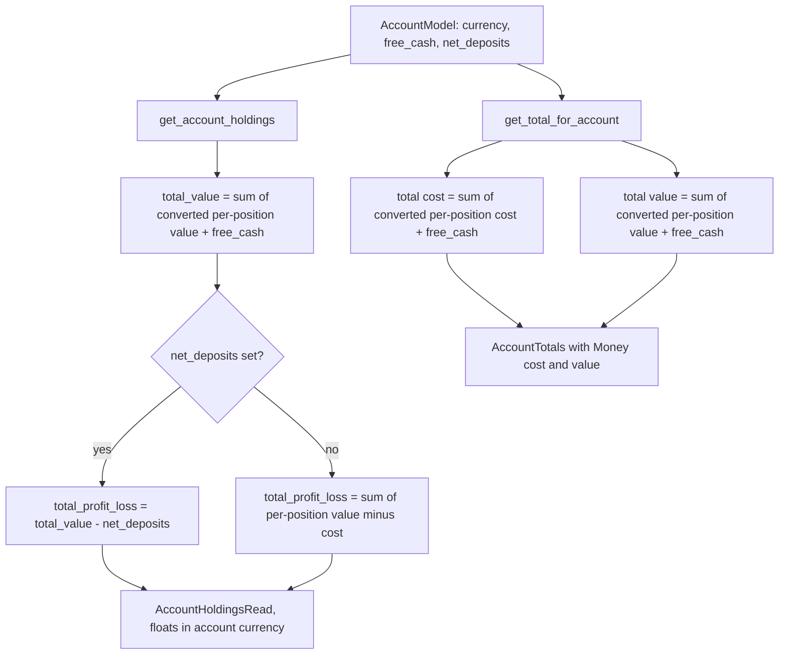

# Money & Currency Handling

Money is the one model that every account, holding, total, P&L, CSV row, and
frontend currency label depends on. There is no single `Money` module to change:
the contract is spread across backend Pydantic API types, the position service
that does the arithmetic, the database column types, and two frontend helpers.
This page records that contract and the failure modes a careless edit introduces.
Domain-specific endpoints belong to [Domains](../architecture/domains.md) and the
[Broker sync](../workflows/broker-sync.md) / [CSV import](../workflows/csv-import.md)
workflows; this page covers the shared money semantics only.

## Two layers of representation

The backend deliberately keeps two representations with different jobs.

- **Raw numbers are `Decimal`.** Prices (`Price.close`, `open`, `high`, `low`,
  `adjusted_close`) are `Decimal` in `src/market/api_types.py`; position
  `quantity` and `average_cost` are `Decimal` in `src/account/api_types.py` and
  `src/account/schema.py`. This is what preserves precision through parsing and
  intermediate math.
- **Currency-tagged amounts are `stockholm.Money`.** Whenever an amount carries a
  currency, it is a `Money` value: `AccountTotals.cost`/`.value` in
  `src/account/api_types.py`, `MarketPricesApi.get_latest_close`'s `Money | None`
  return type in `src/market/api.py`, and `Account.currency` / `Security.currency`,
  which are `stockholm.Currency` rather than plain strings.

`Account.currency` and `Security.currency` are `Currency` because currency
validity is checked at the boundary (broker payloads, CSV import, EODHD search
results) rather than being re-validated in every calculation. The schema layer
adds a `@field_serializer("currency")` on `AccountSchema` that emits the currency
code as a plain string, so serialized API output carries `"CAD"`, not a `Currency`
object.

**JSON shape.** A `Money` does *not* serialize to `units`/`nanos` on the wire. It
serializes to a single string field:

```json
{ "cost": { "value": "500.00 USD" }, "value": { "value": "650.00 USD" } }
```

This shape is asserted in `tests/tasks/test_account.py` and
`tests/routers/test_accounts.py` (the latter only asserts the ` CAD` suffix).
Anyone who assumes a structured `{ units, nanos, currencyCode }` payload from the
backend is working from the frontend type, not from what the API emits.

## Where conversion happens

Exactly one place converts currency: `PositionService._currency_convert` in
`src/account/service/position.py`. It short-circuits when the source and target
currency codes already match, otherwise it calls
`self._fx_rates.convert(amount=..., currency=..., new_currency=...)` and re-wraps
the result as `Money(converted, to_currency)`.

The converter instance is constructed once, in `position_service_factory`
(`fx_rates=CurrencyConverter()`), and injected into the service. `CurrencyConverter`
is a process-wide singleton-ish object holding a rate cache; it is not a
per-request or per-user setting. Any test that builds a `PositionService` by hand
must pass an `fx_rates` of its own — `tests/services/test_position_service.py`
passes a real `CurrencyConverter()` while other unit tests pass `AsyncMock()` for
the collaborators whose code paths are never reached.

Conversion is applied at the *aggregation* boundary, not to stored values:

```
position (native security/position currency)
  ├─ unconverted cost/value/P&L      ← used as-is for the "native" UI columns
  └─ _currency_convert(..., account.currency)
        └─ accumulated into total cost / total value / total P&L
```

A small flowchart of that boundary:



*Where currency conversion happens: per position, before any accumulation.*

Two consequences matter. First, stored positions never have their `average_cost`
rewritten by FX; `PositionModel.average_cost` and `currency` are whatever the
broker/CSV supplied. Second, the *same* logical amount can be reported twice in
different currencies — `HoldingRead` carries both a native pair in
`security_currency` (`unconverted_total_value`, `latest_price`, `average_cost`,
`unconverted_profit_loss`) and a converted pair in `currency`, which is the
account currency (`total_value`, `profit_loss`, `converted_average_cost`,
`converted_latest_price`). The two frontend holdings tables then disagree about
which side is prominent — see below.

Because the conversion target is the account's own `currency`, changing an
account's currency re-bases every converted figure for that account without
touching a single stored position. CSV import is one path that can do this:
`src/account/service/csv_account.py` updates an existing account's currency when
a different `chosen_currency` is supplied, and creates new accounts with
`currency=Currency(chosen_currency)`, defaulting to `CAD`.

## The totals and holdings shape

`get_total_for_account(account_id, currency)` returns `AccountTotals(cost, value)`
where `cost` is the sum of `quantity × average_cost` across positions and `value`
is the sum of `quantity × latest close`. Both are converted per position before
accumulating, so the accumulator never mixes currencies. Since the
free-cash change, `account.free_cash` is *also* added to both `cost` and `value`
(the same cash amount is counted on both sides, so it cancels out of
cost-versus-value P&L). This is the type served by `GET /accounts/{account_id}/totals`
— which passes `account.currency` as the target — and pushed over WebSocket as
`AccountTotalsUpdatedMessage` by the `recalculate_all_account_totals_task` Huey
task in `src/account/task.py`.

`_calculate_holdings` and `_calculate_holding` produce the richer per-row shape:
quantity, average cost, native and converted value/price/P&L, latest price and
its date. `get_account_holdings` adds `account.free_cash` to `total_value`, then
overrides `total_profit_loss` when `account.net_deposits` is set:
`total_profit_loss = total_value - net_deposits`, with the percentage only
reported when `net_deposits` is non-zero. That is a **cash-flow P&L**, distinct
from the per-holding `profit_loss` (value minus cost basis) — see the
cost-versus-value note below.

Note the `get_holdings_by_security` path computes a *different* total: it takes
`MarketPricesApi.get_latest_close` directly, multiplies by quantity, rounds to 2
places, converts, and divides by the account total to get `account_percentage`.
The account-total divisor there comes from `get_total_for_account(...).value.amount`,
so the numerator and denominator are both in account currency — but only because
`holding_money` is converted first. The repository layer returns these rows with
`total_value=0.0` and `currency=""` placeholders, so any consumer that bypasses
the service sees unusable money fields.

### Where `free_cash` and `net_deposits` enter the flow



*How cash balances and deposits change each aggregate before it reaches the API.*

## Frontend money helpers

`frontend/src/lib/types/money.ts` defines the shape the UI actually sees:

```ts
export interface Money {
  value?: string;
  units?: number;
  nanos?: number;
  currencyCode?: string;
}
```

`moneyToNumber` prefers `units + nanos / 1e9` when `units` is a number, and falls
back to `parseFloat(value) || 0` otherwise; null/undefined/empty input yields `0`.
Behavior is pinned in `money.test.ts`, including that `units` wins when both are
present and that unparseable strings yield `0`.

**The `units`/`nanos` branch is effectively dead against the current backend.**
Because the API emits `{"value": "500.00 CAD"}` with no `units`, every real
response goes through the string fallback, where `parseFloat("500.00 CAD")`
returns `500` only because `parseFloat` stops at the first non-numeric character.
This works by accident, not by design. Two failure modes follow:

- If the backend ever emitted a `value` string with a leading currency symbol or a
  non-`en`-style grouping separator, `parseFloat` would silently return a wrong
  number or `0`.
- If a `units`-based serializer is introduced but `nanos` are omitted for
  fractional cents, amounts shift by up to `999_999_999`/`1e9` relative to the
  string — a change that only shows up in tests that exercise both branches.

`money(m)` renders `$${amount.toLocaleString()}` — a bare `$` with no currency
code and no fixed decimals, so it is only safe for display where the currency is
already shown separately. `accounts-list-item.svelte` extracts `totals.value` and
`totals.cost` with `moneyToNumber`, derives `profitLoss = val - cost` and
`returnPercent = profitLoss / cost * 100` (guarded to `null` when `cost <= 0`),
and hands them to `TotalProfitLossButtons` along with `account.currency`. Both
holdings tables deliberately use `Intl.NumberFormat` with an explicit currency
instead, because a holdings table shows securities in several currencies at once.

### Two holdings tables, two display conventions

- `frontend/src/lib/components/holdings/holdings-table.svelte` (the user-wide
  `/holdings` table) shows the **converted** total as the primary line and prints
  `unconverted_total_value` in `security_currency` as a small secondary line when
  `security_currency !== currency`. It also recomputes `percent_of_total` and
  `percent_of_account` client-side from `total_value`, and buckets portfolio
  totals per currency rather than summing across them.
- `frontend/src/lib/components/accounts/holdings-table.svelte` (the account-scoped
  table) does the **opposite**: `unconverted_total_value` is the primary large
  number and the account-currency `total_value` is the small secondary line. It
  also computes its own per-row share as
  `(holding.total_value / totalAccountValue) * 100` and a P&L percentage as
  `profit_loss / (quantity * converted_average_cost) * 100`.

Both conventions are internally consistent, but changing a field's meaning in
`HoldingRead` will surface differently in each table, and anyone comparing the two
views will see the same amounts labelled with different prominence.

The `/holdings` route (`frontend/src/routes/holdings/+page.svelte`) encodes the
"never sum across currencies" rule in `currencyTotals`: rows are bucketed by
`row.currency`, and each bucket sums `total_value`, `profit_loss`, and a cost basis
of `quantity * (converted_average_cost ?? average_cost ?? 0)`. That fallback chain
means a row with a missing `converted_average_cost` silently contributes a native-
currency cost basis to the bucket, which is why the bucket key (not the cost field)
is what keeps the totals sane.

## Average cost and holdings math

`blendedAverageCost(holdings)` in `frontend/src/lib/utils/finance/average-cost.ts`
is the quantity-weighted mean of `average_cost` across holdings, returning `0`
for an empty list, zero total quantity, or all-missing costs (missing
`average_cost` is treated as `0`). Because it treats missing costs as zero, a
holding with unknown cost drags the blended figure toward zero rather than being
excluded — `average-cost.test.ts` pins the empty and zero-quantity cases.

`frontend/src/lib/utils/finance/holdings-metrics.ts` supplies the period
math that P&L display leans on. `getBenchmarkPrice` returns `averageCost` for
`period === 'ALL'` (cost basis as the baseline) and otherwise the close of the
most recent candle at or before the period cutoff, falling back to the earliest
candle. `calculateHoldingGain` returns `{ gainAmount, gainPercent }` where
`gainAmount = (currentPrice - benchmarkPrice) * quantity` and
`gainPercent = priceDiff / benchmarkPrice * 100` (guarded to `0` when the
benchmark is `0`). `calculatePercentOfTotal` and `calculatePercentOfAccount` both
return `0` rather than `Infinity`/`NaN` when the divisor is `<= 0` or either
operand is non-finite, and `formatHoldingPercent` renders one decimal or `-`.
All of this runs on JS `number`, not the backend `Decimal` values, so any
comparison of frontend-computed P&L against backend `profit_loss` must expect the
usual float-rounding drift.

## Precision and storage

Where the two representations meet, precision is lost on purpose at defined
boundaries:

- **Position storage.** `PositionModel.quantity` is `DECIMAL(16, 8)` in
  `src/account/model.py` (8 fractional digits, enough for fractional shares),
  but `PositionModel.average_cost` is declared `Mapped[Decimal | None]` over a
  `Float` column. Anything with more digits than an IEEE-754 double can hold —
  for example a CSV-derived cost average with many decimals — is already
  approximate once it round-trips through the database.
- **Account storage.** `AccountModel.currency` is a plain `String` while the API
  type is `Currency`; `AccountModel.net_deposits` is `Float` (typed
  `Mapped[Decimal | None]`), and `AccountModel.free_cash` is `Float` with a `0.0`
  server default, so cash-flow P&L inherits float error.
- **Aggregation rounding.** `_currency_convert` rounds each converted amount to 2
  decimal places *before* accumulation, so totals are sums of rounded
  per-position values rather than the rounded sum of exact values. Changing that
  rounding (or removing it) changes reported totals for multi-position accounts
  even when nothing else moves — but the conversion short-circuit for matching
  currency codes means the rounding only bites on rows that actually need FX.
- **CSV parsing.** `src/account/csv/parser.py` parses quantities as `Decimal`
  after stripping `,`, and book values after stripping `,` and `$`, and computes
  `(book_value / quantity).quantize(Decimal("0.0001"), rounding=ROUND_HALF_UP)`
  in `calculate_average_cost`, returning `None` for non-positive quantity or
  missing book value. Changing that quantize step changes every CSV-imported
  `average_cost` and therefore every cost-basis P&L downstream. Position currency
  resolution there is a fallback chain:
  `currency` → `book_value_currency_market` → `book_value_currency_cad` →
  account currency, so a row-level currency override always wins.

## Failure modes a change can introduce

- **Mixed currencies in an aggregate.** Any new code that sums `Money` across
  positions without routing each operand through `_currency_convert` produces a
  total whose `currency_code` is whichever operand came first (or raises in
  `stockholm`). The file that must change is
  `src/account/service/position.py` — every existing accumulation site
  (`get_total_for_account`, `_calculate_holdings`, `_calculate_holding`,
  `get_holdings_by_security`) converts before adding, and a new aggregation must
  do the same.
- **Float contamination.** Converting `Decimal` prices or costs to JS-visible
  `float` inside the service (as `_calculate_holding` does at the `HoldingRead`
  boundary, and as the repository does when it casts `average_cost`) is fine for
  display but spreads into anything computed from `HoldingRead` —
  `total_profit_loss_percent`, `account_percentage`, and the frontend metrics.
  Adding float math *before* conversion in `src/account/service/position.py`
  would widen the error.
- **`nanos`/`units` mismatch.** As above: whichever side switches to a structured
  integer money shape must update both the backend serializer and
  `frontend/src/lib/types/money.ts` together, or `parseFloat` silently keeps
  working on a `value` field that no longer exists (returning `0`).
- **Cost-versus-value confusion.** `AccountTotals.cost` is *cost basis*
  (quantity × average cost plus free cash) and `.value` is *market value*
  (quantity × latest close plus free cash); their difference is unrealized P&L.
  `total_profit_loss` on `AccountHoldingsRead` is a third thing when
  `net_deposits` is set — total value minus deposits. The frontend labels all
  three near each other (`accounts-list-item.svelte` derives profit/loss from the
  `totals` pair; `holdings-table.svelte` shows `profit_loss` per row). Swapping
  cost and value, or mixing the cash-flow P&L with the per-holding P&L, is not a
  cosmetic bug — it changes the number users would act on.
- **Cash double-counting.** `free_cash` is added to `AccountTotals.cost` *and*
  `.value`, and separately to `AccountHoldingsRead.total_value`. Any new
  aggregate that also reads a cash field (or that reuses `free_cash` in a P&L
  formula after the `net_deposits` override) can count the same cash twice. The
  tests `test_get_total_for_account_includes_free_cash` and
  `test_get_account_holdings_includes_free_cash` pin the current intended
  arithmetic.

## Testing the money contract

The focused tests that pin this behavior are:

- `frontend/src/lib/types/money.test.ts` — `moneyToNumber` null/empty handling,
  `units` + `nanos`, negative values, string fallback, `units`-over-`value`
  precedence, and `money()` formatting.
- `frontend/src/lib/utils/finance/average-cost.test.ts` — empty list, single
  holding, weighted blend, zero total quantity, missing `average_cost`.
- `tests/services/test_position_service.py` — user-holdings grouping, free-cash
  inclusion in totals and holdings, and the CAD account / USD security currency
  mismatch case that verifies no `CurrencyMismatchError` is raised.
- `tests/account/csv/test_parser.py::test_average_cost_calculation` — the
  `book_value / quantity` quantize to `0.0001` and its `None`/zero edge cases.
- `tests/routers/test_accounts.py::test_account_totals_success` — asserts the
  `value` string ends with ` CAD`, i.e. that `Money` serializes to a
  currency-tagged string.
- `tests/tasks/test_account.py` — asserts the WebSocket payload contains
  `totals.cost.value == "500.00 USD"` and `totals.value.value == "650.00 USD"`.
- `tests/services/test_csv_account_service.py` — currency selection on import,
  including the custom-currency new-account path.

When changing the money model, update these tests together with the code — they
are the fastest signal that the backend string shape and the frontend parser
still agree. A currency behavior change is never local: it usually spans
`src/account/schema.py`, `src/account/api_types.py`,
`src/account/service/position.py` (and often `csv_account.py`), then
`frontend/src/lib/types/money.ts`, `frontend/src/lib/types/account.ts`, and both
holdings tables.

## Related pages

- [Domains](../architecture/domains.md) — account and market domain surfaces,
  models, and the holdings/totals business rules.
- [Frontend](../architecture/frontend.md) — the `Money` type and its helpers in
  the client layer.
- [Accounts and holdings views](../workflows/accounts-and-holdings-views.md) —
  how the two holdings tables and the totals endpoints are consumed.
- [Broker sync](../workflows/broker-sync.md) — how broker positions and their
  currencies enter `PositionService`.
- [CSV import](../workflows/csv-import.md) — CSV parsing, currency selection, and
  average-cost derivation.
- [Market data and indicators](../workflows/market-data-and-indicators.md) —
  where prices and their currencies come from.
