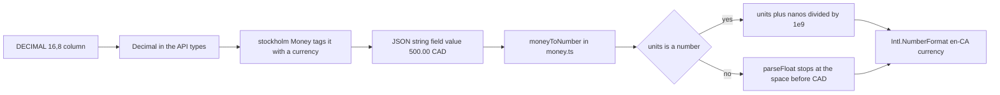
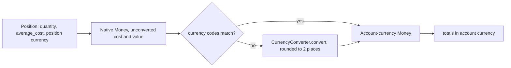
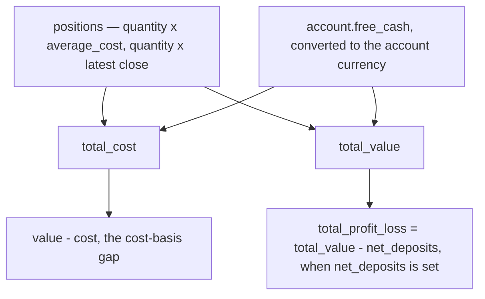

# Money & Currency Handling

Money is the one model that every account, holding, total, P&L, CSV row, and
frontend currency label depends on. There is no single `Money` module to change:
the contract is spread across backend Pydantic API types, the position service
that does the arithmetic, the database column types, and the frontend helpers in
`frontend/src/lib/types/money.ts` and `frontend/src/lib/utils/finance/`.
This page records that contract and the failure modes a careless edit introduces.
Domain-specific endpoints belong to [Domains](../architecture/domains.md) and the
[Broker sync](../workflows/broker-sync.md) / [CSV import](../workflows/csv-import.md)
workflows; this page covers the shared money semantics only.

## Two layers of representation

The backend deliberately keeps two representations with different jobs.

- **Raw numbers are `Decimal`.** Prices (`Price.close`, `open`, `high`, `low`,
  `adjusted_close`), position `quantity`, and position `average_cost` are all
  `Decimal` in the API types. This is what preserves precision through parsing
  and intermediate math.
- **Currency-tagged amounts are `stockholm.Money`.** Whenever an amount carries a
  currency, it is a `Money` value: `AccountTotals.cost`/`.value` in
  `src/account/api_types.py`, `MarketPricesApi.get_latest_close`'s return type in
  `src/market/api.py`, and `Account.currency` / `Security.currency`, which are
  `stockholm.currency.Currency` rather than plain strings.

`Account.currency` and `Security.currency` are `Currency` because currency
validity is checked at the boundary (broker payloads, CSV import, EODHD search
results) rather than being re-validated in every calculation. The read models do
not keep that type: `AccountSchema.currency` is `Currency` but carries an explicit
`@field_serializer("currency")` that emits a plain code string, and the holdings
read models (`HoldingRead.currency`, `AccountHoldingsRead.currency`) are declared
`str` outright. `AccountSchema.net_deposits` is `float | None` and
`AccountSchema.free_cash` is `float`. So "currency" is a `Currency` object only
inside the service layer and the write path — anything crossing into a read
schema has already become a string or a `float`.

`Money` instances are constructed in two places: the market domain tags a stored
close as `Money(latest_price.close, security.currency)` in
`MarketPricesApi.get_latest_close` (`src/market/api.py`), and `PositionService`
wraps `quantity × average_cost`, `free_cash`, and `net_deposits` itself before
converting or aggregating them.

**JSON shape.** A `Money` does *not* serialize to `units`/`nanos` on the wire. It
serializes to a single string field:

```json
{ "cost": { "value": "500.00 USD" }, "value": { "value": "650.00 USD" } }
```

This shape is asserted in `tests/tasks/test_account.py` and
`tests/routers/test_accounts.py` (the latter only asserts the ` CAD` suffix).
Anyone who assumes a structured `{ units, nanos, currencyCode }` payload from the
backend is working from the frontend type, not from what the API emits.

The full path from a stored column to a rendered number is worth keeping in mind,
because each hop changes the representation:



*From database scale to display: the wire shape is a currency-tagged string, so
the `units`/`nanos` branch is normally bypassed.*

## Where conversion happens

Exactly one place converts currency: `PositionService._currency_convert` in
`src/account/service/position.py`. It short-circuits when the source and target
currency codes already match, otherwise it calls
`currency_converter.CurrencyConverter.convert(...)`, rounds the result to 2
decimal places, and re-wraps it as `Money(converted, to_currency)`.

The converter instance is constructed once, in
`position_service_factory` (`fx_rates=CurrencyConverter()`), and injected into
the service. `CurrencyConverter` is a process-wide object holding a rate cache;
it is not a per-request or per-user setting, and there is no repository override
or configuration key in `src/account/service/position.py` for it. Any test that
builds a `PositionService` by hand must pass an `fx_rates` of its own —
`tests/account/test_models_and_sync.py` passes `MagicMock()` precisely because
the code path under test never reaches conversion.

Conversion is applied at the *aggregation* boundary, not to stored values:

```
position (native security/position currency)
  ├─ unconverted cost/value/P&L      ← used as-is for the "native" UI columns
  └─ _currency_convert(..., account.currency)
        └─ accumulated into total cost / total value / total P&L
```

A small flowchart of that boundary:



*Where currency conversion happens: per position, before any accumulation.*

Two consequences matter. First, stored positions never have their `average_cost`
rewritten by FX; `PositionModel.average_cost` and `currency` are whatever the
broker/CSV supplied. Second, the *same* logical amount can be reported twice in
different currencies — `HoldingRead` carries both the native pair
(`unconverted_total_value`, `latest_price`, `average_cost` in
`security_currency`) and the converted pair (`total_value`, `profit_loss`,
`converted_average_cost`, `converted_latest_price` in `currency`, which is the
account currency). The frontend holds both and prints the second line only when
`holding.security_currency !== holding.currency`.

A naming caveat: `HoldingRead.security_currency` is *not* always the security's
currency. `_calculate_holding` resolves `position_currency = position.currency or
str(security.currency)` and reports that as `security_currency`, and
`_compute_cost` applies the same precedence. `PositionModel.currency` is a
nullable `String(3)`, so a CSV/broker-supplied position currency wins over the
security's own currency everywhere in the cost and holding math — that
precedence is exactly what makes a CAD-denominated position in a USD security
computable instead of raising a currency mismatch.

Because the conversion target is the account's own `currency`, changing an
account's currency re-bases every converted figure for that account without
touching a single stored position. CSV import is one path that can do this:
`src/account/service/csv_account.py` updates an existing account's currency when
a different `chosen_currency` is supplied, and creates new accounts with
`currency=Currency(chosen_currency)`. `chosen_currency` is the per-account value
from the import request (trimmed and upper-cased), else the currency the parser
found in the CSV, else `CAD`; the parser itself also falls back to `CAD` when a
row carries neither a `currency` column nor a `book_value_currency_*` /
`market_price_currency` value.

## Free cash, totals, and net deposits

Three different numbers get called "total" and "profit/loss", and two account
fields move them.



*How free_cash and net_deposits compose the account totals and the two P&L figures.*

- `get_total_for_account(account_id, currency)` returns `AccountTotals(cost, value)`
  where `cost` is the sum of `quantity × average_cost` and `value` is the sum of
  `quantity × latest close`, each converted per position before accumulating.
  **When `account.free_cash` is truthy it is wrapped as
  `Money(free_cash, account.currency)`, converted into the requested currency,
  and added to both `cost` and `value`.** Because cash enters both sides,
  `value - cost` is not purely unrealized P&L: the cash contribution cancels out
  of that difference, but `cost` is no longer a cost basis. This is asserted by
  `tests/services/test_position_service.py`
  (`test_get_total_for_account_includes_free_cash`: a 10-share position at an
  average cost of 10 plus 250 cash yields `cost == 350` and `value == 1250`).
- `get_account_holdings` adds the same un-converted `Money(account.free_cash,
  account.currency)` to `total_value` *before* the deposits override, so the
  reported `total_value` includes cash.
- `_calculate_holdings` and `_calculate_holding` produce the per-row shape:
  quantity, average cost, native and converted value/price/P&L, latest price and
  its date. `get_account_holdings` then overrides `total_profit_loss` when
  `account.net_deposits` is not `None`: `total_profit_loss = total_value -
  Money(net_deposits, account.currency)`, with `total_profit_loss_percent`
  reported only when `net_deposits != 0`. That is a **cash-flow P&L**, distinct
  from the per-holding `profit_loss` (value minus cost basis) and from
  `AccountTotals.cost` — see the cost-versus-value note below.

`AccountTotals` is the type served by `GET /accounts/{account_id}/totals` and
pushed over WebSocket as `AccountTotalsUpdatedMessage` by the
`recalculate_all_account_totals_task` Huey task in `src/account/task.py`, which
calls `get_total_for_account(account.id, account.currency)` once per active
account. The frontend does **not** subscribe to that message; the account list
still fetches totals over HTTP through `AccountClient.getAccountTotals` (cached
per account in `accounts-list-item.svelte.ts`) and only listens for
`sync_started` / `sync_finished` / `sync_failed`.

Note the `get_holdings_by_security` path computes a *different* total: it takes
`MarketPricesApi.get_latest_close` directly, multiplies by quantity, rounds to 2
places, converts, and divides by the account total to get `account_percentage`.
The account-total divisor there comes from
`get_total_for_account(...).value.amount`, so the numerator and denominator are
both in account currency — but only because `holding_money` is converted first,
and only because that divisor already includes `free_cash`. The row it emits
(`AccountHoldingRead`) still reports `total_value` in the security's currency.

## Frontend money helpers

`frontend/src/lib/types/money.ts` defines the shape the UI actually sees:

```ts
export interface Money {
  value?: string;
  units?: number;
  nanos?: number;
  currencyCode?: string;
}
```

`moneyToNumber` prefers `units + nanos / 1e9` when `units` is a number, and falls
back to `parseFloat(value)` otherwise; null/undefined/empty input yields `0`.
Behavior is pinned in `money.test.ts`, including that `units` wins when both are
present and that unparseable strings yield `0`. The helper has exactly three
production importers — `accounts-list-item.svelte`, `total-profit-loss-buttons.svelte`
and `holding-group.svelte` — and the `Money` type additionally backs
`AccountTotals` in `frontend/src/lib/types/account.ts`.

**The `units`/`nanos` branch is effectively dead against the current backend.**
Because the API emits `{"value": "500.00 CAD"}` with no `units`, every real
response goes through the string fallback, where `parseFloat("500.00 CAD")`
returns `500` only because `parseFloat` stops at the first non-numeric character.
This works by accident, not by design. The frontend test fixtures *do* supply
`units`/`nanos` alongside `value`, which is why the units path still looks alive
in tests. Two failure modes follow:

- If the backend ever emitted a `value` string with a leading currency symbol or a
  non-`en`-style grouping separator, `parseFloat` would silently return a wrong
  number or `0`.
- If a `units`-based serializer is introduced but `nanos` are omitted for
  fractional cents, amounts shift by up to `999_999_999`/`1e9` relative to the
  string — a change that only shows up in tests that exercise both branches.

Formatting is split between two mechanisms, and only one of them is a live
display path:

- `money(m)` renders `$${amount.toLocaleString()}` — a bare `$`, no currency code,
  no fixed decimals. It is safe only where the currency is shown separately, and
  **it currently has no production caller**: after the account list moved its
  totals into `TotalProfitLossButtons`, the only import of `money` is
  `money.test.ts`. Do not treat it as the shared formatter.
- `total-profit-loss-buttons.svelte` is what the account list actually renders
  for totals. It converts its `Money | number` props with `moneyToNumber`, derives
  the return percentage as `(profitLoss / cost) * 100` when not supplied, and
  formats with `Intl.NumberFormat('en-CA', { style: 'currency', currency })`.
  Its `effectiveCurrency` derivation contains a `Money.currencyCode` fallback,
  but the `currency` prop defaults to `'CAD'`, so the display currency is in
  practice the prop passed by the caller. When `Intl` rejects the code the
  formatter falls back to `$x.xx`, prefixed with `-` for negative amounts.
- `holdings/holdings-table.svelte`, `account-inline-holdings.svelte`,
  `accounts/[id]/+page.svelte` and `holdings/+page.svelte` all use the same
  `Intl.NumberFormat('en-CA', { style: 'currency', currency })` helper, because a
  holdings table shows securities in several currencies at once.
- The holdings sidebar surfaces use a different locale: `holding-group.svelte`
  and `holdings-modal.svelte` format with `Intl.NumberFormat('en-US', ...)`, and
  the blended average they print falls back to the first holding's currency, the
  security's currency, then `USD`.
- The watchlist surfaces deliberately show **no currency symbol at all**:
  `frontend/src/lib/components/watchlist/watchlist-utils.ts` exposes
  `formatPrice` (2 decimals, `-` for absent/unparseable) and
  `formatPriceChangePercent` (signed 2 decimals, `0.00%` for zero and negative
  zero), and `watchlists/+page.svelte` renders `SecuritySchema.current_price` and
  `daily_price_change_percent` through them. The same module carries a second
  `formatValuationRange` variant that accepts `number | string` bounds; the range
  formatting contract itself is documented on
  [Security Valuations](./security-valuation.md).

## Average cost and holdings math

`blendedAverageCost(holdings)` in `frontend/src/lib/utils/finance/average-cost.ts`
is the quantity-weighted mean of `average_cost` across holdings, returning `0`
for an empty list, zero total quantity, or all-missing costs (missing
`average_cost` is treated as `0`). Because it treats missing costs as zero, a
holding with unknown cost drags the blended figure toward zero rather than being
excluded — `average-cost.test.ts` pins the empty and zero-quantity cases. It now
has three consumers: `holding-group.svelte` (the "Average" row), the
`holdings-modal.svelte` footer (`portfolioAvgPrice`), and the security detail
page, where `averageBuyingPrice` feeds the chart's average-price overlay line.
Those three run on the *holding* currency values, so a blended figure across
holdings in different currencies is as mixed as the inputs.

`frontend/src/lib/utils/finance/holdings-metrics.ts` supplies the ratio and
period math that P&L display leans on. `getBenchmarkPrice` returns `averageCost`
for `period === 'ALL'` (cost basis as the baseline) and otherwise the close of
the most recent candle at or before the period cutoff, falling back to the
earliest candle. `calculateHoldingGain` returns `{ gainAmount, gainPercent }`
where `gainAmount = (currentPrice - benchmarkPrice) * quantity` and
`gainPercent = priceDiff / benchmarkPrice * 100` (guarded to `0` when the
benchmark is `0`). `calculatePercentOfTotal` and `calculatePercentOfAccount`
return `0` for non-finite inputs or a non-positive denominator, and
`formatHoldingPercent` renders one decimal place or `-`. All of this runs on JS
`number`, not the backend `Decimal` values, so any comparison of
frontend-computed P&L against backend `profit_loss` must expect the usual
float-rounding drift.

Per-row P&L percentages are derived the same way on all three holdings surfaces:
`profit_loss / (quantity * (converted_average_cost ?? average_cost)) * 100`,
skipped when the cost basis is missing or not positive. Because the numerator is
the converted `profit_loss` and the denominator prefers the converted average
cost, the ratio is in account currency on both sides — provided
`converted_average_cost` was populated.

The two holdings tables emphasize opposite sides of the dual-currency pair:
`frontend/src/lib/components/accounts/holdings-table.svelte` shows the
security-currency value as the primary figure and the account-currency value as
the secondary line, while `frontend/src/lib/components/holdings/holdings-table.svelte`
shows the account-currency value as primary and the security-currency value as
the secondary line. Both render the secondary line only when
`security_currency !== currency`, and both use `formatValuationRange` from
`$lib/utils/finance/valuation` for the valuation-range column — see
[Security Valuations](./security-valuation.md) for that column's contract and
[Accounts & Holdings views](../workflows/accounts-and-holdings-views.md) for the
column configuration and per-currency header totals.

## Precision and storage

Where the two representations meet, precision is lost on purpose at defined
boundaries:

- **Position storage.** `PositionModel.quantity` is `DECIMAL(16, 8)` in
  `src/account/model.py` (8 fractional digits, enough for fractional shares),
  but `PositionModel.average_cost` is `Float` and `PositionModel.currency` is a
  nullable `String(3)`. Anything with more digits than an IEEE-754 double can
  hold — for example a CSV-derived cost average with many decimals — is already
  approximate once it round-trips through the database.
- **Account storage.** `AccountModel.currency` is a plain `String` while the API
  type is `Currency`; `AccountModel.net_deposits` and `AccountModel.free_cash` are
  `Float`, so cash-flow P&L and the cash contribution to both totals inherit
  float error.
- **Market prices.** Every `market_prices` column (`open`, `high`, `low`, `close`,
  `adjusted_close`) is `DECIMAL(16, 8)`, so prices are exact to 8 decimal places
  in the database and only become approximate when the service casts them to
  `float` for `HoldingRead`.
- **User-entered prices share that convention.** `PriceAlertModel.target_price`
  and `SecurityValuationModel.lower_bound` / `upper_bound` are all
  `DECIMAL(16, 8)` (as is the valuation-history table), while the alert write
  schema (`PriceAlertWrite.target_price`) takes a bare `Decimal` and the frontend
  `ValuationClient` types both valuation bounds as plain `number`. So the
  *column scale* is the effective precision for user-entered prices: a value
  written with more than 8 fractional digits is rounded by the database, and the
  number the user typed may not be the number that comes back. The valuation
  field's full contract (model, routes, client, sidebar modal) lives on
  [Security Valuations](./security-valuation.md) — this page only records the
  precision convention it shares with market prices.
- **Aggregation rounding.** `_currency_convert` rounds each converted amount to 2
  decimal places *before* accumulation, and `_compute_cost` / `_compute_price` /
  the native value in `_calculate_holding` each round their products to 2 places
  as well. Totals are therefore sums of rounded per-position values rather than
  the rounded sum of exact values. Changing that rounding (or removing it)
  changes reported totals for multi-position accounts even when nothing else
  moves.
- **CSV parsing.** `src/account/csv/parser.py` parses quantities and book values
  as `Decimal` after stripping `,` and `$`, and `calculate_average_cost` computes
  `(book_value / quantity).quantize(Decimal("0.0001"), rounding=ROUND_HALF_UP)`,
  returning `None` for non-positive quantity or missing book value. Changing that
  quantize step changes every CSV-imported `average_cost` and therefore every
  cost-basis P&L downstream. Cash rows are accumulated separately as `float`
  (`_parse_cash_amount`) and rounded to 2 places into `free_cash`.

## Missing prices and missing rates

Neither a missing price nor a missing FX rate is an error the money layer
recovers from gracefully, and they fail differently.

- A missing price is silently worth zero. `_compute_price` returns
  `Money(0, security.currency)` when `MarketPricesApi.get_latest_close` yields
  `None`; `_calculate_holdings` substitutes `Money(0, security.currency)` when
  `get_latest_price` yields `None` and `_calculate_holding` then reports
  `latest_price = 0.0` with a `None` `price_date`; `get_holdings_by_security`
  falls back to `latest_price = 0.0` and returns an empty list with `total == 0`
  when the security lookup raises `SecurityNotFoundError`. `_calculate_holdings`
  also carries a defensive `if not security: continue`, but it is unreachable in
  practice because `SecurityApi.get_by_id` goes through
  `SecurityRepository.get_by_id_or_fail`, which raises instead of returning
  `None`. In all of these cases the account total is understated rather than
  failing.
- A missing FX rate is not caught. `_currency_convert` has no fallback, no
  `None` handling and no default rate — it calls into the `currencyconverter`
  package and lets the library's exception propagate. The blast radius depends on
  the caller: `GET /accounts/{account_id}/totals` fails the request, while
  `_recalculate_all_account_totals` wraps each account in `try/except Exception`,
  logs, and continues to the next account (so one unpriced account cannot stop
  the WebSocket broadcast for the rest).

Because currency lookups are outbound I/O, tests must inject a stub `fx_rates`
instead of relying on live rates: backend test commands run inside Docker
(`./scripts/agent-test tests/...`, or `docker compose exec backend uv run pytest`),
and a test that performs a real network call is broken by definition. The only
place that currently constructs a real `CurrencyConverter()` in the suite is
`tests/services/test_position_service.py`, and its CAD-position/USD-security case
does reach `CurrencyConverter.convert` because the codes differ — so that test
depends on the package's rate data rather than a stub. New tests should pass a
mock through the `fx_rates` constructor argument, which is exactly why the
service takes it as a parameter rather than instantiating the converter itself.

## Failure modes a change can introduce

- **Mixed currencies in an aggregate.** Any new code that sums `Money` across
  positions without routing each operand through `_currency_convert` produces a
  total whose `currency_code` is whichever operand came first (or raises in
  `stockholm`). The file that must change is
  `src/account/service/position.py` — every existing accumulation site
  (`get_total_for_account`, `_calculate_holdings`, `_calculate_holding`,
  `get_holdings_by_security`) converts before adding, and a new aggregation must
  do the same. The `free_cash` contribution is converted too, even though the
  cash is already in the account currency, because the totals endpoint may be
  asked for a currency other than the account's.
- **Float contamination.** Converting `Decimal` prices or costs to JS-visible
  `float` inside the service (as `_calculate_holding` already does at the
  `HoldingRead` boundary) is fine for display but spreads into anything computed
  from `HoldingRead` — `total_profit_loss_percent`, `account_percentage`, and the
  frontend metrics. Adding float math *before* conversion in
  `src/account/service/position.py` would widen the error.
- **`nanos`/`units` mismatch.** As above: whichever side switches to a structured
  integer money shape must update both the backend serializer and
  `frontend/src/lib/types/money.ts` together, or `parseFloat` silently keeps
  working on a `value` field that no longer exists (returning `0`).
- **Cross-account ratios that are not normalized.** Two live frontend paths sum
  account-currency values across rows and then divide by that sum.
  `holding-group.svelte` builds `totalPortfolioValue` from
  `moneyToNumber(totals.value)` over every account and divides the security's
  `AccountHoldingRead.total_value` (which is `quantity × latest_price` in the
  *security's* currency) by it. `holdings/holdings-table.svelte` builds its own
  `totalPortfolioValue` by summing `total_value` over every row in scope and uses
  it for `percent_of_total` and the per-account badges, so those percentages mix
  account currencies whenever the visible rows span more than one. Any new
  cross-account percentage must convert each operand into one target currency
  first — `frontend/src/routes/holdings/+page.svelte` is the pattern to copy,
  since its `currencyTotals` buckets rows by `row.currency` and sums
  `total_value`, `profit_loss` and `quantity × (converted_average_cost ??
  average_cost)` *per bucket*, deriving `returnPercent` only when a bucket's cost
  basis is positive and never summing across currencies.
- **Cost-versus-value confusion.** `AccountTotals.cost` is *cost basis*
  (quantity × average cost **plus free cash**) and `.value` is *market value*
  (quantity × latest close **plus free cash**); their difference is the
  unrealized P&L of the holdings when `free_cash` is zero, and stops being a
  cost-basis quantity as soon as cash is non-zero. `total_profit_loss` on
  `AccountHoldingsRead` is a third thing when `net_deposits` is set — total value
  (cash included) minus deposits. The frontend labels all three near each other
  (`total-profit-loss-buttons.svelte` tooltips show total value and total cost
  side by side; `holdings-table.svelte` shows `profit_loss` per row and the
  detail page shows net deposits and total P/L in one header). Swapping cost and
  value, mixing the cash-flow P&L with the per-holding P&L, or forgetting that
  cash sits in both totals is not a cosmetic bug — it changes the number users
  would act on.

## Testing the money contract

Backend commands run in Docker only; never let a test dial a live FX or price
API. `./scripts/agent-test <path>` is the fast entrypoint, with
`docker compose exec backend uv run pytest` and
`docker compose exec frontend npm run test:run` as the raw fallbacks.

The focused tests that pin this behavior are:

- `frontend/src/lib/types/money.test.ts` — `moneyToNumber` null/empty handling,
  `units` + `nanos`, negative values, string fallback, `units`-over-`value`
  precedence, and `money()` formatting.
- `frontend/src/lib/utils/finance/average-cost.test.ts` — empty list, single
  holding, weighted blend, zero total quantity, missing `average_cost`.
- `frontend/src/lib/components/accounts/accounts-list-item.test.ts` — the account
  row renders `+$50.00` / `-$25.00` from `Money` fixtures, the return percentage
  is derived from the totals pair, and the totals fetch is cached per account.
- `frontend/src/lib/components/total-profit-loss-buttons.test.ts` — number and
  `Money` inputs for `totalValue` / `costBasis`, and the derived profit/loss and
  percent.
- `frontend/src/lib/components/holdings/holdings-table.test.ts` — `% of Total`
  and per-account badge percentages, including grouped rows.
- `frontend/src/routes/holdings/page.svelte.test.ts` — the header totals are
  bucketed per currency rather than summed across them, and buckets with a zero
  cost basis or missing `profit_loss` degrade gracefully.
- `frontend/src/lib/utils/finance/valuation.test.ts` and
  `frontend/src/lib/components/watchlist/watchlist-utils.test.ts` — the
  two-decimal range formatting and the watchlist price/percent formatters.
- `tests/services/test_position_service.py` —
  `test_get_total_for_account_includes_free_cash` (cash in both `cost` and
  `value`), `test_get_account_holdings_includes_free_cash` (cash in `total_value`,
  `total_profit_loss == 500` and `total_profit_loss_percent == 50.0` for
  `1500 - 1000`), and the position-CAD/security-USD mismatch case.
- `tests/account/csv/test_parser.py::test_average_cost_calculation` — the
  `book_value / quantity` quantize to `0.0001` and its `None`/zero edge cases.
- `tests/routers/test_accounts.py::test_account_totals_success` — asserts the
  `value` string ends with ` CAD`, i.e. that `Money` serializes to a
  currency-tagged string.
- `tests/tasks/test_account.py` — asserts the WebSocket payload contains
  `totals.cost.value == "500.00 USD"` and `totals.value.value == "650.00 USD"`.
- `tests/ws/test_router.py::test_account_totals_updated_message_serialization` —
  asserts the message envelope carries `totals.cost` and `totals.value`.

When changing the money model, update these tests together with the code — they
are the fastest signal that the backend string shape and the frontend parser
still agree.

## Related pages

- [Domains](../architecture/domains.md) — account and market domain surfaces,
  models, and the holdings/totals business rules.
- [Frontend](../architecture/frontend.md) — the `Money` type and its helpers in
  the client layer.
- [Accounts & Holdings views](../workflows/accounts-and-holdings-views.md) — how
  these totals and holdings reach the account list, detail page, and `/holdings`.
- [Security Valuations](./security-valuation.md) — the user-entered price range
  that shares the `DECIMAL(16, 8)` price precision, and the valuation-range
  formatting helpers.
- [Broker sync](../workflows/broker-sync.md) — how broker positions and their
  currencies enter `PositionService`.
- [CSV import](../workflows/csv-import.md) — CSV parsing, currency selection, and
  average-cost derivation.
- [Market data and indicators](../workflows/market-data-and-indicators.md) —
  where prices and their currencies come from.
