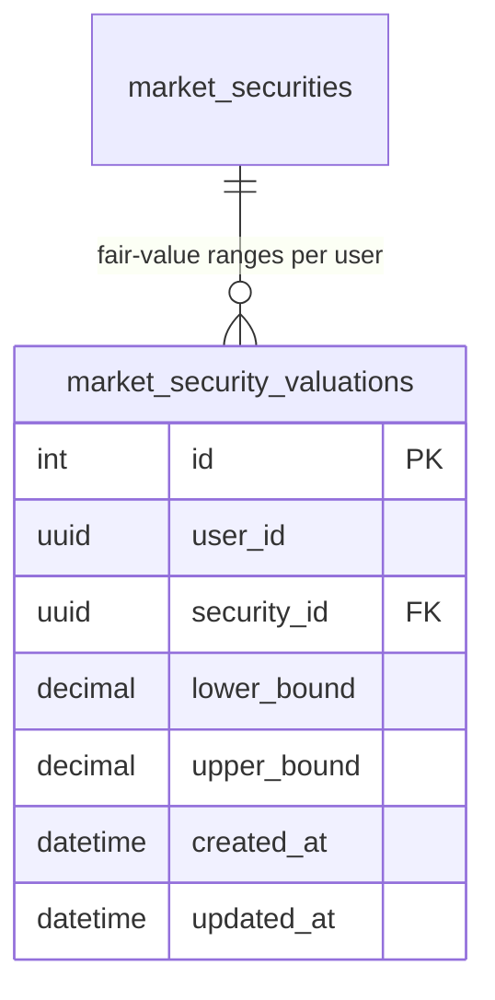
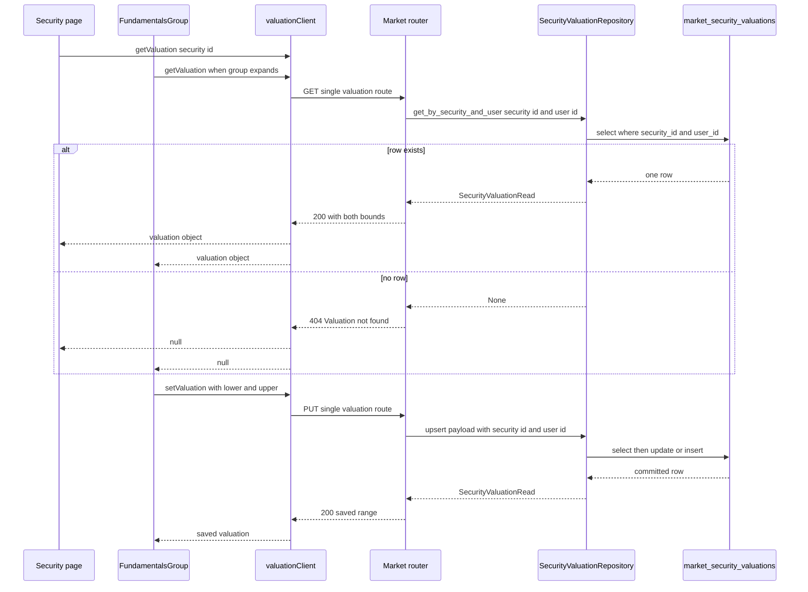

# Security Valuations (Fair-Value Ranges)

A *security valuation* is a user's own opinion of what a security is worth, expressed
as a pair of positive decimal bounds — `lower_bound` and `upper_bound` — attached to
one security for one user. It is not market data and it is not shared: two users hold
two independent ranges for the same security, and every read and write on the backend
is filtered by the requesting `user_id`.

The concept lives entirely inside the market domain. Its storage is a single table,
its API is four routes that call a router-only repository (there is no valuation
service), and its frontend surface is a sidebar group with a modal on the security
detail page plus a shaded band on that page's chart. The chart band's *rendering*
mechanics are documented on [Charting](../architecture/charting.md); the preference
key that gates it is inventoried on [User Preferences](./user-preferences.md); the
table's place in the market model catalog is on [Backend Domains](../architecture/domains.md).

The single table and its cascading foreign key to `market_securities`.

## Primary shape: one range per user and security

`SecurityValuationModel` (`src/market/model.py`) maps to `market_security_valuations`:

| Column | Type | Notes |
| --- | --- | --- |
| `id` | `Integer` PK, autoincrement | |
| `user_id` | `Uuid` | no foreign key to `auth_users`; scoping is by query, not by constraint |
| `security_id` | `Uuid` FK → `market_securities.id`, `ondelete="CASCADE"` | deleting a security removes its ranges |
| `lower_bound`, `upper_bound` | `DECIMAL(16, 8)` | both `NOT NULL`; the same fixed-point convention as `PriceModel` (see [Money & Currency](./money-and-currency.md)) |
| `created_at`, `updated_at` | `DateTime(timezone=True)` | |

`__table_args__` declares `UniqueConstraint("user_id", "security_id",
name="valuation_user_security_unique")` and the covering index
`ix_market_security_valuations_user_security` over the same two columns.

That unique constraint is the concept's central invariant: **there is at most one row
per `(user, security)`, and the write path is therefore an upsert rather than a
create/update pair.** The model ships with its Alembic revision in the same change —
`migrations/versions/3436586a755f_create_security_valuations.py`
(`down_revision = "4c2ed77e7738"`) creates the table, the cascading foreign key, the
unique constraint and the index, and its `downgrade()` drops index and table. Model
changes in this repository must ship their revision together and follow the
`<hash>_<description>.py` naming convention.

## Repository: the contract and the upsert

`SecurityValuationRepository` is an ABC in `src/market/repository.py` with exactly
three methods, and `SqlAlchemySecurityValuationRepository`
(`src/market/repository_sqlalchemy.py`) implements all three:

| Method | Behaviour |
| --- | --- |
| `get_by_security_and_user(security_id, user_id)` | one `SELECT` filtered by **both** columns; `scalar_one_or_none()` → `SecurityValuationRead \| None` |
| `upsert(valuation, security_id, user_id)` | selects the `(security_id, user_id)` row; if found, overwrites `lower_bound`/`upper_bound` and sets `updated_at = datetime.now(UTC)`; otherwise inserts with `created_at` and `updated_at` both set to now. Commits and refreshes before returning |
| `get_batch_by_user_and_securities(security_ids, user_id)` | short-circuits to `[]` for an empty id list; otherwise one `SELECT ... WHERE user_id = :user_id AND security_id IN (...)` |

Two properties follow and both are load-bearing:

- **The upsert is idempotent.** Repeated `PUT`s update the same row rather than
  stacking rows, which is exactly what the unique constraint guarantees. The
  repository test pins that the second upsert returns the *same* `id` with new bounds.
- **User scoping is in every statement.** All three methods take `user_id` and add it
  as a `WHERE` clause, so no caller — including the batch endpoints — can read or
  overwrite another user's range.

The `updated_at` value is written explicitly by the repository rather than relying on
the model's `onupdate`, so the returned read always carries the timestamp of the write
that just happened. The factory `sqlalchemy_security_valuation_repository_factory` is
registered in `register_market_services` (`src/market/__init__.py`) under the ABC key,
which is what lets the router resolve it with `services.aget(SecurityValuationRepository)`.

## Routes

`market_router` (prefix `/market`, mounted under `/api/v1` in `src/main.py`) exposes
four valuation routes in `src/market/router.py`. All four depend on `current_user` and
pass `user.id` down; none of them inspects another user's data or checks that the
security exists.

| Method | Path | Behaviour |
| --- | --- | --- |
| `GET` | `/market/securities/{security_id}/valuation` | returns the caller's range; `404` with `detail: "Valuation not found"` when the repository returns `None` |
| `PUT` | `/market/securities/{security_id}/valuation` | `SecurityValuationWrite` in, upsert out (`200`) |
| `GET` | `/market/securities/valuation/batch` | repeated `security_ids` query parameters, `None` treated as `[]`; returns the subset of the caller's ranges that exist |
| `POST` | `/market/securities/valuation/batch` | body `SecurityValuationBatchRequest` (`{ security_ids: [...] }`), same repository call and same subset semantics |

The two batch routes are declared above the single-security valuation routes at the end
of the file, following this router's convention (the same ordering rule applies to
`/securities/search` and `/securities/{security_id}`) so a literal path segment is
never shadowed by a `{security_id}` matcher. They are the only valuation paths that
serve more than one security per request; the single-security routes take a `SecurityId`
path parameter and, for the `PUT`, never verify that the security exists.

The payload schemas are deliberately minimal (`src/market/schema.py`):
`SecurityValuationWrite` carries only `lower_bound` and `upper_bound`;
`SecurityValuationRead` echoes `id`, `user_id`, `security_id`, both bounds and both
timestamps with `model_config = ConfigDict(from_attributes=True)`. There is no
"notes" field and no validation that `lower_bound <= upper_bound` server-side — the
ordering rule exists only in the frontend modal.

The single-`GET` `404` is a genuine contract, not an accident: it is what tells the
frontend "this user has not set a range for this security yet". Note that the same
`404` is returned for a security id that does not exist at all, and that the `PUT`
route has no existence check — an unknown `security_id` can only fail at the database
through the foreign key.

## Read/write round trip

The read collapses "no range yet" into `null`; the write is unconditionally an upsert.

## Frontend client: 404 becomes null

`ValuationClient` (`frontend/src/lib/api/valuationClient.ts`) is the one client in the
codebase that deliberately breaks the `ApiClient` rule that every non-`ok` response
throws:

- `getValuation(securityId, tokenOverride?)` returns
  `Promise<SecurityValuation | null>`. It catches the error and returns `null` when
  either `err.status === 404` (the `ApiError` shape) **or** `err instanceof Error &&
  err.message.includes('404')`. The second branch exists because messages are derived
  from the response body and a custom fetch may surface a bare message; every other
  error is rethrown. `valuationClient.test.ts` pins the success path, the
  status-based 404 path, and the PUT body.
- `saveValuation(securityId, lowerBound, upperBound, tokenOverride?)` issues the `PUT`
  with exactly `{ lower_bound, upper_bound }`; `setValuation(securityId, data, ...)`
  is a thin wrapper that forwards `data.lower_bound` / `data.upper_bound`. The
  `SecurityValuationWrite` interface declares an optional `notes?: string` that the
  client silently drops — it is not sent and the backend schema does not accept it, so
  do not treat that field as a feature.
- `getBatchValuations(securityIds, ...)` returns `[]` for an empty/absent id list
  without calling the API, otherwise POSTs `{ security_ids }` to the batch route.

Two distinct frontend types describe the same payload, and the difference matters:
`valuationClient.ts` declares `SecurityValuation` with numeric bounds, while
`MarketService` (`frontend/src/lib/api/marketService.ts`) declares
`SecurityValuationRead` with `lower_bound`/`upper_bound` as `number | string` plus a
second numeric `SecurityValuation` interface for table rows. That is why the holdings
service coerces every batch entry through `Number(...)` — see
[Accounts & Holdings Views](../workflows/accounts-and-holdings-views.md).

## Sidebar surface: fundamentals group and modal

`FundamentalsGroup`
(`frontend/src/lib/components/actions-sidebar/fundamentals/fundamentals-group.svelte`)
is the editing surface. It receives `securityId`, `currency` and the two-way
`valuation` / `showOverlay` bindings from the security page, and:

- Fetches on an untracked `$effect` whenever it is `expanded` and `securityId` is set,
  assigning `valuation = await valuationClient.getValuation(securityId)`. A genuine
  failure sets the local `error` ("Failed to load valuation") and renders a
  `SidebarError` with a retry; a `404`/`null` is not an error.
- Renders "Fair value range not set." plus a **Set Valuation Range** button when
  `valuation` is `null`, and otherwise the two bounds formatted with
  `Intl.NumberFormat(..., { style: 'currency', currency })` joined by an en dash,
  an **Edit** affordance, and the "Show on chart" checkbox.
- Passes the range into `ValuationModal` through a `ModalState`; the modal's `onSaved`
  callback assigns the returned row straight into `valuation`, so the page state (and
  therefore the chart) updates without a refetch.

`ValuationModal` (`valuation-modal.svelte`) owns the only validation in the feature:
it rejects a missing or non-positive bound and rejects `lowerBound > upperBound`,
renders the message inline, and otherwise calls
`valuationClient.setValuation(securityId, { lower_bound, upper_bound })`, then closes
and bubbles the saved `SecurityValuationRead`. Server-side validation of the ordering
does not exist, so this modal is the only guard.

## The presentation gate: `show_valuation_band`

Whether the range is *drawn* is a separate, per-user preference, and it is deliberately
independent of whether a range is *stored*:

- The security page holds `let showValuationOverlay = $state(true)` and seeds it from
  `prefs.show_valuation_band` in two places — `onPreferencesLoaded(prefs)` (called by
  the indicators group) and the init-chain `userPreferencesService.getPreferences()`
  fallback — each guarded by an explicit `!== undefined && !== null` check so an absent
  key keeps the default.
- `FundamentalsGroup`'s checkbox calls
  `userPreferencesService.patchPreferences({ show_valuation_band: val })`, updating the
  bound `showOverlay` first and only logging a rejection. The write is one key, which
  keeps it race-safe against the other components patching preferences.
- The page passes the same flag twice into the chart: `showValuation={showValuationOverlay}`
  and `showValuationBand={showValuationOverlay}`. Inside the chart,
  `isValuationBandVisible = showValuationBand !== undefined ? showValuationBand : showValuation`,
  so the narrower prop wins when supplied.

The authoritative key inventory (readers, writers, failure handling) lives on
[User Preferences](./user-preferences.md); this page only owns the valuation-specific
verbs. Preferences are read on the security page rather than in the route load, because
the root layout load deliberately does not touch them — see
[Frontend Architecture](../architecture/frontend.md).

## Chart band: `ValuationBandPrimitive`

The rendering primitive is `frontend/src/lib/components/charts/plugins/valuation-band/valuation-band.ts`,
a `lightweight-charts` series primitive with three classes:

- `ValuationBandPrimitive` — implements `ISeriesPrimitive`; keeps `_paneView` and the
  `requestUpdate` callback from `attached()`, exposes one pane view, and `setRange(lower, upper, visible)`
  forwards to the view then requests a redraw.
- `ValuationBandPaneView` — holds the range and returns `zOrder() === 'bottom'`, so the
  band paints behind candles and other primitives.
- `ValuationBandRenderer` — bails out entirely when `!visible`, either bound is `null`,
  or no series is attached. Otherwise it converts both prices with
  `series.priceToCoordinate()`, fills the rectangle between them with the translucent
  blue default and strokes dashed lines at each bound inside
  `useBitmapCoordinateSpace`, so the band stays crisp across pixel ratios.

`security-chart.svelte` creates the primitive during chart mount, seeded from
`valuation && isValuationBandVisible ? valuation.lower_bound : null` (and the same for
the upper bound), attaches it to the candlestick series, and keeps it in sync with a
dedicated `$effect` that calls `setRange(...)` with `visibility` as the third argument.
`getValuationBandPrimitive()` exposes it for tests. Because the effect passes `null`
bounds when the gate is off, hiding the band never requires detaching the primitive.

## Other readers: batch columns

Two non-chart surfaces read ranges in bulk, both through
`MarketService.getValuationsBatch` (the POST batch route) rather than `ValuationClient`:

- `HoldingsService.load` collects the distinct `security_id`s from the loaded rows,
  fetches them in one call, coerces bounds with `Number(...)` and builds a
  `{ [security_id]: SecurityValuation }` map inside a nested `try`/`catch` that
  degrades to `{}` so a valuation failure never fails the holdings load. The holdings
  table renders the range through `formatValuationRange` from
  `$lib/utils/finance/valuation.ts` (two decimals via an `en-CA` formatter, en-dash
  separator, `—` when either bound is missing or non-finite) and sorts the column by
  the midpoint of the two bounds.
- The `/watchlists` page fetches the same batch for the union of its securities in a
  cancellable `$effect` and renders a Valuation column with a *separate*
  `formatValuationRange` helper in `watchlist-utils.ts` that accepts the valuation
  object itself. Both helpers fall back to `—`.

## Invariants when extending

- **The unique constraint defines the write path.** Any new write must upsert on
  `(user_id, security_id)` or the insert will trip `valuation_user_security_unique`.
- **Scope by `user_id` in the repository, not in the router.** The router only supplies
  `user.id`; every statement in `SqlAlchemySecurityValuationRepository` already filters
  on it, so a new read method must do the same or it will leak across users.
- **A missing range is `404` on the single route and `null` on the client.** Do not
  make the route return an empty object; `getValuation`'s two 404 branches and the
  fundamentals group's "not set" state both depend on the distinction between
  "no range" and "error".
- **Batch reads return only the rows that exist.** A security with no range is simply
  absent from the response array, so every consumer must treat a missing key as "not
  set" and fall back to `—` rather than to a fabricated range.
- **A model change ships its Alembic revision in the same change** and the file is
  named `<hash>_<description>.py` under `migrations/versions/`.

## Focused tests

| Test | Covers |
| --- | --- |
| `tests/market/test_security_valuation_repository.py` | `get_by_security_and_user` returning `None`; upsert create returning id + timestamps; upsert-update preserving the row id; batch read across two securities with a second user's row excluded; empty id list returning `[]` |
| `tests/routers/test_market.py` | `test_get_valuation_not_found` (404 before any write), `test_put_and_get_valuation` (PUT then GET returns the same `id` and bounds), `test_batch_valuations_endpoint` (both GET-with-query-params and POST-with-body forms) |
| `frontend/src/lib/api/valuationClient.test.ts` | success read, 404 → `null`, PUT method/body/path, batch POST |
| `frontend/src/lib/api/marketService.test.ts` | `getValuationsBatch` POSTing `security_ids` with the bearer token and returning parsed valuations |
| `frontend/src/lib/components/actions-sidebar/fundamentals/fundamentals-group.test.ts` | "Fair value range not set." empty state, currency-formatted range with the checkbox, `patchPreferences({ show_valuation_band: false })` on toggle |
| `frontend/src/lib/components/actions-sidebar/fundamentals/valuation-modal.test.ts` | prefilled bounds, `lower > upper` rejected without calling the client, successful save calling `setValuation` and `onSaved` and closing |
| `frontend/src/lib/components/charts/plugins/valuation-band/valuation-band.test.ts` | attach/`requestUpdate`, `zOrder === 'bottom'`, fill + dashed stroke draw calls, no draw when hidden or bounds are `null`, clean detach |
| `frontend/src/lib/components/charts/security-chart.test.ts` | the primitive is attached with the passed range and survives a rerender with new bounds |
| `frontend/src/lib/utils/finance/valuation.test.ts` | formatting, thousands separators, `—` for null/`NaN`/infinite bounds |
| `frontend/src/lib/components/holdings/holdingsService.test.ts`, `holdings-table.test.ts`, `frontend/src/routes/watchlists/page.svelte.test.ts` | batch fetch and numeric coercion for distinct security ids, graceful empty-map fallback, rendered ranges and `—` fallback |

## Working on this feature

Backend commands run inside Docker (`docker compose exec backend uv run ruff check`,
`uv run ty check`, `uv run pytest`; autogenerate a revision with
`docker compose exec backend uv run alembic revision --autogenerate -m "message"`), or
through the harness `./scripts/agent-test tests/...`. Backend tests must not touch real
services — the repository test uses the ephemeral Postgres session fixture, not EODHD
or Redis. Frontend checks run in the frontend service (`npm run lint`, `npm run check`,
`npm run test:run`) or `./scripts/agent-test frontend/src/...`, and every frontend test
must mock the API clients it exercises: the fundamentals group mocks
`valuationClient` and `userPreferencesService`, the security page suite mocks
`valuationClient` (keeping `getValuationClient` alongside the singleton) plus its other
clients, and `security-chart.test.ts` mocks `lightweight-charts`.
