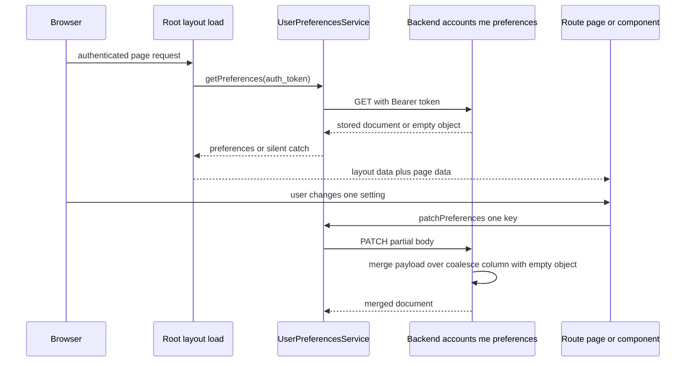

# User Preferences

Every UI setting that must survive a sign-out and follow a user across devices lives in a
single permissive JSON document attached to the user row and served by
`/accounts/me/preferences`. This page owns that contract: the storage shape, the three
endpoints and their write semantics, the read/write matrix for every key, and the failure
rules that differ per surface. The chart-side details of *how* the values are applied are
owned elsewhere — see [Charting](./../architecture/charting.md) for timeframe, chart style,
indicators and pane heights, and
[Chart Drawings, Plugins & Rewind](./../architecture/chart-drawings-and-rewind.md) for
`elliott_waves`, `fibonacci_tools` and `drawings`. The holdings surfaces that read two of
these keys are covered by
[Accounts & Holdings Views](./../workflows/accounts-and-holdings-views.md).

## Storage

Preferences are one nullable column on the user row:

- `UserModel.preferences: Mapped[dict | None] = mapped_column(JSON, nullable=True)` on
  `auth_users` (`src/auth/model.py`), added by
  `migrations/versions/1548d7b88af5_add_preferences_json_column_to_auth_.py`.
- `UserSchema.preferences: dict | None` mirrors it (`src/auth/schema.py`), so the value
  travels with the user record through the repository.
- The column is declared `sa.JSON()` in the migration but read and written through
  `sqlalchemy.dialects.postgresql.JSONB` casts, because PATCH depends on the Postgres
  JSONB concatenation operator and `RETURNING` (see below). Postgres is therefore an
  implicit requirement of the PATCH path.

There is exactly one document per user; nothing is keyed by security, route, or device.
That is a deliberate boundary: the per-security `market_indicator_preferences` table and
its `GET|PUT /market/securities/{id}/indicator-preferences` endpoints were removed, and
`tests/routers/test_market.py::test_indicator_preferences_endpoints_return_404` is the
regression test that keeps them gone.

## HTTP contract

The three endpoints live on `account_router` (prefix `/accounts`, mounted under `/api/v1`
in `src/main.py`) and are implemented in `src/account/router.py`:

| Method | Path | Behaviour | Response |
| --- | --- | --- | --- |
| `GET` | `/accounts/me/preferences` | `UserApi.get_preferences(user.id)` | the stored document, or `{}` when nothing is saved |
| `PUT` | `/accounts/me/preferences` | replaces the whole document with `payload.model_dump(exclude_none=True)` | the document re-read after the write (or `{}`) |
| `PATCH` | `/accounts/me/preferences` | merges the payload at the **top level** via JSONB `||` and returns the merged document | the merged document |

All three depend on `current_user`; without a valid token each returns 401, pinned by
`tests/routers/test_account_unauth.py`. User isolation is implicit — the repository always
scopes the statement by `UserModel.id == user_id`, and `tests/routers/test_accounts.py`
asserts both directions (user B sees `{}` while user A still sees their document).

### Permissive payload

`UserPreferences` in `src/account/api_types.py` sets `model_config = ConfigDict(extra="allow")`
and declares only a subset of the keys the frontend actually uses (`timeframe`,
`chart_style`, `indicators`, `sidebar_open`, `holdings_period`, `elliott_waves`,
`fibonacci_tools`, `wave_settings`, `watchlist_order`, `watchlist_sort`). Consequences:

- **Unknown keys pass through.** The server is a store, not a schema authority: a key the
  frontend adds without touching the backend round-trips unchanged. Declared fields are
  still typed, so a malformed declared field (for example a non-list `watchlist_order`)
  is rejected with a 422 before it reaches the column.
- **The declared list is advisory and drift-prone.** The authoritative key list is the
  `UserPreferences` interface in `frontend/src/lib/api/userPreferencesService.ts` plus the
  components that write each key plus the router tests. Treat any other inventory
  (including planning drafts such as `.opencode/features/user-chart-preferences.md`, which
  predates most of the keys) as stale.

### `exclude_none` and delete semantics

Both write verbs dump with `exclude_none=True`, which makes nulls meaningless as a stored
value:

- **An explicit null is never persisted.** `PATCH { "indicator_pane_heights": null }` drops
  the key from the payload, so the previously stored map survives. The security page's
  pane-height reset path sends exactly that payload (its test asserts the client-side call,
  not a cleared server value), so clearing a key requires a `PUT` that omits it rather than
  a null patch.
- **PUT can delete keys; PATCH cannot.** PUT assigns the dumped payload wholesale, so any
  key not present in the request is gone. PATCH can only add or overwrite non-null keys.
- A PUT of a partial document is therefore a *replace*, not a merge — the round-trip test
  asserts `GET` returns exactly the partial payload with no fabricated defaults.

### Shallow merge, whole-key writes

`SqlAlchemyUserRepository.patch_preferences` builds

```python
preferences=func.coalesce(
    cast(UserModel.preferences, JSONB),
    cast({}, JSONB),
).op("||")(cast(preferences, JSONB))
```

with `.returning(UserModel.preferences)`. Two properties follow, and both are load-bearing
for every writer:

1. **The merge is top-level only.** `indicators`, `wave_settings`, `elliott_waves`,
   `fibonacci_tools`, `drawings` and `holdings_table` are *values*, not sub-documents: any
   patch that mentions the key replaces it entirely. `tests/routers/test_accounts.py`
   documents this explicitly for `wave_settings` ("the top-level wave_settings key is
   replaced entirely by the JSONB `||` merge"), and the writers say the same in comments
   ("PATCH replaces the whole `indicator_pane_heights` key — always send the full object").
2. **One key per write is the race-safe shape.** Because unrelated keys are untouched by a
   single-key patch, independently mounted components (layout, sidebar, chart page,
   holdings page) can patch concurrently without clobbering each other. The
   `holdings-table-prefs.ts` and `holdings-group-prefs.ts` helpers both note that they
   persist "under a single `holdings_table` / `holdings_group` key so the backend's
   top-level JSONB merge can't race with other preference writes", and
   `test_preferences_patch_cross_component_isolation` walks five such interleaved writes.

`coalesce(..., {})` is what makes the first-ever PATCH work: a `NULL` column merges against
an empty object rather than producing `NULL`.

`PUT` is the legacy replace verb: `savePreferences` exists on the service and is covered by
`userPreferencesService.test.ts`, but no component in the repository calls it — every
production write is a partial PATCH, and the replace semantics survive mainly as the
contrast case the round-trip and partial-update tests pin down.

## Read-then-patch round trip



One read at load time seeds the UI; every later change is a single-key PATCH from the
component that owns the interaction.

## Read/write ownership matrix

The client half of the contract is `UserPreferencesService`
(`frontend/src/lib/api/userPreferencesService.ts`), which extends `ApiClient` and exposes
`getPreferences` / `savePreferences` (PUT) / `patchPreferences` (PATCH). It is exported
twice: `getUserPreferencesService(customFetch)` for SSR loads that must inject the
server-side `fetch` and pass the `auth_token` cookie explicitly, and a module singleton
`userPreferencesService` used from browser components (where `credentials: 'include'`
carries the cookie). No other module talks to the endpoint directly.

| Key | Read by | Written by | Write-failure handling |
| --- | --- | --- | --- |
| `sidebar_open` | root `+layout.server.ts` → `sidebarOpen` seed | root `+layout.svelte` `handleSidebarOpenChange` | fire-and-forget (`.catch(console.error)`) |
| `collapsed_watchlist_ids` | root `+layout.server.ts` → `$page.data` → `AppSidebarWatchlist` | `AppSidebarWatchlist.toggleCollapsed` | fire-and-forget |
| `watchlist_order` | root `+layout.server.ts` → `AppSidebarWatchlist` (`sortWatchlistsByOrder`) and `/watchlists` via `$page.data` | `/watchlists` `moveWatchlist` (drag-and-drop and keyboard share it) | surfaced: the optimistic order is rolled back and `watchlistService.error` is set, rendered in the page's alert |
| `holdings_table` | `/holdings` `+page.server.ts` → `holdings_table_config` → page `tableConfig` | `/holdings` `handleToggleColumn` / `handleConfigChange` → `saveHoldingsTableConfig` | surfaced: page-level `persistError` rendered in a destructive alert |
| `holdings_group` | `/holdings` `+page.server.ts` → `group_mode` → `HoldingsService.setGroupBy` | `/holdings` `handleGroupToggle` → `saveHoldingsGroupMode` | surfaced: page-level `persistError` |
| `elliott_waves` | `/holdings` load (EW columns), `holdings-modal.svelte` on open, `ChartDrawingsService` getters | `ChartDrawingsService` only (`handleWaveChange`, undo/redo restore, drag-end flush) | logged only |
| `fibonacci_tools` | `ChartDrawingsService` getters, surfaced through `ChartSettingsModal` / `FibWidthModal` | `ChartDrawingsService` only (`handleFibLevelsChange`, `handleFibWidthSave`) | logged only |
| `drawings` | `ChartDrawingsService.securityDrawings` and the `effective*` getters | `ChartDrawingsService` only (`handleDrawingChange`, `handleRemoveDrawing`, undo/redo restore, drag-end flush) | logged only |
| `timeframe` | security page `onPreferencesLoaded` → `changeTimeframe(prefs.timeframe, { persist: false })` | security page `changeTimeframe` persist branch → `updateChartPreferences` | logged only |
| `chart_style` | security page `onPreferencesLoaded` (falls back to `heikin_ashi`) | security page style buttons → `updateChartPreferences` | logged only |
| `indicators` | security page `onPreferencesLoaded` (enabled, color, period/stdDev/fast/slow/signal) and `IndicatorsGroup.loadPreferences` | `IndicatorsGroup.toggleIndicator` / `saveSettings` / `resetSettings` (each sends the whole map) | logged only |
| `chart_hide_labels` | security page → chart `hideLabels` prop and `ChartSettingsModal` | security page `handleChartHideLabelsChange` | logged only |
| `wave_settings` | security page: wave-alert reconcile (defaulting to `DEFAULT_WAVE_SETTINGS`) and `ChartSettingsModal` | security page `handleWaveSettingsChange` (whole object) | logged only |
| `indicator_pane_heights` | security page `applySavedPaneHeights` → `chartRef.setPaneHeights` | security page `handlePaneHeightsChange` (whole map or null) | logged only |
| `holdings_period` | `holdings-modal.svelte` `loadPreferences` on each open, validated against `PERIODS` and defaulting to `ALL` | `holdings-modal.svelte` `handlePeriodSelect` | logged only |

Two keys are declared but have no consumer anywhere in the repository, which is why they
must not be assumed live:

- `sidebar_watchlists` — present in the frontend `UserPreferences` interface only; no
  component reads or writes it.
- `watchlist_sort` — declared on the backend `UserPreferences` model and exercised by
  `test_preferences_watchlist_order_and_sort`, but no frontend code reads it. Per-watchlist
  security sort moved to a column on the watchlist itself (`WatchlistRead.sort`, persisted
  through `PATCH /market/watchlists/{id}`), not to a preference.

### Read-merge-write helper

`mergeChartPreferences(prefs, partial)` in `frontend/src/lib/chart-preferences.ts` is a pure
helper that spreads the existing document and defaults `indicators` to `{}` before applying
the partial, so a partial chart write cannot clobber indicator settings. It is unit-tested
in `userPreferencesService.test.ts` and `page.svelte.test.ts`, but **no production code
calls it**: the security page's `updateChartPreferences` issues a bare partial PATCH and
relies on the server's top-level merge instead. Do not cite it as the live mechanism.

## Which load reads what

Preferences are read in three different places, and the split matters because the SSR
loads must pass the token explicitly (`cookies.get('auth_token')`), while browser-side
readers use the singleton:

- **Root layout load** (`frontend/src/routes/+layout.server.ts`) — reads `sidebar_open`,
  `collapsed_watchlist_ids` and `watchlist_order` for every authenticated request, guarded
  per key by a type check (`typeof prefs.sidebar_open === 'boolean'`,
  `Array.isArray(prefs.collapsed_watchlist_ids)`, `Array.isArray(prefs.watchlist_order)`)
  with defaults `true`, `[]` and `null`. The whole request sits in a `try/catch` that
  silently falls back, and the read is skipped entirely when `locals.user` is unset.
- **`/holdings` load** (`frontend/src/routes/holdings/+page.server.ts`) — reads
  `holdings_table`, `holdings_group` and `elliott_waves` in its **own** `try/catch`, because
  it deliberately awaits only the cheap preference-derived keys and lets holdings rows load
  after navigation. A rejected request is non-fatal: the load still returns, with
  `normalizeHoldingsTableConfig(null)`, `'none'` and `null` waves.
- **`/watchlists` load** (`frontend/src/routes/watchlists/+page.server.ts`) — reads nothing
  from preferences and returns `{ watchlists: [] }`; the page takes `watchlist_order` from
  `$page.data`, i.e. from the root layout load.
- **Security route load** (`frontend/src/routes/security/[security_id]/+page.server.ts`) —
  returns only `security_id`; the page and `IndicatorsGroup` fetch preferences client-side
  after navigation, so the chart shell paints first.

Components resolve a layout-read key from the most local source available:
`AppSidebarWatchlist` prefers a `setContext` value injected by test harnesses, then
`$page.data.watchlist_order` / `$page.data.collapsed_watchlist_ids`, then falls back.

## Failure semantics

The split between silent and surfaced persistence failures is intentional and follows the
surfaces:

- **Fire-and-forget**: layout and sidebar writes. `+layout.svelte` patches `sidebar_open`
  with `.catch(console.error)`, and `AppSidebarWatchlist.toggleCollapsed` patches
  `collapsed_watchlist_ids` the same way. A failed write never blocks the interaction that
  triggered it; the local UI state stays changed and the preference simply is not saved.
- **Surfaced in-page**: the `/holdings` page's `persist(promise, fallback)` helper clears
  `persistError`, captures the rejection message (or the fallback string) and renders it in
  a destructive alert above the table — it shares that alert slot with `service.errorMessage`.
  The `/watchlists` reorder path rolls the optimistic reorder back before surfacing the
  error through `watchlistService.error`.
- **Logged only**: every security-page and `ChartDrawingsService` write (`timeframe`,
  `chart_style`, `indicators`, `chart_hide_labels`, `wave_settings`,
  `indicator_pane_heights`, `holdings_period`, `elliot_waves`, `fibonacci_tools`,
  `drawings`). Chart mutations are optimistic and self-healing, so a lost write shows up as
  a setting that does not come back on the next load rather than as an error banner.

A read failure is never fatal anywhere: the root load and the `/holdings` load both fall
back to defaults, and the security page leaves `userPreferences` null, which gates the
initial wave-alert reconcile so a failed preferences fetch can never mass-delete wave
alerts.

## Invariants when extending

- **Add the key to the frontend interface and to every reader/writer; a backend change is
  optional.** `extra="allow"` means a new key persists without touching
  `src/account/api_types.py`, but adding it there keeps the typed surface honest — the two
  lists drift silently otherwise.
- **Patch one key at a time.** Multi-key patches widen the window in which a concurrent
  component write can be lost, and nested writes must send the complete value because the
  merge is shallow.
- **Do not rely on null to clear a value.** `exclude_none=True` drops it on both verbs.
- **Normalize unvalidated stored values on read.** Because extras bypass validation, the
  consumers own robustness: `normalizeHoldingsTableConfig` drops unknown column ids and
  clamps widths, `normalizeHoldingsGroupMode` maps anything that is not `stock`/`company` to
  `'none'`, and `holdings-modal.svelte` rejects a stored `holdings_period` outside `PERIODS`
  in favour of `ALL`.
- **Keep the layout read cheap.** The root load runs on every authenticated request; the
  pattern for heavier keys is the `/holdings` route load, which reads its own keys and lets
  the page fetch rows after navigation.

## Focused tests

| Test | Covers |
| --- | --- |
| `tests/routers/test_accounts.py` | `test_preferences_empty` (`{}` when nothing saved), `test_preferences_roundtrip`, `test_preferences_partial_update` (no fabricated defaults), `test_preferences_isolated`, `test_preferences_patch_from_empty`, `test_preferences_patch_partial_merge`, `test_preferences_patch_cross_component_isolation`, `test_preferences_patch_isolated_across_users`, plus per-key round-trips for `sidebar_open`, `holdings_period`, `elliott_waves`, `fibonacci_tools`, `wave_settings` and `watchlist_order`/`watchlist_sort` |
| `tests/routers/test_account_unauth.py` | 401 for `GET`, `PUT` and `PATCH` without a token |
| `tests/routers/test_market.py` | `test_indicator_preferences_endpoints_return_404` — the removed per-security endpoints stay removed |
| `frontend/src/lib/api/userPreferencesService.test.ts` | GET/PUT/PATCH verbs and paths, `tokenOverride` headers, an empty `{}` response resolving without throwing, `wave_settings` nested bodies, `mergeChartPreferences` |
| `frontend/src/routes/layout.test.ts` | root load reads `collapsed_watchlist_ids` and `watchlist_order`, defaults to `[]` / `null` when absent |
| `frontend/src/routes/holdings/page.server.test.ts` | the load returns exactly `holdings_table_config`, `group_mode`, `elliott_waves`; a rejected preferences request yields defaults while holdings still load; holdings are never fetched in the server load |
| `frontend/src/lib/components/holdings/holdings-table-prefs.test.ts`, `holdings-group-prefs.test.ts` | normalization and single-key PATCH payloads, tolerated rejections, no write on load |
| `frontend/src/routes/security/[security_id]/page.svelte.test.ts` | pane heights restored on load, persisted as a whole map, and reset sent as `null` |
| `frontend/src/lib/components/actions-sidebar/holding-group/holdings-modal.test.ts` | `holdings_period` restored on open, invalid values falling back to `ALL`, selection persisted |
