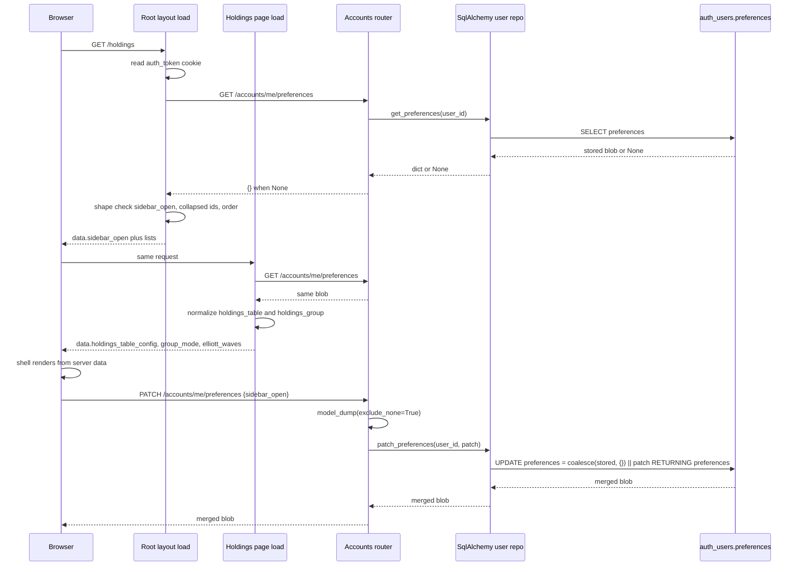

# User Preferences Contract

Every persisted UI choice — sidebar state, chart style, indicator settings, holdings
columns, drawings — lives in one per-user JSON blob. There is no preferences table:
the blob is a single nullable column on the user row, exposed through three endpoints
on the accounts router, and read by the frontend from exactly two places (the root
layout load and the holdings page load) plus a handful of component-level fetches.
This page is the contract: what is stored, how partial writes merge, who owns which
key, and how the whole thing degrades when it is unavailable.

Related pages: [Charting](../architecture/charting.md),
[Frontend Architecture](../architecture/frontend.md),
[Domain Boundaries](../architecture/domains.md),
[Configuration](../architecture/configuration.md),
[Accounts and Holdings Views](../workflows/accounts-and-holdings-views.md),
[Security Workspace](../workflows/security-workspace.md).

## Storage: one column, no schema

`UserModel` (`auth_users`) carries `preferences: Mapped[dict | None]` as a nullable
`JSON` column (`src/auth/model.py`). Nothing constrains its contents in the database,
so the effective schema lives in code, in three places that must stay in sync:

1. the backend request model `src.account.api_types.UserPreferences`,
2. the frontend interface `UserPreferences` in
   `frontend/src/lib/api/userPreferencesService.ts`,
3. the per-key normalizers that components apply after reading.

The backend model is deliberately permissive: it declares a typed subset
(`timeframe`, `chart_style`, `indicators`, `sidebar_open`, `holdings_period`,
`elliott_waves`, `fibonacci_tools`, `wave_settings`, `watchlist_order`,
`watchlist_sort`) and sets `model_config = ConfigDict(extra="allow")`, so a PUT/PATCH
body carrying any other key (for example `holdings_table`, `holdings_group`,
`drawings`, `chart_hide_labels`, `indicator_pane_heights`,
`collapsed_watchlist_ids`, `sidebar_watchlists`) still validates and is persisted
verbatim. That is what makes adding a frontend-only preference a no-backend-change
operation.

## Endpoints and merge semantics

All three routes live on `account_router` (`prefix="/accounts"`) in
`src/account/router.py` and depend on `current_user`, so an unauthenticated request
returns 401 before any service is touched.

| Method | Path | Behavior |
| --- | --- | --- |
| `GET` | `/accounts/me/preferences` | Returns the stored blob, or `{}` when the user has none. |
| `PUT` | `/accounts/me/preferences` | Replaces the whole blob with the non-null fields of the body, then re-reads and returns the stored value. |
| `PATCH` | `/accounts/me/preferences` | Merges the non-null fields of the body into the stored blob and returns the merged result. |

Two details dominate the semantics.

**`exclude_none=True` on both writes.** The router calls
`payload.model_dump(exclude_none=True)` before handing the dict to `UserApi`. An
explicit JSON `null` is therefore dropped rather than stored, and — critically — a
field omitted from the body is indistinguishable from a field sent as `null`. A
client can clear a *key* only by sending a replacement value for it (for example an
empty object or an empty array), never by sending `null`.

**PATCH is a shallow top-level JSONB merge.** `SqlAlchemyUserRepository.patch_preferences`
runs one `UPDATE ... RETURNING` whose new value is

```python
func.coalesce(cast(UserModel.preferences, JSONB), cast({}, JSONB)).op("||")(cast(preferences, JSONB))
```

i.e. `COALESCE(stored, '{}') || patch`. The consequences:

- Keys present in the patch replace the stored value **entirely**. The merge is
  shallow, so patching `indicators` with `{"rsi": ...}` discards every other
  indicator; callers must send the whole map. The same is true of `wave_settings`,
  `drawings`, `fibonacci_tools`, `holdings_table` and `indicator_pane_heights`.
- Keys absent from the patch survive. This is what makes the feature work at all:
  the sidebar, the holdings page, the indicator group, and the chart drawings
  service all PATCH independently from different components, and concurrent writes
  to *different* keys do not clobber each other. `test_preferences_patch_cross_component_isolation`
  walks exactly that sequence (sidebar → timeframe → chart style → indicators → sidebar).
- The `coalesce` is what makes PATCH legal for a user with no stored blob yet;
  `test_preferences_patch_from_empty` covers it.
- The return value is the post-merge row read back from the same statement, so PATCH
  callers see the full merged blob, not the patch they sent.

`PUT` by contrast writes `preferences=<dict>` outright, so it is the one operation
that can silently delete keys the caller did not know about. Nothing in the frontend
uses `savePreferences` in production paths; it exists in the service (`savePreferences`)
and is exercised only by `userPreferencesService.test.ts`. Prefer PATCH.

Writes are not concurrency-safe at the *same-key* level: two simultaneous PATCHes to
one key are last-writer-wins, and because the merge happens in a single SQL statement
there is no read-modify-write window to lose (unlike a naive read/merge/PUT). This
is also why several helper modules deliberately pack a whole sub-object under one
top-level key — see `saveHoldingsTableConfig` and `saveHoldingsGroupMode`, whose
comments call out that a single `holdings_table`/`holdings_group` key "can't race
with other preference writes".

## The frontend service

`frontend/src/lib/api/userPreferencesService.ts` defines `UserPreferences` and
`UserPreferencesService extends ApiClient` with `getPreferences`,
`savePreferences` (PUT) and `patchPreferences` (PATCH), all against
`/accounts/me/preferences`. Every method takes an optional `tokenOverride` which,
when supplied, adds an `Authorization: Bearer <token>` header; without it the client
relies on the `auth_token` cookie (`credentials: 'include'`). That override is how
server loads authenticate — see below.

Two exports matter for instance hygiene: `getUserPreferencesService(customFetch?)`
builds a fresh instance, and `userPreferencesService` is the module-level singleton.
`ApiClient` already picks the right base URL per environment
(`VITE_INTERNAL_API_URL` on the server, `VITE_API_BASE_URL` in the browser), so the
service can be constructed on either side.

The `UserPreferences` interface is the union of every key any component owns:

```
timeframe, chart_style, indicators, sidebar_open, sidebar_watchlists,
collapsed_watchlist_ids, holdings_period, elliott_waves, fibonacci_tools, drawings,
wave_settings, chart_hide_labels, watchlist_order, holdings_table, holdings_group,
indicator_pane_heights
```

Key types are re-exported from the finance/drawing modules (`SecurityElliottWaves`,
`SecurityFibonacciTools`, `SecurityDrawings`, `WaveSettings`, `HoldingsTableConfig`,
`HoldingsGroupMode`) so components do not import the finance layer merely to type a
preference patch. `chart-preferences.ts` additionally exposes
`mergeChartPreferences(prefs, partial)`, a read-merge-write helper that preserves the
`indicators` key (defaulting it to `{}`) around a partial update.

## Ownership split: who loads what, and why

The rule is **first-render keys load on the server; everything else loads lazily from
the component that owns it.** Only two server loads touch preferences.

**Root layout (`frontend/src/routes/+layout.server.ts`)** owns the shell keys:
`sidebar_open`, `collapsed_watchlist_ids`, `watchlist_order`. It calls
`getUserPreferencesService(fetch).getPreferences(token)` with the token read from the
`auth_token` cookie (the browser-side helpers are token-less, so SSR must pass it
explicitly), and returns them alongside `locals.user`. Defaults are decided before
the fetch: `sidebar_open = true`, `collapsed_watchlist_ids = []`,
`watchlist_order = null`. Guarded reads keep a malformed blob from leaking into the
shell: `sidebar_open` is accepted only when it is a `boolean`, and the two list keys
only when `Array.isArray` is true.

`+layout.svelte` seeds `let sidebarOpen = $state(untrack(() => data.sidebar_open ?? true))`
and binds it to `Sidebar.Provider`; its `onOpenChange` handler PATCHes
`{ sidebar_open: open }` fire-and-forget (`.catch(console.error)`), and only when
`data.user` exists. `AppSidebarWatchlist` reads `collapsed_watchlist_ids` and
`watchlist_order` from the layout data (context overrides win for tests), and each
collapse toggle PATCHes the full `collapsed_watchlist_ids` array. The watchlists
route PATCHes `{ watchlist_order: newOrder }` and rolls both local snapshots back on
failure.

**Holdings page (`frontend/src/routes/holdings/+page.server.ts`)** owns three
page-scoped keys: `holdings_table`, `holdings_group`, `elliott_waves`. It reads the
token from cookies the same way, converts each raw value through the shared
normalizer (`normalizeHoldingsTableConfig`, `normalizeHoldingsGroupMode`) and returns
`holdings_table_config`, `group_mode`, `elliott_waves`. The test asserting the exact
returned key set (`page.server.test.ts`) pins this: no other key, and never holdings
rows — the row fetch stays client-side so the page shell renders instantly.

Everything else is loaded by its owning component after navigation, always through
the singleton service:

- **Security page** — `getPreferences()` on first mount (skipped when preferences
  were already set), feeding `onPreferencesLoaded`, which applies `chart_style`,
  `timeframe`, `indicators`, `indicator_pane_heights` and hands the blob to
  `ChartDrawingsService.setPreferences`. `IndicatorsGroup` also fetches preferences
  itself and emits `onPreferencesLoaded`, so a load order between the page and the
  sidebar group decides who wins; the page guards with `if (!userPreferences)`.
- **`ChartDrawingsService`** owns the drawing keys (`drawings`, `elliott_waves`,
  `fibonacci_tools`) and PATCHes them per tool. During an active drag it buffers
  patches in `_pendingDrawingPreferences` and flushes once on drag end, so a drag
  produces one write instead of one per mouse move.
- **`holdings-modal.svelte`** reads `holdings_period` (validating against its
  `PERIODS` list, falling back to `'ALL'`) and `elliott_waves`, and PATCHes
  `holdings_period` on user selection.

## Round trip



The root layout load and the holdings page load each issue their own GET, so a
navigation to `/holdings` performs two preferences reads. Post-render writes travel
straight to the API from the component.

## Failure semantics: preferences never break a render

Preferences are treated as non-fatal everywhere they are read on a render path.

- Both server loads wrap the fetch in `try { ... } catch { }` with the defaults
  already computed, so a failure — 401, 500, network, unparseable body — returns the
  defaults and the page still renders. The holdings load's comment is explicit:
  "Preferences are non-fatal: fall back to defaults and still render holdings."
  `page.server.test.ts` asserts exactly this by rejecting `getPreferences` and
  checking the default table config, `group_mode === 'none'` and `elliott_waves === null`.
- `GET` returns `{}` rather than `null` for a user with no stored blob, and both
  loads use optional chaining on each key, so a missing key and an empty blob are the
  same case. `userPreferencesService.test.ts` covers the empty-`{}` response.
- Every stored value is passed through a shape normalizer rather than trusted.
  `normalizeHoldingsTableConfig` drops unknown column ids, clamps widths to per-column
  bounds, restores canonical column order and force-keeps the sticky column;
  `normalizeHoldingsGroupMode` accepts only explicit `'stock'`/legacy `'company'` and
  otherwise returns `'none'`; the layout load type-checks each of its three keys.
  Any unknown/legacy/corrupt value becomes the documented default.
- Component-level `load*` helpers mirror this: `loadHoldingsTableConfig` and
  `loadHoldingsGroupMode` catch a rejected request or missing key and return the
  defaults; the layout load catches its request; `holdings-modal` and
  `IndicatorsGroup` catch and fall back to `'ALL'`/`{ indicators: {} }`.
- Write failures are swallowed or surfaced as a non-blocking banner, never as an
  error page. Local state is applied optimistically first: `IndicatorsGroup` assigns
  local state *before* the await "to avoid lost-update races", the holdings page
  applies the group/column change then reports a persist failure through
  `persistError` in the shared alert, and the watchlists page is the exception that
  reverts both snapshots because a stale order would be user-visible. Drawings and
  wave/tool patches log through `console.error`.

The invariant to preserve: **a preferences outage must degrade to defaults, never to
a failed route.** Any new load or component that reads preferences keeps the
surrounding `try/catch` plus shape check.

## Extension recipe: adding a preference

1. Add the field to `UserPreferences` in
   `frontend/src/lib/api/userPreferencesService.ts` with a `| null`-tolerant type.
   The backend `UserPreferences` model already allows extras, so **no backend change
   is required** unless you want the key documented or validated server-side — in
   that case add it to `src/account/api_types.py` too (still nullable, still
   `extra="allow"`).
2. Patch from the owning component: `patchPreferences({ my_key: value })`. Send the
   whole sub-object for that key, because the JSONB `||` merge replaces keys wholesale.
   If the key is a per-security map, key it by security id and patch the full map so
   a concurrent write for another security is not lost.
3. Add a server-load field **only if the value drives the very first render**. Shell
   chrome belongs in `+layout.server.ts`; page-scoped first-paint state belongs in
   that page's `+page.server.ts`. Both must (a) read the `auth_token` cookie and pass
   it as `tokenOverride`, (b) compute the default before the fetch, (c) type/shape
   check the stored value, and (d) sit inside the existing `try/catch`. Anything
   lower-value loads from the component in an effect instead.
4. Add a normalizer if the value is structural (arrays of ids, records with bounds,
   enum-like strings) and route both the load path and the write path through it, so
   the persisted shape and the rendered shape cannot drift.
5. Extend the tests: a round-trip/partial-merge case in `tests/routers/test_accounts.py`,
   a rejection-fallback case in the relevant `*.test.ts`, and — for a new server-load
   key — an exact-returned-keys assertion like the holdings `page.server.test.ts` one.

## Tests that pin the contract

- `tests/routers/test_accounts.py` — `test_preferences_empty` (`{}` for a fresh
  user), `test_preferences_roundtrip`, `test_preferences_partial_update` (no
  fabricated defaults), `test_preferences_isolated` and
  `test_preferences_patch_isolated_across_users` (per-user isolation via the API),
  `test_preferences_patch_from_empty`, `test_preferences_patch_partial_merge`,
  `test_preferences_patch_cross_component_isolation` (independent component writes
  survive), plus per-key round trips for `sidebar_open`, `holdings_period`,
  `elliott_waves`, `fibonacci_tools`, `wave_settings` and
  `watchlist_order`/`watchlist_sort`. `test_preferences_wave_settings_roundtrip`
  states the shallow-merge rule in its comment: the top-level key is replaced
  entirely.
- `tests/routers/test_account_unauth.py` — GET, PUT and PATCH all return 401 without
  a token.
- `frontend/src/lib/api/userPreferencesService.test.ts` — method/path/body assertions
  for GET, PUT and PATCH, `tokenOverride` on all three, empty-`{}` handling, and
  `mergeChartPreferences` preserving unrelated keys.
- `frontend/src/routes/layout.test.ts` — `collapsed_watchlist_ids` and
  `watchlist_order` read from preferences, and their defaults when absent.
- `frontend/src/routes/holdings/page.server.test.ts` — exact returned key set,
  "never loads holdings in the server load", and graceful fallback when preferences
  reject.
- `frontend/src/lib/components/holdings/holdings-table-prefs.test.ts` and
  `holdings-group-prefs.test.ts` — single-key persistence and tolerance of rejected
  reads.
