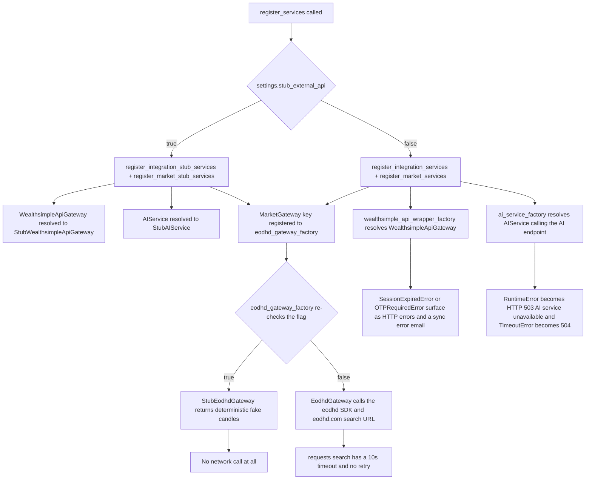

# External Services & Adapters

This page is the boundary catalogue: every dependency that leaves the process, the
adapter class that owns it, how the adapter is selected, how it fails, and what an
agent must not break when touching it. Per-request control flow belongs to
[Architecture](../architecture/overview.md); the `Settings` model and the `svcs`
registry are detailed in
[Configuration, Dependency Injection & Cross-Cutting Runtime](../architecture/configuration.md).

Everything outbound is reached through an abstract interface resolved from the `svcs`
registry — `MarketGateway`, `BrokerApiGateway`, `AIService`, `PriceRepository`,
`EmailService`, `IndicatorServiceClient` — never through a direct vendor SDK call at a
call site. That indirection is what makes the stub switch (below) a one-line change.
The single deliberate exception is `EodhdPriceRepository`, which is both a repository
(Postgres) and an adapter (`MarketGateway`), showing the "repository_*.py = alternative
backend" convention described in `src/AGENTS.md`.

## The stub/live switch

`STUB_EXTERNAL_API` is the **only** mechanism that selects stub versus live adapters,
and it is read through the `settings.stub_external_api` boolean (default `False`).
`src/config/services.py::register_services` branches on it once:

```python
if settings.stub_external_api:
    register_integration_stub_services(registry)
    register_market_stub_services(registry)
else:
    register_integration_services(registry)
    register_market_services(registry)
```

Both branches register the **same abstract keys** with different factories, so no
caller changes. The concrete stub classes registered by the stub path are:

| Abstract key | Live factory | Stub class registered |
|--------------|--------------|-----------------------|
| `MarketGateway` | `eodhd_gateway_factory` (→ `EodhdGateway`) | `StubEodhdGateway` (via the factory re-check) |
| `PriceRepository` | `eodhd_price_repository_factory` | same — it wraps `eodhd_gateway_factory` |
| `AIService` | `ai_service_factory` (→ `AIService`) | `StubAIService` (`src/stubs/ai.py`) |
| `WealthsimpleApiGateway` | `wealthsimple_api_wrapper_factory` | `StubWealthsimpleApiGateway` (`src/stubs/wealthsimple.py`) |

Two details matter when changing anything here:

- The stub registrations are imported **lazily inside the function bodies** of
  `register_integration_stub_services` / `register_market_stub_services`. This is
  deliberate: importing the stub modules eagerly would pull vendor SDKs
  (`ws_api`, `eodhd`) onto the wrong path. Keep the local imports local.
- `eodhd_gateway_factory` **re-checks** `settings.stub_external_api` itself and returns
  `StubEodhdGateway` when the flag is set — even when the *live* registration path runs.
  So there are two independent checks for the EODHD gateway. They must stay consistent:
  flipping one without the other silently changes which `MarketGateway` callers receive.

`tests/conftest.py` sets `os.environ["STUB_EXTERNAL_API"] = "true"` **before** importing
the app, so the whole suite resolves stubs and needs neither EODHD, Wealthsimple, nor AI
credentials. Note `STUB_EXTERNAL_API` is *not* present in `.env.example`: the dev Compose
stack therefore runs against the **live** adapters, with `EODHD_API_KEY="demo"`,
`AI_API_KEY=""` and `AI_API_MODEL=""` as the only provided values.



Caption: adapter selection under stub versus live mode, and where each boundary's
failures surface — broker session errors inside the sync task, AI failures at the
router, and EODHD failures at the repository or search route.

## EODHD market data

`MarketGateway` (`src/market/gateway.py`) is the abstract contract: `search`,
`get_price_on_date`, `get_prices`, and `get_intraday_prices`. Two implementations exist.

**Live — `EodhdGateway` (`src/market/eodhd.py`).** Constructed with
`settings.eodhd_api_key`. `search` is a raw `requests.get` against
`https://eodhd.com/api/search/{query}?api_token=...&fmt=json` with `timeout=10` and **no
retry loop**; the API key travels in the query string. The price methods go through the
`eodhd.apiclient.APIClient` SDK and rebuild `HistoricalPrice` / `IntradayHistoricalPrice`
from pandas frames, converting every numeric to `Decimal(str(...))` and logging an error
and skipping any row whose index is not a `pandas.Timestamp` (for `get_prices`).
`get_intraday_prices` supports **only `interval="1h"`** and raises `ValueError` for
anything else; it also drops all-zero OHLCV candles (`open == high == low == close` with
`volume == 0`), which is how the vendor represents non-trading hours.
`get_price_on_date` swallows an `IndexError` (empty frame, e.g. a market holiday) and
returns `None` rather than raising.

**Stub — `StubEodhdGateway` (`src/stubs/eodhd.py`).** Deterministic and offline:
`StubEodhdAPIClient` seeds `random` from `hash(symbol)` and steps prices by a
hash-derived percentage, so the same symbol always yields the same series. It ships a
hard-coded base-price table (`US:AAPL`, `US:MSFT`, `US:NFLX`, `TO:RY`, `TO:XYR`, `TO:RYT`,
`US:GOOGL`, `US:TSLA`, `US:AMZN`, `TO:TD`) and falls back to `100.0` for unknown symbols,
so any symbol you invent still produces plausible data. `search` recognizes a
`.`- or `:`-delimited query, knows AAPL/MSFT/RY/TD, and otherwise fabricates a
`SecuritySearchResult` with a synthetic ISIN. Intraday generation caps at
`MAX_INTRADAY_STEPS = 10000` and emits a zero-volume flat candle at
`MARKET_CLOSE_HOUR = 16`.

**Where EODHD is consumed.** `EodhdPriceRepository` (`src/market/repository_eodhd.py`)
decorates the SQLAlchemy `PriceRepository`: reads go to the database first, and only a
miss triggers a gateway call, after which the fetched prices are `save_prices`-ed back.
The two write methods (`save_price`, `save_prices`) deliberately `raise NotImplementedError`
— the wrapper is read-through, never a write target. `get_latest_price` computes the last
NYSE trading day using the `holidays.NYSE()` calendar (skipping weekends), and only
refreshes when the stored price is older than that. `SecurityApi.get_or_create_from_broker`
(`src/market/api.py`) calls `gateway.search` and fronts it with `SecuritySearchCache`;
`market_search` in `src/market/router.py` does the same for the HTTP search route.
`SecuritySearchCache` (`src/market/cache.py`) keys on a normalized query
(`market:search:<lowercased, whitespace-collapsed query>`) with a 30-day default TTL, and
**never raises on Redis failure** — `get` returns `None` and `set` logs a warning, so a
Redis outage degrades to hitting EODHD every time rather than failing the request.

Broker-to-EODHD symbol translation happens in `SecurityApi`
(`_map_eodhd_symbol` / `_map_eodhd_exchange`): the broker's `primaryExchange` maps
`CSE → CA`, `TSX → TO`, `NYSE → US`, `NASDAQ → US`, and `.` is rewritten to `-`.
`SecurityApi` passes an unknown exchange through unchanged, whereas the
`WealthsimpleApiGateway` twin of this method indexes the dict directly and raises
`KeyError` for an unmapped exchange — the two are not interchangeable.

**Failure mode.** Neither `search` nor the gateway calls translate vendor errors: a
network or HTTP error propagates out of the route (or out of the daily/hourly price Huey
task, which counts it as a `failure`). There is no circuit breaker and no caching of
negative results.

## Wealthsimple brokerage

`BrokerApiGateway` (`src/integration/brokers/__init__.py`) is the abstract broker
contract — `login`, `get_accounts`, `get_positions_by_account` — and it also holds the
institution's keyring prefix and `InstitutionEnum`. Only one institution is implemented;
`src/integration/api.py::get_broker_gateway_class` maps
`InstitutionEnum.WEALTHSIMPLE → WealthsimpleApiGateway` and raises `KeyError` for any
other id, so adding an institution means extending that dict *and* registering the class.

**Live — `WealthsimpleApiGateway` (`src/integration/brokers/wealthsimple.py`)** wraps the
external `ws-api` package (`WealthsimpleAPI`, `WSAPISession`). Sessions are persisted per
user in the OS keyring under `<keyring_prefix>.<username>` / key `"session"`, with
`_keyring_prefix = "retail_portfolio_wealthsimple"`. `login` is a two-stage
credential dance: first it tries the cached session and probes it with `get_accounts()`;
if no session exists it calls `ws.login_internal(username, password, otp, persist_session_fct=self._save_session)`.
It wraps `ws.send_get` to capture the last raw response before re-raising, so an
`UnexpectedException` is logged with the actual HTTP payload — useful when the vendor
changes shape. `login` performs **synchronous** I/O but is declared on the same
interface as the async `get_accounts` / `get_positions_by_account`.

Parsing is defensive and lossy by design: closed accounts
(`status != "open"`) and unmapped `unifiedAccountType` values are skipped rather than
faulting; the cash pseudo-security `sec-c-cad` is skipped ("not yet supported"); a
position whose `primaryExchange` is `None` is skipped; and the vendor bug that wraps
security ids in `[]` is worked around by `security_id[1:-1]`. Currency is **inferred from
the exchange** (`NYSE`/`NASDAQ` → `USD`, everything else → `CAD`). Malformed *shapes*
(market data or identity positions that are not a `dict`/`list`) raise `UnknownError`
instead of being skipped.

Error translation lives in `src/integration/brokers/exception.py`, where all broker
errors descend from `ExternalAPIError`: `ws_api`'s `LoginFailedException` →
`LoginFailedError`, `OTPRequiredException` → `OTPRequiredError`, `ManualLoginRequired` →
`SessionExpiredError`, anything else → `UnknownError`, and a missing keyring entry →
`SessionDoesNotExistError`. `src/integration/task.py` maps each of these to a
user-facing sentence in `_SYNC_ERROR_MESSAGE_MAPPING` and emails it through
`EmailService.send_external_account_error_email`, so a broker auth failure becomes both
a `sync_failed` WebSocket event and a "reconnect your account" email.

`wealthsimple_api_wrapper_factory` additionally accepts `debug_api_responses` and
`debug_dump_path`, which log or dump the raw vendor JSON. `debug_dump_path` writes to an
arbitrary path with no redaction — **treat it as a local debugging aid only; the dumped
payload contains account balances and holdings.**

**Stub — `StubWealthsimpleApiGateway` / `StubWealthsimpleAPI` (`src/stubs/wealthsimple.py`).**
`login` always succeeds, `get_accounts` returns three fixed accounts (one deliberately
`closed` so parsing paths are exercised), and `get_account_balances` returns a
`sec-c-cad` cash entry alongside real positions. It uses a distinct keyring prefix
(`retail_portfolio_wealthsimple_stub`) and, unlike the live gateway, **skips** malformed
payloads instead of raising.

### Security caveat: plaintext keyring

`BrokerApiGateway.__init__` calls `keyring.set_keyring(PlaintextKeyring())` from
`keyrings.alt.file`, i.e. every Wealthsimple session token is stored **unencrypted on
disk**, guarded only by a `# TODO secure this before staging deployment` comment. Any
change that adds a new broker, a new credential, or a new session field inherits this
storage. Do not describe this as secure, and do not copy the pattern into new code
without changing it.

Related: the session payload is what `ws_api` uses to authenticate subsequent calls, so a
user whose keyring entry is missing or stale must re-run `login` with credentials; there
is no silent refresh path in this adapter.

## AI analysis endpoint

`AIService` (`src/market/ai_service.py`) talks to any **OpenAI-compatible** chat
completions endpoint through `AsyncOpenAI`, built as
`AsyncOpenAI(api_key=settings.ai_api_key, base_url=settings.ai_api_endpoint.replace("/chat/completions", ""))`.
That `.replace` is what lets `AI_API_ENDPOINT` be either a bare base URL
(`https://ai.havek.es/api`) or a full completions path — keep it in mind before changing
how the setting is spelled.

The service gathers its own context (`_gather_context`): the security record, the latest
price, up to 50 of the user's notes for that security, and prices from the 1st of the
previous month minus 90 days to today (only the last 30 are sent). Three public methods
share one private call path — `analyze_fundamentals`, `summarize_notes`,
`analyze_portfolio_fit` — and `summarize_notes` short-circuits to a literal
`"No notes found for this security."` without calling the API at all.

Behavior worth knowing before editing `_call_ai_api`:

- `temperature=0.7`, `max_tokens=2000`, `timeout=60` for analyses; the title generator
  uses a **hard-coded `model="gpt-4-turbo"`**, `temperature=0.3`, `max_tokens=20`,
  `timeout=10` and ignores `ai_api_model`.
- Any exception from the SDK is re-raised as
  `RuntimeError(f"AI service unavailable: {e!s}")`, and the router maps that to
  **HTTP 503** (`TimeoutError` maps to **504 "AI analysis timed out"**). Empty content
  raises `RuntimeError`; non-string content raises `TypeError`.
- DeepSeek-style ` thinking...` blocks are stripped from the content before return.
- `generate_note_title` is the **only** AI call with a fallback: on any failure it logs
  and returns the note content truncated to `MAX_TITLE_LENGTH = 50`, so note creation
  never fails because of the AI provider. It is invoked from the Huey task
  `generate_note_title_task`, not inline in the request.
- AI routes are rate-limited at `5/minute` each.

**Stub — `StubAIService` (`src/stubs/ai.py`)** accepts `*args, **kwargs` and returns three
fixed markdown strings, one per method. It deliberately exposes all three methods so it is
a drop-in for `AIService` in the container.

## SMTP email

`EmailService` (`src/core/email.py`) renders Jinja2 templates from
`src/templates/email/` (HTML + text pairs: `verify_email`, `price_alert`,
`external_account_error`, all extending `base`) and sends via `aiosmtplib.SMTP` using
`settings.smtp_host`, `smtp_port`, `smtp_use_tls`, `smtp_user`, `smtp_password` and
`smtp_sender_email`. The flow is `connect()` → optional `starttls()` → optional `login()`
(only when both user and password are set) → `send_message()` → `quit()`. There is **no
connection pooling** — a source `TODO` flags it as a decision to revisit if hourly alert
volume justifies it — so every email opens and closes its own connection.

Every send method is a coroutine, and `send_email` wraps *any* failure into
`EmailSendError("Failed to send email")`. Callers decide how much that matters:
`_send_sync_error_email` in `src/integration/task.py` catches it and only logs, because
the sync failure itself must still surface.

`settings.frontend_url` is interpolated into the verification link, the price-alert
deeplink (`{frontend_url}/security/{security_id}`) and the external-account error deeplink
(`{frontend_url}/accounts`), so a wrong `FRONTEND_URL` produces working emails with broken
links.

In the dev Compose stack `SMTP_HOST="mailcrab"` / `SMTP_PORT=1025` point at the
`marlonb/mailcrab` service — an email sink, published on `MAILCRAB_PORT` (default `8003`)
at `/`. Nothing is delivered externally; anything that *looks* delivered in dev is in
Mailcrab.

## Redis

Redis is the shared coordination layer, reached through the module-level
`redis_manager = RedisManager(settings.redis_url)` singleton
(`src/core/redis.py`) for the indicator cache, security-search cache, account sync status,
WebSocket pub/sub and the Huey broker. `RedisManager` keeps **one client per running event
loop** in a lock-guarded dict, pruning and closing clients whose loop has closed and
lazily creating a `decode_responses=True` client for the current loop — that loop-keyed
design is what lets the same singleton serve the request loop, the pub/sub listener and
`asyncio.run()` task loops. Two consumers deliberately diverge:
`indicator_cache_factory` builds its own client from `settings.redis_url` with
`decode_responses=False` (binary-safe indicator payloads), and
`security_search_cache_factory` passes the shared manager instead.

Boundaries and keys an agent should not break:

- **Indicator cache** — key `indicators:<security_id>:<interval>:<chart_style>:<sha256 digest>:<price_count?>`,
  TTL 3600s, invalidated by `SCAN` over `indicators:*<security_id>*` or flushed wholesale.
  Cache misses/errors return `None` and log; they never raise.
- **Search cache** — `market:search:<normalized query>`, 30-day TTL; payloads are validated
  back into `SecuritySearchResult` and an unexpected shape is treated as a miss.
- **Account sync status** — `account_syncs:active:<user_id>`, a Redis set of account ids
  with `settings.sync_ttl_seconds` (default 300) expiry. The TTL is the safety net for a
  worker that dies mid-sync.
- **WebSocket pub/sub** — channel `ws_messages`, payload `{"user_id": ..., "message": ...}`.
  `ConnectionManager.send_personal_message` publishes so *any* process can deliver, and
  falls back to local-only delivery if Redis is unreachable; the listener task restarts
  itself after a 5s delay on unexpected error.
- **Huey broker** — `RedisHueyWithRegistry("retail-portfolio", url=settings.redis_url)`,
  swapped for `MemoryHueyWithRegistry` when `environment == "test"`.

## Indicator sidecar (Go, HTTP)

The FastAPI backend is the only client of the Go indicator service
(`services/indicator-service`, built on `github.com/cinar/indicator/v2`). The service is a
stateless calculator: `POST /compute` takes `{interval, candles, indicators}` and returns
`{"indicators": {<resultKey>: [points]}}`, where the result key is the spec's `id` when set
and its `type` otherwise. Too few candles yields an **empty series and HTTP 200**, not an
error. Request bodies are capped at 10MB, and an unsupported indicator type is a `400`.
`GET /health` is the liveness probe both Compose files poll with `wget` every 30s.

On the backend, `IndicatorServiceClient` (`src/market/service.py`) is created by
`indicator_service_client_factory` from `settings.indicator_service_url`, owns one
long-lived `httpx.AsyncClient` (default timeout 10.0s) reused across calls, and closes it
only if it created it — an injected client stays open (`_owns_client`). Its error mapping
is the contract the tests pin down:

| Service outcome | Backend response |
|-----------------|------------------|
| `httpx.TimeoutException` | `504` "Indicator service timed out" |
| `httpx.ConnectError` / `httpx.NetworkError` | `503` "Indicator service unavailable" |
| `400` | `400` with the service's `error` text as `detail` |
| `5xx` | `503` "Indicator service unavailable" |
| any other non-`200` | that status, response text as `detail` |

**Security caveat: the sidecar is unauthenticated.** It exposes no auth and no rate
limiting, and its README states plainly that it is intended for the internal Docker
network only and must never be exposed publicly. Dev Compose publishes it on
`${INDICATOR_SERVICE_PORT:-8085}` → container `8080` for convenience; sharing that port
beyond localhost hands out an unauthenticated compute endpoint.

Configuration is `INDICATOR_SERVICE_URL` (Compose sets
`http://indicator-service:8080`; `Settings` defaults to `http://localhost:8080`).
Note the client is registered identically on **both** registry paths — the stub switch
does not touch it, because the sidecar is local infrastructure, not a third-party API.

## Configuration reference

| Variable | Setting | Consumed by |
|----------|---------|-------------|
| `EODHD_API_KEY` | `eodhd_api_key` | `EodhdGateway` construction, EODHD SDK and search URL |
| `AI_API_ENDPOINT` | `ai_api_endpoint` | `ai_service_factory` base URL |
| `AI_API_KEY` | `ai_api_key` | `AsyncOpenAI` credentials |
| `AI_API_MODEL` | `ai_api_model` | analysis calls only (title generation hard-codes a model) |
| `INDICATOR_SERVICE_URL` | `indicator_service_url` | `indicator_service_client_factory` |
| `SMTP_HOST` / `SMTP_PORT` / `SMTP_USE_TLS` / `SMTP_USER` / `SMTP_PASSWORD` / `SMTP_SENDER_EMAIL` | same names | `EmailService.send_email` |
| `FRONTEND_URL` | `frontend_url` | deeplinks and verification links inside emails |
| `REDIS_URL` | `redis_url` | `redis_manager`, indicator/search caches, Huey broker, pub/sub |
| `SYNC_TTL_SECONDS` | `sync_ttl_seconds` | account-sync status TTL |
| `STUB_EXTERNAL_API` | `stub_external_api` | registry branch and `eodhd_gateway_factory` (tests only; absent from `.env.example`) |

Secrets come from the root `.env` (copied from the tracked `.env.example`, gitignored
once copied) and from the process environment, which wins over the file — `Settings`
pins `env_file=(".env",)` with `extra="ignore"`. `SECRET_KEY` is validated at import time:
outside `dev`/`test` it must be at least `MIN_SECRET_KEY_LENGTH = 32` characters or
`Settings()` raises. No external-service credential is read at startup; a bad
`EODHD_API_KEY` or `AI_API_KEY` therefore surfaces later, either as a failed resolution, a
vendor error on first use, or — with `STUB_EXTERNAL_API=true` — as a stubbed response that
hides the misconfiguration entirely. **Changing these values requires a container
restart**, because the backend and worker load `.env` at process start.

## Testing rule for outbound clients

Repository-wide and mandatory (`src/AGENTS.md`): **backend tests must not depend on
external services** — no Redis, no HTTP APIs (EODHD, broker APIs), no SMTP, no DNS
resolution. Mock every outbound client and stub *every* method the code under test calls.
A test that performs a real network, Redis or SMTP call is broken by definition; do not
"fix" it by expecting the service to be up. The one allowed infrastructure dependency is
the ephemeral PostgreSQL container from `testcontainers`. See
[Testing](../operations/testing.md).

The mechanisms already in place, in preference order:

- **Global env switch** — `STUB_EXTERNAL_API=true` in `tests/conftest.py` before the app
  import.
- **In-memory Redis** — the autouse `fake_redis_manager` fixture
  (`tests/fixtures/redis.py`) replaces `src.core.redis.redis_manager.client` (and the
  `src.auth` module-level references) with `FakeRedis`; `mock_redis_storage` exposes the
  backing store for assertions. Reuse it rather than adding a Redis dependency.
- **Vendor stubs** — `StubEodhdGateway` / `StubEodhdAPIClient`,
  `StubWealthsimpleAPI` / `StubWSAPISession`, `StubAIService` (`src/stubs/`).
- **Monkeypatched factories** — `tests/fixtures/auth.py::auth_client` replaces
  `src.market.eodhd.eodhd_gateway_factory` with `MockEodhdGateway` (patched on the source
  module, because `src/market/__init__.py` imports the name for DI) and neuters
  `EmailService.send_verification_email`.
- **`httpx.MockTransport`** — `tests/market/test_indicator_client.py` drives
  `IndicatorServiceClient` through a mock transport to assert the 504/503/400 mapping, and
  `tests/market/test_indicator_compute_api.py` patches `IndicatorServiceClient.compute`
  directly.
- **`unittest.mock.patch`** — `tests/email/test_email_service.py` patches
  `src.core.email.aiosmtplib.SMTP` for every send path; `tests/routers/test_notes.py` uses
  `AsyncMock(spec=AIService)` so the AI client is never constructed.

## Extension points

- **New outbound dependency**: define an abstract interface, a live adapter, a stub in
  `src/stubs/`, a factory that branches on `settings.stub_external_api` (or is registered
  from the stub function), and register both paths in the domain's `register_*_services`.
- **New broker institution**: extend `get_broker_gateway_class`, add a `BrokerApiGateway`
  subclass with its own keyring prefix and `InstitutionEnum`, map its vendor errors onto
  `ExternalAPIError` subclasses, and add a sentence to `_SYNC_ERROR_MESSAGE_MAPPING` if the
  user needs actionable guidance.
- **New indicator type**: it belongs in the Go sidecar, not in Python — extend the Go
  calculator and its `type` alias table; the backend only forwards specs.

## Related pages

- [Configuration, Dependency Injection & Cross-Cutting Runtime](../architecture/configuration.md) —
  the `Settings` model and the full registry.
- [Authentication](../architecture/authentication.md) — where `SECRET_KEY` comes from and
  how tokens are signed/verified.
- [Testing](../operations/testing.md) — fixtures and the no-external-services rule.
