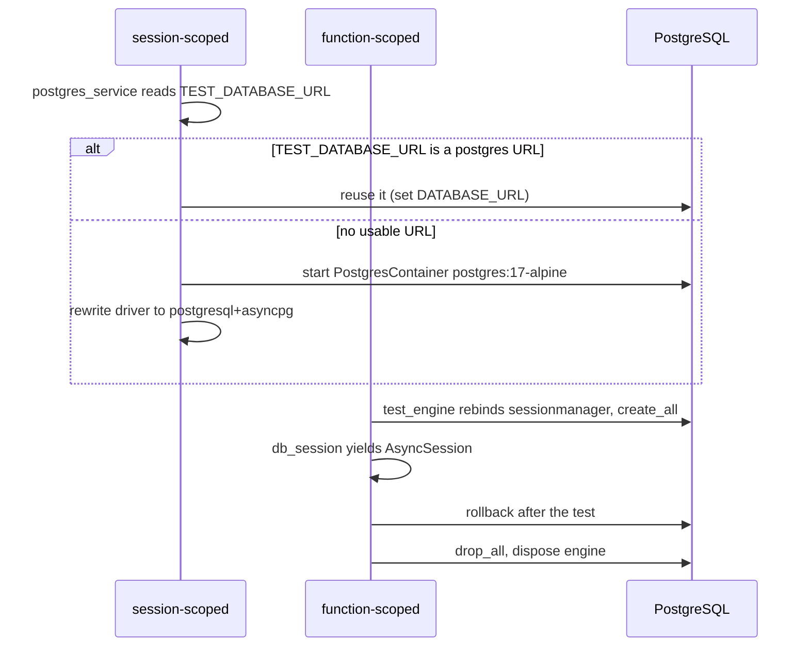
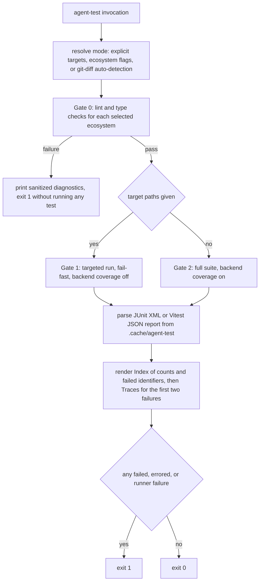

# Testing & Verification

## The one non-negotiable rule

Tests must never depend on external services. Redis, HTTP APIs (EODHD, broker APIs), SMTP and DNS are all mocked or stubbed; the ephemeral PostgreSQL instance provided by `testcontainers` (or an explicit `TEST_DATABASE_URL`) is the **only** allowed infrastructure dependency. `src/AGENTS.md` states the rationale: CI runs without a Redis server, so a test that dials `redis://redis:6379/0` only passes inside Docker where the Compose hostname resolves, and otherwise fails with `socket.gaierror`/`ConnectionError` and takes the suite down with it. **A test that performs a real network, Redis or SMTP call is broken by definition** — mock it, never "fix" it by expecting the service to be up.

The same rule applies on the frontend: `frontend/AGENTS.md` requires mocking **all** API calls, because CI runs without a backend and an unmocked `fetch` fails with `ECONNREFUSED`.

## Backend tests (pytest)

Tests live in `tests/` and run against PostgreSQL. `pyproject.toml` owns the pytest configuration:

- `pythonpath = [".", "src"]`, `cache_dir = "./.cache/pytest"`.
- `addopts` is tuned for low-volume output: `-q`, `--tb=line`, `--no-header`, `--no-summary`, `--disable-warnings`, `--show-capture=no`.
- Coverage is always on: `--cov=src` with `--cov-report=json:coverage.json` and `--cov-report=` (the terminal report is suppressed so agents can read the JSON artifact instead).

`[tool.coverage.run]` sets `source = ["src"]`, `branch = true` and omits `tests/*` and `migrations/*`; `[tool.coverage.report]` uses `show_missing = true` with the usual `pragma: no cover` / `__main__` / `NotImplementedError` / `TYPE_CHECKING` exclusions.

### Suite layout

The tree is organized by domain **and** by architectural layer, mirroring the DDD layout of `src/`:

| Path | Focus |
|------|-------|
| `tests/routers/` | FastAPI endpoint tests — auth (incl. 2FA/passkey/token revocation), accounts, portfolios, market, chart snapshots, CSV inspect/import endpoints, integration, documents, notes, sync status, rate limiting, worker dashboard, unauthenticated access |
| `tests/services/` | Service/API-layer behaviour — auth APIs and services, account service and API, position API, market service, CSV account service |
| `tests/repositories/` | SQLAlchemy repository tests (`test_repository_sqlalchemy.py`) |
| `tests/tasks/` | Huey task tests — account, integration, market, and Redis concurrency |
| `tests/market/` | Market domain: indicators (pure math, caching, client, compute API), Heikin-Ashi, EODHD gateway, security API and search cache, price alerts (repository, evaluation service, dispatch task), plus `tests/market/commands/` for CLI commands |
| `tests/account/` | Account model/sync behaviour, plus `tests/account/commands/` and `tests/account/csv/` (CSV parser) |
| `tests/auth/commands/` | Auth CLI commands (`create_test_user`, `create_test_token`) |
| `tests/integration/brokers/` | Broker integration tests driven by `StubWealthsimpleAPI` / `StubWSAPISession` from `src/stubs/wealthsimple.py` |
| `tests/email/` | Email service and template rendering, with `src.core.email.aiosmtplib.SMTP` patched in every test |
| `tests/ws/` | WebSocket `ConnectionManager` and router |
| `tests/fixtures/` | Shared fixtures (`auth.py`, `account.py`, `market.py`, `redis.py`) |
| Root-level files | `test_main.py` (app startup, health probes, error handlers), `test_settings.py`, `test_logging.py`, `test_request_id.py`, `test_migrations_autogenerate.py` |

### Environment set before app import

`tests/conftest.py` writes the environment *before* importing anything from `src`, so settings validation and the app factory see a test configuration:

```python
os.environ["SECRET_KEY"] = "7bb26bc4200000a69d07fa542933ef7256c1e47462f9c5a2f9c1dcf562b482f9"
os.environ["ENVIRONMENT"] = "test"
os.environ["STUB_EXTERNAL_API"] = "true"
```

It then re-exports the fixture modules with `from tests.fixtures.<module> import *`, which is why `db_session`, `auth_client`, `test_user`, `fake_redis_manager`, and the rest are available suite-wide without an explicit import.

### Database lifecycle and isolation



Database fixture lifecycle: one session-scoped PostgreSQL (reused via `TEST_DATABASE_URL` or started with testcontainers) and a per-test engine that creates and drops the schema.

- `postgres_service` (session scope) reuses `TEST_DATABASE_URL` when it contains a Postgres URL (also exporting it as `DATABASE_URL`), otherwise starts a throwaway `PostgresContainer("postgres:17-alpine")` and rewrites the connection string to the `postgresql+asyncpg` dialect. The host Docker socket is mounted into the backend container (with a matching `group_add` Docker GID) precisely so testcontainers can work from inside Compose.
- `test_db_url` simply exposes that URL.
- `test_engine` (function scope) creates an engine, **rebinds `sessionmanager._engine` and `sessionmanager._sessionmaker`** to it so application code under test shares the same database, runs `BaseModel.metadata.create_all`, and after the test runs `drop_all` and disposes the engine. This is schema-per-test: there is no in-memory or SQLite path anywhere in the fixtures.
- `db_session` (function scope) yields an `AsyncSession` and `rollback()`s at the end.
- `seed_reference_data` inserts the reference rows — `AccountTypeModel` (TFSA, RRSP, FHSA, Non-Registered) and `InstitutionModel` (Wealthsimple with `csv_format=WEALTHSIMPLE_CSV_FORMAT`) — and commits them.

### Global mocks

`global_mocks` (session scope, `autouse=True`) exists to keep the suite free of Redis and Huey. It:

- forces `huey.immediate = True` on `src.worker.huey`, so enqueued tasks execute synchronously in-process and the queue never touches a broker;
- `patch.object`es `ConnectionManager.init_redis`, `close`, `send_personal_message` and `send_personal_message_sync` on the **class**, covering every loop-scoped instance, and stashes the real methods as `_orig_*` attributes so `tests/ws/test_manager.py` can still exercise them directly;
- patches `src.main.init_worker_dashboard` and `src.main.close_worker_dashboard`.

The docstring records why the `src.main` patches matter: `main.py` binds those names at import time, and without patching them the lifespan creates real `AsyncRedis` connections whose `aclose()` times out for roughly four seconds per test.

### Redis fake

`tests/fixtures/redis.py` provides the autouse `fake_redis_manager` fixture (function scope). It builds a `FakeRedisManager` whose `client()` async context manager yields a `FakeRedis` — a dict-backed async stand-in implementing `get`, `set` (including `nx`/`ex`), `setex`, `getdel`, `delete`, `incr`, `expire`, `scan`, `ping`, `publish`, `sadd`/`srem`/`smembers` and `aclose`. The fixture `monkeypatch.setattr`s the `client` attribute on **three** singletons — `src.core.redis.redis_manager`, `src.auth.api.default_redis_manager` and `src.auth.service.default_redis_manager` — because auth (token denylist, 2FA/passkey challenges), the security search cache and integration sync status all import those same objects. Tests that need to assert on stored state request `mock_redis_storage`, which returns the backing `FakeRedis` (for example `tests/routers/test_auth.py` checks that logout writes a `token:deny:` key). Tests that deliberately exercise the real `RedisManager` construct their own instance — see `tests/tasks/test_redis_concurrency.py`, which also patches `redis.asyncio.from_url` — and are unaffected.

### HTTP/clients and email

`tests/fixtures/auth.py` supplies the request-level clients and the outbound stubs:

- `MockEodhdGateway` implements `MarketGateway` (search, `get_price_on_date`, `get_prices`, `get_intraday_prices`) returning fixed payloads and delegating search to `StubEodhdGateway`; `auth_client`/`client` monkeypatch `src.market.eodhd.eodhd_gateway_factory` to return it (patched in the source module because `src/market/__init__.py` imports from there for DI registration).
- Both clients also patch `EmailService.send_verification_email` to a no-op async function, so router tests never reach SMTP.
- Both use `LifespanManager(app)` plus `httpx.AsyncClient` over `ASGITransport` against the real FastAPI app with `base_url="http://test"`. `auth_client` additionally carries `Authorization: Bearer <token>` minted through `UserApi.create_access_token`, while the bare `client` is unauthenticated. `test_user` and `other_user` persist verified users (Argon2-hashed via `_password_hasher`) for ownership/authorization tests.
- `tests/fixtures/account.py` seeds accounts, portfolios, positions, securities and integration users (including `other_user_account` for cross-user denial); `tests/fixtures/market.py` seeds watchlists and securities.

SMTP is patched at the transport boundary in `tests/email/test_email_service.py` with `patch("src.core.email.aiosmtplib.SMTP")`. Broker APIs are exercised through the `src/stubs/wealthsimple.py` stubs in `tests/integration/brokers/test_wealthsimple.py` rather than by network calls.

### Migration drift test

`tests/test_migrations_autogenerate.py` uses `postgres_service` to drop all tables plus `alembic_version`, runs `python -m alembic upgrade head`, then runs `alembic revision --autogenerate -m check`, and asserts the generated file contains no `op.<something>(` call — i.e. models and migrations are in sync. The generated file is removed in a `finally` block so the working tree stays clean.

### Running backend tests

```bash
# Inside the backend container (project rule: all dev commands run in Docker)
docker compose exec backend uv run pytest

# The same command under the agent harness (see below)
./scripts/agent-test backend
```

## Frontend tests (Vitest)

`frontend/vite.config.ts` defines the test block:

- `environment: 'jsdom'` with `environmentOptions.url = 'http://localhost/'`.
- `setupFiles: ['./src/setupTest.ts']`, `include: ['src/**/*.{test,spec}.{js,ts}']`.
- Output is minimized the same way the backend is: `reporters: ['dot']`, `silent: 'passed-only'`, `printConsoleTrace: false`.
- Coverage uses the `v8` provider over `src/**/*.{js,ts}` with `reporter: ['json']` and `skipFull: true`.

### The jsdom shim set

`frontend/src/setupTest.ts` is not just matcher registration — it installs five shims, each of which removes a specific way jsdom fails under SvelteKit + bits-ui:

| Shim | Lines | Why it exists |
|------|-------|---------------|
| `import '@testing-library/jest-dom/vitest'` | L1 | Registers the DOM matchers (`toBeInTheDocument`, …) used by component suites. |
| `console.warn` spy that drops only messages containing `derived_inert` | L10-L17 | bits-ui's dismissible layer (Dialog, Popover) schedules `afterSleep` timers that read derived state after the layer's effects are destroyed; Svelte's DEV-only `derived_inert` warning is library-internal noise with no app-side fix, so that one message is swallowed while every other argument is forwarded to the captured original `console.warn`. |
| `afterAll` that awaits 50 ms | L26-L28 | bits-ui's body-scroll-lock schedules a ~24 ms `setTimeout` to restore the body style when the last lock releases on unmount. If that timer is still pending when vitest destroys the jsdom environment, its callback throws `ReferenceError: document is not defined` and vitest fails the run — a race that shows up on slow CI machines. The wait runs after testing-library cleanup but before teardown. |
| No-op `Element.prototype.scrollIntoView = vi.fn()` | L36-L38 | jsdom does not implement `scrollIntoView`, but bits-ui's `Command` calls it on the active item and on the closest group heading to keep the highlighted option in view. Those calls happen asynchronously, so the rejection surfaces as `TypeError: closestGroupHeader?.scrollIntoView is not a function` — reported by vitest as unhandled errors for any test rendering a grouped Command. Tests assert on state, not scrolling. |
| `vi.stubGlobal('location', …)` | L41-L58 | Replaces `window.location` with a `URL('http://localhost/')`-derived object exposing `href`/`origin`/`protocol`/`host`/`hostname`/`port`/`pathname`/`search`/`hash` plus `assign`, `replace`, `reload` and `toString` spies, so navigation is assertable and consistent with `environmentOptions.url`. |

### Conventions

Suite files are colocated with the code they cover (`src/**/*.test.ts`) — API clients under `src/lib/api/`, utilities under `src/lib/utils/`, components next to their `.svelte` file, and route-level tests (`hooks.server.test.ts`, `routes/layout.test.ts`, `routes/security/[security_id]/page.svelte.test.ts`). Because SvelteKit runtime modules do not exist under jsdom, tests mock them explicitly with `vi.mock('$app/paths', …)`, `vi.mock('$app/navigation', …)`, `vi.mock('$app/forms', …)` and `vi.mock('$app/stores', …)`. Fetch-based clients mock `global.fetch` (see `src/lib/api/apiClient.test.ts`, which also asserts the raised `ApiError` for 401/404).

Service-layer suites follow the mandated pattern one level up: `src/lib/components/watchlist/watchlistService.test.ts` mocks the API module (`vi.mock('@/api/marketService', () => ({ getMarketService: vi.fn() }))`) and then returns a hand-built client object whose every method is a `vi.fn()` — `getWatchlists`, `createWatchlist`, `renameWatchlist`, `deleteWatchlist`, `addSecurityToWatchlist`, `removeSecurityFromWatchlist`, … — so `WatchlistService` can be driven as a plain class with no SvelteKit runtime and no network. (`@/*` maps to `./src/lib/*` through `svelte.config.js`.)

Chart tests mock the `lightweight-charts` module wholesale: `src/lib/components/charts/security-chart.test.ts` defines `Path2D` and `ResizeObserver` polyfills, then `vi.mock('lightweight-charts', …)` returning a `createChart` stub with mocked time scale, price scales, series, `attachPrimitive`, range/visible-range subscriptions and crosshair callbacks. `frontend/AGENTS.md` documents the expected depth for chart-plugin suites: state transitions, mouse-adapter hit-testing/snapping/drag lifecycle, renderer geometry and canvas draw calls, and full primitive lifecycle (`attached`/`detached`/`destroy`, `updateAllViews`, `hitTest` cursor resolution).

```bash
# Inside the frontend container
docker compose exec frontend npm run test:run
docker compose exec frontend npm run check     # svelte-kit sync + svelte-check
docker compose exec frontend npm run lint      # prettier --check . && eslint .
```

## The agent-test harness

`./scripts/agent-test` (shorthand: `just test …`) is the primary test entrypoint for agents, documented in the root `AGENTS.md` and `justfile`. It runs on the host and shells through `docker compose exec -T <service>` unless it detects it is already inside a container (`/.dockerenv`) or `--local` is passed, honouring the repo rule that dev commands run in Docker. It sanitizes output (ANSI stripping, vendor-frame removal, blank-line collapsing) and hard-caps it (`--max-chars`, default 3000).



The three-gate pipeline: Gate 0 halts before any test runs, Gate 1 is a single target with fail-fast, and Gate 2 is the full auto-detected regression.

- **Gate 0 — pre-flight lint/type.** If it fails, the harness prints sanitized diagnostics and returns 1 **without running any tests**. Backend commands: `uv run ruff check --output-format concise`, `uv run ruff format --check`, `uv run ty check --output-format concise`. Frontend commands: `npx svelte-kit sync`, `npx svelte-check --tsconfig ./tsconfig.json --output machine`, `npx eslint . -f json` (reformatted to `path:line:col: message (rule)`), `npx prettier --check .`.
- **Gate 1 — targeted iteration.** Passing a path (`./scripts/agent-test tests/routers/test_auth.py`, or `frontend/src/lib/api/apiClient.test.ts`) runs only that target with fail-fast (`pytest -x` / `vitest --bail=1`) and `--no-cov` on the backend, so the assertion detail is what you read.
- **Gate 2 — full regression.** With no targets, the ecosystems are auto-detected from the git diff (`origin/main...HEAD`, working tree, staged, untracked; `openspec/`, `openwiki/`, `.github/`, `.opencode/`, `.agent/`, `scripts/` and `frontend/node_modules/` are ignored; `src/`/`tests/`/`migrations/`/`pyproject.toml`/`uv.lock`/`alembic.ini` imply backend, `frontend/` implies frontend, and no changes means both). The suite runs without fail-fast and coverage on for the backend, and the output is rendered as an **Index** (per-ecosystem counts plus failed test identifiers, capped at 30) followed by **Traces** for the first 1–2 failures; the rest appear as one-line summaries.

Both test gates parse machine-readable reports written to `.cache/agent-test/` — JUnit XML (`backend.xml`) for pytest, Vitest's JSON reporter (`frontend.json`) for the frontend — and the process exits 1 if any test failed, errored, or the runner itself failed (including when no report was produced at all).

Flags: `--backend` / `--frontend` (full regression for one ecosystem), `--all`, `--gate0-only` (also exposed as `just check`), `--no-gate0`, `--local`, `--json` (structured output instead of prose), `--max-chars N`. `just` recipes wrap the common cases: `just test` (auto-detect), `just test-backend`, `just test-frontend`, `just test-all`, `just check`.

**Scope of the harness:** it covers the backend and frontend only. The Go indicator service under `services/indicator-service` is exercised by its own CI job (`go vet`, `go build`, `go test ./...` over `calculator_test.go`, `handlers_test.go`, `timeframe_test.go`) and is never run by the harness. The backend reaches that sidecar only through stubbed transports: `tests/market/test_indicator_client.py` builds an `IndicatorServiceClient` on top of an `httpx.MockTransport` handler (and patches `httpx.AsyncClient.post` for the client-reuse case), while `tests/market/test_indicator_compute_api.py` patches `IndicatorServiceClient.compute` with an `AsyncMock` — so the compute endpoint's candle aggregation, interval handling and error mapping are asserted without a single HTTP call.

## CI

`.github/workflows/ci.yml` runs on push to `main` and on pull request opened/synchronize/reopened, with three independent jobs.

### `backend`

Python 3.14 with `astral-sh/setup-uv`, `uv sync --dev`, then:

1. `uv run ty check`
2. `uv run ruff check && uv run ruff format --check`
3. `uv run pytest`

No Redis service and no database service are declared: Redis is replaced by the autouse fake, and PostgreSQL comes from the testcontainers fixture (which can reach the runner's Docker daemon).

### `frontend`

Node 25, `npm install` inside `frontend/`, with job-level env `VITE_API_BASE_URL`, `VITE_INTERNAL_API_URL`, `VITE_ALLOWED_HOSTS` and `JWT_SECRET`, then `npm run check`, `npm run lint`, `npm run test:run`.

### `indicator-service`

Go 1.27, `go mod download`, `go vet ./...`, `go build ./...`, `go test ./...` in `services/indicator-service`.

## Before committing

The area guides mark linting, type checks, tests and formatting as mandatory before submitting, and model edits must ship an Alembic migration.

For backend changes:

```bash
uv run ruff check
uv run ruff format
uv run ty check
uv run pytest
# model edits only
uv run alembic revision --autogenerate -m "add x to y"
```

(prefix each with `docker compose exec backend` when working from the host). For frontend changes:

```bash
npm run check
npm run lint
npm run test:run
```

Prefer the narrowest quiet validation that proves the changed behaviour — `./scripts/agent-test <path>` while iterating, and `./scripts/agent-test` (or `just test`) before finishing. The raw `docker compose exec … pytest` / `vitest` commands remain the fallback for when the harness itself is broken.
