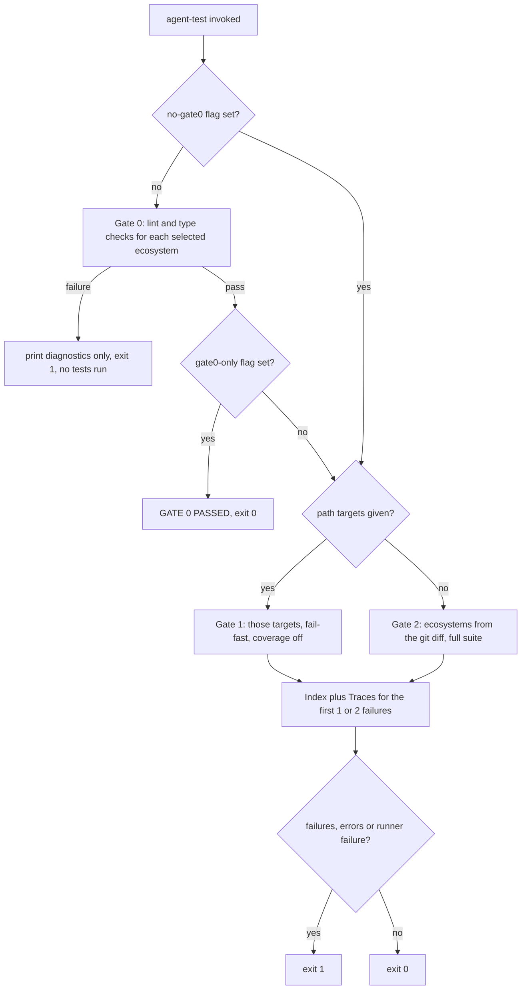
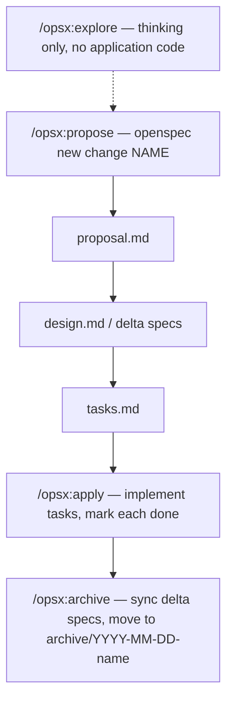

# Development, CI & Change Workflows

This page is the operational map: how the stack is run locally, which commands are
allowed to touch code, how work reaches `main` (CI, worktrees, OpenSpec changes), how it
is deployed, and how the background worker is operated. Runtime topology and per-request
flow belong to [Architecture Overview](../architecture/overview.md); the test-suite
fixtures and mocking rules belong to [Testing & Verification](./testing.md); the task
semantics of the worker belong to
[Realtime, Background Jobs & the Worker](../workflows/realtime-and-background-jobs.md).

## Constraints that hold for every change

These four rules are global; the sections below give the operational detail.

- **Docker-only commands.** Every development command runs inside a container
  (`docker compose exec <backend|frontend> <command>`). CI runs the same checks, so the host
  environment is never the reference.
- **Model edits require a migration.** Editing a backend model means generating and committing
  an Alembic revision in the same change, named `<hash>_<description>.py`; manual SQL goes
  through `op.execute()` inside a generated revision.
- **Tests never touch external services.** Redis, HTTP APIs and SMTP are mocked or stubbed;
  the testcontainers PostgreSQL instance is the only allowed infrastructure dependency.
- **Non-trivial changes go through OpenSpec**, and every OpenSpec stage exists in three tool
  mirrors (`.agent/`, `.opencode/`, `.github/`) that must be updated together.

## Local development: Docker Compose only

Docker Compose is the only supported way to run the application (`AGENTS.md`,
`README.md`):

```bash
cp .env.example .env
docker compose up -d
```

After startup:

- App / backend API: `http://localhost:8001`
- Ping: `http://localhost:8001/api/ping`; ReDoc: `http://localhost:8001/redoc`
- Frontend dev server: `http://localhost:8002` (override with `FRONTEND_PORT`)
- Mailcrab (dev email sink): `http://localhost:8003`
- Indicator service: `http://localhost:8085`

**All development commands must run inside Docker**: `docker compose exec <backend|frontend> <command>`.

### Dev stack services and ports

`docker-compose.yml` defines seven services. Published ports are Compose-interpolated
from the root `.env`, so every port below is overridable:

| Service | Image / build | Published ports | Role |
|---------|---------------|-----------------|------|
| `backend` | `ghcr.io/astral-sh/uv:python3.14-bookworm` | `${BACKEND_PORT:-8001}:8000`, `${BACKEND_DEBUG_PORT:-8090}:5678` | `uv sync && uv run uvicorn src.main:app --reload` with debugpy on 5678 |
| `worker` | same | `${WORKER_DEBUG_PORT:-8091}:5678` | `uv run -m watchfiles "huey_consumer src.worker.huey -w 2 --worker-type thread --periodic" src/` |
| `frontend` | `node:latest` | `${FRONTEND_PORT:-8002}:8100` | `npm install && npm run dev` (SvelteKit dev server) |
| `postgres` | `postgres:18` | `${POSTGRES_PORT:-5432}:5432` | Primary datastore, named volume `postgres_data` |
| `redis` | `redis:7-alpine` | — (internal) | Cache, WebSocket fan-out, Huey broker |
| `mailcrab` | `marlonb/mailcrab:latest` | `${MAILCRAB_PORT:-8003}:1080` | SMTP sink + web UI |
| `indicator-service` | `build: ./services/indicator-service` | `${INDICATOR_SERVICE_PORT:-8085}:8080` | Go indicator sidecar; healthcheck hits `http://localhost:8080/health` |

Two details matter when changing the dev stack:

- **The backend mounts the host Docker socket** (`/var/run/docker.sock`) and adds the
  host Docker group via `group_add: ["${DOCKER_GID:-959}"]`, because testcontainers-backed
  tests (those without `TEST_DATABASE_URL`) start a throwaway Postgres container. `just up`
  resolves the group id first with `scripts/docker-gid.sh`; on Docker Desktop/OrbStack that
  script asks the daemon instead of `stat`ing the host file, because the socket is remounted
  with different ownership. It prints nothing when no socket is mounted, and Compose then
  falls back to `959`.
- **Both `backend` and `worker` run as uid/gid `1000:1000`** with `UV_CACHE_DIR` and
  `UV_PROJECT_ENVIRONMENT` pointed into `/app/.cache`, so the bind-mounted repo stays
  writable and the venv survives container recreation.

### Root `.env` contract

The tracked `.env.example` at the repository root is the single configuration source;
`.env` is gitignored and must never be committed. The one file feeds three dev-stack
consumers:

- `backend` and `worker` load it via `env_file: [./.env]` and re-assert `ENVIRONMENT`.
- Compose interpolates ports/URLs (`${BACKEND_PORT}`, `${FRONTEND_PORT}`, `${DOCKER_GID}`,
  `VITE_*`, …) at `docker compose up` time, so port changes need a recreate, not a restart.
- `frontend` receives `VITE_API_BASE_URL`, `VITE_INTERNAL_API_URL`, `VITE_ALLOWED_HOSTS`,
  and `JWT_SECRET: "${SECRET_KEY:?SECRET_KEY must be set in the root .env}"` — the SSR route
  guard verifies tokens with exactly the backend signing key, and Compose fails fast if
  `SECRET_KEY` is absent.

`src/.env` and `frontend/.env` are obsolete; values must live in the root `.env`.
Variable-by-variable consumption is documented in
[Configuration, DI & Cross-Cutting Runtime](../architecture/configuration.md).

### Parallel agents: git worktree isolation

Agents working on several tasks at once **must** isolate with git worktrees, otherwise
files and Docker resources collide:

```bash
scripts/setup-agent-worktree.sh <worktree-path> <branch-name>
cd <worktree-path> && docker compose up -d
```

The script creates the worktree (branching from `origin/main` when the branch does not
exist), discovers free ports with `socket.bind(("", 0))`, seeds the worktree `.env` from
the main checkout's `.env` (falling back to `.env.example`, and failing when neither
exists), and then deterministically rewrites `COMPOSE_PROJECT_NAME` (derived from the
worktree directory name), `DOCKER_GID` and all seven published ports (`BACKEND_PORT`,
`FRONTEND_PORT`, `BACKEND_DEBUG_PORT`, `WORKER_DEBUG_PORT`, `POSTGRES_PORT`,
`MAILCRAB_PORT`, `INDICATOR_SERVICE_PORT`) — each key is deleted before being re-appended,
so re-runs leave no stale entries. Every worktree therefore gets its own Compose project,
volumes and port set.

## Testing: the agent harness first

`./scripts/agent-test` is the primary test entrypoint for agents (root `AGENTS.md`); the
`just` recipes are thin wrappers. It runs on the host and shells through
`docker compose exec -T <service>` unless it is already inside a container or `--local` is
passed, sanitizes output (ANSI stripping, vendor-frame removal, blank-line collapsing) and
hard-caps it at `--max-chars` (default 3000).

```bash
just test                       # auto-detect ecosystems from the git diff
just test tests/routers/test_auth.py
just test frontend/src/lib/api/apiClient.test.ts
just test-backend               # ./scripts/agent-test backend
just test-frontend              # ./scripts/agent-test frontend
just test-all                   # ./scripts/agent-test --all
just check                      # ./scripts/agent-test --gate0-only
just up                         # DOCKER_GID=$(./scripts/docker-gid.sh) docker compose up -d
```



Caption: the harness decision path — Gate 0 gates everything else, a path argument selects
targeted Gate 1, and a bare invocation auto-detects ecosystems for Gate 2.

Three gates with different intents:

- **Gate 0 — pre-flight lint/type.** Backend: `uv run ruff check`, `uv run ruff format --check`,
  `uv run ty check`. Frontend: `svelte-kit sync`, `svelte-check`, `eslint -f json`
  (reformatted to `path:line:col: message (rule)`), `prettier --check .`. If Gate 0 fails the
  harness halts and prints only diagnostics — **no tests run**, so fix lint/type errors first.
- **Gate 1 — targeted iteration.** A path argument (`./scripts/agent-test tests/routers/test_auth.py`)
  runs only that target with fail-fast (`pytest -x` / `vitest --bail=1`) and `--no-cov` on the
  backend. Paths typed as `backend` / `frontend` select a whole ecosystem instead.
- **Gate 2 — full regression.** With no targets, ecosystems are auto-detected from the git
  diff (`origin/main...HEAD`, working tree, staged, untracked). `src/`, `tests/`, `migrations/`,
  `pyproject.toml`, `uv.lock` and `alembic.ini` imply backend; `frontend/` implies frontend;
  `openspec/`, `openwiki/`, `.github/`, `.opencode/`, `.agent/`, `scripts/` and
  `frontend/node_modules/` are deliberately ignored; an empty diff means both ecosystems.
  Output is an **Index** (per-ecosystem counts plus failed identifiers, capped at 30) followed
  by **Traces** for only the first 1–2 failures; the rest appear as one-line summaries.

Flags: `--backend` / `--frontend`, `--all`, `--gate0-only`, `--no-gate0`, `--local`,
`--json`, `--max-chars N`. Machine-readable reports land in `.cache/agent-test/backend.xml`
(backend) and `frontend/.cache/agent-test/frontend.json` (frontend), and the exit code is 1
if anything failed, errored, or the runner itself failed.

**Scope:** the harness covers backend and frontend only. The Go service under
`services/indicator-service` is exercised by its own CI job.

### Raw per-ecosystem commands (fallback)

When the harness itself is broken, run the underlying commands inside the containers —
these are the same checks the harness and CI perform.

Backend (`docker compose exec backend …`):

```bash
uv run pytest
uv run ruff check
uv run ruff format --check
uv run ty check
uv run ruff format
uv run alembic revision --autogenerate -m "message"
```

Frontend (`docker compose exec frontend …`):

```bash
npm run dev
npm run build
npm run check
npm run lint
npm run test:run
```

### Migration rules

`src/AGENTS.md` makes migrations mandatory: **editing a backend model requires generating
and committing an Alembic migration**. All migration files must follow the standard
`<hash>_<description>.py` naming. For hand-written SQL, create a normal revision with the
autogenerate command and use `op.execute()` inside it rather than hand-authoring the file.

`migrations/env.py` imports every domain `model` module so all tables register on
`BaseModel.metadata`, and overrides `sqlalchemy.url` from `DATABASE_URL`, rewriting
`postgresql+asyncpg://` to synchronous `postgresql://` for Alembic's sync engine. Adding a
model class to an already-imported module needs no change here; adding a whole new domain
model module does. `tests/test_migrations_autogenerate.py` fails the suite when models and
migrations drift: it drops the schema, upgrades to head, runs an autogenerate and asserts the
generated revision contains no `op.` call.

## CLI commands: seeding and market-data flush

Both admin commands are run inside the backend container and are idempotent-by-lookup
(they select before inserting rather than relying on constraint violations):

- **`python -m src.commands.seed` (`src/commands/seed.py`)** — always seeds reference data
  (`AccountTypeModel` and `InstitutionModel`). Only when `settings.environment == "dev"` does
  it additionally seed the test user (`test@example.com` / `test`), sample securities,
  accounts, positions, portfolios and integration users; in other environments it prints
  `Skipping dev-only seeding (users, securities, accounts, etc.)` and commits only the
  reference rows.
- **`python -m src.commands.flush_market_data`** — mutually exclusive `--security-id <uuid>`
  or `--all`. It counts rows in `PriceModel` and `IntradayPriceModel`, requires an
  interactive `[y/N]` confirmation, deletes the rows, and then invalidates the matching
  indicator cache (per-security `invalidate_security` or `flush_all`). This is the reset path
  when cached indicator/price history must be rebuilt from EODHD.

## Background jobs and the Huey dashboard

The `worker` container is the only process that consumes the Huey queue. Operationally
there are three things to know: how the consumer runs, where its service registry comes
from, and how the dashboard is mounted. Task semantics — schedules, the price-update
enqueue cascade, retry policy and the Redis pub/sub fan-out — live in
[Realtime, Background Jobs & the Worker](../workflows/realtime-and-background-jobs.md).

**How the consumer runs.** Dev runs
`uv run -m watchfiles "huey_consumer src.worker.huey -w 2 --worker-type thread --periodic" src/`
so edits restart the consumer and the periodic scheduler is armed. The prod compose file
runs `huey_consumer src.worker.huey -w 2 --worker-type thread` — no `watchfiles`, no
`--periodic`.

**Where the registry is built.** `src/worker.py` builds the Huey instance — `MemoryHuey` in
`test`, `RedisHuey` otherwise — and its `on_startup` handler registers the worker's own
`svcs` registry (with a `NullPool` session manager, to avoid "operation in progress" errors
across `asyncio.run()` cycles) and imports the task modules `src.account.task`,
`src.integration.task` and `src.market.task` so their tasks register; `on_shutdown` closes
the registry. Because the registry only exists inside a running worker, task bodies guard on
`huey.svcs_registry` and resolve services through `Container(huey.svcs_registry)`.

**How the dashboard is mounted.** `src/main.py` mounts `worker_dashboard_router` at
`/worker/api`, backed by `huey-dashboard`'s task API (`/worker/api/tasks`, guarded by
`current_user`) and a WebSocket at `/worker/api/updates` that authenticates via a signed
ticket or an `auth_token` cookie/subprotocol. `init_worker_dashboard` — called from
`lifespan_context` — creates the huey-dashboard task table, binds signal handlers
(`bind_signals=True`) and starts a Redis pub/sub listener; `close_worker_dashboard` stops
the listener and closes the Redis client on shutdown. In dev the `worker` service sets
`HUEY_DASHBOARD_WORKER: 1` so the consumer process emits the signal events the dashboard
subscribes to.

## CI: three independent jobs

`.github/workflows/ci.yml` runs on push to `main` and on pull request
opened/synchronize/reopened. The jobs are independent, so a Go failure does not mask a
backend one:

| Job | Toolchain | Steps |
|-----|-----------|-------|
| `backend` | Python 3.14 + `astral-sh/setup-uv` | `uv sync --dev` → `uv run ty check` → `uv run ruff check && uv run ruff format --check` → `uv run pytest` |
| `frontend` | Node 25 | `npm install` in `frontend/` → `npm run check` → `npm run lint` → `npm run test:run`, with job-level env `VITE_API_BASE_URL`, `VITE_INTERNAL_API_URL`, `VITE_ALLOWED_HOSTS`, `JWT_SECRET` |
| `indicator-service` | Go 1.27 (cache keyed on `services/indicator-service/go.sum`) | `go mod download` → `go vet ./...` → `go build ./...` → `go test ./...` |

No Redis or database service is declared for `backend`: Redis is replaced by the autouse
fake and PostgreSQL comes from the testcontainers fixture, which is why the suite must never
dial a real service. There is no CI job for OpenWiki — documentation is refreshed by its own
scheduled workflow.

## Deployment surface

`docker-compose.prod.yml` keeps the same service topology but swaps dev commands for built
images, fixed ports, `restart: always` and explicit `container_name`s:

| Service | Build / image | Published ports |
|---------|---------------|-----------------|
| `backend` | `build: .` (root `Dockerfile`) | `8000:8000` |
| `worker` | `build: .` | — ; runs `huey_consumer src.worker.huey -w 2 --worker-type thread` (no `--periodic`/`watchfiles`; dev-only) |
| `frontend` | `build: ./frontend` | `80:3000` |
| `postgres` | `postgres:18` | — (volume `postgres_data`) |
| `redis` | `redis:7-alpine` | — |
| `indicator-service` | `build: ./services/indicator-service` | `8085:8080` |

There is no mailcrab service in prod, and the prod file declares no `env_file` — the
backend/worker read their configuration from the process environment.

### Images

- **Backend (`Dockerfile`)** — a two-stage build. The builder copies `pyproject.toml`/`uv.lock`
  first and runs `uv sync --frozen --no-install-project --no-dev` to leverage layer caching,
  then copies the source and runs `uv sync --frozen --no-dev` to install the project; the final
  stage copies `/app/.venv` and the source, puts the venv on `PATH`, creates a non-root
  `appuser`, and declares `EXPOSE 8000`. The `CMD` is
  `uvicorn src.main:app --host 0.0.0.0 --port 8000 --workers 4 --timeout-graceful-shutdown 30`.
  `.dockerignore` excludes `.env`, `.venv`, `.cache`, `frontend/` and caches from the build
  context.
- **Frontend (`frontend/Dockerfile`)** — `node:20-alpine` build stage (`npm ci`, `npm run build`
  with `VITE_API_BASE_URL`/`VITE_INTERNAL_API_URL` build args) into a runtime stage that runs
  `node build` on port 3000.
- **Indicator service (`services/indicator-service/Dockerfile`)** — `golang:1.27-alpine` builds a
  static binary (`CGO_ENABLED=0`), copied into `alpine:3.21` alongside `wget` (needed by the
  healthcheck) and run as a non-root user with `EXPOSE 8080`.
- `src/Dockerfile` is a separate, simpler variant of the backend image (single `uv sync --frozen
  --no-cache`, `EXPOSE 8000`, plain `uvicorn` with no worker count). Root `Dockerfile` is what
  `docker-compose.prod.yml` builds.

### Startup migrations and health probes

Migrations are not a deployment step: `lifespan_context` in `src/main.py` calls
`run_migrations()` through `asyncio.to_thread` unless `settings.environment == "test"`, and
`run_migrations()` runs `alembic.command.upgrade(Config("alembic.ini"), "head")`. **The
backend container therefore migrates the database as it starts**, so a rolling deploy runs
the upgrade on each new instance and the `postgres` service must be reachable from the
`depends_on` chain before uvicorn begins serving.

Probes (used both by Compose healthchecks and by orchestrators):

- `GET /health/live` returns `{"status": "alive"}` and is the check wired into the compose
  healthchecks and the Dockerfile `HEALTHCHECK` — it deliberately touches no dependency.
- `GET /health/ready` executes `select(1)` through the container-resolved `AsyncSession` and
  pings Redis, returning `200 {"status": "ready", "database": "ok", "redis": "ok"}` or
  `503 {"status": "degraded", …}` with per-dependency `ok`/`error` values.
- `GET /api/ping` is the human/app-level check reported in the README and quickstart.

The Go sidecar exposes `GET /health` (used by its compose healthcheck) and `POST /compute`;
it is internal-network-only with no authentication.

## Spec-driven change workflow (OpenSpec)

This repository uses OpenSpec in `spec-driven` mode (`openspec/config.yaml` declares
`schema: spec-driven`). Canonical specs live in `openspec/specs/<capability>/spec.md`
(11 capabilities today, from `account-holdings-view` through `technical-indicators`);
active changes live in `openspec/changes/<name>/` and, once archived, move to
`openspec/changes/archive/YYYY-MM-DD-<name>/`.



Caption: the four-stage lifecycle. Each stage is one slash command and one mirrored skill;
`explore` can feed `propose` but is not a required step.

### Mirrored definitions

The same four stages exist in three mirrors — there is **no `.claude/` directory**;
`CLAUDE.md` is a stub that imports `AGENTS.md`:

| Stage | Slash command | Skill |
|-------|---------------|-------|
| Propose | `.agent/workflows/opsx-propose.md`, `.opencode/command/opsx-propose.md`, `.github/prompts/opsx-propose.prompt.md` (`/opsx:propose`) | `.agent/skills/openspec-propose/`, `.opencode/skills/openspec-propose/`, `.github/skills/openspec-propose/` |
| Explore | `…/opsx-explore.md` / `.prompt.md` | `openspec-explore/` |
| Apply | `…/opsx-apply.md` / `.prompt.md` | `openspec-apply-change/` |
| Archive | `…/opsx-archive.md` / `.prompt.md` | `openspec-archive-change/` |

`.agent/skills/` and `.opencode/skills/` hold a wider catalogue beyond OpenSpec
(`architecture-review`, `commit-message`, `feature-definition`, `orchestration`, `pr-review`,
`quality-check`, `ticket-execution`, `ticket-planning`, `ticket-writing`). `.opencode/opencode.json`
names the default agent (`orchestrator`) and per-agent models. When adding an OpenSpec stage,
add all three mirrors — a change to only one silently diverges per tool.

### Rules the workflows enforce

- Create changes with `openspec new change "<name>"`, never by hand; the scaffold places
  `.openspec.yaml` in `openspec/changes/<name>/`.
- Build artifacts in dependency order, driven by `openspec status --change <name> --json`
  (`applyRequires` / `artifacts`) and `openspec instructions <artifact-id> --change <name> --json`.
  Read completed dependency artifacts before writing a new one.
- `context` and `rules` from `openspec instructions` are **agent-only constraints** and must
  never be copied into the artifact files.
- In `apply`: read `contextFiles` first, keep changes minimal, and flip `- [ ]` → `- [x]`
  immediately as each task completes; pause and ask when a task is unclear or reveals a design
  issue rather than guessing.
- In `archive`: never auto-select a change — list active changes with `openspec list --json`
  and prompt when ambiguous. Warn (and require confirmation) on incomplete artifacts or
  unchecked tasks, and compare delta specs against `openspec/specs/<capability>/spec.md`
  before offering to sync. The move is
  `mv openspec/changes/<name> openspec/changes/archive/YYYY-MM-DD-<name>` and fails if the
  target already exists.
- `explore` is a stance, not a workflow: investigation and OpenSpec artifacts are allowed,
  application code is not.

## Scheduled OpenWiki update

`.github/workflows/openwiki-update.yml` runs daily at 08:00 UTC (`cron: "0 8 * * *"`) and on
`workflow_dispatch`, with `contents: write` and `pull-requests: write` permissions:

1. Check out the repository; set up Node 22.
2. `npm install --global openwiki`.
3. `openwiki code --update --print` with `OPENWIKI_PROVIDER=openai-compatible`,
   `OPENAI_COMPATIBLE_BASE_URL=https://opencode.ai/zen/go/v1`, `OPENWIKI_MODEL_ID=deepseek-v4.1-flash`
   and `OPENAI_COMPATIBLE_API_KEY` fed from the `OPENCODE_API_KEY` secret. The step also sets
   `NODE_OPTIONS: --import ./scripts/opencode-go-session-fetch.mjs`, a preload shim that wraps
   global `fetch` to add the `x-opencode-session` header the provider cannot send itself
   (and a non-generic user agent) for requests to `opencode.ai`.
4. `peter-evans/create-pull-request@v7` opens a PR on the `openwiki/update` branch limited to
   `add-paths: openwiki` (`docs: update OpenWiki`).

Documentation therefore lands through review, never as a direct commit to `main`.

### What the OpenWiki block in `AGENTS.md` instructs

The generated `openwiki/` tree is refreshed by this workflow, and the OpenWiki block at the end of
`AGENTS.md` (delimited by `<!-- OPENWIKI:START -->` / `<!-- OPENWIKI:END -->`, imported wholesale
by the `CLAUDE.md` stub) declares a **retrieval-first** consumption policy for agents:

- **Do not enumerate, preload, or search wikis at task start.** `openwiki/` is just-in-time
  context, not required startup reading. Retrieval applies when the user asks for it, when
  unfamiliar architecture or dependency behavior materially affects the task, or when source
  inspection leaves an important uncertainty — and it stops once the question is grounded.
- When those conditions apply and the retrieval tools are available, `openwiki_search` supplies
  just-in-time context and `openwiki_read` returns the relevant complete sections. A
  `workspace_required` response means asking which listed workspace to use and retrying with its
  ID; `openwiki_list_workspaces` / `openwiki_list_wikis` exist for discovering workspace
  membership itself.
- When the retrieval tools are unavailable, the fallback is to read `openwiki/quickstart.md` and
  follow its links to the relevant pages.
- **Source code and tests stay authoritative.** A brief's unknowns and review items are
  verification gaps, not automatic requirements.
- Prefer the narrowest quiet validation that proves the changed behavior, and preserve complete
  failure output.
- Do not hand-edit generated OpenWiki pages unless explicitly asked; update source code and docs
  instead and let the scheduled workflow regenerate them.

That block is the authoritative statement of consumption policy — if it and this page disagree
about how the wiki is meant to be used, the block wins.
