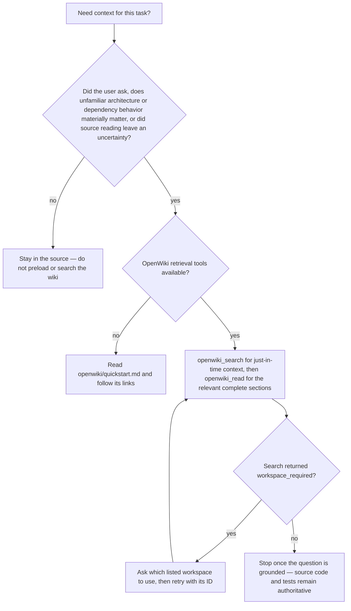

# Quickstart & Task Routing

`retail-portfolio` is a portfolio tracker for retail investors: a Python 3.14 / FastAPI
backend (`src/`) with SQLAlchemy 2 async models over PostgreSQL and Alembic migrations, a
Huey worker on Redis (`src/worker.py`), a SvelteKit 2 / Svelte 5 SSR frontend
(`frontend/`), and a stateless Go indicator sidecar (`services/indicator-service/`). Local
development is Docker Compose only; the backend, worker, Compose interpolation and the
frontend dev server all read one root `.env` copied from the tracked `.env.example`.

`AGENTS.md` is the root guide: it delegates backend work to `src/AGENTS.md` and frontend
work to `frontend/AGENTS.md`. `CLAUDE.md` is a one-line stub that imports `AGENTS.md` via
`@AGENTS.md` and adds no guidance of its own.

## Run it

```bash
cp .env.example .env
just up        # or: docker compose up -d
```

`just up` starts the stack with the host Docker socket's real group id (discovered by
`scripts/docker-gid.sh`, overridable with `DOCKER_GID`), which is what lets
testcontainers-backed tests inside the containers reach the daemon.

| Service | URL / purpose | Host port (root `.env` override) | Container port |
|---|---|---|---|
| backend | `http://localhost:8001` — `/redoc`, `/api/ping`, `/health/live`, `/health/ready`, Huey dashboard at `/worker/api` | `BACKEND_PORT` | `8000` |
| frontend | `http://localhost:8002/` | `FRONTEND_PORT` | `8100` |
| mailcrab (dev SMTP inbox) | `http://localhost:8003` | `MAILCRAB_PORT` | `1080` |
| indicator service | `http://localhost:8085` — stateless Go indicator calculator | `INDICATOR_SERVICE_PORT` | `8080` |
| PostgreSQL | `localhost:5432` | `POSTGRES_PORT` | `5432` |
| debugpy | `localhost:8090` (backend) / `localhost:8091` (worker) | `BACKEND_DEBUG_PORT`, `WORKER_DEBUG_PORT` | `5678` |
| Redis | not published — reachable only on the Compose network as `redis:6379` | — | — |

Every one of those ports is Compose-interpolated from the root `.env`, so change ports
there rather than in `docker-compose.yml`. `src/.env` and `frontend/.env` are obsolete —
move any custom values into the root `.env` and delete them.

`worker` is a separate container from `backend`: it runs
`huey_consumer src.worker.huey -w 2 --worker-type thread --periodic` under `watchfiles`
reload, so task changes are picked up without restarting Compose. Nothing in a request
path runs those tasks, and the dashboard API is mounted on the backend app, not the
worker — see [Realtime, Background Jobs & the Worker](./workflows/realtime-and-background-jobs.md).

Two configuration details bite when ports change: the frontend service receives
`JWT_SECRET` derived from the root `SECRET_KEY` (Compose fails fast if `SECRET_KEY` is
unset), and `CORS_ALLOW_ORIGINS` in `.env.example` names `http://localhost:8101` while the
dev frontend is published on `8002` — dev still works because the backend sets
`allow_origin_regex=r"https?://.*"` for any non-prod environment, but in prod that regex is
`None` and the origin list must be correct.

CI (`.github/workflows/ci.yml`) runs the same verification in three jobs: backend
(`uv run ty check`, `ruff check` + `ruff format --check`, `pytest`), frontend
(`npm run check`, `npm run lint`, `npm run test:run`) and indicator-service
(`go vet`, `go build`, `go test`).

## Where things live

| Path | What it owns |
|------|--------------|
| `src/` | FastAPI backend, split into domains (`account`, `auth`, `market`, `integration`, `ws`) plus cross-cutting `core`, `config` and `worker_dashboard` |
| `frontend/` | SvelteKit SSR app: routes, services, API clients, components |
| `services/indicator-service/` | Go indicator sidecar (stateless calculator) |
| `migrations/` | Alembic revisions (configured as the Alembic `script_location`) |
| `tests/` | Backend pytest suites, organized by domain and layer |
| `src/stubs/` | Stub external gateways used by tests and `STUB_EXTERNAL_API` mode |
| `src/commands/` | Seeding and market-data flush CLI entrypoints |
| `openspec/` | Canonical capability specs and active/archived change artifacts |
| `scripts/` | `agent-test` harness, `setup-agent-worktree.sh`, `docker-gid.sh`, the OpenWiki preload shim (`opencode-go-session-fetch.mjs`) |
| `.github/workflows/` | CI (`ci.yml`) and the scheduled OpenWiki refresh (`openwiki-update.yml`) |

## If you are changing X, read Y

| You are changing… | Read |
|---|---|
| Anything at the system level: processes, startup, request flow, layer rules | [Architecture Overview](./architecture/overview.md) |
| A backend domain: add a route/service/repository, or touch `account`, `auth`, `market`, `integration`, `ws`, `core` | [Backend Domains](./architecture/domains.md) |
| `Settings`, the root `.env` contract, the `svcs` registry, DB/Redis managers, middleware | [Configuration, DI & Cross-Cutting Runtime](./architecture/configuration.md) |
| SvelteKit routes, `load`/form actions, API clients, runes-based services, SSR pitfalls | [Frontend Architecture](./architecture/frontend.md) |
| The chart surface: chart mount/series lifecycle, panes and pane heights, timeframe/chart style, indicator overlays, chart settings, price alerts | [Charting: Chart Surface, Panes & Indicators](./architecture/charting.md) |
| Drawing tools: series-primitive plugins and helpers, finance math, drawing persistence/undo-redo, chart snapshots and the rewind timeline | [Chart Drawings, Plugins & Rewind](./architecture/chart-drawings-and-rewind.md) |
| Anything persisted per user: the `/accounts/me/preferences` contract, key ownership, merge/`exclude_none` semantics | [User Preferences](./concepts/user-preferences.md) |
| Signup/login, the `auth_token` JWT, 2FA/TOTP, passkeys, ownership authorization, the WS ticket | [Authentication & Authorization](./architecture/authentication.md) |
| The holdings read path: the accounts dashboard, `/accounts/[id]`, cross-account `/holdings`, holdings table columns/grouping/preferences | [Accounts & Holdings Views](./workflows/accounts-and-holdings-views.md) |
| Broker connect, Wealthsimple login/OTP, position import and the Huey sync task | [Broker Connect, Import & Position Sync](./workflows/broker-sync.md) |
| CSV templates, account discovery, the inspect → import → sync lifecycle | [CSV Account Import & Sync](./workflows/csv-import.md) |
| Price fetches/backfill, daily & intraday tasks, the downstream recalc/alert cascade, indicator computation | [Market Data, Indicators & the Price Update Cascade](./workflows/market-data-and-indicators.md) |
| AI context assembly, fundamentals/notes/debate endpoints, the async title task | [AI Analysis Flows](./workflows/ai-analysis.md) |
| The worker: task registries, periodic/on-demand jobs, retries, the Redis WebSocket fan-out, sync-status keys, the frontend consumer | [Realtime, Background Jobs & the Worker](./workflows/realtime-and-background-jobs.md) |
| An outbound dependency: EODHD, Wealthsimple, the AI endpoint, SMTP/mailcrab, Redis, the indicator sidecar | [External Services & Adapters](./integrations/external-services.md) |
| Money, currency conversion, totals, holdings/P&L math, rounding | [Money & Currency Handling](./concepts/money-and-currency.md) |
| How to run, ship and change: Compose stack, in-container commands, agent-test harness, worktrees, migrations, CI, OpenSpec, the OpenWiki refresh | [Development, CI & Change Workflows](./operations/workflows.md) |
| The pytest/Vitest layout, fixtures, mandatory mocking, harness gates, CI matrix | [Testing & Verification](./operations/testing.md) |
| Agent guidance and this wiki: `AGENTS.md`, `src/AGENTS.md`, `frontend/AGENTS.md`, the `CLAUDE.md` stub, the OpenWiki block and its consumption policy | [Development, CI & Change Workflows](./operations/workflows.md) |

## Non-negotiables

These rules come from `AGENTS.md`, its per-area guides (`src/AGENTS.md`,
`frontend/AGENTS.md`) and the OpenWiki block at the end of `AGENTS.md`, and hold for every
task:

- **Docker-only commands.** All development commands run inside the containers:
  `docker compose exec <backend|frontend> <command>`. The host is never the reference
  environment; CI runs the same checks.
- **Use the agent harness.** `./scripts/agent-test` (shorthand `just test`) is the primary
  test entrypoint. It runs inside Docker for you, sanitizes and caps output, and offers
  **Gate 0** (lint + type checker; halts before tests on failure), **Gate 1** (a path
  argument — targeted, fail-fast) and **Gate 2** (no path — full suite with a two-tier
  Index/Traces summary). Flags: `--backend` / `--frontend`, `--all`, `--no-gate0`,
  `--gate0-only`, `--local`, `--json`, `--max-chars N`. Raw
  `docker compose exec … pytest`/`vitest` is the fallback if the harness itself breaks.
- **Model edits require a migration.** Editing a backend model means generating the Alembic
  revision in the same change; migration files follow `<hash>_<description>.py` naming, and
  manual SQL goes through `op.execute()` inside a standard revision.
- **Tests never touch external services.** Mock all outbound I/O — Redis, HTTP APIs (EODHD,
  broker APIs), and SMTP in the backend; all API calls in the frontend. The ephemeral
  testcontainers PostgreSQL is the only allowed infrastructure dependency. A test that makes
  a real network/Redis/SMTP call is broken by definition; mock it, don't expect the service
  to be up.
- **Parallel agents isolate with git worktrees.** Use
  `scripts/setup-agent-worktree.sh <worktree-path> <branch-name>`, which discovers free ports
  and generates a worktree `.env`, before starting that worktree's Compose stack — otherwise
  files and Docker resources collide.
- **Spec-driven changes.** Non-trivial work goes through OpenSpec in `openspec/`
  (propose → apply → archive); canonical specs live in `openspec/specs/<capability>/spec.md`.
- **Source code and tests are authoritative; the generated wiki is optional context.**
  `openwiki/` is just-in-time context, not required startup reading, and its pages must not be
  hand-edited — see [Consuming the generated wiki](#consuming-the-generated-wiki).

## Consuming the generated wiki

The `openwiki/` tree is generated documentation, refreshed by the scheduled
`.github/workflows/openwiki-update.yml` workflow (daily, plus `workflow_dispatch`), which
runs `openwiki code --update` and opens a pull request on the `openwiki/update` branch
limited to `add-paths: openwiki`. Documentation therefore lands through review, never as a
direct commit. Do not hand-edit these pages unless explicitly asked: update source code and
docs and let the workflow regenerate them.

The OpenWiki block at the end of `AGENTS.md` (delimited by `<!-- OPENWIKI:START -->` /
`<!-- OPENWIKI:END -->`, and imported wholesale by the `CLAUDE.md` stub) defines how agents
are meant to use it. It is the authoritative statement of consumption policy: if it and
this page disagree, the block wins.

- **Do not enumerate, preload, or search wikis at task start.** Retrieval applies when the
  user asks for it, when unfamiliar architecture or dependency behavior materially affects
  the task, or when source inspection leaves an important uncertainty — and it stops once
  the question is grounded.
- **Use the retrieval tools when those conditions apply.** `openwiki_search` supplies
  just-in-time context; `openwiki_read` returns the relevant complete sections. If search
  returns `workspace_required`, ask which listed workspace to use and retry with its ID.
- **`openwiki_list_workspaces` / `openwiki_list_wikis`** are for when workspace membership
  itself needs to be discovered.
- **If the retrieval tools are unavailable**, read `openwiki/quickstart.md` and follow its
  links — this page and the table above are the entry point.
- **Source code and tests stay authoritative.** A brief's unknowns and review items are
  verification gaps, not automatic requirements.
- **Validate narrowly and quietly.** Prefer the narrowest validation that proves the changed
  behavior, and preserve complete failure output.



How an agent decides whether to consult the generated wiki, and what to do when retrieval needs a workspace.
