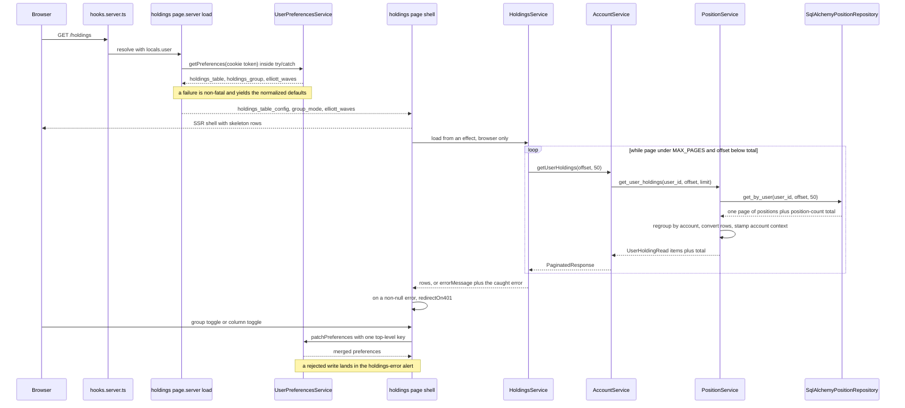
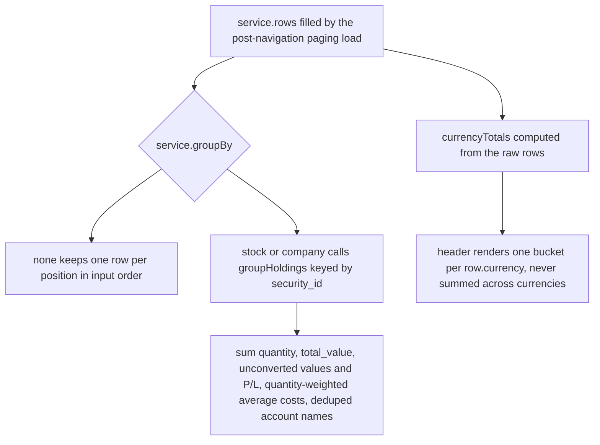

# Accounts & Holdings Views (read path)

This page owns the three read surfaces that show stored positions to a user, plus
the aggregation contract behind them. The SvelteKit shell, SSR conventions, the
post-navigation data wave and the `ApiClient` layer are described in
[Frontend Architecture](../architecture/frontend.md); the backend money/currency
model is owned by [Money & Currency Handling](../concepts/money-and-currency.md).
Neither is re-derived here.

| Surface | Route | Backing endpoint | Where the rows come from |
| --- | --- | --- | --- |
| Accounts dashboard | `/` | `GET /accounts/` plus one `GET /accounts/{id}/totals` per rendered account | `frontend/src/routes/+page.server.ts`, awaited in the load |
| Account-scoped holdings | `/accounts/[id]` | `GET /accounts/{account_id}/holdings` | `frontend/src/routes/accounts/[id]/+page.server.ts`, awaited in the load |
| Cross-account holdings | `/holdings` | `GET /accounts/holdings` (paged) plus `GET /accounts/me/preferences` | preferences only in the load; rows fetched after navigation by a page-owned `HoldingsService` |

A fourth, narrower read — `GET /accounts/holdings/{security_id}` — is consumed by
the security detail page and the holdings modal, not by these three routes; it is
described below because it shares the same service and repository contract.

## Backend read contract

Three Pydantic shapes carry the holdings responses in `src/account/schema.py`,
plus a fourth for the per-security read:

- **`HoldingRead`** — one position turned into a display row: `quantity`,
  `average_cost`, `total_value`, `profit_loss`, `currency` (the *account*
  currency), `security_currency` (position currency, falling back to security
  currency), the native `unconverted_total_value` / `unconverted_profit_loss`,
  and the account-currency `converted_average_cost` / `converted_latest_price`.
- **`UserHoldingRead`** — `HoldingRead` plus `account_id` / `account_name`. This is
  the cross-account row.
- **`AccountHoldingsRead`** — a `PaginatedResponse[HoldingRead]` (`items`, `total`,
  `offset`, `limit`) extended with `account_id`, `account_name`, `total_value`,
  `total_profit_loss`, `total_profit_loss_percent`, `net_deposits` and `currency`.
- `AccountHoldingRead` is the per-security row (`account_id`, `account_name`,
  `quantity`, `average_cost`, `total_value`, `currency`, `account_total_value`,
  `account_percentage`).

`PositionService` (`src/account/service/position.py`) is the only aggregation
layer. Every number in these shapes comes from `_calculate_holdings` /
`_calculate_holding`, which resolve each position's security and latest price and
convert through `_currency_convert` into the account currency. `get_user_holdings`
and `get_account_holdings` both call `_calculate_holdings`; neither reimplements it.

### `get_user_holdings` — cross-account

```python
positions, total = await self._position_repository.get_by_user(user_id, offset, limit)

positions_by_account: dict[AccountId, list[PositionSchema]] = {}
for position in positions:
    positions_by_account.setdefault(position.account_id, []).append(position)

result_items: list[UserHoldingRead] = []
for account_id, account_positions in positions_by_account.items():
    account = await self._account_service.get_account(account_id)
    holdings, _, _ = await self._calculate_holdings(account, account_positions)
    result_items.extend(
        UserHoldingRead(
            **holding.model_dump(),
            account_id=account.id,
            account_name=account.name,
        )
        for holding in holdings
    )

return result_items, total
```

Load-bearing properties:

1. **The endpoint pages positions, not accounts and not holdings.** `total` on
   `GET /accounts/holdings` is the *position* count (`PositionRepository.get_by_user`
   counts `PositionModel` rows joined to `AccountModel` for the user), not the
   number of accounts.
2. **A page boundary can split one account's rows.** Pagination happens in the
   repository before the service regroups by account, so an account whose positions
   straddle an offset can appear in two different pages. The service only ever sees
   the subset inside the requested window and emits compacted rows for it.
3. **`_calculate_holdings` runs per account, on the page's subset.** One
   `AccountService.get_account` call per distinct account in the page (not per
   position), then per-position security + latest-price lookups.
4. **Account context is stamped after per-row conversion.**
   `UserHoldingRead(**holding.model_dump(), account_id=account.id, account_name=account.name)`
   converts each `HoldingRead` first, so the account id/name are pure additions and
   every `HoldingRead` field keeps its `_calculate_holding` semantics.
5. **Row order is account-first-appearance**, not the repository's
   `order_by(PositionModel.id)`: the service iterates the grouped dict. Both
   surfaces sort client-side anyway.
6. **A position whose security cannot be resolved is dropped, not reported.**
   `_calculate_holdings` logs `"Security not found for position ..."` and `continue`s,
   so a page can return fewer rows than it counted. `total` still counts the
   position.

### `get_account_holdings` — account-scoped

`get_account_holdings(account_id, offset=0, limit=50)` resolves the account, then
calls `PositionRepository.get_by_account(account_id)` **without** a limit to compute
`total_value` / `total_profit_loss` over *all* positions, and only then fetches the
paginated page of positions for `items`. `total` is the account's full position
count.

Two different P&L bases meet here, which is why the header and the table body can
disagree in kind, not just in coverage:

- **Cost-based.** `_calculate_holdings` sums per-position
  `value − quantity × average_cost`, i.e. value versus the position's cost basis.
  This is what `total_profit_loss` is by default, and what the `/holdings` header
  approximates client-side from `quantity × converted_average_cost`.
- **Cash-flow-based.** When `account.net_deposits` is not `None`, the account page's
  `total_profit_loss` is *overwritten* with
  `total_value - Money(net_deposits, account.currency)`, and
  `total_profit_loss_percent` is that amount over `net_deposits`, only when
  `net_deposits != 0`. Deposits and withdrawals move this figure without any
  position changing.

Consequence for the UI: on `/accounts/[id]` the header totals cover every position
of the account while the table body covers at most one page, and the header P/L may
be a cash-flow figure rather than a sum of cost-basis gains — see the pagination
invariant below.

### `get_holdings_by_security` — per-security reads

`PositionRepository.get_holdings_by_security` selects `account_id`,
`account_name`, `quantity` and `average_cost` joined to the user's accounts, and
returns `AccountHoldingRead` stubs with `total_value=0.0` and `currency=""` as
explicit placeholders. `PositionService.get_holdings_by_security` then fills them:
`total_value = quantity * latest_close`, `currency = str(security.currency)`,
`account_total_value` from `get_total_for_account`, and `account_percentage` only
when the account total is above zero. If the security is unknown the method returns
`([], 0)` — an empty list that is ambiguous with "no holdings", flagged in a `TODO`
in the source.

### Router surface

`src/account/router.py` exposes:

- `GET /accounts/holdings` → `PositionService.get_user_holdings`, returning
  `PaginatedResponse[UserHoldingRead]`. User scoping is implicit in the repository
  join on `AccountModel.user_id`.
- `GET /accounts/{account_id}/holdings` → ownership check
  (`authorization_api.check_entity_owned_by_user`) before
  `PositionService.get_account_holdings`, returning `AccountHoldingsRead`.
- `GET /accounts/holdings/{security_id}` → `PositionService.get_holdings_by_security`.
- `GET /accounts/{account_id}/totals` → `PositionService.get_total_for_account`
  (the dashboard's per-account badge).
- `GET`/`PUT`/`PATCH /accounts/me/preferences` → `UserApi.get_preferences` /
  `save_preferences` / `patch_preferences`. `PATCH` calls
  `payload.model_dump(exclude_none=True)` and merges at the **top level** via
  SQLAlchemy `JSONB || JSONB`, so one key per write is the race-safe shape.

Pagination parameters come from `src/core/pagination.py`: `offset` defaults to `0`
and `limit` defaults to `50` with `ge=1, le=100`.

## The `/holdings` read path: preference-only SSR, post-navigation paging

`/holdings` is the one holdings surface that does **not** fetch rows in its server
load. `frontend/src/routes/holdings/+page.server.ts` reads the `auth_token` cookie
and then issues exactly one request — `getPreferences(token)` — inside a
`try/catch`, and returns three preference-derived keys:

```ts
export const load: PageServerLoad = async ({ fetch, cookies }) => {
	const token = cookies.get('auth_token');

	// Only the cheap, preferences-derived keys are awaited: holdings rows load
	// asynchronously after navigation so the page shell renders instantly.
	let holdings_table_config = normalizeHoldingsTableConfig(null);
	let group_mode = normalizeHoldingsGroupMode(null);
	let elliott_waves: Record<string, SecurityElliottWaves> | null = null;
	try {
		const prefs = await getUserPreferencesService(fetch).getPreferences(token);
		holdings_table_config = normalizeHoldingsTableConfig(prefs?.holdings_table);
		group_mode = normalizeHoldingsGroupMode(prefs?.holdings_group);
		elliott_waves = prefs?.elliott_waves ?? null;
	} catch {
		// Preferences are non-fatal: fall back to defaults and still render holdings.
	}

	return { holdings_table_config, group_mode, elliott_waves };
};
```

The rows themselves are fetched after navigation by a page-owned `HoldingsService`
instance created in `+page.svelte`, whose `load()` is triggered from a single
`$effect` (which never runs during SSR, so the fetch stays browser-only and fires
once per mount). The server load never calls `getUserHoldings`; a test pins that.



The three phases of the page's data life: a preference-only SSR load, a
browser-only sequential paging loop that fills the rows, and single-key preference
writes on user interaction.

### The paging loop lives in `HoldingsService.load()`

`frontend/src/lib/components/holdings/holdingsService.svelte.ts` is now the only
implementation of the collect-every-page contract:

```ts
const PAGE_SIZE = 50;
// Safety valve against a stale `total` from the server: never page forever.
const MAX_PAGES = 100;

async load(token?: string | null): Promise<unknown | null> {
	this.isLoading = true;
	this.errorMessage = null;

	try {
		const collected: UserHolding[] = [];
		let offset = 0;
		let total = Infinity;

		for (let page = 0; page < MAX_PAGES && offset < total; page++) {
			const response = await this.client.getUserHoldings(offset, PAGE_SIZE, token);
			collected.push(...response.items);
			total = response.total;
			offset += PAGE_SIZE;

			if (response.items.length === 0) break;
		}

		this.rows = collected;

		return null;
	} catch (error) {
		this.errorMessage = error instanceof Error ? error.message : String(error);

		return error;
	} finally {
		this.isLoading = false;
	}
}
```

- `PAGE_SIZE = 50` matches the backend `PaginationParams` default and the
  repository defaults. `MAX_PAGES = 100` caps the loop at 5 000 rows because the
  server's `total` can be stale relative to concurrent position writes.
- The loop stops early on an empty page — the second stale-total guard. Together
  the cap and the empty-page exit are why an inconsistent `total` degrades to a
  truncated list rather than an infinite request waterfall.
- Pages are requested **sequentially**, not in parallel: each iteration awaits the
  previous response, so the offsets are deterministic (`0, 50, 100, …`).
- `load()` never throws. It stores the message in `errorMessage` and *returns* the
  caught value (`null` on success) so the caller can route a 401 through the shared
  async-data seam. `isLoading` toggles around the whole loop, which is what drives
  the skeleton rows.
- On failure the previously loaded `rows` are kept (the assignment happens only
  after the loop completes), and a later success clears `errorMessage`.

### Failure semantics after navigation

`+page.svelte` owns the error policy, and it is deliberately different from the two
loads that fetch in SSR:

```ts
$effect(() => {
	void (async () => {
		const loadError = await service.load();

		if (loadError !== null) {
			await redirectOn401(loadError);
		}
	})();
});

const errorMessage = $derived(persistError ?? service.errorMessage);
```

- A 401 goes through `redirectOn401` (`$lib/api/async-data.ts`), which `goto`s
  `/auth/login?clear_session=true` and returns `true`. The httpOnly `auth_token`
  cookie is **not** deleted client-side — `hooks.server.ts` clears it when the login
  page is resolved.
- Any other error returns `false` and the message lands in the `holdings-error`
  `Alert`. The shell survives: no SvelteKit error page, and the page still renders
  its header and table.
- The same alert is used for preference-write failures (`persistError`), so a failed
  load and a failed `PATCH` are visually indistinguishable apart from their text.

By contrast, the `/` and `/accounts/[id]` loads keep the standard SSR error
contract: `ApiError` 401 → `deleteAuthCookie(cookies)` then
`redirect(303, '/auth/login?clear_session=true')`; any other `ApiError` →
`error(status, message)`; anything else → `error(500, 'Internal Server Error')`.
SSR requests pass `cookies.get('auth_token')` explicitly as a Bearer override
because `ApiClient.get` only adds `Authorization: Bearer <token>` when a token
override is supplied (it always sends `credentials: 'include'`), and the browser
cookie is not automatically replayed on the internal server-side fetch. The
client-side helpers are token-less for the same reason — same-origin browser
requests carry the cookie themselves.

## Client-side rendering: grouping, sorting, per-currency buckets

`frontend/src/routes/holdings/+page.svelte` constructs its own
`new HoldingsService()`, calls `service.setGroupBy(data.group_mode)` at
initialization, and renders `$lib/components/holdings/holdings-table.svelte` with
`holdings={service.rows}`, `isLoading={service.isLoading}`, `tableConfig` and
`elliottWaves={data.elliott_waves}`. Toggling grouping only changes
`service.groupBy` — a pure client-side derivation over the already-fetched rows, so
no refetch happens.



The diagram shows the two independent derivations from the same row set: table
grouping for the body, and per-currency bucketing for the header.

### `groupHoldings` and weighted average cost

`frontend/src/lib/utils/finance/holdings-group.ts` implements both modes:

- `none` returns one `HoldingsGroup` per row, in input order, with
  `key = id = row.id`, `account_names` from `row.account_name` and
  `account_count: 1`.
- `stock` (and the legacy alias `company`, handled identically) keys strictly on
  `security_id`, so one security held in several accounts collapses to exactly one
  row. Groups are never reordered — they follow first appearance.
- `aggregateGroup` sums `quantity`, `total_value`, `unconverted_total_value` and
  the P/L values (a `null` P/L stays `null` until a row contributes, then sums
  numerically) and computes **quantity-weighted** averages:
  `average_cost = Σ(quantity × average_cost) / Σ(quantity)` over rows with a
  non-null cost, and the same shape for `converted_average_cost` using the
  account-currency cost. `account_names` are trimmed, deduplicated and ordered by
  appearance; `account_count` counts distinct `account_id`s.
- `currency` is **hardcoded to `'CAD'`** for every group, while `security_currency`,
  `latest_price` and `price_date` are taken from the group's first row. Summing
  `total_value` across two accounts whose currencies differ therefore produces a
  number labelled CAD — see the invariants below.

`frontend/src/lib/components/holdings/holdings-table.svelte` is presentational. It
takes `holdings`, `groupBy`, `isLoading`, `emptyMessage`, `tableConfig`,
`onConfigChange` and `elliottWaves`; builds one `HoldingRowView` per displayed row
from either the grouped or the flat branch (both branches project the Elliott-wave
columns from `elliottWaves`); sorts with `sortColumn` (default `total_value`) and
`sortDirection` (default `desc`), placing null/non-finite cells last in both
directions and sorting the EW columns by upside with the target as fallback; and
renders the column set from `config.visible`. The header label for the account
column switches from `Account` to `Accounts` when grouping is on.

The Elliott Wave columns come from the `elliott_waves` preference read in the same
load (`getLatestWaveCount` / `getWaveTargetPrice` / `calculateUpsidePercentage` from
`$lib/utils/finance/elliott-wave`) — display-only projections over the same rows,
covered by [Charting, Drawing Tools & Rewind](../architecture/charting.md).

### Per-currency header totals

`+page.svelte` derives `currencyTotals` from `service.rows` (not from the grouped
rows) with a `SvelteMap` keyed by `row.currency`:

- `totalValue += row.total_value`.
- `profitLoss += row.profit_loss` and `hasProfitLoss = true` only for non-null
  values; when no row in the bucket has a P/L the bucket renders no P/L block.
- `costBasis += quantity × (converted_average_cost ?? average_cost ?? 0)`, only when
  that product is positive.
- `returnPercent = (profitLoss / costBasis) × 100` when `costBasis > 0`, otherwise
  `null` and the percentage pill is omitted.

This is the **value-versus-cost** reading of P&L (not the account page's
cash-flow-versus-deposits reading described above), computed client-side from the
already-converted row fields. Each bucket renders its own
`formatCurrency(amount, currency)` block with `data-testid="currency-total-{CUR}"`,
`currency-return-percent-{CUR}` and `currency-profit-loss-{CUR}`. The backend has
already converted every row into its own account's currency, so this is a grouping
of already-converted values — never a cross-currency sum.

## The accounts dashboard and the account-scoped page

### The accounts dashboard

`/` is the only one of the three surfaces that does not read holdings rows.
`frontend/src/routes/+page.server.ts` loads the account list with
`getAccountClient(fetch).getAccounts(token)` → `GET /accounts/`
(`AccountRepository.get_by_user`, ordered by account name) and
`frontend/src/routes/+page.svelte` renders `AccountsList` from `data.accounts`.
Each row then reads its own totals through `accounts-list-item.svelte`, whose
`AccountsListItemState.totals` derived fetches `accountClient.getAccountTotals(id)`
→ `GET /accounts/{id}/totals` → `PositionService.get_total_for_account(account_id,
account.currency)`. That method walks the account's positions, prices each one and
converts into the account currency, returning `AccountTotals` (`cost` and `value`
as `Money`). The result is cached per account inside the component state and
invalidated when an in-flight sync completes (`wasSyncing && !isSyncing`); it drives
the account's value badge, while the account name links to `/accounts/{id}`.

### The account-scoped table

`frontend/src/routes/accounts/[id]/+page.server.ts` calls
`getAccountClient(fetch).getAccountHoldings(params.id, token)` (token again from
`cookies.get('auth_token')`) → `GET /accounts/{id}/holdings` → the router's
ownership check → `PositionService.get_account_holdings`, and returns the whole
`AccountHoldingsRead` as `data.holdings`. The page renders its header from that
payload (`total_value`, `net_deposits`, `total_profit_loss`,
`total_profit_loss_percent`, `currency`) and the body through a different, simpler
presentational component, `frontend/src/lib/components/accounts/holdings-table.svelte`
(props: `holdings`, `totalAccountValue`). It has no column configuration or grouping,
sorts by any `Holding` key, shows native-currency values with the account-currency
value as a secondary line when the currencies differ, and annotates each row with
its share of the account total (`total_value / totalAccountValue`). The page renders
the table only when `data.holdings.items.length > 0`.

## Preferences persistence contract

Two preference keys drive these surfaces, both persisted through
`UserPreferencesService` (`frontend/src/lib/api/userPreferencesService.ts`) and both
declared on `UserPreferences`:

- `holdings_table` — the whole `HoldingsTableConfig` (`widths` record plus `visible`
  id list).
- `holdings_group` — the group mode (`'none' | 'stock' | 'company'`).

**One key per write.** `frontend/src/lib/components/holdings/holdings-table-prefs.ts`
and `holdings-group-prefs.ts` expose `saveHoldingsTableConfig(service, config)` and
`saveHoldingsGroupMode(service, mode)`, each issuing exactly one
`service.patchPreferences({ holdings_table: config })` /
`patchPreferences({ holdings_group: mode })`. Because the backend `PATCH` merges
the JSON body at the top level (`preferences || payload` in
`src/auth/repository_sqlalchemy.py`), writing a single top-level key cannot drop
another component's key — a concurrent `timeframe` or `sidebar_open` write survives.
Nested values are replaced wholesale, so a second writer of the *same* key is still
last-write-wins.

**Injected service, not the module singleton.** Both modules declare only a
structural `{ getPreferences(tokenOverride?), patchPreferences(prefs, tokenOverride?) }`
type, so callers and tests pass any instance instead of importing the module-level
`userPreferencesService`. This is what keeps SSR free of shared mutable state (the
"no global instances" rule in `frontend/AGENTS.md`, gotcha 3). The page holds one
`getUserPreferencesService()` instance for its write path.

**Normalize on both ends of the pipe.**

- `normalizeHoldingsTableConfig(raw)` turns anything into a usable config: missing,
  non-object or empty input returns the default config (all columns visible, default
  widths); unknown column ids are dropped in both `widths` and `visible`; widths are
  clamped by `clampColumnWidth` to the per-column min/max maps (non-finite values
  fall back to the default width); the surviving `visible` ids are re-ordered to the
  canonical `HOLDINGS_TABLE_COLUMN_IDS` order; the sticky column is force-included;
  an empty or entirely invalid `visible` list falls back to all columns; the result
  is always a fresh object that does not alias the defaults.
- `HOLDINGS_TABLE_STICKY_COLUMN_ID` is `'security_symbol'` and is never hideable:
  `toggleColumnVisibility` returns the same config object unchanged for it (only
  identity-stable, no clone), the page's column menu disables that item, and the
  table's sticky cell plus the loading skeletons are rendered off that constant.
- `normalizeHoldingsGroupMode(raw)` returns `'stock'` for `'stock'` and the legacy
  `'company'`, and `'none'` for everything else — including `'STOCK'`, numbers,
  objects and `null`. A stored `'company'` therefore still renders grouped, and the
  next save writes `'stock'`.
- `loadHoldingsTableConfig` / `loadHoldingsGroupMode` swallow a rejected
  `getPreferences()` and return the defaults; the page's own SSR path does the same
  inline (it normalizes `prefs?.holdings_table` / `prefs?.holdings_group` after a
  single `getPreferences` call rather than calling the two loaders).

**Ownership split for the table config.** The page owns `tableConfig` state and
persistence; `holdings-table.svelte` derives `config` from the `tableConfig` prop via
`normalizeHoldingsTableConfig`, keeps a local copy for immediate drag feedback, and
emits the finished config once per drag through `onConfigChange` (called on pointer
up with the clamped width). Column visibility toggles in the page's display-settings
dropdown call `saveHoldingsTableConfig` directly. Both paths route failures into
`persistError`, rendered as an `Alert` with `data-testid="holdings-error"`; the
optimistic UI change stays applied. The group toggle behaves the same way and calls
`saveHoldingsGroupMode(prefsService, mode)`.

## Invariants an editor must not break

1. **`GET /accounts/holdings` paginates positions.** Its `total` is a position
   count produced by `PositionRepository.get_by_user` (positions joined to the user's
   accounts), so `items` is a page of *positions*: one account can contribute several
   rows, and the row count in a page can be smaller than `total` even for a
   single-page response. Nothing in the payload is per-account, and no field equals
   the number of accounts the user owns.
2. **The service regroups after the page is fetched.** Because of (1), a single
   account's positions can be split across pages; per-account aggregation inside
   `get_user_holdings` therefore only ever sees the page's subset. Do not move
   grouping before pagination without revisiting the client's collect-all loop.
3. **`UserHoldingRead` conversion happens before account stamping.**
   `_calculate_holdings` runs once per account and produces `HoldingRead`s; the
   `account_id` / `account_name` fields are layered on with
   `UserHoldingRead(**holding.model_dump(), account_id=account.id, account_name=account.name)`.
   Reordering those steps (for example building rows straight from positions)
   changes `currency`, `security_currency` and every `converted_*` field for
   cross-currency accounts.
4. **The `/holdings` server load returns preferences only.** It must not start
   awaiting holdings: the shell-first contract (skeletons first, rows after
   navigation) and the post-navigation 401 path both depend on the load returning
   just `holdings_table_config`, `group_mode` and `elliott_waves`. A test asserts
   that `getUserHoldings` is never called from `load`.
5. **The client loops pages with `PAGE_SIZE = 50` and `MAX_PAGES = 100`.**
   `total` may be stale, so the loop must keep both the hard page cap and the empty
   page early exit. Both constants now live only in
   `holdingsService.svelte.ts`; adding a second copy elsewhere re-introduces the
   drift the old SSR loop had.
6. **A preferences failure is non-fatal.** The SSR read stays inside a nested
   `try/catch` that falls back to `normalizeHoldingsTableConfig(null)`,
   `normalizeHoldingsGroupMode(null)` and `elliott_waves = null`. Lifting that catch
   turns a preference outage into a failed page even though the rows load fine
   afterwards.
7. **Header totals bucket by row `currency` and are never summed across
   currencies.** The backend already converted each row into its account currency,
   so cross-bucket arithmetic would be meaningless.
8. **`groupHoldings` in stock mode labels every group `'CAD'` and sums
   `total_value` as a plain number.** With accounts in different currencies, rows
   already converted into USD and CAD are added together and displayed as CAD. This
   is the shared invariant/risk of the grouped view: the header respects currency
   buckets, the grouped body does not. Any change to per-group currencies or to
   `aggregateGroup`'s sums must be made together with the group-row rendering and
   the `currencyTotals` derivation.
9. **The account-scoped page renders one page of rows but all-position totals.**
   `AccountClient.getAccountHoldings` sends no pagination parameters, so the backend
   defaults apply (`offset = 0`, `limit = 50`), while `AccountHoldingsRead.total` is
   the account's full position count and `total_value` covers every position.
   Accounts with more than 50 positions show truncated rows next to complete header
   totals until the client passes pagination. Note also that the account header's
   P/L switches from cost-based to cash-flow-based (`total_value − net_deposits`)
   as soon as `net_deposits` is set.
10. **The sticky column stays visible.** Hiding `security_symbol` collapses the
    sticky layout: `toggleColumnVisibility` refuses it, the menu disables it, and
    `normalizeHoldingsTableConfig` re-adds it to any stored `visible` list.

## Extension points and safe-change notes

**Adding a holdings column or column id.** Add the id to
`HOLDINGS_TABLE_COLUMN_IDS`, the `HOLDINGS_TABLE_COLUMNS` entry (label +
`alignRight`), and the `HOLDINGS_TABLE_DEFAULT_WIDTHS` /
`HOLDINGS_TABLE_COLUMN_MIN_WIDTHS` / `HOLDINGS_TABLE_COLUMN_MAX_WIDTHS` maps;
`clampColumnWidth` falls back to the global min/max if a map entry is missing, so an
omitted bound degrades quietly rather than failing. Then extend `HoldingRowView`
and populate it in **both** `baseRows` branches of `holdings-table.svelte` (the
grouped branch reads from `HoldingsGroup`, so `groupHoldings` may need a matching
field), add the render branch, and add the `valueFor` case if sorting should use a
derived value. Stored configs are forward-compatible (unknown ids are dropped), but
a *new* id is absent from an existing stored `visible` list and therefore starts
hidden for users who have ever saved a config.

**Changing the sticky column.** `HOLDINGS_TABLE_STICKY_COLUMN_ID` is used by the
visibility guard, the menu's `disabled` check, the sticky cell in `holdingRow` and
the skeleton cells. Change the constant, not the call sites.

**Adding a group mode.** Extend `HoldingsGroupMode` in `holdings-group.ts`, add the
branch in `groupHoldings`, extend `normalizeHoldingsGroupMode` (unknown persisted
strings intentionally collapse to `'none'`), then wire the control in
`+page.svelte`. The `holdings_group` preference accepts any string, so old values
must keep normalizing safely. Note the page currently renders a single boolean
"Group by stock" checkbox whose checked state covers both `'stock'` and `'company'`.

**Changing page size or pagination assumptions.** `PAGE_SIZE` / `MAX_PAGES` now
exist in exactly one place,
`frontend/src/lib/components/holdings/holdingsService.svelte.ts`. The backend side
is `PaginationParams` (`limit` default 50, hard ceiling 100) and the repository
defaults (`get_by_user(..., limit=50)`, `get_by_account(..., limit=None)`).
`AccountClient.getAccountHoldings` is the one client call that does not pass
pagination, so adding `offset`/`limit` there is the change that lets the
account-scoped page render more than the first 50 positions.

**Changing what the endpoint paginates.** `PositionRepository.get_by_user` currently
pages `PositionModel` rows for the user's accounts. Switching to per-account or
per-holding pagination changes the meaning of the response's `total` and would break
invariant 1; it also lets a caller no longer recover a full cross-account view by
looping offsets, which is exactly what `HoldingsService.load` does.

**Moving data back into the load.** Reverting `/holdings` to an SSR fetch means
re-adding the paging loop to `+page.server.ts`, re-adding the `ApiError` → Kit error
mapping there, and dropping the `$effect`/`redirectOn401` path. Do not do half of
it: a load that returns both rows and a page that still reloads them doubles every
holdings request.

**Adding a preference key.** Declare it on `UserPreferences`
(`frontend/src/lib/api/userPreferencesService.ts`), read it inside the existing
non-fatal `try/catch` in `+page.server.ts` using
`getUserPreferencesService(fetch).getPreferences(token)`, pass it through the `data`
return, and persist it with a single top-level key through `patchPreferences` —
ideally via a small `load*`/`save*` helper module that takes the injected structural
service type so SSR keeps no shared instances. Add a `normalize*` function for
anything a browser could have stored in an older shape.

**Operational characteristics to preserve.** Each holdings page request fans out
into per-position security and latest-price lookups, and `get_account_holdings`
walks the account's positions twice (once unlimited for totals, once paginated).
`get_holdings_by_security` additionally calls `get_total_for_account` once per
returned row. Raising `limit`, or removing the `MAX_PAGES` cap, multiplies those
lookups; keep the safety valve and prefer fixing `total` over looping unbounded.

## Focused tests

Frontend suites are row-scoped: every API client module and framework module that
performs network or browser work is mocked (`$app/paths`, `$app/navigation`,
`$lib/api/accountService`, `$lib/api/userPreferencesService`), per the
`frontend/AGENTS.md` testing rule — the holdings suites never call the backend.
Backend suites mock every outbound dependency (`PositionRepository`,
`AccountService`, `SecurityApi`, `MarketPricesApi` as `AsyncMock`s) and never touch
the network; the router tests run against the Postgres test container.

| Suite | What it pins |
| --- | --- |
| `frontend/src/routes/holdings/page.server.test.ts` | The SSR load returns exactly `holdings_table_config`, `group_mode` and `elliott_waves` from one `getPreferences('test-token')` call; it **never** calls `getUserHoldings`; a rejected preferences request still yields `HOLDINGS_TABLE_DEFAULT_CONFIG`, `'none'` and `null` waves. |
| `frontend/src/routes/holdings/page.svelte.test.ts` | Mocks `$app/paths`, `$app/navigation`, `$lib/api/accountService` and `$lib/api/userPreferencesService`. Pins the shell-first contract (skeletons plus the persisted column config render before the async load resolves), rows appearing with no user action, sequential paging (`getUserHoldings(0, 50, undefined)` then `(50, 50, undefined)` for `total = 51`), per-currency header buckets (CAD `+3.33%` / `+$50.00`, USD `+20.00%` / `+US$20.00`) instead of summing, negative-return pill styling, zero cost basis or missing P/L degrading to no pill / no P/L block, the icon-only display-settings trigger replacing standalone controls, grouping collapsing 3 rows into 2 without calling `getUserHoldings` and un-grouping again, a persisted `group_mode: 'stock'` restoring checked state and grouped rows, toggling persisting `{ holdings_group: 'stock' }`, the empty state message, a failed load showing the `holdings-error` alert while the shell survives, a 401 calling `goto('/auth/login?clear_session=true')`, a failed persistence write showing the alert while the optimistic toggle stays applied, a server-supplied column config rendering (3 headers, custom width, hidden column), hiding a column persisting a `holdings_table` payload without that id and restoring it on a repeat toggle, and `elliott_waves` reaching the EW projection cells. |
| `frontend/src/lib/components/holdings/holdingsService.test.ts` | Initial state (`rows` empty, `isLoading` false, `groupBy 'none'`); `isLoading` toggles around one request; three pages are collected with offsets `[0, 50, 100]` and the token forwarded on every call; an empty first page stops paging (stale-total guard); a failure stores the message and keeps previous rows; non-`Error` throws are stringified; a later success clears the error; `load()` resolves `null` on success and returns the caught `ApiError(401)` otherwise; `groupedHoldings` reacts to `setGroupBy('stock' | 'company')` with merged quantity and `account_count`; `getHoldingsService(customFetch)` returns an isolated instance. |
| `frontend/src/lib/components/holdings/holdings-table.test.ts` | Presentational behaviour of the big table: sorting via header clicks (including inner-button bubbling, numeric columns, null-last, Return, EW columns), resize handles not triggering sorts, one row per holding with `/security/{id}` links, account badges and the blank-account dash, dual-currency native/account display, grouping into one row per stock with combined badges, grouped-row sorting, empty state and custom message, skeleton rows, the `Account` vs `Accounts` header swap, sticky/zebra styling, and config handling (custom widths, hidden columns, empty-state colspan, fallback for an invalid stored config). |
| `frontend/src/lib/components/holdings/holdings-table-columns.test.ts` | `clampColumnWidth` bounds, rounding and non-finite fallback; the column id/label set (no `profit_loss_percent`, EW columns present); `toggleColumnVisibility` hide/restore, canonical ordering, and identity-stable refusal to hide the sticky column; `normalizeHoldingsTableConfig` defaults for garbage input, width merge plus dropping of unknown/legacy ids, clamping, visible filtering and canonical ordering, sticky force-include, all-visible fallback for an empty list, JSON round-trip, and no aliasing of the defaults. |
| `frontend/src/lib/components/holdings/holdings-table-prefs.test.ts` | `loadHoldingsTableConfig` reads and normalizes the stored key, tolerates missing/empty/garbage configs and a rejected request, and never writes on load; `saveHoldingsTableConfig` calls `patchPreferences` exactly once with `{ holdings_table: config }`; a round-trip through the real `UserPreferencesService` against a mocked fetch hits `/accounts/me/preferences` with `GET` then `PATCH` and the exact body. |
| `frontend/src/lib/components/holdings/holdings-group-prefs.test.ts` | `normalizeHoldingsGroupMode` maps `'stock'`/`'company'` to `'stock'` and everything else to `'none'`; load tolerates missing keys and rejected requests; save patches exactly `{ holdings_group: mode }`; the real-service round-trip asserts the `GET`/`PATCH` endpoint and body. |
| `frontend/src/lib/api/accountService.test.ts` | `getUserHoldings(offset, limit, token)` builds `/accounts/holdings?offset=…&limit=…`, defaults to `0`/`50`, sends `credentials: 'include'` and forwards the token as a Bearer header — the client contract the paging loop depends on. |
| `frontend/src/lib/utils/finance/holdings-group.test.ts` | Strict one-group-per-`security_id` merging with summed aggregates, both quantity-weighted average costs, combined/deduped account names and `account_count`; `'company'` behaving as `'stock'`; first-appearance ordering; merging a security held in accounts with different currencies into one CAD-labelled row; null-safety for P/L and average cost; partial P/L summing; empty input; `'none'` producing one group per row in original order without merging. |
| `tests/routers/test_accounts.py` | `test_user_holdings_success_across_accounts` (two accounts, `total == 2`, every `HoldingRead` field plus account context present), `test_user_holdings_isolation` (another user's position is never returned), `test_user_holdings_pagination` (three positions across three accounts, `total == 3` while `limit=2` pages them disjointly), `test_user_holdings_empty` (`total == 0`, empty `items`); `test_account_holdings_success` and `test_account_holdings_isolation`; the security-holdings tests including calculated values and the zero-value default; preference round-trip, partial-merge and cross-component-isolation tests. |
| `tests/routers/test_account_unauth.py` | `GET /accounts/holdings` returns 401 without auth, alongside the unauthenticated cases for the preferences `GET`/`PUT`/`PATCH` endpoints and account rename. |
| `tests/services/test_position_service.py` | `get_user_holdings` groups the repository's positions per account, returns `UserHoldingRead` items stamped with the right `account_id`/`account_name`, preserves quantities and symbol, forwards `(user_id, 0, 50)` to `get_by_user`, and resolves the account only once per account rather than once per position. |

The neighbouring `average-cost.test.ts` and `holdings-metrics.test.ts` cover
`blendedAverageCost` and the candle/benchmark helpers; neither is used by these three
routes (they back the security detail page and the holdings modal).
