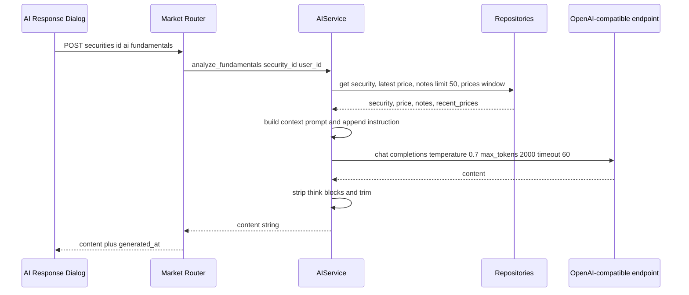
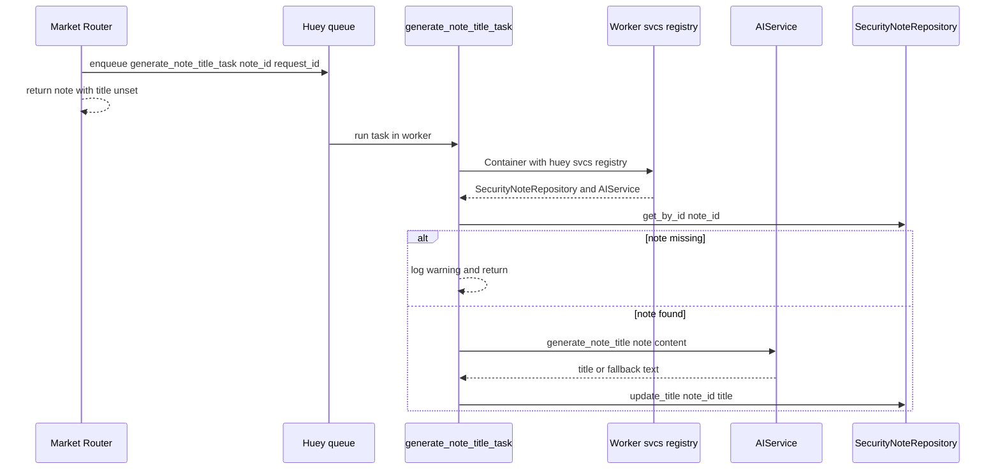

# AI Analysis Flows

The AI feature set is small and lives almost entirely in one service, `AIService` (`src/market/ai_service.py`), registered in the `svcs` container and consumed by two very different callers: three synchronous HTTP endpoints in the market router, and one asynchronous Huey task that generates note titles after a note is created or updated. Because both paths reach the same OpenAI-compatible client, the config, timeout and failure semantics described here apply to both. The transport-level details of the provider are catalogued in [External Services](../integrations/external-services.md); this page covers the flows, the payloads, and the invariants an agent must keep when editing prompts.

## Where AI sits in the stack

| Concern | Owner |
| --- | --- |
| Context assembly, prompt building, provider calls, title fallback | `AIService` (`src/market/ai_service.py`) |
| Request/response HTTP surface, rate limits, error mapping | `market_router` AI endpoints (`src/market/router.py`) |
| Async title generation and note write-back | `generate_note_title_task` / `_generate_note_title` (`src/market/task.py`) |
| Provider construction and settings | `ai_service_factory` (`src/market/ai_service.py`), registered by `register_market_services` (`src/market/__init__.py`) |
| Stub implementation | `StubAIService` (`src/stubs/ai.py`) |
| Frontend client and UI | `frontend/src/lib/api/aiService.ts`, `frontend/src/lib/components/actions-sidebar/ai/` |

## Context assembly

Every public analysis method begins with `_gather_context(security_id, user_id)`, which fans out to three repositories before any provider call:

- `SecurityRepository.get_by_id_or_fail(security_id)` — an unknown security raises rather than producing a partial prompt.
- `PriceRepository.get_latest_price(security)` — the current price, or `None` if the security has no price history.
- `SecurityNoteRepository.get_by_security_and_user(security_id, user_id, limit=50)` — the user's notes for that security, capped at 50.
- `PriceRepository.get_prices(security, from_date, to_date)` — the window starts at the 1st of the previous month minus 90 days and ends today, but only the **last 30** rows are kept.

The assembled `AIContext` is a `TypedDict` with four keys: `security` (`symbol`, `name`, `exchange`, `currency`), `current_price` (`price`, `date`) or `None`, `notes` (each `{content, created_at}`), and `recent_prices` (each `{date, close}`, already trimmed to 30 entries). Floats are converted from `Decimal`, dates to ISO strings, so the prompt never depends on provider-side serialization.

`_build_context_prompt` renders that context into plain text and then appends the caller's instruction. Three details matter when changing it:

- Only the **last 5** notes reach the model, and each note body is truncated to 200 characters.
- The price trend block computes the percentage change between the first and last of the 30 recent closes; if `recent_prices` is empty the block is omitted entirely.
- The prompt always ends with a fixed "concise, well-structured analysis" instruction, so a caller-specific prompt is additive, not a replacement.

## The three request/response endpoints

All three are `POST`, require an authenticated user (`Depends(current_user)`), are rate-limited at `5/minute`, and return the same `AIAnalysisResponse` shape (`{content, generated_at}`) where `generated_at` is a fresh `datetime.now(UTC).isoformat()` stamped in the router — not a provider timestamp.

| Endpoint | Service method | Notes |
| --- | --- | --- |
| `POST /api/v1/market/securities/{security_id}/ai/fundamentals` | `analyze_fundamentals` | No request body. Fixed prompt asking for valuation, competitive position, growth drivers and risk factors. |
| `POST /api/v1/market/securities/{security_id}/ai/summarize-notes` | `summarize_notes` | No request body. Short-circuits to the literal `"No notes found for this security."` when the user has no notes — **no provider call is made**, so this path never returns 503/504. |
| `POST /api/v1/market/securities/{security_id}/ai/portfolio-debate` | `analyze_portfolio_fit` | Takes `AIAnalysisRequest` (`portfolio_context: str \| None`). The router substitutes `"No portfolio context provided."` for a missing or empty value before calling the service. |

The frontend client `AIService` (`frontend/src/lib/api/aiService.ts`) mirrors exactly these three methods and posts `{}` as the body for the two bodyless routes. The sidebar group (`frontend/src/lib/components/actions-sidebar/ai/ai-analysis-group.svelte`) exposes them as "Explain Fundamentals", "Summarize Notes" and "Portfolio Debate"; the portfolio action currently sends the placeholder string `'Analyzing in isolation for now.'` as `portfolio_context` rather than real holdings. Results render in `ai-response-dialog.svelte`, which offers retry on failure and "Save as Note" — the latter posts to the notes endpoint and therefore itself re-triggers title generation.

### Request sequence

Caption: one AI analysis request from the sidebar to the provider and back, including the repository fan-out that `_gather_context` performs before the call.

## Provider call semantics and failure mapping

`_call_ai_api(prompt, context, timeout=60)` wraps the SDK call and defines the failure contract the router depends on:

- The system message fixes the assistant persona ("helpful financial analysis assistant") and asks for markdown; the user message is the built context prompt.
- Request parameters are `temperature=0.7`, `max_tokens=2000`, `timeout=timeout` (60 s default). The model comes from `self._api_model`, i.e. `settings.ai_api_model`.
- Any exception is logged with `logger.exception("AI API request failed")` and re-raised as `RuntimeError("AI service unavailable: ...")` **from None**, so the traceback is suppressed and the message is the only signal.
- Empty content raises `RuntimeError("AI response content is empty")`; non-string content raises `TypeError("AI response content is not a string")`.
- DeepSeek-style ` thinking...` blocks are stripped with a DOTALL regex and the result is `.strip()`ed before returning.

The router maps these precisely: `TimeoutError` → **504** `"AI analysis timed out"`, `RuntimeError` → **503** with the exception text as `detail`. A `TypeError` is **not** caught and surfaces as a 500, so any change that makes content non-string is a behavior change, not a cosmetic one. The frontend surfaces the `detail` string through `ApiClient`'s `extractErrorMessage` (`frontend/src/lib/api/apiClient.ts`) and offers a retry button.

## Model and credential configuration

`ai_service_factory` reads three settings and hands them to the constructor (`src/config/settings.py`):

| Setting | Env var | Use |
| --- | --- | --- |
| `ai_api_endpoint` | `AI_API_ENDPOINT` | Base URL after `.replace("/chat/completions", "")` |
| `ai_api_key` | `AI_API_KEY` | `AsyncOpenAI` credentials |
| `ai_api_model` | `AI_API_MODEL` | Model for the three analysis calls |

The constructor builds `AsyncOpenAI(api_key=..., base_url=api_endpoint.replace("/chat/completions", ""))`, which is what allows `AI_API_ENDPOINT` to be either a bare base URL or a full completions path. Credential handling, the dev default endpoint and the "unset key only fails later" caveat belong to [External Services](../integrations/external-services.md) — do not duplicate them here.

One asymmetry is easy to miss: `generate_note_title` hard-codes `model="gpt-4-turbo"` and ignores `ai_api_model` entirely. It also uses very different parameters — `temperature=0.3`, `max_tokens=20`, `timeout=10` — so a provider that supports the analysis model but not `gpt-4-turbo` will silently degrade every note title to the fallback text.

## The note-title task path

Title generation is deliberately **not** part of the HTTP request. `market_create_note` and `market_update_note` (`src/market/router.py`) persist the note and then enqueue `generate_note_title_task(created_note.id, request_id=get_request_id())`; the response returns the note with its title still unset.

The task flow through the worker registry:

1. `generate_note_title_task` is a plain `@huey.task()`. It reads the ambient `request_id` when none was passed, then calls `asyncio.run(_generate_note_title(...))` so the async body can run on a worker thread.
2. `_generate_note_title` returns immediately if `huey.svcs_registry is None` — the same guard the periodic price tasks use, and the reason tests must patch `src.market.task.huey.svcs_registry` (they patch it with a `MagicMock`).
3. It rebinds the correlation id with `set_request_id(request_id)` and restores the context var token in a `finally` block, so the log line carries the originating request.
4. Inside `async with Container(huey.svcs_registry)`, it resolves `SecurityNoteRepository` and `AIService` from the registry, loads the note by id, and returns quietly with a warning if the note no longer exists (deleted between enqueue and execution).
5. On success it calls `ai_service.generate_note_title(note.content)` and writes the result back with `note_repository.update_title(note_id, title)`, whose SQLAlchemy implementation (`SqlAlchemySecurityNoteRepository.update_title`) is a no-op when the row is missing.

The registry used here is the worker's own, built in `setup_worker_services` (`src/worker.py`) on `@huey.on_startup` with a `NullPool` session manager, and it is the **same** `register_services` conditional that governs the HTTP process. `MemoryHuey` is selected when `settings.environment == "test"`, `RedisHuey` otherwise.

Caption: the asynchronous note-title path, from enqueue in the request to write-back through the worker's own `svcs` registry.

### Title constraints and the fallback

`generate_note_title(content)` is the only AI call with a resilience guarantee, and its shaping rules are part of the contract:

- The system prompt demands a title of **maximum 50 characters**; `MAX_TITLE_LENGTH = 50` (`src/market/ai_service.py`) is the enforced cap.
- After the call the result is stripped, a matching pair of surrounding double or single quotes is removed, and the string is finally sliced to `title_str[:MAX_TITLE_LENGTH]` — so an over-long title is truncated, not rejected.
- Empty content raises `RuntimeError("AI failed to generate a title")` and non-string content raises `TypeError("AI title is not a string")`, but **both are swallowed** by the enclosing `except Exception`, which logs and returns a fallback: `content[:MAX_TITLE_LENGTH - 3] + "..."` for long notes, else the raw content.
- Consequence: note creation and update can never fail because of the AI provider, and the stored `title` column can contain the note's own text. `SecurityNoteRead.title` is nullable (`src/market/schema.py`).

## Stub mode and testing

Stub selection is a single switch. `register_services` (`src/config/services.py`) branches on `settings.stub_external_api`: when `STUB_EXTERNAL_API` is enabled it calls `register_market_stub_services`, which registers `registry.register_factory(AIService, StubAIService)` instead of `ai_service_factory`. `StubAIService` (`src/stubs/ai.py`) accepts `*args, **kwargs`, so it is a drop-in for the constructor, and implements `analyze_fundamentals`, `summarize_notes` and `analyze_portfolio_fit` returning fixed markdown strings. It has **no** `generate_note_title` method — the stub therefore covers the three HTTP endpoints only, and any code path that resolves `AIService` and calls `generate_note_title` under stub mode will fail with `AttributeError`.

The test suite enables this mode globally: `tests/conftest.py` sets `os.environ["STUB_EXTERNAL_API"] = "true"` before importing the app, alongside `ENVIRONMENT="test"`. **AI calls must be stubbed in tests** — the suite never constructs `AsyncOpenAI` and requires neither an API key nor a reachable provider. Two mechanisms do the stubbing:

- Container-level: `STUB_EXTERNAL_API` resolves `AIService` to `StubAIService` for every test that goes through `register_services`.
- Test-level: `tests/routers/test_notes.py` patches `src.market.task.Container` with a mock whose `aget` returns `AsyncMock(spec=AIService)` for `AIService` and a real `SqlAlchemySecurityNoteRepository` for `SecurityNoteRepository`, patches `huey.svcs_registry` with a `MagicMock`, patches `src.market.router.generate_note_title_task` to assert the enqueue arguments, and then awaits `_generate_note_title(...)` directly. This is the reference pattern for testing anything AI-related: mock the service, then drive the async inner function rather than the Huey wrapper. `huey.immediate = True` (set session-wide in `conftest.py`) keeps the rest of the worker synchronous.

## Invariants to preserve when changing prompts or payloads

- `_gather_context` is the only place that reads repositories for AI purposes; keep the ordering (security → price → notes → price window) so a failure still maps to the same error.
- The three analysis methods must keep returning `str` content suitable for `AIAnalysisResponse.content`; the router does no post-processing.
- The 60 s timeout default and the `temperature`/`max_tokens` values are the documented contract in [External Services](../integrations/external-services.md) — changing them changes the 504 boundary too.
- `summarize_notes` must keep its no-notes short circuit; removing it turns a cheap 200 into a provider call.
- `generate_note_title` must keep its total fallback and the 50-character cap, because the task writes the return value straight into the database with no validation.
- Any new AI method added to `AIService` that is reachable through the container should also be considered for `StubAIService`, or stub mode will surface it as an `AttributeError`.

## Related pages

- [External Services](../integrations/external-services.md) — provider credentials, endpoint configuration, stub counterparts and the security caveats of the AI boundary.
- [Market Data and Indicators](./market-data-and-indicators.md) — where the prices and notes the AI context reads from come from.
- [Backend Domains](../architecture/domains.md) — the layered structure `AIService` follows.
- [Testing](../operations/testing.md) — the suite-wide `STUB_EXTERNAL_API` setup and the mocking conventions used above.
