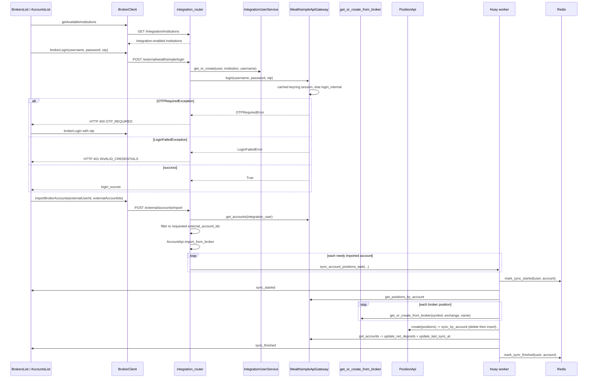
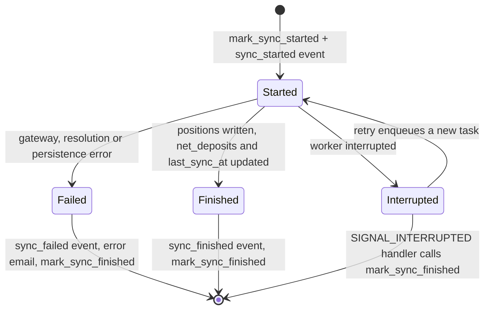

# Broker Connect, Import & Position Sync

This page follows the broker path end to end: from the "connect an institution" click in the
frontend, through the FastAPI routers under `/api/v1/external`, into the Wealthsimple gateway,
onto the Huey worker that actually writes positions, and back out through Redis and WebSockets to
the accounts list. The domain catalog is in [Backend Domains](../architecture/domains.md), the
vendor boundary and stub switch in [External Services & Adapters](../integrations/external-services.md),
the state-class conventions in [Frontend Architecture](../architecture/frontend.md), and the
mock-only testing rule in [Testing & Verification](../operations/testing.md). Money handling in
positions and totals is covered by [Money and Currency](../concepts/money-and-currency.md).

Three invariants govern the whole flow and should be treated as contracts:

1. **Credentials are never persisted.** The external password (and OTP) exist only for the
   duration of the login call. What survives is an `integration_users` row (user, institution,
   external username, display name) plus a broker *session token* cached in the OS keyring by the
   gateway.
2. **Position sync replaces positions per account.** `PositionApi.create` groups by account and
   calls `PositionRepository.sync_by_account`, which deletes every position row for that account
   before inserting the new set — so a partial vendor response cannot leave stale holdings behind.
3. **Broker symbols are resolved through market security search/creation.** No position is ever
   written against a raw broker symbol; every `BrokerPosition` is mapped to a `Security` id by
   `SecurityApi.get_or_create_from_broker` first.

## Participants and surfaces

| Layer | Entrypoint | Responsibility |
|-------|-----------|----------------|
| Frontend client | `frontend/src/lib/api/brokerClient.ts` | `/integration/institutions`, `/external/users`, `/external/users/{id}/accounts`, `/external/{institution}/login`, `/external/accounts/import` |
| Frontend state | `brokers-list.svelte.ts`, `brokerService.svelte.ts`, `connect-broker-modal.svelte.ts`, `broker-login-modal.svelte.ts`, `sync-accounts-modal.svelte.ts` | institution list, login form incl. OTP step, account selection/unsync |
| FastAPI routers | `src/integration/router.py` (`integration_router` = `/external`, `institutions_router` = `/integration`), `src/account/router.py` | HTTP surface, auth, rate limiting, task enqueue |
| Broker gateway | `src/integration/brokers/wealthsimple.py` | `ws-api` login/session handling, account and position parsing |
| Task | `src/integration/task.py` | `sync_account_positions_task` Huey task, sync events, error mapping, failure email |
| Sync bookkeeping | `src/integration/sync_status.py` | Redis active-sync set |
| Market | `src/market/api.py` (`SecurityApi`) | broker symbol → security resolution |
| Persistence | `src/account/api/position.py`, `src/account/repository_sqlalchemy.py` | replace-per-account position write |
| Fan-out | `src/ws/manager.py`, `src/ws/api_types.py` | Redis pub/sub → per-user WebSocket delivery |
| Consumer | `frontend/src/lib/components/accounts/accounts-list.svelte.ts` | ticket handshake, sync badges, reconnect, totals refresh |

## Institution listing

`GET /api/v1/integration/institutions` returns every institution with integrations enabled
(`InstitutionApi.get_all_enabled_integrations`). This is the *only* filter on what a user can
connect: an institution row with `integration_enabled = false` is invisible to the UI even though
`get_broker_gateway_class` knows how to handle it. The integration test
`tests/routers/test_integration.py` flips that flag directly in `account_institutions` and asserts
the response contains exactly the Wealthsimple entry, which is the observable definition of
"enabled".

## Connect, import and sync

Caption: the connect → import → sync path. Login is synchronous and request-scoped; every
position write happens inside the Huey worker, never in the request that triggers it.

### Login and OTP

`POST /external/{institution}/login` resolves the gateway from the path enum via
`get_broker_gateway_class` and calls `IntegrationUserService.get_or_create` **before** attempting
login, so a failed login still leaves the `integration_users` record (with refreshed
`last_used_at`) in place. `WealthsimpleApiGateway.login` is a two-stage dance:

- it reads the cached session from the keyring and probes it with `get_accounts()`;
- only when no session exists does it call `ws.login_internal(username, password, otp,
  persist_session_fct=self._save_session)`.

The gateway maps vendor exceptions to domain errors, and the router maps those to exactly two
HTTP codes: `OTPRequiredError` → `400` with `detail="OTP_REQUIRED"`, `LoginFailedError` → `401`
with `detail="INVALID_CREDENTIALS"`. Those literal strings are the contract the frontend depends
on: `broker-login-modal.svelte.ts` switches to the OTP field when the message is `OTP_REQUIRED`
and shows "Invalid username or password" for `INVALID_CREDENTIALS`, falling back to a generic
message otherwise. Any other login error (`UnknownError`, `SessionExpiredError`) reaches the
generic branch, so the modal never shows an empty error.

A missing cached session is normal (first login), and `SessionDoesNotExistError` is
`ExternalAPIError`'s subclass — but note that `login` *catches* it internally: it is the signal to
perform a real credential login, not a user-facing failure.

### Import: accounts then positions

`POST /external/accounts/import` (rate-limited `3/minute`) is the single write path. It:

1. loads the `integration_users` row and runs `AuthorizationApi.check_entity_owned_by_user` (which
   raises **404**, not 403, for another user's entity — existence is deliberately hidden);
2. calls `broker.get_accounts(integration_user)`;
3. filters the response down to `import_request.external_account_ids`, so the client controls
   which broker accounts become local accounts;
4. calls `AccountApi.import_from_broker`, which skips any account that already exists for
   `(user_id, broker_id)` and otherwise maps a `BrokerAccount` through `AccountSchema.from_broker`;
5. enqueues one `sync_account_positions_task` per newly created account, forwarding
   `get_request_id()` so the worker's logs correlate with the request.

`POST /external/positions/import` is a separate, nearly-duplicate path that does the position work
*inline* in the request instead of on the worker: it loads the account and its broker id, calls
`broker.get_positions_by_account`, resolves each symbol via
`SecurityApi.get_or_create_from_broker`, and writes through `PositionApi.create`. It is not
rate-limited and not the path the UI drives for broker accounts; the account list's sync button and
the import flow both go through the Huey task. Treat it as a synchronous variant that shares the
same invariants.

Importing is also how *un*-syncing is expressed: `sync-accounts-modal.svelte.ts` diffs the checked
set against the user's internal accounts and calls `accountClient.deleteAccount` for every account
whose checkbox was cleared, so "deselect a broker account" is a local delete, not a broker call.

### The sync task

`sync_account_positions_task` is a `@huey.task()` that runs in the `huey-worker` process, isolated
from the FastAPI lifecycle. It takes the `user_id`, the `Account`, the `broker_account_id`, and a
`broker_class`, and wraps the asynchronous body in `asyncio.run()`. The worker's `svcs` registry is
set up in `src/worker.py::setup_worker_services` (with `NullPool`, precisely because tasks cycle
through `asyncio.run()`); the task asserts `huey.svcs_registry is not None` and raises
`RuntimeError("Worker registry not initialized")` otherwise. It restores the parent request id in
the context var and resets it in a `finally`.

Inside the container, `_do_sync_positions` is strictly ordered:

1. reject the account when `account.integration_user_id is None` (`AccountPositionsSyncError`) and
   load the `integration_users` row (`IntegrationUserNotFoundError` when missing);
2. fetch positions from the gateway for that broker account id;
3. resolve every `BrokerPosition` to a `Security` via `SecurityApi.get_or_create_from_broker`
   (institution, broker symbol, broker exchange, broker name) and build `Position` records with
   `broker_position.to_position(account_id, security_id)`;
4. write them with `PositionApi.create`;
5. re-list broker accounts, find the matching one, and update `net_deposits` (as `float`, `None`
   when the broker omits it) plus `last_sync_at`.

The `net_deposits` and `last_sync_at` updates are inside the same `try` as the position write, and
they are skipped entirely when the broker no longer reports that account — position replacement
happens either way.

### Symbol resolution

`SecurityApi.get_or_create_from_broker` is the bridge between broker vocabulary and market data. It
first checks `SecurityBrokerRepository.get_by_broker(institution_id, broker_symbol,
broker_exchange)`; a hit returns the linked security without touching EODHD. On a miss it maps the
symbol (`.` → `-`) and exchange (`CSE→CA`, `TSX→TO`, `NYSE→US`, `NASDAQ→US`), builds
`"{symbol}.{exchange}"`, consults `SecuritySearchCache`, otherwise searches the market gateway,
takes the **first** result, upserts the `Security` (symbol, exchange, currency, name, isin), warms
prices through `MarketPricesApi.get_latest_close`, and persists a `SecurityBroker` mapping with the
raw search results. Zero search results raise `ValueError` — which is not in
`_SYNC_ERROR_MESSAGE_MAPPING`, so it surfaces to the user as the generic unexpected-error message.

The `SecurityBroker` row is the durable cache: once a broker symbol resolves, later syncs are a
single indexed lookups. Two mapping functions exist for the same transformation —
`SecurityApi._map_eodhd_exchange` uses `.get(...)` and passes unknown exchanges through, while
`WealthsimpleApiGateway._map_eodhd_exchange` indexes the dict directly and raises `KeyError`. They
are not interchangeable; see [External Services & Adapters](../integrations/external-services.md).

## Account sync lifecycle

Caption: per-account sync states. The Redis set member is written before the work and cleared on
every exit path — success, failure, or worker interruption — so it never becomes a permanently
"active" account.

### Redis bookkeeping

`src/integration/sync_status.py` owns a single Redis set, `account_syncs:active:{user_id}`, holding
the account ids currently syncing. `mark_sync_started` `SADD`s the id and sets the
`settings.sync_ttl_seconds` expiry (default **300**); `mark_sync_finished` `SREM`s it;
`get_active_syncs` returns the members parsed back into `AccountId` UUIDs. The TTL is the safety
net for a worker that dies without running any cleanup — the key expires on its own.

Two robustness details matter:

- `mark_sync_started` is wrapped in its own `try/except` that only logs, so a Redis outage does not
  abort a sync that would otherwise succeed.
- `mark_sync_finished` runs in a `finally`, so it executes on the failure path too.
- A `@huey.signal(signals.SIGNAL_INTERRUPTED)` handler inspects `task.name ==
  "sync_account_positions_task"`, reads `task.args[0]`/`task.args[1]`, and calls
  `mark_sync_finished` via `asyncio.run` — the interruption path that would otherwise leave a
  stale entry until the TTL fired.

`GET /api/v1/accounts/sync-status` exposes `get_active_syncs(user.id)` as
`{"account_ids": [...]}`; a `redis.RedisError` is translated to **503** "Sync status service
unavailable". `tests/routers/test_sync_status.py` pins all of this: empty result, scoped to the
authenticated user (`get_active_syncs` is asserted called with `test_user.id`), unauthenticated
401/403, and the Redis-down 503.

Note the deliberate non-goal: the Redis set is *display* state, not a lock. Nothing prevents two
sync tasks for the same account; the set is a set, so the second `SADD` is a no-op, and the first
`SREM` clears the badge while the second task may still be running.

## WebSocket delivery

`src/ws/manager.py` keeps `active_connections: dict[UserId, list[WebSocket]]` per user and one
Redis client **per running event loop** — that loop-keyed design is what lets the same singleton be
called both from the FastAPI request loop and from a worker's `asyncio.run()` loop.
`send_personal_message` publishes `{"user_id": ..., "message": ...}` to the `ws_messages` channel,
lazily initializing a client when the calling loop has none; if Redis is unreachable it falls back
to `_send_to_local_connections`, and the listener task restarts itself after a 5s delay on
unexpected error. The full architecture is in `src/ws/README.md`.

The task emits three events from `src/ws/api_types.py`, each an `AccountSyncMessage` serialized
with `model_dump(mode="json")`:

| `WsEventType` | Wire value | Emitted |
|---------------|-----------|---------|
| `ACCOUNT_SYNC_STARTED` | `sync_started` | after `mark_sync_started`, before any broker call |
| `ACCOUNT_SYNC_FINISHED` | `sync_finished` | after `_do_sync_positions` returns |
| `ACCOUNT_SYNC_FAILED` | `sync_failed` | in the `except` branch, after the email attempt, before re-raising |

`ACCOUNT_TOTALS_UPDATED` exists on the same enum but belongs to
`src/account/task.py::recalculate_all_account_totals_task`, the hourly totals broadcast — it is not
part of the broker sync path.

Because the message is published to Redis and delivered by whichever process holds the socket, a
`sync_started` emitted by the worker reaches a browser connected to a *different* FastAPI instance.
That also means delivery is best-effort: the client is not guaranteed to see either edge.

## Frontend consumption

`AccountsListState` (`frontend/src/lib/components/accounts/accounts-list.svelte.ts`) owns the
browser side of the contract.

**Handshake.** On construction (browser only) it calls `authService.getWsTicket()` and opens
`new WebSocket(`${wsUrl}?ticket=...`)`; without a ticket it logs a warning and aborts rather than
connecting unauthenticated. `src/ws/router.py` verifies the ticket with `URLSafeTimedSerializer`,
`salt="ws-ticket"`, `max_age=30`, rejects a replay by setting a SHA-256 hash key with
`nx=True, ex=30`, and closes with code `1008` on any failure. The ticket origin (in the backend)
lives in the auth `/auth/ws-ticket` endpoint.

**State.** Two runes-backed fields track the sync: `syncingAccountIds` (a `SvelteSet<string>`) and
`syncErrors` (`Record<string, string | null>`). Incoming events mutate them directly:
`sync_started` adds the id and clears the error, `sync_finished` removes it and clears the error,
`sync_failed` removes it and sets `'Failed to sync. Please try again.'`.

**Hydration and reconnect.** On `open` the state calls `hydrateSyncStatus()`, which reads
`GET /accounts/sync-status` once (guarded by `syncStatusHydrated`) so a page loaded mid-sync shows
the correct badges. `onclose` sets `wsConnected = false`, resets the hydration guard, and
re-connects after a fixed 5-second `setTimeout`. `destroy()` closes the socket — the expected
teardown for the class instance.

**Manual sync and the fallback poll.** `syncAccount(id)` optimistically adds the id and clears the
error, POSTs `/accounts/{id}/sync`, and then calls `waitForSyncFinish`, a bounded poll (60s
deadline, 1.5s interval) of the same sync-status endpoint with an explicit comment about why it
exists: *the WS message may be lost if Redis pub/sub fails*. When the backend no longer reports the
id it waits a 5-second grace period for the message; if the message still has not arrived it clears
state and refetches accounts. A timeout sets `'Sync took too long. Check account status.'`, and a
request failure sets `'Request failed. Please check your connection.'`. Totals are refreshed by
re-rendering the account rows (each item owns a `totalsCache` with an `invalidateCache`), and the
hourly `account_totals_updated` broadcast lands on the same component.

**Server-side gate.** `POST /api/v1/accounts/{account_id}/sync` (rate-limited `3/minute`) refuses an
account with `api_sync_enabled = false` with **400** ("API sync is not enabled for account …") and
otherwise delegates to `PositionService.sync_account_positions`, which re-checks the flag
(`ApiSyncDisabledError`), silently returns when `integration_user_id is None` (a CSV account), and
finally calls `IntegrationAccountApi.sync_account_positions` → the Huey task. The route's own 400
is the primary guard; the service's exceptions are the belt-and-braces copy.

The broker side of the UI is thinner: `BrokersListState` only loads users and controls modal
visibility, `BrokerService` wraps the client calls, and `BrokersListItemState` keeps a
`fetchTrigger` counter that `handleSyncComplete` increments so the account promises re-run after a
save.

## Failure taxonomy and notification

`_SYNC_ERROR_MESSAGE_MAPPING` in `src/integration/task.py` maps each domain exception to one
user-facing sentence; `_format_sync_error_message` applies it, with `AccountPositionsSyncError`
handled first (its own `str(exc)`, or a default when empty) and anything unmapped falling through
to "An unexpected error occurred while syncing your account positions. Please try again later."

| Exception | User-facing message theme | Also reachable from |
|-----------|---------------------------|---------------------|
| `SessionExpiredError` | session with the institution expired, reconnect in account settings | `ManualLoginRequired` |
| `SessionDoesNotExistError` | no active session found, log in to link the account | missing keyring entry |
| `OTPRequiredError` | OTP / 2FA required, complete authentication in settings | `OTPRequiredException` |
| `LoginFailedError` | authentication failed, check credentials and reconnect | `LoginFailedException`, or a missing password |
| `IntegrationUserNotFoundError` | integration details could not be found, reconnect | deleted `integration_users` row |
| `ExternalAPIError` | error communicating with the institution, try again later | generic vendor failure |
| `AccountPositionsSyncError` | the exception's own message | account without `integration_user_id` |

`_send_sync_error_email` resolves the recipient through `UserApi.get_email_for_user`, derives the
institution label from `InstitutionEnum(...).name.replace("_", " ").title()` (falling back to
`str(account.institution_id)` when the id is not in the enum — covered by
`test_sync_account_positions_task_sends_email_unmapped_institution_fallback`), and sends an
`ExternalAccountErrorEmailData` with the deep link `{settings.frontend_url}/accounts`. The whole
email attempt is nested in its own `try/except`: `EmailSendError` is logged and swallowed so the
sync failure still surfaces, and a user with no email only produces a warning. The `sync_failed`
event is emitted **after** that attempt and before the exception is re-raised, so the task fails
observably while the user still gets both signals.

The email path is shared with the vendor boundary described in
[External Services & Adapters](../integrations/external-services.md), which also documents the
plaintext keyring caveat: `BrokerApiGateway.__init__` installs `keyrings.alt.file.PlaintextKeyring`,
so cached Wealthsimple session tokens are unencrypted on disk, guarded only by a `TODO secure this
before staging deployment` comment. Treat any new credential or session field as inheriting that
storage.

## Configuration and operations

| Setting | Env var | Effect here |
|---------|---------|-------------|
| `redis_url` | `REDIS_URL` | sync-status set, WebSocket pub/sub, Huey broker |
| `sync_ttl_seconds` | `SYNC_TTL_SECONDS` | expiry of `account_syncs:active:{user_id}`, default 300 |
| `frontend_url` | `FRONTEND_URL` | `/accounts` deep link in the failure email |
| `stub_external_api` | `STUB_EXTERNAL_API` | selects `StubWealthsimpleApiGateway` instead of the live gateway |
| SMTP settings | `SMTP_*` | delivery of the failure email |

Operationally: the task runs in the `huey-worker` process, so a change to `src/integration/task.py`
requires a worker restart; both the API and the worker load `.env` at process start. The
`huey_dashboard` is started from `src/main.py` and torn down on shutdown (`src/worker.py` wires the
worker-side signals).

## Testing

The repo-wide rule applies with no exceptions here: **broker gateways and Redis must be stubbed or
mocked, never live** (`src/AGENTS.md`, restated in
[Testing & Verification](../operations/testing.md) and
[External Services & Adapters](../integrations/external-services.md)). `tests/conftest.py` sets
`STUB_EXTERNAL_API=true` before the app import, the autouse `fake_redis_manager` fixture replaces
`redis_manager.client` with a dict-backed `FakeRedis` (implementing `sadd`/`srem`/`smembers`, which
is why the sync set works in tests), and `global_mocks` forces `huey.immediate = True` plus patches
`ConnectionManager.send_personal_message`.

Representative focused tests:

- `tests/tasks/test_integration.py` — the sync task's full success path (asserts the resolved
  security, `update_net_deposits(account.id, 5000.0)`, `update_last_sync_at`, and exactly two
  `send_personal_message` calls with `sync_started` then `sync_finished`), the
  `RuntimeError` for an uninitialized registry, the two `_do_sync_positions` guards, and one test
  per error-mapping entry asserting the exact email body and `frontend_url` deeplink — including
  `sync_failed` as the last socket call when the email itself throws.
- `tests/account/test_models_and_sync.py` — `PositionService.sync_account_positions` raising
  `ApiSyncDisabledError` for a CSV account, and the `api_sync_enabled` default of `True`.
- `tests/services/test_position_api.py` — `PositionApi.create` (via `sync_by_account`) replacing
  existing positions for an account.
- `tests/routers/test_sync_status.py` — the sync-status endpoint's empty, scoped, unauthenticated
  and Redis-unavailable cases.
- `tests/integration/brokers/test_wealthsimple.py` — the gateway driven entirely through
  `StubWealthsimpleAPI` / `StubWSAPISession` from `src/stubs/wealthsimple.py`, with `keyring`
  patched, covering session save/get, the OTP and login-failure translations, and account/position
  parsing.
- `frontend/src/lib/components/accounts/accounts-list.test.ts` — mocks `WebSocket`,
  `accountClient` and `authService.getWsTicket`, so no socket or fetch is real.

## Extension points

Adding a broker means: a `BrokerApiGateway` subclass with its own `_keyring_prefix` and
`InstitutionEnum`; an entry in `get_broker_gateway_class` (which currently raises `KeyError` for any
id other than `WEALTHSIMPLE`); vendor-error translation onto `ExternalAPIError` subclasses; a stub
under `src/stubs/`; and a registration in `src/integration/registry.py`. If the new broker
introduces a failure mode with actionable user guidance, it also needs a sentence in
`_SYNC_ERROR_MESSAGE_MAPPING`. The seed data requirement — an `account_institutions` row with
`integration_enabled = true` — is what makes the institution appear at all.
