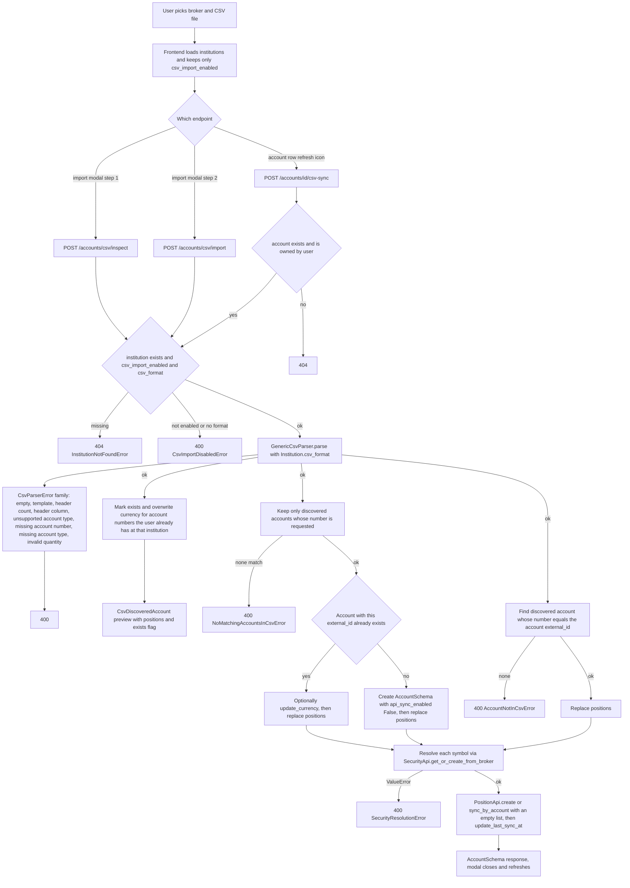
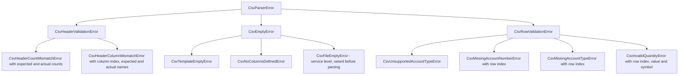

# CSV Account Import & Sync

Some institutions give users a downloadable holdings export instead of an API. That
file becomes a set of accounts through one template string stored on the institution
row, one generic parser that never contains broker-specific code, and one service
that reuses the same security-resolution and position-replacement machinery the
broker path uses. The domain catalog is in
[Backend Domains](../architecture/domains.md), the sibling broker flow in
[Broker Connect, Import & Position Sync](./broker-sync.md), the money and rounding
contract in [Money & Currency Handling](../concepts/money-and-currency.md), the
frontend conventions in [Frontend Architecture](../architecture/frontend.md), and
the mock-only testing rule in [Testing & Verification](../operations/testing.md).

There is no per-broker CSV code and no per-broker branch in the parser. Supporting a
new broker CSV means editing data, not code — see
[The institution configuration seam](#the-institution-configuration-seam).

## The template contract

`Institution.csv_format` (column `account_institutions.csv_format`) is a
comma-separated, **positional** template string: each placeholder maps to the column
at the same left-to-right index in the broker's export. The documented placeholder
vocabulary is repeated in the docstrings of
`src/account/api_types.py`, `src/account/model.py`, `src/account/schema.py` and
`src/commands/seed.py`:

`{account_name}`, `{account_type}`, `{account_classification}`, `{account_number}`,
`{symbol}`, `{exchange}`, `{mic}`, `{name}`, `{security_type}`, `{quantity}`,
`{position_direction}`, `{market_price}`, `{market_price_currency}`,
`{book_value_cad}`, `{book_value_currency_cad}`, `{book_value}`, `{currency}`,
`{market_value}`, `{market_value_currency}`, `{market_unrealized_returns}`,
`{market_unrealized_returns_currency}`.

Only a subset is actually read by the parser; the rest are documentation for
mapping a broker export faithfully. The consumed placeholders are `account_number`,
`account_type`, `account_name`, `currency`, `symbol`, `security_type`, `quantity`,
`book_value` (with `book_value_market`, `book_value_cad` and the two broker-currency
currency variants as fallbacks), `exchange` and `name`.

### Normalization

`normalize_token` in `src/account/csv/parser.py` is the single normalization rule
applied to both sides of the comparison. It strips a leading UTF-8 BOM and surrounding
whitespace, unwraps a `{...}` wrapper, lowercases, and replaces every run of
non-`[a-z0-9]` characters with a single `_`, trimming leading and trailing underscores.
So `{account_number}`, `Account Number`, `account_number` and `Account Number (CAD)`
all normalize differently — the alias table is what bridges the real-world labels:

- `book_value` matches `book_value`, `book_value_market`, `book_value_cad`,
  `cost_basis`, `total_cost`.
- `currency` matches `currency`, `book_value_currency_market`,
  `book_value_currency_cad`, `market_price_currency`, `currency_code`.
- `account_number` matches `account_number`, `account_no`, `account_id`.
- `account_type` matches `account_type`, `type`; `security_type` also matches `type`.
- `symbol` matches `symbol`, `ticker`; `quantity` matches `quantity`, `qty`,
  `shares`, `units`.
- `account_name` matches `account_name`, `account`; `name` matches `name`,
  `description`, `security_name`; `exchange` matches `exchange`, `market`.

`header_matches` accepts a match in either direction — `actual` in
`HEADER_ALIASES[expected]` **or** `expected` in `HEADER_ALIASES[actual]` — which is
what lets a template written as `{type}` line up with a file column named
`Security Type`. The `type` alias being shared by `account_type` and `security_type`
is deliberate: a position-wise template only validates against the column, and the
row-level `account_type` lookup is a separate `row_dict.get("account_type")` keyed by
the normalized template token, so `{account_type}` must appear in the template for
the account type to be discoverable at all.

The template itself is read with `csv.reader` and only the **first** non-empty row is
used; an empty template raises `CsvTemplateEmptyError`, and a template whose first
row yields no tokens raises `CsvNoColumnsDefinedError`.

### Header validation

`_validate_headers` skips blank leading rows to find the first row with any non-blank
cell (no such row → `CsvEmptyError`), then:

1. Compares raw column **counts** and raises `CsvHeaderCountMismatchError(expected, actual)`
   on mismatch — this fires before any name comparison, and is the error
   `test_parser_missing_headers` pins.
2. Normalizes the actual headers and compares element-wise against the normalized
   template tokens, raising `CsvHeaderColumnMismatchError(column, expected, actual)`
   with a **1-based** column index on the first mismatch
   (`test_parser_invalid_headers` asserts `"Header mismatch at column 1"`).

Column order matters absolutely; a reordered broker export fails validation even when
every label is recognized.

### Account type mapping

`map_account_type` lowercases and trims the raw cell and looks it up in
`ACCOUNT_TYPE_MAP`; anything not present raises
`CsvUnsupportedAccountTypeError`. The mapped keys are:

| Raw value (case-insensitive) | `AccountTypeEnum` |
|---|---|
| `tfsa`, `tax-free savings account`, `tax free savings account`, `self_directed_tfsa` | `TFSA` |
| `rrsp`, `registered retirement savings plan`, `self_directed_rrsp` | `RRSP` |
| `fhsa`, `first home savings account`, `self_directed_fhsa` | `FHSA` |
| `non-registered`, `non_registered`, `non registered`, `personal`, `self_directed_non_registered`, `margin` | `NON_REGISTERED` |

`ACCOUNT_TYPE_DISPLAY_NAMES` maps the enum back to a display label (`Non-Registered`
for the unregistered case) and falls back to `enum.name` for anything unmapped. An
unsupported type ("Crypto Account") aborts the whole parse rather than skipping the
row.

### Quantity, book value, and average cost

`_parse_position` builds one `CsvPositionRecord` per non-filtered row:

- **Quantity** — the cell with `,` removed is fed to `Decimal(...)`. A
  `decimal.InvalidOperation` or `ValueError` raises
  `CsvInvalidQuantityError(row_idx, qty_str, symbol)`. Absence of a quantity cell is
  **not** an error: the empty string parses as `Decimal("0")`, producing a zero-quantity
  position.
- **Book value** — the first non-empty of `book_value`, `book_value_market`,
  `book_value_cad`, with `,` and `$` stripped before `Decimal(...)`. Unlike quantity,
  an unparseable book value is swallowed (`book_value = None`) so a malformed cost
  basis degrades to "unknown cost" instead of failing the import.
- **Average cost** — `calculate_average_cost(quantity, book_value)` returns `None`
  when `quantity <= 0` or `book_value is None`, otherwise
  `(book_value / quantity).quantize(Decimal("0.0001"), rounding=ROUND_HALF_UP)`.
  The four-decimal quantize and its rounding mode are the reason a CSV-imported
  `average_cost` is always a 4-dp value (test: 100/3 → `33.3333`) and they cascade
  into every downstream cost-basis number; that contract lives on
  [Money & Currency Handling](../concepts/money-and-currency.md).
- **Position currency** — the first non-empty of `currency`,
  `book_value_currency_market`, `book_value_currency_cad`, falling back to the
  account's discovered currency.
- **Account currency** — for a *newly discovered* account, the first non-empty of
  `currency`, `book_value_currency_market`, `market_price_currency`, defaulting to
  `"CAD"`.
- **Exchange and name** — trimmed, with the empty string converted to `None`.

### Grouping and per-row invariants

`GenericCsvParser.parse` iterates the remaining rows with `enumerate(csv_reader, start=2)`
(so `row_idx` is a 1-based file line number, header being line 1), skips all-blank rows,
and builds a `row_dict` keyed by template token, tolerating short rows by substituting
`""` for missing cells.

- Every row must carry a non-empty `account_number`, else
  `CsvMissingAccountNumberError(row_idx)`.
- The **first** row for a new `account_number` must carry a non-empty `account_type`,
  else `CsvMissingAccountTypeError(row_idx)`. Later rows for the same account skip the
  check entirely.
- Accounts are emitted in **first-seen order** (`accounts_order` preserves it), each as
  a `CsvDiscoveredAccount` carrying `account_number`, `account_name`,
  `account_type_id`, `account_type_name`, `currency`, `positions_count` and the full
  `positions` list.

### Row filtering: cash, options, and unsupported assets

Three predicates decide whether a row becomes a position. They run *before* the
quantity parse, so a filtered row can never raise `CsvInvalidQuantityError`.

- `is_cash_row(symbol, security_type)` — true when the symbol is empty, the symbol or
  `security_type` normalizes to `cash`, or the symbol starts with `sec-c-`
  (Wealthsimple's cash pseudo-symbol, e.g. `sec-c-cad`). Cash rows are dropped. In the
  router-level fixture the TFSA account has two rows (`VGRO` plus `sec-c-cad`) and
  reports `positions_count == 1`.
- `is_option_row(symbol, security_type)` — true when `security_type` contains
  `option` or `derivative`, or when the symbol matches `OCC_OPTION_PATTERN`
  (`^[A-Za-z0-9.\-/]{1,6}\s*\d{6}[CPcp]\d{1,8}(\.\d+)?$`). Option rows never reach the
  service. They are also defended against a second time in
  `CsvAccountService.sync_account_csv_positions`, which calls `is_option_symbol` and
  logs `"Skipping unsupported option position ..."` — so an option that somehow reaches
  the service is skipped rather than resolved.

Everything else — equities, ETFs, funds, anything without a symbol and without a cash
or option signature — is attempted as a market security. `{position_direction}`
(`LONG`) and `{market_unrealized_returns}` are parsed by nobody; their presence in a
template only keeps column indices aligned.

## Lifecycle: inspect, import, csv-sync

Three endpoints on `account_router` (`src/account/router.py`, prefix `/api/v1/accounts`)
drive the flow, and all three share the same gate — `CsvAccountService.validate_csv_institution`,
which raises `InstitutionNotFoundError` (404) when the row is missing and
`CsvImportDisabledError` (400) when **either** `csv_import_enabled` is false **or**
`csv_format` is empty. All three accept the CSV as a multipart `file` field, which the
router decodes with `content_bytes.decode("utf-8-sig")` so a BOM never reaches the
parser (a decode failure is a 400, not a 500).



*The three entrypoints, the shared institution gate, the parser error branches, the
create-versus-update split, and the position replacement tail.*

### inspect — discovery and preview

`inspect_csv` validates the institution, rejects blank content with `CsvFileEmptyError`,
and parses. When a `user_id` is supplied (the router always does), it loads the user's
accounts, indexes the ones with a matching `external_id` and `institution_id`, and for
each match sets `exists = True` and **overwrites** `acc.currency` with the stored
`Account.currency`. That overwrite is why the modal pre-selects a currency the server
would actually use, rather than the value from the CSV: an already-imported account
whose currency the user changed at import time shows the changed currency on
re-inspection.

`exists` is what the frontend renders as the per-row `Update holdings` / `Create account`
badge. Currency overrides happen in two places with different precedence: `exists`
accounts are overwritten with the DB currency here, while for non-existing accounts the
modal seeds its dropdown from the parsed currency and lets the user change it.

### import — create or update, selected accounts only

`import_accounts(user_id, institution_id, account_numbers, csv_content, account_currencies)`
parses once and then filters to the requested `account_numbers`; if the intersection is
empty it raises `NoMatchingAccountsInCsvError` (there is no "import everything" mode).
`CsvAccountDuplicateError` exists and is mapped to 400 by the router, but the current
service path never raises it — a requested number that already exists is treated as an
update, which `test_csv_import_existing_account_updates_positions` pins by importing the
same file twice and asserting the second response returns the *same* account id.

Per matching account:

- The chosen currency is `account_currencies[number]` (trimmed, uppercased) if
  provided, else the parsed account currency, else `"CAD"`.
- **Existing account** — if the chosen currency differs from `str(existing.currency)`,
  `update_currency` is called; then positions are replaced via
  `sync_account_csv_positions`; then the account is re-read from the repository and that
  refreshed row is returned.
- **New account** — `AccountSchema` is constructed with a fresh `uuid4()`,
  `external_id = disc_acc.account_number`, `name` and `broker_display_name` both set to
  the CSV `account_name`, `integration_user_id=None`, and **`api_sync_enabled=False`**.
  That flag is the load-bearing choice: CSV accounts have no broker session, so the
  broker sync path refuses them and the frontend's refresh control changes meaning —
  the account-list item renders `Sync positions` when `api_sync_enabled` is true and
  `Update from CSV` (opening the update modal) when it is false. The account is created,
  positions are written, and again the refreshed row is returned.

The response is a `list[AccountSchema]`, so the frontend gets the final account rows
with their server-assigned ids and `last_sync_at`.

### csv-sync — refresh one existing account

`sync_account_from_csv(account, csv_content)` is the "update holdings" path. It accepts
either an `AccountSchema` (what the router passes, after
`authorization_api.check_entity_owned_by_user`) or an `AccountId` (which it resolves
itself, raising `AccountNotFoundError` if missing). It then validates the account's
*own* institution — so a CSV-sync is impossible once CSV import is disabled for that
institution — parses, and looks for a discovered account whose `account_number` equals
`target_account.external_id`. No match raises `AccountNotInCsvError(external_id)`; the
match's positions are written and the refreshed account is fetched and returned,
re-raising `AccountNotFoundError` if the re-read returns `None`.

Note the asymmetry with import: csv-sync **never** creates an account, **never** changes
the currency, and **never** looks at any other discovered account in the file. It is
also the only one of the three that enforces account ownership, because it is the only
one addressed by an existing account id. `POST /accounts/{account_id}/csv-sync` returns
404 (not 403) for an account owned by another user, matching
`AuthorizationApi.check_entity_owned_by_user`'s deliberate existence-hiding.

### The shared tail: security resolution and position replacement

`sync_account_csv_positions(account_id, institution_id, csv_positions)` is used by both
import branches and by csv-sync, so all three paths converge on identical write
semantics:

1. Skip `is_option_symbol` matches with an info log.
2. Resolve each remaining `CsvPositionRecord` through
   `SecurityApi.get_or_create_from_broker(institution_id, broker_symbol, broker_exchange, broker_name)`,
   passing `pos.exchange or ""` and `pos.name or ""`. A `ValueError` from the market
   layer (`"No search results for SYMBOL.EXCHANGE (name)"`) is wrapped as
   `SecurityResolutionError(symbol, reason)` → HTTP 400.
3. `PositionApi.create(positions)` — which groups by `account_id` and calls
   `PositionRepository.sync_by_account`, **deleting every position row for the account
   before inserting the new set**. This is the same replace-not-merge rule as broker
   sync, and it is why importing a narrower CSV removes holdings: the router test
   replaces a VGRO position with MSFT 75 and asserts exactly one position remains.
4. If the resolved position list is empty (every row filtered), the service still calls
   `sync_by_account(account_id, [])`, so an all-cash export clears the account instead
   of leaving stale rows.
5. `update_last_sync_at(account_id)` stamps the account, which is why a freshly imported
   account already reports a non-null `last_sync_at` in the import response.

Security resolution is institution-scoped through `SecurityBroker` rows: a repeat
symbol/exchange pair short-circuits to the already-mapped security, and a new one maps
the broker symbol to an EODHD-friendly query (`.` → `-`, `TSX` → `TO`, `CSE` → `CA`,
`NYSE`/`NASDAQ` → `US`), searches through the cached market gateway, creates or reuses
the security, primes its latest close, and records the mapping with the raw search
results. Broker symbol mapping and the gateway boundary are covered in
[External Services & Adapters](../integrations/external-services.md).

Note that a CSV-imported account's `currency` is used for display and totals
conversion, but each `Position` is written with its **own** `pos.currency`, so a
CAD-denominated account can hold USD-quoted positions; conversion happens later in
`PositionService`. See [Money & Currency Handling](../concepts/money-and-currency.md).

### Endpoint request shapes

`POST /accounts/csv/inspect` requires `institution_id` (422 `"institution_id is required"`
otherwise); it accepts it as a multipart form field or as a query parameter aliased
`institution_id`, preferring the form field.

`POST /accounts/csv/import` requires both `institution_id` and `account_numbers`.
`_normalize_account_numbers` accepts each repeated value as a JSON list string
(`'["W1","W2"]'`), a comma-separated string (`'W1,W2'`), or a bare value, and
deduplicates in order with `dict.fromkeys`. Currencies arrive as one `currencies`
form/query field containing a JSON object; a `JSONDecodeError` or non-dict payload is
silently ignored (`except json.JSONDecodeError, ValueError: pass`) and the parsed
currencies are uppercased. The frontend client sends repeated `account_numbers` fields
and a stringified `currencies` object.

`POST /accounts/{account_id}/csv-sync` takes only the file; ownership and existence come
from the path id. None of the three endpoints is rate-limited (unlike
`POST /accounts/{account_id}/sync`, which is `3/minute`).

HTTP status mapping, per endpoint:

| Outcome | inspect | import | csv-sync |
|---|---|---|---|
| Unauthenticated | 401 | 401 | 401 |
| Missing `institution_id` / `account_numbers` | 422 | 422 | — |
| File unreadable or undecodable | 400 | 400 | 400 |
| Institution missing | 404 | 404 | 404 |
| Import disabled or `csv_format` absent | 400 | 400 | 400 |
| No matching accounts in CSV | — | 400 | 400 `AccountNotInCsvError` |
| Account missing / not owned | — | — | 404 |
| Security resolution failure | — | 400 | 400 |

## Error taxonomy

`src/account/csv/exceptions.py` defines the parser family, all rooted at
`CsvParserError`; `src/account/exception.py` defines the service-level errors and also
subclasses `CsvEmptyError` as `CsvFileEmptyError` for the "blank content" case the
service raises before parsing.



*The parser exception hierarchy; the router maps `CsvParserError` (and
`CsvImportDisabledError`) to HTTP 400 and `InstitutionNotFoundError` to 404.*

The taxonomy is deliberate: parsing failures are 400 with a descriptive `detail`
string that names the offending column, row, symbol, or account type, and the frontend
renders `Error.message` verbatim in a destructive alert. Nothing in this flow fails
silently except book-value parsing (→ `average_cost = None`) and the ignored malformed
`currencies` JSON.

## Extension points

### The institution configuration seam

Everything about "which broker exports can be imported" is data on
`account_institutions`, not code:

- `csv_import_enabled` — a plain boolean, default `False` on both the model and the
  API/schema types.
- `csv_format` — nullable string, default `None`.

`validate_csv_institution` treats the pair as one gate, so an institution with
`csv_import_enabled=True` but `csv_format=None` behaves exactly like a disabled one
(`test_csv_inspect_csv_format_missing` asserts the same 400 message). Onboarding a
broker is therefore: read the export's header row, build the comma-separated positional
template, store it in `csv_format`, set `csv_import_enabled = True` — and only touch
parser code if the export needs placeholder vocabulary the parser does not consume or a
header label no alias covers. `src/commands/seed.py` documents that recipe in the
`WEALTHSIMPLE_CSV_FORMAT` docstring and
[Domains](../architecture/domains.md) records the same recipe.

Visually, the seam surfaces through `GET /api/v1/integration/institutions`
(`InstitutionApi.get_all_enabled_integrations`), which returns `csv_import_enabled` and
`csv_format`; the import modal filters that list to `csv_import_enabled === true` and
auto-selects the broker when exactly one remains, so adding a second CSV broker makes
the broker dropdown real without a frontend change.

The one caveat to "data only": `_parse_position` and `parse` read a **fixed set of
normalized tokens**. A template that omits `{account_number}` or `{account_type}` will
fail at runtime with `CsvMissingAccountNumberError` / `CsvMissingAccountTypeError` on
every row, and a template that omits `{quantity}` silently yields zero-quantity
positions. `csv_import_enabled` cannot express those constraints; only the template
string does.

### The Wealthsimple template

`src/commands/seed.py` defines `WEALTHSIMPLE_CSV_FORMAT` as a module-level constant —
21 placeholders in the exact column order of a Wealthsimple holdings export:

```
{account_name},{account_type},{account_classification},{account_number},
{symbol},{exchange},{mic},{name},{security_type},{quantity},
{position_direction},{market_price},{market_price_currency},
{book_value_cad},{book_value_currency_cad},{book_value},{currency},
{market_value},{market_value_currency},{market_unrealized_returns},
{market_unrealized_returns_currency}
```

`_seed_institutions` seeds the `WEALTHSIMPLE` institution with
`csv_import_enabled=True` and `csv_format=WEALTHSIMPLE_CSV_FORMAT`; for an institution
that already exists it **re-asserts** those values on every seed run, which is how a
template change ships to an existing database. `seed_data()` runs both reference seeds
(account types and institutions) in every environment and only adds the dev fixtures
(user, securities, accounts, positions, portfolios, integration users) when
`settings.environment == "dev"` — see
[CLI workflows](../operations/workflows.md). `tests/commands/test_seed.py` pins both the
seeded values and seed idempotency, and `tests/conftest.py`'s `seed_reference_data`
fixture installs the same institution row for router tests.

The alias design is what absorbs real file variation without touching the template:
`Book Value (CAD)` normalizes to `book_value_cad` and `Book Value (Market)` to
`book_value_market`, so a Wealthsimple export that swapped one for the other still
validates positionally against the same 21-column string. `tests/account/csv/test_parser.py`
covers both header variants against `WEALTHSIMPLE_CSV_FORMAT`.

## Frontend

`frontend/src/lib/api/accountClient.ts` exposes the three calls —
`inspectCsv(institutionId, file)`, `importAccountsCsv(institutionId, file, accountNumbers, currencies?)`
and `syncAccountCsv(accountId, file)` — all as `postFormData`. The
`importAccountsCsv` signature carries a compatibility quirk worth knowing before
editing it: the fourth parameter is `currenciesOrToken?: Record<string,string> | string | null`,
so a caller can pass either the currency map or a token in that slot, and a string is
routed to `token` while an object becomes the `currencies` JSON field.
`frontend/src/lib/api/accountClient.test.ts` covers both headers and error propagation.
`CsvDiscoveredAccount` is mirrored in `frontend/src/lib/types/account.ts` with
snake_case field names and optional `exists`.

### import-account-csv-modal.svelte

A two-step dialog. Step 1 selects the broker (filtered to `csv_import_enabled`) and the
file; step 2 previews the discovered accounts in a table with per-row checkboxes, a
select-all/indeterminate header checkbox, an action badge, a currency dropdown seeded
from the discovered currency (with ~7 common currencies plus the discovered one when it
is not common), and a holdings count. All discovered accounts start selected.

Client-side guards run before any request: the filename must end in `.csv` and the file
must be at most `10 * 1024 * 1024` bytes, both reported as inline errors with the
primary button disabled. The file can be chosen or dropped, and `handleInspect` treats
an empty account list as the error `"No accounts discovered in CSV file."` and stays on
step 1. `Back` returns to step 1 preserving the broker and file. `Enter` submits the
current step. On success the modal closes and calls `onSuccess`, which the accounts list
uses to refresh.

The modal is reachable from `accounts-list.svelte`, `brokers-list.svelte` and
`connect-broker-modal.svelte`, and it accepts either `bind:open` or a `ModalState`.

### update-account-csv-modal.svelte

A single-step dialog for one account: title `Update account from CSV`, description
naming the account, the same drag/drop + 10 MB + `.csv` validation, and a button that
calls `syncAccountCsv(account.id, file)`. It never sends an institution or account
number — the account id in the path is the whole addressing scheme. It is opened from
the refresh control of `accounts-list-item.svelte`, which renders `Update from CSV`
instead of `Sync positions` precisely when `account.api_sync_enabled` is false, i.e.
for CSV-imported accounts.

Both modals surface the backend `detail` string verbatim, so the parser messages
("Header mismatch at column 1: expected 'account_name', got 'unknown_column'") are what
users actually read.

## Focused tests

- `tests/account/csv/test_parser.py` — the template contract end to end: valid single
  and multi-account parses with cash filtering, real-Wealthsimple header alias
  acceptance, header count/name mismatches, empty content, the full account-type map
  including the unsupported case, `calculate_average_cost` edge cases (zero/negative
  quantity, `None` and zero book value, 4-dp rounding), UTF-8 BOM handling, option
  symbol/row detection, and option-row filtering.
- `tests/services/test_csv_account_service.py` — the institution gate (not found,
  disabled, missing format), empty content, `exists` population, `NoMatchingAccountsInCsvError`,
  update-in-place versus create, currency override for both new and existing accounts,
  `AccountNotInCsvError`, `SecurityResolutionError`, option skipping in
  `sync_account_csv_positions`, and the DI factory.
- `tests/routers/test_csv_inspect.py` — the inspect endpoint's 401/404/400/422 cases,
  the `WEALTHSIMPLE_CSV_FORMAT` happy path (cash row filtered, per-account currency,
  derived `average_cost`), `exists` flipping after an import, and the query-parameter
  `institution_id` fallback.
- `tests/routers/test_csv_account_endpoints.py` — import and csv-sync: auth, missing
  params, disabled institution, empty file, invalid headers, repeat-import update,
  create-with-`api_sync_enabled=False`, database position assertions, position
  replacement via csv-sync, unmatched `external_id`, cross-user 404, missing account
  404, and the explicit `currencies` map.
- `tests/commands/test_seed.py` — the seeded `WEALTHSIMPLE_CSV_FORMAT` value,
  `csv_import_enabled`, and idempotency across repeated runs in `dev` and non-`dev`
  environments.
- `frontend/src/lib/components/accounts/import-account-csv-modal.test.ts` — broker
  filtering and auto-select, file type/size rejection, inspect-then-preview rendering,
  checkbox toggling, import submission with the currency map, back-navigation state
  retention, API-error display, `bind:open` without `ModalState`, the action badges,
  and currency overrides; `update-account-csv-modal.test.ts` covers the single-account
  variant.

## Related pages

- [Backend Domains](../architecture/domains.md) — the account domain, the
  `csv_format` contract summary, and the extension recipes.
- [Broker Connect, Import & Position Sync](./broker-sync.md) — the API-based sibling
  flow that shares `SecurityApi` and the position-replacement write.
- [Money & Currency Handling](../concepts/money-and-currency.md) — the 4-dp average-cost
  quantize, per-position currency, and conversion-at-aggregation rules.
- [Frontend Architecture](../architecture/frontend.md) — client, state-class, and
  type conventions the CSV modals follow.
- [External Services & Adapters](../integrations/external-services.md) — the market
  gateway behind `get_or_create_from_broker`.
- [Testing & Verification](../operations/testing.md) — the `seed_reference_data`
  fixture and the no-network rule.
