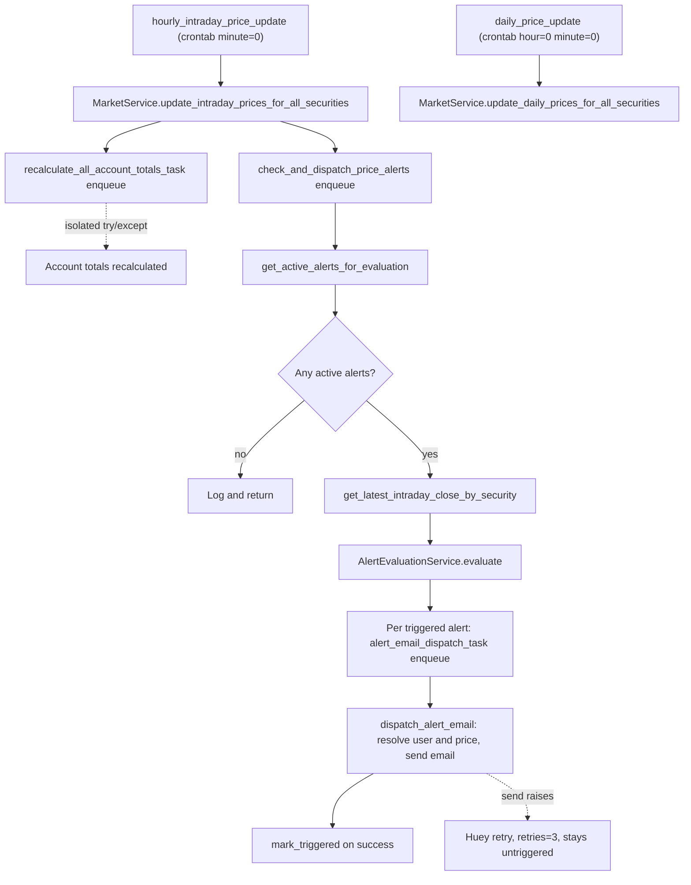
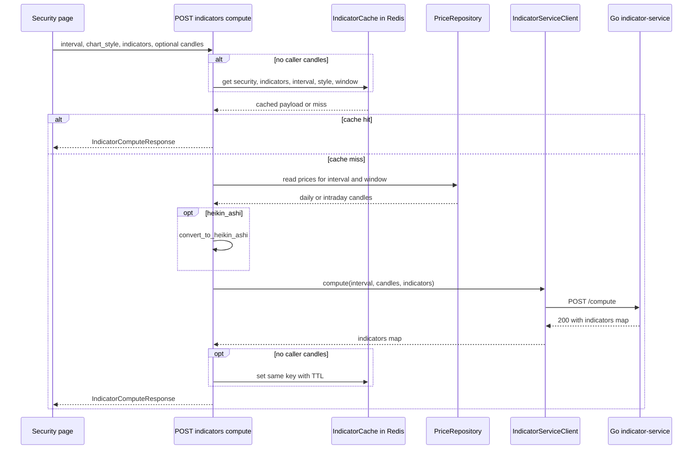

# Market Data, Indicators & the Price Update Cascade

Market data has three moving parts that must not be confused with one another:

1. **Ingestion** — prices are pulled from EODHD through the `MarketGateway` abstraction, persisted to Postgres, and re-read on demand (a *read-through* repository, `EodhdPriceRepository`).
2. **Scheduling** — two Huey periodic tasks (`daily_price_update` nightly, `hourly_intraday_price_update` every hour) walk all active securities and, in the hourly case, fan out into a cascade of enqueued follow-up tasks.
3. **Derived series** — technical indicators are computed on demand by a stateless Go sidecar (`services/indicator-service`) behind `POST /market/securities/{security_id}/indicators/compute`, with Redis result caching.

See [Domains](../architecture/domains.md) for the module map and service registration, [Charting](../architecture/charting.md) for how the frontend consumes these series, [External Services](../integrations/external-services.md) for EODHD, and [Operations workflows](../operations/workflows.md) for the periodic-task schedule.

## Ingestion: the EODHD-backed price repository

`EodhdPriceRepository` (`src/market/repository_eodhd.py`) decorates the SQLAlchemy `PriceRepository` with the `MarketGateway` and is the only `PriceRepository` registered by `register_market_services` — so *every* consumer, including accounts and portfolios, goes through the read-through path. It has three behaviours worth knowing:

- **`get_prices(security, from_date, to_date, …)` is read-through.** It reads the DB range, calls EODHD for the same range, then persists the union with **EODHD winning per date** (`merged = {p.date: p for p in new_prices}` and only DB dates absent from the EODHD result are kept). The merged list is saved back and returned sorted by date. A single date in the requested window therefore costs one API call and one write.
- **`get_latest_price` is lazy.** It returns the stored close only if it is already at or past the *last expected NYSE trading day* — computed by walking back from `today - 1 day` past weekends and `holidays.NYSE()` holidays. Otherwise it re-fetches the last 7 days through `get_prices` and returns the final row.
- **`get_price_on_date` falls back and persists.** A DB miss calls EODHD for that exact date, saves the result via the inner repository, and returns it; an EODHD miss returns `None`.
- `save_price` / `save_prices` deliberately raise `NotImplementedError` — writes must go through the inner DB repository or `MarketService`.

The gateway itself (`src/market/eodhd.py`) is the only place that talks to EODHD. `EodhdGateway` uses `eodhd.APIClient` for prices and a raw `requests.get` for `https://eodhd.com/api/search/{query}`, and it builds the EODHD symbol as `f"{symbol}.{exchange}"`. `EodhdGateway.get_intraday_prices` supports **only the `1h` interval** and raises `ValueError` otherwise. Both the list-shaped and DataFrame-shaped EODHD responses are handled, and flat candles (`open == high == low == close` with zero volume) are dropped. `eodhd_gateway_factory` returns `StubEodhdGateway` when `settings.stub_external_api` is set — the same switch that makes tests hermetic.

### Reads from the API

`MarketService` (`src/market/service.py`) owns the scheduled writes and the ad-hoc backfill helpers; `market_router` owns the HTTP surface for reads:

| Endpoint | Behaviour |
|---|---|
| `GET /market/prices/{security_id}` | Daily/weekly/monthly: `from_date` and `to_date` are **required** (else 422); rows are read (limit 100000) and `1w`/`1m` are derived by `aggregate_weekly_prices` / `aggregate_monthly_prices` in-process. Intraday (`1h`/`4h`): reads `IntradayPriceRepository`, and if the result is empty or its first candle starts more than 4 days after `from_date`, calls `MarketService.fetch_and_save_intraday_prices` and re-reads. `4h` candles are produced by `aggregate_4h_candles`. |
| `GET /market/prices/{security_id}/last-close` | `PriceRepository.get_latest_price` — i.e. the read-through latest close. |
| `GET /market/search` and `GET /market/securities/search` | Same handler, aliased. Cache-first against `SecuritySearchCache`, else `MarketGateway.search`, then cache write. |

Aggregation is pure and shared: `aggregate_weekly_prices` groups by ISO `(year, week)`, `aggregate_monthly_prices` by `(year, month)`; both take open from the first candle, close/adjusted_close from the last, max high, min low and summed volume. `aggregate_4h_candles` buckets by `hour // 4` on the same contract. All three are also exposed as static methods on `PriceAggregationService`.

### The nightly and hourly jobs

`MarketService.update_daily_prices_for_all_securities` fetches all active securities and runs `_update_security_prices(security, today - 365 days, today)` for each in a single `asyncio.gather`, returning `{"success": n, "failure": m}`. Failures are swallowed per security (`_update_security_prices` catches `Exception`, logs, and returns `False`) so one bad symbol cannot abort the batch. `MarketService.update_intraday_prices_for_all_securities` is the same shape over the **last 7 days** at `1h`. `fetch_and_save_price_history` (used when a new security is created from search) fetches from `2000-01-03` to today; `fetch_and_save_intraday_prices` defaults to a 30-day window.

Both jobs are Huey tasks in `src/market/task.py` that wrap async bodies with `asyncio.run`, resolving services from `huey.svcs_registry` inside an `svcs.Container`:

- `daily_price_update` — `@huey.periodic_task(crontab(hour="0", minute="0"))`.
- `hourly_intraday_price_update` — `@huey.periodic_task(crontab(minute="0"))`.

The worker runs as `huey_consumer src.worker.huey -w 2 --worker-type thread --periodic`; `src.worker.huey` is a `MemoryHueyWithRegistry` under `ENVIRONMENT=test` and a `RedisHueyWithRegistry` everywhere else, and the registry is attached in the `@huey.on_startup` hook. Task modules are imported at the bottom of `src/worker.py` so they register.

## The price-update cascade

Only the hourly task fans out. After `update_intraday_prices_for_all_securities` completes, it performs **two isolated enqueues**, each wrapped in its own `try/except` so a failure to enqueue one cannot abort the other or the task — the account-totals recalculation from the account domain, and alert evaluation:

The nightly and hourly jobs, and the three-stage cascade the hourly one triggers: each enqueue point is isolated, and email dispatch is email-then-mark.

### Stage 2 — evaluation

`check_and_dispatch_price_alerts` (`@huey.task()`) evaluates all alerts whose `triggered_at IS NULL`, joined with security info (`PriceAlertRepository.get_active_alerts_for_evaluation`). No active alerts → it logs and returns **without** querying intraday prices. Otherwise it fetches one map of latest intraday close per security (`IntradayPriceRepository.get_latest_intraday_close_by_security`) and delegates to `AlertEvaluationService.evaluate`:

- `condition == "above"` triggers when `latest >= target`; `condition == "below"` triggers when `latest <= target` — **both boundaries inclusive**.
- A security with no intraday close is skipped, not defaulted.

`evaluate` is a pure static method over `(alerts, latest_prices)`, which is why the behavioural tests live in `tests/market/test_alert_evaluation_service.py` while `tests/market/test_check_and_dispatch_price_alerts.py` only asserts delegation. For each triggered alert the task enqueues `alert_email_dispatch_task(alert.alert_id, run_ts)` inside its own `try/except`; the run timestamp is threaded from Stage 2 so it is stable across retries, and a per-alert enqueue failure is logged and skipped rather than aborting the loop.

### Stage 3 — dispatch, retry and the triggered flag

`alert_email_dispatch_task` is declared `@huey.task(retries=3)`. `AlertEvaluationService.dispatch_alert_email` implements an **email-then-mark** invariant:

1. Re-fetch the alert and no-op if it is missing or already triggered — the idempotency guard against duplicate dispatch from a retry.
2. Resolve the security, then **re-resolve the latest price at dispatch time** rather than reusing the Stage 2 snapshot; a security with no price is skipped.
3. Resolve the recipient through `UserApi.get_email_for_user`; an unknown user is skipped.
4. Send the email. On failure the exception is **re-raised** so Huey retries, and `mark_triggered` is *not* called.
5. Only after a successful send is `PriceAlertRepository.mark_triggered(alert_id, run_ts)` called.

The consequence is deliberate: a failed dispatch leaves `triggered_at IS NULL`, so the next hourly run re-evaluates and re-enqueues the alert, and the 3 retries cover transient SMTP/DB errors within the same run. Alerts themselves are managed by the `market_router` CRUD endpoints (`GET`/`POST /market/securities/{security_id}/alerts`, `DELETE …/alerts/{alert_id}`), which are per-user and paginated.

## Indicator computation

### The in-process legacy path

`GET /market/securities/{security_id}/indicators` computes a fixed set of indicators **in Python** from stored daily prices via `src/market/indicators.py` (`calculate_50_day_ma`, `calculate_200_day_ma`, `calculate_50_week_ma`, `calculate_200_week_ma`, `calculate_macd`, `calculate_rsi`). Weekly variants first reduce to weekly closes with `calculate_weekly_closes`. Results are assembled into `TechnicalIndicatorsRead` and cached in Redis. This endpoint takes only a list of indicator names; it has no interval, no custom candles and no date window.

### The compute path to the Go sidecar

`POST /market/securities/{security_id}/indicators/compute` is the path the chart uses. Its request is `IndicatorComputeRequest` (`src/market/schema.py`): `interval` (default `1d`), `chart_style` (`candlestick` | `heikin_ashi`), `indicators` (`IndicatorSpecSchema[]`), optional `candles`, and optional `from_date`/`to_date`.

The handler's control flow is:

1. If both date bounds are present, normalize the date/datetime union to plain dates and reject `from > to` with **422**. Comparing a naive datetime with a date raises `TypeError`, which is why the normalization exists.
2. **Cache lookup only when the caller supplied no candles** — a caller-supplied candle array describes a synthetic series (the chart's rewind slice) and must never be served from, or written to, the per-security cache.
3. Resolve candles:
   - Caller-supplied candles are used as given.
   - Daily/weekly/monthly: read `PriceRepository` over the date window (or filter `get_by_security` in-memory when a bound is only partly present), sort, aggregate `1w`/`1m`, and map into `IndicatorCandleSchema` with `time = p.date.isoformat()`.
   - Intraday: read `IntradayPriceRepository` over a converted datetime range, sort by timestamp, aggregate `4h`, and map with `time = int(c.timestamp.timestamp())` — epoch seconds, which the sidecar passes through untouched.
4. If `chart_style == "heikin_ashi"`, convert with `convert_to_heikin_ashi` **before** dispatch (the first candle uses `ha_open = (open+close)/2`; later candles chain from the previous HA open/close).
5. `IndicatorServiceClient.compute(interval, candles, indicators)` → `POST <base_url>/compute`.
6. Cache the response (keyed identically to the lookup) only when the caller supplied no candles.

The indicator round trip: cache and price reads are skipped for caller-supplied candles, and cache write-back only happens for the server-resolved path.

### The sidecar contract

`services/indicator-service` is a stateless Go calculator built on `github.com/cinar/indicator/v2`. It owns no data and no state between requests.

- **`POST /compute`** takes `{interval, candles, indicators}`; `interval` defaults to `"1d"` when omitted or empty. It returns `200` with `{"indicators": {<ResultKey>: <series>}}`, where `ResultKey` is the spec `id` when set and the spec `type` otherwise. Each series is an array of points carrying the input candle `time`; **too few candles yields an empty array, not an error**.
- **`GET /health`** returns `{"status": "ok", "service": "indicator-service"}`. Both handlers return `405` with an `Allow` header for any other method.
- **`400`** covers an invalid JSON body (`{"error": "invalid json body: …"}`) and an unsupported indicator type (`{"error": "unsupported indicator type: <type>"}`). The body is capped at 10MB via `http.MaxBytesReader`.
- Supported types: `sma`, `ema`, `bb` (`bollinger`, `bollinger_bands`), `macd`, `rsi`, `obv`, and the `ma50`/`ma200`/`ma50w`/`ma200w` family with day/week aliases. Parameter resolution is **top-level field (> 0) → `settings` map → built-in default**. The `ma*` types rescale their period to the requested interval (`ScalePeriod`), e.g. `ma50` on `1h` becomes an SMA over 350 candles; unknown intervals are left unscaled.

**There is no authentication and no rate limiting on this service.** It is intended for the internal Docker network only and must never be exposed publicly; the FastAPI backend is its only intended client.

### Caching and error mapping

Two separate Redis caches live in `src/market/cache.py`:

- **`IndicatorCache`** — key is `indicators:<security_id>:<interval>:<chart_style>:<sha256 digest>` with `:<price_count>` appended when a price count is supplied. The digest is computed over a canonical payload: each indicator spec is canonicalized (strings become `{"type": …}`, models are dumped `by_alias=True, exclude_none=True`, dicts pass through), each item is `json.dumps(..., sort_keys=True)`, the items are **sorted**, and the whole `{indicators, from_date, to_date}` object is hashed. Window bounds are normalized to date-only ISO strings, so an equivalent `date` and `datetime` bound share one key. This makes the key order-insensitive to indicator order and sensitive to interval, chart style and window. The **TTL is 3600 seconds** (1 hour), applied with `setex`. `invalidate_security` scans and deletes `indicators:*<security_id>*`; `flush_all` deletes `indicators:*`. Every Redis operation is wrapped so a cache error logs a warning and degrades to a miss / no-op rather than failing the request.
- **`SecuritySearchCache`** — key is `market:search:<normalized query>`, where normalization is strip + lowercase + collapse internal whitespace. **Its TTL is `DEFAULT_SEARCH_CACHE_TTL = 2_592_000` seconds (30 days)**, and `set` accepts a per-call `ttl` override. A non-list cached payload is treated as a miss (`Invalid cache payload format`). It is used both by the search endpoints and by `SecurityApi.get_or_create_from_broker`.

Note the distinction: the indicator cache is a short-lived (1h) result cache keyed by a semantic digest, whereas the search cache is a long-lived (30d) cache of external lookup results keyed by literal normalized text — which is why a wrong or stale search answer lingers so much longer.

`IndicatorServiceClient` (registered as a request-scoped async-generator factory, `indicator_service_client_factory`) maps sidecar outcomes to backend statuses:

| Sidecar outcome | Backend response |
|---|---|
| `httpx.TimeoutException` (default timeout `10.0`s) | `504` "Indicator service timed out" |
| `httpx.ConnectError` / `httpx.NetworkError` | `503` "Indicator service unavailable" |
| `400` | `400`, with the sidecar's `error` text as detail |
| any `5xx` | `503` "Indicator service unavailable" |
| any other non-`200` | propagated status, response text as detail |

On success it unwraps the `indicators` envelope (`data["indicators"]` when present, else the raw body). The client owns one long-lived `httpx.AsyncClient` created on first use and closes it on container teardown — but **only a client it created itself**; an injected client is left alone, which is what lets tests pass an `httpx.MockTransport` client.

### Configuration

`settings.indicator_service_url` defaults to `http://localhost:8080` and is set via `INDICATOR_SERVICE_URL`; `.env.example` sets `http://indicator-service:8080` for Compose (the compose service name). Dev compose publishes `${INDICATOR_SERVICE_PORT:-8085}` → container `8080`; prod compose fixes `8085:8080` with `restart: always`. Both compose files healthcheck `GET /health` with `wget`.

## Frontend consumption

- **`MarketService`** (`frontend/src/lib/api/marketService.ts`) wraps `/market/search`, `/market/prices/{id}` (`interval`, `from_date`, `to_date`), `/market/prices/{id}/last-close`, `/market/securities/{id}`, `/market/security`, and the watchlist calls.
- **`IndicatorsService`** (`frontend/src/lib/api/indicatorsService.ts`) exposes `computeIndicators(securityId, {interval, chart_style, indicators, candles?, from_date?, to_date?})` plus two thin legacy wrappers (`getIndicatorData`, `getAllIndicatorData`) that call the in-process `indicators` endpoint with a `?type=` query the backend does not read. Its TypeScript types — `IndicatorSpec`, `IndicatorCandle`, `IndicatorComputeResponse` — mirror the Pydantic schemas, and `IndicatorConfig`/`IndicatorSettings` are the same types the preference store and the finance helpers (`rsi.ts`, `macd.ts`, `obv.ts`, `bollinger-bands.ts`) import.

The security page is the main consumer. `refreshActiveIndicators` collects every enabled indicator into `IndicatorSpec[]` (skipping `volume` and `avgPrice`: volume is rendered locally from the displayed candles, and `avgPrice` is a dashed price line, not an indicator series), builds one compute request for the whole set, and adds one series per requested key. `onIndicatorToggle` computes a single spec. Both guard against out-of-order responses with a monotonic `sequenceCounter` plus a per-indicator `indicatorSeq` map and discard stale results; the shared refresh also synchronizes every active indicator's sequence before the request. Failures are caught and logged — a sidecar outage degrades the chart to "no indicator series", it does not break the page.

The chart's rewind feature is the reason `candles` is in the request at all: replaying the chart at a past instant sends the sliced candles so an oscillator shows the values it *would have had* then — and, per the cache rule above, that request bypasses the cache entirely.

## Tests

Backend tests stub both EODHD and the sidecar; **no test requires a live service**.

- `tests/market/test_indicator_client.py` — `httpx.MockTransport` against `IndicatorServiceClient`: success unwrapping, `504` on timeout, `503` on connect error and on upstream `500`, `400` pass-through, single owned client reuse, and `aclose` closing only an owned client.
- `tests/market/test_indicator_compute_api.py` — router-level: `401` unauthenticated, `404` unknown security, `422` for a reversed and for a mixed timezone date range, custom candles with `heikin_ashi`, interval/timestamp shaping (`1h` sends integer epoch `time`), cache hit/miss behaviour (sidecar called once), the read/write window being identical, and `503` propagation.
- `tests/market/test_indicator_cache.py` — key structure (5 or 6 colon-separated parts), canonical ordering independence, interval/chart-style differentiation, date/datetime window equivalence, window isolation, graceful Redis-error handling, `invalidate_security`, `flush_all`.
- `tests/market/test_search_router.py`, `tests/market/test_security_search_cache.py` — cache hit skips the gateway; miss queries it and writes the cache.
- `tests/market/test_alert_evaluation_service.py` — inclusive boundaries, missing-price skip, already-triggered/not-found no-ops, email-then-mark, and that a send exception propagates for retry. `tests/market/test_check_and_dispatch_price_alerts.py` and `test_alert_email_dispatch_task.py` cover task wiring (early return with no alerts, one enqueue per triggered alert, isolated enqueue failure, `retries=3`).
- `tests/market/test_eodhd.py` — list vs DataFrame response shapes, flat-candle filtering, and the `1h`-only interval guard.
- Go: `services/indicator-service/{calculator_test.go,handlers_test.go,timeframe_test.go}` via `go test ./...`.

`src/commands/flush_market_data.py` is the operational escape hatch: `--security-id <uuid>` deletes that security's `PriceModel` and `IntradayPriceModel` rows and calls `IndicatorCache.invalidate_security`; `--all` truncates both tables and calls `IndicatorCache.flush_all`. Both modes print the row counts and require interactive confirmation.
