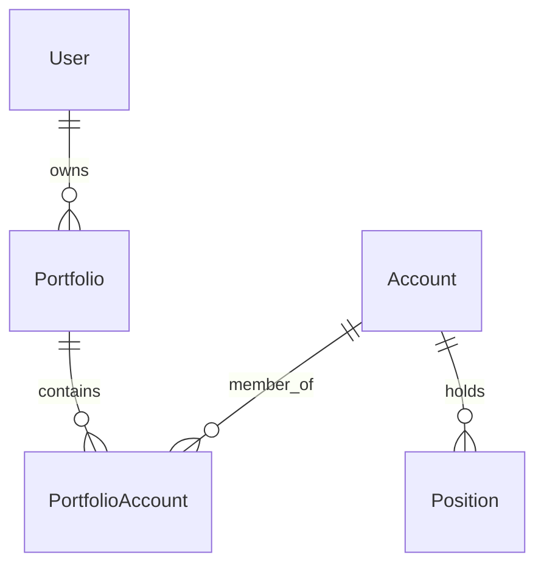
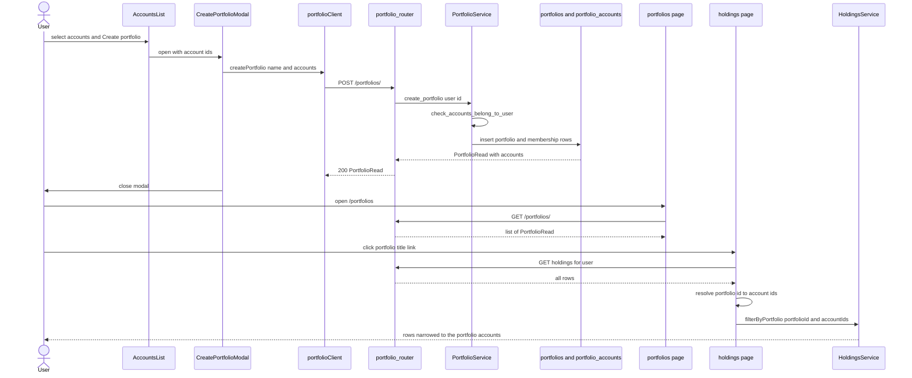
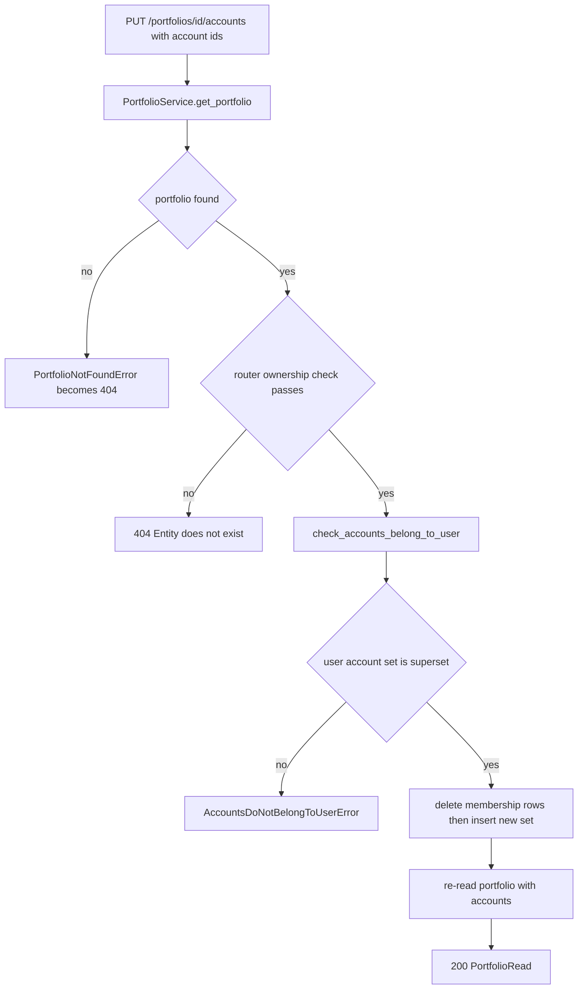

# Portfolios & Holdings Filters

A **portfolio** in `retail-portfolio` is a user-owned, named grouping of accounts. It
stores no positions and holds no balances: it is a membership set over
`accounts`, and its only downstream consumer is the `/holdings` filter, which
narrows the already-loaded holdings rows to the accounts in the set. Everything
else here is the lifecycle of that set — create, rename, replace membership,
delete — plus the ownership checks that keep one user's portfolio invisible to
another.

The page owns the whole cross-system chain:

| Layer | Location | What it does |
| --- | --- | --- |
| Models | `src/account/model.py` | `PortfolioModel`, `PortfolioAccountModel` (composite-PK join table) |
| Migration | `migrations/versions/7e1953e28527_add_portfoliomodel_and_.py` | creates `portfolios` and `portfolio_accounts` |
| Repository | `src/account/repository.py`, `src/account/repository_sqlalchemy.py` | the `PortfolioRepository` interface and its SQLAlchemy implementation |
| Service | `src/account/service/portfolio.py` | `PortfolioService` — membership validation and CRUD |
| Router | `src/account/router.py` | `portfolio_router`, prefix `/portfolios` |
| Frontend list | `frontend/src/routes/portfolios/+page.server.ts`, `+page.svelte` | SSR list plus local rename/delete overlay |
| Frontend create | `frontend/src/lib/components/accounts/create-portfolio-modal.svelte` | creation from the accounts dashboard |
| Filter seam | `frontend/src/routes/holdings/+page.svelte`, `holdingsService.svelte.ts` | `?portfolio_id=` → account ids → `filterByPortfolio` |

The holdings read path itself (the paging loop, grouping, per-currency buckets,
`HoldingRead`/`UserHoldingRead`) is owned by
[Accounts & Holdings Views](accounts-and-holdings-views.md) and is not re-derived
here. The identity and 404-not-403 rules are owned by
[Authentication & Authorization](../architecture/authentication.md); the backend
layer conventions by [Backend Domains](../architecture/domains.md); the SvelteKit
shell and `ApiClient` conventions by
[Frontend Architecture](../architecture/frontend.md).

## Entity model

`PortfolioModel` is a plain owned entity: `id` (`PortfolioId`, a `UUID`),
`user_id`, `name`, plus `created_at` / `updated_at` / `deleted_at` timestamps.
Membership lives in a separate association model, `PortfolioAccountModel`, whose
primary key is the composite `(portfolio_id, account_id)` — so the same account
can never be added twice to the same portfolio, no matter what the client sends.

Both foreign keys are real `ForeignKey` columns (`portfolio_id → portfolios.id`,
`account_id → accounts.id`), and both sides cascade `all, delete-orphan` to their
`portfolio_accounts` relationship. There is no database-level `ON DELETE CASCADE`;
the deletion of a portfolio is done through the ORM relationship.



The diagram shows a portfolio as a join table over accounts: it references accounts and inherits their positions transitively, never storing a position itself.

Two constraints shape behavior:

- **`UniqueConstraint("user_id", "name")` on `portfolios`.** Names are unique per
  user, not globally, and a duplicate name surfaces as an `IntegrityError` from the
  repository's `commit()` rather than a validated 4xx — there is no pre-check in
  `PortfolioService`.
- **`deleted_at` exists but is never written.** The column is declared nullable on
  both the model and the migration, `PortfolioSchema` exposes it, and the
  `other_user_portfolio` fixture sets it to `None`, but `PortfolioRepository.delete`
  performs a hard `Session.delete` and nothing ever soft-deletes a portfolio.
  Treat `deleted_at` as reserved, not as live behavior.

The migration that ships the model change is
`migrations/versions/7e1953e28527_add_portfoliomodel_and_.py`, whose
`create_table` calls mirror the two models exactly (including the
`UniqueConstraint('user_id', 'name')` and the `(portfolio_id, account_id)`
`PrimaryKeyConstraint`). Its `downgrade` drops `portfolio_accounts` before
`portfolios`. As with every model change in this repository, the revision ships
with the model in the same change.

## Repository contract

`PortfolioRepository` (`src/account/repository.py`) is an abstract interface with
six methods — `get`, `get_by_user`, `create`, `sync_accounts`, `update`, `delete` —
all declared in terms of schemas (`PortfolioRead`, `PortfolioCreate`), never ORM
models. `SqlAlchemyPortfolioRepository`
(`src/account/repository_sqlalchemy.py`) implements it; the pair is registered in
`src/account/registry.py` as
`registry.register_factory(PortfolioRepository, sqlalchemy_portfolio_repository_factory)`
alongside `PortfolioService` via `portfolio_service_factory`, so the whole
portfolio stack resolves through the `svcs` container like any other account-domain
component.

Three implementation details matter to callers:

- `get` and `get_by_user` both `selectinload` the two-hop
  `portfolio_accounts → account` chain, and `_to_portfolio_read_schema` projects
  each membership row into a full `AccountSchema`. That is why a `PortfolioRead`
  carries embedded accounts rather than ids, and why `get_by_user` costs one extra
  `IN`-style query rather than N.
- `sync_accounts` is a **full replacement**, not a diff: it issues
  `delete(PortfolioAccountModel).where(portfolio_id == ...)` and then inserts the new
  set, in one transaction. Passing `[]` legitimately empties a portfolio (the router
  test `test_portfolio_accounts_update_empty` pins that).
- `create` and `sync_accounts` iterate `set(...)` of the requested ids, so duplicate
  ids in the payload collapse to one membership row instead of colliding on the
  composite primary key.

`PortfolioService` (`src/account/service/portfolio.py`) is thin and is where the
validation ordering lives, not the queries. It depends on `PortfolioRepository`
**and** `AccountService`, and each method validates before writing:

- `get_portfolio` raises `PortfolioNotFoundError` when the repository returns
  `None`; `get_portfolios_by_user` passes straight through.
- `create_portfolio` calls
  `AccountService.check_accounts_belong_to_user(account_ids=..., user_id=...)` before
  `repository.create`.
- `sync_portfolio_accounts` first calls `get_portfolio` (existence), then
  `check_accounts_belong_to_user` (membership validity), then `repository.sync_accounts`.
- `update_portfolio` and `delete_portfolio` both call `get_portfolio` first, so a
  rename or delete of an unknown id fails as not-found instead of silently no-oping.

The ownership primitive is `AccountService.check_accounts_belong_to_user`
(`src/account/service/account.py`): it loads the user's accounts, builds
`{account.id for account in user_accounts}`, and raises
`AccountsDoNotBelongToUserError` unless that set is a superset of the requested ids.
It is deliberately a **set-superset test over the caller's own accounts**, which
means it rejects (a) another user's account ids and (b) ids that do not exist at
all, with the same error. `AccountsDoNotBelongToUserError` extends
`AuthorizationError`, so `src/main.py` maps it to an authorization HTTP status;
`PortfolioNotFoundError` extends `EntityNotFoundError`.

## Router surface

`portfolio_router = APIRouter(prefix="/portfolios")` in `src/account/router.py` is
mounted under the `/api/v1` aggregate, so the wire paths are `/api/v1/portfolios/...`.
Every handler declares `user: Annotated[User, Depends(current_user)]` and resolves
`PortfolioService` from `DepContainer`:

| Method and path | Handler | Behavior |
| --- | --- | --- |
| `GET /` | `portfolios` | `get_portfolios_by_user(user.id)` — the current user's portfolios, each with embedded accounts |
| `POST /` | `portfolio_create` | `create_portfolio(user.id, body)`; body is `{ name, accounts }`; returns the created `PortfolioRead` with 200 |
| `PUT /{portfolio_id}/accounts` | `portfolio_accounts_sync` | full membership replacement; body is `{ accounts }` |
| `PATCH /{portfolio_id}` | `portfolio_update` | rename; body is `{ name }` with `min_length=1` |
| `DELETE /{portfolio_id}` | `portfolio_delete` | hard delete; returns a bare `Response(204)` |

There is deliberately **no** `GET /{portfolio_id}` and no create/update endpoint that
changes membership and name together.

### Double ownership enforcement

The three id-addressed routes each perform the ownership check **in the router** in
addition to whatever the service does:

```python
portfolio = await portfolio_service.get_portfolio(portfolio_id)
authorization_api.check_entity_owned_by_user(user, portfolio)
```

`AuthorizationApi.check_entity_owned_by_user` (`src/auth/api.py`) raises
`HTTPException(404, "Entity does not exist")` whenever the entity is `None` **or**
its `user_id` differs from the caller's — the two cases are indistinguishable from
outside, so a portfolio that belongs to somebody else reads exactly like one that
does not exist. That is why `test_portfolio_update_not_owned`,
`test_portfolio_delete_not_owned` and `test_portfolio_accounts_update_not_owned` all
assert **404**, matching their `*_not_found` siblings. `PortfolioService` itself does
not compare `user_id`; the router is the enforcement point, and
`get_portfolios_by_user(user.id)` is what scopes the list read.

`portfolio_accounts_sync` is the one route that repeats the account check as well:
it calls `check_accounts_belong_to_user` at the router level *and* delegates to
`sync_portfolio_accounts`, which checks again inside the service. The redundancy is
intentional — a service method is not assumed to be reachable only through its own
route — and it means the account-ownership failure happens before any membership
`DELETE` is issued.

The order of operations for a sync is therefore: resolve user from the cookie or
bearer token → load the portfolio (404 if unknown) → ownership check (404 if foreign)
→ account-ownership check (authorization error for any foreign or unknown account id)
→ delete-then-insert membership → re-read the portfolio with accounts → return it.
Nothing is written until all three validations have passed.

### Validation and failure modes

- **Malformed bodies are 422.** `PortfolioCreate` requires both `name` and
  `accounts`; `PortfolioUpdateRequest` declares `name: str = Field(..., min_length=1)`,
  so an empty string is rejected. `test_portfolio_create_missing_name`,
  `test_portfolio_create_missing_accounts`, `test_portfolio_update_empty_name` and
  `test_portfolio_update_missing_name` pin these.
- **Not-found is 404** for an unknown `portfolio_id` (`test_portfolio_delete_not_found`,
  `test_portfolio_update_not_found`, `test_portfolio_accounts_update_not_found`).
- **Foreign portfolios are 404**, never 403.
- **Foreign or nonexistent account ids** raise `AccountsDoNotBelongToUserError`,
  which the shared error mapping turns into an authorization status — not a 404.
- **Duplicate names** are a database `IntegrityError` from the unique constraint;
  there is no friendly mapping for it.
- `DELETE` always returns 204 with no body, even though the delete is a hard delete
  of the row plus its join rows — a subsequent `GET /` simply omits it
  (`test_portfolio_delete_success` re-lists to confirm).

### What happens to membership rows on delete

`PortfolioRepository.delete` loads the `PortfolioModel` and calls
`Session.delete`, which triggers the `cascade="all, delete-orphan"` on
`PortfolioModel.portfolio_accounts`; every `portfolio_accounts` row for that
portfolio is removed with it. **The accounts themselves are untouched** — deleting a
portfolio never deletes an account or a position. The reverse direction is symmetric
and belongs to the account domain: `SqlAlchemyAccountRepository.delete` explicitly
deletes the account's `PortfolioAccountModel` rows (and its `PositionModel` rows)
before the account row, so an account deleted from the accounts dashboard cannot
leave a dangling portfolio membership.

## The `/portfolios` page (list, rename, delete)

`frontend/src/routes/portfolios/+page.server.ts` is the strict awaited SSR shape:

```ts
export const load: PageServerLoad = async ({ fetch, cookies }) => {
	const token = cookies.get('auth_token');
	try {
		const portfolios = await getPortfolioClient(fetch).getPortfolios(token);
		return { portfolios };
	} catch (err) {
		if (err instanceof ApiError) {
			if (err.status === 401) {
				deleteAuthCookie(cookies);
				throw redirect(303, '/auth/login?clear_session=true');
			}
			throw error(err.status, err.message);
		}
		throw error(500, 'Internal Server Error');
	}
};
```

Three branches, all pinned by `frontend/src/routes/portfolios/page.server.test.ts`:
success returns `{ portfolios }` and the list is present in the SSR HTML; a `401`
`ApiError` routes through `deleteAuthCookie(cookies)` and
`redirect(303, '/auth/login?clear_session=true')`; any other `ApiError` re-throws as a
SvelteKit `error(status, message)`; an unknown throw becomes
`error(500, 'Internal Server Error')`. The token comes from the httpOnly
`auth_token` cookie and is passed explicitly as a Bearer override because an internal
server-side `fetch` does not replay the browser cookie.

`frontend/src/routes/portfolios/+page.svelte` renders one
`portfolio-list-item.svelte` per portfolio and keeps all subsequent mutation
**local** — there are no SvelteKit `actions` and no `invalidate` round trip:

```ts
let localPortfolios = $state<Portfolio[] | null>(null);
const portfolios = $derived(localPortfolios ?? data.portfolios ?? []);
```

- `handleRename(id, newName)` awaits `portfolioClient.updatePortfolio(id, { name })`
  and then rewrites the overlay with `portfolios.map(...)`;
- `handleDelete(id)` awaits `portfolioClient.deletePortfolio(id)` and then filters the
  overlay.

Both wrap the call in `try/catch` that only `console.error`s and leaves the overlay
untouched, so a failed mutation keeps showing the server-provided list — the load data
stays the source of truth. `PortfolioListItem` renders the name through
`EditableTitle`, which `href`s the title to
`/holdings?portfolio_id={portfolio.id}` — the entry point of the filter seam below —
and puts **Rename** (flipping `EditableTitle`'s `isEditing`) and **Delete portfolio**
(a `ConfirmationModal` with an explicit "this action cannot be undone" description)
behind an ellipsis dropdown. The row also shows the account count and
`Created {formatDate(created_at)}`.

`page.svelte.test.ts` drives exactly these two paths plus rendering: names, account
counts, formatted dates, the empty state (`data-testid="empty-state"`), the
`/holdings?portfolio_id=port-N` hrefs, an inline rename that asserts
`portfolioClient.updatePortfolio('port-1', { name: 'Tech Growth 2026' })` and the
updated text, and a delete that asserts `deletePortfolio('port-1')` and the row's
removal — including a cancel path that asserts the client was *not* called.

## Creation: the accounts-UI modal

Creation is **not** on the `/portfolios` page. It lives in the accounts dashboard,
where the user can select the accounts to group in the same gesture:

- `frontend/src/lib/components/accounts/accounts-list.svelte.ts` owns the selection
  state. `handleCreatePortfolioClick()` enters selection mode on the first press
  (button label becomes "Confirm Selection") and on the second opens
  `createPortfolioModal.open(this.selectedAccounts)` with `string[]` account ids.
- `frontend/src/lib/components/accounts/accounts-list.svelte` renders the button and
  mounts `CreatePortfolioModal` with
  `onCreated={() => state.cancelSelection()}`.
- `create-portfolio-modal.svelte` is a `Dialog` whose `$effect` pre-fills the name as
  `Portfolio - {YYYY-MM-DD}` whenever the modal opens. `handleSubmit` rejects an empty
  name ("Portfolio name is required.") and an empty selection ("No accounts
  selected.") client-side, then posts:

  ```ts
  await portfolioClient.createPortfolio({
  	name: name.trim(),
  	accounts: modalState.data
  });
  ```

  On success it calls `onCreated`, closes the modal and clears `isSubmitting`; on
  failure it surfaces `err.message` inside a destructive `Alert.Root` and keeps the
  modal open. `create-portfolio-modal.test.ts` covers the pre-filled name, the exact
  `createPortfolio({ name, accounts })` payload, and the error-preserves-modal case.

Note the asymmetry: the `/portfolios` route never calls `createPortfolio`, and the
modal never calls `updatePortfolio` / `deletePortfolio`.

## The client, and why tests must mock it

`frontend/src/lib/api/portfolioClient.ts` defines `PortfolioClient extends ApiClient`
with four methods spread over five endpoints, plus `getAccountClient`-style wiring:

| Method | Request |
| --- | --- |
| `getPortfolios(token?)` | `GET /portfolios/` |
| `createPortfolio(payload, token?)` | `POST /portfolios/` with `{ name, accounts }` |
| `updatePortfolio(id, payload, token?)` | `PATCH /portfolios/{id}` with `{ name }` |
| `deletePortfolio(id, token?)` | `DELETE /portfolios/{id}` (204 → `undefined`) |

There is **no `syncAccounts` method**: the `PUT /portfolios/{id}/accounts` endpoint
exists on the backend but has no frontend caller today, so membership can only be set
at creation time from the UI. That endpoint is the natural extension point for an
"edit portfolio accounts" flow — the client would need one new method, and the
`PortfolioAccountUpdateRequest` shape on the server already accepts it.

The module exports **two** entry points, and the distinction is load-bearing:

```ts
export const getPortfolioClient = (customFetch?: typeof fetch) => new PortfolioClient(customFetch);
export const portfolioClient = getPortfolioClient();
```

`getPortfolioClient(fetch)` is what SSR uses — the SvelteKit load `fetch`, so
`/portfolios` and `/holdings` server loads work — while `portfolioClient` is a
**module-level singleton** used by browser-side code (the `/portfolios` page overlay
and the create modal). Because the singleton exists at import time and is captured by
reference in components, a test cannot intercept it with a stubbed `fetch`; it must
mock the whole module:

```ts
vi.mock('$lib/api/portfolioClient', () => ({
	portfolioClient: {
		updatePortfolio: vi.fn(),
		deletePortfolio: vi.fn()
	},
	getPortfolioClient: vi.fn()
}));
```

Every suite that touches portfolio UI does this —
`portfolios/page.svelte.test.ts`, `accounts/create-portfolio-modal.test.ts` — and the
two server-load suites (`portfolios/page.server.test.ts`,
`holdings/page.server.test.ts`) mock the `getPortfolioClient` factory instead. This is
the repository-wide rule that frontend tests mock every API client and never reach a
real backend; because `portfolioClient` is a singleton rather than a factory-injected
dependency, ignoring it here is not merely a convention violation but a live network
call from the test process. `frontend/src/lib/api/portfolioClient.test.ts` is the one
suite that exercises the real class, doing so against a `vi.fn()` `global.fetch` and
asserting only the request shape (method, URL, `Authorization: Bearer`, JSON body).

`Portfolio` / `PortfolioCreatePayload` / `PortfolioUpdatePayload` live in
`frontend/src/lib/types/portfolio.ts`; `Portfolio.accounts` is a full `Account[]`
(not ids), which is exactly what the filter seam consumes.

## The filter seam: `?portfolio_id=` → account ids → holdings rows

This is the one place the portfolio system connects to another system, and the
connection is **client-side and id-based**. `frontend/src/routes/holdings/+page.server.ts`
reads `portfolio_id` and `account_id` from `url.searchParams` and returns them
verbatim as route data, next to the `portfolios` and `accounts` lists it fetches in the
same `Promise.allSettled([getPreferences, getPortfolios, getAccounts])` pass. It never
resolves the portfolio itself and never filters the query — holdings are always
fetched user-wide.

`frontend/src/routes/holdings/+page.svelte` then performs the resolution in its first
`$effect`:

```ts
if (data.portfolio_id) {
	const portfolio = data.portfolios?.find((p) => p.id === data.portfolio_id);
	const accountIds = portfolio ? portfolio.accounts.map((a) => a.id) : [];
	service.filterByPortfolio(data.portfolio_id, accountIds);
} else if (data.account_id) {
	service.filterByAccount(data.account_id);
} else {
	service.clearFilter();
}
```

`HoldingsService.filterByPortfolio(portfolioId, accountIds)`
(`frontend/src/lib/components/holdings/holdingsService.svelte.ts`) stores the
`{ type: 'portfolio', portfolioId, accountIds }` variant, and the `rows` getter keeps
only rows whose `account_id` is in `accountIds`. So **a portfolio becomes a holdings
filter by expansion into account ids that travel as route data** — no extra request,
no server-side join, and an unknown `portfolio_id` degrades to an empty
`accountIds` list (an empty table) rather than an error.

Interactions inside the page mirror the URL: `handleSelectFilter('portfolio', id)`
does the same `find` + `map` and `goto`s `/holdings?portfolio_id={id}` with
`replaceState: true, noScroll: true, keepFocus: true`, so a shared or reloaded link
restores the view without polluting history. The page also derives its subtitle
("Holdings in {name}") and the "no holdings match the selected filter" message from
the active filter. The read path, the paging loop and the grouping math stay on
[Accounts & Holdings Views](accounts-and-holdings-views.md).



The diagram shows the create → membership → filter flow: a portfolio is written with its membership rows, and reading it back into `/holdings` expands that membership into the account ids the client-side filter tests against.



The diagram shows the validation order that guards a membership write: existence, then ownership, then account ownership, and only then the delete-then-insert replacement.

## Tests that pin the behavior

| Suite | What it pins |
| --- | --- |
| `tests/routers/test_portfolios.py` | Empty and populated `GET /portfolios/`; create with one and several accounts; 422 on missing `name` / `accounts`; membership sync that adds, removes, keeps and empties (`accounts: []`); 404 for unknown and foreign portfolios on sync, rename and delete; rename visible in the subsequent list; 422 for empty or missing rename name; `DELETE` → 204 and disappearance from the list |
| `tests/fixtures/account.py` | `test_portfolios`, `test_portfolio_with_accounts` (membership rows for the first two accounts) and `other_user_portfolio` — the fixture that makes the not-owned 404 cases possible |
| `frontend/src/routes/portfolios/page.server.test.ts` | The load's success / 401-redirect / non-401 `ApiError` / unknown-error branches, with `$lib/api/portfolioClient` and `$lib/server/auth-cookie` mocked |
| `frontend/src/routes/portfolios/page.svelte.test.ts` | Rendering (names, account counts, dates, empty state), the `/holdings?portfolio_id=…` hrefs, inline rename through the dropdown, and the delete confirm/cancel pair |
| `frontend/src/lib/components/accounts/create-portfolio-modal.test.ts` | Pre-filled default name, the exact `createPortfolio` payload, and the error path that keeps the modal open without calling `onCreated` |
| `frontend/src/lib/api/portfolioClient.test.ts` | The four request shapes (method, URL, Bearer header presence/absence, JSON body), `ApiError` on non-OK responses, and that `getPortfolioClient(customFetch)` routes through the supplied fetch |

Backend suites run inside Docker (`docker compose exec backend …`) against a test
database and mock outbound services; frontend suites run under Vitest with every API
client mocked. Both rules apply unchanged to this subsystem.

## Working on this system

- **Changing the model** — `PortfolioModel` or `PortfolioAccountModel` — requires an
  Alembic revision in the same change, following `<hash>_<description>.py`; the model
  change and its migration ship together.
- **Adding an endpoint or route** means touching `PortfolioRepository` (interface),
  `SqlAlchemyPortfolioRepository`, `PortfolioService` and `portfolio_router` in that
  order, then adding a `PortfolioClient` method for the frontend. The
  `PUT .../accounts` route with no client method is the standing example of a gap on
  the frontend side of that chain.
- **Adding a service** that needs portfolios means registering it in
  `src/account/registry.py`; a dependency resolved by a router but missing from the
  registry fails only at request time.
- **Adding ownership checks** should reuse
  `AuthorizationApi.check_entity_owned_by_user`, which keeps the 404-not-403
  property rather than reimplementing a `user_id` comparison that would leak
  existence.
- **Anything new that a component calls through the `portfolioClient` singleton**
  needs its suite to add or extend the `vi.mock('$lib/api/portfolioClient', …)`
  factory, or the test will attempt a real network request.
