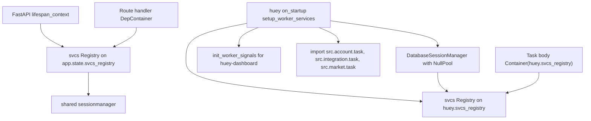
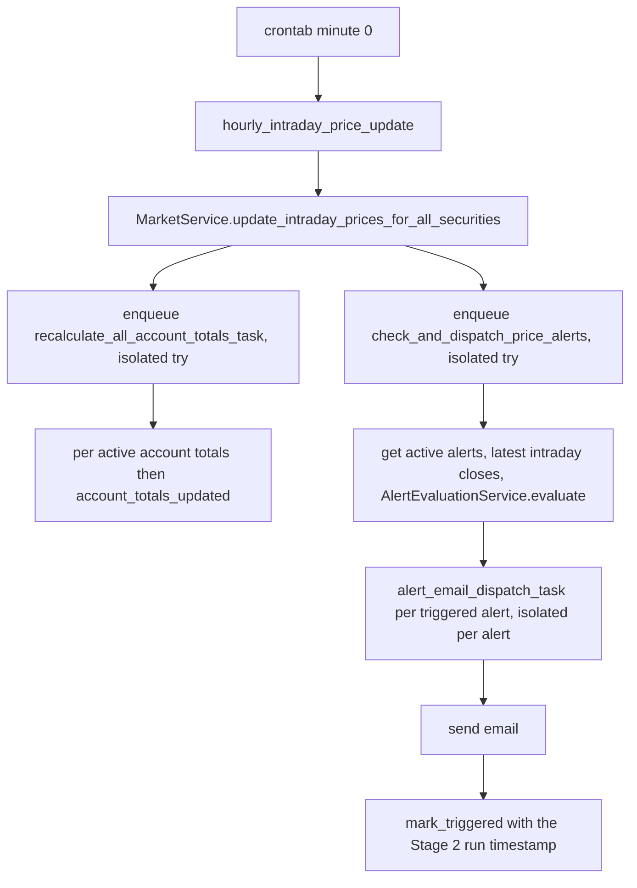
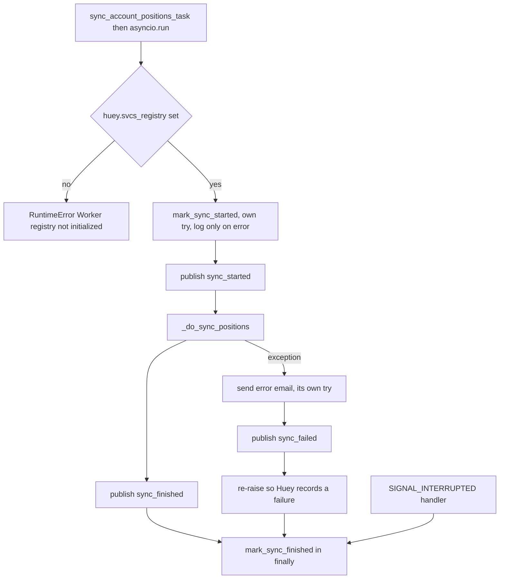
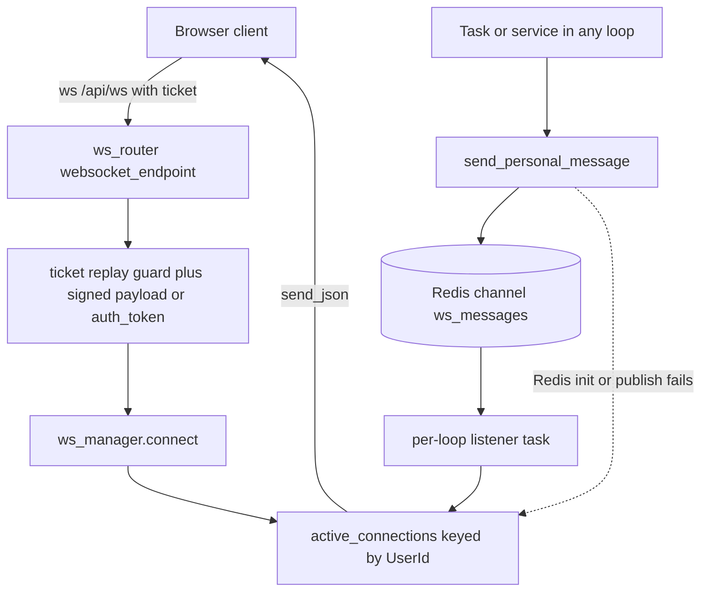

# Realtime, Background Jobs & the Worker

Everything that runs outside a request lives here: the `worker` container that consumes the
Huey queue, the tasks it runs, and the Redis-backed channel that lets a worker thread push a
message into a browser socket held by a completely different process.

Three contracts hold the design together:

1. **The worker owns its own DI registry.** The API resolves services from
   `app.state.svcs_registry`; a task body resolves from `huey.svcs_registry`, which only exists
   inside a running consumer. Every task therefore guards on that attribute before touching
   anything.
2. **A task never writes a WebSocket directly.** It publishes to the Redis channel
   `ws_messages`; whichever process holds the socket delivers it. Delivery is best-effort and the
   client has an independent poll as a fallback.
3. **Redis holds the display state for in-flight work, not a lock.** `account_syncs:active:{user_id}`
   drives the "syncing" badge and the fallback poll; it is a set with a TTL, not a mutex.

Related pages: the broker flow that drives the sync task is in
[Broker Connect, Import & Position Sync](./broker-sync.md); the price-update cascade's market
semantics in [Market Data, Indicators & the Price Update Cascade](./market-data-and-indicators.md);
the async note-title task in [AI Analysis Flows](./ai-analysis.md); settings and DI wiring in
[Configuration](../architecture/configuration.md); the domain map in
[Backend Domains](../architecture/domains.md); process/container topology in
[Architecture Overview](../architecture/overview.md); the mock-only testing rule in
[Testing & Verification](../operations/testing.md).

## The worker instance and its two registries

`src/worker.py` is the whole wiring of the consumer. It defines a `HueyWithRegistry` mixin that
carries an optional `svcs.Registry`, then picks the concrete Huey class by environment:

| `settings.environment` | Class | Behaviour |
|------------------------|-------|-----------|
| `test` | `MemoryHueyWithRegistry` | in-process, no Redis broker |
| anything else | `RedisHueyWithRegistry` | `url=settings.redis_url`, real queue |

Caption: two independent registries. The API builds its registry in the lifespan; the worker
builds a second one, with an unpooled session manager, inside `@huey.on_startup()`.

`setup_worker_services` (registered with `@huey.on_startup()`) calls `init_logging()`, wires the
huey-dashboard signals, then constructs a **fresh** `DatabaseSessionManager(settings.database_url,
{"echo": settings.echo_sql, "poolclass": NullPool})`, registers the full service graph on a new
`Registry`, and assigns it to `huey.svcs_registry`. `NullPool` is not an optimization — tasks call
`asyncio.run()` once per invocation, and a pooled async engine reused across those short-lived event
loops produces "operation in progress" errors. `@huey.on_shutdown()` closes the registry.

The three task modules are imported at the *bottom* of `src/worker.py`, purely so their decorators
run against the same `huey` instance; nothing else in the process imports them for their tasks. That
import is what makes `tests/tasks/test_account.py` able to assert
`"src.account.task.recalculate_all_account_totals_task" in huey._registry._registry`.

Because the registry exists only inside a running worker, task bodies split into two guard styles:

| Style | Tasks | On `huey.svcs_registry is None` |
|-------|-------|---------------------------------|
| Fail loudly | `_daily_price_update`, `_hourly_intraday_price_update`, `_recalculate_all_account_totals`, `_sync_account_positions_task` | raise `RuntimeError("Worker registry not initialized")` |
| Best effort | `_generate_note_title`, `_check_and_dispatch_price_alerts`, `_alert_email_dispatch` | return early |

Both styles then open `async with Container(huey.svcs_registry) as svcs_container:` and resolve
services with `aget`. Tasks that accept a `request_id` (the sync and note-title tasks) call
`set_request_id` and reset the contextvar in a `finally`, so worker logs inherit the originating
request's correlation id.

**Adding a job** means: define it in the owning domain's `task.py` with `@huey.task()` or
`@huey.periodic_task(...)`, import that module in `src/worker.py`, resolve dependencies through the
container, and restart the worker.

## Task inventory

| Task | Decorator / trigger | Retries | Publishes |
|------|---------------------|---------|-----------|
| `daily_price_update` | `@huey.periodic_task(crontab(hour="0", minute="0"))` | default | — |
| `hourly_intraday_price_update` | `@huey.periodic_task(crontab(minute="0"))` | default | — (enqueues two follow-ups) |
| `recalculate_all_account_totals_task` | `@huey.task()`, enqueued by the hourly update | default | `account_totals_updated` per active account |
| `check_and_dispatch_price_alerts` | `@huey.task()`, enqueued by the hourly update | default | — (enqueues Stage 3) |
| `alert_email_dispatch_task` | `@huey.task(retries=3)`, enqueued per triggered alert | **3** | — |
| `sync_account_positions_task` | `@huey.task()`, enqueued by the account sync route and the broker import path | default | `sync_started`, `sync_finished`, `sync_failed` |
| `generate_note_title_task` | `@huey.task()`, enqueued by note create/update routes | default | — |

Every task body is a thin synchronous wrapper over `asyncio.run(<async impl>)`; the async
implementation holds the logic and the container. Huey's own default retry count applies to
everything except `alert_email_dispatch_task`, which is the only task in the repo that declares
`retries=3` (pinned by `tests/market/test_alert_email_dispatch_task.py`).

## The periodic price cascade

Caption: Stage 1 (hourly price write) fans out into two independently enqueued branches, and the
alert branch fans out again into one retryable email task per triggered alert.

**Stage 1 — `_hourly_intraday_price_update`.** After resolving `MarketService` and running
`update_intraday_prices_for_all_securities`, it logs `success`/`failure` counts and then performs
two enqueues, each inside its own `try/except` (plus an `if huey.svcs_registry is not None` guard)
that only calls `logger.exception`. A failure to enqueue totals does not prevent the alert
evaluation from being enqueued, and neither failure propagates out of the periodic task — this
isolation is the explicit subject of
`test_hourly_intraday_price_update_account_totals_enqueue_failure_doesnt_abort` and
`test_hourly_intraday_price_update_check_dispatch_failure_doesnt_abort`.

**Stage 2 — `check_and_dispatch_price_alerts`.** Returns early when there are no active alerts
(before touching the intraday repository at all), otherwise loads
`get_active_alerts_for_evaluation()` and one bulk `get_latest_intraday_close_by_security()` map,
and hands both to the *pure* `AlertEvaluationService.evaluate` (inclusive comparisons; a missing
price skips the alert). Each triggered alert is enqueued as a separate
`alert_email_dispatch_task(alert.alert_id, run_ts)` where `run_ts` is the evaluation timestamp
threaded forward; an enqueue that raises is logged and skipped, and the loop continues.

**Stage 3 — `alert_email_dispatch_task`.** Declares `retries=3` and delegates to
`AlertEvaluationService.dispatch_alert_email`, which implements **email-then-mark**:

1. re-fetch the alert — a no-op when it is gone or `triggered_at is not None`, which is the
   idempotency guard against a duplicate dispatch from a retry;
2. resolve the security, re-resolve the latest intraday price *at dispatch time*, and resolve the
   recipient email (a missing security, price or user skips with a log, no raise);
3. send the email, and **only then** `mark_triggered(alert_id, run_ts)`;
4. if the send raises, log and re-raise so Huey retries — `triggered_at` stays `NULL` so the next
   hourly Stage 2 run re-enqueues it.

`daily_price_update` is the simple branch: it runs `update_daily_prices_for_all_securities` and
logs the result counts, with no downstream enqueue.

**Periodic scheduling is armed by the consumer command, not by the decorator.**
`docker-compose.yml` runs
`huey_consumer src.worker.huey -w 2 --worker-type thread --periodic` for dev (wrapped in
`watchfiles`), while `docker-compose.prod.yml` runs the same command **without** `--periodic`.
Without that flag Huey ignores `crontab` schedules entirely and the price tables stay empty —
the regression pinned by `test_worker_command_enables_periodic_scheduling`, which reads
`docker-compose.yml` and asserts both `huey_consumer` and `--periodic` are present.

## The broker sync task

`sync_account_positions_task(user_id, account, broker_account_id, broker_class, request_id=None)` is
enqueued synchronously from the request path — by `POST /api/v1/accounts/{account_id}/sync`
(rate-limited `3/minute`, via `PositionService` → `IntegrationAccountApi`) and once per newly
imported broker account in `POST /external/accounts/import` — with `get_request_id()` forwarded so
worker logs correlate with the request.

Caption: the ordered start/finish markers and events of one account sync, including the failure path
that still emails, still notifies, and still re-raises.

Ordering is the contract:

1. `mark_sync_started(user_id, account.id)` in its own `try/except` that only logs — a Redis outage
   must not abort a sync that would otherwise succeed.
2. Publish `sync_started` (`AccountSyncMessage`, serialized with `model_dump(mode="json")`).
3. `_do_sync_positions` — see [Broker Connect, Import & Position Sync](./broker-sync.md) for the
   symbol resolution and replace-per-account write.
4. Publish `sync_finished`.
5. On any exception: log, attempt `_send_sync_error_email` inside its own `try/except` (a mail
   failure is swallowed so the sync failure still surfaces), publish `sync_failed`, then
   **re-raise** so the Huey task is recorded as failed.
6. `mark_sync_finished` runs in a `finally`, so it executes on success, failure and re-raise alike.

A `@huey.signal(signals.SIGNAL_INTERRUPTED)` handler covers the path nothing else can: it checks
`task.name == "sync_account_positions_task"`, reads `task.args[0]`/`task.args[1]` and calls
`mark_sync_finished` through `asyncio.run`, so a killed worker does not leave an account stuck in
the "syncing" set until the TTL expires.

## WebSocket fan-out

`src/ws/manager.py` exposes a process-global singleton, `ws_manager = ConnectionManager()`, with two
data structures: a user-keyed local connection registry and a **per-event-loop** Redis client map.

| Attribute | Purpose |
|-----------|---------|
| `active_connections: dict[UserId, list[WebSocket]]` | local sockets per user; a user may have several tabs |
| `_clients: dict[asyncio.AbstractEventLoop, aioredis.Redis]` | one client per running loop, guarded by a `threading.Lock` |
| `_pubsub_task` | the single listener task, owned by the loop that started it |

Caption: the fan-out topology. Publishers only write to Redis; the loop that owns the sockets is the
only one that delivers.

**Per-loop clients.** `get_redis_client()` returns the client for the *currently running* loop, or
`None` when there is no running loop. `init_redis(redis_url, *, run_listener=True)` prunes entries
whose loop has closed, awaits `aclose()` on those clients, lazily creates a `decode_responses=True`
client for the current loop, and — only when `run_listener` is true and no live listener exists —
starts `_listen_for_messages` (logging a warning when it is restarting a finished listener). This is
what lets the same singleton be used from the FastAPI request loop, from the API's main loop, and
from each worker thread's `asyncio.run()` loop. `tests/tasks/test_redis_concurrency.py` pins the
design by running two threads with two loops and asserting distinct clients, pruning of closed
loops, and `aclose()` on the orphans.

**Publishing.** `send_personal_message(message, user_id)`:

- resolves the loop's client, and on `None` lazily calls
  `init_redis(settings.redis_url, run_listener=False)` — so a worker loop gets a publish-only client
  and never subscribes;
- publishes `json.dumps({"user_id": str(user_id), "message": message})` to `ws_messages`;
- falls back to `_send_to_local_connections` when init fails **or** the publish raises, so a Redis
  outage degrades to same-process delivery instead of dropping the event.

`send_personal_message_sync` is the bridge for genuinely non-async callers: it schedules the coroutine
on the running loop when there is one, otherwise calls `asyncio.run`. In this repo the task bodies
are async, so they `await` the async form directly; the sync variant is the documented entry point
for synchronous contexts (`src/ws/README.md`).

**Listening.** `_listen_for_messages` subscribes to `ws_messages`, decodes each payload, coerces
`user_id` back to a `UUID`, and calls `_send_to_local_connections`, which skips sockets whose
`client_state` is not `WebSocketState.CONNECTED` and logs (without aborting the batch) any send
failure. A malformed payload is logged and the loop continues; `CancelledError` unsubscribes and
closes the pubsub; any other exception logs, sleeps 5 seconds and starts a fresh listener task.

**Lifecycle.** `lifespan_context` calls `await ws_manager.init_redis(settings.redis_url)` at startup
(so the API's main loop owns the listener) and `await ws_manager.close()` on shutdown, which cancels
the listener and closes every loop-keyed client. `src/main.py` mounts `ws_router` *outside* the
`/api/v1` prefix, so the endpoint is `/api/ws`.

## Ticket authentication and the replay guard

The frontend never puts the session token in a WebSocket URL. It exchanges the cookie for a
short-lived signed ticket first.

`POST /api/v1/auth/ws-ticket` (`src/auth/router.py`) requires the `auth_token` cookie (else **401**),
resolves the user through `UserApi.get_current_user_from_token`, and returns
`URLSafeTimedSerializer(settings.secret_key).dumps(json.dumps({"user_id": ..., "jti": ...}),
salt="ws-ticket")`.

`GET /api/ws` (`src/ws/router.py`) then accepts two credential shapes:

| Source | Path |
|--------|------|
| `?ticket=` query param | replay guard, then `serializer.loads(ticket, max_age=30, salt="ws-ticket")` |
| `auth_token` cookie or `sec-websocket-protocol` header | `UserApi.get_current_user_from_token` via `svcs.Container(websocket.app.state.svcs_registry)` |

The ticket branch enforces single use: `_check_ticket_not_replayed` computes
`sha256(ticket)` and runs `SET ws-ticket-used:<hash> "1" NX EX 30` on a short-lived client. `None`
means the key already existed → the connection is closed with code **1008**. On a Redis exception the
helper logs and returns `True`, i.e. it **fails open**: during a Redis outage replay protection is
silently disabled rather than locking users out (the archived architecture review calls this out as
an observation, not a defect to fix blindly).

Every other authentication outcome also closes with **1008**: a replayed ticket, an unparsable or
expired ticket, a token that fails verification, or no credential at all. On success the router
negotiates the subprotocol — `subprotocol = token if websocket.headers.get("sec-websocket-protocol")
else None` — calls `ws_manager.connect(websocket, user_id, subprotocol=subprotocol)`, and then just
`receive_text()` in a loop to keep the connection open until `WebSocketDisconnect` triggers
`ws_manager.disconnect`. The endpoint also installs a request id from `X-Request-ID` or a fresh
`uuid4()` and resets the contextvar in a `finally`.

## Account-sync status in Redis

`src/integration/sync_status.py` owns exactly one key shape and three operations, all through the
per-loop `redis_manager.client()` context manager from `src/core/redis.py`:

| Function | Redis call |
|----------|-----------|
| `mark_sync_started(user_id, account_id)` | `SADD account_syncs:active:{user_id} <account_id>` then `EXPIRE ... settings.sync_ttl_seconds` |
| `mark_sync_finished(user_id, account_id)` | `SREM account_syncs:active:{user_id} <account_id>` |
| `get_active_syncs(user_id)` | `SMEMBERS ...` → `list[AccountId]` (UUIDs) |

`sync_ttl_seconds` defaults to **300** and is the safety net for a worker that dies without running
any cleanup: the key expires on its own. The set is display state, not a lock — two concurrent syncs
for one account collapse into one member, and the first `SREM` clears the badge while the second task
may still be running.

`GET /api/v1/accounts/sync-status` (behind `current_user`) returns
`{"account_ids": [str(id), ...]}` for the caller only, and translates `redis.RedisError` into
**503** `"Sync status service unavailable"`. `tests/routers/test_sync_status.py` pins the empty
result, the per-user scoping, the unauthenticated 401/403 and the Redis-down 503.

## The frontend consumer

`AccountsListState` (`frontend/src/lib/components/accounts/accounts-list.svelte.ts`) is the only
browser-side consumer of the fan-out. In the constructor, browser-only, it calls `initWebSocket()`:

- **URL.** Derived from `VITE_API_BASE_URL` when it starts with `http` (mapping `https`→`wss:`,
  `http`→`ws:`, keeping the host and appending `/api/ws`), otherwise from `window.location`. So the
  socket always points at the API origin, never the SSR server.
- **Ticket.** `await authService.getWsTicket()` (`POST /auth/ws-ticket`); if the call throws or
  returns no ticket it logs a warning and **aborts** rather than connecting unauthenticated.
- **Connect.** `new WebSocket(`${wsUrl}?ticket=${encodeURIComponent(ticket)}`)`.

**Hydrate on open.** `onopen` sets `wsConnected = true` and calls `hydrateSyncStatus()`, which
issues one `GET /accounts/sync-status` and adds every returned id to `syncingAccountIds`, guarded by
a `syncStatusHydrated` flag so a reload mid-sync shows the correct badges and repeated opens do not
re-poll. `wsConnected` also drives the "Live"/"Disconnected" indicator in the component.

**Events.** `onmessage` parses the payload and switches on `data.type`:

| Event | Effect |
|-------|--------|
| `sync_started` | add id to `syncingAccountIds`, clear `syncErrors[id]` |
| `sync_finished` | remove id, clear the error |
| `sync_failed` | remove id, set `'Failed to sync. Please try again.'` |

`frontend/src/lib/types/websocket.ts` declares only those three values, so an
`account_totals_updated` payload (the hourly totals broadcast) matches no branch and changes no
state in this component.

**Reconnect.** `onclose` sets `wsConnected = false`, **resets** `syncStatusHydrated` so the next open
re-hydrates, and re-invokes `initWebSocket()` after a fixed 5000 ms `setTimeout`. `destroy()` closes
the socket and nulls the reference.

**The independent polling deadline.** `syncAccount(id)` optimistically marks the account syncing,
POSTs `/accounts/{id}/sync`, and then awaits `waitForSyncFinish(id)`. That helper is deliberately
independent of the socket — the code comments that the WS message may be lost if Redis pub/sub
fails:

- poll `GET /accounts/sync-status` every **1500 ms** until a **60000 ms** deadline;
- once the backend stops reporting the id, wait a **5000 ms grace period** for the socket message;
- if `syncingAccountIds` still holds the id, clear it, clear the error and `fetchAccounts()` to pick
  up the new totals;
- a status-endpoint failure is swallowed and the loop keeps waiting;
- on deadline the id is cleared and `'Sync took too long. Check account status.'` is set;
- a failure of the POST itself clears the id and sets `'Request failed. Please check your
  connection.'`.

## The worker dashboard at `/worker/api`

`src/worker_dashboard/router.py` builds `worker_dashboard_router = APIRouter(prefix="/worker/api")`
and mounts huey-dashboard's task router under `/tasks` with `dependencies=[Depends(current_user)]`,
so `GET /worker/api/tasks/` and `GET /worker/api/tasks/{task_id}` are authenticated API endpoints
(`tests/routers/test_worker_dashboard.py` asserts **401** without credentials and 200/404 with them).

It also serves the dashboard's live updates WebSocket at `/worker/api/updates` (and
`/worker/api/updates/`), which reuses the same two credential shapes as `/api/ws`: a signed ticket
validated by `_check_ticket_not_replayed` imported from `src.ws.router` plus
`serializer.loads(..., max_age=30, salt="ws-ticket")`, or the `auth_token` cookie /
`sec-websocket-protocol` token resolved through `UserApi`. Any failure closes with code **1008**;
success appends the socket to the huey-dashboard `WebSocketManager`.

> **Historical note.** The archived architecture review (`.opencode/reviews/2026-08-25-architecture.md`)
> flagged `/worker/api` as unauthenticated — at the time the mounted huey-dashboard router carried
> only a logging dependency. Verified against current source: the task routes now carry
> `Depends(current_user)` and the update socket authenticates via ticket or token, so the finding is
> remediated. Treat the review entry as history, not as a live gap.

Wiring and lifecycle live in `src/worker_dashboard/setup.py`: `init_worker_dashboard` creates an
async engine and a huey-dashboard `TaskDatabase`, calls `db.ensure_table()`, stores
`{"huey", "redis", "manager", "db"}` on `app.state.huey_dashboard`, optionally registers the signal
handlers against the running loop (`bind_signals=True`), and starts the dashboard's Redis pub/sub
listener. `close_worker_dashboard` stops the listener and closes the Redis client. The FastAPI
lifespan calls the former at startup and the latter on shutdown. On the worker side,
`setup_worker_services` calls `init_worker_signals(huey=huey, db_url=..., redis_url=...)`, and the
dev compose file sets `HUEY_DASHBOARD_WORKER: 1` so the consumer process emits the signal events the
dashboard subscribes to.

## Configuration and operations

| Setting / variable | Default | Effect here |
|--------------------|---------|-------------|
| `ENVIRONMENT` | `prod` | `test` selects `MemoryHueyWithRegistry` |
| `REDIS_URL` (`redis_url`) | `redis://localhost:6379/0` | Huey broker, `ws_messages` pub/sub, sync-status keys, ticket replay guard |
| `SYNC_TTL_SECONDS` (`sync_ttl_seconds`) | `300` | expiry of `account_syncs:active:{user_id}` |
| `SECRET_KEY` (`secret_key`) | `""` (validated ≥ 32 chars outside dev/test) | signs WS tickets |
| `HUEY_DASHBOARD_WORKER` | unset | set to `1` on the dev `worker` service so it emits dashboard signals |

Operationally:

- **Restart the worker after touching a task.** `src/account/task.py`, `src/integration/task.py` and
  `src/market/task.py` are loaded by the consumer process only; the API process imports
  `src.worker.huey` for the dashboard but never runs the task bodies.
- **The dev command includes `--periodic`; the prod compose command does not.** If periodic tasks
  stop firing, check that flag first.
- **`/health/ready` pings Redis** through `redis_manager.client()`, so a Redis outage degrades the
  readiness probe as well as the fan-out and sync status.
- **The dashboard is served by the backend process, not the worker.** The worker only feeds it
  signals.

## Testing

The repo-wide rule applies with no exceptions: **no test may require a live Redis, a running worker,
or a real socket.** `tests/conftest.py` enforces it globally:

- `huey.immediate = True` so any task invoked in a test runs synchronously without a broker;
- `ConnectionManager.init_redis`, `close`, `send_personal_message` and `send_personal_message_sync`
  are patched on the *class*, so every loop-scoped instance is inert;
- `src.main.init_worker_dashboard` and `src.main.close_worker_dashboard` are patched where `main.py`
  bound them, avoiding real `AsyncRedis` connections whose teardown costs ~4 s per test;
- the autouse `fake_redis_manager` fixture (`tests/fixtures/redis.py`) swaps the
  `src.core.redis.redis_manager` client for a dict-backed `FakeRedis` implementing
  `set(nx=...)`, `sadd`/`srem`/`smembers` and `publish`.

Representative focused tests:

- `tests/tasks/test_market.py` — daily/hourly success and logging, the `RuntimeError` guard, the
  periodic-task registry membership (`huey._registry.periodic_tasks`), both isolated enqueues and
  their failure paths, and the compose `--periodic` regression guard.
- `tests/tasks/test_account.py` — task registration, `asyncio.run` bridging, inactive-account
  skipping, per-account error isolation, and the missing-registry `RuntimeError`.
- `tests/tasks/test_integration.py` — sync task success and failure with `mark_sync_started`/
  `mark_sync_finished` assertions, the email per mapped exception, and email-failure resilience.
- `tests/tasks/test_redis_concurrency.py` — two threads, two loops, two clients, closed-loop pruning
  for both `RedisManager` and `ConnectionManager`.
- `tests/ws/test_manager.py` — connect/disconnect, skip of non-`CONNECTED` sockets, publish payload
  shape, both fallbacks, listener message processing, cancellation and the 5 s restart.
- `tests/ws/test_router.py` and `tests/routers/test_worker_dashboard.py` — the ticket unit tests
  (first use, replay, Redis error → fail open) and every 1008 path for `/api/ws` and
  `/worker/api/updates`, plus 401/200/404 on the task API.
- `tests/routers/test_sync_status.py` — empty, scoped, unauthenticated and Redis-down 503.
- `tests/market/test_alert_email_dispatch_task.py`, `test_check_and_dispatch_price_alerts.py`,
  `test_alert_evaluation_service.py` — the Stage 2/3 wiring, the `retries=3` setting, and the
  email-then-mark / re-raise-for-retry semantics.
- `frontend/src/lib/components/accounts/accounts-list.test.ts` — mocks `WebSocket`, `accountClient`
  and `authService.getWsTicket`, so no socket or fetch is real.

## Extension points and invariants to preserve

- **New task** — owning domain's `task.py`, `@huey.task()` or `@huey.periodic_task(...)`, import the
  module in `src/worker.py`, resolve everything through `Container(huey.svcs_registry)`.
- **New event type** — add it to `WsEventType` in `src/ws/api_types.py` and to the frontend enum in
  `frontend/src/lib/types/websocket.ts`; a type the consumer does not know about is silently ignored.
- **New publisher** — call `ws_manager.send_personal_message` and let the fallback handle Redis; do
  not reach into `active_connections`.
- **Keep the two registries separate.** A task must never resolve from `app.state.svcs_registry`, and
  the API must never touch `huey.svcs_registry`.
- **Keep the enqueue isolation.** Wrapping a follow-up enqueue in its own `try/except` is what makes
  the cascade partially successful instead of all-or-nothing.
- **Keep the sync markers paired.** Every new exit path out of a sync task needs a matching
  `mark_sync_finished` (the `finally` plus the interruption handler are the existing guarantees).
- **Keep the frontend poll.** The `waitForSyncFinish` deadline is the only guarantee that a badge
  clears when Redis pub/sub drops a message.
