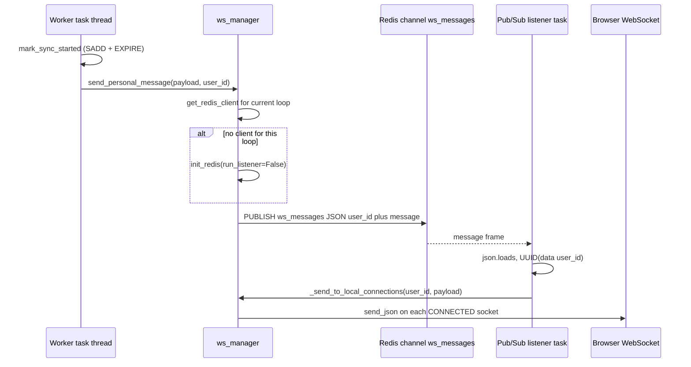
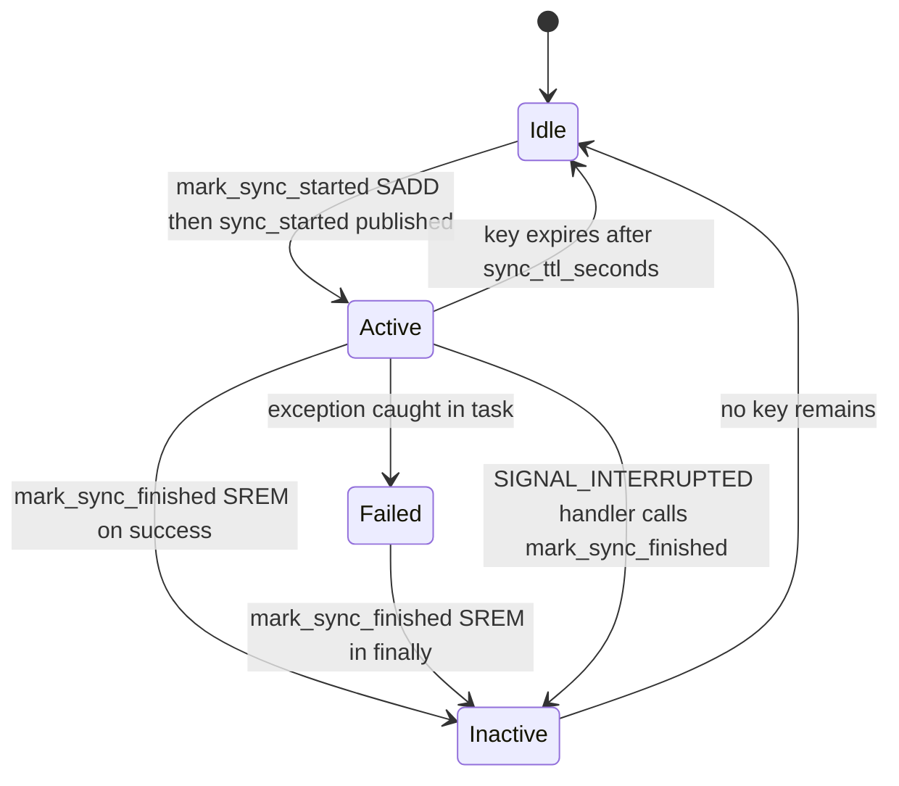

The read path of this application is request/response, but broker position sync is not: a Huey
worker thread finishes work at a time no HTTP request is waiting for. This page documents the
whole delivery chain for those asynchronous notifications — from `mark_sync_started` in a worker
thread to a badge disappearing in the browser — plus the deliberate belt-and-braces that keeps the
UI honest when a message is lost.

Two backend entrypoints exist, and they are independent:

| Endpoint | Owner | Purpose |
|----------|-------|---------|
| `/api/ws` | `src/ws/router.py` | User-scoped application events (`sync_started`, `sync_finished`, `sync_failed`, `account_totals_updated`) |
| `/worker/api/updates` (+ `/updates/`) | `src/worker_dashboard/router.py` | Huey dashboard task stream, owned by the `huey_dashboard` package's own `WebSocketManager` |

Everything else on the page — the Redis fan-out, the ticket contract, the sync-status set, the
browser fallback — belongs to the first of those. The *events* a broker sync emits, and the error
taxonomy behind them, are the subject of [Broker Connect, Import & Position Sync](broker-sync.md);
this page owns the transport.

## Why the fan-out goes through Redis

The publishing side and the delivering side are different processes on different event loops.
`sync_account_positions_task` runs in the `huey_consumer` process, which has no access to the ASGI
process's `active_connections` dict; and within a single process, a worker thread's
`asyncio.run(...)` loop is not the loop that owns the WebSocket objects. FastAPI `WebSocket`
objects are bound to the loop that accepted them, so an in-process registry could not be handed
across that boundary safely.

The design that resolves this is `ConnectionManager` in `src/ws/manager.py`, exported as the global
singleton `ws_manager`:

- `active_connections: dict[UserId, list[WebSocket]]` — the *local* connections of *this* process,
  keyed by user. A user can legitimately have several (multiple tabs), which is why the value is a
  list.
- `_clients: dict[asyncio.AbstractEventLoop, aioredis.Redis]` — one Redis client per running event
  loop, guarded by a `threading.Lock`. Any loop can publish without sharing a client with another
  loop. This mirrors the loop-keyed pattern of `src/core/redis.py::RedisManager`, but it is a
  *separate* dict: the WebSocket path never goes through `redis_manager`.
- `_pubsub_task` — the single background listener task, started only with `run_listener=True`.

`get_redis_client()` returns `None` instead of raising when there is no running loop, and
`send_personal_message` uses that as its signal to lazily initialize a client for the calling loop
(`await self.init_redis(settings.redis_url, run_listener=False)`) — that is how a worker thread's
fresh loop gets its own client without ever starting a second listener.

## Publish to delivery



The wire payload is a two-key envelope, `{"user_id": "<uuid>", "message": {...}}` where `message`
is the already-serialized event (`AccountSyncMessage(...).model_dump(mode="json")`). The listener
subscribes to the literal channel name `"ws_messages"`, skips frames whose `type` is not
`"message"` (Pub/Sub emits a `subscribe` confirmation first), and deserializes `user_id` back into
a `UUID`.

Delivery to local connections is best-effort by construction: a user with no local connections is
simply logged at debug and skipped, and a socket whose `client_state` is not
`WebSocketState.CONNECTED` is never written to. A `send_json` failure is caught and logged per
connection, so one broken socket cannot abort the fan-out to the others.

### Degradation and restart behavior

Redis is treated as an optimization, not a hard dependency, on the publish path:

- **No running loop.** `get_redis_client()` returns `None`; after a lazy-init attempt (which can
  itself fail, and is caught and logged) the manager falls back to
  `_send_to_local_connections` — delivery still happens for sockets connected to *this* process,
  it just does not cross processes.
- **Publish failure.** The `redis.publish` call is wrapped; on exception the same local fallback
  runs.

The listener task has its own resilience. `init_redis` prunes clients whose loop `is_closed()` and
closes them, then only creates a client if the current loop has none. It starts the listener when
`_pubsub_task is None or _pubsub_task.done()`, logging a warning in the latter case ("listener task
was done. Restarting...") — the restoration path if the task ever died. On an unexpected exception
inside `_listen_for_messages`, the handler logs, sleeps 5 seconds, and creates a fresh task. On
`asyncio.CancelledError` it unsubscribes and closes the pubsub object instead.

Ordering is *not* guaranteed. Both the `sync_started` and `sync_finished` events travel the same
Pub/Sub channel and are delivered in publish order per connection, but publish order itself depends
on the task, and a dropped frame is silently absent. Nothing in the client may assume it observed
both edges — which is exactly why the browser keeps an independent status poll (below).

## Authentication at `/api/ws`

The endpoint is `@ws_router.websocket("/api/ws")` in `src/ws/router.py`. It never raises an HTTP
error: every rejection is `websocket.close(code=1008)` (policy violation), which the tests pin as
`WS_POLICY_VIOLATION = 1008`.

Two paths are accepted, ticket first:

1. **Signed ticket in the `ticket` query parameter.** The browser cannot usefully send the
   `httponly` cookie through a trusted handshake, so `POST /api/v1/auth/ws-ticket`
   (`src/auth/router.py::auth_ws_ticket`) mints one: `URLSafeTimedSerializer(settings.secret_key)`
   over `json.dumps({"user_id": ..., "jti": ...})` with `salt="ws-ticket"`. The socket verifies it
   with `serializer.loads(ticket, max_age=30, salt="ws-ticket")` and parses `user_id`. Any
   exception — bad signature, expiry past 30 seconds — closes with 1008.
2. **Session token from the `auth_token` cookie or the `sec-websocket-protocol` header.** The token
   is resolved through `UserApi.get_current_user_from_token` using the `app.state.svcs_registry`
   directly (a WebSocket handler never receives a `svcs.fastapi.DepContainer`, so it opens its own
   `async with svcs.Container(registry)`). Failure closes with 1008. When the token came from the
   header, the same value is echoed back as the accepted subprotocol
   (`websocket.accept(subprotocol=subprotocol)`), because a browser that negotiated
   `sec-websocket-protocol` requires the server to select one.

If neither yields a `user_id`, the socket closes with 1008.

### Replay rejection

Tickets are **single-use**, enforced by `_check_ticket_not_replayed`, which is called *before* the
signature is even checked:

```python
ticket_hash = hashlib.sha256(ticket.encode()).hexdigest()
key = f"ws-ticket-used:{ticket_hash}"
acquired = await redis_client.set(key, "1", nx=True, ex=30)
```

`nx=True` makes the first `SET` win and every subsequent one return `None`; the 30-second `ex`
matches the ticket's own `max_age`, so the guard key expires exactly when the ticket becomes
useless anyway. This helper deliberately opens its own short-lived client per check
(`aioredis.from_url(...)` → `aclose()` in a `finally`) rather than using `ws_manager` or
`redis_manager`.

Its failure mode is **fail-open**: if the `SET` raises (Redis down), the exception is logged and the
function returns `True`, admitting the connection. A Redis outage must not make realtime features
unavailable, and the ticket is still signature-checked and 30-second-bounded as the second line of
defense.

### Request correlation

The endpoint reads `X-Request-ID` or generates a UUID, binds it with `set_request_id`, and resets
the contextvar token in a `finally` — the same correlation primitive HTTP requests and Huey tasks
use. This endpoint does not go through `RequestIdMiddleware`, so it repeats that logic inline.

### Connection lifecycle

Once authenticated, `ws_manager.connect(websocket, user_id, subprotocol=...)` accepts the socket and
appends it to `active_connections[user_id]`, creating the list on first connection. The handler then
sits in `while True: await websocket.receive_text()` — the client's messages are discarded and the
loop exists purely to keep the connection open and to surface the disconnect. A
`WebSocketDisconnect` calls `ws_manager.disconnect(...)`, which removes the socket and deletes the
user's key when the list empties, tolerating a missing socket with `except ValueError: pass`.

Both `ws_manager.init_redis(settings.redis_url)` (with the listener) and the teardown
`ws_manager.close()` are driven from `src/main.py::lifespan_context`, so the listener starts with
the process and the pubsub task and all loop clients are closed on shutdown.

## The active-sync status set

The WebSocket path tells the browser *what changed*; it cannot tell it *what is true right now*,
because a late-joining client never saw the earlier events. That second question is answered from
Redis by `src/integration/sync_status.py`:

| Function | Redis operation |
|----------|-----------------|
| `mark_sync_started(user_id, account_id)` | `SADD account_syncs:active:{user_id}` then `EXPIRE ... settings.sync_ttl_seconds` |
| `mark_sync_finished(user_id, account_id)` | `SREM account_syncs:active:{user_id}` |
| `get_active_syncs(user_id)` | `SMEMBERS`, members parsed back into `AccountId` UUIDs |

Unlike the WebSocket fan-out, this module *does* go through `redis_manager.client()`, the shared
loop-keyed singleton. `settings.sync_ttl_seconds` defaults to **300** and is the safety net for a
worker that dies without running cleanup: the key expires on its own.

`GET /api/v1/accounts/sync-status` (`src/account/router.py::account_sync_status`, guarded by
`Depends(current_user)`) exposes it as `{"account_ids": [str(aid), ...]}` and translates a
`redis.RedisError` into **503** "Sync status service unavailable" — the client treats a status
outage as "keep waiting", not as "finished".

The set is *display state, not a lock*. Two syncs for one account are possible; the second `SADD` is
a no-op and the first `SREM` clears the badge while the other task may still be running. Do not
build a mutual-exclusion guarantee on it.

### Account sync lifecycle



Read this as the state of one account id's membership in `account_syncs:active:{user_id}`, with the
WebSocket events annotated on the transitions that emit them. `mark_sync_started` is wrapped in its
own `try/except` that only logs, so a Redis outage cannot abort a sync that would otherwise succeed;
`mark_sync_finished` runs in a `finally`, so it fires on the failure path too. The
`@huey.signal(signals.SIGNAL_INTERRUPTED)` handler in `src/integration/task.py` is the fourth exit:
it matches `task.name == "sync_account_positions_task"`, reads `task.args[0]`/`task.args[1]`, and
calls `mark_sync_finished` through `asyncio.run`, so an interrupted worker does not leave a stale
entry until the TTL fires. Only the TTL transition actually removes the key without an `SREM`; the
others leave an empty set behind, which `get_active_syncs` reports as no active syncs.

The order of emission inside `_sync_account_positions_task` is fixed and worth preserving:
`mark_sync_started` → `sync_started` publish → `_do_sync_positions` → `sync_finished` publish, with
`sync_failed` published in the `except` branch *after* the best-effort error email, before
re-raising, and `mark_sync_finished` in the `finally`.

### The other event: totals

`src/account/task.py::recalculate_all_account_totals_task` is the second publisher on this channel.
It walks active accounts, recomputes totals via `PositionService.get_total_for_account`, and sends
an `AccountTotalsUpdatedMessage` (which carries the full `AccountTotals`, not just an id) to
`account.user_id`. Each account is wrapped in its own `try/except` that only logs, so one bad
account does not stop the broadcast for the rest. That message is why the browser's totals rows can
refresh without a page reload; it is not part of the sync state machine.

## Event schemas

`src/ws/api_types.py` is the single definition of the wire contract, a `StrEnum` plus three Pydantic
models:

| `WsEventType` | Wire value | Payload model |
|---------------|-----------|---------------|
| `ACCOUNT_SYNC_STARTED` | `sync_started` | `AccountSyncMessage` (`account_id`) |
| `ACCOUNT_SYNC_FINISHED` | `sync_finished` | `AccountSyncMessage` (`account_id`) |
| `ACCOUNT_SYNC_FAILED` | `sync_failed` | `AccountSyncMessage` (`account_id`) |
| `ACCOUNT_TOTALS_UPDATED` | `account_totals_updated` | `AccountTotalsUpdatedMessage` (`account_id`, `totals`) |

Everything is serialized with `model_dump(mode="json")` before publishing, so the payload is
JSON-safe — the `Money`-valued `AccountTotals` renders as its string form rather than an object.
The TypeScript mirror in `frontend/src/lib/types/websocket.ts` declares `WsEventType` with the same
three sync values and an `AccountSyncMessage { type, account_id }` interface; there is no generated
type sync, so a new event type must be added on both sides by hand.

## The worker dashboard's parallel channel

`/worker/api/updates` is a second, independent WebSocket that does **not** use `ws_manager`. It is
part of the mounted Huey dashboard at `/worker/api`, and delivery is owned by the third-party
`huey_dashboard` package:

- `src/worker_dashboard/setup.py::init_worker_dashboard` constructs a `huey_dashboard.WebSocketManager`,
  an `AsyncRedis.from_url(redis_url)` connection, a `TaskDatabase`, and stores all of them in
  `app.state.huey_dashboard`; with `bind_signals=True` it also registers the package's Huey signal
  handlers on the running loop, and finally calls `manager.start_pubsub_listener(async_redis)`.
  `close_worker_dashboard` stops the listener and closes the Redis client on shutdown.
- `src/worker_dashboard/router.py::worker_dashboard_websocket_endpoint` reuses `/api/ws`'s
  authentication *helpers* by importing `_check_ticket_not_replayed` from `src.ws.router` — the same
  `ws-ticket` salt, the same `max_age=30`, the same `ws-ticket-used:<sha256>` replay key — and falls
  back to the same `auth_token` cookie / `sec-websocket-protocol` token path. Rejection is again
  code `1008`. When a subprotocol is supplied the handler calls `manager.active_connections.append`
  directly instead of the manager's `connect`, because the subprotocol must be negotiated on
  `accept` first.
- Registered for both `/updates` and `/updates/`, so the trailing-slash form is not a 404.
- The REST side of the dashboard (`/worker/api/tasks`) is gated by `Depends(current_user)`; the
  WebSocket cannot use a dependency, hence the duplicated auth code.
- Its echo behavior (`"Message received: {data}"`) is a liveness/keepalive contract asserted by the
  dashboard tests, not application logic.

`src/main.py` mounts `worker_dashboard_router` via `app.include_router`, outside the `/api/v1`
prefix.

## Frontend consumption

`AccountsListState` (`frontend/src/lib/components/accounts/accounts-list.svelte.ts`) owns the
browser side. In its constructor it seeds `accounts` from SSR data and, when `browser` is true,
opens the socket; `destroy()` closes it (wired to the component's `onMount` cleanup).

### URL and handshake

`initWebSocket` derives the socket URL from `import.meta.env.VITE_API_BASE_URL` when that is an
absolute `http(s)` origin — rewriting the scheme to `ws:`/`wss:` and stripping the path — and
otherwise from `window.location`. It then awaits `authService.getWsTicket()` (→
`POST /auth/ws-ticket`), and if no ticket comes back it logs a warning and **aborts**: there is no
unauthenticated fallback connection. The socket is opened as `` `${wsUrl}?ticket=${encodeURIComponent(ticket)}` ``.

### Local state and event handling

Two runes-backed fields are the visible state: `syncingAccountIds` (a `SvelteSet<string>`) and
`syncErrors` (`Record<string, string | null>`). `wsConnected` mirrors socket state for the UI.

| Wire event | Effect on state |
|-----------|-----------------|
| `sync_started` | `syncingAccountIds.add(id)`, `syncErrors[id] = null` |
| `sync_finished` | `syncingAccountIds.delete(id)`, `syncErrors[id] = null` |
| `sync_failed` | `syncingAccountIds.delete(id)`, `syncErrors[id] = 'Failed to sync. Please try again.'` |

Parsing is defensive: the whole `onmessage` body is inside a `try/catch` that logs
"Failed to parse websocket message" so a malformed frame cannot break the listener.

### Hydration on open

`onopen` sets `wsConnected = true` and calls `hydrateSyncStatus()`, which reads
`GET /accounts/sync-status` once and unions the returned ids into `syncingAccountIds`. This is what
makes a page loaded *mid-sync* show the correct badges — the `sync_started` event was published
before this client existed. The call is guarded by the `syncStatusHydrated` boolean so a reconnect
loop does not re-fetch on every `onopen`, and a failure only logs (it does not clear the guard, so a
later open retries).

### Reconnect

`onclose` sets `wsConnected = false`, **resets `syncStatusHydrated = false`** (so the next successful
open re-hydrates — the local set may have gone stale while disconnected), and schedules
`setTimeout(() => this.initWebSocket(), 5000)`. A fixed 5-second delay, no backoff, no attempt
ceiling: the socket keeps retrying for the lifetime of the component. Each retry re-requests a
*ticket*, which is essential given single-use tickets — a cached ticket would be rejected with 1008.

### The polling fallback

Because a Pub/Sub frame can be lost, `syncAccount(id)` does not rely on the socket to know when work
finished. It optimistically adds the id and clears the error, `POST`s `/accounts/{id}/sync`, and
then calls `waitForSyncFinish(id)` — an **independent** poll of the same status endpoint:

- 60 s deadline, 1.5 s interval, 5 s grace period.
- Each tick re-reads `GET /accounts/sync-status`. While the id is still present, it keeps waiting.
- When the backend no longer reports the id, the sync is provably done: it waits the 5-second grace
  period for the WebSocket message, and only if `syncingAccountIds` still has the id does it clear
  the entry itself and `await this.fetchAccounts()` — so the position data shown reflects the
  finished sync even when no message ever arrived.
- A status-endpoint error is swallowed and the loop simply continues ("If status endpoint is
  unavailable, keep waiting").
- Deadline expiry removes the id and sets `'Sync took too long. Check account status.'`.
- A failure of the `POST` itself removes the id and sets `'Request failed. Please check your
  connection.'`.

The two mechanisms are complementary rather than redundant: the socket gives immediacy for events
this client did not cause (another tab, a scheduled sync), the poll gives certainty for the action
this client initiated. Neither is a substitute for the other.

The server-side gate on `POST /api/v1/accounts/{account_id}/sync` (rate-limited `3/minute`) refuses
an account with `api_sync_enabled = false` with **400**, and the service layer re-checks the flag —
that path, and the broker-side UI that triggers it, are covered in
[Broker Connect, Import & Position Sync](broker-sync.md).

## Testing contract

WebSocket tests must not dial a real Redis, and CI declares no Redis service. Three fixtures make
that work:

1. **`global_mocks`** (`tests/conftest.py`, session scope, autouse) `patch.object`s
   `ConnectionManager.init_redis`, `close`, `send_personal_message` and `send_personal_message_sync`
   on the **class**, covering every loop-scoped instance, and stashes the real implementations as
   `_orig_init_redis`, `_orig_close`, `_orig_send_personal_message` and
   `_orig_send_personal_message_sync`. `tests/ws/test_manager.py` then calls those `_orig_*` methods
   directly to test the real logic. It also patches `src.main.init_worker_dashboard` /
   `close_worker_dashboard`, because `main.py` binds those names at import time and without the
   patch the lifespan creates real `AsyncRedis` connections whose `aclose()` stalls the suite.
2. **`fake_redis_manager`** (`tests/fixtures/redis.py`, function scope, autouse) replaces
   `src.core.redis.redis_manager.client` with an in-memory `FakeRedis` — which is what covers
   `src/integration/sync_status.py`, since that module goes through `redis_manager`. `FakeRedis`
   implements `set(..., nx=, ex=)`, `sadd`/`srem`/`smembers`, `publish` and the rest, so the whole
   suite runs with no Redis server or DNS. `mock_redis_storage` exposes the backing dict for
   assertions.
3. **Mocked managers in task tests.** `tests/tasks/test_integration.py` patches
   `src.integration.task.ws_manager` with an `AsyncMock` and asserts the exact event sequence —
   `send_personal_message.await_count == 2` with `calls[0][0][0]["type"] == "sync_started"` and
   `calls[1][0][0]["type"] == "sync_finished"` — alongside `patch("src.integration.task.mark_sync_started",
   AsyncMock())` / `mark_sync_finished`. `tests/tasks/test_account.py` does the same for
   `src.account.task.ws_manager`, asserting the payload type, `account_id`, and the rendered
   `Money` values.

Focused coverage:

- `tests/ws/test_manager.py` — `_orig_init_redis` pruning a closed-loop client and starting the
  listener; restarting a *done* listener task; `_orig_close` cancelling the task and clearing
  clients; connect/disconnect with subprotocols and multi-socket users; `_send_to_local_connections`
  skipping `DISCONNECTED` sockets while still delivering past a socket whose `send_json` raises;
  successful publish asserting the exact `json.dumps({"user_id", "message"})` payload on channel
  `ws_messages`; the two fallback paths (lazy-init failure and publish failure) both landing on
  `_send_to_local_connections`; the sync bridge with and without a running loop; the listener
  skipping a non-`message` frame and an invalid-JSON frame; unsubscribe+`aclose` on cancellation;
  and the 5-second sleep + task recreation on error.
- `tests/ws/test_router.py` — the three `_check_ticket_not_replayed` outcomes (first use `True`,
  already used `False`, and the Redis exception returning `True`) with `redis.asyncio.from_url`
  patched; and end-to-end `TestClient` connects asserting code **1008** for no-auth, replayed
  ticket, invalid signature, and invalid token, plus successful connects for a valid ticket, a valid
  cookie token, and a valid header token (asserting `get_current_user_from_token` received the
  token). It also pins `AccountTotalsUpdatedMessage` JSON serialization.
- `tests/routers/test_sync_status.py` — `GET /accounts/sync-status` empty, populated, scoped to the
  authenticated user (`get_active_syncs` asserted awaited with `test_user.id`), unauthenticated
  401/403, and the Redis-down 503.
- `tests/routers/test_worker_dashboard.py` — the dashboard channel's ticket/cookie/header paths and
  its 1008 rejections, with `app.state.huey_dashboard` supplied by a fixture holding a real
  `WebSocketManager` and no Redis.
- Frontend: `frontend/src/lib/components/accounts/accounts-list.test.ts` installs a `MockWebSocket`
  class on `global.WebSocket` and mocks every API client — the frontend rule that no test may issue
  a real `fetch`.

## Invariants and caveats

- **Two channels, one contract per channel.** `/api/ws` and `/worker/api/updates` share the ticket
  helper and close code but nothing else; changing the ticket payload or `salt="ws-ticket"` breaks
  both.
- **Tickets are single-use within 30 seconds.** The replay key's `ex=30` mirrors `max_age=30`, so
  the guard never outlives the ticket's validity. Any client change that reuses a ticket will get
  1008.
- **Replay detection fails open.** A Redis outage admits connections rather than blocking them.
- **Publishing is best-effort at three levels.** No loop, no client, or a failed publish all end at
  `_send_to_local_connections`; a delivered message may legitimately never be seen by any socket.
  Client code must treat the socket as an accelerator, never as the source of truth — the sync-status
  endpoint is the source of truth.
- **`active_connections` is per process.** Two backend replicas each hold only their own sockets;
  only the Redis hop makes a message reach both.
- **Retrying the same account id is allowed.** The status set is a set, not a lock.
- **`X-Request-ID` binds inside the socket handler, not the HTTP middleware**, so WebSocket logs get
  a correlation id but no `duration_ms` access line.

## Related pages

- [Broker Connect, Import & Position Sync](broker-sync.md) — which events the broker flow emits, the
  error-to-message mapping, and the sync failure email.
- [Architecture Overview](../architecture/overview.md) — where `ws_manager` and the dashboard are
  initialized in the lifespan.
- [Configuration](../architecture/configuration.md) — `redis_url`, `sync_ttl_seconds`, and the
  loop-keyed Redis manager pattern.
- [Authentication & Authorization](../architecture/authentication.md) — the `auth_token` cookie,
  `secret_key`, and the `POST /auth/ws-ticket` exchange.
- [Frontend Architecture](../architecture/frontend.md) — `AccountsListState` in the broader state
  model.
- [Accounts & Holdings Views](accounts-and-holdings-views.md) — the read path the sync refreshes.
- [Operations & Workflows](../operations/workflows.md) — the Huey dashboard mount and deployment
  surface.
