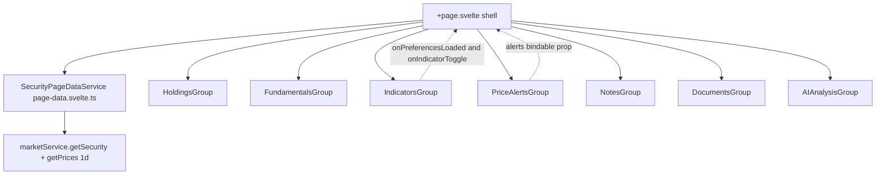
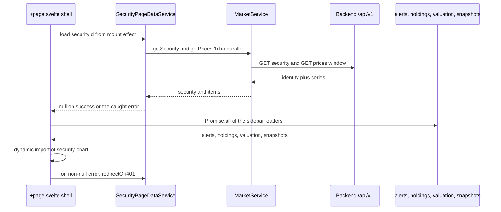
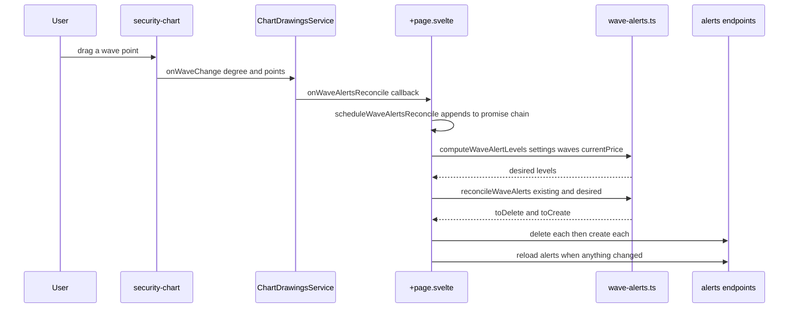

# Security Detail Page & Actions Sidebar

`/security/[security_id]` is a single page that does two jobs: it renders the chart (covered in [Charting](../architecture/charting.md) and [Chart Drawings & Rewind](../architecture/chart-drawings-and-rewind.md)) and it hosts the **actions sidebar** — a right-hand column of independently mounted feature groups, each owning its own fetch, its own loading/error state, and its own modals. This page documents the page shell and data ownership first, then each sidebar group as its own flow.

The layout is one flex row: the chart region (`flex-1`) plus `
` around `<Sidebar.Content>`, which mounts the groups in a fixed order — `HoldingsGroup`, `FundamentalsGroup`, `IndicatorsGroup`, `PriceAlertsGroup`, `NotesGroup`, `DocumentsGroup`, `AIAnalysisGroup`.

The sidebar groups hang off the page shell; only Indicators and Price Alerts have a bidirectional contract back into the page's chart state.

## Page shell, refresh and data ownership

The **server load is deliberately trivial**. `+page.server.ts` returns `{ security_id }` and throws `error(400, 'Security ID is required')` only when the param is missing. It never awaits the security or its prices, so the SSR shell and titlebar paint instantly. The comment in the file states the reason, and `page.server.test.ts` pins both behaviours (`Object.keys(result)` equals `['security_id']`, and neither `getSecurity` nor `getPrices` is called).

Everything else is fetched **after navigation** by `SecurityPageDataService` (`page-data.svelte.ts`), a page-owned rune class. It holds `security`, `items` (the `1d` series), `isLoading` and `error`, and it creates its own client via `getMarketService()` at construction time — the module never exports an instance, per the regression rule in [Frontend Architecture](../architecture/frontend.md). Its `load(securityId)`:

1. Bumps a private `loadSeq` and clears `security`/`items`/`error` before fetching.
2. Calls `getSecurity(securityId)` and `getPrices(securityId, from, to, '1d')` in parallel, with the window from `getChartDateWindow(new SvelteDate(), '1d')`.
3. Discards its own result when `seq !== this.loadSeq`, so a slow response cannot clobber a newer soft navigation.
4. **Never throws.** It returns `null` on success and the caught error on failure. An empty `items` array is treated as a *successful* load whose message (`No price data available for this security`) lands in `error`, not as a thrown exception.

The page then drives it from a single `$effect` keyed on `data.security_id`. Because `$effect` never runs during SSR, this mount trigger is browser-only and re-runs on soft navigation:

- It resets drawing tool state, `timeframeError`, pagination flags and the lazily imported chart component.
- It calls `pageData.load(securityId)` and, when the returned error is non-null, routes it through `redirectOn401` from `$lib/api/async-data.ts`. A 401 exits to the login page; every other failure is already visible through `pageData.error` in the "Failed to Load Chart" card.
- On success it loads user preferences (once), maps prices to candles, then fans out `Promise.all([loadAlerts(), loadHoldings(), loadValuation(), drawingsService.loadSnapshots()])`.
- It dynamically imports `$lib/components/charts/security-chart.svelte` — the chart is code-split and absent from the initial bundle.
- When the active timeframe is not `1d` it force-refetches that series for the new security, gated on `!isChangingTimeframe` so a saved timeframe being applied concurrently is not double-fetched.

The titlebar avoids a flash of emptiness by resolving `instantSecurity` from `watchlistService.defaultWatchlistSecurities` first, falling back to `pageData.security`. `isLoading` is `!security && !error`.

The **error card is shared**: `const error = $derived(pageData.error ?? timeframeError)` merges the service's initial-load error with the timeframe switcher's own message, so a failed `1h` fetch and a failed initial load render the same "Failed to Load Chart" surface.

The page-owned service fetches identity plus the `1d` series; only then does the shell fan out to the sidebar loaders and lazily pull in the chart component.

### Chart-level state the sidebar depends on

Two pieces of the page's state are shared with groups through props or `bind:`:

| State | Owner | Consumer |
| --- | --- | --- |
| `userPreferences` | page (`$state`) | `drawingsService.setPreferences`, indicator defaults, chart style/timeframe, valuation overlay |
| `indicatorConfigs` | page (`createIndicatorConfigs()`) | `IndicatorsGroup` (read + `onIndicatorToggle` / `onIndicatorConfigChange` / `onPreferencesLoaded` callbacks), `HoldingsGroup` (`avgPrice` enabled checkbox) |
| `alerts` | page (`$state<PriceAlert[]>`) | `PriceAlertsGroup` via the bindable `alerts` prop |
| `valuation` / `showValuationOverlay` | page (`$state`) | `FundamentalsGroup` via `bind:valuation` / `bind:showOverlay`; the chart consumes both |
| `rawCandles` / `displayCandles` | page | `HoldingsGroup` (`candles` prop), the chart, and indicator compute |

`loadAlerts`, `loadHoldings` and `loadValuation` are page-level wrappers that swallow errors into `console.error` and never set page state to an error value — the groups that own a visible error surface (`FundamentalsGroup`, `PriceAlertsGroup` without an external prop) fetch independently.

## Group model

Every group uses the same two primitives:

- `group-title.svelte` renders a `<Sidebar.GroupLabel>` with a `<ChevronDown>` that becomes `-rotate-90` when collapsed, plus an optional `<Sidebar.GroupAction>` icon button (Plus / Pencil). Toggling flips the bindable `expanded` prop the page passed as `expanded={true}`.
- `sidebar-error.svelte` renders a destructive card with the message and an optional `onretry` callback wired to the group's own fetch function.

The load gate differs per group and is the most common source of bug reports: **Notes, Documents and AI Analysis fetch as soon as `securityId` exists, regardless of `expanded`**; **Price Alerts and Fundamentals only fetch when `expanded` is true**; **Indicators** loads preferences unconditionally on mount. Since the page passes `expanded={true}` for all of them, this difference is invisible in production today but matters to any test that mounts a group with `expanded: false`.

## Holdings group

`holding-group/holding-group.svelte` sits first and is the only group that renders a "no position" affordance. Its `$effect` (gated on `expanded && effectiveSecurityId`) fetches, via `Promise.all`:

- `accountService.getHoldings(securityId)` — the per-security holdings.
- `accountClient.getAccounts()` then `getAccountTotals(acc.id)` per account — used to compute `portfolioPercentage = totalSecurityValue / totalPortfolioValue * 100`.

Errors collapse into the string `Failed to load holdings`; a failure of the *totals* leg leaves the percentage at `0` rather than failing the whole group. The group also exposes the `avgPrice` toggle: flipping it writes the whole `indicators` key through `userPreferencesService.patchPreferences({ indicators: { …existing, avgPrice: { …current, enabled: val } } })`, mirroring the top-level JSONB replace semantics documented in [User Preferences](../concepts/user-preferences.md). This is one of two writers of `indicators.avgPrice` — the other is `IndicatorsGroup`.

## Fundamentals and valuation

`fundamentals/fundamentals-group.svelte` owns the fair-value range and the chart overlay toggle, and is `bind:`-connected to the page (`bind:valuation`, `bind:showOverlay`). It fetches `valuationClient.getValuation(securityId)` inside `untrack` when `expanded && securityId`, so the page's own `loadValuation()` and the group's fetch are two independent round trips to the same endpoint — the later writer wins the shared `valuation` state.

Three display states: loading skeleton, `SidebarError` with retry, and either "Fair value range not set." with a *Set Valuation Range* button or the formatted `{lower} – {upper}` range (formatted with `Intl.NumberFormat` using the security's currency). The header action icon is `Pencil` when a valuation exists and `Plus` otherwise. The overlay checkbox calls `handleToggleOverlay`, which updates the bound `showOverlay` and patches `show_valuation_band` — the same key the page reads on load to initialize `showValuationOverlay`. Note the chart can therefore show a band that the sidebar believes is hidden for one render after a page-level preference load; both paths write the same state holder.

`fundamentals-group.test.ts` covers the three states and asserts the checkbox is a sibling of the range element (a layout regression guard).

## Technical indicators

The indicator flow is split between three owners:

| Owner | Responsibility |
| --- | --- |
| `indicator-defaults.ts` (`INDICATOR_DEFAULTS`, `createIndicatorConfigs`) | canonical id/label/color/period defaults |
| `indicator-group.svelte` | the checkbox list, per-indicator settings + help modals, and **all preference persistence** |
| `+page.svelte` | computing series via `indicatorsService.computeIndicators` and pushing them onto the chart |

### Toggle path

Clicking a row calls `toggleIndicator`, which builds the new entry with `buildToggleEntry`, **assigns `preferences` locally before the network await** (to avoid a lost-update race), patches the whole `indicators` key, and only on success calls `onIndicatorToggle(id, enabled)`. A failed patch logs and leaves the page chart unchanged, so the persisted preference and the chart can diverge until reload.

`onIndicatorToggle` in the page handles `avgPrice` (a chart prop, not a computed series) and `volume` (recomputed locally from `displayCandles`) as special cases, and for everything else posts to `POST /market/securities/{security_id}/indicators/compute` with a single `IndicatorSpec`. Each toggle bumps `indicatorSeq[indicatorId] = ++sequenceCounter` and drops its response when the sequence moved — the guard that prevents a slow compute from overwriting a newer toggle.

`refreshActiveIndicators()` is the bulk path: it stamps every enabled indicator with the same `activeRefreshSeq`, re-renders volume, collects the active specs, and issues **one** compute request with `indicators: activeSpecs`. It is called from a `$effect` on `drawingsService.timelinePosition` (so scrubbing the rewind timeline recomputes against the sliced candles) and from timeframe changes, "load more" merges and chart-style switches. The compute payload carries `interval`, `chart_style`, and — while rewound — an explicit `candles` array from `sliceCandlesBefore(rawCandles, timelinePosition)`, which lets the backend compute against the historical window instead of live prices.

The indicator compute route, the Go sidecar and the Redis cache are documented in [Market Data, Indicators & the Price Update Cascade](market-data-and-indicators.md); only the sidebar contract is repeated here.

### Settings, help and reset

`indicator-group.svelte` opens `indicator-config-modal.svelte` for every indicator except `volume` and `avgPrice`, and an `IndicatorHelpModal` for `macd`, `bb`, `rsi` and `obv`. The config modal renders fields conditionally by id — `period` for `rsi`/`bb`, `stdDev` for `bb`, `fast`/`slow`/`signal` for `macd` — plus a color picker popover.

Two invariants in this file are load-bearing and documented in its own comments:

1. **`enabled` is read from the persisted preference, not from the page's `indicatorConfigs`.** Both `saveSettings` and `resetSettings` resolve `isEnabled` as `preferences?.indicators?.[id]?.enabled ?? indicatorConfigs?.[id]?.enabled ?? false`, because the page copy is stale after a sidebar toggle.
2. **Reset preserves enabled state.** `resetSettings` restores color and numeric fields to `INDICATOR_DEFAULTS[id]` and calls `onIndicatorConfigChange?.(id, resetConfig, isEnabled)` — passing the enabled flag as the `reRender` argument. The modal deliberately does not close on reset so the restored values stay visible.

`indicator-group.test.ts` pins exactly this: with `getPreferences` returning `rsi: { enabled: true, color: '#111111', settings: { period: 21 } }` and a page `indicatorConfigs` where `rsi` is disabled, clicking reset must call `onIndicatorConfigChange('rsi', { color: '#06b6d4', period: 14 }, true)`.

### The read-back path

`IndicatorsGroup` also calls `onPreferencesLoaded(preferences)` after its own `getPreferences()`, which makes it — not the page — the source of the page's indicator defaults. The page's handler applies chart style, timeframe (without persisting), and each saved indicator's enabled/color/settings, then schedules `setTimeout(() => onIndicatorToggle(id, true), 100)` for each enabled indicator "to ensure `chartRef` is bound". The timers rather than an awaited readiness signal are why indicator tests generally have to advance or wait.

## Price alerts

`price-alert/price-alert-group.svelte` is a **dual-mode component**, which is the single most important thing to know about it:

- The page passes the bindable `alerts` prop (`<PriceAlertsGroup {security} expanded={true} {alerts} />`). When `externalAlerts` is truthy, the group's `$effect` assigns it into local state and **never fetches**. Refresh is then driven entirely by the page's `loadAlerts()`.
- Mounted without the prop (as in tests), it falls back to its own `fetchAlerts()`, gated on `expanded && security?.id`, with skeleton, `SidebarError` retry, and `No alerts yet` empty state.

Because the page's `alerts` starts as `[]` — falsy-by-length but not falsy as a value — the page path always sets `externalAlerts`, so the group's internal `isLoading`/`error` remain unused in production. Its own delete confirmation (`deleteConfirmationModal`) calls `alertsService.deleteAlert` then `fetchAlerts()`, which in external mode re-reads the *page's* array through the effect; the page's `handleDeleteAlert` does the equivalent against the same service. Both paths therefore exist and only one is live per mount.

### The API contract

`alertsService` (`lib/api/alertsService.ts`) wraps three routes, all scoped to the authenticated user by the backend:

| Method | Path | Backend handler |
| --- | --- | --- |
| `getAlerts` | `GET /market/securities/{id}/alerts` | `market_get_alerts` — paginated `PaginatedResponse[PriceAlertRead]` |
| `createAlert` | `POST /market/securities/{id}/alerts` | `market_create_alert` — takes `PriceAlertWrite` and returns `PriceAlertRead` |
| `deleteAlert` | `DELETE /market/securities/{id}/alerts/{alertId}` | `market_delete_alert` |

The stored row is `market_price_alerts` with `target_price DECIMAL(16,8)`, `condition` (string, `above`/`below` in practice), `source` (default `"manual"`; the wave flow writes `"wave"`), `triggered_at` (nullable) and `created_at`. `PriceAlert.id`/`security_id`/`user_id` are echoed to the client, and `triggered_at !== null` is what `price-alert-list-item.svelte` uses to swap the `Bell` icon for a green `BellRing` and append "· Triggered …".

Manual creation goes through `price-alert-modal.svelte`, which validates `targetPrice > 0` (client-side only — the modal has no dependency on backend validation), defaults `condition` to `below`, resets its fields when `modalState.isOpen` turns false, and submits on `Enter`. It deliberately omits `source`, so the row takes the database default `"manual"`.

### Wave-driven reconcile

The wave alert flow is the most subtle piece of the page. `reconcileWaveAlertsForSecurity()` computes the *desired* set of wave-source alerts and diffs it against the current `alerts`, then applies the difference:

A wave edit triggers reconcile, which diffs desired against stored alerts and applies deletes then creates; the next reconcile self-heals from any failure.

- `computeWaveAlertLevels(settings, securityWaves, currentPrice)` is pure and I/O-free. It iterates `cycle`/`primary` × `wave3`/`wave5`, skips a degree whose percent is `null` or which has no valid target, computes `level = roundTo8dp(targetPrice × percent / 100)`, and derives `condition` from the comparison with `currentPrice` (skipping an exact equality). **`roundTo8dp` exists to match `DECIMAL(16,8)`** so the create→read-back round trip compares exactly and reconcile stays idempotent.
- `reconcileWaveAlerts(existing, desired)` never returns a manual alert in `toDelete` (`alert.source !== 'wave'` is skipped), normalizes a possibly-string `target_price` with `Number(...)` before keying, and dedupes desired levels by `(condition, level)` so two degrees yielding the same level collapse to one alert. A second run against applied state returns empty sets.

The page-level invariants this relies on:

- **`isRewound` short-circuits.** `scheduleWaveAlertsReconcile` returns immediately while the rewind timeline is engaged, so scrubbing history cannot delete live alerts.
- **Reconciles are serialized.** `waveAlertsReconcileSeq` is a `Promise` chain: `waveAlertsReconcileSeq = waveAlertsReconcileSeq.then(() => reconcileWaveAlertsForSecurity()).catch(() => {})`. The comment is explicit — `onWaveChange` fires per point while drawing, and concurrent reconciles reading the same stale `alerts` would double-create, so chaining keeps each run seeing the previous run's applied state. The `.catch(() => {})` prevents a rejected link from poisoning the chain.
- **The initial-load reconcile is gated on `userPreferences !== null`**, so a failed preferences fetch can never mass-delete wave alerts against a default `DEFAULT_WAVE_SETTINGS` percentage set.
- **A reconcile failure never breaks drawing.** The whole body is inside `try`/`catch` with only a `console.error`; recovery is the next reconcile.
- **Creation is strategy-then-state**: the desired levels are computed *before* the deletes, and `loadAlerts()` only runs when something actually changed.

`Security Page - Wave Target Alert Reconcile` in `page.svelte.test.ts` covers the four interesting cases: drawing points 3 and 5 creates alerts for every configured degree, clearing waves deletes only wave-source rows, an already-matching set is a no-op, and a percent change deletes the stale levels and creates the new ones while leaving a manual alert untouched.

### Spec drift in price-alerts

`openspec/specs/price-alerts/spec.md` describes behaviour the implementation does not have. Worth knowing before someone "fixes" the code to match the spec:

- The spec claims a confirmation message on successful creation; the modal simply closes and refreshes the list.
- The spec claims triggered alerts appear at the top of the list and are visually distinguished by a "triggered status indicator with timestamp"; the list renders in whatever order `/alerts` returns (created order from the repository) and marks triggered rows only with an icon swap and a "Triggered {date}" suffix.
- The spec's in-app + optional email notification requirement is implemented as **email only**, by a backend Huey job, not by this page: `check_and_dispatch_price_alerts` in `src/market/task.py` enqueues `AlertEvaluationService.dispatch_alert_email`, which re-reads the latest intraday close, sends the email, and only then marks `triggered_at`. Nothing in the sidebar subscribes to a trigger event, so an open page does not learn about a trigger until it refetches.
- `AlertEvaluationService.evaluate` treats conditions as **inclusive** (`latest >= target` for `above`, `latest <= target` for `below`) and skips an alert whose security has no intraday price.

## Notes

`note/note-group.svelte` wraps `notesService` (`lib/api/notesService.ts`), which maps onto the `market_security_notes` table via four routes: `GET`/`POST /market/securities/{id}/notes` and `PUT`/`DELETE /market/securities/{id}/notes/{noteId}`. `SecurityNote` carries an optional `title` alongside the required `content`.

Flow: the group fetches on mount whenever `securityId` is set (not gated on `expanded`), sorts descending by `created_at`, and renders `<NoteListItem>` per note. Clicking a row opens `note-view-dialog.svelte` with `viewModal.open(note)`. That dialog owns both view and edit mode: `Edit` swaps the rendered content for a `Textarea` and `Save note` calls `notesService.updateNote`, then `onUpdated()` refetches the list. Deletion goes through `ConfirmationModal`, and `handleDeleteConfirm` additionally closes the view dialog when the deleted note is the one on screen.

Two deliberate error behaviours:

- **A 404 is an empty list, not an error.** `fetchNotes` checks `err instanceof ApiError && err.status === 404` and sets `notes = []`; every other failure stores `err.message`.
- The read path uses `PaginatedResponse<SecurityNote>` while the backend handler is paginated by `PaginationParams`, so the group's list is whatever the default page returns — it does not page.

Creation uses `note-creation-dialog.svelte`, which rejects whitespace-only content, trims before POST, submits on `Enter` (`Shift+Enter` keeps a newline), and closes on success. The backend fires `generate_note_title_task` on create *and* on update, so a note's `title` is filled in asynchronously; the list item renders `content`, not the generated title. The AI title task itself is documented in [AI Analysis Flows](ai-analysis.md).

Spec drift: `openspec/specs/security-notes/spec.md` requires rich text formatting, a "first 100 characters" summary, a *visible sort indicator with a toggle* and ascending sort, and scroll-position preservation on close. None of those exist — the list is plain text, always newest-first, with no sort control. The spec's `Note Group`, `Note List Item` and `Note Modals` requirements (skeleton, `SidebarError` retry, `ModalState`, keyboard delete, Enter-to-submit) *are* implemented as written.

## Documents

`document/document-group.svelte` wraps `documentsService`, whose routes are `GET`/`POST /market/securities/{id}/documents`, `GET …/{documentId}/download` and `DELETE …/{documentId}`. Unlike notes, **`getDocuments` returns a bare array**, not a paginated envelope (and the backend handler is correspondingly unpaginated) — the frontend client types it as `Promise<SecurityDocument[]>`, so a change to the backend response shape breaks this group without a type error.

- Upload lives in `document-upload-dialog.svelte`, which enforces `allowedTypes = ['application/pdf', 'image/png', 'image/jpeg', 'image/jpg', 'text/plain']` and `maxFileSize = 10 * 1024 * 1024` **client-side** before posting `FormData`. The backend writes the file to `settings.upload_path` under a `uuid4` name and records `filename`, `file_path`, `file_size`, `file_type`.
- Download lives in `document-list-item.svelte`: it fetches the blob via `documentsService.downloadDocument`, creates an object URL, clicks a synthesized `<a download=…>`, and revokes the URL.
- Delete mirrors the notes flow (confirmation modal; closes the view dialog if the deleted document was open).
- 404 means an empty list, exactly as in notes.

Spec drift: the documents spec requires server-side-validated "PDF, DOC, DOCX, TXT" with a 10MB cap, a progress indicator, PDF preview with page navigation, and a filename filter input. The implementation allows a different set (`pdf/png/jpg/jpeg/txt`, no DOC/DOCX), validates only on the client, shows no progress bar, and has no search/filter or in-dialog preview.

## AI analysis

`ai/ai-analysis-group.svelte` is a thin launcher: three static action definitions — `fundamentals` ("Explain Fundamentals"), `summarize-notes` ("Summarize Notes"), `portfolio-debate` ("Portfolio Debate") — each calling the matching `aiService` method and opening `AIResponseDialog` through `ModalState` with `{ title, content, isLoading, actionId, error }`. The dialog is opened with `isLoading: true` *before* the request, so the loading state is a modal-level flag rather than a skeleton in the sidebar; a failure sets `data.error` and the dialog offers retry via `handleRetry()`, which re-invokes `handleRequestAnalysis` with the stored `actionId`. The portfolio action still sends the placeholder `portfolio_context: 'Analyzing in isolation for now.'`.

This group is the *entry point* only. Context assembly, the three endpoints, rate limits, timeout/failure semantics and the "Save as Note" action belong to [AI Analysis Flows](ai-analysis.md). Note also that the group has **no `SidebarError` path** — the spec's "AI Analysis error" scenario requiring a `SidebarError` with retry is satisfied only by the dialog's in-modal retry.

## Testing the route and the groups

Frontend tests must mock every API client and every SvelteKit module they touch; the repository's `frontend/AGENTS.md` makes this mandatory because CI has no backend. `page.svelte.test.ts` is the canonical example of the discipline at scale (a ~5,400-line file): before importing the page it mocks `$app/paths`, `$app/navigation`, `marketService`, `userPreferencesService`, `alertsService`, `notesService`, `documentsService`, `@/api/accountService`, `valuationClient`, `watchlistService.svelte`, `snapshotsService` and `indicatorsService`, then stubs the chart itself with a factory that exposes fake `addIndicator` / `removeIndicator` / `setPaneHeights` and captures the props object so tests can call `onWaveChange`, `onWaveSelect` and friends directly.

The page's async fixtures use `stubMarketFixtures(security, items)` plus a `beforeEach` that re-installs `mockGetSecurity`/`mockGetPrices` implementations, because the page now fetches on mount rather than receiving data from the load. The `Instant Shell with Async Chart Data` describe covers the shell-first contract; `Security Page - Wave Target Alert Reconcile` covers reconcile; `Security Page - Asynchronous Indicator Integration` and `Security Page - Indicator Pane Heights` cover the indicator path; `Security Page - Chart Settings Modal & Wave Settings Integration` covers preference writes.

Group-level tests are narrower and mock only what the group imports — `indicator-group.test.ts` (preference-wins-over-stale-config on reset), `indicator-config-modal.test.ts`, `fundamentals-group.test.ts` (empty state, range rendering, overlay persistence), `holding-group.test.ts`, `holdings-modal.test.ts`, and `indicator-help-modal.test.ts`. There is currently **no test file for `note-group.svelte`, `document-group.svelte`, `price-alert-group.svelte`, `price-alert-modal.svelte` or `ai-analysis-group.svelte`**; their behaviour is exercised only through the page test's mocks, which is why the two-mode `alerts` prop and the 404-as-empty-list rule are worth pinning explicitly if you add one.

Backend-side, tests must not reach EODHD, the AI endpoint, Redis or SMTP; the stub switch (`settings.stub_external_api`) and the `StubAIService`/`StubEodhdGateway` implementations are described in [Market Data & Indicators](market-data-and-indicators.md) and [AI Analysis Flows](ai-analysis.md), and the preference endpoints they interact with in [User Preferences](../concepts/user-preferences.md).

## Extension points and gotchas

- **Add a sidebar group** by creating `components/actions-sidebar/<name>/<name>-group.svelte` from the `GroupTitle` + `Sidebar.GroupContent` + `SidebarError` pattern, giving it a `securityId` prop and its own API client method, then mounting it inside `<Sidebar.Content>` in `+page.svelte`. Decide explicitly whether the group fetches on mount or only when expanded, and whether it needs a `bind:` back into page state.
- **Adding a per-security backend resource** means three coordinated edits: a router pair, a repository scoped by `(security_id, user.id)`, and a client method in `lib/api/`. Note the response-shape inconsistency (`alerts`/`notes` paginated, `documents` a bare array) before copying either as a template.
- **Anything that writes a preference key must send the whole key**, because the backend PATCH is a top-level JSONB merge — see [User Preferences](../concepts/user-preferences.md). Both `IndicatorsGroup` and `FundamentalsGroup` include a comment saying so.
- **Preserve the sequence guards** (`loadSeq`, `sequenceCounter`/`activeRefreshSeq`/`indicatorSeq`) and the serialized `waveAlertsReconcileSeq` chain. Removing any of them reintroduces stale-write or double-create bugs that are timing-dependent and therefore easy to miss in review.
- **Keep the server load trivial.** Moving the identity or price fetch back into `+page.server.ts` reverses the shell-first design that `page.server.test.ts` and the `Instant Shell with Async Chart Data` describe both pin.
