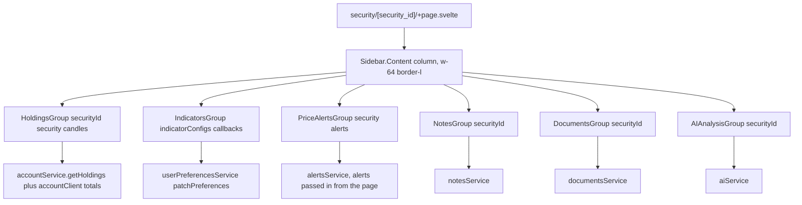
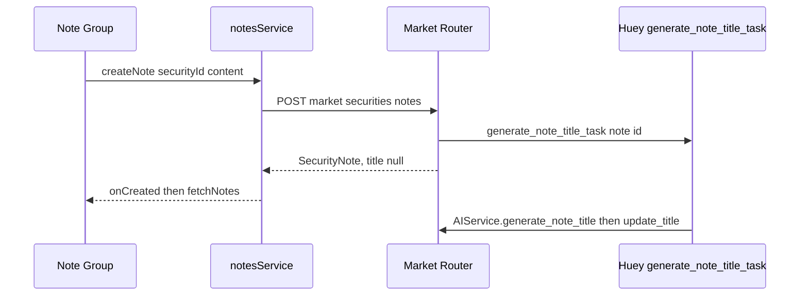

# Security Detail Page Surfaces

The `/security/[security_id]` route is two products sharing one page: the chart surface, and a fixed-width column of "action groups" beside it. Chart rendering, panes, drawing primitives and rewind are owned by [Charting](../architecture/charting.md) and [Chart Drawings, Plugins & Rewind](../architecture/chart-drawings-and-rewind.md). **This page owns the surrounding panels** — the six actions-sidebar groups, their API clients, the notes/documents CRUD and upload storage, the holdings modal, the wave-alert reconcile, and the page-level preference reads/writes those panels depend on. The AI request payloads themselves belong to [AI Analysis](./ai-analysis.md); this page documents only how the AI group is placed and what it does with a response.

## Scope boundary

| Concern | Owner |
|---|---|
| Chart component, candlestick series, indicator series rendering, drawing primitives | [Charting](../architecture/charting.md), [Chart Drawings & Rewind](../architecture/chart-drawings-and-rewind.md) |
| Route `load`, route-map placement, post-navigation wave convention | [Frontend Architecture](../architecture/frontend.md), [Charting](../architecture/charting.md) |
| Actions-sidebar groups, their CRUD clients, upload storage, holdings modal | **this page** |
| Preference key semantics and persistence rules | [User Preferences](../concepts/user-preferences.md) — this page documents which panel reads/writes which key |
| `user-price-alerts` chart primitive (alert lines, axis labels) | [Chart Drawings & Rewind](../architecture/chart-drawings-and-rewind.md) — this page owns the panel that feeds it |
| AI model, context assembly, prompts, async note-title task | [AI Analysis](./ai-analysis.md) |

## The route shell and the post-navigation data wave

`+page.server.ts` awaits almost nothing: it validates the `security_id` param (`error(400, 'Security ID is required')` when absent) and returns `{ security_id }`. Neither the security identity nor its price series is fetched server-side, so the shell and titlebar paint immediately. `page.server.test.ts` pins this by asserting `Object.keys(result)` is exactly `['security_id']` and that `getSecurity`/`getPrices` are never called.

`SecurityPageDataService` (`page-data.svelte.ts`) owns the layer-2 wave. `load(securityId)` fetches `getSecurity` and `getPrices(securityId, from, to, '1d')` in parallel inside `getChartDateWindow(new SvelteDate(), '1d')`, guards against a stale soft navigation with a private `loadSeq` counter, treats a missing/empty `items` array as a *successful* load whose message lands in `error`, and **never throws** — it returns the caught error so the page can route a 401 through `redirectOn401`. The class is instantiated per page per the SSR "no global instances" rule.

The page's mount-time `$effect` resets tool state, `timeframeError`, `hasMoreData`, `isLoadingMore` and `securityChart`, then runs the init chain: preferences → candle mapping → `Promise.all([loadAlerts(), loadHoldings(), drawingsService.loadSnapshots()])` → dynamic import of `security-chart.svelte` → a force-refetch of the active timeframe when it is not `1d`. Group panels therefore mount *after* their data providers already resolved or started resolving, which is why the groups read page-level state where possible.

The titlebar resolves `instantSecurity` from the already-loaded default watchlist so the symbol renders before the fetch lands; a direct load falls back to the `PageHeader` skeleton. `isLoading = !security && !error`, and `error` is `pageData.error ?? timeframeError`, so timeframe switches own their own failure message while the service owns the initial load's; both land in the same "Failed to Load Chart" card.

## The actions-sidebar group contract

Every panel lives under `frontend/src/lib/components/actions-sidebar/` and follows one shape:

- `<Sidebar.Group>` from `$lib/components/ui/sidebar/index.js`.
- `<GroupTitle>` (`group-title.svelte`) as the label: a chevron that rotates `-rotate-90` when collapsed, plus an optional `GroupAction` button carrying `actionIcon` / `actionTitle` / `onAction` (the "＋" or expand action).
- `{#if expanded}<Sidebar.GroupContent>…{/if}` with exactly one of four visual states: skeleton rows while loading, `SidebarError` on failure, an inline empty message, or the list.
- The group owns a bindable `expanded` prop. The page passes `expanded={true}` for all six groups, so they start open regardless of the spec's "collapsed by default" ideal.

`SidebarError` (`sidebar-error.svelte`) is the shared failure surface: a destructive-tinted card with the message and an optional "Try again" button wired to the group's own refetch function. Groups that surface errors pass a literal, human string (`'Failed to load holdings'`, `'Failed to load alerts'`) rather than the raw error, and log the underlying error to the console.

All six groups are mounted **only** on the security detail route; none is reused elsewhere.

The six groups and the clients each one reaches. Holdings and alerts have page-level state injected; the others fetch on their own.

### Group props and data ownership

| Group | Props from the page | Data owner |
|---|---|---|
| `holding-group.svelte` | `securityId`, `security`, `candles={rawCandles}` (all candles, not the rewound slice) | the group itself |
| `indicator-group.svelte` | `indicatorConfigs`, `onIndicatorToggle`, `onPreferencesLoaded`, `onIndicatorConfigChange` | split: group fetches/persists preferences, page computes and renders |
| `price-alert-group.svelte` | `security`, `alerts` (page-level state) | the page |
| `note-group.svelte` | `securityId` | the group |
| `document-group.svelte` | `securityId` | the group |
| `ai-analysis-group.svelte` | `securityId` | the group, via `aiService` |

The price-alert group is the interesting case: because the page also needs `alerts` for the chart primitive and for wave-alert reconcile, the group receives them as a bindable prop and, when that prop is truthy, *only* mirrors it — it never runs its own `getAlerts`. When the prop is absent the group falls back to fetching for itself when expanded.

## Notes

`NotesGroup` (`actions-sidebar/note/note-group.svelte`) fetches `notesService.getNotes(securityId)`, which is `GET /market/securities/{security_id}/notes` returning a `PaginatedResponse<SecurityNote>`, and sorts newest-first by `created_at` before rendering. The backend endpoint orders by `created_at.desc()` and paginates with `PaginationParams`.

**Failure convention.** The group distinguishes a missing collection from a real failure: `catch (err)` reads `err.status` when `err instanceof ApiError`; a `404` is treated as *empty* (`notes = []`, no error card), while every other error sets `error` to `err.message` (or `'Failed to load notes'`) and also clears the list. This is the same convention the documents group uses and the reason a stale or absent route does not show a red card.

**CRUD flow.** Notes are created from a `NoteCreationDialog`, viewed/edited from a `NoteViewDialog`, and deleted through a shared `ConfirmationModal` guarded by `ModalState<number>`. Each dialog is a `Dialog.Root` bound to `modalState.isOpen`, so `ModalState` is the only modal-open authority. After any mutation the group re-runs `fetchNotes()`; deleting the note currently open in the view dialog also closes that dialog. The note payload is content-only — the client types are `SecurityNoteCreateRequest`/`SecurityNoteUpdateRequest` with a single `content` string; `title` is read-only to the client.

One client/server verb mismatch is worth knowing before touching note editing: the backend exposes `PUT /market/securities/{security_id}/notes/{note_id}`, but `notesService.updateNote` issues `this.patch(...)` (HTTP `PATCH`), so the edit path in `NoteViewDialog` cannot currently succeed against this router. The create/delete/list paths match. The create and update endpoints both call `generate_note_title_task(...)` after committing.

A created or updated note immediately triggers asynchronous AI title generation; the client's refetch usually observes the note before its title exists, and the list item falls back to a content preview.

The AI-generated title is what makes the note list readable: `note-list-item.svelte` derives `preview` as `note.title || first 100 chars of content + '…'`, so a note written before the Huey task lands renders prose, and renders the generated title afterwards. The title task, prompt and fallback behavior are documented in [AI Analysis](./ai-analysis.md) — this page owns only the fact that create/update trigger it and that the UI renders the result.

The AI response dialog closes the loop: "Save as Note" posts `AI Analysis ({title}):\n\n{content}` through the same `notesService.createNote`, so an AI result becomes a note (and therefore acquires a generated title on the next task run) without touching the chart or the note group's state.

## Documents

`DocumentsGroup` (`actions-sidebar/document/document-group.svelte`) fetches `documentsService.getDocuments(securityId)` → `GET /market/securities/{security_id}/documents`, which returns a **plain list**, not a `PaginatedResponse`. It applies the identical 404-is-empty convention as notes.

**Upload.** `DocumentUploadDialog` enforces the client-side contract before any request: `allowedTypes` is `application/pdf`, `image/png`, `image/jpeg`, `image/jpg`, `text/plain`, and `maxFileSize` is 10 MiB; violating either clears the selection and sets a local error rather than submitting. The input `accept` list is `.pdf,.png,.jpg,.jpeg,.txt`. Upload posts `FormData` with a `file` part to the same collection URL.

On the backend (`market_create_document`), the file is written to `Path(settings.upload_path)` — the **`upload_path` setting**, default `"data/uploads"` — under a `uuid4()`-derived unique filename that preserves the original extension; the directory is created with `mkdir(parents=True, exist_ok=True)`. The DB row (`market_security_documents`) stores the original `filename`, the absolute `file_path`, `file_size` and the client-reported `file_type`, scoped to `security_id` + `user_id`. `tests/routers/test_documents.py` asserts the upload response echoes filename/size/type and that `file_path` contains `data/uploads`. Deleting a document removes the row only — the file on disk is not cleaned up.

**Download and preview.** The download endpoint is a gap: `documentsService.downloadDocument` calls `getBlob('/market/securities/{securityId}/documents/{documentId}/download')`, but no such route exists in `src/market/router.py` or anywhere else in the backend, so both the list item's download button and the view dialog's preview fetch currently fail (each logs and renders nothing). `DocumentViewDialog` nevertheless implements the full preview path: images render in an ``, PDFs in an `<iframe>` from an object URL, other types show a "Preview not available" placeholder, and an `$effect` cleanup revokes the object URL when the modal closes.

## Holdings panel and modal

`HoldingGroup` (`actions-sidebar/holding-group/holding-group.svelte`) is self-fetching and richer than the other groups. `fetchHoldings` runs `Promise.all([accountService.getHoldings(id), accountClient.getAccounts()])` — `GET /accounts/holdings/{security_id}` plus the account list — then fetches `getAccountTotals` for every account to compute `portfolioPercentage = totalSecurityValue / totalPortfolioValue * 100`. The collapsed header shows the blended average cost (`blendedAverageCost(holdings)`) and the portfolio share; each row links to `/accounts/{account_id}`. It suppresses the skeleton on refetch when holdings already exist (`if (holdings.length === 0) isLoading = true`), and renders the same skeleton/SidebarError/empty/list quartet.

The group runs this fetch from an `$effect` gated on `expanded && effectiveSecurityId` and wrapped in `untrack`, so re-expanding refreshes. Note the page *also* loads holdings (`loadHoldings` → `accountService.getHoldings`) into its own `holdings` state purely to feed `averageBuyingPrice`/`showAveragePrice` into the chart's average-price line — two independent reads of the same endpoint, one for the chart, one for the panel.

`HoldingsModal` (`holdings-modal.svelte`) is opened by the group's `Maximize2` action button via `ModalState<SecuritySchema>`, and accepts either a `modalState` or a plain bindable `open` prop so it can be embedded without one. It accepts `holdings` and `candles` from the parent and only fetches holdings itself when the `holdings` prop is `undefined`. Its period selector (`['1D','1W','1M','1Y','YTD','ALL']`) drives `filterCandlesForPeriod` for the sparkline and `calculateHoldingGain`/`getBenchmarkPrice` for row metrics; the "Elliott Wave Targets" panel derives the latest wave count for the selected degree from the `elliott_waves` preference and computes target price and upside percentage against the resolved current price, which it takes from a `currentPrice` prop, the last candle close, or the holding's own implied price, in that order.

**Preference round-trip.** On open the modal calls `loadPreferences()`: it reads `elliott_waves`, then restores `holdings_period` only if it is one of `PERIODS`, otherwise falls back to `ALL`. A `hasUserChangedPeriod` flag suppresses the load's assignment so a preference fetch that resolves after the user already clicked a period cannot clobber their choice. `handlePeriodSelect` writes through `userPreferencesService.patchPreferences({ holdings_period })` fire-and-forget with a console-only catch. `holdings-modal.test.ts` pins restore-on-open and the invalid-value fallback to `ALL`.

## Indicators group and indicator preference ownership

`IndicatorsGroup` (`actions-sidebar/indicator/indicator-group.svelte`) renders one row per entry of the frozen `INDICATOR_DEFAULTS` table and is a thin controller: it owns *preference* state, while the page owns compute-and-render state.

- `loadPreferences()` (on mount) reads `userPreferencesService.getPreferences()`, normalizes `indicators` to `{}` on failure, and calls `onPreferencesLoaded(preferences)` — the page's `onPreferencesLoaded` handler then applies chart style, timeframe and per-indicator enabled/color/settings, deferring `onIndicatorToggle` by 100 ms via `setTimeout` so `chartRef` is bound first.
- `toggleIndicator(id)` builds the new entry with `buildToggleEntry`, **assigns local state before the network await** to avoid a lost-update race, persists the whole `indicators` map, and only then calls `onIndicatorToggle(id, enabled)`. `volume` and `avgPrice` are never hidden — `volume` is computed locally by the page from `displayCandles`, and `avgPrice` is a chart prop rather than a computed series.
- `saveSettings` / `resetSettings` resolve `enabled` from the **persisted preference** (`preferences.indicators[id].enabled`), falling back to the page's config, because the page's `indicatorConfigs[id].enabled` is stale after a sidebar toggle. `resetSettings` restores color and numeric defaults while deliberately preserving the enabled flag, updates the open modal's bound config so inputs reflect the restored values, and does not close the dialog. `indicator-group.test.ts` covers exactly these two invariants ("does not clobber a sidebar-toggle enabled flag", "does not request a chart re-render when the indicator is disabled").
- Rows for `macd`, `bb`, `rsi`, `obv` expose an `Info` button opening `IndicatorHelpModal`; rows other than `volume` and `avgPrice` expose a settings button opening `IndicatorConfigDialog`, which only closes on Save (not on Reset).

The page's `onIndicatorConfigChange(indicatorId, newConfig, reRender)` merges the partial config; `avgPrice` returns early (it is a prop, not a generic indicator), and an enabled indicator on the chart triggers a re-render. Indicator compute requests carry `interval`, `chart_style` and either the full active set (`refreshActiveIndicators`) or a single spec (`onIndicatorToggle`), plus a `candles` override taken from `sliceCandlesBefore(rawCandles, timelinePosition)` whenever the page is rewound — which is why rewinding or resuming refreshes indicators. Sequence counters (`activeRefreshSeq`, `indicatorSeq[id]`) discard stale responses.

## Price alerts panel and wave-alert reconcile

`PriceAlertsGroup` renders `alert-list-item.svelte` rows — "Above/Below $X", created/triggered dates, `BellRing` when `triggered_at !== null` — plus a `Plus` action opening `PriceAlertModal` (target price + `above`/`below` choice, `condition` defaulting to `below` and reset on close). Deletion goes through a shared `ConfirmationModal`. Row deletion is also bound to `Delete`/`Backspace` on the window, gated on hover/focus and skipped when the event target is an input, textarea or `contenteditable`.

The page owns the alert state and the mutation handlers the chart calls: `handleCreateAlert` and `handleDeleteAlert` each call `alertsService`, then `loadAlerts()`, and swallow failures with a console error (the create modal's own handler persists its own error text). Both manual and chart-initiated alert creation therefore land in the same `alerts` array that `PriceAlertsGroup` mirrors.

**Wave-alert reconcile.** Elliott-wave drawing produces automatic price alerts. `ChartDrawingsService`'s `onWaveAlertsReconcile` callback (fired per point while drawing) routes to `scheduleWaveAlertsReconcile()`, which **chains onto a single promise** (`waveAlertsReconcileSeq`) rather than firing concurrently — concurrent reconciles reading a stale `alerts` array would double-create. Each run:

1. Bails when rewound or when no security is resolved.
2. Computes `desired` levels with `computeWaveAlertLevels(userPreferences.wave_settings ?? DEFAULT_WAVE_SETTINGS, drawingsService.securityElliottWaves, currentPrice)` where `currentPrice` is the last display candle's close.
3. Diffs against the current `alerts` with `reconcileWaveAlerts`, then deletes `toDelete` and creates `toCreate` (each with `source: 'wave'`) and reloads alerts when anything changed.
4. Catches everything — a reconcile failure must never break drawing; the next reconcile self-heals.

The initial-load reconcile is **gated on `userPreferences !== null`**, so a failed preferences fetch can never mass-delete wave alerts; `wave_settings` changes also trigger a reconcile. `page.svelte.test.ts`'s `Security Page - Wave Target Alert Reconcile` suite pins the created targets (e.g. `{target_price: 135, condition: 'above', source: 'wave'}`), the per-degree behavior, and the gating.

## AI Analysis group placement

`AIAnalysisGroup` is the last group in the column and the simplest: three hard-coded actions (`fundamentals` → `analyzeFundamentals`, `summarize-notes` → `summarizeNotes`, `portfolio-debate` → `analyzePortfolioFit` with the placeholder `portfolio_context: 'Analyzing in isolation for now.'`) rendered as buttons. Selecting one opens `AIResponseDialog` in a loading state first, then fills `content` or `error` on the same `ModalState` object; retry re-invokes the recorded `actionId`. The dialog offers copy-to-clipboard, retry, and save-as-note, and renders the response through a small markdown-to-HTML formatter.

The group owns no data fetching beyond `aiService`, no preferences, and no list state — it is a launcher. The endpoints, rate limits, prompts, context assembly and the `"No notes found for this security."` short-circuit belong to [AI Analysis](./ai-analysis.md).

## Preference orchestration on this route

The page and its panels split preference responsibility, and the split is deliberate:

| Key | Read by | Written by |
|---|---|---|
| `chart_style` | page init, `onPreferencesLoaded` | top-toolbar candlestick/Heikin-Ashi buttons (`updateChartPreferences`) |
| `timeframe` | `onPreferencesLoaded` → `changeTimeframe(…, { persist: false })` | `changeTimeframe` when `persist` is true |
| `chart_hide_labels` | page (`hideLabels` prop) | `handleChartHideLabelsChange` from the chart settings modal |
| `wave_settings` | page (wave settings modal, reconcile) | `handleWaveSettingsChange` — PATCH replaces the whole key, so the full object is always sent — then `scheduleWaveAlertsReconcile()` |
| `indicator_pane_heights` | `applySavedPaneHeights` (restored via a 100 ms `setTimeout` so `chartRef` is bound) | `handlePaneHeightsChange` — always the full map, `null` to reset |
| `indicators` | indicator group `loadPreferences`, page `onPreferencesLoaded` | indicator group `toggleIndicator`/`saveSettings`/`resetSettings` |
| `holdings_period` | `holdings-modal` `loadPreferences` on each open | `holdings-modal` `handlePeriodSelect` |
| `elliott_waves`, `fibonacci_tools` | `ChartDrawingsService.setPreferences` | the drawings service |

Persistence helpers (`updateChartPreferences`, the panel-level `patchPreferences` calls) all go through `userPreferencesService`; whose semantics, validation and endpoint are catalogued in [User Preferences](../concepts/user-preferences.md).

Notifications beyond the console are deliberately absent: timeframe persistence, chart style, pane heights, wave settings, holdings period and alert mutations each catch and log, because a failed preference write must not block the interaction. Only the groups' *load* failures surface to the user, and they do so through `SidebarError`.

## Tests that pin these surfaces

The repo's overall test strategy, mocking conventions and suite inventory live on [Testing & Test Strategy](../operations/testing.md); the table below is scoped to this page's surfaces.

| Suite | What it fixes |
|---|---|
| `frontend/src/routes/security/[security_id]/page.server.test.ts` | load returns only `security_id`; never calls `getSecurity`/`getPrices`; 400 on a missing param |
| `frontend/src/routes/security/[security_id]/page.svelte.test.ts` (`Instant Shell with Async Chart Data`) | titlebar before prices resolve, skeleton fallback, in-page error card for a rejected fetch and an empty series, 401 → `/auth/login?clear_session=true`, no navigation on non-401, no unhandled rejections |
| `…page.svelte.test.ts` (`Wave Target Alert Reconcile`) | per-degree wave alert create/delete, `source: 'wave'`, initial-reconcile gating on preferences |
| `…page.svelte.test.ts` (`Asynchronous Indicator Integration`, `Indicator Pane Heights`, `Top Toolbar`) | compute request params (`interval`, `chart_style`, spec id/type/period), immediate removal on toggle-off, local `volume`, force-refetch of the saved timeframe |
| `frontend/src/lib/components/actions-sidebar/holding-group/holding-group.test.ts` | expand action opens the modal, collapse/expand, list rendering, loading/empty/error + retry |
| `frontend/src/lib/components/actions-sidebar/holding-group/holdings-modal.test.ts` | `holdings_period` restored on open, invalid value → `ALL`, period persistence, table/summary/wave-target rendering, dialog a11y |
| `frontend/src/lib/components/actions-sidebar/indicator/indicator-group.test.ts` | default restore preserving `enabled`, no re-render when disabled, sidebar-toggle flag not clobbered, help-modal buttons |
| `frontend/src/lib/components/actions-sidebar/indicator/indicator-config-modal.test.ts`, `indicator-help-modal.test.ts` | reset button behavior, color swatch/picker, per-indicator help content |
| `tests/routers/test_documents.py` | upload echoes filename/size/type with `data/uploads` in `file_path`; list returns the uploaded document |

There are no dedicated vitest suites for the notes, documents, price-alert or AI groups, and no backend test asserting the 404-is-empty client convention — those behaviors are pinned only indirectly through the page suite and manual reasoning, which is worth knowing before refactoring them.
