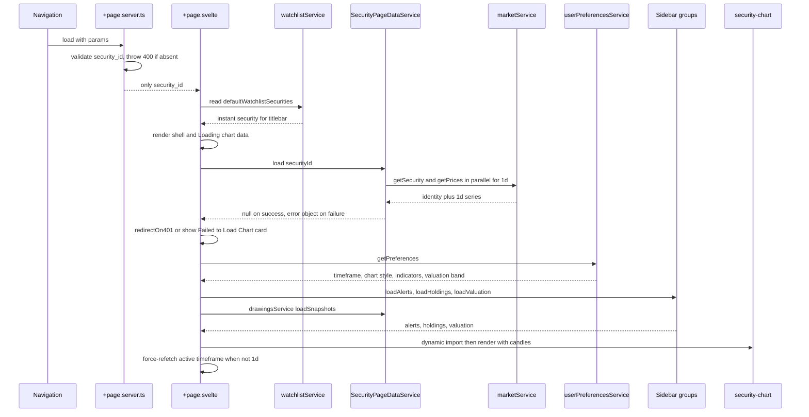

# Security Detail Page & Actions Sidebar

The `/security/[security_id]` route is the chart route, but the chart itself is documented elsewhere: [Charting: Chart Surface, Panes & Indicators](../architecture/charting.md) owns the `security-chart.svelte` surface, [Chart Drawings, Plugins & Rewind](../architecture/chart-drawings-and-rewind.md) owns the drawing/rewind pipeline, [Market Data & Indicators](./market-data-and-indicators.md) owns the candle and indicator math, and [AI Analysis Flows](./ai-analysis.md) owns the prompts and the note-title task. This page owns what those pages deliberately leave out: **how the route is composed** — the server load, the post-navigation data wave, the instant-titlebar trick, the page-level state that every sidebar group shares, and the seven actions-sidebar groups that hang every per-user annotation off the security.

The sidebar is where the route stops being read-only. Notes, documents, price alerts, indicator preferences, holdings, the fair-value range and the AI actions all live there, and each one has a different owner, a different persistence target and a different failure mode.

| Layer | Location | Owns |
|---|---|---|
| Server load | `frontend/src/routes/security/[security_id]/+page.server.ts` | route identity only (`{ security_id }`), 400 when the param is missing |
| Data wave | `frontend/src/routes/security/[security_id]/page-data.svelte.ts` | security identity + `1d` price series, sequence guard, non-throwing `load()` |
| Route orchestration | `frontend/src/routes/security/[security_id]/+page.svelte` | shell/titlebar, timeframe & style state, indicator configs, alerts/holdings/valuation fetch, drawing service wiring, sidebar composition |
| Sidebar groups | `frontend/src/lib/components/actions-sidebar/**` | per-group fetch, empty/error/loading states, modals, persistence |
| HTTP surface | `src/market/router.py` (`market_router`, prefix `/market`) | per-user scoped notes/documents/alerts/snapshots/valuation routes |
| Row models | `src/market/model.py` | `market_security_notes`, `market_security_documents`, `market_price_alerts`, `market_chart_snapshots` |

## Ground rules

- **Commands run inside Docker.** Frontend work runs in the `frontend` service (`docker compose exec frontend ...`).
- **Frontend tests must mock every API client and network-touching module** — CI has no backend.
- **Backend tests must stub all outbound I/O**, and note creation must never fail because of the AI provider.
- **Never export a global service instance from a `.svelte.ts` module.** The route instantiates its own `SecurityPageDataService`; the sidebar groups import module-level `*Service` singletons that are already exported by the plain `.ts` API clients.

## The shell-first load

`+page.server.ts` is deliberately near-empty. It validates the route param and returns nothing else:

```ts
export const load: PageServerLoad = async ({ params }) => {
	const { security_id } = params;
	if (!security_id) throw error(400, 'Security ID is required');
	return { security_id };
};
```

Neither the security identity nor its price series is awaited, so the shell and titlebar render before any data exists. The companion test asserts exactly this contract: `Object.keys(result)` equals `['security_id']`, and neither `getSecurity` nor `getPrices` is called during the server load (`page.server.test.ts`).

### The post-navigation data wave

`SecurityPageDataService` (`page-data.svelte.ts`) is the route's layer-2 state. It holds `security`, `items`, `isLoading` and `error` as runes, and `load(securityId)` runs the wave:

1. Bump a private `loadSeq` — the stale-load guard. Every exit point compares `seq !== this.loadSeq` and bails, and the `finally` only clears `isLoading` for the newest sequence, so a slow response cannot clobber a newer soft navigation.
2. Reset `security`, `items`, `error`, set `isLoading = true`.
3. `Promise.all([ getSecurity(securityId), getPrices(securityId, from, to, '1d') ])` with the window from `getChartDateWindow(new SvelteDate(), '1d')`.
4. An empty or missing `items` array is a **successful** load whose message (`No price data available for this security`) lands in `error`; `load()` returns `null`.
5. On a caught failure, `load()` records `err.message` in `error` and **returns the error object** rather than throwing.

That last point is the seam the page depends on: the caller can distinguish "401 — leave the page" from "the error card already says what happened." The page awaits the returned value and calls `redirectOn401(loadError)`; a 401 navigates to `/auth/login?clear_session=true`, and anything else falls through to the "Failed to Load Chart" card driven by `pageData.error`.

### Instant titlebar

The titlebar does not wait for `getSecurity`. `instantSecurity` is a derived lookup into the already-loaded default watchlist:

```ts
const instantSecurity = $derived(
	watchlistService.defaultWatchlistSecurities.find((s) => s.id === data.security_id) ?? null
);
let security = $derived(pageData.security ?? instantSecurity);
const isLoading = $derived(!security && !error);
```

Shortcut navigation from a watchlist row therefore paints `symbol` + `name` immediately. A direct load (deep link, refresh) has no watchlist entry yet, falls back to the app-header skeleton, and resolves once the wave lands. The route test `renders the shell with the instant titlebar and chart placeholder before prices resolve` asserts both halves: `AAPL`/`Apple Inc.` and `Loading chart data...` are on screen before the price promise settles, and the title skeleton appears when the watchlist cannot resolve the id.

### The init chain

A single `$effect` keyed on `data.security_id` drives everything after mount. `$effect` never runs during SSR, so this is browser-only, and a soft navigation re-runs it through the changed `data.security_id`. Each run, inside `untrack`:

- resets `drawingsService.resetToolState()`, `timeframeError`, `hasMoreData`, `isLoadingMore` and `securityChart`;
- awaits `pageData.load(securityId)`, and bails if `data.security_id` has already changed again (the newer run owns init);
- on a non-null error, `redirectOn401`s and returns;
- loads user preferences if `userPreferences` is still `null` (otherwise it just re-applies them to the service with `drawingsService.setPreferences(userPreferences)`), and applies `show_valuation_band` plus the saved pane heights. The **fuller** preference application — chart style, the saved timeframe and the persisted indicator toggles — is not here: it arrives through the `onPreferencesLoaded` callback that `IndicatorsGroup` fires from its own `getPreferences` fetch on mount, which the page passes down as `{onPreferencesLoaded}`. Both paths write the same page state, and the init chain re-checks `userPreferences` before fetching, so whichever fetch wins the race the other one reuses the result;
- maps `pageData.items` through `mapPriceToCandle`, builds the Heikin-Ashi series, and fans out `Promise.all([loadAlerts(), loadHoldings(), loadValuation(), drawingsService.loadSnapshots()])`;
- schedules the wave-alert reconcile, but only when `userPreferences !== null` — gating on preferences means a failed preference fetch can never mass-delete wave alerts;
- dynamically imports `security-chart.svelte` (so chart code never loads during SSR) and, if the active timeframe is not `1d`, force-refetches it with `changeTimeframe(selectedInterval, { persist: false, force: true })`. The `!isChangingTimeframe` guard is there for the preference path above: `onPreferencesLoaded` may still be running its own `changeTimeframe(prefs.timeframe, { persist: false })`, and a second refetch would be redundant.

The whole chain is wrapped in a `try/catch` that only logs: `load()` itself never throws, and the catch keeps a failure in the dynamic import, preference load or snapshot load from surfacing as an unhandled rejection. The route test `produces no unhandled rejections when the async data path fails` pins that invariant.



Shell-first load: the server returns only the route identity, the titlebar resolves from the watchlist, and the data wave plus sidebar fetches land after the shell is painted.

## The actions sidebar

`+page.svelte` renders the sidebar as a `w-64` column (`div.flex.h-full.min-h-0.w-64.flex-col.border-l`) wrapping `Sidebar.Content`, and stacks seven `Sidebar.Group`s in this fixed order: `HoldingsGroup`, `FundamentalsGroup`, `IndicatorsGroup`, `PriceAlertsGroup`, `NotesGroup`, `DocumentsGroup`, `AIAnalysisGroup`. All seven are passed `expanded={true}` by the route, which matters for the three that declare `expanded = $bindable(false)` internally (`NotesGroup`, `DocumentsGroup`, `AIAnalysisGroup`) — without that prop they would render collapsed. Groups that consume page-owned state are wired by bindable prop and callback rather than owning that state themselves.

### Cross-group state and bindings

The page is the single owner of everything the chart and the sidebar must agree on. Nothing a group holds locally is visible to the chart, so any value that has to reach both is a page-level `$state`/`$derived` handed down in one of two ways.

| Page state | Handed to | Direction | Persisted by |
|---|---|---|---|
| `valuation` (`SecurityValuationRead \| null`) | `FundamentalsGroup` (`bind:valuation`) | two-way | `PUT /market/securities/{id}/valuation` through the group's modal |
| `showValuationOverlay` | `FundamentalsGroup` (`bind:showOverlay`), chart (`showValuation` **and** `showValuationBand`) | two-way to the group, one-way to the chart | `show_valuation_band` — the group's overlay checkbox |
| `alerts` (`PriceAlert[]`) | `PriceAlertsGroup` and the chart | one-way to both | `market_price_alerts` rows, written by the page's `handleCreateAlert` / `handleDeleteAlert` and the wave reconcile |
| `indicatorConfigs` (`Record<string, IndicatorDefault>`) | `IndicatorsGroup` (`indicatorConfigs`), chart (`showAveragePrice={indicatorConfigs.avgPrice.enabled}`) | one-way down, callbacks up | `indicators` map — the group; `avgPrice` — `HoldingsGroup` |
| `indicatorConfigs.avgPrice.enabled` | `HoldingsGroup` (`bind:showAveragePrice`) | two-way | `avgPrice` indicator entry, written by `HoldingsGroup` itself |
| `averageBuyingPrice` | chart (`averagePrice`) | one-way | nothing — derived from the page's `holdings` |
| `userPreferences` | page-internal, plus `drawingsService.setPreferences` | — | page (`timeframe`, `chart_style`, `chart_hide_labels`, `chart_auto_scale`, `chart_log_scale`, `indicator_pane_heights`, `wave_settings`) and `ChartDrawingsService` for the drawing keys |

Two invariants follow. First, **the two-way bindings are what keep the chart and the group in agreement**: toggling the overlay checkbox in `FundamentalsGroup` writes `showOverlay`, which is the same value the chart receives as `showValuationBand`, so the band disappears immediately without a refetch or a reload. The same holds for `bind:valuation` (a save in the modal updates the chart's range) and `bind:showAveragePrice` (the Holdings checkbox *is* `indicatorConfigs.avgPrice.enabled`). Second, **one-way props plus callbacks are used where a group must not own the value**: `alerts` and `indicatorConfigs` are passed down, and the groups report changes back through `onIndicatorToggle`, `onIndicatorConfigChange`, `onPreferencesLoaded` and `onToggleAveragePrice`. The preference-key ownership per group, and the read path for each key, are tabulated in [User Preferences](../concepts/user-preferences.md).

### Holdings

`HoldingsGroup` (`holding-group/holding-group.svelte`) shows what the user owns of this security. It fetches `accountService.getHoldings(securityId)` together with `accountClient.getAccounts()` and `getAccountTotals(acc.id)` per account, sums the totals to derive the `% of Portfolio` figure, and links each row to `/accounts/{account_id}`. It carries the `showAveragePrice` binding and a checkbox that both toggles the chart's average-price overlay through `onToggleAveragePrice` and persists it as the `avgPrice` indicator preference:

```ts
await userPreferencesService.patchPreferences({
	indicators: { ...existingIndicators, avgPrice: { ...currentAvgPrice, enabled: val } }
});
```

The page side owns the authoritative average: `averageBuyingPrice = blendedAverageCost(holdings)` from `@/utils/finance/average-cost`, passed to the chart as `averagePrice` and shown when `indicatorConfigs.avgPrice.enabled` is set. Note that the page's `loadHoldings()` and the group's own `fetchHoldings()` are separate requests against the same endpoint — the page needs the array for the blended average, the group needs it for the table — and only the page's copy feeds the chart. The sidebar's `Maximize2` action opens a `HoldingsModal` with the full breakdown (period buttons, gain metrics, sparkline, Elliott-wave targets), which loads and persists its own `holdings_period` preference.

### Fundamentals & valuation

`FundamentalsGroup` binds the page's `valuation` and `showOverlay` state two ways. It self-fetches with `valuationClient.getValuation(securityId)` on its own `$effect` when `expanded` and `securityId` are set — the client maps a 404 to `null` (both a thrown object carrying `status === 404` and an `Error` whose message contains `404`), so "no range set" is a normal empty state rather than an error — and renders the `lower_bound – upper_bound` range, with the header action icon switching between `Pencil` and `Plus` depending on whether a range exists. Saving goes through `ValuationModal` → `valuationClient.setValuation`, writes the result back through `bind:valuation`, and the page's `handleValuationSaved` mirrors it into `ChartDrawingsService` before persisting a rewind snapshot. The overlay checkbox assigns `showOverlay` first and then persists `show_valuation_band` via `patchPreferences`, so the chart reacts before the round trip completes.

The chart is **not** fed the page's raw `valuation`. The page passes `valuation={drawingsService.effectiveValuation}`, so the band renders the live range normally and the active rewind snapshot's range while rewound, plus `showValuation={showValuationOverlay}` and `showValuationBand={showValuationOverlay}` — both gates carry the same flag. The page's init wave also calls `loadValuation()` against the same endpoint, so the value is filled from two places; both write the same page state. Backend side the range is a per-user row (`SecurityValuationRead` carries `user_id`, `security_id`, `lower_bound`, `upper_bound`) upserted by `PUT /market/securities/{security_id}/valuation`; the upsert also appends a `market_security_valuation_history` row, and `GET` raises 404 when the user has no row for that security. The concept, model, history table and modal are covered in [Security Valuations](../concepts/security-valuation.md); the sidebar group is only its binding surface.

### Indicators

`IndicatorsGroup` is the only fully bidirectional group. It renders one row per key of `INDICATOR_DEFAULTS` (`$lib/chart/indicator-defaults.ts`), reads `preferences.indicators[id].enabled` from `userPreferencesService.getPreferences()`, and reports upward through `onPreferencesLoaded`, `onIndicatorToggle(id, enabled)` and `onIndicatorConfigChange(id, partial, reRender?)`. Toggling writes the merged `indicators` map back with `patchPreferences` **before** awaiting the network, so a lost-update race cannot resurrect a stale map. `saveSettings` and `resetSettings` keep one deliberate quirk: the enabled flag is taken from the *persisted* preference rather than the page's `indicatorConfigs`, because the page copy is stale after a sidebar toggle:

```ts
const isEnabled =
	preferences?.indicators?.[id]?.enabled ?? indicatorConfigs?.[id]?.enabled ?? false;
```

`resetSettings` restores color and numeric settings to `INDICATOR_DEFAULTS[id]` while deliberately preserving the enabled flag. The page consumes the callbacks in `onPreferencesLoaded`, `onIndicatorConfigChange` and `onIndicatorToggle`, which in turn drive the compute request against `indicatorsService.computeIndicators`. What the numbers *mean* is not here: indicator math, the sidecar and the cache belong to [Market Data & Indicators](./market-data-and-indicators.md), and the compute/refresh sequencing belongs to [Charting](../architecture/charting.md).

### Price alerts

`PriceAlertsGroup` accepts a bindable `alerts` prop. When the page passes its own array the group mirrors it; only when the prop is absent does the group self-fetch. The page always passes its own, because alerts are **shared with the chart**: the same `alerts` array is the chart's `alerts` prop, and the chart's `onAddAlert` / `onRemoveAlert` callbacks are the page's `handleCreateAlert` / `handleDeleteAlert`, both of which re-run `loadAlerts()` after mutating.

Alerts are per-user rows in `market_price_alerts` with a `source` column of `manual` or `wave`; `PriceAlertWrite.source` defaults to `manual`, and the route defaults the same way — a chart-drawn or sidebar-created alert omits `source`, so it is a manual alert. Wave alerts are created by the page's own reconcile loop, which computes desired levels from the wave settings and current close, diffs them against the loaded alerts, deletes the stale ones and creates the missing ones with `source: 'wave'`. That reconcile is **serialized** onto a single promise chain precisely because `onWaveChange` fires per point while drawing and concurrent runs reading a stale `alerts` array would double-create. Failures are swallowed by design — a failed reconcile must never break drawing, and the next reconcile self-heals. Evaluation, triggering and the email dispatch are outside this page: see [Realtime & Background Jobs](./realtime-and-background-jobs.md).

### Notes

`NotesGroup` owns its own fetch, sort (`created_at` descending), loading skeletons, error/retry and the empty state, plus a create dialog, a view dialog and a delete confirmation. It treats a 404 as "no notes" rather than an error. Notes are per-user rows in `market_security_notes`; every route is scoped by `user_id` (`market_get_notes` passes `user.id` into `get_by_security_and_user`, and `delete` filters on `user_id` too). The create dialog posts only `{ content }` — titles are not user-authored.

`POST` and `PUT` on the notes routes both enqueue `generate_note_title_task(created_note.id, request_id=get_request_id())` **after** the row is written, and the handler returns the note immediately with `title` still null. The async task reloads the note, calls `ai_service.generate_note_title(note.content)` and writes the title back with `update_title`. The invariant this page must respect is that the request path never depends on the provider: the HTTP response is already on its way, so a provider outage costs a title, not a note. The route test `test_create_note_triggers_title_generation` asserts the task is called with the created note id, then runs the task body against a mocked `AIService` to prove the title lands. Prompt construction, timeout and fallback live in [AI Analysis Flows](./ai-analysis.md).

### Documents — and the gaps in the documents path

`DocumentsGroup` mirrors `NotesGroup`: self-fetch, 404-tolerant, loading/error/empty states, upload and view dialogs, delete confirmation. The client (`$lib/api/documentsService.ts`) exposes four calls against `/market/securities/{security_id}/documents`.

The backend side (`src/market/router.py`) has **three** of those four, and the boundary is worth stating exactly:

- **Upload writes real bytes to local disk.** `market_create_document` builds the directory from `Path(settings.upload_path)` (`src/config/settings.py` defaults it to `data/uploads`), `mkdir(parents=True, exist_ok=True)`, names the file `f"{uuid.uuid4()}{ext}"`, writes the awaited `file.read()` to it, and only then stores a `SecurityDocumentWrite` row with `filename`, `file_path`, `file_size`, `file_type`. The response is a `SecurityDocumentRead` that includes the absolute `file_path`. This is a single-container assumption: the file lives on the local filesystem, not object storage, so the metadata row and the bytes can diverge if the container's disk is replaced or the row is written on a different instance.
- **Delete removes the row, not the file.** `market_delete_document` calls `repository.delete(doc_id, user.id)`, whose implementation is a single `delete(SecurityDocumentModel).where(id).where(user_id)` plus commit. Nothing in the delete path touches the filesystem — there is no `unlink`, no `remove`, no directory walk. Deleting a document therefore orphans its bytes under `settings.upload_path` permanently.
- **Download has no backend route in this checkout.** `documentsService.downloadDocument` calls `getBlob('/market/securities/{security_id}/documents/{documentId}/download')`, and `document-list-item.svelte`'s download button calls it and saves the resulting blob via an object URL. But `market_router` declares only the `GET`, `POST` and `DELETE` document routes — there is no `.../documents/{doc_id}/download` handler, and a repository-wide search for `download` in `src/` returns nothing. The button's click path is therefore broken against this backend: it will surface as a 404 caught and `console.error`'d by `handleDownload`, and the user sees nothing happen. Treat this as a real gap, not a documented flow.

Two further notes on the same group: the client-side acceptance rules are advisory only. `document-upload-dialog.svelte` rejects files whose `type` is not one of `application/pdf`, `image/png`, `image/jpeg`, `image/jpg`, `text/plain` and caps size at 10 MB, but the backend applies no such check — an API caller can post any `UploadFile` of any size. And because `market_get_documents` returns a bare list rather than a paginated envelope, the group reads the response as an array while notes and alerts read `.items`; the frontend interfaces match their respective shapes (`SecurityDocument[]` vs `PaginatedResponse<...>`).

### AI analysis

`AIAnalysisGroup` is a pure action list — it owns no persisted state. Three actions (`fundamentals`, `summarize-notes`, `portfolio-debate`) each open a response modal in a loading state, call the matching `aiService` method, and write `content` or `error` into the modal data. Note that `portfolio-debate` currently sends a hardcoded placeholder context, `'Analyzing in isolation for now.'`. The endpoints, context assembly and failure mapping are documented in [AI Analysis Flows](./ai-analysis.md).

## Ownership summary

| Group | Data owner | Persistence | Route |
|---|---|---|---|
| Your Holdings | `HoldingsGroup` (self-fetch) | none — read-only; the average-price toggle writes the `avgPrice` indicator entry, the modal writes `holdings_period` | `accountService.getHoldings`, `accountClient.getAccounts` / `getAccountTotals` |
| Fundamentals | `FundamentalsGroup` (self-fetch), two-way bound to the page | `show_valuation_band` in user preferences | `GET` / `PUT /market/securities/{id}/valuation` |
| Indicators | `IndicatorsGroup` ↔ page callbacks | `userPreferences.indicators[id]` | `PATCH` user preferences (see [User Preferences](../concepts/user-preferences.md)) |
| Price Alerts | page (`alerts` array), shared with the chart | `market_price_alerts` rows, `user_id`-scoped, `source` manual \| wave | `GET`/`POST`/`DELETE /market/securities/{id}/alerts` |
| Notes | `NotesGroup` (self-fetch) | `market_security_notes` rows, `user_id`-scoped | `GET`/`POST`/`PUT`/`DELETE /market/securities/{id}/notes` |
| Documents | `DocumentsGroup` (self-fetch) | `market_security_documents` rows, `user_id`-scoped, plus a file under `settings.upload_path` | `GET`/`POST`/`DELETE` (no download handler) |
| AI Analysis | `AIAnalysisGroup` (per-request) | none | `POST /market/securities/{id}/ai/*` |

The `user_id` scoping is uniform across notes, documents, alerts, snapshots and valuations: every repository `get_by_security_and_user` / `delete` filters on the authenticated `user.id` from `current_user`. The security *identity* itself is not user-scoped — `market_get_security` looks it up by id alone — so the only private data on this route is what the sidebar groups own.

## Extension points

- **A new sidebar group** is a component under `components/actions-sidebar/<name>/` that takes `securityId` (and whatever page state it needs), owns its own loading/error/empty branches with `SidebarError` and `Skeleton`, and is added to the `Sidebar.Content` block in `+page.svelte`. If it needs to be visible on the chart, it must be wired through a page-level binding rather than publishing its own state.
- **A new per-security user annotation** means a new repository pair (`get_by_security_and_user` + `create` + `delete`, all `user_id`-filtered), a model with the `market_` prefix, request/response schemas, a router triple under `/market/securities/{security_id}/...`, and a matching `ApiClient` subclass. Snapshot routes show the pattern; notes show the variant that also enqueues background work.
- **A new AI action** is an entry in `aiActions`, a branch in `handleRequestAnalysis`, and a method on `aiService` — the group stays stateless.
- **Wave alerts** are the one place where the sidebar and a drawing tool co-own data: extending the reconcile rule means `computeWaveAlertLevels` / `reconcileWaveAlerts` in `$lib/utils/finance/wave-alerts.ts`, and the serialized chain in the page must stay intact.
- **A new cross-group value** must be added as page-level state and passed down; the two-way ones use `bind:`, the rest use a one-way prop plus a callback. A group that keeps such a value privately will silently disagree with the chart.

## Focused tests

- `frontend/src/routes/security/[security_id]/page.server.test.ts` — the load contract: only `security_id` returned, no `getSecurity`/`getPrices`, 400 when the param is missing.
- `frontend/src/routes/security/[security_id]/page.svelte.test.ts` — mocks every API client and network-touching module up front (`marketService`, `userPreferencesService`, `alertsService`, `notesService`, `documentsService`, `accountService`, `valuationClient`, `snapshotsService`, `watchlistService`) plus `lightweight-charts`-adjacent globals (`Path2D`, `ResizeObserver`). The `Instant Shell with Async Chart Data` block is the reference suite: instant titlebar, skeleton fallback, resolved candles without navigation, force-refetch of a saved timeframe, in-page error card for a rejected fetch and for an empty series, 401 routed through `redirectOn401`, no navigation on a 500, and no unhandled rejections. The rewind suite asserts the valuation switch (`updates chart valuation to active snapshot valuation while rewound, and restores live valuation on now`) and that saving a valuation persists a snapshot carrying the range.
- `frontend/src/lib/components/actions-sidebar/fundamentals/fundamentals-group.test.ts` — the "Fair value range not set." empty state, the currency-formatted range, and `patchPreferences({ show_valuation_band: false })` on toggle; `valuation-modal.test.ts` covers the bound validation.
- `frontend/src/lib/components/actions-sidebar/holding-group/holding-group.test.ts` — the `% of Portfolio` math including the zero-portfolio case, the empty/loading/error states, and that the average-price toggle persists without clobbering the other indicator entries.
- `frontend/src/lib/components/actions-sidebar/indicator/indicator-group.test.ts` — reset restores defaults while keeping `enabled` from preferences, and saving settings never clobbers a sidebar-toggle flag.
- `tests/routers/test_notes.py` — create and update both enqueue `generate_note_title_task` with the right id, and the task body writes the AI title back with a mocked `AIService`.
- `tests/routers/test_documents.py` — upload returns the metadata with `data/uploads` in `file_path`, and the subsequent `GET` returns the uploaded document. There is no download or filesystem-cleanup test, consistent with the gaps described above.
