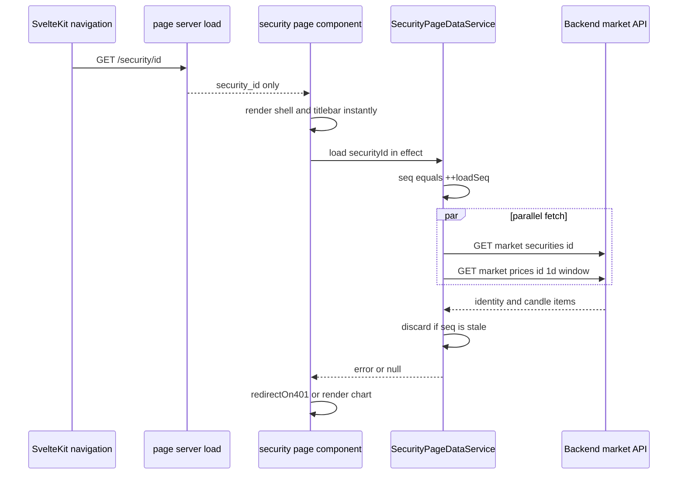
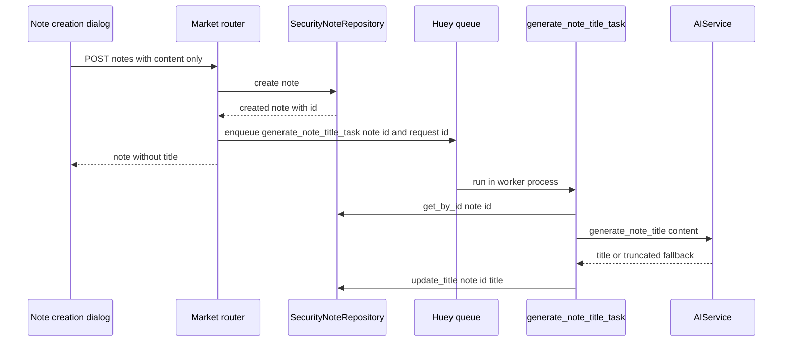

# Security Detail Workspace & Actions Sidebar

`/security/[security_id]` is the application's only per-security workspace. It pairs a chart region with a fixed right-hand **actions sidebar** whose six groups are independent: each group owns its own fetch, its own loading/error/empty states, and its own dialogs. Two design decisions dominate the route:

1. **The shell renders before any security data exists.** `+page.server.ts` returns only `{ security_id }`, and the identity plus the default `1d` price series arrive after navigation from `SecurityPageDataService`.
2. **The sidebar groups are islands.** Holdings, indicators and price alerts receive some state from the page (`security`, `candles`, `alerts`, `indicatorConfigs`); notes, documents and AI analysis receive only `securityId` and talk to the API themselves.

Chart internals (drawings, rewind, panes, the `lightweight-charts` wrapper) live in [Charting](../architecture/charting.md). Indicator compute and the market-data read paths live in [Market Data & Indicators](market-data-and-indicators.md). The AI provider call itself — context assembly, timeouts, failure mapping — lives in [AI Analysis Flows](ai-analysis.md); this page only covers the two things the security route contributes to it: the sidebar's request actions and the note-title handoff.

## The server load: route identity only

`frontend/src/routes/security/[security_id]/+page.server.ts` validates the param and nothing else:

```ts
export const load: PageServerLoad = async ({ params }) => {
	const { security_id } = params;
	if (!security_id) {
		throw error(400, 'Security ID is required');
	}
	return { security_id };
};
```

The comment in the file is explicit that neither the identity nor the price series is awaited, so the shell and titlebar render instantly. This is the shell-first rule documented in [Frontend Architecture](../architecture/frontend.md): the server load produces a cheap route identity, and the expensive reads happen in the page. The colocated `page.server.test.ts` asserts exactly this — the load returns only `security_id`, never calls `getSecurity` or `getPrices`, and throws 400 without the param.

## The post-navigation data wave

`SecurityPageDataService` (`frontend/src/routes/security/[security_id]/page-data.svelte.ts`) is the route's layer-2 state. It is instantiated per page inside the component (`const pageData = new SecurityPageDataService()`), never exported as a module-level instance, per the SSR "no global instances" rule.

Its single `load(securityId)` method:

- increments a private `loadSeq` and captures the new value as `seq`;
- resets `security`, `items` and `error` to `null` and sets `isLoading = true`;
- computes the window with `getChartDateWindow(new SvelteDate(), '1d')` and issues `client.getSecurity(securityId)` and `client.getPrices(securityId, from, to, '1d')` together in a `Promise.all`;
- bails out (`return null`) after either await if `seq !== this.loadSeq`, so a stale in-flight load cannot clobber a newer soft navigation;
- treats a **missing or empty** price series as a successful load whose message lands in `error` (`'No price data available for this security'`) while `security` is still assigned;
- **never throws** — it returns the caught error so the caller can route a 401 through `redirectOn401`, or `null` on success;
- clears `isLoading` in `finally`, but only when `seq === this.loadSeq`.



Caption: the two-wave load — the server returns only the route identity, then the page-owned service resolves the security and its `1d` series in parallel behind a `loadSeq` stale-response guard.

### The effect that owns the wave

A single `$effect` in `+page.svelte` keyed on `data.security_id` drives everything. Because `$effect` never runs during SSR, it is browser-only and fires once per security; a soft navigation re-runs it via the new `data.security_id`. Inside `untrack` it resets per-route state (drawing tool state, `timeframeError`, `hasMoreData`, `isLoadingMore`, `securityChart`), then:

- calls `pageData.load(securityId)` and returns early if `data.security_id !== securityId` (a newer navigation superseded this one);
- on a non-null error, calls `await redirectOn401(loadError)` and returns — a 401 leaves through the shared async-data seam; any other failure is already surfaced by `pageData.error` in the "Failed to Load Chart" card;
- loads user preferences once (if not already loaded), then maps the `1d` items into `Candle[]`, recomputes Heikin-Ashi candles, and runs `Promise.all([loadAlerts(), loadHoldings(), drawingsService.loadSnapshots()])`;
- schedules the wave-alert reconcile **only when `userPreferences !== null`**, so a failed preferences fetch never mass-deletes wave alerts;
- dynamically imports `security-chart.svelte` and assigns it to `securityChart` — the chart component is code-split and only requested after data exists;
- if the user's active interval is not `1d` (and `isChangingTimeframe` is false), force-refetches the series so the displayed timeframe matches the new security.

### The instant titlebar

The titlebar renders from the already-loaded default watchlist before the fetch lands:

```ts
const instantSecurity = $derived(
	watchlistService.defaultWatchlistSecurities.find((s) => s.id === data.security_id) ?? null
);
let security = $derived(pageData.security ?? instantSecurity);
const isLoading = $derived(!security && !error);
```

Shortcut navigation therefore resolves the symbol and name synchronously; a direct URL load has no matching watchlist entry and falls back to the `PageHeader` skeleton until the service resolves. `isLoading` and `error` are both passed to `PageHeader`, and the same `error` (the service's, or a timeframe switch's `timeframeError`) drives the single "Failed to Load Chart" card.

## The actions sidebar

`+page.svelte` renders the sidebar as a `Sidebar.Content` column (`w-64`, bordered, scrollable) containing six groups in a fixed order. Three are shared, expanded by default and mounted as soon as `security` exists:

```svelte
<HoldingsGroup securityId={security.id} {security} candles={rawCandles} expanded={true} />
<IndicatorsGroup expanded={true} {indicatorConfigs} {onIndicatorToggle}
	{onPreferencesLoaded} {onIndicatorConfigChange} />
<PriceAlertsGroup {security} expanded={true} {alerts} />
<NotesGroup securityId={security.id} expanded={true} />
<DocumentsGroup securityId={security.id} expanded={true} />
<AIAnalysisGroup securityId={security.id} expanded={true} />
```

Every group is built from two shared primitives:

- `GroupTitle` — the collapsible header. It renders a `Sidebar.GroupLabel` button with a `ChevronDown` that gets `-rotate-90` when collapsed, plus an optional `Sidebar.GroupAction` icon button (with `aria-label`/`title` from `actionTitle`) for the group's primary action. `nested` groups pass `expanded`/`onToggle`; the icon-only action is how "add note", "upload document" and "create price alert" are exposed.
- `SidebarError` — the shared failure block: an alert icon, a message, and an optional "Try again" button wired to a retry callback. A group that fails renders `<SidebarError message={error} onretry={fetch…} />` instead of its list content.

`GroupTitle` is the only group structure the repository implements today. The OpenSpec requirements in `openspec/specs/actions-sidebar/spec.md` describe a broader future surface — all groups collapsed by default, dividers between groups, badge support, a mobile bottom-sheet mode and explicit keyboard/screen-reader scenarios. The code evidences only part of it: the header/expand/collapse contract, the group action button, and the hover/focus states on action items. The groups are also **not** all collapsed by default: each call site passes `expanded={true}`, and the defaults in the group components (`false` for notes, documents and AI analysis) are overridden by the page.

### Group-by-group contract

| Group | Fetches | CRUD surface | Loading / error / empty behavior |
| --- | --- | --- | --- |
| `HoldingsGroup` | `accountService.getHoldings(securityId)` + `accountClient.getAccounts()` + one `getAccountTotals(acc.id)` per account, all under `Promise.all` | Read-only; expand-to-modal for the breakdown | `Skeleton` × 2, `SidebarError` with retry, or "You don't hold any shares of this security." |
| `IndicatorsGroup` | Preferences-driven; the page's `refreshActiveIndicators` calls `indicatorsService.computeIndicators` | Toggle + per-indicator config dialog, persisted through `userPreferencesService` | `loading-indicators-spinner` in the chart toolbar |
| `PriceAlertsGroup` | `alertsService.getAlerts(security.id)`, **unless** the page supplies `alerts` | Create (`PriceAlertModal`) and delete (confirm modal) | `Skeleton` × 2, `SidebarError` with retry, or "No alerts yet" |
| `NotesGroup` | `notesService.getNotes(securityId)` | Create / edit / delete through three dialogs | `Skeleton` × 3, `SidebarError` with retry, or "No notes yet" |
| `DocumentsGroup` | `documentsService.getDocuments(securityId)` | Upload / preview+download / delete | `Skeleton` × 3, `SidebarError` with retry, or "No documents yet" |
| `AIAnalysisGroup` | none on mount; three fixed actions call `aiService` on click | Request-only; result opens in `AIResponseDialog` | Per-action loading inside the response dialog, with retry |

A pattern shared by every list group: a **404 is treated as an empty list, not an error**. `NotesGroup.fetchNotes` and `DocumentsGroup.fetchDocuments` both branch on `err instanceof ApiError && err.status === 404` and assign `[]`, and only route other statuses into `error`. Both also re-fetch after a successful mutation (`onCreated` / `onUploaded` / `onUpdated` / delete-then-fetch) rather than patching local state.

All dialogs use the shared `ModalState` helper (`$lib/utils/modal-state.svelte`) for open/close and for carrying the subject (`ModalState<SecurityNote>`, `ModalState<SecurityDocument>`, `ModalState<number>` for the delete-confirm id). The creation dialogs also bind "primary action on Enter": `NoteCreationDialog` and `DocumentUploadDialog` intercept `Enter` in a keydown handler (with `Shift+Enter` reserved for a newline in the note textarea), matching the `Note Modals` / `Document Modals` OpenSpec requirements.

## Notes: the asynchronous title handoff

Notes are the one sidebar group whose write path leaves the request. The frontend contract is deliberately title-less:

```ts
export interface SecurityNoteCreateRequest { content: string; }
export interface SecurityNoteUpdateRequest { content: string; }
```

The user types content only; the title is generated by AI afterwards. The note list item renders `note.title || content-preview`, where the preview is the first 100 characters plus an ellipsis — so a note is readable before its title exists.

### Backend write path

`POST /market/securities/{security_id}/notes` and `PUT /market/securities/{security_id}/notes/{note_id}` (note the **PUT**, not PATCH, on the server, while the frontend client calls `this.patch(...)`) both create/update the row and then enqueue the same task with the current request id:

```python
created_note = await note_repository.create(note, security_id, user.id)
logger.info("Created note %d for security %s", created_note.id, security_id)

# Trigger title generation in background
generate_note_title_task(created_note.id, request_id=get_request_id())
```

The update path mirrors this with `generate_note_title_task(note_id, request_id=get_request_id())`. The `request_id` comes from `src.core.context.get_request_id()`, i.e. the HTTP request's correlation id, so the worker's logs stay attached to the originating request.

### The Huey task

`generate_note_title_task` (`src/market/task.py`) is a thin `@huey.task()` wrapper that seeds the request id (falling back to `get_request_id()` when none was passed) and runs `_generate_note_title(note_id, request_id)` under `asyncio.run`. The async body:

1. returns immediately if `huey.svcs_registry is None`;
2. regains the request-id context with `set_request_id(request_id)` and resets it in `finally`;
3. opens its own `svcs` `Container` and resolves `SecurityNoteRepository` and `AIService`;
4. loads the note by id — an unknown note logs `"Note %d not found for title generation"` and returns;
5. calls `ai_service.generate_note_title(note.content)` and writes the result back with `note_repository.update_title(note_id, title)`.

`update_title` is a narrow repository method that sets only the title column, so the worker cannot accidentally rewrite `content` or `updated_at`.



Caption: the note-to-title handoff — the HTTP request returns as soon as the row exists, and the worker regenerates the title through `AIService` and writes it back with a title-only repository call.

### Title generation and the truncation fallback

`AIService.generate_note_title(content)` issues its own chat-completions call with `model="gpt-4-turbo"`, `temperature=0.3`, `max_tokens=20` and `timeout=10`, and a system message fixing the 50-character limit. It strips surrounding quotes if the model wrapped the title, then returns `title_str[:MAX_TITLE_LENGTH]` where `MAX_TITLE_LENGTH = 50`. **Any** exception — including an empty or non-string response — is caught, logged with `logger.exception("Failed to generate note title")`, and converted into a truncation fallback: `content[: MAX_TITLE_LENGTH - 3] + "..."` when the content is longer than 50 characters, otherwise the content itself. The note therefore always ends up with a title; a provider outage degrades to a content prefix rather than leaving the note title-less or failing the task.

Two operational notes matter when touching this path:

- The task resolves `AIService` from the worker's container, and the stub AIService (`src/stubs/ai.py`) implements only `analyze_fundamentals`, `summarize_notes` and `analyze_portfolio_fit` — it has **no** `generate_note_title`. Test and stub environments that route through the stub will therefore fail the attribute lookup inside the task; the tests instead patch `src.market.task.Container` with a mock whose `aget` returns an `AsyncMock(spec=AIService)` and call `_generate_note_title` directly.
- `_generate_note_title` returns silently when `huey.svcs_registry` is `None`, so a misconfigured worker drops title generation without an error. The AI flow's provider semantics are documented in [AI Analysis Flows](ai-analysis.md).

`tests/routers/test_notes.py` pins the contract end-to-end: on create and on update, `generate_note_title_task` must be called once as `(note_id, request_id=ANY)`, and after running the async body the note fetched through `GET /notes` carries the mocked title.

### Note pagination

`GET /market/securities/{security_id}/notes` is a `PaginatedResponse[SecurityNoteRead]` driven by the shared `PaginationParams` dependency, with the repository defaulting to `offset=0, limit=50` and ordering by `created_at.desc()`. The sidebar calls it with no arguments and consumes only `res.items` — there is no pagination control in the group, so the practical cap is the repository default. The list is then re-sorted client-side by `created_at` descending, which is a no-op against the server order but keeps the group correct if the contract changes.

The `security-notes` OpenSpec requirements additionally specify rich-text formatting, ascending sort, chronological display and "summary = first 100 characters" — the code implements the 100-character preview and date display, a fixed descending sort with no sort toggle, and a plain textarea rather than rich text.

## Documents: upload path and storage rules

The document group follows the same shape as notes, but the write path is multipart and stored on disk.

### Upload

`DocumentUploadDialog` validates **in the browser first**:

- allowed types: `application/pdf`, `image/png`, `image/jpeg`, `image/jpg`, `text/plain` (`accept=".pdf,.png,.jpg,.jpeg,.txt"` on the hidden file input);
- a rejected type sets `error = 'Invalid file type. Allowed types: PDF, PNG, JPG, TXT'` and clears the selection;
- maximum size `10 * 1024 * 1024` bytes (10 MB); an oversized file sets `error = 'File size exceeds 10MB limit'` and clears the selection.

Only a valid selection enables the Upload button, which calls `documentsService.uploadDocument(securityId, file)`. On success the dialog fires `onUploaded` (the group's `fetchDocuments`), closes, and resets state. Note that the OpenSpec list for allowed formats (PDF, DOC, DOCX, TXT) does **not** match the implementation, which allows PDF, PNG, JPG/JPEG and plain text and rejects DOC/DOCX. The `security-documents` spec also describes upload progress and a filename filter input; neither exists in the component.

### Server side

`POST /market/securities/{security_id}/documents` accepts an `UploadFile` and:

- resolves the storage directory from `settings.upload_path` (default `"data/uploads"`) and `mkdir(parents=True, exist_ok=True)`s it;
- derives the extension from the original filename and writes **`f"{uuid.uuid4()}{file_ext}"`** into that directory — the stored path is a random UUID plus extension, so on-disk names never collide and never leak the user's filename;
- reads the whole body into memory (`content = await file.read()`), writes it, and records `file_size = len(content)`;
- persists a `SecurityDocumentWrite` carrying the **original** `filename`, the randomized `file_path`, the size and `file.content_type or "application/octet-stream"`.

Content type is whatever the client declared — there is no server-side magic-byte sniffing, and no per-user quota or total-size cap is enforced beyond the client's 10 MB check. The document row (`market_security_documents`) is keyed by `security_id`, `user_id`, `filename`, `file_path`, `file_size`, `file_type`, `created_at`; `tests/routers/test_documents.py` asserts both that the response echoes the original filename/size/type and that the returned `file_path` contains `data/uploads`.

`GET /market/securities/{security_id}/documents` returns a **plain list** (not a paginated envelope) ordered `created_at.desc()` for the calling user — which is why the frontend's `getDocuments` returns `SecurityDocument[]` directly while notes and alerts return `PaginatedResponse<T>`.

### Download — and a frontend/backend drift

`DocumentListItem` and `DocumentViewDialog` both download through a blob:

```ts
async downloadDocument(securityId: string, documentId: number): Promise<Blob> {
	return await this.getBlob(`/market/securities/${securityId}/documents/${documentId}/download`);
}
```

The blob is turned into an object URL, `link.download = document.filename` preserves the original filename, and the URL is revoked after the click. `DocumentViewDialog` also fetches the same blob for inline preview: an `` for `image/*`, an `<iframe>` for `application/pdf`, and a "Preview not available for this file type" placeholder otherwise; the preview URL is revoked in the effect's cleanup.

**Flagged drift.** `frontend/src/lib/api/documentsService.ts` targets `GET /market/securities/{security_id}/documents/{doc_id}/download`, but `src/market/router.py` currently exposes only three document routes:

| Method | Path |
| --- | --- |
| `GET` | `/market/securities/{security_id}/documents` |
| `POST` | `/market/securities/{security_id}/documents` |
| `DELETE` | `/market/securities/{security_id}/documents/{doc_id}` |

There is no `.../download` handler and no other module registers one (a repository-wide grep for document download routes returns nothing), and `tests/routers/test_documents.py` covers only upload and list. So the download button, the image/PDF preview, and `SecurityDocument.file_path` itself are all dead weight client-side until a download route exists. Verify the current backend surface before relying on — or documenting — the download path; the delete path, by contrast, is fully implemented (`DELETE` scoped by `user_id`) and the group's confirm-modal delete then re-fetches.

## Holdings group: cross-domain reads and blended average cost

The holdings group is the most cross-cutting group in the sidebar. It reads from two different frontend clients and, on the backend, two different domains.

### The read contract

`accountService.getHoldings(securityId)` targets `GET /accounts/holdings/{security_id}` (note: the **account** domain, not the market domain like its sibling groups). The backend handler `security_holdings` in `src/account/router.py` delegates to `PositionService.get_holdings_by_security(security_id, user.id, offset, limit)` and returns `PaginatedResponse[AccountHoldingRead]`.

`AccountHoldingRead` carries `account_id`, `account_name`, `quantity`, optional `average_cost`, `total_value`, `currency`, and the optional `account_total_value` / `account_percentage`. `PositionService` fills in everything the repository cannot:

- the repository (`SqlAlchemyPositionRepository.get_holdings_by_security`) joins `PositionModel` to `AccountModel` on `account_id`, filters by `security_id` **and** `AccountModel.user_id`, and returns rows with `total_value=0.0` and `currency=""` explicitly marked as "populated by service layer";
- the service first resolves the security — on `SecurityNotFoundError` it returns `([], 0)`, with an in-code TODO noting that this is indistinguishable from "no holdings";
- it takes the latest close via `MarketPricesApi.get_latest_close`, computes `holding_total_value = quantity * latest_price`, and labels the holding with the **security's** currency;
- it resolves each account, computes that account's totals, and derives `account_percentage` only when the account total is positive, converting the holding value into the account currency with `self._currency_convert` before dividing.

### What the sidebar group adds

`HoldingGroup` renders a compact "Your Holdings" summary rather than the full table:

- the header row shows the **blended average cost** and `% of Portfolio`;
- each holding row links to `/accounts/${holding.account_id}` and shows the account name, `total_value`, `quantity` shares and the per-account `average_cost`;
- the group's `GroupTitle` action icon is `Maximize2`, opening `HoldingsModal` for the full breakdown.

`fetchHoldings` fans out three calls:

1. `accountService.getHoldings(effectiveSecurityId)` for the per-account rows;
2. `accountClient.getAccounts()` for the account list;
3. one `accountClient.getAccountTotals(acc.id)` per account, in a `Promise.all`.

It then sums the per-account totals with `moneyToNumber` into `totalPortfolioValue`, sums `holding.total_value` into `totalSecurityValue`, and sets `portfolioPercentage = (totalSecurityValue / totalPortfolioValue) * 100`, or `0` when the portfolio total is not positive. Any failure sets `error = 'Failed to load holdings'`, which renders `SidebarError` with `fetchHoldings` as the retry. The effect that triggers the fetch is guarded by `expanded && effectiveSecurityId` and wrapped in `untrack`, and only shows the skeleton on a first load (`if (holdings.length === 0) isLoading = true`).

`effectiveSecurityId` is `securityId ?? security?.id`, so the group works both from the standalone `securityId` prop and from a `SecuritySchema`.

### blendedAverageCost

`frontend/src/lib/utils/finance/average-cost.ts` is the shared quantity-weighted average:

```ts
export function blendedAverageCost(
	holdings: { quantity: number; average_cost?: number }[]
): number {
	if (holdings.length === 0) return 0;
	const totalQuantity = holdings.reduce((sum, h) => sum + h.quantity, 0);
	if (totalQuantity === 0) return 0;
	const totalCost = holdings.reduce((sum, h) => sum + h.quantity * (h.average_cost ?? 0), 0);
	return totalCost / totalQuantity;
}
```

It returns `0` for an empty list or zero total quantity and treats a missing `average_cost` as `0`. Two consumers on this page share it: the sidebar's "Average" line and, more importantly, the chart's `avgPrice` dashed price line — `+page.svelte` computes `let averageBuyingPrice = $derived(blendedAverageCost(holdings))` from the holdings it loads itself in the data wave, passes it to the chart as `averagePrice`, and gates it with `showAveragePrice={indicatorConfigs.avgPrice.enabled}`. This is why the page (not the group) owns a second `loadHoldings()` call: the chart needs the blended cost independently of whether the sidebar group is expanded or successful. The `avgPrice` toggle is also special-cased throughout the indicator code — it is skipped by `refreshActiveIndicators`, has no server-side series, and is handled inline by `onIndicatorToggle`.

`blendedAverageCost` is also used by the holdings modal and by the `/holdings` page; the grouping/weighted-cost story for those surfaces is in [Accounts & Holdings Views](accounts-and-holdings-views.md).

## Price alerts: page-owns-state, group-owns-mutations

The page loads alerts itself (`loadAlerts` → `alertsService.getAlerts(security.id)` → `alerts = res.items`) and passes them down as the bindable `alerts` prop. `PriceAlertsGroup`'s effect prefers the external array when present and only self-fetches when it is absent:

```ts
$effect(() => {
	if (externalAlerts) {
		alerts = externalAlerts;
	} else if (expanded && security?.id) {
		fetchAlerts();
	}
});
```

The page owns alerts because the chart draws them: `ChartComponent` receives `{alerts}`, `onAddAlert={handleCreateAlert}` and `onRemoveAlert={handleDeleteAlert}`, so a price line added on the chart and one added from the sidebar modal land in the same array. Mutations are optimistic-free — `handleCreateAlert` / `handleDeleteAlert` (page) and the group's own create/delete confirm all call the service and then re-run `loadAlerts()`/`fetchAlerts()` so the chart and the list agree.

The `source` field (`'manual' | 'wave'`) is what separates the two producers. Elliott-wave drawing reconciles alerts automatically: `reconcileWaveAlertsForSecurity` computes the desired levels from the saved wave settings and drawn waves, diffs them against the current `alerts` via `reconcileWaveAlerts`, deletes the obsolete ones, creates the missing ones with `source: 'wave'`, and re-loads if anything changed. Because `onWaveChange` fires per point while drawing, the reconciles are serialized on a single promise chain (`waveAlertsReconcileSeq`) so each run sees the previous run's applied state; a reconcile failure is logged and swallowed, self-healing on the next reconcile. Reconciles are skipped while rewound and gated on preferences having loaded. Wave alerts and the drawing lifecycle are covered in [Charting](../architecture/charting.md).

Backend: `GET`/`POST /market/securities/{security_id}/alerts` and `DELETE .../alerts/{alert_id}`, all scoped to the authenticated user, with the repository handling evaluation and triggering (`triggered_at`, `source`).

## AI analysis group

`AIAnalysisGroup` mounts with no fetch. It renders three fixed actions — "Explain Fundamentals", "Summarize Notes" and "Portfolio Debate" — each opening `AIResponseDialog` immediately in a loading state and then calling the matching `aiService` method. Failures set `error` on the modal data and enable `handleRetry`, which re-invokes the same action. The group's "Portfolio Debate" action currently sends the literal `portfolio_context: 'Analyzing in isolation for now.'` rather than real holdings, so the portfolio comparison is not yet wired to the holdings group's data. The endpoint contracts, prompt assembly and provider failure mapping are documented in [AI Analysis Flows](ai-analysis.md).

## Extension points and invariants

- **Adding a sidebar group** means adding a component under `frontend/src/lib/components/actions-sidebar/`, composing `GroupTitle` + `Sidebar.Content`/`GroupContent` + `SidebarError`, and mounting it in the `Sidebar.Content` block. Pass `securityId` for a self-fetching group, or shared state for one the page must coordinate.
- **Never export a service instance** from `page-data.svelte.ts`; instantiate per page.
- **Post-navigation loads must not throw.** A service `load` returns the error so the caller can `redirectOn401` it; the page must stop rendering its own error state when that returns `true`.
- **Treat 404 as empty** in list groups; only non-404 errors become `SidebarError`.
- **The stale-response guards are load-bearing.** `loadSeq` in `SecurityPageDataService`, `activeRefreshSeq`/`indicatorSeq` for indicator computes, and `data.security_id !== securityId` in the mount effect each protect against a superseded navigation or toggle overwriting newer state.
- **Note and document writes always re-fetch** rather than patching local arrays, keeping server ordering and the AI-generated title visible without client-side reconciliation.
- **Elliott-wave alert reconciliation must stay dry when preferences failed to load**, or a transient preferences outage would delete the user's wave alerts.

## Focused tests

| Test | What it pins |
| --- | --- |
| `frontend/src/routes/security/[security_id]/page.server.test.ts` | The load returns only `security_id`, never calls `getSecurity`/`getPrices`, and throws 400 without the param |
| `frontend/src/routes/security/[security_id]/page.svelte.test.ts` | The page's data wave, preferences application and indicator wiring |
| `frontend/src/lib/components/actions-sidebar/holding-group/holding-group.test.ts` | `getHoldings` + `getAccounts` + per-account `getAccountTotals` fan-out, the "Average" line and portfolio percentage, mocked `$app/paths` for the account links |
| `frontend/src/lib/components/actions-sidebar/holding-group/holdings-modal.test.ts` | The expanded breakdown modal |
| `tests/routers/test_notes.py` | Create/update enqueue `generate_note_title_task(note_id, request_id=ANY)`; running `_generate_note_title` writes the AI title back and the note read returns it |
| `tests/routers/test_documents.py` | Upload stores under `data/uploads` and echoes the original filename/size/type; list returns the uploaded document |
| `frontend/src/lib/api/async-data.test.ts` | `redirectOn401` handles only `ApiError` 401 and returns `false` for everything else |
