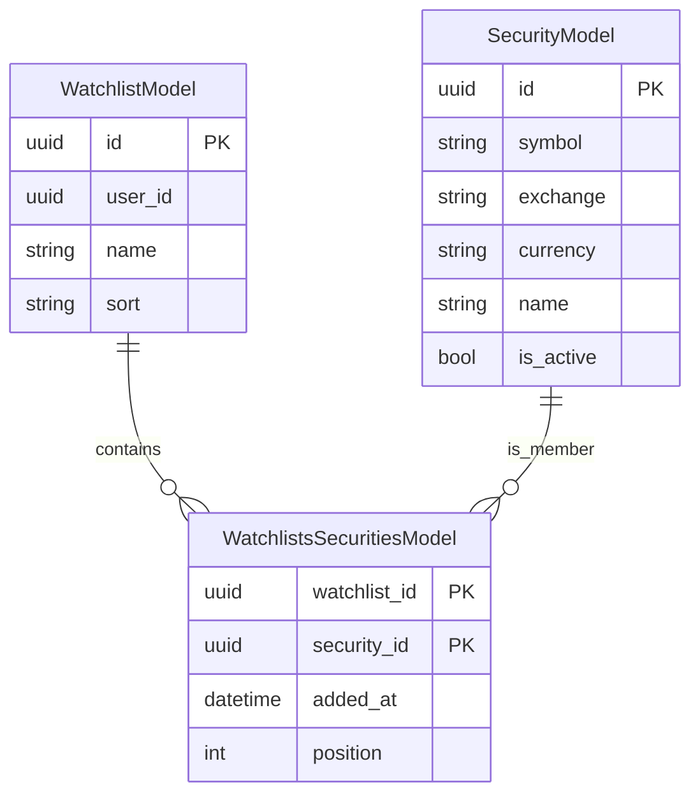
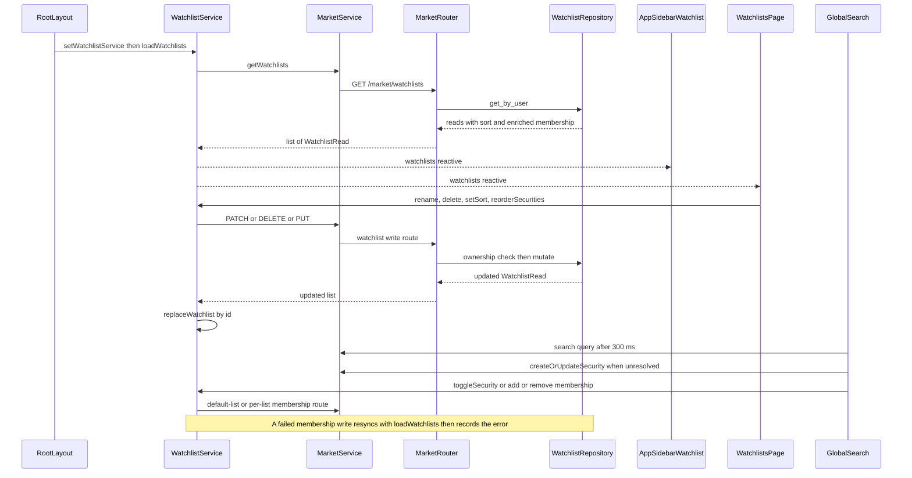

# Watchlists, Sidebar & Global Search

Watchlists are the one market feature with a full CRUD surface rather than per-security
sub-resources, and they are also the only per-user collection that the frontend shell owns
globally: the same loaded array feeds the sidebar groups, the `/watchlists` page, the numeric
ticker shortcuts, the security detail page's instant titlebar and the global-search star toggle.
This page documents that whole surface — storage, repository contract, HTTP routes, the
client-side owner, and the three presentations of it (sidebar, page, search dialog).

The domain catalog entry for these tables and the layer rules for the frontend live elsewhere:
see [Backend Domains](../architecture/domains.md) for the market module map, service registration
and the extension recipes, and [Frontend Architecture](../architecture/frontend.md) for the
route map, the `ApiClient` layer and the service/context conventions this page assumes.

| Layer | Location | Owns |
|---|---|---|
| Storage | `src/market/model.py` | `market_watchlists`, `market_watchlists_securities` |
| Migration | `migrations/versions/4c2ed77e7738_add_watchlist_sort_membership_added_at_.py` | the `sort` / `added_at` / `position` columns plus their deterministic backfill |
| Repository contract | `src/market/repository.py` (`WatchlistRepository`) | the twelve-operation ABC the router resolves and calls directly — only `create_default` has no route, and there is no backend watchlist service |
| Repository implementation | `src/market/repository_sqlalchemy.py` (`SqlAlchemyWatchlistRepository`) | ownership scoping, membership ordering, price enrichment, permutation validation |
| HTTP surface | `src/market/router.py` (`market_router`, prefix `/market`) | the ten watchlist routes plus search and resolve-or-create |
| Client owner | `frontend/src/lib/components/watchlist/watchlistService.svelte.ts` | `WatchlistService`, instantiated once by `+layout.svelte` and read from context |
| Presentation | `frontend/src/lib/components/layout/app-sidebar-watchlist.svelte`, `frontend/src/routes/watchlists/+page.svelte`, `frontend/src/lib/components/global-search.svelte` | sidebar groups, the page, the search dialog |
| Shared helpers | `frontend/src/lib/components/watchlist/watchlist-utils.ts` | sort normalization, ordering, reorder key handling, formatters |

## Ground rules

- **Commands run inside Docker.** Frontend work runs in the `frontend` service
  (`docker compose exec frontend ...`); backend tests go through the agent harness.
- **Editing a model requires an Alembic revision in the same change.** `market_watchlists.sort`
  and `market_watchlists_securities.added_at` / `position` are the worked example.
- **Tests never dial external services.** The router and repository suites use the ephemeral
  testcontainers PostgreSQL (`tests/routers/test_market.py`,
  `tests/repositories/test_repository_sqlalchemy.py`); every frontend test mocks the API clients
  (`watchlistService.test.ts`, `page.svelte.test.ts`, `global-search.test.ts`, `app-sidebar.test.ts`).

## Data model

The membership association is an entity in its own right, not a bare join table: it carries
`added_at` and an application-managed `position`, and the watchlist row carries the persisted
`sort` mode. `market_watchlists` has a unique `(user_id, name)` constraint, and both foreign keys
of the association use `ondelete="CASCADE"`, so deleting a watchlist or a security removes its
membership rows.



Watchlist rows, their membership metadata, and the security each membership points at.
Two consequences of this shape drive most of the implementation:

- The ORM `securities` relationship is declared as `secondary="market_watchlists_securities"`
  with `lazy="selectin"`, but a `secondary` relationship cannot order by or carry association
  columns. Every read path therefore queries the association table explicitly, joined to the
  security rows, and orders by `position` then `added_at`
  (`SqlAlchemyWatchlistRepository._load_memberships`).
- Writes have the mirror-image problem: `add_security_to_watchlist` inserts the membership row
  explicitly (rather than appending to the relationship) because the association columns must be
  set, then reloads the watchlist with `populate_existing=True` so the in-session collection is
  not stale.

`migrations/versions/4c2ed77e7738_add_watchlist_sort_membership_added_at_.py` adds the three
columns with server defaults, backfills them, and only then enforces `NOT NULL`. Existing
memberships carry no ordering information, so the backfill numbers each watchlist's rows by
`row_number() OVER (PARTITION BY watchlist_id ORDER BY security_id)` — arbitrary but stable and
reproducible. `sort` backfills to `custom`.

## The repository contract

`WatchlistRepository` in `src/market/repository.py` is an ABC the router resolves with
`services.aget(WatchlistRepository)` and calls directly — there is no `WatchlistService` on the
backend. The ABC's own docstring states the ownership rule the implementation must uphold: every
operation is scoped to the owning `user_id`, and a watchlist that does not exist *or* is owned by
another user is reported as `WatchlistNotFoundError` so callers cannot distinguish the two.

| Method | Behaviour |
|---|---|
| `get_by_user(user_id)` | All the user's watchlists; each read is built from the explicit association join ordered by `position` (then `added_at`), and every security is price-enriched |
| `create(user_id, name)` | Insert; an `IntegrityError` from the `(user_id, name)` unique constraint is rolled back and re-raised as `WatchlistDuplicateNameError`, leaving the session usable |
| `rename(watchlist_id, user_id, name)` | `_get_owned` first, then rename; a duplicate name raises the same error |
| `update_sort(watchlist_id, user_id, sort)` | `_get_owned`, then persist the `WatchlistSortMode` value |
| `set_security_order(watchlist_id, user_id, ordered_security_ids)` | `_get_owned`, validate the payload, then rewrite positions to `0..n-1` |
| `delete(watchlist_id, user_id)` | `_get_owned`, then delete; membership rows go through the cascade |
| `create_default(user_id)` | Creates the literal `"Default"` watchlist; part of the contract but not invoked by any route |
| `add_security` / `remove_security` | The id-less default-list shortcuts |
| `add_security_to_watchlist` / `remove_security_from_watchlist` | Membership edits on one watchlist |
| `get_securities(watchlist_id, user_id, offset, limit)` | Ownership check, then a page plus total |

### Ownership and error taxonomy

`_get_owned(watchlist_id, user_id)` is the single ownership gate: it selects on both the id and
the `user_id` and raises `WatchlistNotFoundError` when nothing matches, which is why a foreign
watchlist and a nonexistent one are indistinguishable. The global
`@app.exception_handler(EntityNotFoundError)` in `src/main.py` turns that into a `404` with
`{"error": ...}`.

The other two errors are deliberately *not* `EntityNotFoundError` subclasses, precisely so the
global handler cannot claim them and emit a 404:

- `WatchlistDuplicateNameError` (a plain `Exception`) is caught by `market_create_watchlist` and
  `market_update_watchlist` and re-raised as `HTTPException(409, ...)`.
- `WatchlistOrderIdentityError` (a plain `Exception`) is caught by
  `market_reorder_watchlist_securities` and re-raised as `HTTPException(422, ...)`.

An invalid `sort` value never reaches the repository at all: `WatchlistSortMode` is a `StrEnum`
validated by Pydantic, so `PATCH` with `{"sort": "bogus"}` is a FastAPI 422 and stores nothing.

### Manual order validation

`set_security_order` is the one write with a real precondition. It reads the current membership
ids and rejects the payload when

```python
if len(ordered_security_ids) != len(current_ids) or set(
    ordered_security_ids
) != set(current_ids):
    raise WatchlistOrderIdentityError
```

The length check is what catches a repeated id, because `set` collapses duplicates. Validation
happens **before any write**, so a rejected payload leaves every stored position untouched. A
payload equal to the current order is also a no-op (the positions are only rewritten when the
computed current order differs), and `[]` is the valid permutation of an empty watchlist.

### Membership position and `added_at`

`position` is application-managed. An add that is not already a membership inserts
`max(position) + 1` as a scalar subquery, so memberships append in add order. The code notes this
is not concurrency-safe under simultaneous adds, which is acceptable for single-user watchlists.
Re-adding an existing membership is idempotent (the insert is skipped), removing frees the
position and a later re-add appends after the current maximum, and `added_at` is stamped with
`func.now()` as a timezone-aware timestamp. `WatchlistSecuritySchema.added_at` is typed
`AwareDatetime`, so a naive timestamp would fail validation on the way out.

## The ten routes

All ten are on `market_router` (`/market` prefix), all require an authenticated `User`, and all
delegate straight to `WatchlistRepository`.

| Route | Status | Notes |
|---|---|---|
| `GET /watchlists` | 200 | `list[WatchlistRead]`; each item embeds its securities |
| `POST /watchlists` | 201 | Body `WatchlistCreate` (`name`, 1–100 chars); duplicate name → 409 |
| `PATCH /watchlists/{watchlist_id}` | 200 | Body `WatchlistUpdate`; applies `name` then `sort` when both are present |
| `DELETE /watchlists/{watchlist_id}` | 204 | Returns an explicit `Response(status_code=204)` |
| `GET /watchlists/{watchlist_id}/securities` | 200 | `PaginatedResponse[SecuritySchema]` via `PaginationParams` |
| `POST /watchlists/{watchlist_id}/securities/{security_id}` | 200 | Add membership; idempotent; unknown security → 404 |
| `DELETE /watchlists/{watchlist_id}/securities/{security_id}` | 200 | Remove; removing a non-member is a successful no-op |
| `PUT /watchlists/{watchlist_id}/securities/order` | 200 | Body `WatchlistOrderUpdate`; non-permutation → 422 |
| `POST /watchlists/securities/{security_id}` | 200 | Default-list shortcut; no watchlist id in the path |
| `DELETE /watchlists/securities/{security_id}` | 200 | Default-list shortcut |

`market_update_watchlist` is the one route with real branching. It calls `rename` when `payload.name`
is set and `update_sort` when `payload.sort` is set, so a combined payload performs both. When
neither is set it still has to prove ownership, so it re-reads the user's watchlists and raises
`WatchlistNotFoundError` when the id is absent — an empty `PATCH {}` is a 200 that returns the
current watchlist rather than a silent success on a foreign id.

### The `Default` list and its id-less shortcuts

The default watchlist is the one literally named `"Default"` — there is no `is_default` column.
`_get_default_watchlist(user_id)` looks it up by name, and the two shortcut routes depend on that
lookup instead of an id:

- `add_security(user_id, security_id)` resolves the `"Default"` watchlist and creates it on first
  add if absent. The create is a flush inside a `try`, and an `IntegrityError` (a concurrent
  create) is tolerated by rolling back and re-reading; only if the re-read also finds nothing does
  the error propagate. It then delegates to `add_security_to_watchlist`.
- `remove_security(user_id, security_id)` raises `WatchlistNotFoundError` for the nil UUID
  (`uuid.UUID(int=0)`) when the user has no `"Default"` watchlist at all.

This is why the frontend's star toggle works without knowing a watchlist id, and why the same
`Default` name is hardcoded on the client as well (`defaultWatchlist` is
`watchlists.find((w) => w.name === 'Default')`).

### Read enrichment

Every `WatchlistRead` carries `sort` and embeds `WatchlistSecuritySchema` items — a `SecuritySchema`
plus its membership `added_at` and `position`. Reads are not bare joins: each security is enriched
with `current_price`, `daily_price_change` and `daily_price_change_percent`.

Enrichment is one batched query per response, not one per security.
`_fetch_price_metrics(security_ids)` builds a `row_number() OVER (PARTITION BY security_id ORDER BY
date DESC, id DESC)` subquery, keeps rows with `rn <= 2` (the `_LATEST_PRICES_LIMIT`), and derives
the metrics from the latest two closes:

- no prices → no metric entry, so the security keeps `None` for all three fields;
- exactly one close → `current_price` set, both change fields `None`;
- two or more closes → `current_price` is the latest close, `daily_price_change` the difference to
  the previous close, and `daily_price_change_percent` that difference over the previous close
  times 100 — or `None` when the previous close is `0` (guarding the division).

`_enrich_watchlists` collects the union of security ids across all watchlists so `GET /watchlists`
issues exactly one metrics query regardless of how many lists or memberships the user has;
`_enrich_securities` is the equivalent for the paginated `get_securities` page. `get_securities`
pages by `symbol`, which is a *different* order from the membership `position` order used by the
embedded reads.

### The ordering split

Three orderings exist and must not be confused:

1. The stored membership `position` is authoritative for manual (`custom`) order, and is what
   `_load_memberships` orders by (with `added_at` as the tiebreaker) and what
   `set_security_order` rewrites.
2. `get_securities` (the paginated per-list read) pages by `symbol`, so a caller using that route
   does not get manual order.
3. The persisted `WatchlistSortMode` is a **client-applied preference**. The repository stores the
   value returned by `update_sort` and never orders by it: `name_asc`, `price_change_desc`,
   `date_added` and the rest are applied by `sortSecurities` in the browser over the
   position-ordered array. Adding a sort mode therefore needs no schema change, only a client that
   knows how to order by it.

## The client-side owner: `WatchlistService`

`WatchlistService` (`frontend/src/lib/components/watchlist/watchlistService.svelte.ts`) is the
single client-side owner of watchlist state. It is a Svelte 5 runes class: `watchlists`,
`activeWatchlistId`, `isLoading` and `error` are `$state`; `defaultWatchlist`,
`defaultWatchlistSecurities` and `activeWatchlist` are `$derived` off the array. The constructor
only wires a `MarketService` through `getMarketService(customFetch)` — there is no resolve-then-fetch
step, because `GET /market/watchlists` already returns each list with its securities embedded.

### One instance, owned by the layout

`+layout.svelte` calls `setWatchlistService()` at component init, which constructs the instance and
`setContext`s it under `Symbol('watchlist-service')`. Consumers call `getWatchlistService()`, which
returns the context instance — or a fresh instance when handed a `customFetch`. **The module never
exports a module-level instance**, so SSR cannot bleed one request's watchlists into another's.

The layout also owns the single initial load, in one `$effect` gated on `data.user`:

- `$effect` never runs during SSR, so the load is browser-only;
- `await watchlistService.loadWatchlists()` returns the caught error (or `null`), so a 401 can be
  routed through `redirectOn401` — the shared seam that navigates to
  `/auth/login?clear_session=true` and leaves the httpOnly cookie to `hooks.server.ts`;
- once the list is known, the effect warms the shortcut targets fire-and-forget with
  `preloadData`: `/portfolios`, `/watchlists`, `/holdings`, then `/security/{id}` for the first ten
  default-watchlist securities. Each URL is prefetched at most once via a per-instance `SvelteSet`,
  and a rejected prefetch is swallowed because the real navigation load still runs.

`/watchlists` deliberately does **not** duplicate that fetch. Its `+page.server.ts` returns
`{ watchlists: [] }` and issues no request, so the page shell paints instantly; the page then seeds
`watchlistService.watchlists` from `data.watchlists` only when the service array is still empty —
a guard that is inert while the server load stays empty and exists for direct or programmatic
renders.

### Write behaviour: optimistic versus resync-on-error

Every mutator clears `this.error` first, so a successful mutation always clears a stale error. Past
that, the methods split into three groups:

| Behaviour | Methods |
|---|---|
| Optimistic local update, then replace with the server payload | `reorderSecurities` |
| No local update before the response | `setSort` (and every other mutator) |
| Resync via `loadWatchlists`, *then* record the error | `removeSecurityFromWatchlist`, `reorderSecurities`, `toggleSecurity` |
| Record the error only | `loadWatchlists`, `createWatchlist`, `renameWatchlist`, `deleteWatchlist`, `addSecurity`, `removeSecurity`, `addSecurityToWatchlist`, `setSort` |

The ordering inside the resync group matters and is commented in the source: `loadWatchlists`
clears the shared error at its start, so the original failure must be recorded *after* the resync
or it would be erased.

`reorderSecurities` is the only optimistic write. It rebuilds the target list's `securities` array
in the caller's id order, rewriting each `position` to its index (because `custom` mode renders
through `sortSecurities`, which sorts by `position`), replaces that one list, and only then awaits
the `PUT`. The server payload then replaces the list so positions stay consistent with what was
persisted.

`replaceWatchlist(updated)` is the shared swap: `this.watchlists.map((w) => (w.id === updated.id ? updated : w))`.
Every response that returns a single `WatchlistRead` goes through it, which is why an operation on
one list never clobbers another.

`setSort` is explicitly *not* optimistic — the comment states the response already carries both the
new `sort` and the backend-ordered securities, so there is nothing to pre-apply.

### Resolve-or-create before membership

`addSecurity(watchlistId, result, token)` is the multi-step orchestration the search dialog and the
standalone picker both rely on:

1. If the target list already holds the same `symbol` + `exchange` (case-insensitive), return
   immediately — no network call at all. The backend does not dedupe membership by symbol, so this
   is the client's job.
2. Otherwise scan **every** loaded watchlist for a security with that symbol + exchange and reuse
   its `id`. A security already present in any list therefore needs no resolve.
3. Only if nothing matched, call `createOrUpdateSecurity({ code, exchange, name, currency: 'USD' })`
   and take the returned `security_id`. The currency is hardcoded to `USD` here.
4. `addSecurityToWatchlist(watchlistId, securityId)` and `replaceWatchlist`.

`toggleSecurity(securityId)` is the default-list path: `hasSecurity` checks
`defaultWatchlistSecurities` only, and the method calls `removeFromWatchlist` when present or
`addToWatchlist` when absent, then replaces the returned list. That is why the star works on the
security detail page and in untargeted global search without a watchlist id.



The layout load, the page mutations and the search dialog all funnel through the same service
instance and the same routes.

## Presentation: the sidebar

`AppSidebarWatchlist` renders every watchlist from `getWatchlistService().watchlists` as its own
collapsible group — not just the default one.

- Ordering comes from `sortWatchlistsByOrder(watchlists, watchlistOrder)`, where `watchlistOrder`
  is read from the `initialWatchlistOrder` context first (the seam
  `app-sidebar.test-harness.svelte` uses) and then from `$page.data.watchlist_order`. The helper
  sorts the ids present in the order array by their index and appends any watchlist missing from it
  in original relative order, so a newly created list never disappears.
- Collapse state lives in a `SvelteSet<string>` seeded from the `initialCollapsedWatchlistIds`
  context or `$page.data.collapsed_watchlist_ids`. `toggleCollapsed` mutates the set and persists
  the whole array with `patchPreferences({ collapsed_watchlist_ids })`, fire-and-forget
  (`.catch(console.error)`) — see [User Preferences](../concepts/user-preferences.md) for the
  preference contract and its read/write ownership matrix.
- When the sidebar collapses to icon size only the default watchlist's group stays visible; every
  other group carries `group-data-[collapsible=icon]:hidden!`.
- Each security is a link to `/security/{id}`, with the symbol plus name when expanded and a
  scaled symbol only (font size keyed to symbol length) in the collapsed rail.
- `getTickerShortcut(index)` maps indices 0–9 to the hints `1`–`9` then `0`, and the hint is only
  passed for the default watchlist's securities. The layout's document-level `handleKeydown`
  mirrors that mapping: for a bare digit it computes `index = e.key === '0' ? 9 : Number(e.key) - 1`,
  reads `watchlistService.defaultWatchlistSecurities[index]`, prefetches and `goto`s
  `/security/{id}`. The same handler owns `/` (toggle global search), `p`, `w` and `h`, and returns
  early when a modifier is held or the event target is an `INPUT`, `TEXTAREA`, `SELECT` or
  `contenteditable` element, so shortcuts never steal keystrokes from a form.
- A watchlist with no securities renders a muted `No securities` row.

## Presentation: the `/watchlists` page

The page renders shell-first: the header with `Reorder` / `Create watchlist` and the page structure
are up immediately, `isInitialLoading` (`watchlistService.isLoading && watchlists.length === 0`)
drives three skeleton rows, and the real sections fill in when the layout's load resolves. A failed
load shows the shared destructive alert while the shell and its actions survive — there is no
SvelteKit error page for this route.

### Per-list operations

Each watchlist is a `<section aria-label="{name} securities">` with a heading, a
`N securities` count and a row of icon buttons:

- **Create** — `CreateWatchlistModal` collects a trimmed name, calls
  `watchlistService.createWatchlist`, and on failure renders the shared `error` in its own modal
  alert. The page suppresses its own banner while the modal is open so the message appears once.
- **Rename** — inline: `startRename` seeds an `Input` bound to `editingName`, Enter commits via
  `confirmRename` (which no-ops on an empty or unchanged name and keeps the editor open when the
  service recorded an error, e.g. a 409 duplicate name), Escape cancels.
- **Delete** — `ConfirmationModal`; on confirm it calls `deleteWatchlist` and drops any remembered
  row selection for that list.
- **Add security** — the `+` button calls the `openGlobalSearch` context callback with that
  watchlist, so the layout's dialog opens pre-targeted. The inline
  `WatchlistSecurityPicker` exists and is tested, but the page no longer renders it.
- **Sort** — a dropdown of exactly six options in order: `Custom`, `Name (alphabetical)`,
  `Price Change (Gainers)`, `Price Change (Losers)`, `Date added (newest first)`,
  `Date added (oldest first)`. Selecting one calls `watchlistService.setSort`; the active option
  gets a check plus a direction chevron (`ChevronUp` for ascending/oldest-first, `ChevronDown` for
  descending/newest-first).

### Sorting the rows

`sortedSecuritiesFor(watchlist)` is `sortSecurities(watchlist.securities, normalizeWatchlistSort(watchlist.sort))`.
`normalizeWatchlistSort` narrows an unknown, `null` or absent key to `'custom'`, and
`sortSecurities` implements each mode over the membership metadata: `custom` by `position`,
`name_asc` / `name_desc` by `localeCompare`, `price_change_desc` / `price_change_asc` by
`daily_price_change_percent` with `null` values pushed last, and `date_added` /
`date_added_asc` by string-comparing `added_at`. Anything unrecognised falls through to the
`position` order. `name_desc` is a branch of `sortSecurities` that the persisted contract cannot
reach: it is absent from both the `WatchlistSort` union and `WATCHLIST_SORT_KEYS`, so
`normalizeWatchlistSort` maps it to `custom` and the page's sort menu never offers it.

Rows render on the shared `WATCHLIST_ROW_DATA_TRACKS` grid — a single static Tailwind literal so
every row has identical column tracks and the price and pill columns line up. Columns are Security,
Added, Valuation, Price and Change; Added and Valuation are `hidden md:block`, and the Added cell
is always rendered (a dash when `added_at` is missing or unparseable) so the later tracks keep
their offsets. Formatting comes from `watchlist-utils.ts`: `formatPrice` (2 decimals or `-`),
`formatPriceChangePercent` (signed, `0.00%` for zero, `-` when absent), `formatDateAdded`
(deterministic `en-US`/UTC, `null` when unparseable) and `formatValuationRange` (en dash, `—` when
absent). The change pill's colours come from `getPillClass`: emerald for positive, rose for
negative, muted otherwise.

The Valuation column is filled by one `getValuationsBatch` call for the union of every security id
across all watchlists, keyed by `security_id`; a rejected batch is non-fatal and the rows fall back
to `—`. See [Security Valuation](../concepts/security-valuation.md) for the valuation model the
batch reads.

### Manual reordering

There are two independent reorder modes, and they must not be confused.

**Watchlist-level order** (`Reorder` / `Done` in the header) persists to the user preference, not to
the watchlists. In reorder mode every section is `draggable` and gains a focusable grab handle.
Both drag-and-drop and the arrow-key path call `moveWatchlist(from, to)`:

1. Snapshot `watchlistOrder` and `watchlistService.watchlists`.
2. Compute the moved list with `moveItem`, assign both the service array and the local order state,
   and announce `"{name} moved to position N of M"` into a polite live region.
3. `patchPreferences({ watchlist_order: newOrder })`; on rejection restore both snapshots and set
   `watchlistService.error` so the page's alert shows the message.

Keyboard moves use the shared `handleReorderKeydown`: ArrowUp/ArrowDown always `preventDefault` (so
the page does not scroll) and are no-ops past either end. `restoreHandleFocus(handle)` re-focuses
the handle after `tick()` when the keyed `{#each}` reconciliation detached the focused row and
dropped focus to `<body>`; it only reclaims focus when the DOM move actually dropped it, never from
a control the user has since moved to. Without it, Svelte's root-delegated `keydown` would never
reach the handle again and the list would become unwalkable after a direction switch.

**Security-level order** is offered per watchlist, one list at a time, and **only when that list's
persisted sort is `custom`** — the row order then maps onto `position`. The toggle button is
rendered only for custom lists (`isSecurityReorderEnabled`), and drag is disabled while
watchlist-level reorder mode is on (`isSecurityReorderActive`). `moveSecurity` computes the new id
order from the *sorted* securities via `moveItem` and calls
`watchlistService.reorderSecurities(watchlist.id, securityIds)`, which applies the optimistic
update described above.

Row selection is focus-driven and remembered per watchlist id, keyed by security id rather than row
index so the highlight follows the same security through a reorder or a sort change.

## Presentation: global search

`GlobalSearch` is a `Command.Dialog` rendered once by the layout with `bind:open` and
`bind:targetWatchlist`. Any page can open it: the sidebar's Search entry uses the
`toggleGlobalSearch` context callback, `/` toggles it from the keyboard, and `/watchlists`'s `+`
buttons call `openGlobalSearch(watchlist)` to open it pre-targeted.

- **Search** is a `debounce(..., 300)` wrapper around `marketService.search(query)`, driven by an
  `$effect` on `query`. An empty query clears the results without a request. The endpoint is
  `GET /market/search?q=...` (aliased at `/market/securities/search`), with `q` constrained to
  1–100 characters, and it reads a `SecuritySearchCache` first and only calls the EODHD gateway on
  a miss — a hit skips the gateway entirely and no second `set` happens. The cache key is the
  normalized (trimmed, lowercased, whitespace-collapsed) query and the default TTL is 30 days.
- **Grouping** reduces the flat result array into `Record<security_type, results>`, defaulting the
  group key to `'other'` when the field is empty, and renders one `Command.Group` per type. The
  dialog is `shouldFilter={false}` because the server already searched; items are keyed and valued
  by `code.exchange` + name.
- **Resolve-or-create before adding.** `handleWatchlistToggle` resolves the result against the
  active target list (or the default list) by symbol + exchange. With a target, a match calls
  `removeSecurityFromWatchlist(target.id, existing.id)` and a miss calls
  `marketService.createOrUpdateSecurity(...)` and then
  `addSecurityToWatchlist(target.id, response.security_id)`. Without a target it falls back to the
  default list: `toggleSecurity(existing.id)` for a match, and resolve-then-`toggleSecurity` for a
  miss.
- **The star is target-aware.** `activeTargetWatchlist` re-resolves the bound `targetWatchlist`
  against the service's current `watchlists` (falling back to the bound object), so the dialog
  reflects live state after a toggle; the placeholder switches between
  `Search securities to add to {name}...` and the generic prompt accordingly. The star is filled
  amber when the resolved security is a member and muted otherwise.
- **Select navigates.** `onSelect` calls `createOrUpdateSecurity` for the result, closes the
  dialog and `goto(resolve('/security/{id}'))` — the security detail route. What happens after that
  navigation, including the instant titlebar that reads this same default-watchlist array, is
  documented in [Security Detail Page & Actions Sidebar](./security-detail-page.md).
- **Closing resets** `query`, `searchResults` and `targetWatchlist` through a second `$effect`, so
  reopening never shows the previous session's results or target.

## Tests that pin this surface

| Suite | What it fixes in place |
|---|---|
| `tests/repositories/test_repository_sqlalchemy.py` | create + duplicate rejection with a usable session after rollback; rename ownership and uniqueness; delete cascading membership; append-order positions and tz-aware `added_at`, idempotent re-add, re-add after removal; `sort` and position-ordered metadata on every read path; `update_sort` persistence and ownership; `set_security_order` rewriting to `0..n-1`, idempotence and the empty list; four bad payloads each raising `WatchlistOrderIdentityError` with the stored positions unchanged; the full price-enrichment matrix (0/1/2/3+ closes, zero previous close, batched) |
| `tests/routers/test_market.py` | the ten routes: empty and populated lists, `sort` in the payload, cross-user invisibility, idempotent add, no-op remove, 404 for unknown security and foreign watchlist, create 201, rename 409 and 404, sort 200 / invalid 422 storing nothing / combined / empty payload, reorder 200 with persisted positions and four rejected payloads at 422, delete 204, and 401 for all CRUD without auth |
| `tests/market/test_search_router.py` | the search cache hit skipping the gateway and the miss querying it once then caching |
| `frontend/src/lib/components/watchlist/watchlistService.test.ts` | load and its returned error, `replaceWatchlist` isolation, the resync-then-record behaviour of the three resync methods, `reorderSecurities`' optimistic order and rewritten positions before the PUT settles plus server-payload reconciliation and failure rollback, the default-list-only `hasSecurity`/`toggleSecurity` pair, `addSecurity`'s dedupe / id-reuse / resolve paths, and that every mutator clears a stale error |
| `frontend/src/routes/watchlists/page.svelte.test.ts` | the shell-first skeleton with exactly one `getWatchlists` call, order from the preference applied to asynchronously loaded sections, create/rename/delete, the six sort options and each mode's persisted call, the reorder toggle restricted to custom lists, drag and arrow-key moves with focus restoration across a direction switch, boundary no-ops, and the preference-failure rollback of both order snapshots |
| `frontend/src/lib/components/global-search.test.ts` | the targeted versus generic placeholder, the star's membership state, add-to-target versus toggle-default behaviour, remove-from-target, and the reset of query/results/target on close |
| `frontend/src/routes/layout.test.ts` | the 401 branch through `redirectOn401`, the `/`, `p`, `w`, `h` and digit shortcuts with their typing/modifier guards, the prefetch order and one-shot dedupe, and the `collapsed_watchlist_ids` / `watchlist_order` / `expanded_account_ids` shape checks |
| `frontend/src/lib/components/layout/app-sidebar.test.ts` | one group per watchlist, `1`–`9`/`0` hints on the default list only, the `No securities` empty state, and the collapsed-rail visibility rule |

## Changing this surface

- **Adding a watchlist-sort mode.** Extend `WatchlistSortMode` in `src/market/enum.py` and teach
  `sortSecurities` plus `WATCHLIST_SORT_KEYS` in `watchlist-utils.ts` how to order by it. No schema
  change is needed, because the repository stores whatever value it is given and never orders by it;
  the frontend `WatchlistSort` union in `marketService.ts` must gain the value too.
- **Adding a repository operation.** Add the ABC method to `WatchlistRepository`, implement it in
  `SqlAlchemyWatchlistRepository` (scoping every statement by `user_id` and raising
  `WatchlistNotFoundError` for a missing-or-unowned row), and call it from the router. If the route
  must answer with a non-404 status, raise a plain `Exception` rather than an `EntityNotFoundError`
  subclass so the global handler does not claim it.
- **Adding a client mutation.** Add the method to `MarketService` in `marketService.ts`, then wrap
  it in `WatchlistService` with `this.error = null` at the top, `replaceWatchlist` on success, and —
  if a partial write could leave local state diverged — a `loadWatchlists` resync before recording
  the error. Remember the resync clears the shared error first.
- **Changing a model column.** Ship the Alembic revision in the same change, following
  `migrations/versions/4c2ed77e7738_add_watchlist_sort_membership_added_at_.py`: add nullable with a
  server default, backfill deterministically, then enforce `NOT NULL`.
