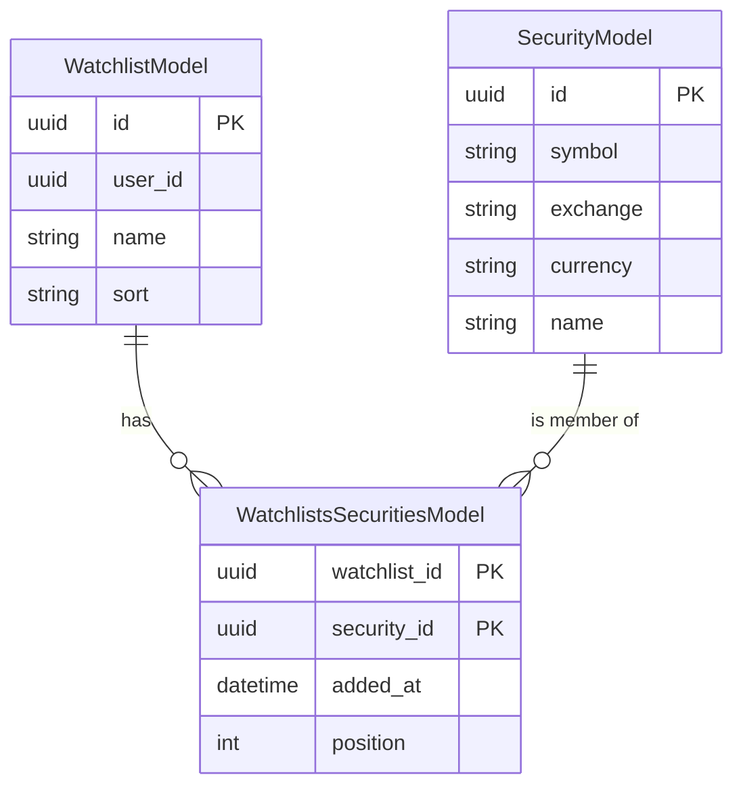
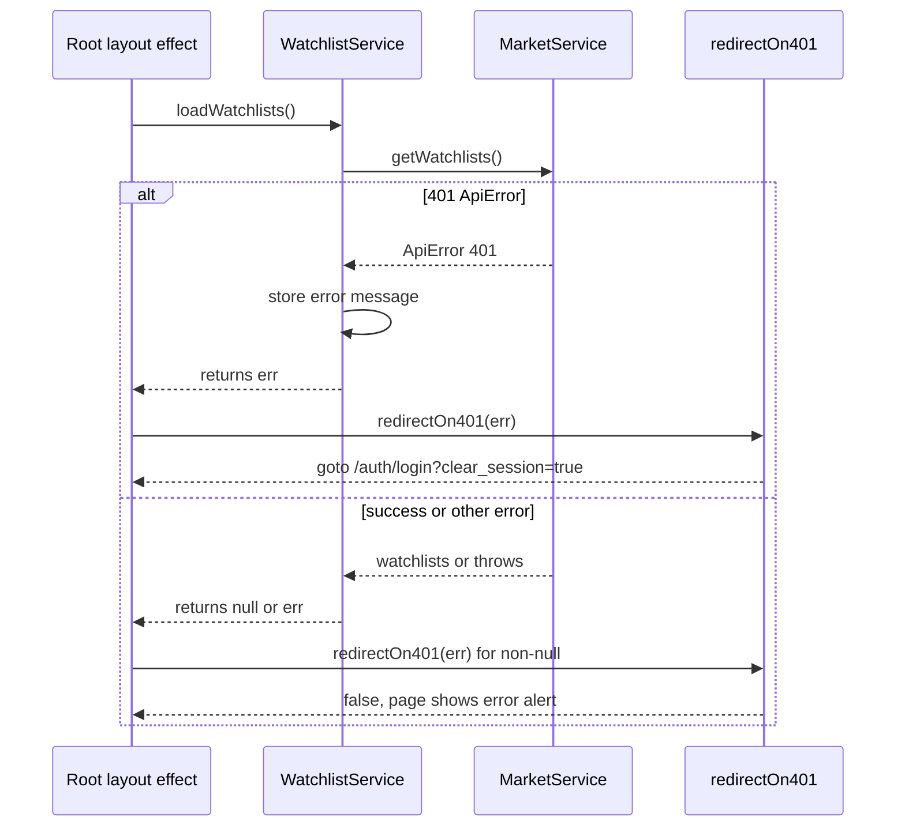

# Watchlist, Portfolio & Valuation Surfaces

This page covers three related user-facing surfaces:

- **Watchlists** — a user's named lists of securities, each with a persisted sort mode and a manually reorderable security order.
- **Portfolios** — named groupings of accounts, created by bulk-selecting accounts and listed on `/portfolios`.
- **Security valuations** — a per-user fair-value range (`lower_bound`/`upper_bound`) for a security, rendered on watchlist rows, the security detail fundamentals sidebar, and holdings.

Watchlists and valuations are owned by the `market` domain (`src/market/`). Portfolios are owned by the `account` domain (`src/account/`), not `market`, even though the frontend clients live side by side under `frontend/src/lib/api/`.

## Watchlist data model

A watchlist has a name, a persisted `sort` mode, and a set of securities joined through an explicit membership (association) table that also carries per-membership metadata.



`WatchlistModel` (table `market_watchlists`) carries `sort`, defaulting to `custom`, and a `UniqueConstraint("user_id", "name")` so a user cannot have two lists with the same name. `WatchlistsSecuritiesModel` (table `market_watchlists_securities`) is a composite-key association table carrying `added_at` (timezone-aware) and `position`. Both membership columns were added by migration `4c2ed77e7738`, which backfilled existing rows deterministically (`row_number() OVER (PARTITION BY watchlist_id ORDER BY security_id)`) and then enforced `NOT NULL`. `SecurityModel` (table `market_securities`) has a `UniqueConstraint("symbol", "exchange")`.

### Sort mode vs. manual order — two separate mechanisms

The two orderings are deliberately distinct and must not be conflated:

- **Per-list security sort** (`watchlists.sort`) is a **persisted column** on the watchlist. It is one of the `WatchlistSortMode` enum values (`custom`, `name_asc`, `price_change_desc`, `price_change_asc`, `date_added`, `date_added_asc`) and is changed per list via `PATCH /market/watchlists/{id}`.
- **List order** (the order watchlists appear in the sidebar and `/watchlists`) is a **user preference** (`watchlist_order`), not a column. It is stored through the user-preferences service, not in `market_watchlists`.

The `custom` sort mode is the one that consults the membership `position`; every other mode ignores `position` and sorts in the frontend.

## Backend watchlist operations

All watchlist endpoints are under `/market/watchlists` and are declared in `src/market/router.py`; each depends on `current_user`, and all repository work is scoped to that user's id.

| Method | Path | Behavior |
| --- | --- | --- |
| `GET` | `/market/watchlists` | All watchlists for the user, enriched. |
| `POST` | `/market/watchlists` | Create; duplicate name → `409`. |
| `PATCH` | `/market/watchlists/{id}` | Rename and/or set sort. |
| `DELETE` | `/market/watchlists/{id}` | Delete; `204`. |
| `GET` | `/market/watchlists/{id}/securities` | Paginated members (sorted by symbol). |
| `POST` | `/market/watchlists/{id}/securities/{securityId}` | Add member. |
| `DELETE` | `/market/watchlists/{id}/securities/{securityId}` | Remove member. |
| `PUT` | `/market/watchlists/{id}/securities/order` | Rewrite manual order. |
| `POST` | `/market/watchlists/securities/{securityId}` | Add to the user's `Default` list. |
| `DELETE` | `/market/watchlists/securities/{securityId}` | Remove from the `Default` list. |

The `Default` list is identified **by name** (`name == "Default"`), not by a flag; `add_security` lazily creates it (racing safe on duplicate via a rollback-and-reload path), and `remove_security` reports a not-found error when no `Default` exists.

### Repository invariants (load-bearing)

`WatchlistRepository` (abstract in `src/market/repository.py`) documents invariants its SQLAlchemy implementation (`SqlAlchemyWatchlistRepository`) enforces:

1. **Every operation is scoped to the owning user.** `_get_owned` filters by both `id` and `user_id`; `get_securities` validates ownership before listing.
2. **A missing watchlist and a foreign watchlist are reported as the same error.** `_get_owned` raises `WatchlistNotFoundError` in both cases, so a caller cannot distinguish "does not exist" from "belongs to someone else".
3. **`position` is authoritative for `custom` sort.** `set_security_order` rewrites positions to `0..n-1` in the given array order.

The repository does not rely on the ORM `secondary` relationship for reads or writes of membership metadata: the `secondary` relationship cannot order by or carry association columns, so `_load_memberships` queries the association table explicitly joined to securities (ordered by `position`, then `added_at`), and `add_security_to_watchlist` performs an explicit `INSERT` to set `position`/`added_at`, then reloads with `populate_existing=True` because the loaded ORM collection would otherwise be stale. New members are appended at `max(position) + 1`; this is documented as not concurrency-safe under simultaneous adds, which is acceptable for single-user watchlists.

### Reorder validation

`PUT /market/watchlists/{id}/securities/order` sends `{ security_ids: [...] }`. `set_security_order` validates that the payload is an **exact permutation** of the current membership *before writing anything*: the length check plus `set` comparison rejects duplicates or unknown ids, raising `WatchlistOrderIdentityError`, which the router maps to `422`. A rejected payload leaves every position untouched. If the requested order differs from the current order the positions are updated and committed; if it is identical, no write occurs.

<!-- openwiki: mermaid parse failed and this diagram was converted to a text fence so it does not break rendering. Fix the diagram source and restore the mermaid fence. Parser error: Heuristic: an unescaped angle bracket inside a label breaks rendering; rephrase the label. -->
```text
flowchart TD
    A["PUT .../order with security_ids"] --> B["_get_owned: 404 if missing or foreign"]
    B --> C["Load current memberships"]
    C --> D{"length equal and sets equal"}
    D -->|no| E["raise WatchlistOrderIdentityError -> 422, no writes"]
    D -->|yes| F{"requested order equals current order"}
    F -->|yes| G["no write"]
    F -->|no| H["UPDATE position = index for each id, commit"]
    G --> I["return enriched WatchlistRead"]
    H --> I
```

### Price-enrichment contract on reads

Watchlist reads return each security enriched with `current_price`, `daily_price_change`, and `daily_price_change_percent`. Enrichment is produced by `_fetch_price_metrics`, which runs **one batched window query** for all securities on the read: it partitions `market_prices` by `security_id`, orders by `date DESC, id DESC`, keeps `row_number() <= 2` (the latest two closes per security), then computes the change and percent from those two closes (percent is `None` when the prior close is `0`). A security with only one close gets `current_price` but no change. Securities with no price rows are omitted from the metrics map and are returned un-enriched.

`_enrich_watchlists` collects securities across *all* requested watchlists into a single metric query, so `GET /market/watchlists` costs one window query regardless of how many lists the user has. `get_securities` (the paginated member endpoint) uses the same batched `_enrich_securities` path.

## Frontend: the layout-owned watchlist service

`WatchlistService` (`frontend/src/lib/components/watchlist/watchlistService.svelte.ts`) is a Svelte context service instantiated once by the root layout (`setWatchlistService()` in `+layout.svelte`) and read by pages and the sidebar via `getWatchlistService()`. It holds `$state` for `watchlists`, `activeWatchlistId`, `isLoading`, and a shared `error`, plus `$derived` `defaultWatchlist` (found by `name === 'Default'`) and `defaultWatchlistSecurities`.

**Single owner of the initial fetch.** The layout's `$effect` calls `watchlistService.loadWatchlists()`; `$effect` never runs during SSR, so this is browser-only. `/watchlists`' `+page.server.ts` returns `{ watchlists: [] }` and does *not* await the list — this keeps the page shell rendering instantly (titlebar, actions, skeleton rows) while the shared fetch resolves. The page's `data.watchlists` seeding guard is therefore inert in normal flow, kept only for direct/programmatic renders.

### 401 redirect seam

`loadWatchlists` returns the caught error (after storing its message in `error`) instead of throwing, so the caller can route a 401 through the shared async-data seam. The layout checks `if (err !== null)` and calls `redirectOn401(err)` (`$lib/api/async-data.ts`), which navigates to `/auth/login?clear_session=true` on an `ApiError` with `status === 401`. This is distinct from the server-load pattern used by `/portfolios`, where the `+page.server.ts` `load` catches the `ApiError`, calls `deleteAuthCookie(cookies)`, and `throw redirect(303, '/auth/login?clear_session=true')`.



**Mutation error lifecycle.** Every mutating method (`addSecurity`, `removeSecurity`, `createWatchlist`, `renameWatchlist`, `setSort`, `deleteWatchlist`, `addSecurityToWatchlist`, `removeSecurityFromWatchlist`, `reorderSecurities`, `toggleSecurity`) clears `error` at the start and stores the message via `handleError` on failure. The three removal/reorder/toggle methods first call `loadWatchlists` to resync — and because the resync itself clears `error` at its start, `handleError` is invoked *after* the resync so the failure message stays visible.

### Sidebar vs. `/watchlists` divergence

The sidebar (`app-sidebar-watchlist.svelte`) and the `/watchlists` page both read the same `WatchlistService.watchlists` and the same `watchlist_order`, but they diverge in ordering and collapsing:

- **Sort mode is ignored by the sidebar.** The sidebar iterates `watchlist.securities` in the order the backend returned (which is `position`/`added_at` order), not through `sortSecurities`. So a list set to `name_asc` renders alphabetized rows on `/watchlists` but insertion order in the sidebar.
- **Collapse state** is separate (`collapsed_watchlist_ids`) and sidebar-only; toggling it patches that preference.
- **Keyboard shortcuts (1–9, 0)** are sidebar-only and map to the first ten securities of the `Default` list.

Both surfaces order the *lists* themselves with `sortWatchlistsByOrder(watchlists, watchlistOrder)`, which sorts ids present in the order array to their index and appends any unlisted watchlists at the end in original relative order.

## Frontend: `/watchlists` page

The page (`frontend/src/routes/watchlists/+page.svelte`) renders one `<section>` per watchlist with a header (name, member count, reorder toggle for custom lists, a sort dropdown, add/rename/delete actions) and a row list.

### Row rendering and shared layout

Rows are laid out by the static `WATCHLIST_ROW_DATA_TRACKS` grid template (a single complete Tailwind literal, because the JIT compiler needs whole class names), which reserves tracks for security, date added (`md`+), valuation (`md`+), price, and change. The date and valuation cells are always rendered (showing `-`/`—` when data is absent) so the price and pill columns stay aligned on every row. Below `md` the date track is dropped from the template and its cell hidden, keeping the remaining tracks aligned.

### Sort dropdown and normalization

The dropdown offers exactly six options. `normalizeWatchlistSort` narrows any persisted (or absent) value to the `WatchlistSort` union, falling back to `custom` for unknown keys — including stale ones. `sortSecurities` implements the modes: `custom` sorts ascending `position`; `name_asc`/`name_desc` use `localeCompare` on name; `price_change_desc`/`price_change_asc` sort on `daily_price_change_percent` with nulls last; `date_added`/`date_added_asc` compare `added_at` strings. It never mutates the input array and falls back to `position` order for absent or unrecognised keys. Selecting an option calls `setSort`, which persists via `PATCH` and swaps in the server-returned watchlist (the response carries both the new `sort` and the freshly ordered securities), so no optimistic local reorder is applied.

### Two independent reorder flows

The page has two reorder modes with distinct persistence targets:

1. **Watchlist reorder** (top-level `Reorder` button) — enables drag handles on each section. Dropping or pressing arrow keys on a handle calls `moveWatchlist`, which applies the new order optimistically and persists `watchlist_order` through `userPreferencesService.patchPreferences`. On failure both local snapshots (`watchlistOrder` and `watchlistService.watchlists`) are restored so no stale order survives.
2. **Security reorder** (per-list grip toggle, offered only when the list's sort is `custom`) — enables per-row drag handles. Drops/arrow keys call `moveSecurity`, which computes the new id order and calls `watchlistService.reorderSecurities`. That method applies the order optimistically (rebuilding the array in `securityIds` order with each `position` rewritten to its index, since custom mode renders through `sortSecurities`) before the PUT resolves, then replaces it with the server payload. It is disabled while watchlist reorder mode is on.

The `custom`-only restriction is enforced by `isSecurityReorderEnabled`; other sort modes do not offer a security reorder toggle because row order would not map onto `position`.

### Keyboard reorder and focus restoration

Both flows share `handleReorderKeydown` (ArrowUp/ArrowDown shift one slot, always consuming the key but no-op moving past either end) and `moveItem` (pure index shift, never mutating the input). After a move, `restoreHandleFocus` re-focuses the moved handle once the reorder render has been applied — but only when the DOM move actually dropped focus to `<body>`, never stealing focus from a control the user has since moved to. This exists because Svelte's keyed `{#each}` reconciliation detaches and re-attaches the row when its item shifts to a later index, dropping focus; since Svelte delegates `keydown` to the root and dispatches by `event.target`, a body-focused handle would never see the next arrow key and the list would become unwalkable after the first direction switch. Moves are announced through an `aria-live` status region.

Row selection is focus-driven and keyed by **security id** (not row index), so the highlight follows the same security through reorder and sort changes and survives blur. Watchlist-level selection (for the reorder grab handle) is a single id.

## Portfolios

Portfolios group accounts and are managed by the `account` domain.

- **Create** happens on the accounts list, not `/portfolios`: `create-portfolio-modal.svelte` posts `{ name, accounts }` (the selected account ids) through `portfolioClient.createPortfolio`. `PortfolioService.create_portfolio` validates that every account id belongs to the user before creating.
- **`/portfolios`** (`+page.svelte`) is a list/manage view. Its server load calls `portfolioClient.getPortfolios(token)` with the `auth_token` cookie; on a 401 `ApiError` it deletes the cookie and redirects to login, on other `ApiError`s it throws `error(status, message)`, and on unexpected errors a `500`. The page renders an empty state or one `PortfolioListItem` per portfolio; rename (`PATCH`) and delete (`DELETE`) are optimistic against `localPortfolios`. Each item links to `/holdings?portfolio_id=<id>`.

Portfolio endpoints in `src/account/router.py` (`/portfolios`) use `current_user` and, for update/delete/account-sync, `authorization_api.check_entity_owned_by_user` — a different ownership idiom from the watchlist repository's "foreign looks like missing" rule.

## Security valuation tracking

A valuation is a per-user fair-value range for a security. `SecurityValuationModel` (table `market_security_valuations`) has `user_id`, `security_id` (FK to `market_securities`, `ON DELETE CASCADE`), `lower_bound`, `upper_bound`, `created_at`, `updated_at`, and a `UniqueConstraint("user_id", "security_id")` plus a matching index. This enforces at most one valuation per user per security, which is what makes `upsert` meaningful.

`SqlAlchemySecurityValuationRepository` implements:

- `get_by_security_and_user` — returns `None` when absent.
- `upsert` — updates bounds and `updated_at` if a row exists, else inserts; the uniqueness constraint is the concurrency backstop.
- `get_batch_by_user_and_securities` — one `IN` query for a list of security ids, scoped to the user; returns `[]` for an empty id list.

Router endpoints:

| Method | Path | Behavior |
| --- | --- | --- |
| `GET` | `/market/securities/{id}/valuation` | Single valuation; `404` when absent. |
| `PUT` | `/market/securities/{id}/valuation` | Upsert bounds. |
| `GET` | `/market/securities/valuation/batch?security_ids=...` | Batch fetch. |
| `POST` | `/market/securities/valuation/batch` | Batch fetch (`{ security_ids }`). |

### Where valuations surface

- **Watchlist rows**: `/watchlists` derives the unique security ids across all visible lists and calls `marketService.getValuationsBatch(ids)` in an `$effect` (skipping the call when there are no ids). Results are indexed by `security_id`; failures are non-fatal and rows fall back to `—` via `formatValuationRange`.
- **Security detail fundamentals sidebar**: `fundamentals-group.svelte` fetches the single valuation with `valuationClient.getValuation(securityId)` (which maps a `404` to `null`) and edits it through `valuation-modal.svelte`; the same group owns the `show_valuation_band` overlay preference.
- **Holdings**: valuation data flows into the holdings table's `valuation_range` column.

The batch helper exists on both `valuationClient.getBatchValuations` and `marketService.getValuationsBatch`; the watchlist page uses the `marketService` one.

## Sorting/ordering summary

| Concern | Storage | Owner |
| --- | --- | --- |
| Per-list security sort mode | `market_watchlists.sort` column | market repository |
| Manual security order within a list | `market_watchlists_securities.position` | market repository |
| Membership timestamp | `market_watchlists_securities.added_at` | market repository |
| Order of the lists themselves | `watchlist_order` user preference | user-preferences service |
| Sidebar collapse state | `collapsed_watchlist_ids` user preference | user-preferences service |

## Focused tests

- `frontend/src/lib/components/watchlist/watchlist-utils.test.ts` — `sortSecurities` for every mode plus fallback and no-mutation; `sortWatchlistsByOrder` (unlisted appended, unknown ids ignored, missing order → copy); `moveItem` no-ops and copy semantics; `handleReorderKeydown` boundary and direction-switch behavior; `normalizeWatchlistSort`.
- `frontend/src/routes/watchlists/page.svelte.test.ts` — rendering and sections, per-watchlist sorting and persistence, watchlist drag/keyboard reorder, security reorder in custom mode (including the direction-switch focus regression), valuation column rendering and batching, instant shell with async list, and the shared error lifecycle. All API calls are mocked.
- `frontend/src/routes/portfolios/page.server.test.ts` — the server load's success path, 401 cookie-delete redirect, non-401 `ApiError` propagation, and 500 fallback.
- `frontend/src/lib/api/valuationClient.test.ts` — `getValuation` success and 404→null, `saveValuation` PUT body, `getBatchValuations` POST.

Run frontend tests with `./scripts/agent-test frontend/...` or `docker compose exec frontend npm run test:run`. All API calls in tests must be mocked.

## Related pages

- [Domain Architecture](../architecture/domains.md) — how the `market` and `account` domains are wired.
- [Frontend Architecture](../architecture/frontend.md) — SvelteKit structure, context services, and the layout-owned fetch pattern.
- [User Preferences](../concepts/user-preferences.md) — the `watchlist_order` and `collapsed_watchlist_ids` preferences.
- [Accounts & Holdings Views](accounts-and-holdings-views.md) — where portfolios are created and where valuations feed the holdings table.
- [Market Data & Indicators](market-data-and-indicators.md) — the price data underlying watchlist enrichment.
